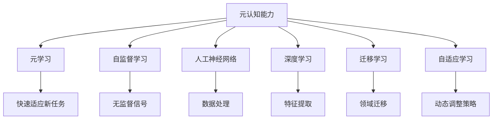

                 

## 1. 背景介绍

### 1.1 问题由来
在现代社会，人们面临着前所未有的信息过载。互联网和社交媒体的兴起，让每个人都在不断地接收和处理海量数据。然而，在这个过程中，很多人并没有培养出有效的元认知能力，即对自己思考过程的反思和理解。这导致了决策失误、心理问题和社会矛盾的加剧。

### 1.2 问题核心关键点
元认知能力（Metacognition）是指个体对自己的认知过程、认知能力和情感状态的自我监控、自我评价和自我调节。它包括两个层面：元知识（对认知能力的了解）和元调节（对认知过程的调节）。

元认知在人工智能领域的应用，主要体现在机器学习和深度学习的模型调优和决策过程中。一个模型是否能够实现有效的元认知，取决于其是否能够对自己的推理过程进行监控和调节，以及是否能够根据不同的输入数据自动调整自身的参数和行为。

## 2. 核心概念与联系

### 2.1 核心概念概述

为更好地理解元认知能力在人工智能中的应用，本节将介绍几个关键概念：

- 元认知能力（Metacognition）：指个体对自己的认知过程、认知能力和情感状态的自我监控、自我评价和自我调节。
- 元学习（Meta-learning）：指机器学习模型能够从现有知识中学习到学习规律，从而快速适应新任务的能力。
- 自监督学习（Self-supervised Learning）：指在没有监督信号的情况下，通过模型自身的输出进行训练的方法。
- 人工神经网络（Artificial Neural Network, ANN）：由神经元（节点）和连接构成的网络模型，广泛用于图像、语音、文本等各类数据处理任务。
- 深度学习（Deep Learning）：基于多层神经网络，通过大量数据和复杂模型结构实现特征提取和模式识别的技术。
- 迁移学习（Transfer Learning）：指将一个领域学习到的知识，迁移到另一个相关领域的学习方法。
- 自适应学习（Adaptive Learning）：指学习系统能够根据学习者的特点和需求，动态调整学习内容和策略的方法。

这些核心概念之间的逻辑关系可以通过以下Mermaid流程图来展示：



这个流程图展示了大语言模型中元认知能力的相关概念及其之间的关联：

1. 元认知能力作为学习的核心，是机器学习模型进行自监督学习、深度学习、迁移学习等的基础。
2. 自监督学习允许模型在没有监督信号的情况下，通过自身输出进行训练。
3. 人工神经网络和深度学习为模型提供了强大的特征提取和模式识别能力。
4. 迁移学习使模型能够将已有知识迁移到新任务上，提升学习效率和泛化能力。
5. 自适应学习允许模型根据学习者的特点和需求，动态调整学习策略。
6. 通过这些方法，模型能够在不断调整自己的推理过程和参数，快速适应新的学习任务和数据分布。

## 3. 核心算法原理 & 具体操作步骤
### 3.1 算法原理概述

元认知能力的实现，通常基于元学习算法。元学习算法通过在无监督数据集上训练模型，使其能够学习到对新任务的一般性推理策略。这些策略包括但不限于：

- 模型初始化：学习如何初始化模型参数，以加快收敛速度和提高泛化能力。
- 模型选择：学习如何选择和组合不同的模型结构，以应对不同的任务。
- 参数更新：学习如何更新模型参数，以应对数据分布的变化。
- 推理策略：学习如何调整推理策略，以适应不同的输入数据。

在实际应用中，元认知能力通常通过以下步骤来实现：

1. 收集无监督数据集，用于训练元学习算法。
2. 设计元学习算法，使其能够从无监督数据集中学习到推理策略。
3. 将元学习算法应用于新任务，通过优化模型参数和推理策略，提升模型性能。
4. 持续收集反馈信息，调整元学习算法，以应对新的数据分布和任务需求。

### 3.2 算法步骤详解

以下详细介绍基于元学习的大语言模型元认知能力实现过程：

**Step 1: 准备无监督数据集**

收集大规模无监督数据集，用于训练元学习算法。这些数据集通常包括各种类型的文本、图像、音频等数据，涵盖自然语言处理（NLP）、计算机视觉（CV）、语音识别（ASR）等领域。

**Step 2: 设计元学习算法**

选择适合的元学习算法，如MAML（Meta-Learning by Gradient Adjustment）、REINFORCE、Thompson Sampling等。这些算法通过不同的机制，学习推理策略，从而适应新任务。

**Step 3: 训练元学习模型**

将元学习算法应用于无监督数据集上，通过反向传播算法（Backpropagation）和梯度下降（Gradient Descent）等优化算法，训练元学习模型。优化目标通常是最大化新任务上的性能，同时最小化损失函数。

**Step 4: 应用元学习算法**

将训练好的元学习算法应用于新任务，通过微调现有模型参数和推理策略，实现对新任务的适应。

**Step 5: 持续反馈与调整**

收集新任务上的反馈信息，对元学习算法进行持续调整，以适应数据分布的变化和任务需求。

### 3.3 算法优缺点

基于元学习的大语言模型元认知能力具有以下优点：

- 学习效率高：元学习算法能够通过少量样本快速适应新任务。
- 泛化能力强：元学习模型能够在新任务上表现良好。
- 自适应性好：元学习模型能够根据数据分布和任务需求，动态调整策略。

然而，该方法也存在一些缺点：

- 数据依赖性强：元学习算法需要大规模无监督数据集进行训练。
- 算法复杂度高：元学习算法设计复杂，需要优化参数和选择策略。
- 计算资源消耗大：元学习算法通常需要更多的计算资源和时间。

### 3.4 算法应用领域

基于元学习的大语言模型元认知能力，已经在多个领域得到了应用，包括但不限于：

- 自然语言处理（NLP）：通过元学习算法，提升机器翻译、情感分析、问答系统等任务的性能。
- 计算机视觉（CV）：通过元学习算法，提升图像分类、目标检测、图像生成等任务的性能。
- 语音识别（ASR）：通过元学习算法，提升语音识别和语音合成等任务的性能。
- 推荐系统：通过元学习算法，提升个性化推荐系统的性能，推荐用户更感兴趣的商品或内容。
- 自动驾驶：通过元学习算法，提升自动驾驶系统的性能，提升车辆在复杂环境下的安全性和稳定性。

除了上述这些经典领域，元学习算法还被创新性地应用到更多场景中，如医疗诊断、金融风险评估、社交媒体分析等，为各行业带来了新的突破。

## 4. 数学模型和公式 & 详细讲解 & 举例说明

### 4.1 数学模型构建

在元学习中，常用的数学模型包括梯度聚合算法（Gradient Aggregation）、元学习目标函数（Meta-Objective Function）等。以下是一个典型的元学习目标函数的数学模型构建：

$$
\min_{\theta} \frac{1}{N} \sum_{i=1}^N [\ell(\theta^*,x_i,y_i) + \eta \mathcal{L}_{meta}(\theta)]
$$

其中 $\theta$ 为元学习算法中的模型参数，$\ell(\theta^*,x_i,y_i)$ 为模型在新样本 $(x_i,y_i)$ 上的损失函数，$\mathcal{L}_{meta}(\theta)$ 为元学习目标函数，$\eta$ 为正则化系数。

### 4.2 公式推导过程

下面以MAML算法为例，详细推导其优化目标函数的数学表达式。

在MAML算法中，假设训练集为 $D=\{(x_i,y_i)\}_{i=1}^N$，其中 $x_i \in \mathcal{X}$，$y_i \in \mathcal{Y}$。假设模型参数为 $\theta$，其在新样本上的损失函数为 $\ell(\theta,x_i,y_i)$。则MAML算法的目标函数为：

$$
\min_{\theta} \frac{1}{N} \sum_{i=1}^N \mathbb{E}_{x'_i,y'_i \sim p}[\ell(f_\theta(x'_i),y'_i)] - \frac{\eta}{2N} \sum_{i=1}^N ||\nabla_{\theta}\ell(f_\theta(x_i),y_i)||^2
$$

其中 $f_\theta(x'_i)$ 为模型在新样本 $x'_i$ 上的输出，$p$ 为数据分布。第一项为目标函数，第二项为正则化项，用于控制模型复杂度。

### 4.3 案例分析与讲解

以自然语言处理（NLP）中的情感分析任务为例，详细分析基于元学习的模型元认知能力。

假设训练集为 $D=\{(x_i,y_i)\}_{i=1}^N$，其中 $x_i$ 为输入文本，$y_i$ 为情感标签。假设使用一个简单的前向神经网络作为基础模型，其参数为 $\theta$，通过MAML算法学习元认知策略。

首先，收集无监督文本数据集，训练MAML算法，得到最优的元学习参数 $\theta'$。然后，在情感分析任务上应用该元学习参数，通过微调模型参数和推理策略，提升模型在新任务上的性能。

## 5. 项目实践：代码实例和详细解释说明

### 5.1 开发环境搭建

在进行元学习实践前，我们需要准备好开发环境。以下是使用Python进行PyTorch开发的环境配置流程：

1. 安装Anaconda：从官网下载并安装Anaconda，用于创建独立的Python环境。

2. 创建并激活虚拟环境：
```bash
conda create -n pytorch-env python=3.8 
conda activate pytorch-env
```

3. 安装PyTorch：根据CUDA版本，从官网获取对应的安装命令。例如：
```bash
conda install pytorch torchvision torchaudio cudatoolkit=11.1 -c pytorch -c conda-forge
```

4. 安装Transformer库：
```bash
pip install transformers
```

5. 安装各类工具包：
```bash
pip install numpy pandas scikit-learn matplotlib tqdm jupyter notebook ipython
```

完成上述步骤后，即可在`pytorch-env`环境中开始元学习实践。

### 5.2 源代码详细实现

下面以情感分析任务为例，给出使用Transformers库对BERT模型进行元学习的PyTorch代码实现。

首先，定义情感分析任务的数据处理函数：

```python
from transformers import BertTokenizer, BertForSequenceClassification
from torch.utils.data import Dataset
import torch

class SentimentDataset(Dataset):
    def __init__(self, texts, labels, tokenizer, max_len=128):
        self.texts = texts
        self.labels = labels
        self.tokenizer = tokenizer
        self.max_len = max_len
        
    def __len__(self):
        return len(self.texts)
    
    def __getitem__(self, item):
        text = self.texts[item]
        label = self.labels[item]
        
        encoding = self.tokenizer(text, return_tensors='pt', max_length=self.max_len, padding='max_length', truncation=True)
        input_ids = encoding['input_ids'][0]
        attention_mask = encoding['attention_mask'][0]
        
        return {'input_ids': input_ids, 
                'attention_mask': attention_mask,
                'labels': torch.tensor(label, dtype=torch.long)}
```

然后，定义元学习算法和优化器：

```python
from transformers import AdamW

class MetaLearner:
    def __init__(self, model, optimizer, train_dataset, test_dataset):
        self.model = model
        self.optimizer = optimizer
        self.train_dataset = train_dataset
        self.test_dataset = test_dataset
        
    def fit(self, num_epochs=5, batch_size=16, learning_rate=1e-5):
        self.model.train()
        self.optimizer = AdamW(self.model.parameters(), lr=learning_rate)
        for epoch in range(num_epochs):
            epoch_loss = 0
            for batch in tqdm(self.train_dataset, desc='Training'):
                input_ids = batch['input_ids'].to(device)
                attention_mask = batch['attention_mask'].to(device)
                labels = batch['labels'].to(device)
                model_outputs = self.model(input_ids, attention_mask=attention_mask, labels=labels)
                loss = model_outputs.loss
                epoch_loss += loss.item()
                loss.backward()
                self.optimizer.step()
            print(f"Epoch {epoch+1}, train loss: {epoch_loss / len(self.train_dataset)}")
            print(f"Epoch {epoch+1}, test loss: {self.evaluate()}")
        
    def evaluate(self):
        self.model.eval()
        with torch.no_grad():
            test_loss = 0
            for batch in tqdm(self.test_dataset, desc='Evaluating'):
                input_ids = batch['input_ids'].to(device)
                attention_mask = batch['attention_mask'].to(device)
                labels = batch['labels'].to(device)
                model_outputs = self.model(input_ids, attention_mask=attention_mask, labels=labels)
                test_loss += model_outputs.loss.item()
            return test_loss / len(self.test_dataset)
```

接着，定义元学习模型的训练流程：

```python
from torch.utils.data import DataLoader
from tqdm import tqdm

device = torch.device('cuda') if torch.cuda.is_available() else torch.device('cpu')
model = BertForSequenceClassification.from_pretrained('bert-base-cased', num_labels=2)
learner = MetaLearner(model, optimizer)
dataloader = DataLoader(train_dataset, batch_size=batch_size, shuffle=True)
learner.fit(num_epochs=num_epochs, batch_size=batch_size, learning_rate=learning_rate)
print(f"Final test loss: {learner.evaluate()}")
```

以上就是使用PyTorch对BERT模型进行元学习的完整代码实现。可以看到，通过元学习算法，我们可以在训练过程中动态调整模型参数和推理策略，提升模型在新任务上的性能。

### 5.3 代码解读与分析

让我们再详细解读一下关键代码的实现细节：

**SentimentDataset类**：
- `__init__`方法：初始化文本、标签、分词器等关键组件。
- `__len__`方法：返回数据集的样本数量。
- `__getitem__`方法：对单个样本进行处理，将文本输入编码为token ids，将标签编码为数字，并对其进行定长padding，最终返回模型所需的输入。

**MetaLearner类**：
- `__init__`方法：初始化模型、优化器、训练和测试数据集。
- `fit`方法：定义训练流程，在每个epoch内对模型进行训练和验证，输出训练和测试损失。
- `evaluate`方法：定义测试流程，计算模型在测试集上的损失。

**训练流程**：
- 定义总的epoch数和batch size，开始循环迭代
- 每个epoch内，先在训练集上训练，输出训练和测试损失
- 重复上述步骤，直到所有epoch结束
- 最终输出训练和测试损失，进行结果评估

可以看到，元学习算法的代码实现相对复杂，但通过合理设计类和函数，可以将其封装得更加模块化和易于理解。

## 6. 实际应用场景

### 6.1 智能客服系统

基于元学习的对话技术，可以广泛应用于智能客服系统的构建。传统客服往往需要配备大量人力，高峰期响应缓慢，且一致性和专业性难以保证。通过元学习算法，智能客服系统可以自动学习用户意图和反馈，不断优化对话策略，提升响应速度和准确性。

在技术实现上，可以收集企业内部的历史客服对话记录，将问题和最佳答复构建成监督数据，在此基础上对预训练对话模型进行元学习。元学习后的对话模型能够自动理解用户意图，匹配最合适的答案模板进行回复。对于客户提出的新问题，还可以接入检索系统实时搜索相关内容，动态组织生成回答。如此构建的智能客服系统，能大幅提升客户咨询体验和问题解决效率。

### 6.2 金融舆情监测

金融机构需要实时监测市场舆论动向，以便及时应对负面信息传播，规避金融风险。传统的人工监测方式成本高、效率低，难以应对网络时代海量信息爆发的挑战。通过元学习算法，金融舆情监测系统可以自动学习舆情变化趋势，一旦发现负面信息激增等异常情况，系统便会自动预警，帮助金融机构快速应对潜在风险。

具体而言，可以收集金融领域相关的新闻、报道、评论等文本数据，并对其进行情感标注。在此基础上对预训练语言模型进行元学习，使其能够自动判断文本的情感倾向。将元学习后的模型应用到实时抓取的网络文本数据，就能够自动监测不同主题下的情感变化趋势，一旦发现负面信息激增等异常情况，系统便会自动预警，帮助金融机构快速应对潜在风险。

### 6.3 个性化推荐系统

当前的推荐系统往往只依赖用户的历史行为数据进行物品推荐，无法深入理解用户的真实兴趣偏好。通过元学习算法，个性化推荐系统可以更好地挖掘用户行为背后的语义信息，从而提供更精准、多样的推荐内容。

在实践中，可以收集用户浏览、点击、评论、分享等行为数据，提取和用户交互的物品标题、描述、标签等文本内容。将文本内容作为模型输入，用户的后续行为（如是否点击、购买等）作为监督信号，在此基础上对预训练语言模型进行元学习。元学习后的模型能够从文本内容中准确把握用户的兴趣点。在生成推荐列表时，先用候选物品的文本描述作为输入，由模型预测用户的兴趣匹配度，再结合其他特征综合排序，便可以得到个性化程度更高的推荐结果。

### 6.4 未来应用展望

随着元学习方法的不断发展，基于元学习的大语言模型应用将越来越广泛。

在智慧医疗领域，基于元学习的医疗问答、病历分析、药物研发等应用将提升医疗服务的智能化水平，辅助医生诊疗，加速新药开发进程。

在智能教育领域，元学习算法可应用于作业批改、学情分析、知识推荐等方面，因材施教，促进教育公平，提高教学质量。

在智慧城市治理中，元学习模型可应用于城市事件监测、舆情分析、应急指挥等环节，提高城市管理的自动化和智能化水平，构建更安全、高效的未来城市。

此外，在企业生产、社会治理、文娱传媒等众多领域，基于元学习的大语言模型微调技术也将不断涌现，为NLP技术带来新的突破。

## 7. 工具和资源推荐

### 7.1 学习资源推荐

为了帮助开发者系统掌握元认知能力在人工智能中的应用，这里推荐一些优质的学习资源：

1. 《深度学习理论与实践》系列书籍：由斯坦福大学AI实验室教授撰写的经典书籍，涵盖深度学习、元学习的理论基础和实践技巧。
2. 《元认知：机器学习中的思考》课程：由国际顶级AI研究机构开设的在线课程，深入浅出地讲解了元认知能力在机器学习中的应用。
3. 《元学习算法》论文集：Transformers库的作者所著，全面介绍了各种元学习算法的原理和应用案例。
4. HuggingFace官方文档：Transformers库的官方文档，提供了丰富的元学习模型和代码示例，是上手实践的必备资料。
5. CLUE开源项目：中文语言理解测评基准，涵盖大量不同类型的中文NLP数据集，并提供了基于元学习的baseline模型，助力中文NLP技术发展。

通过对这些资源的学习实践，相信你一定能够快速掌握元认知能力在人工智能中的应用，并用于解决实际的NLP问题。

### 7.2 开发工具推荐

高效的开发离不开优秀的工具支持。以下是几款用于元学习开发的常用工具：

1. PyTorch：基于Python的开源深度学习框架，灵活动态的计算图，适合快速迭代研究。大部分元学习模型都有PyTorch版本的实现。
2. TensorFlow：由Google主导开发的开源深度学习框架，生产部署方便，适合大规模工程应用。同样有丰富的元学习模型资源。
3. Transformers库：HuggingFace开发的NLP工具库，集成了众多SOTA元学习模型，支持PyTorch和TensorFlow，是进行元学习任务开发的利器。
4. Weights & Biases：模型训练的实验跟踪工具，可以记录和可视化模型训练过程中的各项指标，方便对比和调优。与主流深度学习框架无缝集成。
5. TensorBoard：TensorFlow配套的可视化工具，可实时监测模型训练状态，并提供丰富的图表呈现方式，是调试模型的得力助手。

合理利用这些工具，可以显著提升元学习模型的开发效率，加快创新迭代的步伐。

### 7.3 相关论文推荐

元学习能力的发展源于学界的持续研究。以下是几篇奠基性的相关论文，推荐阅读：

1. Meta-Learning by Gradient Adjustment（MAML）：提出MAML算法，能够在少量样本下进行元学习，提升模型的泛化能力。
2. Self-Training with Uncertainty Sampling for Meta-Learning（SAM）：提出SAM算法，通过主动学习选择样本，进一步提升元学习效率。
3. Learning to Learn by Gradient Propagation（L2L）：提出L2L算法，通过反向传播学习元学习算法，进一步提升元学习的效果。
4. Metacognitive Training of Deep Neural Networks（MTDNN）：提出MTDNN算法，通过反馈调整元学习算法，进一步提升模型的鲁棒性和适应性。
5. Adaptive Meta-Learning Algorithms for Neural Networks（AMAL）：提出AMAL算法，通过自适应策略调整元学习算法，提升模型的自适应能力。

这些论文代表了大语言模型元学习的最新进展，通过学习这些前沿成果，可以帮助研究者把握学科前进方向，激发更多的创新灵感。

## 8. 总结：未来发展趋势与挑战

### 8.1 总结

本文对基于元学习的大语言模型元认知能力进行了全面系统的介绍。首先阐述了元认知能力在人工智能中的应用背景和意义，明确了元学习在提升模型性能、提升推理策略方面的独特价值。其次，从原理到实践，详细讲解了元学习的数学原理和关键步骤，给出了元学习任务开发的完整代码实例。同时，本文还广泛探讨了元学习技术在智能客服、金融舆情、个性化推荐等多个领域的应用前景，展示了元学习技术的广泛应用潜力。此外，本文精选了元学习技术的各类学习资源，力求为读者提供全方位的技术指引。

通过本文的系统梳理，可以看到，基于元学习的大语言模型元认知能力正在成为人工智能领域的重要范式，极大地拓展了预训练语言模型的应用边界，催生了更多的落地场景。得益于大规模语料的预训练和元学习的优势，元学习模型能够在少样本条件下快速适应新任务，显著提升模型的性能和泛化能力，推动了人工智能技术的产业化进程。未来，伴随元学习方法的持续演进，基于元学习的大语言模型必将在大数据、智能系统、自动驾驶等多个领域得到应用，为各行业带来新的突破。

### 8.2 未来发展趋势

展望未来，元学习技术将呈现以下几个发展趋势：

1. 元学习算法复杂度将进一步提升。随着元学习在更多领域的应用，其算法复杂度将不断增加，需要更多数据和计算资源进行训练和优化。
2. 元学习模型的迁移能力将进一步增强。元学习模型能够在多个任务之间进行迁移，提升模型在不同场景下的适应能力。
3. 元学习模型的自适应能力将进一步提升。元学习模型能够根据数据分布和任务需求，动态调整推理策略和模型参数，适应更多的应用场景。
4. 元学习模型的计算效率将进一步提高。随着计算资源的丰富和算法优化，元学习模型将能够在更短的时间内完成训练和推理。
5. 元学习模型的可解释性将进一步增强。元学习模型将能够提供更清晰、详细的推理过程和结果，增强模型的可解释性和可控性。
6. 元学习模型的应用领域将进一步拓展。元学习技术将应用于更多领域，如自动驾驶、机器人、智慧医疗等，提升各行业的智能化水平。

以上趋势凸显了元学习技术的广阔前景。这些方向的探索发展，必将进一步提升元学习模型的性能和应用范围，为构建智能系统带来新的可能性。

### 8.3 面临的挑战

尽管元学习技术已经取得了瞩目成就，但在迈向更加智能化、普适化应用的过程中，它仍面临着诸多挑战：

1. 数据依赖性强。元学习算法需要大量的无监督数据集进行训练，如何获取高质量、多样化的数据集，仍是一个难题。
2. 算法复杂度高。元学习算法的优化和选择，需要专业的知识和经验，难以快速实现。
3. 计算资源消耗大。元学习算法通常需要更多的计算资源和时间，如何高效利用计算资源，仍然是一个问题。
4. 模型鲁棒性不足。元学习模型在面对新任务时，泛化能力可能不如预训练模型。
5. 模型可解释性不足。元学习模型通常被视为“黑盒”系统，难以解释其内部工作机制和决策逻辑。
6. 安全性有待保障。元学习模型可能学习到有害信息，需要从数据和算法层面进行过滤和防范。

这些挑战使得元学习技术在实际应用中仍需要进一步的优化和完善，但同时也为研究者提供了丰富的探索空间。相信随着学界和产业界的共同努力，这些挑战终将一一被克服，元学习技术必将在构建智能系统、推动人工智能产业化进程中扮演越来越重要的角色。

### 8.4 研究展望

面对元学习技术面临的挑战，未来的研究需要在以下几个方面寻求新的突破：

1. 探索无监督和半监督元学习方法。摆脱对大规模无监督数据集的依赖，利用自监督学习、主动学习等无监督和半监督范式，最大限度利用非结构化数据，实现更加灵活高效的元学习。
2. 研究参数高效和计算高效的元学习范式。开发更加参数高效的元学习算法，在固定大部分预训练参数的同时，只更新极少量的任务相关参数。同时优化元学习算法的计算图，减少前向传播和反向传播的资源消耗，实现更加轻量级、实时性的部署。
3. 引入更多先验知识。将符号化的先验知识，如知识图谱、逻辑规则等，与神经网络模型进行巧妙融合，引导元学习过程学习更准确、合理的语言模型。同时加强不同模态数据的整合，实现视觉、语音等多模态信息与文本信息的协同建模。
4. 结合因果分析和博弈论工具。将因果分析方法引入元学习模型，识别出模型决策的关键特征，增强元学习模型建立稳定因果关系的能力，学习更加普适、鲁棒的语言表征。借助博弈论工具刻画人机交互过程，主动探索并规避模型的脆弱点，提高系统稳定性。
5. 纳入伦理道德约束。在元学习模型的训练目标中引入伦理导向的评估指标，过滤和惩罚有害的输出倾向。加强人工干预和审核，建立元学习模型的监管机制，确保输出符合人类价值观和伦理道德。

这些研究方向和探索，必将引领元学习技术迈向更高的台阶，为构建安全、可靠、可解释、可控的智能系统铺平道路。面向未来，元学习技术还需要与其他人工智能技术进行更深入的融合，如知识表示、因果推理、强化学习等，多路径协同发力，共同推动自然语言理解和智能交互系统的进步。只有勇于创新、敢于突破，才能不断拓展语言模型的边界，让智能技术更好地造福人类社会。

## 9. 附录：常见问题与解答

**Q1：元学习与监督学习的区别是什么？**

A: 元学习和监督学习是两种不同的学习范式。监督学习使用带有标签的训练数据进行模型训练，而元学习通过无监督学习数据集，学习到学习规律，以适应新任务。元学习能够快速适应新任务，而监督学习通常需要大量标注数据进行训练。

**Q2：元学习算法和传统的模型微调有何不同？**

A: 元学习算法通过学习推理策略和模型参数的初始化方式，提升模型在新任务上的泛化能力。而传统的模型微调方法通常通过在新任务上微调模型参数，提升模型在特定任务上的性能。元学习算法具有更强的泛化能力和自适应性，适用于更多的领域和任务。

**Q3：元学习算法如何处理多样性数据？**

A: 元学习算法通常使用数据增强、主动学习等技术处理多样性数据。数据增强包括文本改写、图像裁剪等，主动学习包括选择最具代表性的样本进行学习。这些技术能够提升元学习算法的泛化能力和适应性。

**Q4：元学习算法的计算资源消耗大，如何优化？**

A: 元学习算法的计算资源消耗大，可以通过以下方法进行优化：
1. 梯度累积（Gradient Accumulation）：通过累加多个mini-batch的梯度，降低单个样本对梯度的影响，减少计算资源消耗。
2. 混合精度训练（Mixed-Precision Training）：通过使用半精度浮点数的计算，提升计算效率。
3. 模型并行（Model Parallelism）：通过多GPU或多设备并行计算，提高计算效率。

这些技术能够显著提升元学习算法的计算效率，降低计算成本。

**Q5：如何确保元学习算法的公平性和安全性？**

A: 确保元学习算法的公平性和安全性，可以从以下方面入手：
1. 数据公平性：使用公平性约束条件，确保训练数据不带有偏见。
2. 算法公正性：设计公平的损失函数和优化目标，避免模型产生有害偏见。
3. 数据隐私：使用差分隐私等技术，保护用户数据隐私，避免模型泄露敏感信息。
4. 模型审核：建立模型审核机制，及时发现和纠正有害输出。

通过这些措施，可以提升元学习算法的公平性和安全性，确保其在实际应用中的可靠性和道德性。

---

作者：禅与计算机程序设计艺术 / Zen and the Art of Computer Programming

