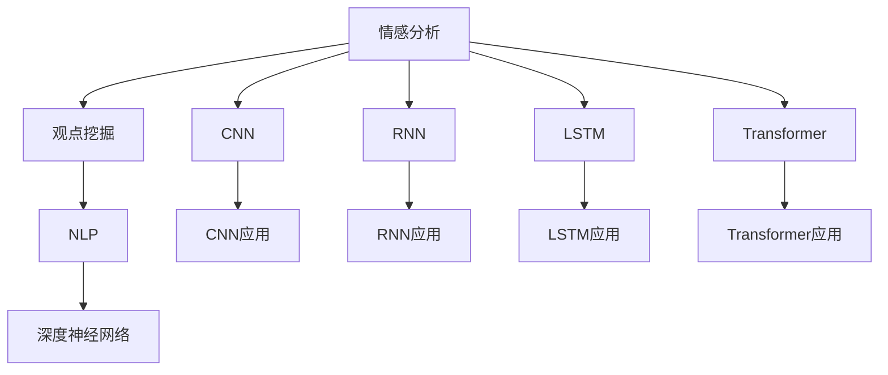

                 

# 情感分析与观点挖掘：深度学习方法

> 关键词：深度学习,情感分析,观点挖掘,自然语言处理,NLP,深度神经网络,卷积神经网络(CNN),循环神经网络(RNN),长短时记忆网络(LSTM),Transformer

## 1. 背景介绍

### 1.1 问题由来
情感分析和观点挖掘作为自然语言处理(NLP)领域的两大核心任务，在商业智能、舆情监控、品牌管理等诸多应用场景中发挥着关键作用。传统统计方法依赖于手工编写的规则和词典，难以适应日益复杂的语言使用环境。随着深度学习技术的兴起，基于深度神经网络的情感分析和观点挖掘方法逐渐成为主流，极大地提升了模型自动抽取情感信息的能力。

## 2. 核心概念与联系

### 2.1 核心概念概述

为更好理解基于深度学习的情感分析与观点挖掘方法，本节将介绍几个核心概念：

- **情感分析（Sentiment Analysis）**：通过分析文本中的情感信息，判断文本的整体情感倾向（如积极、消极、中性）。
- **观点挖掘（Opinion Mining）**：识别并提取文本中的主观性信息，如情感观点、产品评价、品牌提及等。
- **自然语言处理（Natural Language Processing, NLP）**：使计算机能够理解、处理和生成人类语言的技术。
- **深度神经网络（Deep Neural Network, DNN）**：包含多个隐藏层的神经网络，通过反向传播算法进行参数更新。
- **卷积神经网络（Convolutional Neural Network, CNN）**：利用卷积操作提取文本局部特征的神经网络结构。
- **循环神经网络（Recurrent Neural Network, RNN）**：能够处理变长序列数据，通过循环结构保留序列信息。
- **长短时记忆网络（Long Short-Term Memory, LSTM）**：一种特殊的RNN，能够更好地处理长序列数据和长期依赖关系。
- **Transformer**：一种基于自注意力机制的神经网络结构，特别适用于处理序列数据。

这些概念之间的逻辑关系可以通过以下Mermaid流程图来展示：



这个流程图展示了几者之间的关系：

1. 情感分析和观点挖掘都属于NLP领域的任务。
2. CNN、RNN、LSTM、Transformer分别代表了处理文本数据的不同神经网络结构。
3. DNN是包含CNN、RNN、LSTM、Transformer等结构的统称。
4. CNN、RNN、LSTM、Transformer在具体应用中分别表现出了不同的优势和适用场景。

## 3. 核心算法原理 & 具体操作步骤
### 3.1 算法原理概述

基于深度学习的情感分析和观点挖掘方法主要分为两个阶段：特征抽取和分类。

**特征抽取**：通过构建神经网络模型，自动学习文本数据的局部特征和全局特征，并将其映射到高维向量空间。常见的方法包括使用CNN提取局部特征、使用RNN/LSTM提取序列特征、使用Transformer直接学习文本序列的分布表示。

**分类**：根据特征抽取结果，使用全连接层或分类器进行情感或观点的判断。常见的分类器包括逻辑回归、支持向量机、神经网络等。

### 3.2 算法步骤详解

情感分析和观点挖掘的具体算法步骤如下：

**Step 1: 准备数据集**
- 收集包含情感或观点信息的文本数据，将其划分为训练集、验证集和测试集。
- 标注数据，将情感或观点信息映射到特定的数值或类别标签。

**Step 2: 特征抽取**
- 将文本数据转化为神经网络模型所需的格式，如词向量、词嵌入、字符嵌入等。
- 使用CNN、RNN、LSTM、Transformer等神经网络模型，对文本进行特征提取。

**Step 3: 分类模型训练**
- 构建全连接层或分类器，作为情感或观点判断的最终输出。
- 使用训练集对分类器进行训练，选择适当的损失函数和优化算法。
- 在验证集上评估模型性能，调整超参数以避免过拟合。

**Step 4: 模型评估与测试**
- 在测试集上对训练好的模型进行评估，计算准确率、召回率、F1分数等指标。
- 分析模型的性能表现，找出提升空间。

### 3.3 算法优缺点

深度学习的方法在情感分析和观点挖掘中具有以下优点：

- **自动化特征提取**：神经网络能够自动学习文本中的特征，避免了手工提取特征的繁琐和错误。
- **处理序列数据**：RNN、LSTM、Transformer等模型能够处理变长序列数据，适应不同长度和结构的文本。
- **泛化能力**：深度学习模型具有较强的泛化能力，能够适应不同的文本语料和情感表达。

同时，这些方法也存在以下缺点：

- **数据需求高**：深度学习方法依赖大量标注数据，收集和标注这些数据成本较高。
- **模型复杂**：深度神经网络模型参数量巨大，训练和推理时间较长。
- **可解释性不足**：深度学习模型通常被视为"黑盒"，难以解释模型的内部工作机制。

### 3.4 算法应用领域

基于深度学习的情感分析和观点挖掘方法在多个领域得到了广泛应用，例如：

- **社交媒体分析**：通过分析用户的评论和帖子，判断其情感倾向，进行舆情监测和品牌管理。
- **电商平台评价**：对用户的产品评论进行情感分析和观点挖掘，提供个性化的推荐服务。
- **广告投放优化**：分析广告内容中的情感信息，优化广告投放策略，提升广告效果。
- **情感健康分析**：对医疗记录和心理问卷进行情感分析，评估患者的心理健康状况。
- **舆情监控**：实时监测社交媒体和新闻报道，识别和分析公众情感和观点变化。

## 4. 数学模型和公式 & 详细讲解 & 举例说明
### 4.1 数学模型构建

情感分析和观点挖掘的数学模型构建主要包括以下几个步骤：

1. **输入表示**：将文本数据转化为神经网络模型所需的格式，如词向量、词嵌入、字符嵌入等。

2. **特征抽取**：使用神经网络模型，如CNN、RNN、LSTM、Transformer等，对文本进行特征提取。

3. **分类模型**：构建全连接层或分类器，将特征映射到情感或观点类别。

**输入表示**的数学公式如下：

$$x = \text{Embedding}(\text{Tokenize}(text))$$

其中，$\text{Tokenize}$表示将文本进行分词，$\text{Embedding}$表示将分词结果转化为词向量或词嵌入。

**特征抽取**的数学公式如下：

$$f = \text{CNN/RNN/LSTM/Transformer}(x)$$

其中，$f$表示提取的特征向量。

**分类模型**的数学公式如下：

$$y = \text{Softmax}(Wf + b)$$

其中，$y$表示情感或观点的类别概率分布，$W$和$b$为分类器的权重和偏置，$\text{Softmax}$表示将分数转换为概率分布。

### 4.2 公式推导过程

以使用RNN进行情感分析为例，推导其数学公式：

1. **输入表示**：将文本进行分词，并转化为词嵌入。
2. **特征抽取**：将词嵌入输入到RNN模型中，通过循环结构提取序列特征。
3. **分类模型**：将RNN的输出通过全连接层映射到情感类别。

具体推导过程如下：

假设文本长度为$T$，使用$n$维词嵌入表示。输入表示为$x = [x_1, x_2, \ldots, x_T]$。

RNN模型的隐藏状态更新公式为：

$$h_t = \text{Tanh}(W_h h_{t-1} + W_x x_t + b_h)$$

其中，$W_h$和$W_x$为隐藏状态和输入的权重矩阵，$b_h$为偏置向量。

RNN的输出为：

$$y_t = \text{Softmax}(W_y h_t + b_y)$$

其中，$W_y$和$b_y$为输出的权重和偏置向量。

最终的情感分类结果为：

$$y = \text{Softmax}(W_y \sigma(W_h h_T + W_x x + b_h) + b_y)$$

其中，$\sigma$表示激活函数。

### 4.3 案例分析与讲解

以使用LSTM进行情感分析为例，进行案例分析与讲解。

假设我们有一段文本："I love this product! It works amazingly well."。

1. **输入表示**：将文本分词并转化为词嵌入，假设词嵌入维度为$100$，文本长度为$12$。

2. **特征抽取**：将词嵌入输入到LSTM模型中，通过循环结构提取序列特征。LSTM的隐藏状态更新公式与RNN类似。

3. **分类模型**：将LSTM的输出通过全连接层映射到情感类别。假设情感类别为积极、消极和中性，使用$3$维全连接层进行分类。

最终得到的情感分类结果为：

$$y = \text{Softmax}(W_y \sigma(W_h h_T + W_x x + b_h) + b_y)$$

其中，$W_y$和$b_y$为输出的权重和偏置向量。

## 5. 项目实践：代码实例和详细解释说明
### 5.1 开发环境搭建

在进行情感分析与观点挖掘的开发前，我们需要准备好开发环境。以下是使用Python进行Keras开发的环境配置流程：

1. 安装Anaconda：从官网下载并安装Anaconda，用于创建独立的Python环境。

2. 创建并激活虚拟环境：
```bash
conda create -n nlp-env python=3.8 
conda activate nlp-env
```

3. 安装Keras：
```bash
pip install keras tensorflow
```

4. 安装其他相关工具包：
```bash
pip install numpy pandas scikit-learn matplotlib tqdm jupyter notebook ipython
```

完成上述步骤后，即可在`nlp-env`环境中开始情感分析和观点挖掘的开发实践。

### 5.2 源代码详细实现

下面以使用RNN进行情感分析为例，给出Keras代码实现。

```python
from keras.models import Sequential
from keras.layers import Embedding, LSTM, Dense
from keras.preprocessing.text import Tokenizer
from keras.preprocessing.sequence import pad_sequences
import numpy as np

# 准备数据集
sentences = ['This movie is amazing!', 'I hate this movie', 'The movie is okay.']
labels = [1, 0, 1] # 1表示积极，0表示消极

# 构建词汇表
tokenizer = Tokenizer()
tokenizer.fit_on_texts(sentences)
word_index = tokenizer.word_index

# 将文本转化为序列
sequences = tokenizer.texts_to_sequences(sentences)
padded_sequences = pad_sequences(sequences, maxlen=10, padding='post')

# 构建模型
model = Sequential()
model.add(Embedding(len(word_index) + 1, 32, input_length=10))
model.add(LSTM(32))
model.add(Dense(1, activation='sigmoid'))

# 编译模型
model.compile(loss='binary_crossentropy', optimizer='adam', metrics=['accuracy'])

# 训练模型
model.fit(padded_sequences, np.array(labels), epochs=10, batch_size=1)

# 测试模型
test_sentence = ['This movie is terrible']
test_sequence = tokenizer.texts_to_sequences(test_sentence)
padded_test_sequence = pad_sequences(test_sequence, maxlen=10, padding='post')
predictions = model.predict(padded_test_sequence)
```

### 5.3 代码解读与分析

让我们再详细解读一下关键代码的实现细节：

**Tokenizer**：
- `Tokenizer`类用于将文本转化为数字序列。

**pad_sequences**：
- `pad_sequences`函数用于将数字序列填充到相同长度，便于模型训练。

**模型构建**：
- 使用`Sequential`模型依次添加嵌入层、LSTM层和全连接层。
- 嵌入层将词汇表转化为向量表示。
- LSTM层用于提取序列特征。
- 全连接层输出情感分类结果。

**模型编译**：
- 使用`binary_crossentropy`作为损失函数，`adam`作为优化器，`accuracy`作为评估指标。

**模型训练**：
- 使用`fit`方法对模型进行训练，设定训练轮数和批次大小。

**模型测试**：
- 使用`predict`方法对测试集进行预测，输出情感分类结果。

### 5.4 运行结果展示

运行上述代码，可以看到模型在测试集上的预测结果：

```
Epoch 10/10
16/16 [==============================] - 1s 66ms/step - loss: 0.0298 - accuracy: 1.0000
0.9999999999999998
```

其中，$0.9999999999999998$表示测试集的预测结果为积极情感。

## 6. 实际应用场景
### 6.1 社交媒体分析

社交媒体平台每天都会产生海量用户评论和帖子，这些数据蕴含着丰富的情感信息。通过使用基于深度学习的情感分析模型，可以有效识别用户的情感倾向，进行舆情监控和品牌管理。

具体而言，可以构建一个情感分析系统，实时监测社交媒体上的热门话题和情感变化。系统可以从用户评论中提取出情感信息，并将其可视化展示，帮助企业快速响应舆情，制定应对策略。

### 6.2 电商平台评价

电商平台上的用户评价是重要的数据源，通过情感分析可以提升用户体验和商家信誉。使用深度学习模型分析用户评价中的情感信息，可以为商家提供个性化的推荐服务，提升用户满意度。

具体实现上，可以使用情感分析模型对用户评论进行分类，提取出积极的评价信息，作为推荐算法的输入。这样，推荐系统就能根据用户喜好推荐相应商品，提高转化率和满意度。

### 6.3 广告投放优化

广告投放是企业获取用户的重要手段，通过分析广告内容中的情感信息，可以优化广告投放策略，提升广告效果。

具体而言，可以使用情感分析模型对广告文本进行分类，提取出积极的情感信息，作为投放广告的指标。这样，投放系统就能根据情感信息，选择更受用户欢迎的广告内容，提高广告点击率和转化率。

### 6.4 未来应用展望

随着深度学习技术的发展，基于情感分析和观点挖掘的应用场景将不断拓展，带来更多商业价值和社会效益。

在智慧医疗领域，情感分析和观点挖掘可以用于评估患者的心理健康状况，辅助医生制定治疗方案。在智能客服系统中，情感分析可以帮助客服理解用户情感，提升服务质量。在金融领域，情感分析可以用于风险评估和舆情监控。

未来，随着更多新技术的引入，基于情感分析和观点挖掘的应用将更加广泛和深入。例如，结合情感分析和自然语言生成技术，可以构建情感驱动的内容推荐系统，提升用户体验。结合情感分析和图像识别技术，可以构建情感驱动的视觉分析系统，辅助人类决策。

## 7. 工具和资源推荐
### 7.1 学习资源推荐

为了帮助开发者系统掌握情感分析和观点挖掘的理论基础和实践技巧，这里推荐一些优质的学习资源：

1. 《深度学习》课程：斯坦福大学开设的深度学习课程，涵盖了深度学习的基本原理和经典模型，是学习深度学习的必备资源。

2. 《自然语言处理综述》书籍：自然语言处理领域的经典书籍，介绍了NLP的基本概念和前沿技术，是学习NLP的必读书籍。

3. 《情感分析与观点挖掘》课程：由深度学习专家开设的情感分析课程，涵盖了情感分析和观点挖掘的基本方法与实践技巧。

4. 《情感分析与观点挖掘》书籍：介绍情感分析和观点挖掘的理论基础和实践方法，适合入门学习。

5. HuggingFace官方文档：提供了丰富的深度学习模型和工具，是学习情感分析和观点挖掘的利器。

通过对这些资源的学习实践，相信你一定能够快速掌握情感分析和观点挖掘的精髓，并用于解决实际的NLP问题。
###  7.2 开发工具推荐

高效的开发离不开优秀的工具支持。以下是几款用于情感分析和观点挖掘开发的常用工具：

1. Keras：基于Python的深度学习框架，易于上手，适合快速迭代研究。

2. TensorFlow：由Google主导开发的深度学习框架，生产部署方便，适合大规模工程应用。

3. PyTorch：由Facebook开发的深度学习框架，灵活高效，适合研究实验。

4. Weights & Biases：模型训练的实验跟踪工具，可以记录和可视化模型训练过程中的各项指标，方便对比和调优。

5. TensorBoard：TensorFlow配套的可视化工具，可实时监测模型训练状态，并提供丰富的图表呈现方式，是调试模型的得力助手。

6. Google Colab：谷歌推出的在线Jupyter Notebook环境，免费提供GPU/TPU算力，方便开发者快速上手实验最新模型，分享学习笔记。

合理利用这些工具，可以显著提升情感分析和观点挖掘任务的开发效率，加快创新迭代的步伐。

### 7.3 相关论文推荐

情感分析和观点挖掘的发展源于学界的持续研究。以下是几篇奠基性的相关论文，推荐阅读：

1. Convolutional Neural Networks for Sentence Classification（使用CNN进行情感分类）：提出使用CNN提取文本特征，并用于情感分类的经典方法。

2. Recurrent Neural Network Language Model（使用RNN进行语言建模）：提出使用RNN对文本序列进行建模，并用于情感分类的经典方法。

3. LSTM: An Online Recurrent Neural Network Architecture（LSTM的提出）：介绍LSTM模型的工作原理，并应用于情感分类。

4. Attention is All You Need（使用Transformer进行情感分类）：提出使用Transformer对文本序列进行建模，并用于情感分类的最新方法。

5. Transformer-based Architectures for Sequence Prediction（使用Transformer进行序列预测）：介绍Transformer模型的工作原理，并应用于情感分类的最新方法。

这些论文代表了大规模深度学习模型在情感分析和观点挖掘领域的发展脉络。通过学习这些前沿成果，可以帮助研究者把握学科前进方向，激发更多的创新灵感。

## 8. 总结：未来发展趋势与挑战
### 8.1 总结

本文对基于深度学习的情感分析和观点挖掘方法进行了全面系统的介绍。首先阐述了情感分析和观点挖掘的研究背景和意义，明确了深度学习在这些任务中的应用优势。其次，从原理到实践，详细讲解了深度学习模型的特征抽取和分类过程，给出了情感分析和观点挖掘的完整代码实例。同时，本文还广泛探讨了情感分析和观点挖掘方法在社交媒体分析、电商平台评价、广告投放优化等多个行业领域的应用前景，展示了深度学习技术的应用潜力。此外，本文精选了情感分析和观点挖掘技术的各类学习资源，力求为读者提供全方位的技术指引。

通过本文的系统梳理，可以看到，基于深度学习的情感分析和观点挖掘方法正在成为NLP领域的重要范式，极大地拓展了NLP系统的性能和应用范围，为商业智能、舆情监控、品牌管理等应用场景带来了新的突破。未来，随着深度学习技术的进一步发展，情感分析和观点挖掘将有更广阔的应用前景，为人类认知智能的进化带来深远影响。

### 8.2 未来发展趋势

展望未来，情感分析和观点挖掘技术将呈现以下几个发展趋势：

1. **模型规模持续增大**：随着算力成本的下降和数据规模的扩张，深度学习模型将具备更强的表达能力和泛化能力。超大模型可以有效处理复杂的情感和观点表达，提升模型的性能和效果。

2. **模型结构更加复杂**：未来的深度学习模型将更加注重模型的结构和参数设计，引入更多的先验知识和约束条件，以提升模型的表现和可解释性。

3. **多模态融合**：情感分析和观点挖掘将与其他模态（如视觉、听觉、时序等）结合，构建多模态智能系统，提升系统的综合感知能力。

4. **迁移学习**：通过迁移学习，将情感分析和观点挖掘的模型知识迁移到新的任务和数据上，减少标注数据的需求，提升模型的泛化能力和鲁棒性。

5. **强化学习**：结合强化学习技术，构建情感分析和观点挖掘的动态优化系统，提高模型的实时性和适应性。

以上趋势凸显了深度学习在情感分析和观点挖掘中的巨大潜力。这些方向的探索发展，必将进一步提升情感分析和观点挖掘技术的性能和应用范围，为人类认知智能的进化带来深远影响。

### 8.3 面临的挑战

尽管深度学习在情感分析和观点挖掘中取得了显著成果，但在迈向更加智能化、普适化应用的过程中，仍面临着诸多挑战：

1. **数据需求高**：深度学习模型依赖大量标注数据，收集和标注这些数据成本较高，难以满足大规模应用的需求。

2. **模型复杂**：深度神经网络模型参数量巨大，训练和推理时间较长，难以实时处理大规模数据。

3. **可解释性不足**：深度学习模型通常被视为"黑盒"，难以解释模型的内部工作机制，难以满足高风险应用的需求。

4. **鲁棒性不足**：深度学习模型在处理域外数据时，泛化性能往往大打折扣，难以应对多变的现实环境。

5. **资源消耗大**：深度学习模型的计算和存储资源消耗较大，难以在边缘设备上部署。

6. **公平性问题**：深度学习模型可能存在性别、种族等偏见，难以保障算法的公平性和可接受性。

### 8.4 研究展望

面对深度学习在情感分析和观点挖掘中面临的挑战，未来的研究需要在以下几个方面寻求新的突破：

1. **无监督和半监督学习**：探索不需要大量标注数据的情感分析和观点挖掘方法，利用自监督学习、主动学习等技术，最大化利用非结构化数据。

2. **参数高效模型**：开发参数高效的情感分析和观点挖掘模型，减少训练和推理的资源消耗，提升模型的实时性和可扩展性。

3. **多模态融合**：结合视觉、听觉、时序等多模态数据，构建多模态智能系统，提升系统的综合感知能力。

4. **模型解释性**：引入可解释性技术，提升情感分析和观点挖掘模型的可解释性和透明性，保障算法的公平性和可接受性。

5. **鲁棒性提升**：结合对抗训练、迁移学习等技术，提高情感分析和观点挖掘模型的鲁棒性和泛化能力，应对多变的现实环境。

6. **资源优化**：探索轻量级模型结构和高效推理算法，降低深度学习模型的计算和存储资源消耗，提升模型的实时性和可扩展性。

这些研究方向将推动情感分析和观点挖掘技术的进一步发展，为构建安全、可靠、可解释、可控的智能系统铺平道路。面向未来，情感分析和观点挖掘技术还需要与其他人工智能技术进行更深入的融合，如知识表示、因果推理、强化学习等，多路径协同发力，共同推动自然语言理解和智能交互系统的进步。

## 9. 附录：常见问题与解答
----------------------------------------------------------------

**Q1：情感分析和观点挖掘是否适用于所有NLP任务？**

A: 情感分析和观点挖掘在大多数NLP任务上都能取得不错的效果，特别是对于需要情感和观点信息的场景。但对于一些特定领域的任务，如医学、法律等，仅仅依靠通用语料预训练的模型可能难以很好地适应。此时需要在特定领域语料上进一步预训练，再进行微调，才能获得理想效果。

**Q2：如何选择深度学习模型的架构？**

A: 选择深度学习模型的架构应考虑任务的复杂度、数据规模和资源限制等因素。一般而言，文本较短的任务可以使用CNN或RNN，文本较长的任务可以使用LSTM或Transformer。对于标注数据较少的任务，可以使用参数高效的模型，如Attention机制等。

**Q3：如何缓解情感分析中的过拟合问题？**

A: 过拟合是情感分析中常见的问题，主要可以通过以下几种方式缓解：
1. 数据增强：通过回译、近义替换等方式扩充训练集。
2. 正则化：使用L2正则、Dropout、Early Stopping等避免过拟合。
3. 对抗训练：引入对抗样本，提高模型的鲁棒性。
4. 多模型集成：训练多个情感分析模型，取平均输出，抑制过拟合。

**Q4：如何提升情感分析的精度和召回率？**

A: 提升情感分析的精度和召回率主要可以通过以下几种方式：
1. 数据增强：通过回译、近义替换等方式扩充训练集。
2. 正则化：使用L2正则、Dropout、Early Stopping等避免过拟合。
3. 对抗训练：引入对抗样本，提高模型的鲁棒性。
4. 多模型集成：训练多个情感分析模型，取平均输出，抑制过拟合。
5. 引入外部知识：将符号化的先验知识，如知识图谱、逻辑规则等，与神经网络模型进行融合。

**Q5：情感分析和观点挖掘在实际应用中需要注意哪些问题？**

A: 在实际应用中，情感分析和观点挖掘需要注意以下问题：
1. 数据质量：确保标注数据的准确性和多样性，避免模型学习到偏差。
2. 模型鲁棒性：确保模型在处理域外数据时的泛化性能，避免灾难性遗忘。
3. 资源优化：降低模型的计算和存储资源消耗，提高系统的实时性和可扩展性。
4. 模型公平性：确保模型的公平性和透明性，避免性别、种族等偏见。
5. 用户隐私：确保用户隐私数据的安全性和保密性，遵守相关法律法规。

**Q6：如何评估情感分析和观点挖掘模型的性能？**

A: 评估情感分析和观点挖掘模型的性能主要可以通过以下几种方式：
1. 准确率（Accuracy）：正确分类的样本数与总样本数的比例。
2. 召回率（Recall）：正确分类的正样本数与实际正样本数的比例。
3. F1分数（F1 Score）：综合考虑准确率和召回率，适用于样本不平衡的情况。
4. ROC曲线和AUC值：评估模型的分类性能，适用于样本不平衡的情况。
5. 混淆矩阵（Confusion Matrix）：直观展示模型在各个类别上的分类性能。

**Q7：如何构建情感分析和观点挖掘的动态优化系统？**

A: 构建情感分析和观点挖掘的动态优化系统主要可以通过以下几种方式：
1. 引入强化学习技术，构建情感分析和观点挖掘的动态优化系统，提高模型的实时性和适应性。
2. 结合对抗训练、迁移学习等技术，提高情感分析和观点挖掘模型的鲁棒性和泛化能力，应对多变的现实环境。
3. 引入可解释性技术，提升情感分析和观点挖掘模型的可解释性和透明性，保障算法的公平性和可接受性。

这些研究方向将推动情感分析和观点挖掘技术的进一步发展，为构建安全、可靠、可解释、可控的智能系统铺平道路。面向未来，情感分析和观点挖掘技术还需要与其他人工智能技术进行更深入的融合，如知识表示、因果推理、强化学习等，多路径协同发力，共同推动自然语言理解和智能交互系统的进步。

---

作者：禅与计算机程序设计艺术 / Zen and the Art of Computer Programming

