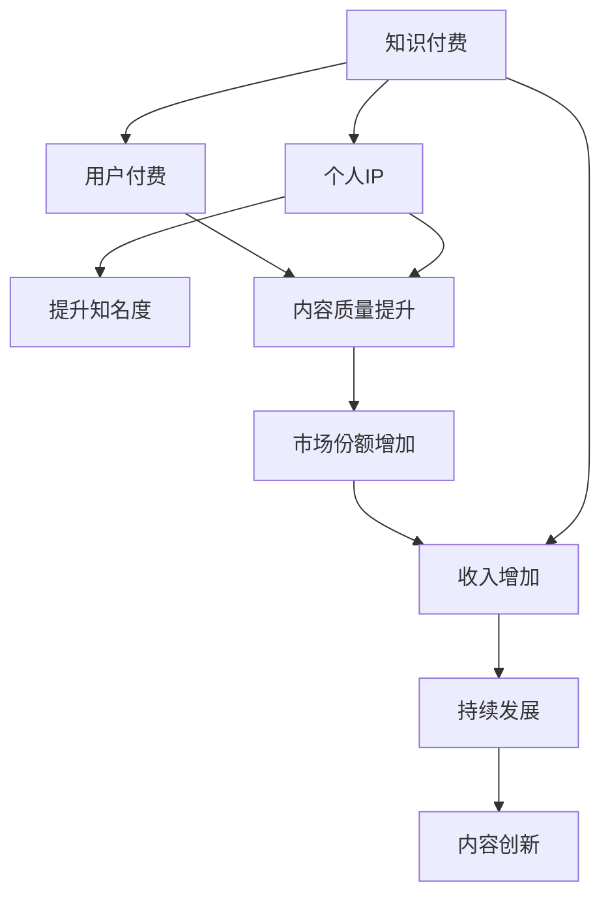

                 

# 打造个人IP：知识付费创业的关键

> 关键词：知识付费, 个人IP, 技术创业, 职业发展, 品牌建设, 内容创作, 商业模式, 市场定位, 用户洞察, 收益模型, 团队管理

## 1. 背景介绍

### 1.1 问题由来
在信息爆炸的互联网时代，知识获取变得前所未有的便捷，但信息过载也带来了新的挑战。如何在海量信息中找到有价值的知识，提升个人效率，成为众多用户共同关注的问题。知识付费应运而生，通过专业知识获取付费收益，满足用户获取高质量知识的需求。

知识付费不仅是一种商业模式，更是个人IP（Intellectual Property）建设的良好机会。个人IP即个人品牌，指通过独特的知识、技能、见解或才华在特定领域获得广泛认知，形成持续影响力。个人IP的构建，有助于提升个人知名度、增强市场竞争力，以及获取更多商业机会。

本文将从知识付费和IP建设的视角出发，探讨如何打造个人IP，驱动技术创业成功。通过系统梳理知识付费创业的关键要素，深入分析技术创业者在职业发展、品牌建设、内容创作、商业运营等方面面临的挑战和机遇，旨在为技术创业者提供可行的实践指导和长远规划。

### 1.2 问题核心关键点
知识付费创业的关键在于通过独特的知识和服务，满足用户的知识需求，实现商业价值。以下是实现这一目标的几个核心关键点：

- **内容质量**：高质量的知识内容是吸引用户付费的关键。
- **IP建设**：个人IP的建设能提升品牌认知度，促进用户粘性和商业转化。
- **商业运营**：高效的市场定位、收益模型设计及团队管理，是知识付费商业模式成功的保障。
- **用户洞察**：深入了解目标用户的需求和行为模式，提供更加贴合的服务。

## 2. 核心概念与联系

### 2.1 核心概念概述

知识付费是指通过付费方式获取专业知识或技能，提升个人效率和竞争力的商业模式。个人IP则是指通过独特的知识、技能、见解或才华在特定领域获得广泛认知，形成持续影响力。两者共同构成了知识付费创业的核心。

**知识付费**：指用户通过支付一定费用，获取有价值、专业化的知识或服务，以提升个人能力或解决具体问题。

**个人IP**：指通过独特的知识、技能、见解或才华，在特定领域获得广泛认知，形成持续影响力。个人IP的建设是知识付费商业模式成功的关键。

### 2.2 核心概念联系

知识付费与个人IP建设之间存在密切联系，两者相辅相成。知识付费为个人IP建设提供了物质基础，而个人IP的建立则进一步提升了知识付费的商业价值。通过个人IP建设，吸引更多用户付费，形成良性循环。

知识付费和IP建设的联系可以通过以下Mermaid流程图来展示：



这个流程图展示了知识付费和IP建设之间的联系：

1. 知识付费通过高质量内容吸引用户付费。
2. 个人IP的建立提升知名度，吸引更多用户。
3. 用户数量增加，进一步提升内容质量和市场份额。
4. 市场份额增加和收入提升，促进持续发展。
5. 持续的内容创新推动知识付费的进一步发展。

## 3. 核心算法原理 & 具体操作步骤
### 3.1 算法原理概述

知识付费创业的关键在于内容的生产和分发。其核心算法原理是：

- **内容生成**：通过个人独特的知识、技能或见解，生成高质量的内容。
- **内容分发**：通过合适的渠道和策略，将内容精准推送给目标用户。

**内容生成**：内容生成的核心在于创意和专业性。技术创业者需具备扎实的专业背景，同时在内容创作中融入创新思维和个性化表达。

**内容分发**：内容分发需要精准的目标用户定位和高效的渠道选择。通过数据分析和用户洞察，找出目标用户群，并选择合适的分发平台。

### 3.2 算法步骤详解

知识付费创业的具体操作步骤分为以下几个步骤：

**Step 1: 确定知识领域**

首先，需明确自己的专业领域和核心竞争力。选择具有高需求、低竞争的领域，如编程、区块链、人工智能等，将有助于获取更多用户。

**Step 2: 制定内容策略**

确定内容类型和主题，如视频教程、在线课程、技术文章等。制定内容策略，确保内容质量，并设计内容发布计划。

**Step 3: 打造个人品牌**

通过社交媒体、博客、个人网站等平台，建立个人IP。发布有价值的内容，参与行业讨论，积累粉丝和关注度。

**Step 4: 选择分发渠道**

选择合适的分发平台，如视频网站、技术博客、知识付费平台等。根据目标用户群体选择最有效的分发渠道。

**Step 5: 运营优化**

通过用户反馈和数据分析，不断优化内容策略和分发渠道。建立有效的用户互动机制，提高用户满意度和粘性。

**Step 6: 商业化变现**

实现知识付费商业模式，如通过课程销售、付费文章、技术咨询等方式获取收益。

### 3.3 算法优缺点

知识付费创业方法的优势在于：

- **专业性强**：通过个人独特的知识和技能，提供高质量的专业服务。
- **覆盖面广**：知识付费内容可以覆盖广泛的受众群体，具有高扩展性。
- **灵活性高**：可以快速调整内容策略，适应市场变化。

同时，该方法也存在一定的局限性：

- **成本较高**：高质量内容的创作和分发需要投入较多时间和资源。
- **市场竞争激烈**：市场饱和度高，难以在竞争中脱颖而出。
- **用户粘性不足**：部分用户可能对付费内容有抵触情绪。

尽管如此，知识付费仍是大势所趋，技术创业者需根据自身优势，制定合理的发展策略。

### 3.4 算法应用领域

知识付费创业方法适用于多种领域，如编程、区块链、人工智能、医疗健康等。通过高质量的专业知识分享，满足目标用户的需求，获取商业回报。

## 4. 数学模型和公式 & 详细讲解 & 举例说明

### 4.1 数学模型构建

知识付费创业的数学模型构建主要涉及内容质量和用户付费的预测。

假设目标用户数为 $N$，知识内容的用户付费概率为 $p$，内容质量和用户需求的匹配度为 $q$。则用户总付费次数 $X$ 为：

$$
X = N \cdot p \cdot q
$$

其中 $N$ 为总用户数，$p$ 为用户付费概率，$q$ 为内容匹配度。

### 4.2 公式推导过程

通过上述公式，可以推导出增加用户付费的关键因素：

- **用户数量增加**：增加用户总数 $N$，扩大市场覆盖面。
- **内容质量提升**：提高内容质量，提升用户付费概率 $p$。
- **内容匹配度提升**：优化内容策略，提高内容与用户需求的匹配度 $q$。

### 4.3 案例分析与讲解

以某编程课程为例，其用户付费概率 $p$ 与内容质量 $q$ 的公式推导如下：

假设课程总用户数为 $N = 10000$，内容质量 $q$ 为 $0.8$，即80%的用户对课程内容感兴趣并愿意付费。若用户付费概率 $p$ 为 $0.2$，则总付费次数 $X$ 为：

$$
X = 10000 \cdot 0.2 \cdot 0.8 = 1600
$$

若通过优化课程内容和分发策略，提高用户付费概率 $p$ 到 $0.3$，则总付费次数 $X$ 将增加至：

$$
X = 10000 \cdot 0.3 \cdot 0.8 = 2400
$$

通过提升内容质量和用户匹配度，总付费次数增加了50%。

## 5. 项目实践：代码实例和详细解释说明
### 5.1 开发环境搭建

在进行知识付费项目开发前，需准备好开发环境。以下是使用Python进行Flask框架开发的项目环境配置流程：

1. 安装Anaconda：从官网下载并安装Anaconda，用于创建独立的Python环境。

2. 创建并激活虚拟环境：
```bash
conda create -n knowledge-env python=3.8 
conda activate knowledge-env
```

3. 安装Flask：
```bash
pip install flask
```

4. 安装必要的第三方库：
```bash
pip install markdown flask-cors
```

完成上述步骤后，即可在`knowledge-env`环境中开始项目开发。

### 5.2 源代码详细实现

接下来，我们以技术博客为例，给出使用Flask框架构建知识付费项目的PyTorch代码实现。

首先，定义Flask应用程序和路由：

```python
from flask import Flask, request, jsonify

app = Flask(__name__)

@app.route('/blog', methods=['POST'])
def blog():
    title = request.json.get('title')
    content = request.json.get('content')
    if not title or not content:
        return jsonify({'error': 'Invalid request'})
    # 创建博客文章并保存到数据库
    save_blog(title, content)
    return jsonify({'success': True})
```

然后，定义博客文章的创建和保存：

```python
from flask_sqlalchemy import SQLAlchemy

app.config['SQLALCHEMY_DATABASE_URI'] = 'sqlite:///blog.db'
db = SQLAlchemy(app)

class Blog(db.Model):
    id = db.Column(db.Integer, primary_key=True)
    title = db.Column(db.String(100))
    content = db.Column(db.Text)

@app.route('/blog', methods=['POST'])
def blog():
    title = request.json.get('title')
    content = request.json.get('content')
    if not title or not content:
        return jsonify({'error': 'Invalid request'})
    # 创建博客文章并保存到数据库
    new_blog = Blog(title=title, content=content)
    db.session.add(new_blog)
    db.session.commit()
    return jsonify({'success': True})
```

最后，启动Flask应用程序：

```python
if __name__ == '__main__':
    app.run(debug=True)
```

以上就是使用Flask框架构建知识付费项目的完整代码实现。可以看到，通过Flask的简单封装，开发者可以轻松实现博客文章的创建和保存，并可部署到Web应用中，供用户浏览和付费。

### 5.3 代码解读与分析

让我们再详细解读一下关键代码的实现细节：

**Flask应用程序和路由定义**：
- `Flask` 框架的初始化：通过 `Flask(__name__)` 创建 Flask 应用程序。
- `@app.route` 装饰器：定义请求路由，指定请求方法和路径。
- `request` 对象：获取请求的 JSON 数据，并进行必要性检查。

**数据库操作**：
- 配置数据库连接信息：通过 `app.config` 设置数据库连接 URI。
- SQLAlchemy 模块的使用：通过 `db.Model` 定义博客文章的数据模型。
- `db.session` 对象：用于数据库的操作，如添加、保存和查询数据。

**博客文章创建和保存**：
- `new_blog` 实例的创建：通过 `Blog(title=title, content=content)` 创建新的博客文章。
- `db.session.add(new_blog)`：将新文章添加到数据库会话中。
- `db.session.commit()`：提交数据库会话，保存新文章到数据库。

**Flask应用程序启动**：
- `app.run(debug=True)`：启动 Flask 应用程序，并在调试模式下运行。

可以看到，通过Flask框架，开发者可以迅速构建出一个简单的博客发布系统，用于知识内容的发布和管理。

当然，工业级的系统实现还需考虑更多因素，如数据库安全、用户身份认证、支付集成等。但核心的知识付费系统构建流程基本与此类似。

## 6. 实际应用场景
### 6.1 技术博客

技术博客是知识付费创业的重要形式之一。通过博客分享技术文章、经验总结、项目案例等，帮助用户快速提升技术能力。

以某编程技术博客为例，其核心场景包括：

- **文章发布**：用户可付费订阅技术博客，获取最新文章和高质量内容。
- **付费机制**：采用按月订阅或按次付费模式，用户按需付费。
- **内容互动**：通过评论、点赞、分享等形式，增强用户互动，提升内容粘性。

通过技术博客，技术创业者不仅分享知识，还能获取收益，构建个人IP。

### 6.2 在线课程

在线课程是知识付费创业的另一重要形式。通过视频、PPT、代码等形式，系统性地分享专业知识，帮助用户深入掌握技术。

以某编程在线课程为例，其核心场景包括：

- **课程制作**：录制高质量的课程视频，编写详细的手册和代码案例。
- **平台选择**：选择合适的在线教育平台，如Coursera、Udemy等。
- **付费模式**：采用一次性付费或按课程订阅模式，用户按需购买。
- **互动机制**：通过在线论坛、直播答疑等形式，增强课程互动，提升学习效果。

通过在线课程，技术创业者可以将专业知识系统化、结构化，高效传播知识，构建个人IP。

### 6.3 技术咨询

技术咨询是知识付费创业的高附加值形式。通过一对一或一对多的技术咨询服务，提供个性化的技术支持和解决方案。

以某技术咨询服务为例，其核心场景包括：

- **咨询服务**：根据用户需求，提供定制化的技术方案和解决方案。
- **收费模式**：采用按小时计费或按项目计费模式，用户按需付费。
- **技术支持**：通过电话、邮件、视频会议等方式，提供实时的技术支持和建议。
- **客户管理**：建立客户档案，记录历史服务内容和客户反馈，提供持续的服务支持。

通过技术咨询服务，技术创业者可以直接接触用户，提供高质量的技术支持，构建个人IP。

## 7. 工具和资源推荐
### 7.1 学习资源推荐

为帮助技术创业者系统掌握知识付费创业的理论基础和实践技巧，这里推荐一些优质的学习资源：

1. **《知识付费：内容创业的实践指南》**：详细介绍了知识付费创业的基本框架、运营策略和实战案例。

2. **《知识付费营销：如何打造个人品牌》**：介绍了如何通过知识付费营销，打造个人IP，提升品牌认知度。

3. **《内容付费经济学》**：探讨了知识付费的经济学原理，帮助理解付费内容的市场价值和用户需求。

4. **《知识付费与自媒体营销》**：介绍了如何利用自媒体平台进行内容创作和知识付费，获取用户关注和收益。

5. **《内容创业：从零到亿的实战之路》**：通过真实案例，分享了内容创业的完整流程和实战经验。

通过对这些资源的学习实践，相信技术创业者能够快速掌握知识付费创业的精髓，并用于解决实际的创业问题。

### 7.2 开发工具推荐

高效的知识付费系统开发离不开优秀的工具支持。以下是几款用于知识付费开发的常用工具：

1. **Flask**：基于Python的开源Web框架，灵活方便，适合快速迭代研究。

2. **Django**：强大的Web框架，支持高效的ORM和模板渲染，适合大型项目开发。

3. **MongoDB**：高性能的NoSQL数据库，适合存储大量的博客文章和用户数据。

4. **SQLAlchemy**：Python的ORM工具，支持多种数据库，方便数据库操作。

5. **Amazon AWS**：云计算平台，提供丰富的服务资源，适合构建大规模知识付费系统。

6. **Google Cloud Platform**：云平台，提供强大的计算和存储资源，支持知识付费系统的开发和部署。

合理利用这些工具，可以显著提升知识付费系统的开发效率，加快创新迭代的步伐。

### 7.3 相关论文推荐

知识付费和IP建设的研究源于学界的持续探索。以下是几篇奠基性的相关论文，推荐阅读：

1. **《知识付费：一种新型的商业模式》**：探讨了知识付费的商业模式和市场前景。

2. **《基于内容推荐的知识付费平台设计》**：介绍了如何通过内容推荐技术提升知识付费平台的用户体验。

3. **《知识付费平台的个性化推荐算法》**：介绍了个性化推荐算法在知识付费平台中的应用。

4. **《知识付费平台的用户行为分析》**：探讨了用户行为分析在知识付费平台中的作用。

5. **《知识付费平台的内容创作机制》**：介绍了内容创作机制在知识付费平台中的应用。

这些论文代表了大知识付费创业的发展脉络。通过学习这些前沿成果，可以帮助技术创业者把握学科前进方向，激发更多的创新灵感。

## 8. 总结：未来发展趋势与挑战

### 8.1 总结

本文对知识付费创业和IP建设的视角出发，探讨了如何打造个人IP，驱动技术创业成功。通过系统梳理知识付费创业的关键要素，深入分析技术创业者在职业发展、品牌建设、内容创作、商业运营等方面面临的挑战和机遇，旨在为技术创业者提供可行的实践指导和长远规划。

知识付费和IP建设是大势所趋，通过高质量的内容和有效的运营策略，技术创业者可以在短时间内获取大量用户，提升个人知名度，实现商业价值。

### 8.2 未来发展趋势

展望未来，知识付费和IP建设将呈现以下几个发展趋势：

1. **内容质量提升**：高质量的内容始终是吸引用户付费的关键。技术创业者需不断提升内容质量，确保内容的实用性和创新性。

2. **技术平台升级**：借助大数据、人工智能等技术，实现内容推荐和用户画像的精准分析，提升用户体验和满意度。

3. **多元化收入模式**：除了传统的按次付费和按月订阅模式，探索更多元化的收入模式，如会员制、知识问答、付费社区等，增强用户粘性和商业价值。

4. **全球化市场布局**：通过本地化内容和服务，开拓全球市场，扩大知识付费的覆盖面。

5. **社会责任提升**：积极履行社会责任，注重内容的社会价值和教育意义，提升品牌形象和社会影响力。

以上趋势凸显了知识付费和IP建设的广阔前景。技术创业者需不断创新和优化，保持竞争力和市场活力。

### 8.3 面临的挑战

尽管知识付费和IP建设具有巨大潜力，但在发展过程中也面临诸多挑战：

1. **用户获取成本高**：高质量内容的制作和分发需要投入较多时间和资源。

2. **市场竞争激烈**：市场饱和度高，难以在竞争中脱颖而出。

3. **内容质量参差不齐**：部分内容质量不高，无法满足用户需求。

4. **用户粘性不足**：部分用户可能对付费内容有抵触情绪。

5. **商业模式单一**：目前主要依赖付费模式，市场空间有限。

6. **技术和运营成本高**：知识付费平台的搭建和维护需要大量技术和运营投入。

7. **法律和伦理问题**：知识付费平台的版权问题、隐私保护、内容审核等亟待解决。

技术创业者需从多个维度进行全面分析和优化，才能克服这些挑战，实现可持续发展。

### 8.4 研究展望

未来的知识付费和IP建设研究，需要在以下几个方面进行探索：

1. **内容创作工具的优化**：开发更加高效、智能的内容创作工具，提升内容创作的效率和质量。

2. **个性化推荐系统的优化**：研究基于用户行为和偏好的个性化推荐算法，提升用户体验。

3. **技术平台的开放性**：开发开放性的知识付费平台，支持内容创作者和用户的自由创作和交流。

4. **内容版权保护**：研究内容版权保护技术，确保内容创作者权益。

5. **社会责任的提升**：注重内容的社会价值和教育意义，提升品牌形象和社会影响力。

通过这些研究方向的探索，知识付费和IP建设必将迈向更加成熟和健康的发展轨道，为社会带来更多的知识价值。

## 9. 附录：常见问题与解答

**Q1：如何确定自己的专业领域和核心竞争力？**

A: 确定专业领域和核心竞争力，需结合自身兴趣和市场需求。选择高需求、低竞争的领域，如编程、区块链、人工智能等，有助于快速获取用户。同时，需明确自己的独特技能和经验，形成核心竞争力。

**Q2：如何提升内容质量和用户付费概率？**

A: 提升内容质量的关键在于持续学习和创新。通过参加行业会议、阅读最新文献、与其他专家交流，获取最新的知识和技能。同时，需注意用户反馈，及时调整内容策略，提升用户满意度和粘性。

**Q3：如何选择适合的分发渠道？**

A: 选择合适的分发渠道需考虑目标用户群和平台特点。如技术博客适合深度技术分享，视频课程适合动态教学，技术咨询适合个性化服务。同时，需评估各平台的用户质量和付费机制，选择最适合自己的分发渠道。

**Q4：如何构建个人IP和品牌认知度？**

A: 构建个人IP和品牌认知度需注重内容和互动。通过高质量的内容分享、参与行业讨论、建立社交媒体账号，积累粉丝和关注度。同时，需通过用户互动和社区建设，增强用户粘性和品牌认知度。

**Q5：如何实现知识付费商业变现？**

A: 实现知识付费商业变现需设计合理的商业模式。如通过课程销售、付费文章、技术咨询等方式获取收益。同时，需注重用户反馈和满意度，优化用户体验，提升用户粘性。

通过深入分析和探索，相信技术创业者能够克服知识付费创业的挑战，实现商业价值和个人IP的建设。希望本文能为您提供有益的指导和启示，助您在知识付费的浪潮中乘风破浪，开启成功的创业之旅。

---

作者：禅与计算机程序设计艺术 / Zen and the Art of Computer Programming

