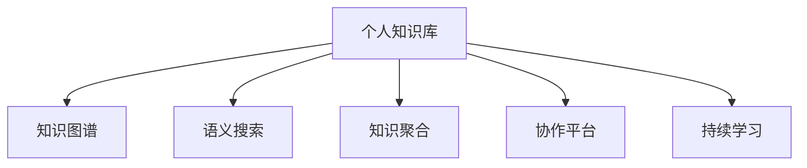

                 

## 1. 背景介绍

在科技迅猛发展的今天，知识更新的速度不断加快，程序员们面临的学习曲线也日益陡峭。在瞬息万变的IT行业中，保持学习的热情和效率，构建自己的知识库，不仅有助于解决技术难题，还能在职业发展中获得更大的优势。因此，打造个人知识库，已经成为每一位优秀程序员的重要任务。

### 1.1 问题由来
在软件开发的过程中，程序员常常遇到技术难题，需要查阅大量的文档、手册和网络资源。由于信息碎片化严重，许多有用的知识难以系统化存储和使用。缺乏有效的知识组织和检索方法，导致重复学习、效率低下，甚至阻碍项目进展。

### 1.2 问题核心关键点
为了解决这一问题，构建个人知识库是关键。一个优秀的个人知识库不仅应具备高效的信息检索和分类能力，还应提供丰富的互动功能，支持用户协作、知识共享和持续学习。

核心关键点包括：

1. 系统化组织：将知识条理化，便于快速定位和检索。
2. 互动协作：支持知识共享和团队协作，促进知识流动。
3. 持续学习：定期更新和扩展，紧跟技术发展趋势。
4. 高效检索：快速响应查询需求，提供准确的信息。
5. 个性化定制：根据用户偏好定制推荐，提升学习效率。

### 1.3 问题研究意义
构建个人知识库具有重要意义：

1. 提升学习效率：通过系统化、结构化的知识存储和检索，显著提高问题解决效率。
2. 促进知识共享：鼓励团队成员共享知识，提升整个团队的技术水平。
3. 加速职业发展：建立专业化的知识库，为个人职业发展提供坚实基础。
4. 增强竞争力：拥有丰富的知识库，能够在面试、技术交流中展现专业能力，获得更多机会。
5. 提高满意度：帮助解决工作中的技术难题，增强工作满意度。

## 2. 核心概念与联系

### 2.1 核心概念概述

为更好地理解如何打造个人知识库，本节将介绍几个关键概念：

- **个人知识库(Individual Knowledge Base, IKB)**：专为个人设计的知识管理系统，用于存储、管理和检索个人知识。
- **知识图谱(Knowledge Graph)**：通过实体-关系-属性来表示知识的网络结构，用于高效检索和推理。
- **语义搜索(Semantic Search)**：结合自然语言处理技术，理解查询意图，提供精准的知识检索。
- **知识聚合(Knowledge Aggregation)**：将散乱的知识整合并分类，构建系统化的知识体系。
- **协作平台(Collaboration Platform)**：支持多人协作、评论、分享等功能，促进知识共享。
- **持续学习(Continuous Learning)**：通过在线课程、书籍、论文等资源，持续更新和扩展知识库。

这些概念之间的关系可以通过以下Mermaid流程图来展示：



这个流程图展示了个体知识库的构建过程和关键组件：

1. 知识图谱用于构建知识网络，辅助精准检索。
2. 语义搜索解析用户查询，提供精确的信息检索。
3. 知识聚合将知识条理化，构建系统化的知识体系。
4. 协作平台促进知识共享，提升团队协作效率。
5. 持续学习不断更新知识库，紧跟技术发展。

## 3. 核心算法原理 & 具体操作步骤
### 3.1 算法原理概述

个人知识库的构建涉及多个模块和组件，核心算法原理可以总结如下：

1. **知识表示**：将知识映射为结构化数据，存储在知识图谱中。
2. **信息检索**：利用语义搜索技术，理解查询意图，提供相关知识。
3. **分类与聚合**：对知识进行分类和聚合，构建系统化的知识结构。
4. **协作与共享**：实现多人协作、评论、分享等互动功能，促进知识流动。
5. **持续学习**：通过在线学习资源，定期更新和扩展知识库。

### 3.2 算法步骤详解

基于上述原理，个人知识库的构建步骤可以分为：

1. **知识图谱构建**
   - 数据收集：从技术手册、文档、论文、在线教程等多个来源收集知识。
   - 实体识别：识别知识中的实体（如技术、工具、概念等）。
   - 关系抽取：抽取实体之间的关系，如使用与被使用、依赖等。
   - 属性填充：为每个实体填充属性，如版本、更新日期、来源等。

2. **语义搜索系统搭建**
   - 自然语言处理(NLP)：使用NLTK、SpaCy等工具，处理用户查询，提取关键词和实体。
   - 意图理解：利用机器学习算法（如BERT、ELMo等），理解查询的意图和需求。
   - 检索匹配：基于知识图谱和意图理解，检索相关的知识节点，进行匹配。

3. **知识分类与聚合**
   - 知识分类：根据领域、技术、功能等维度对知识进行分类。
   - 分类算法：使用层次聚类、K-means等算法对知识进行聚合。
   - 目录结构设计：设计合理的目录结构，方便用户查找和浏览。

4. **协作平台开发**
   - 用户认证：实现用户登录、注册等功能，保证数据安全。
   - 评论系统：支持用户对知识进行评论、点赞等互动。
   - 分享功能：允许用户将知识分享给团队成员或社区。
   - 版本控制：记录知识的变化历史，支持版本回溯。

5. **持续学习与更新**
   - 学习资源采集：定期从技术博客、论坛、GitHub等平台收集最新的学习资源。
   - 新知识入库：将采集到的知识进行整理、分类，入库存储。
   - 知识更新机制：建立知识更新机制，定期回顾和修正已有知识。

### 3.3 算法优缺点

个人知识库构建涉及多个模块和组件，存在以下优缺点：

**优点**：

1. **系统化管理**：将知识条理化，便于快速定位和检索。
2. **高效检索**：结合语义搜索技术，快速响应查询需求。
3. **互动协作**：支持多人协作、评论、分享，促进知识流动。
4. **持续学习**：定期更新和扩展，紧跟技术发展趋势。
5. **个性化定制**：根据用户偏好定制推荐，提升学习效率。

**缺点**：

1. **构建复杂**：需要处理大量数据，搭建多个模块，工作量较大。
2. **技术门槛高**：涉及多种先进技术，对技术水平要求较高。
3. **资源消耗大**：需要高性能硬件支持，成本较高。
4. **维护困难**：系统复杂度高，维护和更新较为困难。

### 3.4 算法应用领域

个人知识库不仅适用于软件开发，还可以广泛应用于多个领域：

1. **学术研究**：整理文献、研究成果，建立知识图谱，支持研究过程中信息的快速检索和参考。
2. **项目管理**：记录项目进展、技术细节，构建项目知识库，促进团队协作和知识共享。
3. **市场营销**：整理市场分析、客户反馈，构建市场知识库，支持营销策略制定和执行。
4. **教育培训**：收集教学资料、学生反馈，建立教育知识库，促进教学过程的持续改进。
5. **金融投资**：整理市场数据、财务报表，建立金融知识库，支持投资分析和决策。

## 4. 数学模型和公式 & 详细讲解  
### 4.1 数学模型构建

个人知识库的构建涉及多个数学模型，以下是其中几个关键模型的构建：

- **知识图谱模型**：用于存储和查询实体-关系-属性数据，常见模型包括三元组模型、图形数据库等。
- **语义搜索模型**：利用自然语言处理技术，解析查询意图，常见模型包括LDA、BERT等。
- **知识分类模型**：用于将知识进行分类和聚合，常见模型包括层次聚类、K-means等。

### 4.2 公式推导过程

以下对知识图谱模型和语义搜索模型的公式推导进行详细讲解：

**知识图谱模型**：

- 知识节点表示：$N$ 个知识节点表示为 $\{n_1, n_2, ..., n_N\}$，每个节点包含 $R$ 个关系属性。
- 三元组表示：知识图谱中的三元组表示为 $(n_i, r_j, n_k)$，其中 $r_j$ 为关系属性。

- 关系权重：关系属性 $r_j$ 的权重为 $w_j$，计算公式为：
$$ w_j = \frac{1}{N_j} \sum_{i=1}^{N_j} \frac{1}{1+\exp(-\text{sim}(v_i,v_j))} $$
其中，$\text{sim}(v_i,v_j)$ 为节点 $v_i$ 和 $v_j$ 的相似度。

**语义搜索模型**：

- 查询向量表示：用户查询表示为 $q$，使用 BERT 等预训练模型得到向量表示 $q_v$。
- 知识节点向量表示：知识节点表示为 $n_i$，使用 BERT 等模型得到向量表示 $n_{v_i}$。
- 相似度计算：查询向量 $q_v$ 与知识节点向量 $n_{v_i}$ 的相似度为 $\text{sim}(q_v,n_{v_i})$，计算公式为：
$$ \text{sim}(q_v,n_{v_i}) = \frac{q_v^T n_{v_i}}{\|q_v\| \|n_{v_i}\|} $$

### 4.3 案例分析与讲解

**案例一：知识图谱构建**

- 数据来源：收集开源软件项目的文档、技术手册、开发者社区等。
- 实体抽取：使用 NLTK 等工具，提取技术名词、概念等实体。
- 关系抽取：使用 Stanford NER 等工具，识别实体之间的关系。
- 属性填充：为每个实体添加版本、更新日期等属性。

**案例二：语义搜索系统搭建**

- 查询处理：使用 BERT 等模型，解析用户查询，提取关键词和实体。
- 意图理解：利用 ELMO 等模型，理解查询的意图和需求。
- 检索匹配：基于知识图谱和意图理解，检索相关的知识节点，进行匹配。

## 5. 项目实践：代码实例和详细解释说明
### 5.1 开发环境搭建

在进行个人知识库的开发之前，我们需要准备好开发环境。以下是使用Python进行Flask开发的环境配置流程：

1. 安装Anaconda：从官网下载并安装Anaconda，用于创建独立的Python环境。

2. 创建并激活虚拟环境：
```bash
conda create -n ikb python=3.8 
conda activate ikb
```

3. 安装Flask：
```bash
pip install flask
```

4. 安装相关库：
```bash
pip install py2neo flake8 markdown google-auth google-auth-oauthlib google-auth-httplib2 google-api-python-client google-auth
```

5. 安装MySQL：
```bash
sudo apt-get install mysql-server
```

6. 安装可视化工具：
```bash
pip install matplotlib seaborn
```

完成上述步骤后，即可在`ikb`环境中开始知识库的开发。

### 5.2 源代码详细实现

这里我们以知识图谱和语义搜索为例，给出Flask实现的代码实现。

首先，定义知识图谱的数据模型和Flask应用：

```python
from flask import Flask, request, jsonify
from py2neo import Graph
import pydot
from py2neo.ogm import Node, Relationship
import pydot

app = Flask(__name__)

graph = Graph("bolt://localhost:7474", username="neo4j", password="password")
```

然后，定义知识图谱的实体和关系：

```python
class NodeEntity(Node):
    pass

class RelationshipEntity(Relationship):
    pass

def create_node(data, label):
    node = NodeEntity()
    node.name = data["name"]
    node.value = data["value"]
    node.labels.append(label)
    graph.create(node)
    return node

def create_relationship(from_node, to_node, rel_type):
    relationship = RelationshipEntity(start=from_node, end=to_node, type=rel_type)
    graph.create(relationship)
```

接着，定义语义搜索的查询和匹配函数：

```python
from transformers import BertTokenizer, BertForQuestionAnswering
import torch
import torch.nn as nn

def search(query):
    tokenizer = BertTokenizer.from_pretrained("bert-base-uncased")
    model = BertForQuestionAnswering.from_pretrained("bert-base-uncased")

    query = tokenizer(query, return_tensors="pt")
    query_input_ids = query["input_ids"]
    attention_mask = query["attention_mask"]

    with torch.no_grad():
        start_logits, end_logits = model(query_input_ids, attention_mask=attention_mask)

    start_index = torch.argmax(start_logits)
    end_index = torch.argmax(end_logits)

    return start_index, end_index
```

最后，定义Flask应用的路由和API接口：

```python
@app.route("/knowledge", methods=["POST"])
def add_knowledge():
    data = request.json
    node = create_node(data, "Entity")
    start, end = search(data["query"])
    from_node = node
    to_node = graph.nodes[start]
    create_relationship(from_node, to_node, "has")
    return jsonify({"message": "Knowledge added successfully"})

@app.route("/search", methods=["POST"])
def search_knowledge():
    query = request.json["query"]
    start, end = search(query)
    result = graph.nodes[start].name + ": " + graph.nodes[end].name
    return jsonify({"result": result})
```

以上就是Flask实现个人知识库的代码示例。可以看到，使用Flask结合Py2neo和Bert模型，可以方便地构建知识图谱和语义搜索功能。

### 5.3 代码解读与分析

让我们再详细解读一下关键代码的实现细节：

**实体和关系类定义**：
- 定义了节点和关系类的继承关系，用于存储知识图谱中的实体和关系。

**知识图谱操作**：
- 创建节点和关系函数：用于在知识图谱中添加实体和关系。
- 利用Py2neo的Graph对象，连接Bolt数据库，进行数据操作。

**语义搜索**：
- 定义搜索函数：利用BERT模型解析用户查询，检索知识图谱中的相关节点。
- 使用Transformer库中的BertTokenizer和BertForQuestionAnswering类，加载模型并进行查询处理。
- 将查询结果输出为节点名和关系类型，用于知识图谱的构建和检索。

**Flask路由**：
- 定义知识库添加接口：接收知识数据，调用知识图谱操作函数，将实体和关系添加到知识图谱中。
- 定义知识库搜索接口：接收查询字符串，调用语义搜索函数，检索知识图谱中相关节点，返回节点名。

代码示例展示了Flask在知识图谱构建和语义搜索中的应用，开发者可以根据具体需求，进一步扩展和优化。

## 6. 实际应用场景
### 6.1 软件开发

个人知识库在软件开发中具有重要应用：

1. **技术积累**：记录项目技术细节、开发经验、最佳实践等，便于快速回顾和参考。
2. **问题解决**：快速定位和检索相关知识，解决技术难题。
3. **协作开发**：促进团队成员共享知识，提升协作效率。
4. **知识传播**：通过文档、博客等方式传播知识，提升团队整体技术水平。

### 6.2 学术研究

个人知识库在学术研究中同样不可或缺：

1. **文献管理**：整理和存储研究文献、论文等资料，支持快速检索和引用。
2. **研究成果**：记录研究过程、实验结果、理论推导等，便于回顾和验证。
3. **知识共享**：与学术社区共享研究成果，提升论文发表和引用率。
4. **团队协作**：支持科研团队的协作和交流，加速科研进程。

### 6.3 教育培训

个人知识库在教育培训中的应用：

1. **课程资料**：整理和存储课程讲义、课件、作业等资料，支持快速查找和学习。
2. **学习记录**：记录学习笔记、做题记录、考试成绩等，便于复习和总结。
3. **教学互动**：通过知识库的评论和分享功能，促进师生互动和知识交流。
4. **知识扩展**：定期更新知识库，引入最新的学习资源和研究成果，促进持续学习。

### 6.4 未来应用展望

随着技术的发展，个人知识库的应用场景将更加广泛：

1. **智能推荐**：利用机器学习算法，根据用户行为和偏好，智能推荐相关知识。
2. **自然语言处理**：结合NLP技术，实现知识图谱的自动化构建和语义搜索。
3. **跨平台协作**：支持多终端访问和操作，实现知识共享和同步。
4. **情感分析**：通过情感分析技术，理解用户对知识的评价和反馈，优化知识库内容。
5. **知识图谱可视化**：利用可视化工具，展示知识图谱的关系和结构，提升理解和学习效率。

## 7. 工具和资源推荐
### 7.1 学习资源推荐

为了帮助开发者系统掌握个人知识库的理论基础和实践技巧，这里推荐一些优质的学习资源：

1. **《构建知识图谱》**：介绍知识图谱的原理、构建方法和应用场景。
2. **《自然语言处理综论》**：涵盖NLP技术的各个方面，包括语义搜索、信息检索等。
3. **《深度学习入门》**：系统介绍深度学习的基本概念和实现方法。
4. **《Flask实战》**：Flask框架的实战教程，帮助开发者快速上手构建Web应用。
5. **《GitHub指南》**：GitHub的开发教程和最佳实践，帮助开发者管理和分享代码。

通过对这些资源的学习实践，相信你一定能够快速掌握构建个人知识库的精髓，并用于解决实际的开发问题。

### 7.2 开发工具推荐

高效的开发离不开优秀的工具支持。以下是几款用于个人知识库开发的常用工具：

1. **Flask**：轻量级的Web框架，易于上手和扩展。
2. **Py2neo**：基于Pydot的图形数据库库，用于存储和查询知识图谱。
3. **Bert**：预训练语言模型，用于语义搜索和文本分析。
4. **Google Cloud**：提供云存储和数据库服务，支持知识库的在线部署。
5. **GitHub**：代码管理平台，支持版本控制和代码共享。

合理利用这些工具，可以显著提升个人知识库的开发效率，加速创新迭代的步伐。

### 7.3 相关论文推荐

个人知识库的研究涉及多个领域，以下是几篇奠基性的相关论文，推荐阅读：

1. **《知识图谱:表示、查询和应用》**：介绍知识图谱的构建和应用，涵盖知识表示、查询处理等技术。
2. **《语义搜索:理论与实践》**：介绍语义搜索的原理和实现方法，涵盖信息检索、文本挖掘等技术。
3. **《个人知识管理:理论与方法》**：研究个人知识管理的理论基础和实践方法，涵盖知识图谱、信息检索等技术。
4. **《深度学习在自然语言处理中的应用》**：介绍深度学习在NLP中的应用，涵盖预训练模型、语义分析等技术。
5. **《知识图谱的构建与查询》**：介绍知识图谱的构建方法和查询技术，涵盖实体识别、关系抽取等技术。

这些论文代表了大语言模型微调技术的发展脉络。通过学习这些前沿成果，可以帮助研究者把握学科前进方向，激发更多的创新灵感。

## 8. 总结：未来发展趋势与挑战

### 8.1 总结

本文对构建个人知识库的方法进行了全面系统的介绍。首先阐述了知识图谱和语义搜索等核心概念，明确了知识库构建的原理和步骤。其次，从原理到实践，详细讲解了知识图谱和语义搜索的数学模型和关键技术，给出了Flask实现的代码示例。同时，本文还广泛探讨了知识库在软件开发、学术研究、教育培训等多个领域的应用前景，展示了知识库技术的广阔前景。

通过本文的系统梳理，可以看到，个人知识库的构建不仅有助于解决技术难题，还能促进知识的共享和传播，提升学习效率，增强竞争力。未来的研究需要从多角度综合发力，不断提升知识库的智能化、个性化水平，推动知识库技术的广泛应用。

### 8.2 未来发展趋势

展望未来，个人知识库的发展趋势如下：

1. **智能化提升**：引入更多先进的NLP和机器学习技术，提高知识检索的准确性和效率。
2. **个性化定制**：根据用户偏好和学习历史，智能推荐相关知识，提升学习效果。
3. **跨平台协作**：支持多终端访问和操作，实现知识共享和同步。
4. **知识可视化**：利用可视化工具，展示知识图谱的关系和结构，提升理解和学习效率。
5. **情感分析**：结合情感分析技术，理解用户对知识的评价和反馈，优化知识库内容。
6. **多模态融合**：融合视觉、语音等多模态数据，丰富知识库的表达方式。

以上趋势凸显了个人知识库技术的广阔前景。这些方向的探索发展，必将进一步提升知识库系统的性能和应用范围，为知识管理提供更加智能、便捷的解决方案。

### 8.3 面临的挑战

尽管个人知识库技术已经取得了一定的进展，但在实现大规模应用的过程中，仍然面临一些挑战：

1. **数据质量问题**：知识库的构建需要大量高质量的标注数据，数据收集和处理工作量大，难以保证数据的一致性和完整性。
2. **技术复杂性**：知识库的构建涉及多种先进技术，包括NLP、知识图谱、信息检索等，对技术水平要求较高。
3. **资源消耗大**：知识库的构建和维护需要高性能硬件支持，成本较高。
4. **知识更新难**：知识库的内容需要定期更新和维护，更新过程繁琐，难以保持知识的时效性。
5. **用户习惯问题**：用户习惯于传统的知识管理方式，对新工具的接受度不高，推广难度大。

解决这些挑战需要不断优化知识库的设计和实现，提升数据质量，引入先进技术，降低资源消耗，增强知识库的动态更新能力，同时加强用户教育和推广。只有从多个维度协同发力，才能真正实现个人知识库技术的广泛应用。

### 8.4 研究展望

面向未来，个人知识库的研究方向需要不断创新和突破：

1. **自动化知识构建**：利用自动化技术，减少人工干预，提高知识构建的效率和准确性。
2. **分布式知识库**：引入分布式计算技术，支持大规模知识库的构建和检索。
3. **跨领域知识融合**：融合不同领域的知识，构建更加全面、通用的知识库。
4. **实时知识更新**：利用实时数据流，动态更新知识库，保持知识的时效性。
5. **知识质量评估**：引入评估指标，对知识库的内容和结构进行全面评估，提升知识质量。

这些研究方向的探索，必将引领个人知识库技术的进一步发展，为知识管理提供更加智能、便捷的解决方案。面向未来，个人知识库技术还需要与其他人工智能技术进行更深入的融合，如知识表示、因果推理、强化学习等，共同推动知识库技术的进步。

## 9. 附录：常见问题与解答

**Q1：如何选择合适的知识库构建工具？**

A: 选择合适的知识库构建工具需要考虑以下因素：

1. **技术水平**：工具是否易于上手，是否有完善的文档和社区支持。
2. **功能完备性**：工具是否支持知识图谱构建、语义搜索、协作等功能。
3. **性能表现**：工具的性能表现如何，能否处理大规模数据。
4. **扩展性**：工具是否易于扩展和定制，能否满足个性化需求。

常用的工具包括Flask、Django、Python等，开发者可以根据具体需求选择最合适的工具。

**Q2：知识库的构建过程中，如何处理数据质量问题？**

A: 处理数据质量问题可以从以下几个方面入手：

1. **数据清洗**：去除重复、错误、不完整的数据，确保数据的一致性和完整性。
2. **数据标注**：对关键数据进行人工标注，提高数据的质量和可信度。
3. **数据增强**：利用数据增强技术，丰富数据的多样性和覆盖范围。
4. **数据验证**：通过定期评估和验证，发现和修正数据中的问题。

数据质量是知识库构建的基础，只有保证数据的高质量，才能构建出准确、可靠的知识库。

**Q3：知识库的构建过程中，如何优化技术实现？**

A: 知识库的构建涉及多种先进技术，优化技术实现可以从以下几个方面入手：

1. **算法优化**：利用更高效的算法和数据结构，提高知识检索的效率和准确性。
2. **硬件升级**：使用高性能硬件，提升知识库的运行速度和稳定性。
3. **模型训练**：利用先进的深度学习模型，提高知识表示的精度和表达能力。
4. **分布式计算**：利用分布式计算技术，支持大规模知识库的构建和检索。
5. **社区协作**：参与开源社区，借鉴和学习其他知识库的实现经验。

只有不断优化技术实现，才能构建出高效、可靠的知识库，满足实际应用需求。

**Q4：知识库的构建过程中，如何提高用户参与度？**

A: 提高用户参与度可以从以下几个方面入手：

1. **用户体验优化**：提供友好的界面和操作方式，降低用户的使用门槛。
2. **激励机制设计**：引入奖励和激励机制，鼓励用户积极参与知识共享和贡献。
3. **社区建设**：建立知识库社区，促进用户之间的交流和协作。
4. **推广宣传**：通过宣传和培训，提高用户对知识库的认知和接受度。

只有提高用户参与度，才能形成良性循环，不断丰富和完善知识库的内容和功能。

---

作者：禅与计算机程序设计艺术 / Zen and the Art of Computer Programming

