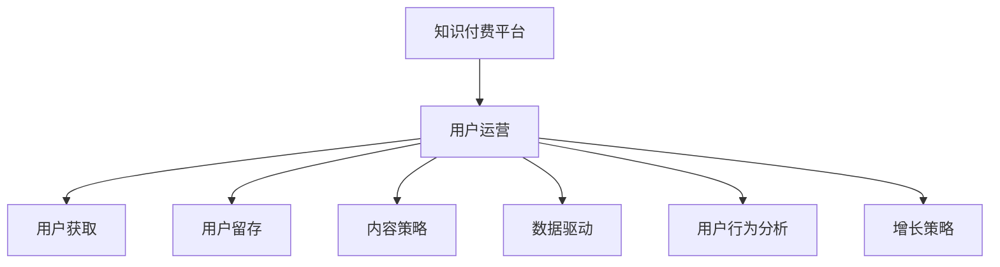

                 

# 打造技术型知识付费平台的用户运营体系

> 关键词：知识付费, 用户运营, 内容策略, 数据驱动, 客户行为分析, 增长策略

## 1. 背景介绍

### 1.1 问题由来

知识付费平台作为一种新兴的商业模式，近年来受到了广泛关注和热切期待。它基于移动互联网的快速普及，将知识产品以付费形式提供给用户，实现知识价值的变现。但随着平台数量的激增，市场竞争日趋激烈，用户获取和留存难度增加，平台发展瓶颈逐渐显现。用户运营体系作为知识付费平台的核心竞争力之一，其建设与优化对平台的发展具有重要意义。

### 1.2 问题核心关键点

知识付费平台的用户运营体系建设，主要围绕以下几个核心关键点展开：

- 用户获取：获取更多潜在用户，提高转化率。
- 用户留存：通过产品优化和用户互动，提升用户黏性和留存率。
- 内容质量：保证内容丰富、高质，满足用户个性化需求。
- 用户反馈：及时收集用户反馈，改进产品和服务。
- 市场推广：利用数据分析，精准推广，提高平台知名度。
- 运营策略：结合数据分析，制定科学合理的运营策略。

## 2. 核心概念与联系

### 2.1 核心概念概述

为更好地理解技术型知识付费平台的用户运营体系，本节将介绍几个密切相关的核心概念：

- **知识付费平台**：以知识为主要产品，通过平台为媒介实现知识变现的商业模式。平台根据用户需求提供各类知识产品，如文章、课程、音频、视频等。

- **用户运营**：指通过策略和工具对平台上的用户进行管理和互动，以提高用户价值和留存率的过程。包括用户获取、用户留存、内容推荐、用户反馈、市场推广等多个方面。

- **内容策略**：围绕用户需求和平台目标，制定和实施内容规划、内容生产、内容推广等策略，以吸引用户、提高用户参与度。

- **数据驱动**：利用大数据技术，分析和挖掘用户行为数据，辅助决策，优化运营策略，提升平台效果。

- **用户行为分析**：对用户在平台上的行为数据进行收集、分析和预测，了解用户需求和行为模式，为运营决策提供依据。

- **增长策略**：根据平台当前发展阶段和用户需求，制定有效的用户增长策略，实现平台的用户数和收入的提升。

这些核心概念之间的逻辑关系可以通过以下Mermaid流程图来展示：



这个流程图展示出知识付费平台的用户运营体系是由多个核心组件组成的有机整体，每个组件相互关联、相互作用，共同驱动平台的发展和优化。

## 3. 核心算法原理 & 具体操作步骤
### 3.1 算法原理概述

技术型知识付费平台的用户运营体系建设，是一个集数据驱动、用户行为分析和增长策略优化为一体的复杂过程。其核心思想是通过对用户行为数据的分析和挖掘，制定科学合理的运营策略，提升用户价值和留存率，最终实现平台的增长。

### 3.2 算法步骤详解

基于数据驱动的用户运营体系建设，一般包括以下几个关键步骤：

**Step 1: 数据采集与处理**
- 通过平台日志、用户行为数据、付费记录等收集用户数据。
- 对数据进行清洗和预处理，去除噪音和无效数据，保证数据的完整性和准确性。
- 对数据进行结构化处理，如用户画像构建、用户行为序列化等。

**Step 2: 用户行为分析**
- 对用户行为数据进行统计分析，如日活跃用户数、月留存率、付费率等关键指标。
- 利用机器学习算法，对用户行为进行预测和分类，如用户流失预测、用户兴趣分类等。
- 使用A/B测试等方法，验证不同运营策略的效果。

**Step 3: 用户画像构建**
- 根据用户行为数据，构建用户画像，描述用户的基本特征、行为偏好和需求。
- 通过聚类分析、降维等技术，对用户进行分类和细分，识别出高价值用户。
- 根据用户画像，制定针对性的运营策略，提升用户价值和满意度。

**Step 4: 内容推荐策略**
- 根据用户画像和行为数据，设计个性化内容推荐算法。
- 利用协同过滤、基于内容的推荐、混合推荐等技术，实现内容的多样化和精准推荐。
- 根据用户反馈和推荐效果，不断优化推荐算法，提高用户参与度和满意度。

**Step 5: 增长策略制定**
- 根据用户行为数据和增长目标，制定有效的用户增长策略。
- 使用漏斗分析、用户路径分析等方法，找出用户流失环节，优化用户体验。
- 利用社交网络、广告投放等手段，增加平台曝光度，吸引新用户。

**Step 6: 运营策略优化**
- 根据用户行为数据和运营效果，不断优化运营策略。
- 采用数据分析和机器学习技术，提升运营决策的科学性和有效性。
- 结合用户反馈和市场变化，灵活调整运营策略，保持平台的竞争力和活力。

### 3.3 算法优缺点

数据驱动的用户运营体系建设，具有以下优点：

1. **数据驱动决策**：通过数据分析，获取真实客观的用户行为信息，制定科学合理的运营策略，避免决策主观性。
2. **精细化运营**：基于用户画像和行为数据，实现精细化的运营策略，提高用户满意度和留存率。
3. **持续优化**：通过不断的数据分析和反馈，持续优化运营策略，保持平台的竞争力和增长潜力。

同时，也存在以下局限性：

1. **数据质量问题**：数据收集和处理环节可能存在噪音和偏差，影响分析和决策的准确性。
2. **隐私和安全问题**：用户行为数据的收集和存储可能涉及隐私和数据安全问题，需要严格遵守法律法规和伦理规范。
3. **算法复杂性**：用户行为分析和推荐算法设计复杂，需要高水平的算法和数据科学家支持。
4. **资源投入大**：数据采集、处理和分析需要投入大量的人力、时间和资源，成本较高。

尽管存在这些局限性，但数据驱动的用户运营体系建设，在提高用户价值和留存率方面具有不可替代的优势，是知识付费平台发展的必然选择。

### 3.4 算法应用领域

基于数据驱动的用户运营体系建设，在知识付费平台中已经得到了广泛的应用，覆盖了以下几个主要领域：

- **用户获取**：通过数据分析和用户画像构建，制定有效的市场推广策略，提高用户获取效率和转化率。
- **用户留存**：通过用户行为分析，识别出流失用户，设计针对性的运营策略，提升用户黏性和留存率。
- **内容推荐**：利用推荐算法，实现个性化内容推荐，满足用户多样化需求，提高用户参与度和满意度。
- **增长策略**：结合用户行为数据和增长目标，制定有效的用户增长策略，实现平台的用户数和收入的提升。
- **运营决策**：通过数据分析和机器学习技术，提升运营决策的科学性和有效性，优化运营策略。

这些核心领域的应用，使得知识付费平台能够更精准地满足用户需求，提升用户体验，实现商业价值最大化。

## 4. 数学模型和公式 & 详细讲解 & 举例说明

### 4.1 数学模型构建

本节将使用数学语言对技术型知识付费平台的用户运营体系进行更加严格的刻画。

设用户总数为 $N$，活跃用户数为 $A$，流失用户数为 $L$，付费用户数为 $P$。定义日活跃用户数 (DAU) 为 $DAU = \frac{A}{N}$，月活跃用户数 (MAU) 为 $MAU = \frac{A}{N}$。

定义用户流失率为 $\alpha$，用户付费率为 $\beta$。用户流失率 $\alpha$ 可由公式 $\alpha = \frac{L}{A}$ 计算得到。用户付费率 $\beta$ 可由公式 $\beta = \frac{P}{N}$ 计算得到。

用户流失模型可表示为：

$$
\begin{aligned}
    P(t+1) &= P(t) \cdot (1-\alpha) \\
    L(t+1) &= L(t) + \alpha \cdot P(t)
\end{aligned}
$$

其中 $P(t)$ 和 $L(t)$ 分别表示时间 $t$ 的付费用户数和流失用户数。

### 4.2 公式推导过程

以下我们以用户流失预测为例，推导相关公式的计算过程。

假设用户流失率 $\alpha$ 服从泊松分布，即 $\alpha \sim \text{Poisson}(\lambda)$。则用户流失率 $\alpha$ 的期望值为 $\lambda$，方差为 $\lambda$。

根据泊松分布的性质，用户流失预测模型可表示为：

$$
\alpha(t) = \frac{\lambda(t)}{N(t)}
$$

其中 $N(t)$ 表示时间 $t$ 的用户总数，$\lambda(t)$ 表示时间 $t$ 的流失率期望值。

利用最大似然估计法，可以计算出 $\lambda(t)$ 的估计值：

$$
\hat{\lambda}(t) = \frac{\sum_{i=1}^t (\alpha_i + \epsilon_i)}{t}
$$

其中 $\alpha_i$ 表示时间 $t$ 的第 $i$ 个用户流失事件，$\epsilon_i$ 表示用户流失事件的随机误差。

### 4.3 案例分析与讲解

假设某知识付费平台在时间 $t$ 的日活跃用户数为 1000 人，流失用户数为 100 人，付费用户数为 200 人。利用上述公式计算用户流失率和用户付费率的预测值：

1. 计算用户流失率 $\alpha(t)$：
$$
\alpha(t) = \frac{100}{1000} = 0.1
$$

2. 计算用户付费率 $\beta(t)$：
$$
\beta(t) = \frac{200}{1000} = 0.2
$$

3. 根据预测公式，计算下一时间点的用户流失率和用户付费率：
$$
\alpha(t+1) = \frac{\lambda(t+1)}{N(t+1)}
$$
$$
\beta(t+1) = \frac{P(t+1)}{N(t+1)}
$$

其中 $N(t+1)$ 表示时间 $t+1$ 的用户总数，$P(t+1)$ 表示时间 $t+1$ 的付费用户数。

通过不断的预测和验证，平台可以实时掌握用户流失和付费的动态变化，及时采取相应的运营策略，提升用户留存和收入。

## 5. 项目实践：代码实例和详细解释说明
### 5.1 开发环境搭建

在进行用户运营体系构建之前，我们需要准备好开发环境。以下是使用Python进行数据分析的开发环境配置流程：

1. 安装Anaconda：从官网下载并安装Anaconda，用于创建独立的Python环境。

2. 创建并激活虚拟环境：
```bash
conda create -n analytics-env python=3.8 
conda activate analytics-env
```

3. 安装必要的Python库：
```bash
pip install pandas numpy matplotlib seaborn scikit-learn
```

4. 安装数据分析工具：
```bash
pip install jupyter notebook
```

5. 安装可视化工具：
```bash
pip install plotly seaborn
```

完成上述步骤后，即可在`analytics-env`环境中开始用户运营体系构建。

### 5.2 源代码详细实现

下面我们以用户行为分析为例，给出使用Python进行数据分析的代码实现。

首先，定义用户行为数据结构：

```python
import pandas as pd

# 读取用户行为数据
data = pd.read_csv('user_behavior.csv')

# 显示数据前5行
print(data.head())
```

然后，进行数据分析：

```python
# 统计日活跃用户数
daus = data.groupby('date')['user_id'].nunique().reset_index(name='dau')
print(daus)

# 统计月活跃用户数
maus = data.groupby('month')['user_id'].nunique().reset_index(name='mau')
print(maus)

# 统计用户流失率
loss_rates = data.groupby('date')['user_id'].nunique().diff().dropna()
print(loss_rates)
```

接着，进行可视化展示：

```python
import matplotlib.pyplot as plt
import seaborn as sns

# 绘制日活跃用户数折线图
sns.lineplot(data=daus, x='date', y='dau')
plt.title('Daily Active Users')
plt.xlabel('Date')
plt.ylabel('DAU')
plt.show()

# 绘制月活跃用户数折线图
sns.lineplot(data=maus, x='month', y='mau')
plt.title('Monthly Active Users')
plt.xlabel('Month')
plt.ylabel('MAU')
plt.show()

# 绘制用户流失率折线图
sns.lineplot(data=loss_rates, x='date', y='loss_rate')
plt.title('User Loss Rates')
plt.xlabel('Date')
plt.ylabel('Loss Rate')
plt.show()
```

最后，进行用户流失预测：

```python
from scipy.stats import poisson

# 计算流失率期望值
lambda_hat = (loss_rates.sum() / len(loss_rates))  # 最大似然估计

# 预测流失率
pred_loss_rates = poisson(lambda_hat).pmf(range(1, 10))  # 生成0-9的流失率预测值
print(pred_loss_rates)

# 绘制预测值直方图
sns.histplot(pred_loss_rates, bins=10)
plt.title('Predicted User Loss Rates')
plt.xlabel('Loss Rate')
plt.ylabel('Count')
plt.show()
```

以上就是使用Python进行用户行为分析的完整代码实现。可以看到，数据分析和可视化可以通过Python快速高效地完成，为运营决策提供数据支撑。

### 5.3 代码解读与分析

让我们再详细解读一下关键代码的实现细节：

**用户行为数据结构**：
- 定义用户行为数据结构，包含日期、用户ID等关键字段。
- 使用Pandas库读取CSV格式的数据文件，并进行预处理，确保数据格式的正确性。

**数据分析**：
- 利用Pandas库进行数据分析，统计日活跃用户数和月活跃用户数。
- 利用Pandas库的groupby和diff方法，计算用户流失率，并进行数据处理，去除无效值。

**可视化展示**：
- 使用Matplotlib和Seaborn库绘制折线图，展示日活跃用户数、月活跃用户数和用户流失率的变化趋势。
- 通过设置图表标题、坐标轴标签等参数，增强图表的可读性和美观度。

**用户流失预测**：
- 利用泊松分布，计算流失率期望值，进行用户流失预测。
- 使用Scipy库中的泊松分布函数，生成预测值直方图。
- 通过设置图表标题和坐标轴标签，对预测结果进行可视化展示。

可以看到，通过Python工具库的辅助，用户行为分析能够快速高效地完成，为运营策略制定提供了坚实的数据基础。

## 6. 实际应用场景
### 6.1 智能推荐系统

智能推荐系统作为知识付费平台的重要功能，通过精准推荐个性化内容，提升用户参与度和满意度。用户行为数据是推荐算法的重要依据，通过用户画像和行为分析，可以设计有效的推荐策略。

具体实现步骤如下：
1. 收集用户行为数据，如浏览记录、收藏记录、付费记录等。
2. 对数据进行清洗和处理，构建用户画像，描述用户的兴趣和需求。
3. 利用协同过滤、基于内容的推荐等技术，设计个性化推荐算法。
4. 利用A/B测试等方法，验证推荐算法的效果，不断优化推荐策略。

### 6.2 用户获取与留存

用户获取和留存是知识付费平台运营的核心任务之一。通过用户行为数据分析，可以制定有效的用户获取和留存策略，提高平台的用户数和用户黏性。

具体实现步骤如下：
1. 分析用户行为数据，统计用户获取渠道、留存率等关键指标。
2. 根据数据分析结果，制定有效的市场推广策略，提高用户获取效率。
3. 通过用户行为分析，识别出流失用户，设计针对性的运营策略，提升用户留存率。
4. 利用A/B测试等方法，验证运营策略的效果，不断优化策略。

### 6.3 内容优化与推荐

内容优化与推荐是提升知识付费平台用户满意度的重要手段。通过用户行为数据分析，可以了解用户对内容的反馈和需求，优化内容生产和推荐策略。

具体实现步骤如下：
1. 分析用户行为数据，统计用户对内容的评价、推荐、收藏等行为。
2. 根据数据分析结果，优化内容生产和推荐策略，增加高价值内容。
3. 利用协同过滤、基于内容的推荐等技术，实现个性化内容推荐。
4. 利用A/B测试等方法，验证推荐策略的效果，不断优化推荐算法。

### 6.4 未来应用展望

随着数据驱动技术的发展，知识付费平台的用户运营体系将面临更多新的应用场景。以下列举几个未来的应用展望：

1. **个性化订阅**：通过用户行为数据分析，为用户推荐适合的订阅计划，提高订阅率和用户满意度。
2. **智能客服**：利用自然语言处理技术，实现智能客服系统，提升用户服务体验。
3. **用户反馈分析**：通过用户反馈数据分析，了解用户需求和痛点，优化产品和服务。
4. **社交网络分析**：利用社交网络分析技术，挖掘用户之间的关系和互动，提升平台社区氛围。
5. **广告投放优化**：通过用户行为数据分析，优化广告投放策略，提高广告效果和投入产出比。

这些未来应用场景，将进一步提升知识付费平台的运营效率和用户价值，推动平台向更加智能化和精细化的方向发展。

## 7. 工具和资源推荐
### 7.1 学习资源推荐

为了帮助开发者系统掌握数据驱动的用户运营体系，这里推荐一些优质的学习资源：

1. **《Python数据分析实战》系列博文**：通过实战案例，详细介绍Python数据分析的基本技术和方法，适合初学者学习。
2. **《数据科学入门》在线课程**：由知名大学开设的入门级数据科学课程，涵盖数据分析、机器学习等核心内容，适合系统学习。
3. **《Python数据科学手册》书籍**：全面介绍Python数据科学工具和技术的权威书籍，适合进阶学习。
4. **Kaggle竞赛平台**：提供大量数据集和竞赛项目，通过实际项目练习数据分析和机器学习技能。
5. **Google Colab**：谷歌提供的免费Jupyter Notebook环境，支持GPU/TPU算力，适合大规模数据分析。

通过对这些资源的学习实践，相信你一定能够快速掌握数据驱动的用户运营体系的精髓，并用于解决实际的运营问题。

### 7.2 开发工具推荐

高效的开发离不开优秀的工具支持。以下是几款用于数据驱动的用户运营体系开发的常用工具：

1. **Jupyter Notebook**：基于Web的交互式编程环境，支持Python、R等多种编程语言，适合数据分析和模型开发。
2. **Plotly**：可视化工具，支持多种图表类型，适合数据可视化和交互式展示。
3. **TensorFlow**：深度学习框架，支持分布式计算和GPU/TPU优化，适合大规模数据分析和模型训练。
4. **Apache Spark**：大数据处理引擎，支持分布式计算和内存计算，适合大规模数据处理和分析。
5. **Hadoop**：大数据处理框架，支持大规模数据存储和处理，适合数据仓库和数据湖建设。

合理利用这些工具，可以显著提升数据驱动的用户运营体系建设的开发效率，加快创新迭代的步伐。

### 7.3 相关论文推荐

数据驱动的用户运营体系建设源于学界的持续研究。以下是几篇奠基性的相关论文，推荐阅读：

1. **《用户行为数据挖掘与分析》**：介绍用户行为数据挖掘和分析的基本方法和技术，适合初学者学习。
2. **《用户行为预测模型研究》**：通过实证研究，展示用户行为预测模型的应用和效果。
3. **《基于机器学习的推荐系统》**：详细介绍推荐系统的主要算法和技术，适合进阶学习。
4. **《智能推荐系统的最新进展》**：总结推荐系统的发展历程和最新研究进展，适合深度学习爱好者学习。

这些论文代表了大数据和机器学习在用户运营体系建设中的应用方向，通过学习这些前沿成果，可以帮助研究者把握学科前进方向，激发更多的创新灵感。

## 8. 总结：未来发展趋势与挑战
### 8.1 总结

本文对数据驱动的知识付费平台用户运营体系进行了全面系统的介绍。首先阐述了数据驱动用户运营体系建设的背景和意义，明确了用户运营在知识付费平台发展中的核心作用。其次，从原理到实践，详细讲解了用户运营体系建设的数学原理和操作步骤，给出了用户运营任务开发的完整代码实例。同时，本文还探讨了用户运营体系在智能推荐、用户获取与留存、内容优化与推荐等多个领域的应用前景，展示了数据驱动用户运营体系的广泛应用和强大潜力。

通过本文的系统梳理，可以看到，数据驱动的用户运营体系建设在提高用户价值和留存率方面具有不可替代的优势，是知识付费平台发展的必然选择。

### 8.2 未来发展趋势

展望未来，数据驱动的用户运营体系建设将呈现以下几个发展趋势：

1. **智能化和自动化**：利用人工智能技术，实现自动化运营决策和策略优化。
2. **实时化和动态化**：实现实时数据分析和动态策略调整，提高运营效率和响应速度。
3. **多渠道和全流程**：整合多渠道用户数据，实现全流程的用户运营管理。
4. **个性化和定制化**：基于用户画像和行为数据，实现个性化运营策略和定制化服务。
5. **跨领域和跨行业**：将用户运营体系应用到更多行业和领域，提升各行业的运营水平。
6. **安全和隐私**：加强数据安全和隐私保护，确保用户数据的安全性和隐私性。

以上趋势凸显了数据驱动用户运营体系建设的广阔前景。这些方向的探索发展，必将进一步提升知识付费平台的用户运营效率和质量，为平台发展提供坚实的数据支撑。

### 8.3 面临的挑战

尽管数据驱动的用户运营体系建设已经取得了显著成果，但在迈向更加智能化、精细化和全流程化的过程中，它仍面临诸多挑战：

1. **数据质量和一致性**：数据采集和处理环节可能存在噪音和偏差，影响数据分析和决策的准确性。
2. **算法复杂性和成本**：用户行为分析和推荐算法设计复杂，需要高水平的算法和数据科学家支持。
3. **资源投入和技术要求**：用户运营体系建设需要投入大量的人力、时间和资源，技术要求较高。
4. **隐私和安全问题**：用户行为数据的收集和存储可能涉及隐私和数据安全问题，需要严格遵守法律法规和伦理规范。

尽管存在这些挑战，但通过不断的技术创新和实践探索，数据驱动的用户运营体系建设必将在未来的知识付费平台中发挥更大作用，推动平台向更加智能化和精细化的方向发展。

### 8.4 研究展望

面向未来，数据驱动的用户运营体系建设需要在以下几个方面寻求新的突破：

1. **自动化决策和策略优化**：利用人工智能技术，实现自动化运营决策和策略优化，提升运营效率和效果。
2. **实时化和大规模处理**：实现实时数据分析和动态策略调整，提高运营效率和响应速度。
3. **个性化和定制化服务**：基于用户画像和行为数据，实现个性化运营策略和定制化服务，提升用户满意度和黏性。
4. **跨领域和跨行业应用**：将用户运营体系应用到更多行业和领域，提升各行业的运营水平和效率。
5. **安全和隐私保护**：加强数据安全和隐私保护，确保用户数据的安全性和隐私性，建立用户信任基础。

这些研究方向的探索，必将引领数据驱动用户运营体系建设向更高的台阶迈进，为知识付费平台的发展提供坚实的数据支撑和决策依据。

## 9. 附录：常见问题与解答

**Q1：数据驱动的用户运营体系建设需要哪些关键步骤？**

A: 数据驱动的用户运营体系建设一般包括以下关键步骤：
1. 数据采集与处理：收集用户行为数据，进行清洗和预处理，构建用户画像。
2. 用户行为分析：对用户行为数据进行统计分析，使用机器学习算法进行预测和分类。
3. 用户画像构建：根据用户行为数据，构建用户画像，描述用户的基本特征和行为偏好。
4. 内容推荐策略：利用推荐算法，实现个性化内容推荐，满足用户多样化需求。
5. 增长策略制定：结合用户行为数据和增长目标，制定有效的用户增长策略。
6. 运营策略优化：根据用户行为数据和运营效果，不断优化运营策略，提升用户价值和留存率。

**Q2：如何进行用户画像构建？**

A: 用户画像构建是用户运营体系建设的重要步骤，主要包括以下步骤：
1. 数据收集：收集用户行为数据，如浏览记录、购买记录、评价记录等。
2. 数据清洗和预处理：去除噪音和无效数据，确保数据完整性和准确性。
3. 特征提取：提取用户的基本特征、行为偏好和需求，如兴趣、购买历史、地理位置等。
4. 聚类分析：利用聚类算法，将用户进行分类和细分，识别出高价值用户。
5. 画像展示：将用户画像以图表、标签等形式展示，方便运营人员理解和应用。

**Q3：如何进行用户行为预测？**

A: 用户行为预测是用户运营体系建设的关键环节，主要包括以下步骤：
1. 数据收集：收集用户行为数据，如浏览记录、购买记录、评价记录等。
2. 特征工程：提取用户行为特征，如浏览时长、购买频率、评价情感等。
3. 模型选择：选择合适的预测模型，如随机森林、线性回归、神经网络等。
4. 模型训练：使用历史数据训练模型，优化模型参数。
5. 模型验证：使用测试数据验证模型效果，调整模型参数和特征。
6. 预测应用：将模型应用到新数据，预测用户行为，指导运营决策。

通过不断优化模型和算法，可以实现精准的用户行为预测，为运营决策提供坚实的数据基础。

**Q4：如何设计有效的推荐算法？**

A: 推荐算法是用户运营体系建设的重要工具，主要包括以下步骤：
1. 数据收集：收集用户行为数据，如浏览记录、购买记录、评价记录等。
2. 特征工程：提取用户行为特征，如浏览时长、购买频率、评价情感等。
3. 推荐策略：选择推荐策略，如协同过滤、基于内容的推荐、混合推荐等。
4. 算法实现：实现推荐算法，如矩阵分解、协同过滤、基于内容的推荐等。
5. 模型训练：使用历史数据训练模型，优化模型参数。
6. 模型验证：使用测试数据验证模型效果，调整模型参数和特征。
7. 推荐应用：将模型应用到新数据，实现个性化内容推荐。

通过不断优化算法和模型，可以实现精准的内容推荐，提升用户满意度和参与度。

**Q5：如何进行用户增长策略制定？**

A: 用户增长策略是用户运营体系建设的关键环节，主要包括以下步骤：
1. 数据收集：收集用户行为数据，如浏览记录、购买记录、评价记录等。
2. 指标分析：分析用户获取渠道、留存率、付费率等关键指标，找出用户流失环节。
3. 渠道选择：选择适合的市场推广渠道，如社交媒体、广告投放等。
4. 推广策略：制定推广策略，如折扣优惠、内容营销等。
5. 策略评估：使用A/B测试等方法，评估推广策略的效果，优化策略。
6. 持续优化：根据推广效果和市场变化，持续优化推广策略，提高用户获取和留存效果。

通过不断优化推广策略，可以实现平台的用户数和收入的提升。

---

作者：禅与计算机程序设计艺术 / Zen and the Art of Computer Programming

