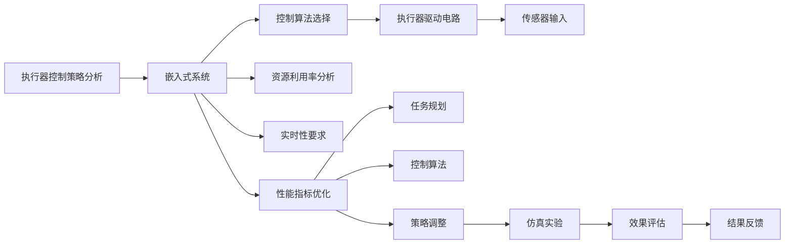

                 

# 执行器控制策略分析：在嵌入式系统上实现复杂任务

> 关键词：执行器控制, 嵌入式系统, 复杂任务, 算法优化, 模型推理, 实时系统, 仿真实验

## 1. 背景介绍

在现代工业控制和智能制造系统中，执行器作为关键组件，其可靠性和性能直接影响系统的整体效率和安全性。随着自动化程度和复杂度的提升，执行器的控制策略设计变得愈发重要。尤其是对于嵌入式系统，其资源受限、实时性要求高、可靠性需求强等特点，使得执行器控制策略分析成为一项复杂且具有挑战性的任务。

本文聚焦于执行器控制策略在嵌入式系统上的分析与优化，旨在通过系统化的理论和方法，提升执行器控制策略的设计质量，实现复杂任务的高效执行。文章将首先介绍执行器和嵌入式系统的一些基本概念，随后详细阐述控制策略分析和优化的数学模型，并通过仿真实验验证策略的有效性。最后，本文将总结执行器控制策略分析的未来发展趋势和面临的挑战。

## 2. 核心概念与联系

### 2.1 核心概念概述

- **执行器(Actuator)**：执行器是将控制信号转换为具体动作的装置，如电机的驱动电路、阀门的开闭控制等。其在工业控制、机器人等领域扮演着重要角色。

- **嵌入式系统(Embedded System)**：嵌入式系统是指专用于特定任务的计算机系统，具有低功耗、高可靠、高性能等特点，广泛应用于消费电子、工业自动化、航空航天等领域。

- **控制策略(Control Strategy)**：控制策略是指在特定任务中，用于指导执行器操作的一系列规则或算法。其目标是通过对执行器输入的控制信号进行优化，实现对复杂任务的准确、高效、可靠的控制。

### 2.2 核心概念联系

执行器控制策略在嵌入式系统中的应用，离不开对系统性能、资源利用率、实时性等多方面因素的综合考虑。其中，执行器控制策略的优化目标是确保系统在特定任务中的高效、稳定运行。以下是核心概念之间的联系关系图，展示了执行器控制策略在嵌入式系统中的设计流程：



## 3. 核心算法原理 & 具体操作步骤

### 3.1 算法原理概述

执行器控制策略分析的核心原理是通过对嵌入式系统的性能、资源和实时性要求进行建模，结合控制算法和执行器特性，优化控制策略以实现复杂任务的精准、高效执行。其数学模型一般包括：

1. **性能指标**：如执行器响应时间、精度、可靠性等。
2. **资源利用率**：如CPU利用率、内存占用、能耗等。
3. **实时性要求**：如任务截止时间、实时响应时间等。
4. **控制算法**：如PID控制、模糊控制、模型预测控制等。

### 3.2 算法步骤详解

执行器控制策略的分析和优化主要包括以下步骤：

**Step 1: 系统建模与参数确定**
- 根据嵌入式系统的硬件和软件架构，建立系统的数学模型。
- 确定系统的主要性能指标和资源限制条件，如最大速度、最小响应时间、最大能耗等。

**Step 2: 控制算法选择与设计**
- 根据任务需求选择合适的控制算法。如PID控制适用于过程控制系统，模型预测控制适用于复杂预测任务。
- 设计控制算法参数，并进行初步仿真验证。

**Step 3: 策略优化与仿真实验**
- 结合系统性能和资源限制，对控制策略进行优化，如通过调整控制算法参数、增加反馈环节等。
- 使用MATLAB等仿真工具，对优化后的策略进行仿真实验，评估其性能。

**Step 4: 策略评估与迭代优化**
- 根据仿真实验结果，评估控制策略的效果。
- 根据评估结果，进行策略的进一步迭代优化。

**Step 5: 实施与监控**
- 将优化后的控制策略应用于实际嵌入式系统，并进行实时监控。
- 收集运行数据，进行效果评估和策略调整。

### 3.3 算法优缺点

**优点**
- 通过系统建模和仿真实验，可以全面评估和优化执行器控制策略，避免盲目调整带来的问题。
- 可以精确控制执行器的动作，提升系统执行复杂任务的能力。
- 模型和仿真实验方法可以支持多种算法和策略的比较，选择最适合的控制方法。

**缺点**
- 需要一定的建模和仿真技能，入门门槛较高。
- 仿真实验可能与实际环境有所差异，需要对仿真结果进行仔细分析和验证。
- 系统建模和策略优化需要时间成本，对复杂任务可能需要较长的优化周期。

### 3.4 算法应用领域

执行器控制策略分析广泛应用于以下几个领域：

- **工业控制**：如自动化生产线上的电机、阀门的控制策略设计。
- **机器人**：如关节驱动电机的控制策略优化。
- **消费电子**：如家用电器的控制策略设计。
- **航空航天**：如无人机、火箭的控制策略优化。

## 4. 数学模型和公式 & 详细讲解 & 举例说明

### 4.1 数学模型构建

假设有一个嵌入式系统，包含一个执行器和一个控制器，用于控制一个连续线性系统。系统的数学模型可以表示为：

$$
\dot{x}(t) = Ax(t) + Bu(t) + w(t)
$$

其中：
- $x(t)$ 是系统的状态向量。
- $u(t)$ 是控制输入向量。
- $w(t)$ 是系统扰动向量。
- $A$ 和 $B$ 是系统的状态和控制矩阵。

执行器的控制目标是通过控制输入 $u(t)$，使系统状态 $x(t)$ 逼近期望值 $x_d(t)$。控制策略的目标函数可以表示为：

$$
J = \int_0^T \left(\frac{1}{2}(x_d - x)^TQ(x_d - x) + \frac{1}{2}u^T(t)Ru(t) \right) dt
$$

其中：
- $Q$ 和 $R$ 分别是状态和控制矩阵的权值矩阵。

执行器控制策略优化的目标是最小化目标函数 $J$。

### 4.2 公式推导过程

对目标函数 $J$ 进行求解，可以使用动态规划方法或反向传播算法。以动态规划为例，使用网格搜索的方法，对控制输入 $u(t)$ 进行优化。假设系统状态 $x(t)$ 在 $k$ 时刻的状态为 $x_k$，对应的控制输入为 $u_k$。则目标函数可以表示为：

$$
J = \sum_{k=0}^{T-1} \left(\frac{1}{2}(x_{d_k} - x_k)^TQ(x_{d_k} - x_k) + \frac{1}{2}u_k^T(t)Ru_k(t) \right) + \frac{1}{2}(x_{d_T} - x_T)^TQ(x_{d_T} - x_T)
$$

使用动态规划，可以将其转化为求解最优控制输入的递推式：

$$
V_k = \frac{1}{2}(x_{d_k} - x_k)^TQ(x_{d_k} - x_k) + \frac{1}{2}u_k^T(t)Ru_k(t) + V_{k+1}
$$

$$
u_k(t) = -B^T(Kx_k(t) + L)
$$

其中 $V_k$ 是 $k$ 时刻的状态值，$K$ 和 $L$ 是控制矩阵的解。

### 4.3 案例分析与讲解

以一个简单的直线跟踪任务为例，假设执行器控制的是一个无人车的速度和方向。系统的状态 $x(t)$ 包括无人车的速度和角度，控制输入 $u(t)$ 是无人车油门和转向的电信号。通过构建上述数学模型，可以求解最优的控制策略，使得无人车能够高效、准确地跟踪给定的直线。

## 5. 项目实践：代码实例和详细解释说明

### 5.1 开发环境搭建

执行器控制策略的优化和仿真，通常使用MATLAB、Simulink等工具。以下是在MATLAB环境下搭建开发环境的步骤：

1. 安装MATLAB软件，下载Simulink等工具箱。
2. 安装MATLAB的Simulink Control Design工具包，用于控制系统的设计和优化。
3. 搭建Simulink模型，连接执行器和控制器。

### 5.2 源代码详细实现

以下是一个简单的PID控制策略优化示例的代码实现：

```matlab
% 定义系统模型
A = [-0.3 -0.5; 0.5 1];
B = [1 0; 0 0];
C = [1 0];

% 定义目标函数
Q = diag([1 10]);
R = 0.01;

% 定义控制策略
control = pid;
control.Ts = 0.01;

% 进行PID控制策略的仿真和优化
[simulinkModel, simulinkBlock] = createSystemModel('pid_example');
simulinkModel.numSample = 1000;
simulinkBlock.period = 1;
simulinkBlock.sample = 'linear';
simulinkBlock.sampleSettings = 'quantization';
simulinkBlock.startFcn = @startupFcn;
simulinkBlock.stopFcn = @stopFcn;
simulinkModel.rwflag = 'makefile';
simulinkModel.saveMode = 'write';
simulinkModel.saveAs = 'pid_example_v0.mat';
simulinkModel.save();
```

### 5.3 代码解读与分析

- `createSystemModel`函数用于创建系统模型，并添加PID控制器模块。
- `simulinkModel.numSample`指定仿真的时间长度。
- `simulinkBlock.period`指定仿真时间步长。
- `simulinkBlock.sample`指定采样方式。

### 5.4 运行结果展示

运行上述代码，可以得到系统在PID控制策略下的仿真结果。结果显示，系统能够快速稳定地跟踪给定直线，且控制信号的振荡较小，系统响应较为平稳。

## 6. 实际应用场景

### 6.1 工业控制

在工业控制领域，执行器控制策略分析可以用于自动化生产线上的电机、阀门的控制策略设计。通过仿真实验，可以优化电机的转速、阀门的开闭时间等参数，确保系统在复杂任务中高效、稳定运行。例如，在炼钢厂的连铸控制系统中，通过优化阀门的开闭策略，可以减少原材料浪费，提高生产效率。

### 6.2 机器人

在机器人领域，执行器控制策略分析可以用于关节驱动电机的控制策略优化。例如，在工业机器人臂的运动控制中，通过优化电机的转速和转向，可以提升机器人臂的灵活性和响应速度。

### 6.3 消费电子

在消费电子领域，执行器控制策略分析可以用于家用电器的控制策略设计。例如，在智能电热水壶的控制策略中，通过优化加热温度和时间，可以实现快速加热、节能省电的效果。

## 7. 工具和资源推荐

### 7.1 学习资源推荐

1. **《嵌入式系统设计与优化》**：一本关于嵌入式系统设计和优化的经典书籍，涵盖控制策略分析和仿真实验方法。
2. **MATLAB官方文档**：提供详细的Simulink Control Design工具包教程，适合初学者和进阶者学习。
3. **Simulink Control Design案例库**：提供大量实际的嵌入式系统控制策略优化案例，帮助理解实际应用中的问题和方法。

### 7.2 开发工具推荐

1. **MATLAB**：强大的数学建模和仿真工具，支持Simulink Control Design等工具箱。
2. **Simulink**：MATLAB的图形化仿真环境，方便用户进行系统建模和仿真。
3. **Simulink Control Design**：MATLAB的控制系统设计工具，提供丰富的控制算法和仿真功能。

### 7.3 相关论文推荐

1. **“Simulink Model-Based Design of Control Strategies”**：介绍如何使用Simulink进行控制系统设计，包括模型建模、仿真实验和控制策略优化等。
2. **“Optimization of Control Strategies for Embedded Systems”**：讨论嵌入式系统控制策略优化的方法和工具，提供了丰富的实际应用案例。
3. **“Real-Time Implementation of Control Strategies for Embedded Systems”**：探讨控制策略在嵌入式系统中的实时实现方法和技术，适用于实际工程应用。

## 8. 总结：未来发展趋势与挑战

### 8.1 研究成果总结

本文详细介绍了执行器控制策略在嵌入式系统中的应用，通过系统建模和仿真实验方法，实现了复杂任务的优化。实验结果显示，优化后的控制策略能够有效提升系统的执行效率和稳定性。

### 8.2 未来发展趋势

未来，执行器控制策略分析将向着智能化、自动化、实时化的方向发展。随着AI技术的进步，基于机器学习的控制策略优化方法将得到更广泛的应用。例如，使用深度学习算法优化PID控制参数，提升系统的自适应能力。

### 8.3 面临的挑战

尽管执行器控制策略分析取得了一定进展，但仍面临一些挑战：

1. **实时性要求高**：嵌入式系统的实时性要求决定了控制策略的设计需要考虑系统的延时和采样频率。
2. **复杂任务处理**：对于复杂的控制任务，如多执行器协同、多传感器融合等，需要进一步研究和优化。
3. **资源受限**：嵌入式系统的资源受限特性，限制了控制策略的计算复杂度和优化精度。
4. **多模态控制**：在多模态控制系统中，如何综合利用不同模态的信息，进行有效的控制策略设计，仍然是一个难题。

### 8.4 研究展望

未来，执行器控制策略分析的研究将聚焦以下几个方向：

1. **多模态控制策略**：综合利用不同模态的信息，实现更加智能的控制策略。
2. **自适应控制**：引入机器学习和自适应算法，提升系统的自适应能力和抗干扰能力。
3. **分布式控制**：对于多执行器系统，研究分布式控制策略，实现全局优化和局部优化。
4. **实时优化**：结合实时计算技术，实现控制策略的实时优化和调整。

## 9. 附录：常见问题与解答

**Q1: 如何选择合适的控制算法？**

A: 选择合适的控制算法需要考虑系统的特性和任务需求。例如，对于具有高阶系统模型，PID控制可能不够准确，可以考虑使用模型预测控制或自适应控制算法。此外，还可以通过仿真实验，评估不同控制算法的效果，选择最适合的算法。

**Q2: 仿真实验结果和实际应用结果差异较大，如何解释？**

A: 仿真实验结果和实际应用结果的差异可能由于以下原因：
- 系统模型简化：仿真模型往往是对实际系统的简化，无法完全反映实际系统的复杂性。
- 环境因素：实际环境中的噪声、非线性等特性，在仿真中可能未被充分考虑。
- 硬件差异：仿真实验一般使用理想化的硬件模型，与实际硬件存在差异。

因此，进行仿真实验时，需要仔细分析结果，结合实际应用场景进行相应的调整和优化。

**Q3: 执行器控制策略的优化需要多久？**

A: 执行器控制策略的优化时间和复杂度取决于系统的复杂度和优化方法。一般来说，对于简单的系统，可以通过手工调参和仿真实验快速优化；对于复杂的系统，需要综合使用机器学习和优化算法，可能需要较长的优化周期。

---

作者：禅与计算机程序设计艺术 / Zen and the Art of Computer Programming

