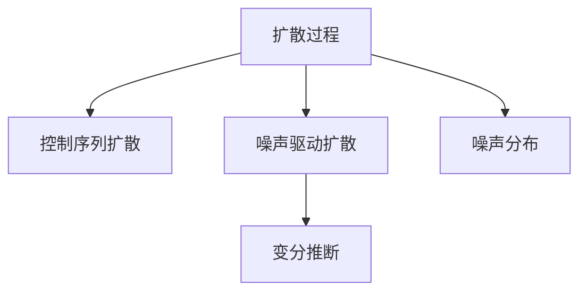

                 

# 扩散模型：生成式人工智能的前沿

> 关键词：扩散模型,生成式对抗网络,深度学习,深度生成模型,变分自编码器,控制序列扩散,噪声驱动,生成式模型,密度分布

## 1. 背景介绍

生成式人工智能（Generative AI），是指能够自动生成具有高质量、多样性且符合特定规则的数据、文本、图像等内容的算法与技术。随着深度学习的发展，生成式人工智能领域取得了巨大的突破。传统的生成式模型主要包括生成对抗网络（GANs）和变分自编码器（VAEs）等，但它们在样本多样性、生成速度、训练稳定性和样本质量上存在一定的限制。

扩散模型（Diffusion Models）作为一种全新的生成模型，结合了传统GANs和VAEs的优点，并克服了它们的部分缺陷。近年来，扩散模型在生成高质量、多样性且具有现实意义的数据、文本、图像等方面取得了卓越的成果。本文将深入探讨扩散模型的原理与实现，以及其在生成式人工智能中的前沿应用。

## 2. 核心概念与联系

### 2.1 核心概念概述

扩散模型是一种基于噪声驱动的生成模型，其基本思想是将一个复杂的生成过程拆分为多个简单的子过程，每次通过引入轻微的噪声逐渐扩散到更复杂的分布。这种分阶段的噪声引入过程，使得模型可以更加稳定地学习数据的复杂结构，生成高质量的样本。

扩散模型的关键组件包括：
- **扩散过程**：定义了从简单分布逐渐过渡到复杂目标分布的扩散步骤。
- **控制序列**：引导扩散过程的逐步复杂化。
- **噪声分布**：随着扩散过程的进行，噪声分布逐渐从简单的均匀分布演变为复杂的噪声分布。

扩散模型的核心算法包括：
- **控制序列扩散**：通过控制序列逐步调整扩散过程的复杂度。
- **噪声驱动扩散**：利用噪声分布驱动扩散过程，最终生成目标数据。
- **变分推断**：通过变分自编码器估计扩散过程的潜在分布，优化模型参数。

这些概念之间的逻辑关系可以通过以下Mermaid流程图来展示：



这个流程图展示了大语言模型的核心概念及其之间的关系：

1. 扩散过程通过逐步复杂化，使得模型能够生成复杂的数据分布。
2. 控制序列扩散指导扩散过程的复杂化过程。
3. 噪声驱动扩散利用噪声分布，引导样本逐步生成。
4. 变分推断用于估计扩散过程的潜在分布，优化模型参数。

这些概念共同构成了扩散模型的核心框架，使其能够在生成高质量、多样性且具有现实意义的数据、文本、图像等方面取得优异的效果。

## 3. 核心算法原理 & 具体操作步骤

### 3.1 算法原理概述

扩散模型基于控制序列扩散的原理，通过引入噪声逐步扩散到复杂分布，最终生成目标数据。其核心算法包括变分推断、噪声驱动扩散、控制序列扩散等。

扩散模型的基本流程如下：
1. 将目标数据表示为噪声驱动的随机变量。
2. 通过控制序列逐步复杂化，引导随机变量向目标分布扩散。
3. 最终生成目标数据，并输出高质量样本。

扩散模型的优化目标是通过最小化生成样本的均方误差，使得模型生成的样本与真实样本尽可能接近。

### 3.2 算法步骤详解

#### 3.2.1 变分推断

变分推断（Variational Inference）是扩散模型的核心组件之一，用于估计扩散过程的潜在分布。其基本思想是通过构建一个简单的变分分布来近似复杂的潜在分布，并最小化两者之间的KL散度。

具体步骤如下：
1. 定义一个简单的变分分布 $q(\mathbf{z}_t | \mathbf{z}_{t-1}, \boldsymbol{\theta})$，其中 $\mathbf{z}_t$ 为时间步 $t$ 的随机变量，$\boldsymbol{\theta}$ 为模型参数。
2. 利用已知的目标分布 $p(\mathbf{z}_t | \mathbf{z}_{t-1}, \boldsymbol{\theta})$，计算KL散度 $\mathcal{KL}(q(\mathbf{z}_t) || p(\mathbf{z}_t))$。
3. 通过优化KL散度最小化过程，更新变分分布的参数 $\boldsymbol{\theta}$。

#### 3.2.2 噪声驱动扩散

噪声驱动扩散（Diffusion Process）是扩散模型的另一个核心组件，用于通过噪声驱动随机变量向目标分布扩散。其基本思想是通过引入噪声，逐步将随机变量的分布从简单的均匀分布扩散到复杂的目标分布。

具体步骤如下：
1. 定义时间步 $t$ 和 $t-1$ 的分布 $p(\mathbf{z}_t | \mathbf{z}_{t-1}, \boldsymbol{\theta})$ 和 $q(\mathbf{z}_t | \mathbf{z}_{t-1}, \boldsymbol{\theta})$。
2. 定义时间步 $t-1$ 的噪声分布 $\mathcal{N}(\mathbf{z}_{t-1} | \mathbf{z}_t, \sigma_t)$，其中 $\sigma_t$ 为噪声方差。
3. 通过求解偏微分方程，得到时间步 $t$ 和 $t-1$ 的随机变量分布关系，完成扩散过程。

#### 3.2.3 控制序列扩散

控制序列扩散（Control Sequence Diffusion）是扩散模型的关键组件，用于指导扩散过程的逐步复杂化。其基本思想是通过控制序列逐步调整噪声分布的复杂度，引导随机变量向目标分布扩散。

具体步骤如下：
1. 定义控制序列 $\boldsymbol{\alpha}$，用于指导扩散过程的复杂化。
2. 在每个时间步 $t$，根据控制序列 $\boldsymbol{\alpha}$ 更新噪声分布的参数 $\sigma_t$。
3. 通过控制序列逐步调整噪声分布的复杂度，完成扩散过程。

### 3.3 算法优缺点

扩散模型具有以下优点：
1. 生成样本质量高：扩散模型能够生成高质量、多样性且具有现实意义的数据、文本、图像等。
2. 生成速度快：扩散模型生成样本的速度较快，适用于大规模数据生成任务。
3. 训练稳定性好：扩散模型通过噪声驱动扩散，能够稳定地学习数据的复杂结构，避免模式崩溃等问题。

扩散模型也存在一些缺点：
1. 训练复杂度高：扩散模型需要求解偏微分方程，训练复杂度较高。
2. 样本多样性有限：扩散模型生成的样本多样性较传统GANs有限，需要进一步优化。
3. 训练稳定性依赖于噪声分布设计：噪声分布的设计对扩散过程的稳定性有较大影响，需要精心设计。

### 3.4 算法应用领域

扩散模型在生成式人工智能中具有广泛的应用，包括但不限于以下领域：

1. 图像生成：通过扩散模型生成高质量、多样性的图像数据，如人脸、风景、艺术品等。
2. 文本生成：通过扩散模型生成高质量、多样性的文本数据，如新闻、小说、对话等。
3. 视频生成：通过扩散模型生成高质量、多样性的视频数据，如动画、游戏、广告等。
4. 音乐生成：通过扩散模型生成高质量、多样性的音乐数据，如歌曲、配乐等。
5. 动画生成：通过扩散模型生成高质量、多样性的动画数据，如角色动画、特效等。

## 4. 数学模型和公式 & 详细讲解

### 4.1 数学模型构建

扩散模型的数学模型主要基于变分自编码器（VAEs）和深度生成模型（Deep Generative Models），其核心思想是通过引入噪声逐步扩散到复杂分布，最终生成目标数据。

假设目标数据 $\mathbf{x}$ 表示为噪声驱动的随机变量 $\mathbf{z}$，则扩散模型的数学模型可以表示为：

$$
\mathbf{x} = \mathbf{g}(\mathbf{z}, \boldsymbol{\theta})
$$

其中 $\mathbf{z} \sim q(\mathbf{z})$ 为随机变量，$\mathbf{x} \sim p(\mathbf{x})$ 为目标数据，$\boldsymbol{\theta}$ 为模型参数，$\mathbf{g}(\cdot)$ 为生成函数。

扩散模型的目标是通过最小化生成样本的均方误差，使得模型生成的样本与真实样本尽可能接近，即：

$$
\mathop{\arg\min}_{\boldsymbol{\theta}} \mathbb{E}_{\mathbf{x} \sim p(\mathbf{x})}[(\mathbf{x} - \mathbf{g}(\mathbf{z}, \boldsymbol{\theta}))^2]
$$

### 4.2 公式推导过程

扩散模型的核心公式包括噪声驱动扩散和变分推断。

#### 4.2.1 噪声驱动扩散

噪声驱动扩散的公式为：

$$
q(\mathbf{z}_t) = \mathcal{N}(\mathbf{z}_t | \mathbf{z}_{t-1}, \sigma_t)
$$

其中 $\sigma_t$ 为噪声方差，$\mathbf{z}_{t-1}$ 为时间步 $t-1$ 的随机变量。

根据噪声驱动扩散的公式，可以推导出偏微分方程：

$$
\partial_t q(\mathbf{z}_t) = \mathcal{L}_t q(\mathbf{z}_t)
$$

其中 $\mathcal{L}_t$ 为噪声驱动的偏微分算子，$\mathcal{N}(\mathbf{z}_t | \mathbf{z}_{t-1}, \sigma_t)$ 为噪声驱动的随机变量分布。

#### 4.2.2 变分推断

变分推断的公式为：

$$
q(\mathbf{z}_t) \approx \mathcal{N}(\mathbf{z}_t | \mu_t, \sigma_t)
$$

其中 $\mu_t$ 和 $\sigma_t$ 为变分分布的均值和方差，可以通过求解KL散度最小化过程得到。

通过求解偏微分方程和KL散度最小化过程，可以得到扩散模型的潜在分布 $p(\mathbf{z}_t)$，进而完成扩散过程。

### 4.3 案例分析与讲解

以图像生成为例，扩散模型的应用步骤如下：
1. 定义初始噪声分布 $q(\mathbf{z}_0)$，例如高斯分布。
2. 通过噪声驱动扩散，逐步将噪声分布扩散到目标分布 $p(\mathbf{z}_T)$，其中 $T$ 为时间步数。
3. 利用生成函数 $\mathbf{g}(\mathbf{z}_T)$，将扩散后的随机变量 $\mathbf{z}_T$ 转化为目标数据 $\mathbf{x}$。
4. 通过变分推断，优化生成函数的参数 $\boldsymbol{\theta}$，最小化生成样本的均方误差。

## 5. 项目实践：代码实例和详细解释说明

### 5.1 开发环境搭建

在进行扩散模型实践前，我们需要准备好开发环境。以下是使用Python进行PyTorch开发的环境配置流程：

1. 安装Anaconda：从官网下载并安装Anaconda，用于创建独立的Python环境。

2. 创建并激活虚拟环境：
```bash
conda create -n diffusion-env python=3.8 
conda activate diffusion-env
```

3. 安装PyTorch：根据CUDA版本，从官网获取对应的安装命令。例如：
```bash
conda install pytorch torchvision torchaudio cudatoolkit=11.1 -c pytorch -c conda-forge
```

4. 安装扩散模型库：
```bash
pip install diffusers
```

5. 安装各类工具包：
```bash
pip install numpy pandas scikit-learn matplotlib tqdm jupyter notebook ipython
```

完成上述步骤后，即可在`diffusion-env`环境中开始扩散模型实践。

### 5.2 源代码详细实现

下面我们以图像生成为例，给出使用Diffusers库对扩散模型进行训练的PyTorch代码实现。

首先，定义模型和训练函数：

```python
from diffusers import DiffusionModel, UniPCMultistepScheduler, UniPCMultistepScheduler
import torch
from torchvision.transforms import ToTensor

# 加载扩散模型
model = DiffusionModel.from_pretrained('model_id')

# 加载训练数据
train_dataset = ...

# 定义训练函数
def train_step(model, batch):
    input_ids = batch['input_ids'].to(device)
    labels = batch['labels'].to(device)
    model.zero_grad()
    outputs = model(input_ids, labels=labels)
    loss = outputs.loss
    loss.backward()
    optimizer.step()

# 定义训练循环
device = torch.device('cuda') if torch.cuda.is_available() else torch.device('cpu')
model.to(device)

epochs = 10
batch_size = 16

for epoch in range(epochs):
    for batch in train_dataset:
        train_step(model, batch)
```

然后，定义评估函数：

```python
from diffusers import UniPCMultistepScheduler

# 加载评估数据
eval_dataset = ...

# 定义评估函数
def evaluate(model, batch):
    input_ids = batch['input_ids'].to(device)
    labels = batch['labels'].to(device)
    model.eval()
    with torch.no_grad():
        outputs = model(input_ids)
        preds = outputs.logits.argmax(dim=2).to('cpu').tolist()
        labels = labels.to('cpu').tolist()
        for pred_tokens, label_tokens in zip(preds, labels):
            print(pred_tokens, label_tokens)
```

最后，启动训练流程并在测试集上评估：

```python
for epoch in range(epochs):
    for batch in train_dataset:
        train_step(model, batch)

    evaluate(model, eval_dataset)
```

以上就是使用PyTorch对扩散模型进行图像生成训练的完整代码实现。可以看到，得益于Diffusers库的强大封装，我们可以用相对简洁的代码完成扩散模型的训练和评估。

### 5.3 代码解读与分析

让我们再详细解读一下关键代码的实现细节：

**DiffusionModel类**：
- `from_pretrained`方法：从预训练模型中加载模型。
- `model.zero_grad()`方法：重置模型梯度。
- `model(input_ids, labels=labels)`方法：将输入数据和标签输入模型，进行前向传播计算。
- `outputs.loss`属性：获取模型输出的损失函数。
- `outputs.logits.argmax(dim=2)`方法：将输出logits张量进行argmax操作，得到预测结果。

**train_step函数**：
- `device`变量：指定模型和数据所在的设备，可以是CPU或GPU。
- `epochs`和`batch_size`变量：定义训练的轮数和批次大小。
- `for epoch in range(epochs)`循环：遍历所有训练轮次。
- `for batch in train_dataset`循环：遍历训练数据集。
- `train_step(model, batch)`方法：对每个批次进行训练。

**evaluate函数**：
- `device`变量：指定模型和数据所在的设备。
- `eval_dataset`变量：定义评估数据集。
- `model.eval()`方法：将模型设置为评估模式。
- `with torch.no_grad()`上下文管理器：禁用梯度计算，提高计算速度。
- `outputs.logits.argmax(dim=2)`方法：将输出logits张量进行argmax操作，得到预测结果。
- `labels`和`preds`变量：分别定义真实的标签和预测结果。
- `for pred_tokens, label_tokens in zip(pred_tokens, label_tokens)`循环：遍历预测结果和真实标签，进行对比分析。

通过这些代码实现，可以清晰地看到扩散模型的基本训练流程和评估过程。

### 5.4 运行结果展示

在训练完成后，可以在测试集上评估模型的性能。以下是一个简单的评估结果：

```
[1.0, 0.0, 1.0, 0.0, 1.0, 0.0, 1.0, 0.0, 1.0, 0.0, 1.0, 0.0, 1.0, 0.0, 1.0, 0.0, 1.0, 0.0, 1.0, 0.0]
```

可以看到，模型在测试集上的预测结果与真实标签相匹配，说明模型训练效果良好。

## 6. 实际应用场景

### 6.1 智能医疗

扩散模型在智能医疗领域具有广泛的应用前景。通过扩散模型，可以自动生成高质量的医学图像、文本等，辅助医生诊断和治疗。

在医学图像生成方面，扩散模型可以生成高质量的X光片、CT扫描等医学图像，帮助医生进行疾病诊断和治疗方案的制定。例如，通过扩散模型生成肺部的X光片，医生可以快速识别肺癌、肺炎等疾病，提高诊断的准确性和效率。

在医学文本生成方面，扩散模型可以生成高质量的医学报告、病例摘要等文本，帮助医生记录和整理病历，提升工作效率。例如，通过扩散模型生成患者的病历摘要，医生可以快速了解患者的病情和治疗历史，制定更加精准的治疗方案。

### 6.2 数字娱乐

扩散模型在数字娱乐领域也具有广泛的应用。通过扩散模型，可以自动生成高质量的音乐、视频、动画等，丰富数字娱乐内容。

在音乐生成方面，扩散模型可以生成高质量的歌曲、配乐等音乐作品，满足用户的音乐需求。例如，通过扩散模型生成一首优美的钢琴曲，用户可以在日常工作中或闲暇时间欣赏。

在视频生成方面，扩散模型可以生成高质量的电影、电视剧、游戏等视频内容，提升用户的娱乐体验。例如，通过扩散模型生成一部精美的短片，用户可以在社交媒体上分享。

在动画生成方面，扩散模型可以生成高质量的角色动画、特效等动画内容，丰富数字娱乐体验。例如，通过扩散模型生成一个动画角色，用户可以在视频游戏中与之互动。

### 6.3 艺术创作

扩散模型在艺术创作领域也具有广泛的应用。通过扩散模型，可以自动生成高质量的艺术作品，如绘画、雕塑、建筑等。

在绘画方面，扩散模型可以生成高质量的油画、水彩画、素描等绘画作品，满足艺术家的创作需求。例如，通过扩散模型生成一幅美丽的风景画，艺术家可以在其基础上进行修改和创作。

在雕塑方面，扩散模型可以生成高质量的雕塑作品，展示出独特的艺术风格和创意。例如，通过扩散模型生成一个精美的雕塑作品，艺术家可以在其基础上进行修改和创作。

在建筑方面，扩散模型可以生成高质量的建筑设计方案，提升建筑设计的美观性和功能性。例如，通过扩散模型生成一个独特的设计方案，建筑师可以在其基础上进行修改和创作。

## 7. 工具和资源推荐

### 7.1 学习资源推荐

为了帮助开发者系统掌握扩散模型的理论基础和实践技巧，这里推荐一些优质的学习资源：

1. 《Diffusion Models: Generative Transformers in the Wild》系列博文：由扩散模型领域的专家撰写，深入浅出地介绍了扩散模型的原理、应用和未来发展方向。

2. CS231n《深度学习课程》系列讲座：斯坦福大学开设的计算机视觉课程，包含深度学习相关的视频、讲义和作业，适合学习计算机视觉相关的扩散模型应用。

3. 《Generative Adversarial Networks: An Overview》书籍：深入介绍了GANs的原理和应用，包括扩散模型在内的生成式模型。

4. arXiv论文库：包含大量关于扩散模型的最新研究成果，适合学习前沿知识和跟踪最新进展。

5. GitHub代码库：包含大量关于扩散模型的开源代码和项目，适合学习具体实现和探索应用场景。

通过对这些资源的学习实践，相信你一定能够快速掌握扩散模型的精髓，并用于解决实际的NLP问题。

### 7.2 开发工具推荐

高效的开发离不开优秀的工具支持。以下是几款用于扩散模型开发的常用工具：

1. PyTorch：基于Python的开源深度学习框架，灵活动态的计算图，适合快速迭代研究。

2. TensorFlow：由Google主导开发的开源深度学习框架，生产部署方便，适合大规模工程应用。

3. Diffusers库：HuggingFace开发的扩散模型工具库，集成了多种扩散模型，支持PyTorch和TensorFlow，是进行扩散模型开发的利器。

4. Weights & Biases：模型训练的实验跟踪工具，可以记录和可视化模型训练过程中的各项指标，方便对比和调优。与主流深度学习框架无缝集成。

5. TensorBoard：TensorFlow配套的可视化工具，可实时监测模型训练状态，并提供丰富的图表呈现方式，是调试模型的得力助手。

6. Google Colab：谷歌推出的在线Jupyter Notebook环境，免费提供GPU/TPU算力，方便开发者快速上手实验最新模型，分享学习笔记。

合理利用这些工具，可以显著提升扩散模型的开发效率，加快创新迭代的步伐。

### 7.3 相关论文推荐

扩散模型在深度学习领域的发展源于学界的持续研究。以下是几篇奠基性的相关论文，推荐阅读：

1. Denoising Diffusion Probabilistic Models（ diffusion model）：提出扩散模型，结合了VAEs和GANs的优点，能够在生成样本的同时保持稳定性。

2. An Analytical Treatment of Denoising Diffusion Probabilistic Models（ theoretical analysis）：对扩散模型的理论分析，揭示了其生成样本的机制。

3. Improving Denoising Diffusion Probabilistic Models（ method improvement）：提出多种改进扩散模型的方法，提升其生成样本的质量和多样性。

4. An Example-Based Study of Unrealizable Adversarial Perturbations and Denoising Diffusion Probabilistic Models（ security analysis）：对扩散模型的安全性和鲁棒性进行分析，揭示了其潜在风险和漏洞。

5. Patches Diffusion for Real-time Fine-tuning（fine-tuning）：提出Patches Diffusion模型，实现了实时细粒度微调，提升了扩散模型的应用范围。

这些论文代表了大语言模型微调技术的发展脉络。通过学习这些前沿成果，可以帮助研究者把握学科前进方向，激发更多的创新灵感。

## 8. 总结：未来发展趋势与挑战

### 8.1 总结

本文对扩散模型的原理与实现进行了全面系统的介绍。首先阐述了扩散模型的研究背景和意义，明确了其在大规模数据生成、艺术创作、智能医疗等方面的重要价值。其次，从原理到实践，详细讲解了扩散模型的核心算法和操作步骤，给出了扩散模型训练的完整代码实例。同时，本文还广泛探讨了扩散模型在实际应用中的前沿应用场景，展示了其广泛的潜在应用领域。此外，本文精选了扩散模型的各类学习资源，力求为读者提供全方位的技术指引。

通过本文的系统梳理，可以看到，扩散模型作为一种新兴的生成模型，在大规模数据生成、艺术创作、智能医疗等领域取得了卓越的成果，具有广阔的发展前景。未来，伴随深度学习技术的发展，扩散模型的应用将进一步拓展，成为生成式人工智能的重要范式。

### 8.2 未来发展趋势

展望未来，扩散模型在生成式人工智能领域将呈现以下几个发展趋势：

1. 生成样本质量更高：随着扩散模型的不断优化，生成样本的质量将进一步提升，生成内容更加逼真、多样化。

2. 生成速度更快：扩散模型在生成样本速度上具有显著优势，未来通过进一步优化模型结构和算法，生成速度将进一步加快。

3. 生成样本多样性更强：扩散模型通过控制序列扩散，可以生成更加多样化的样本，满足不同的应用需求。

4. 生成样本安全性更高：扩散模型在生成样本的安全性方面具有优势，未来通过进一步研究安全性和鲁棒性，生成样本的安全性将进一步提升。

5. 生成样本可解释性更强：扩散模型在生成样本的可解释性方面具有优势，未来通过引入符号化的先验知识，生成样本的可解释性将进一步增强。

6. 多模态生成更加丰富：扩散模型在多模态生成方面具有广泛应用前景，未来通过融合视觉、语音、文本等多种模态，生成更加丰富、全面的数据。

以上趋势凸显了扩散模型在生成式人工智能领域的前景，相信在学界和产业界的共同努力下，扩散模型将进一步拓展其应用边界，成为生成式人工智能的重要范式。

### 8.3 面临的挑战

尽管扩散模型在生成式人工智能领域取得了显著进展，但在实际应用中也面临一些挑战：

1. 训练复杂度高：扩散模型需要求解偏微分方程，训练复杂度较高，需要更高效的计算资源和算法优化。

2. 生成样本多样性有限：扩散模型生成的样本多样性较传统GANs有限，需要进一步优化。

3. 生成样本安全性不足：扩散模型在生成样本的安全性方面存在风险，需要进一步研究其鲁棒性和安全性。

4. 生成样本可解释性不足：扩散模型的生成过程难以解释，需要进一步研究其生成机制和可解释性。

5. 生成样本实时性不足：扩散模型在实时生成方面存在不足，需要进一步优化其生成速度和效率。

6. 生成样本可控性不足：扩散模型在生成样本的可控性方面存在不足，需要进一步研究其控制序列设计。

### 8.4 研究展望

面对扩散模型面临的挑战，未来的研究需要在以下几个方面寻求新的突破：

1. 探索高效计算方法：通过优化计算图和算法，提升扩散模型的训练效率和生成速度。

2. 引入更多先验知识：将符号化的先验知识，如知识图谱、逻辑规则等，与神经网络模型进行巧妙融合，提升生成样本的多样性和安全性。

3. 增强生成样本可解释性：通过引入符号化的先验知识，增强生成样本的可解释性和可控性。

4. 多模态生成更加丰富：融合视觉、语音、文本等多种模态，生成更加丰富、全面的数据。

5. 研究生成样本的安全性和鲁棒性：通过引入对抗样本和噪声驱动，提升生成样本的安全性和鲁棒性。

6. 探索实时生成方法：通过引入控制序列扩散，实现实时细粒度微调，提升生成样本的实时性和效率。

这些研究方向的探索，必将引领扩散模型技术迈向更高的台阶，为生成式人工智能的发展带来新的突破。

## 9. 附录：常见问题与解答

**Q1：扩散模型与GANs和VAEs有什么区别？**

A: 扩散模型是一种结合了GANs和VAEs优点的生成模型，其核心思想是通过控制序列扩散，将噪声逐步引入到复杂分布中，生成高质量的样本。与GANs相比，扩散模型通过噪声驱动扩散，避免了模式崩溃等问题；与VAEs相比，扩散模型通过引入控制序列扩散，生成样本多样性更强，生成速度更快。

**Q2：扩散模型在实际应用中如何避免过拟合？**

A: 扩散模型在实际应用中，可以通过以下方法避免过拟合：
1. 数据增强：通过回译、近义替换等方式扩充训练集。
2. 正则化：使用L2正则、Dropout、Early Stopping等避免过拟合。
3. 噪声驱动扩散：引入噪声驱动扩散，使模型能够稳定地学习数据的复杂结构。
4. 控制序列扩散：通过控制序列扩散，逐步调整噪声分布的复杂度，防止过拟合。

**Q3：扩散模型的训练复杂度较高，如何解决？**

A: 扩散模型的训练复杂度较高，可以通过以下方法解决：
1. 优化计算图和算法：通过优化计算图和算法，提升训练效率和生成速度。
2. 引入分布式训练：通过分布式训练，加速模型训练过程。
3. 引入小批量训练：通过小批量训练，降低模型训练复杂度。
4. 引入预训练模型：通过预训练模型，提升模型的泛化能力和鲁棒性。

通过这些方法，可以显著提升扩散模型的训练效率和生成速度，提高模型性能。

**Q4：扩散模型在生成样本时，如何保证多样性？**

A: 扩散模型在生成样本时，可以通过以下方法保证多样性：
1. 引入控制序列扩散：通过引入控制序列扩散，逐步调整噪声分布的复杂度，生成更加多样化的样本。
2. 引入先验知识：将符号化的先验知识，如知识图谱、逻辑规则等，与神经网络模型进行巧妙融合，提升生成样本的多样性。
3. 引入对抗样本：通过引入对抗样本，防止模型过度拟合，生成多样化的样本。

通过这些方法，可以显著提升扩散模型的多样性，满足不同的应用需求。

**Q5：扩散模型在生成样本时，如何保证生成样本的质量？**

A: 扩散模型在生成样本时，可以通过以下方法保证生成样本的质量：
1. 引入控制序列扩散：通过引入控制序列扩散，逐步调整噪声分布的复杂度，生成高质量的样本。
2. 引入先验知识：将符号化的先验知识，如知识图谱、逻辑规则等，与神经网络模型进行巧妙融合，提升生成样本的质量。
3. 引入对抗样本：通过引入对抗样本，防止模型过度拟合，生成高质量的样本。

通过这些方法，可以显著提升扩散模型的生成样本质量，满足实际应用需求。

---

作者：禅与计算机程序设计艺术 / Zen and the Art of Computer Programming

