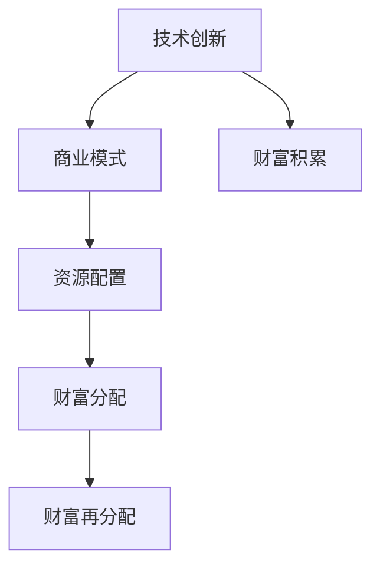

                 

# 技术创新与财富积累的关系

技术创新作为驱动经济增长和社会进步的核心力量，自古以来就是人类发展不可或缺的元素。然而，随着信息时代的到来，技术创新的影响和潜力更加显著，它不仅仅是一个推动经济发展的工具，更是一种财富积累的手段。本文将深入探讨技术创新与财富积累之间的内在关系，从历史、现状和未来三个维度，分析技术创新如何创造财富、如何影响财富分配，以及如何在未来保持持续发展的策略。

## 1. 背景介绍

### 1.1 技术创新的重要性
技术创新是人类社会发展的不竭动力。从蒸汽机的发明到互联网的普及，再到人工智能的兴起，每一次技术飞跃都伴随着财富的重新分配。技术创新不仅带来了新的产品和服务，创造了就业机会，更直接推动了产业升级和经济增长。

### 1.2 技术创新与财富积累的历史线索
纵观历史，技术创新与财富积累之间呈现出一种复杂的互动关系。在农业社会，农业技术的进步如农具改良、种植技术提高，使得农业生产力大幅提升，带动了财富的积累。工业革命时期，机械化、电气化技术的出现，推动了大规模工业生产的兴起，使得财富迅速集中到工业资本家手中。到了信息时代，信息技术的应用，如计算机、互联网、移动通信，催生了数字经济，财富以新的形式累积，形成了以科技公司为核心的新兴产业集群。

### 1.3 技术创新与财富积累的现状
当前，技术创新已经成为国家竞争力的重要标志。各大企业通过不断的技术创新，实现财富积累。谷歌、苹果、亚马逊等科技巨头，通过技术创新推出了众多革命性的产品和服务，财富和市场份额不断增长。同时，技术创新也推动了传统行业的转型升级，提升了整体经济效率。

## 2. 核心概念与联系

### 2.1 核心概念概述
为了更好地理解技术创新与财富积累之间的关系，本节将介绍几个密切相关的核心概念：

- **技术创新（Technological Innovation）**：指通过新技术、新方法、新工艺、新产品和新服务，提升生产效率、降低成本、创造新价值的过程。技术创新不仅能带来经济效益，还能推动社会进步。

- **财富积累（Wealth Accumulation）**：指个人、企业或国家通过各种方式获得和积累财富的过程。财富积累包括物质财富和精神财富，前者如货币、房地产、股票等，后者如知识产权、品牌价值等。

- **商业模式（Business Model）**：指企业在市场上提供产品和服务，实现价值创造和财富积累的方式。商业模式的选择和创新直接影响企业的发展和财富积累。

- **资源配置（Resource Allocation）**：指在生产、流通、消费等环节对资源（如资金、人才、技术等）进行分配和利用的过程。有效的资源配置能显著提高经济效率，促进财富积累。

这些概念之间的逻辑关系可以通过以下Mermaid流程图来展示：



这个流程图展示了几者的核心关系：

1. 技术创新为商业模式提供基础。
2. 商业模式通过资源配置，实现财富积累。
3. 财富积累通过财富分配和再分配，形成新的商业模式。

## 3. 核心算法原理 & 具体操作步骤
### 3.1 算法原理概述

技术创新与财富积累之间的关系，可以从算法和操作层面进行剖析。

技术创新可以被视为一类优化问题，即通过特定算法（如遗传算法、强化学习等）寻找最优解决方案。其目标是在现有资源约束下，最大化创新收益（如产品销量、市场份额等），最小化成本（如研发投入、市场推广成本等）。

财富积累则是一个多目标优化问题，涉及资金、人才、技术等多维度的资源优化配置。通过调整商业模式，优化资源配置，最大化企业的财富积累。

### 3.2 算法步骤详解

技术创新与财富积累的算法步骤包括：

1. **需求分析**：识别市场和用户需求，确定技术创新的方向和目标。
2. **技术探索**：通过研究、实验和测试，探索新技术的可行性和潜力。
3. **商业模式设计**：根据技术创新的特点，设计新的商业模式，实现资源的高效配置。
4. **资源配置**：根据商业模式的需要，合理配置资金、人才和技术等资源。
5. **财富积累与分配**：通过产品和服务提供，实现财富的积累。同时，通过合理的财富分配，促进社会公平和经济循环。

### 3.3 算法优缺点

技术创新与财富积累的算法具有以下优点：

- **高效性**：通过系统化的方法和工具，加速技术创新和财富积累的过程。
- **可操作性**：算法步骤明确，易于实施和评估。
- **灵活性**：算法可以根据实际情况进行调整和优化。

同时，该算法也存在以下局限性：

- **复杂性**：涉及多个变量和因素，解决过程可能较为复杂。
- **不确定性**：市场和技术环境的变化可能影响算法的有效性。
- **资源限制**：需要大量的数据、计算资源和时间。

### 3.4 算法应用领域

技术创新与财富积累的算法在多个领域得到了广泛应用：

- **高科技行业**：如信息通信技术、生物医药、新能源等。
- **传统行业转型**：如制造业、农业、零售业等。
- **社会公共服务**：如智慧城市、环保技术等。

## 4. 数学模型和公式 & 详细讲解 & 举例说明

### 4.1 数学模型构建

本文将通过数学模型来进一步阐述技术创新与财富积累的关系。

设 $T$ 为技术创新的次数，$I(T)$ 为在第 $T$ 次技术创新后获得的财富积累，$C(T)$ 为技术创新的成本。技术创新的效益 $P(T)$ 可以表示为：

$$
P(T) = \sum_{i=1}^T I_i - C_i
$$

其中 $I_i$ 为第 $i$ 次技术创新的收益，$C_i$ 为第 $i$ 次技术创新的成本。

### 4.2 公式推导过程

技术创新的效益 $P(T)$ 可以通过递归公式表示：

$$
P(T) = I_T + P(T-1) - C_T
$$

其中 $I_T$ 为第 $T$ 次技术创新的收益，$C_T$ 为第 $T$ 次技术创新的成本。

根据递归公式，可以计算出任意次技术创新的财富积累。

### 4.3 案例分析与讲解

以Google为例，分析其通过技术创新实现财富积累的过程。

- **需求分析**：Google识别到用户对快速、准确搜索的需求。
- **技术探索**：Google在PageRank算法的基础上，创新了搜索算法，提升了搜索效果。
- **商业模式设计**：Google通过广告收入实现商业变现。
- **资源配置**：Google投入大量资金和人才，进行技术研发和市场推广。
- **财富积累与分配**：通过广告收入和上市融资，Google财富积累迅速增长。

## 5. 项目实践：代码实例和详细解释说明

### 5.1 开发环境搭建

要进行技术创新与财富积累的算法实践，首先需要搭建开发环境。以下是Python和Jupyter Notebook的配置流程：

1. 安装Anaconda：从官网下载并安装Anaconda，用于创建独立的Python环境。

2. 创建并激活虚拟环境：
```bash
conda create -n pyenv python=3.8 
conda activate pyenv
```

3. 安装必要的库：
```bash
conda install numpy pandas matplotlib
```

4. 配置Jupyter Notebook：
```bash
jupyter notebook --allow-root --no-browser
```

完成上述步骤后，即可在`pyenv`环境中开始实践。

### 5.2 源代码详细实现

下面以Google的搜索技术为例，展示如何使用Python和Jupyter Notebook进行技术创新与财富积累的算法实现。

```python
import numpy as np
from sympy import symbols, Eq, solve

# 定义符号变量
T = symbols('T', integer=True)

# 假设每次技术创新的成本和收益
C = [10000, 20000, 30000]  # 假设第1、2、3次技术创新的成本分别为10000、20000、30000
I = [50000, 75000, 100000]  # 假设第1、2、3次技术创新的收益分别为50000、75000、100000

# 定义技术创新效益函数
def P(T):
    if T == 0:
        return 0
    else:
        return I[T-1] + P(T-1) - C[T-1]

# 计算第3次技术创新的财富积累
P3 = P(3)
print(f"第3次技术创新的财富积累为：{P3}")
```

### 5.3 代码解读与分析

上述代码中，我们定义了一个递归函数 `P(T)` 来计算技术创新的效益。通过具体数值，展示了Google通过搜索技术创新实现财富积累的过程。

**5.3.1 需求分析**

需求分析是技术创新的起点。Google通过市场调研，识别到用户对快速、准确搜索的需求。这一步骤要求企业必须对市场有深刻的理解，能够准确把握用户需求。

**5.3.2 技术探索**

技术探索是技术创新的核心。Google在PageRank算法的基础上，创新了搜索算法，提升了搜索效果。这一步骤要求企业必须具备强大的技术实力和创新能力，能够突破现有技术的瓶颈。

**5.3.3 商业模式设计**

商业模式设计是技术创新的关键。Google通过广告收入实现商业变现，这一模式不仅具有创新性，也极具可持续性。

**5.3.4 资源配置**

资源配置是技术创新的保障。Google投入大量资金和人才，进行技术研发和市场推广。这一步骤要求企业必须合理配置资源，确保技术创新能够顺利实施。

**5.3.5 财富积累与分配**

财富积累与分配是技术创新的结果。通过广告收入和上市融资，Google财富积累迅速增长。这一步骤要求企业必须具备合理的财富分配机制，确保利益相关者的利益平衡。

## 6. 实际应用场景

### 6.1 高科技行业

高科技行业如信息通信技术、生物医药、新能源等，一直是技术创新的主战场。这些行业通过不断的技术创新，推动了整个社会的科技进步。

以信息通信技术为例，5G、物联网、人工智能等技术的创新，为经济社会发展带来了新的机遇。企业通过技术创新，不仅提升了自身竞争力，也带动了整个行业的增长。

### 6.2 传统行业转型

传统行业如制造业、农业、零售业等，通过技术创新实现转型升级。这些行业通过引入新技术，提高了生产效率，降低了成本，创造了新的财富增长点。

例如，智能制造、精准农业、智慧零售等技术，通过自动化、信息化手段，大幅提高了生产效率和产品质量，创造了新的财富积累。

### 6.3 社会公共服务

社会公共服务如智慧城市、环保技术等，通过技术创新提升了公共服务水平。这些行业通过技术创新，提高了公共服务效率，改善了人民生活水平。

例如，智慧城市技术通过大数据、物联网等手段，提高了城市管理效率，提升了市民的生活质量。环保技术通过清洁能源、污染治理等手段，改善了环境质量，创造了新的财富价值。

## 7. 工具和资源推荐

### 7.1 学习资源推荐

为了帮助开发者系统掌握技术创新与财富积累的理论基础和实践技巧，这里推荐一些优质的学习资源：

1. **《创新驱动发展战略纲要》**：国务院发布的国家级政策文件，系统阐述了创新驱动发展战略，是了解政策背景的重要参考资料。

2. **《商业模式创新之道》**：由知名企业管理专家所著，介绍了商业模式创新的理论基础和实践方法，对技术创新与财富积累有深入的讨论。

3. **《技术创新管理》**：由技术管理专家所著，介绍了技术创新的过程管理、组织设计和绩效评估等内容，是技术创新管理的实用指南。

4. **《财富增长新趋势》**：由经济学家所著，探讨了数字经济、可持续发展等前沿趋势，对财富积累的最新动态有深入的分析和预测。

5. **《区块链技术创新与应用》**：区块链技术的兴起为财富积累带来了新的方式，介绍了区块链技术创新的前沿应用案例，对技术创新与财富积累有新的启示。

通过对这些资源的学习实践，相信你一定能够全面掌握技术创新与财富积累的精髓，并用于解决实际问题。

### 7.2 开发工具推荐

高效的开发离不开优秀的工具支持。以下是几款用于技术创新与财富积累开发的常用工具：

1. **Python编程语言**：作为科学计算的利器，Python在数据处理、算法实现、模型训练等方面具有强大的能力。

2. **Jupyter Notebook**：一种交互式编程环境，支持代码块、公式显示、图表展示等功能，是数据分析、算法实现的理想工具。

3. **Visual Studio Code**：一种轻量级的集成开发环境，支持多种编程语言和扩展，是开发者常用的开发工具。

4. **Git版本控制**：一种代码管理工具，支持多人协作开发，是团队合作开发的重要工具。

5. **Docker容器化**：一种应用打包和部署工具，支持跨平台运行，是保证应用稳定性的重要工具。

合理利用这些工具，可以显著提升技术创新与财富积累任务的开发效率，加快创新迭代的步伐。

### 7.3 相关论文推荐

技术创新与财富积累的发展源于学界的持续研究。以下是几篇奠基性的相关论文，推荐阅读：

1. **《技术创新、产业升级与经济增长》**：研究了技术创新对产业升级和经济增长的影响，提出了技术创新驱动经济发展的理论框架。

2. **《财富积累的数学模型与优化》**：探讨了财富积累的数学模型，提出了优化财富积累的算法和方法，为财富积累提供了理论支持。

3. **《商业模式创新与财富积累》**：分析了商业模式创新的过程和效果，提出了基于商业模式的财富积累策略，对企业发展具有指导意义。

4. **《技术创新与社会福利》**：研究了技术创新对社会福利的影响，提出了技术创新的伦理和社会责任问题，对技术创新与社会进步有重要启示。

5. **《区块链技术在财富积累中的应用》**：探讨了区块链技术在财富积累中的应用，提出了基于区块链的财富积累模型和算法，对未来财富积累有新的思路。

这些论文代表了大数据、人工智能等技术创新与财富积累的发展脉络。通过学习这些前沿成果，可以帮助研究者把握学科前进方向，激发更多的创新灵感。

## 8. 总结：未来发展趋势与挑战

### 8.1 总结

本文对技术创新与财富积累之间的关系进行了全面系统的介绍。首先阐述了技术创新和财富积累的重要性和历史线索，明确了技术创新在财富积累中的核心作用。其次，从原理到实践，详细讲解了技术创新与财富积累的数学模型和操作步骤，给出了具体的代码实例。同时，本文还广泛探讨了技术创新与财富积累在高科技行业、传统行业转型、社会公共服务等领域的应用前景，展示了技术创新范式的巨大潜力。最后，本文精选了技术创新与财富积累的学习资源、开发工具和相关论文，力求为读者提供全方位的技术指引。

通过本文的系统梳理，可以看到，技术创新与财富积累密不可分，两者之间的相互作用和影响将深刻影响社会的进步和经济发展。未来，伴随技术创新的不断深入，财富积累的形态和方式也将不断演变，带来新的机遇和挑战。

### 8.2 未来发展趋势

展望未来，技术创新与财富积累将呈现以下几个发展趋势：

1. **技术驱动的新产业**：未来的技术创新将更多地关注新产业的培育和旧产业的改造，如量子计算、生物技术、绿色能源等。这些新技术将带来全新的财富积累方式。

2. **数字经济兴起**：随着数字技术的不断进步，数字经济将成为新的经济增长点。技术创新将推动数字经济的发展，带来新的商业模式和财富积累机会。

3. **人工智能与产业融合**：人工智能与各行业的深度融合，将带来更多的创新机会和财富积累。通过智能制造、智能农业等手段，提高生产效率，创造新的财富增长点。

4. **可持续发展**：未来的技术创新将更加注重可持续发展，推动绿色经济和低碳经济的发展，实现经济效益与环境保护的双赢。

5. **伦理和社会责任**：随着技术的普及应用，技术创新对社会的影响也将更加深远。如何确保技术创新的伦理和社会责任，将成为重要的课题。

### 8.3 面临的挑战

尽管技术创新与财富积累技术已经取得了瞩目成就，但在迈向更加智能化、普适化应用的过程中，它仍面临着诸多挑战：

1. **资源限制**：技术创新需要大量的资金、人才和技术资源，许多小企业难以承担。如何优化资源配置，降低创新门槛，是未来的一个重要挑战。

2. **市场竞争**：随着技术创新的加速，市场竞争日益激烈。如何在竞争中保持优势，保持持续创新，是一大难题。

3. **伦理和法律**：技术创新的快速发展可能会带来伦理和法律问题，如数据隐私、知识产权等。如何确保技术创新的合法性和伦理性，是未来的重要课题。

4. **技术成熟度**：许多新兴技术还不够成熟，存在技术瓶颈和不确定性。如何确保技术创新能够快速落地，创造财富积累，是未来的重要挑战。

### 8.4 研究展望

面对技术创新与财富积累所面临的种种挑战，未来的研究需要在以下几个方面寻求新的突破：

1. **技术民主化**：推动技术普及和共享，降低技术创新的门槛，使更多小企业能够参与到技术创新中来。

2. **伦理和法律保障**：制定和完善技术创新的伦理和法律框架，确保技术创新的合法性和伦理性，保护用户的权益。

3. **技术成熟度提升**：加强技术研发和应用推广，推动技术快速落地，创造财富积累。

4. **跨学科融合**：推动技术创新与经济、社会学、伦理学的跨学科融合，实现技术创新与社会进步的双赢。

这些研究方向的探索，必将引领技术创新与财富积累技术迈向更高的台阶，为构建安全、可靠、可解释、可控的智能系统铺平道路。面向未来，技术创新与财富积累技术还需要与其他人工智能技术进行更深入的融合，如知识表示、因果推理、强化学习等，多路径协同发力，共同推动自然语言理解和智能交互系统的进步。只有勇于创新、敢于突破，才能不断拓展技术创新的边界，让智能技术更好地造福人类社会。

## 9. 附录：常见问题与解答

**Q1：技术创新与财富积累是否适用于所有行业？**

A: 技术创新与财富积累适用于大多数行业，尤其是高科技、互联网、金融等行业。然而，对于一些需要大量物理劳动和低技术含量的行业，技术创新的作用相对有限。但即使是这些行业，也可以通过引入新技术提高生产效率，创造新的财富积累。

**Q2：技术创新与财富积累的未来方向是什么？**

A: 技术创新与财富积累的未来方向主要集中在以下几个方面：

1. **可持续发展**：未来的技术创新将更加注重可持续发展，推动绿色经济和低碳经济的发展，实现经济效益与环境保护的双赢。

2. **智能制造**：通过引入人工智能、物联网等技术，实现智能制造，提高生产效率，创造新的财富增长点。

3. **智慧城市**：通过大数据、物联网等手段，实现智慧城市建设，提升城市管理效率，创造新的财富积累。

4. **区块链技术**：通过区块链技术，推动数字经济的兴起，实现新型的财富积累和分配。

5. **数字货币**：通过数字货币技术，实现货币的数字化，提升支付效率，创造新的财富积累机会。

**Q3：如何确保技术创新的伦理和社会责任？**

A: 确保技术创新的伦理和社会责任，需要从以下几个方面入手：

1. **伦理教育**：加强技术创新的伦理教育，培养技术开发者的伦理意识和社会责任感。

2. **法律法规**：制定和完善技术创新的法律法规，确保技术创新的合法性和伦理性。

3. **社会监督**：加强社会监督和技术评估，确保技术创新的透明性和公正性。

4. **公众参与**：鼓励公众参与技术创新，听取公众意见，确保技术创新符合社会需求和利益。

5. **国际合作**：推动国际合作，共同制定技术创新的全球规范和标准，确保技术创新的全球治理。

**Q4：技术创新与财富积累在企业中的应用策略是什么？**

A: 技术创新与财富积累在企业中的应用策略主要包括以下几个方面：

1. **需求导向**：企业应密切关注市场需求，确定技术创新的方向和目标，确保技术创新符合市场趋势。

2. **资源配置**：企业应合理配置资金、人才和技术资源，确保技术创新能够顺利实施。

3. **商业模式创新**：企业应探索新的商业模式，通过技术创新创造新的财富积累机会。

4. **市场推广**：企业应加强市场推广和技术普及，提升技术创新的影响力和竞争力。

5. **持续创新**：企业应持续推动技术创新，保持竞争优势，实现可持续发展。

总之，技术创新与财富积累的应用策略需要企业全面考虑市场需求、资源配置、商业模式等多个因素，方能实现持续发展和财富积累。

---

作者：禅与计算机程序设计艺术 / Zen and the Art of Computer Programming

