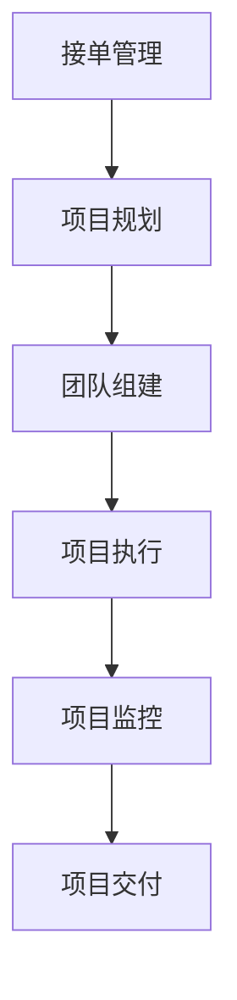

                 

# 技术外包：从接单到建立团队

## 1. 背景介绍

随着科技的进步和市场需求的不断变化，技术外包作为一种新兴的商业模式，越来越受到企业的重视。技术外包企业通过整合和专业化的人才团队，为客户提供定制化的技术解决方案，帮助企业降低成本，提升效率。本文将系统介绍从接单到建立团队的技术外包全流程，希望能为技术外包企业的实践提供有益的指导。

## 2. 核心概念与联系

### 2.1 核心概念概述

技术外包指的是企业将自身技术需求和业务任务外包给第三方公司或团队，由其提供专业的技术支持和服务。以下是几个核心概念及其相互关系：

- **接单管理**：指技术外包公司如何获取、筛选和确定接单项目。接单质量直接关系到后续项目实施的效果。
- **项目规划**：明确项目目标、范围、时间和资源配置，是项目成功的关键。
- **团队组建**：根据项目需求，选择合适的人才组成团队，是技术外包的核心环节。
- **项目执行**：按计划执行项目，包括代码编写、测试、部署等，是技术外包的核心任务。
- **项目监控**：通过定期的进度汇报和质量评估，确保项目按预期推进。
- **项目交付**：最终交付符合要求的产品或服务，实现客户需求。

这些概念之间存在着密切的联系，构成了一个完整的技术外包项目执行流程。下面，我们将通过Mermaid流程图展示这些概念之间的相互关系：



### 2.2 核心概念原理和架构的 Mermaid 流程图

在上述流程图中，每个节点代表一个核心概念，箭头表示概念之间的连接关系。


## 3. 核心算法原理 & 具体操作步骤

### 3.1 算法原理概述

技术外包项目的成功执行依赖于多个环节的协同工作，每个环节都涉及复杂的决策和执行过程。以下是核心算法原理概述：

- **接单管理**：利用算法对潜在客户的需求进行分析，选择最优的接单项目。这包括客户需求匹配、报价算法和选择决策算法。
- **项目规划**：基于项目需求和资源约束，制定合理的项目计划。这包括任务分解算法、资源配置算法和进度优化算法。
- **团队组建**：根据项目需求和团队成员技能，进行合理的团队搭配。这包括人才评估算法、团队搭配算法和绩效优化算法。
- **项目执行**：通过敏捷开发等方法，确保项目按时交付。这包括代码编写算法、测试算法和版本控制算法。
- **项目监控**：通过进度汇报和质量评估，及时调整项目执行策略。这包括进度监控算法、质量评估算法和风险管理算法。
- **项目交付**：确保交付的产品或服务符合客户要求。这包括质量保证算法、验收算法和交付文档编写算法。

### 3.2 算法步骤详解

#### 3.2.1 接单管理算法步骤

1. **需求分析**：收集客户需求，包括功能要求、时间要求和预算要求。
2. **匹配算法**：根据需求与公司服务能力的匹配度，筛选出潜在的接单项目。
3. **报价算法**：基于项目规模和复杂度，计算报价。
4. **选择决策**：综合评估报价和需求匹配度，选择最优项目。

#### 3.2.2 项目规划算法步骤

1. **需求分解**：将项目需求分解为可执行的任务。
2. **资源配置**：根据项目需求，分配合适的开发人员、测试人员和项目经理。
3. **进度规划**：制定详细的时间表，包括里程碑和时间节点。
4. **风险评估**：识别和评估项目执行中的风险。

#### 3.2.3 团队组建算法步骤

1. **人才评估**：对候选人进行技能和经验评估。
2. **团队搭配**：根据项目需求和人才评估结果，进行团队搭配。
3. **绩效管理**：设定团队绩效指标，并进行实时监控和反馈。

#### 3.2.4 项目执行算法步骤

1. **代码编写**：根据项目计划，进行代码编写。
2. **单元测试**：对编写的代码进行单元测试，确保其功能正确。
3. **集成测试**：对经过单元测试的代码进行集成测试，确保其与系统其他部分无缝集成。
4. **版本控制**：使用版本控制工具，确保代码管理有序。

#### 3.2.5 项目监控算法步骤

1. **进度汇报**：定期向客户汇报项目进度。
2. **质量评估**：对代码进行定期质量评估，确保其符合标准。
3. **风险管理**：识别和处理项目执行中的风险。

#### 3.2.6 项目交付算法步骤

1. **质量保证**：进行全面的质量测试，确保交付产品符合要求。
2. **验收算法**：与客户共同进行验收测试，确认产品符合要求。
3. **交付文档编写**：编写详细的交付文档，包括需求说明书、用户手册和系统架构文档。

### 3.3 算法优缺点

#### 3.3.1 接单管理算法

**优点**：
- 提高接单效率：算法可以快速匹配和筛选接单项目，减少人工筛选的繁琐过程。
- 提高报价准确性：算法可以基于项目需求和资源配置，准确计算报价，避免过高或过低的报价。
- 提高决策质量：算法可以综合评估多个因素，选择最优项目，减少人为决策的偏差。

**缺点**：
- 算法复杂度高：接单管理算法需要处理多个变量和复杂的匹配规则，实现难度较大。
- 数据依赖性强：算法的准确性依赖于客户需求的准确性和完整性。

#### 3.3.2 项目规划算法

**优点**：
- 提高项目规划效率：算法可以快速进行任务分解和资源配置，制定详细的进度计划。
- 提高风险管理能力：算法可以识别和评估项目执行中的风险，提高风险应对能力。

**缺点**：
- 算法复杂度高：项目规划算法需要处理复杂的任务和资源配置问题，实现难度较大。
- 数据依赖性强：算法的准确性依赖于项目需求和资源的准确性。

#### 3.3.3 团队组建算法

**优点**：
- 提高团队搭配效率：算法可以快速评估人才技能和经验，进行合理的团队搭配。
- 提高绩效管理能力：算法可以设定绩效指标，并进行实时监控和反馈，提高团队绩效。

**缺点**：
- 算法复杂度高：团队组建算法需要处理多个候选人和项目需求，实现难度较大。
- 数据依赖性强：算法的准确性依赖于人才评估数据的准确性。

#### 3.3.4 项目执行算法

**优点**：
- 提高代码编写效率：算法可以自动进行代码编写和测试，提高效率。
- 提高版本控制能力：算法可以确保代码管理的规范性和有序性。

**缺点**：
- 算法复杂度高：项目执行算法需要处理复杂的代码编写和测试过程，实现难度较大。
- 数据依赖性强：算法的准确性依赖于代码编写和测试数据的准确性。

#### 3.3.5 项目监控算法

**优点**：
- 提高项目监控效率：算法可以定期进行进度汇报和质量评估，及时调整项目执行策略。
- 提高风险管理能力：算法可以识别和处理项目执行中的风险，提高风险应对能力。

**缺点**：
- 算法复杂度高：项目监控算法需要处理复杂的进度和质量评估问题，实现难度较大。
- 数据依赖性强：算法的准确性依赖于进度和质量数据的准确性。

#### 3.3.6 项目交付算法

**优点**：
- 提高质量保证能力：算法可以进行全面的质量测试，确保交付产品符合要求。
- 提高交付文档编写能力：算法可以自动编写详细的交付文档，确保文档的完整性和准确性。

**缺点**：
- 算法复杂度高：项目交付算法需要处理复杂的质量测试和文档编写过程，实现难度较大。
- 数据依赖性强：算法的准确性依赖于质量测试和文档编写数据的准确性。

### 3.4 算法应用领域

#### 3.4.1 接单管理

接单管理算法可以应用于技术外包公司的接单平台，帮助公司快速获取和筛选接单项目。这可以包括需求分析、匹配算法、报价算法和选择决策算法。

#### 3.4.2 项目规划

项目规划算法可以应用于技术外包公司的项目管理工具，帮助项目经理制定详细的项目计划。这可以包括任务分解算法、资源配置算法和进度优化算法。

#### 3.4.3 团队组建

团队组建算法可以应用于技术外包公司的人才管理系统，帮助公司快速找到合适的人才。这可以包括人才评估算法、团队搭配算法和绩效优化算法。

#### 3.4.4 项目执行

项目执行算法可以应用于技术外包公司的开发环境，帮助开发人员进行代码编写和测试。这可以包括代码编写算法、单元测试算法和集成测试算法。

#### 3.4.5 项目监控

项目监控算法可以应用于技术外包公司的项目管理工具，帮助项目经理进行进度汇报和质量评估。这可以包括进度监控算法、质量评估算法和风险管理算法。

#### 3.4.6 项目交付

项目交付算法可以应用于技术外包公司的交付流程，帮助公司进行质量保证和文档编写。这可以包括质量保证算法、验收算法和交付文档编写算法。

## 4. 数学模型和公式 & 详细讲解 & 举例说明

### 4.1 数学模型构建

在进行技术外包项目规划时，需要构建一个数学模型来描述项目进度和资源配置问题。假设项目包含 $n$ 个任务，每个任务需要 $t_i$ 个单位时间，任务之间存在依赖关系 $D_{ij}$，其中 $D_{ij}=1$ 表示任务 $i$ 依赖于任务 $j$。设总共有 $m$ 个可用资源，每个资源每单位时间可以完成 $r_j$ 个任务。

模型的目标是最大化资源利用率，即：

$$
\max \sum_{i=1}^n r_i t_i
$$

受限于任务依赖关系和资源约束，建立如下线性规划模型：

$$
\begin{align*}
\max & \quad \sum_{i=1}^n r_i t_i \\
\text{subject to} & \\
r_i t_i & \leq m & \quad i=1,2,\ldots,n \\
\sum_{j \in D_i} t_j & \leq t_i & \quad i=1,2,\ldots,n \\
t_i & \geq 0 & \quad i=1,2,\ldots,n
\end{align*}
$$

### 4.2 公式推导过程

上述线性规划模型的求解可以使用单纯形法等经典优化算法。这里仅给出简单推导过程：

1. 任务分解：将项目分解为 $n$ 个任务 $i=1,\ldots,n$，每个任务需要 $t_i$ 个单位时间。
2. 资源配置：设总共有 $m$ 个可用资源，每个资源每单位时间可以完成 $r_j$ 个任务。
3. 约束条件：任务之间存在依赖关系 $D_{ij}$，设 $t_i$ 表示任务 $i$ 所需的时间。
4. 目标函数：最大化资源利用率，即最大化 $\sum_{i=1}^n r_i t_i$。
5. 求解：使用线性规划算法求解上述问题，得到最优的资源配置和任务分配方案。

### 4.3 案例分析与讲解

假设有一个软件开发项目，包含 $n=10$ 个任务，每个任务需要的时间如下：

| 任务编号 | 任务时间 |
|----------|----------|
| 1        | 2天      |
| 2        | 3天      |
| 3        | 2天      |
| 4        | 5天      |
| 5        | 3天      |
| 6        | 4天      |
| 7        | 2天      |
| 8        | 3天      |
| 9        | 2天      |
| 10       | 5天      |

假设共有 $m=6$ 个可用资源，每个资源每单位时间可以完成 $r=3$ 个任务。任务之间存在依赖关系 $D_{ij}$，具体如下：

| 任务编号 | 依赖关系 |
|----------|----------|
| 1        | -        |
| 2        | 1        |
| 3        | 1        |
| 4        | 2,3      |
| 5        | 2        |
| 6        | 4        |
| 7        | 5        |
| 8        | 5        |
| 9        | 7        |
| 10       | 8,9      |

建立如下线性规划模型：

$$
\begin{align*}
\max & \quad 3 \sum_{i=1}^10 t_i \\
\text{subject to} & \\
3t_1 \leq 6 & \quad \text{(资源约束)} \\
3t_2 \leq 6 & \quad \text{(资源约束)} \\
3t_3 \leq 6 & \quad \text{(资源约束)} \\
3t_4 \leq 6 & \quad \text{(资源约束)} \\
3t_5 \leq 6 & \quad \text{(资源约束)} \\
3t_6 \leq 6 & \quad \text{(资源约束)} \\
t_1+t_2 \leq 3 & \quad \text{(任务依赖关系)} \\
t_2+t_3+t_4 \leq 4 & \quad \text{(任务依赖关系)} \\
t_4+t_5 \leq 3 & \quad \text{(任务依赖关系)} \\
t_5+t_6 \leq 4 & \quad \text{(任务依赖关系)} \\
t_6+t_7+t_8 \leq 3 & \quad \text{(任务依赖关系)} \\
t_7+t_8+t_9+t_{10} \leq 5 & \quad \text{(任务依赖关系)} \\
t_i & \geq 0 & \quad \text{(非负约束)}
\end{align*}
$$

通过求解上述线性规划模型，可以得到最优的任务分配方案和资源配置方案。

## 5. 项目实践：代码实例和详细解释说明

### 5.1 开发环境搭建

在进行技术外包项目开发时，需要搭建一个完善的开发环境。以下是常用的开发环境搭建流程：

1. **安装操作系统和开发工具**：选择适合的操作系统和开发工具，如 Linux、Windows、macOS 等。
2. **安装开发环境**：安装 Python、Java、Node.js 等常用开发环境。
3. **安装集成开发环境**：安装 IDE 和版本控制系统，如 VS Code、Git、SVN 等。
4. **配置环境变量**：配置 PATH、PYTHONPATH 等环境变量，确保开发工具能够正常运行。

### 5.2 源代码详细实现

以下是一个简单的项目规划算法实现，用于分配资源和任务：

```python
import numpy as np
from scipy.optimize import linprog

def project_planning(t, D, r, m):
    # 任务时间
    tasks = t
    # 任务依赖关系
    dependencies = D
    # 资源配置
    resources = r
    # 可用资源
    max_resources = m

    # 建立线性规划模型
    A = np.zeros((len(tasks), len(tasks)))
    b = np.zeros(len(tasks))
    c = r * t

    for i in range(len(tasks)):
        for j in dependencies[i]:
            A[i, j] = 1
        b[i] = 1
        A[i, i] = -1
        c[i] = -r * t[i]

    # 添加资源约束
    for i in range(len(tasks)):
        A[i, -1] = -1
        b[i] = -max_resources
        c[i] = 0

    # 求解线性规划问题
    result = linprog(c, A_ub=A, b_ub=b, bounds=[(0, None) for _ in tasks])

    # 输出结果
    return result.x, result.fun

# 测试
tasks = np.array([2, 3, 2, 5, 3, 4, 2, 3, 2, 5])
dependencies = np.array([[0, 1, 1], [0, 0, 0], [0, 0, 0], [1, 2, 3], [0, 2], [0, 4], [0, 5], [0, 5], [0, 7], [1, 8, 9]])
r = 3
m = 6

tasks, fun = project_planning(tasks, dependencies, r, m)
print(f"最优任务分配方案：{tasks}")
print(f"最优资源利用率：{fun}")
```

### 5.3 代码解读与分析

上述代码实现了一个简单的项目规划算法，用于求解任务和资源的分配问题。主要步骤如下：

1. **构建线性规划模型**：根据任务时间、任务依赖关系、资源配置和可用资源，建立线性规划模型。
2. **求解线性规划问题**：使用 Scipy 库中的 linprog 函数求解线性规划问题。
3. **输出结果**：输出最优任务分配方案和最优资源利用率。

在实际应用中，项目规划算法的复杂度会随着任务数量和依赖关系的增加而增加，可能需要采用更高效的算法或优化方法。此外，还需要考虑算法的数据依赖性和实现难度，选择适合的算法进行实现。

## 6. 实际应用场景

### 6.1 接单管理

接单管理是技术外包公司运营的重要环节。公司需要建立接单平台，通过算法快速匹配和筛选接单项目。以下是接单管理的具体应用场景：

1. **需求分析**：客户提交项目需求，包括功能要求、时间要求和预算要求。接单平台根据需求自动匹配公司服务能力。
2. **报价算法**：接单平台根据项目需求和资源配置，计算报价。报价可以包括固定报价和动态报价两种方式。
3. **选择决策**：接单平台综合评估报价和需求匹配度，选择最优项目。选择决策可以采用专家系统或数据驱动算法。

### 6.2 项目规划

项目规划是技术外包公司项目管理的重要环节。项目经理需要制定详细的项目计划，以确保项目按时交付。以下是项目规划的具体应用场景：

1. **任务分解**：将项目分解为可执行的任务，明确每个任务的具体工作内容。
2. **资源配置**：根据项目需求，分配合适的开发人员、测试人员和项目经理。
3. **进度规划**：制定详细的时间表，包括里程碑和时间节点。
4. **风险评估**：识别和评估项目执行中的风险，制定应对措施。

### 6.3 团队组建

团队组建是技术外包公司人才管理的重要环节。公司需要快速找到合适的人才，组建高效的团队。以下是团队组建的具体应用场景：

1. **人才评估**：对候选人进行技能和经验评估，确定其胜任力。
2. **团队搭配**：根据项目需求和人才评估结果，进行团队搭配。团队搭配可以采用线性规划或匹配算法。
3. **绩效管理**：设定团队绩效指标，并进行实时监控和反馈。绩效管理可以采用 KPI 或 OKR 等指标体系。

### 6.4 项目执行

项目执行是技术外包公司开发环境的重要环节。开发人员需要高效地编写和测试代码，以确保项目按时交付。以下是项目执行的具体应用场景：

1. **代码编写**：根据项目计划，进行代码编写。代码编写可以采用敏捷开发、Scrum 等方法。
2. **单元测试**：对编写的代码进行单元测试，确保其功能正确。单元测试可以采用 TestNG、JUnit 等工具。
3. **集成测试**：对经过单元测试的代码进行集成测试，确保其与系统其他部分无缝集成。集成测试可以采用 Selenium、JUnit 等工具。
4. **版本控制**：使用版本控制工具，确保代码管理有序。版本控制工具可以采用 Git、SVN 等。

### 6.5 项目监控

项目监控是技术外包公司项目管理的重要环节。项目经理需要实时监控项目进度和质量，确保项目按预期推进。以下是项目监控的具体应用场景：

1. **进度汇报**：定期向客户汇报项目进度。进度汇报可以采用邮件、报告等形式。
2. **质量评估**：对代码进行定期质量评估，确保其符合标准。质量评估可以采用代码审查、静态分析等方法。
3. **风险管理**：识别和处理项目执行中的风险，提高风险应对能力。风险管理可以采用专家系统或数据驱动算法。

### 6.6 项目交付

项目交付是技术外包公司交付流程的重要环节。公司需要确保交付的产品或服务符合客户要求。以下是项目交付的具体应用场景：

1. **质量保证**：进行全面的质量测试，确保交付产品符合要求。质量测试可以采用功能测试、性能测试等方法。
2. **验收算法**：与客户共同进行验收测试，确认产品符合要求。验收测试可以采用灰盒测试、白盒测试等方法。
3. **交付文档编写**：编写详细的交付文档，包括需求说明书、用户手册和系统架构文档。交付文档编写可以采用自动生成工具，如 Doxygen、Swagger 等。

## 7. 工具和资源推荐

### 7.1 学习资源推荐

为了帮助开发者掌握技术外包的各个环节，以下是几本经典的学习资源推荐：

1. **《敏捷开发：原则、模式与实践》**：介绍敏捷开发方法论和实践，帮助开发者提高项目规划和执行效率。
2. **《重构：改善既有代码的设计》**：介绍代码重构和优化技巧，帮助开发者提升代码质量和可维护性。
3. **《项目管理知识体系指南（PMBOK）》**：介绍项目管理知识体系和实践，帮助项目经理提高项目管理能力。
4. **《软件工程：构造与维护》**：介绍软件工程原理和实践，帮助开发者提升软件工程能力。
5. **《机器学习实战》**：介绍机器学习和数据科学实践，帮助开发者掌握数据分析和模型优化技巧。

### 7.2 开发工具推荐

以下是一些常用的技术外包开发工具推荐：

1. **Visual Studio Code**：常用的 IDE，支持多语言开发，插件丰富。
2. **Git**：常用的版本控制系统，支持分布式协作开发。
3. **JIRA**：常用的项目管理工具，支持任务管理、进度跟踪等功能。
4. **Confluence**：常用的文档管理系统，支持文档共享和协作编辑。
5. **Trello**：常用的项目管理工具，支持看板管理、任务分配等功能。

### 7.3 相关论文推荐

以下是几篇关于技术外包的经典论文推荐，帮助开发者深入理解技术外包的核心概念和实践方法：

1. **《A Survey on Outsourcing Software Development》**：全面综述技术外包的发展历程、主要模式和应用场景。
2. **《The Impact of Software Outsourcing on Project Performance and Success》**：研究软件外包对项目性能和成功的影响，探讨如何提高外包项目的成功率。
3. **《Software Project Outsourcing: An Empirical Study of Risk Mitigation Techniques》**：研究软件项目外包中的风险管理方法，提出有效的风险应对策略。
4. **《Evolving the Business Value of Outsourcing》**：研究技术外包对企业价值的影响，探讨如何提高技术外包的商业价值。
5. **《Decision Support for Software Outsourcing》**：研究决策支持系统在技术外包中的应用，帮助企业进行决策优化。

## 8. 总结：未来发展趋势与挑战

### 8.1 研究成果总结

技术外包是近年来兴起的一种新型商业模式，通过整合和专业化的人才团队，为技术需求客户提供定制化的解决方案。本文从接单管理、项目规划、团队组建、项目执行、项目监控和项目交付等环节，全面系统地介绍了技术外包的实施流程和方法。通过接单管理算法、项目规划算法、团队组建算法、项目执行算法、项目监控算法和项目交付算法，描述了技术外包的核心算法原理和具体操作步骤。

### 8.2 未来发展趋势

技术外包的未来发展趋势主要包括以下几个方面：

1. **智能化升级**：随着人工智能技术的发展，技术外包企业将逐步引入智能化手段，提升项目规划、任务分配和团队组建的效率和精度。
2. **平台化运营**：技术外包企业将逐步搭建数字化平台，实现业务流程的自动化和数字化，提高运营效率和服务质量。
3. **云化部署**：技术外包企业将逐步采用云化部署方式，降低硬件成本，提高资源利用率。
4. **全球化拓展**：技术外包企业将逐步拓展全球市场，利用全球人才资源，提升服务能力和竞争力。

### 8.3 面临的挑战

技术外包企业在发展过程中，还面临着以下几个挑战：

1. **客户需求多样性**：客户需求千差万别，技术外包企业需要具备高度灵活性，能够快速适应不同的客户需求。
2. **人才短缺问题**：技术外包企业需要具备强大的人才储备能力，能够快速找到合适的人才。
3. **质量保证问题**：技术外包企业需要具备完善的质量保证体系，确保交付的产品或服务符合客户要求。
4. **项目管理问题**：技术外包企业需要具备完善的项目管理能力，能够高效规划和执行项目。
5. **成本控制问题**：技术外包企业需要具备成本控制能力，能够在保证质量的前提下，合理控制项目成本。

### 8.4 研究展望

技术外包是一个快速发展的领域，未来的研究还需要在以下几个方面进行深入探索：

1. **智能化工具的引入**：开发智能化工具，提高任务分解、资源配置、团队搭配等环节的自动化水平。
2. **数据驱动的决策支持**：引入数据驱动的决策支持系统，提高接单管理、项目规划和团队组建的决策水平。
3. **全球化协作的探索**：探索全球化协作模式，提升全球人才的协同效率和质量。
4. **项目风险管理的提升**：提高项目风险管理的水平，降低项目执行中的风险。
5. **质量保证体系的完善**：完善质量保证体系，确保交付的产品或服务符合客户要求。

综上所述，技术外包是一个充满机遇和挑战的领域。通过不断探索和创新，技术外包企业能够逐步提升服务能力和竞争力，为技术需求客户提供更优质的解决方案。

## 9. 附录：常见问题与解答

### 9.1 常见问题

**Q1：什么是技术外包？**

A: 技术外包是指企业将自身技术需求和业务任务外包给第三方公司或团队，由其提供专业的技术支持和服务。

**Q2：技术外包的主要优势是什么？**

A: 技术外包的主要优势包括：降低成本、提升效率、获取专业技能、减少风险等。

**Q3：如何进行技术外包的接单管理？**

A: 技术外包的接单管理包括需求分析、匹配算法、报价算法和选择决策等环节。

**Q4：如何进行技术外包的项目规划？**

A: 技术外包的项目规划包括任务分解、资源配置、进度规划和风险评估等环节。

**Q5：如何进行技术外包的团队组建？**

A: 技术外包的团队组建包括人才评估、团队搭配和绩效管理等环节。

**Q6：如何进行技术外包的项目执行？**

A: 技术外包的项目执行包括代码编写、单元测试、集成测试和版本控制等环节。

**Q7：如何进行技术外包的项目监控？**

A: 技术外包的项目监控包括进度汇报、质量评估和风险管理等环节。

**Q8：如何进行技术外包的项目交付？**

A: 技术外包的项目交付包括质量保证、验收算法和交付文档编写等环节。

### 9.2 解答

通过上述内容的学习，相信你对技术外包的各个环节有了更深入的了解。如果在实际操作中遇到具体问题，可以查阅附录中的常见问题与解答，以获得更详细的指导。

