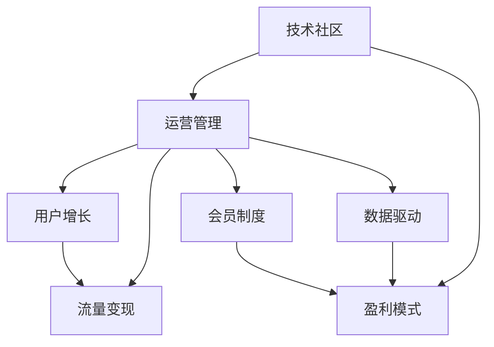

                 

# 技术社区运营：从管理到盈利模式

> 关键词：技术社区，运营管理，盈利模式，用户增长，流量变现，会员制度，广告收入，内容增值，数据驱动

## 1. 背景介绍

在信息爆炸的时代，技术社区成为了连接开发者、企业与用户的重要桥梁。这些社区提供了技术分享、问题解答、资源分享等价值，帮助技术爱好者在各自领域内迅速成长。然而，单纯的内容分享并不足以支撑社区的持续发展，很多社区面临着流量流失、商业化受阻等问题。

技术社区运营的核心目标，在于通过有效的管理策略和盈利模式，提升社区的用户粘性，实现商业变现，创造长期价值。本文将从管理到盈利两个维度，深入探讨技术社区的运营方法，帮助开发者和管理者更好地建设和发展社区。

## 2. 核心概念与联系

### 2.1 核心概念概述

为了更好地理解技术社区运营的核心概念，本节将介绍几个密切相关的核心概念：

- **技术社区**：一个以技术交流、分享、合作为主要目的的线上或线下组织形式。社区成员通过分享技术经验、发布项目代码、参与技术讨论等方式，共同促进技术进步和应用落地。

- **运营管理**：指通过组织策划、流程优化、用户互动等方式，维护和提升社区的活跃度和用户满意度。运营管理包括内容管理、用户互动、数据分析等环节。

- **盈利模式**：指技术社区通过不同的商业模式，实现商业变现，包括广告收入、会员费、知识付费、内容增值等。盈利模式的选择和设计是社区可持续发展的关键。

- **用户增长**：指通过有效的营销和推广策略，吸引更多用户加入社区，提升社区活跃度和用户粘性。用户增长是社区运营的核心目标之一。

- **流量变现**：指将社区的流量资源转化为实际的收入，包括广告、会员、知识付费等多种方式。流量变现是社区盈利的重要手段。

- **会员制度**：通过提供优质的内容、服务和特权，吸引用户成为社区会员，实现二次收费和深度用户粘性。会员制度是常见的社区盈利模式之一。

- **数据驱动**：指通过数据分析、用户行为预测等技术手段，优化社区运营策略，提升用户满意度和社区价值。数据驱动是社区精细化运营的基础。

这些核心概念之间的逻辑关系可以通过以下Mermaid流程图来展示：



这个流程图展示了大社区运营的核心概念及其之间的关系：

1. 大社区通过运营管理获得用户增长，进而带来流量。
2. 运营管理中的数据驱动帮助优化策略，提升用户满意度和增长效果。
3. 社区用户通过会员制度等盈利模式变现，实现可持续发展。
4. 盈利模式中的流量变现，将社区的流量资源转化为实际的收入。

## 3. 核心算法原理 & 具体操作步骤
### 3.1 算法原理概述

技术社区运营的算法原理主要涉及用户增长、流量变现、会员制度等多个环节。本文将以用户增长为例，简要介绍其核心算法原理。

用户增长算法基于社交网络理论，通过分析用户行为和社交关系，预测新用户加入社区的概率。常见的用户增长算法包括：

1. **网络分析法**：通过构建社区成员之间的社交网络，分析网络的结构和密度，预测新用户加入的可能性。

2. **行为分析法**：基于用户的历史行为数据，预测其加入社区的概率。常见的行为数据包括访问次数、浏览时长、参与互动等。

3. **推荐系统**：通过分析用户兴趣和行为偏好，推荐可能感兴趣的内容或社区，吸引新用户加入。

4. **A/B测试**：通过对比不同运营策略的效果，选择最优策略提升用户增长率。

### 3.2 算法步骤详解

以下是用户增长的具体算法步骤：

**Step 1: 数据收集**
- 收集社区用户的访问数据、行为数据、社交网络数据等，形成用户画像。

**Step 2: 数据分析**
- 使用网络分析法、行为分析法等方法，对用户数据进行统计分析，提取关键特征。

**Step 3: 模型训练**
- 基于历史数据，构建用户增长模型，如逻辑回归、随机森林等。
- 在测试集上进行验证，优化模型参数，提高预测准确率。

**Step 4: 预测与干预**
- 对新用户加入社区的概率进行预测，找出高概率用户群体。
- 针对预测出的高概率用户，进行定向推送、邮件邀请等干预措施。

**Step 5: 效果评估**
- 监测干预后的用户增长效果，评估模型预测的准确性和干预策略的效果。

### 3.3 算法优缺点

用户增长算法的优点包括：

1. **自动化**：通过算法自动预测和干预，减少人工干预，提升运营效率。
2. **高精度**：基于大量历史数据和模型优化，预测新用户加入的概率较高。
3. **可扩展性**：算法模型可以轻松扩展到不同社区，适用于多种类型的技术社区。

用户增长算法的主要缺点包括：

1. **数据依赖**：模型效果高度依赖于数据的质量和完整性，需要持续维护和更新数据。
2. **干预难度**：预测结果不一定完全准确，干预措施可能存在误判或误操作的风险。
3. **模型复杂性**：复杂的算法模型需要较高的技术门槛，可能不适合所有团队。

### 3.4 算法应用领域

用户增长算法主要应用于技术社区的运营管理中，帮助社区吸引新用户，提升用户活跃度和粘性。以下是几个常见的应用场景：

- **新用户注册**：通过用户画像和预测模型，针对高概率用户进行定向邀请，提升新用户注册率。
- **社区推广**：基于社交网络分析，挖掘关键意见领袖和潜在的推广渠道，实现社区的快速扩散。
- **用户留存**：通过行为分析法，预测用户流失的可能性，采取针对性的留存措施，提升用户粘性。

## 4. 数学模型和公式 & 详细讲解
### 4.1 数学模型构建

用户增长模型主要基于概率模型和预测模型构建。以下简要介绍几种常见的模型构建方法。

**1. 逻辑回归模型**

逻辑回归模型用于预测用户加入社区的概率。模型输入为社区成员的特征，如访问次数、浏览时长、参与互动等。模型输出为一个概率值，表示用户加入社区的可能性。

逻辑回归模型的目标是最小化预测误差，常用的损失函数为交叉熵损失。模型的优化目标是求解最大化似然函数。

**2. 随机森林模型**

随机森林模型用于综合多个特征的影响，预测用户加入社区的概率。模型通过构建多个决策树，进行特征组合和特征交互，提升预测准确率。

随机森林模型的目标是减少模型的方差，提升模型的泛化能力。常用的评价指标包括准确率、召回率、F1分数等。

**3. 梯度提升树模型**

梯度提升树模型是一种集成学习方法，通过构建多个决策树，逐步提升模型的预测准确率。模型通过逐层加权，优化预测结果。

梯度提升树模型的目标是最大化预测准确率，常用的评价指标包括AUC、MSE、RMSE等。

### 4.2 公式推导过程

以逻辑回归模型为例，推导模型的公式。

设 $y$ 为加入社区的标签，$x$ 为社区成员的特征向量。逻辑回归模型为：

$$
\hat{y} = \frac{1}{1 + e^{-\theta^T x}}
$$

其中 $\theta$ 为模型参数，$e$ 为自然对数的底数。

模型的损失函数为交叉熵损失，定义如下：

$$
L(\theta) = -\frac{1}{N}\sum_{i=1}^N y_i \log \hat{y_i} + (1 - y_i) \log (1 - \hat{y_i})
$$

优化目标为：

$$
\min_{\theta} L(\theta)
$$

使用梯度下降等优化算法求解，得：

$$
\theta \leftarrow \theta - \alpha \nabla_{\theta} L(\theta)
$$

其中 $\alpha$ 为学习率，$\nabla_{\theta} L(\theta)$ 为损失函数对参数 $\theta$ 的梯度。

### 4.3 案例分析与讲解

假设某技术社区拥有用户画像数据，包含访问次数、浏览时长、参与互动等特征。通过逻辑回归模型，预测用户加入社区的概率，并采取定向邀请措施。

1. **数据收集**：收集社区用户的访问数据、行为数据、社交网络数据等。
2. **特征提取**：提取用户画像的关键特征，如访问次数、浏览时长、参与互动等。
3. **模型训练**：使用逻辑回归模型，对历史数据进行训练，优化模型参数。
4. **预测与干预**：对新用户加入社区的概率进行预测，找出高概率用户群体。针对预测出的高概率用户，进行定向推送、邮件邀请等干预措施。
5. **效果评估**：监测干预后的用户增长效果，评估模型预测的准确性和干预策略的效果。

## 5. 项目实践：代码实例和详细解释说明
### 5.1 开发环境搭建

在进行社区运营实践前，我们需要准备好开发环境。以下是使用Python进行社区运营管理的开发环境配置流程：

1. 安装Anaconda：从官网下载并安装Anaconda，用于创建独立的Python环境。

2. 创建并激活虚拟环境：
```bash
conda create -n community-env python=3.8 
conda activate community-env
```

3. 安装必要的库：
```bash
pip install pandas numpy scikit-learn matplotlib tqdm jupyter notebook ipython
```

4. 安装机器学习库：
```bash
pip install scikit-learn
```

5. 安装数据处理库：
```bash
pip install pandas
```

完成上述步骤后，即可在`community-env`环境中开始社区运营管理实践。

### 5.2 源代码详细实现

以下是一个简单的Python代码示例，用于预测用户加入社区的概率：

```python
import pandas as pd
from sklearn.linear_model import LogisticRegression
from sklearn.model_selection import train_test_split

# 加载数据
data = pd.read_csv('community_data.csv')

# 数据预处理
X = data.drop('y', axis=1)
y = data['y']

# 划分训练集和测试集
X_train, X_test, y_train, y_test = train_test_split(X, y, test_size=0.2)

# 构建逻辑回归模型
model = LogisticRegression()

# 模型训练
model.fit(X_train, y_train)

# 模型预测
y_pred = model.predict(X_test)

# 输出预测结果
print('预测结果：', y_pred)
```

### 5.3 代码解读与分析

让我们再详细解读一下关键代码的实现细节：

**data预处理**：
- `drop`方法用于去除不需要的列，`axis=1`表示按列删除。
- `fit`方法用于训练模型，输入训练数据和标签。
- `predict`方法用于预测测试集，输入测试数据，返回预测结果。

**模型训练**：
- `LogisticRegression`用于创建逻辑回归模型。
- `train_test_split`用于将数据集划分训练集和测试集。
- `fit`方法用于训练模型，`X_train`表示训练特征，`y_train`表示训练标签。
- `predict`方法用于预测测试集，`X_test`表示测试特征，返回预测结果。

**模型预测**：
- `predict`方法用于预测测试集，返回预测结果。
- 打印输出预测结果，便于查看。

## 6. 实际应用场景

### 6.1 社区推广

社区推广是技术社区运营中的重要环节。通过合理的推广策略，可以迅速扩大社区的影响力，吸引更多开发者加入。

以下是几种常见的社区推广方法：

- **社交媒体推广**：利用Twitter、GitHub、LinkedIn等社交媒体平台，发布社区的最新动态和内容，吸引用户关注和参与。
- **技术博客推广**：在技术博客、技术论坛等平台，撰写与社区相关的文章，推广社区的资源和活动。
- **合作推广**：与知名技术公司、社区合作，进行联合推广活动，提升社区的曝光度。

### 6.2 流量变现

流量变现是技术社区实现商业化的重要手段。以下是几种常见的流量变现方法：

- **广告收入**：在社区页面上展示广告，通过点击率、曝光量等数据进行变现。
- **会员制度**：提供高级功能、专属内容、在线培训等会员服务，实现二次收费。
- **知识付费**：通过内容增值，提供技术培训、课程学习、技术咨询等服务，实现知识变现。

### 6.3 数据驱动

数据驱动是技术社区运营中的重要方法。通过数据分析，优化社区运营策略，提升用户满意度和增长效果。

以下是几种常见的数据驱动方法：

- **用户行为分析**：通过分析用户的行为数据，了解用户兴趣和需求，优化社区内容和服务。
- **社交网络分析**：通过分析社区成员的社交关系，发现关键意见领袖和潜在推广渠道。
- **用户反馈分析**：通过分析用户的反馈和评论，改进社区的功能和用户体验。

## 7. 工具和资源推荐
### 7.1 学习资源推荐

为了帮助开发者和管理者更好地掌握社区运营的方法和技巧，以下是一些优质的学习资源：

1. **社区运营实战**：由社区运营专家撰写的实战指南，包含大量的运营案例和策略分析，适合实际应用。
2. **社交媒体营销**：讲解如何利用社交媒体平台进行社区推广和用户互动，适合营销新手。
3. **数据科学入门**：讲解如何利用Python进行数据分析和处理，适合数据分析入门者。
4. **社区运营工具**：推荐几款实用的社区运营工具，帮助提高社区运营效率。

### 7.2 开发工具推荐

高效的社区运营需要依靠强大的开发工具支持。以下是几款常用的开发工具：

1. **Jupyter Notebook**：开源的交互式开发环境，支持Python等多种编程语言，适合数据分析和模型训练。
2. **GitHub**：全球最大的代码托管平台，适合存储和共享社区的代码和资源。
3. **Trello**：在线协作工具，适合管理社区的项目和任务，提升团队协作效率。
4. **Google Analytics**：网站流量分析工具，帮助监测和分析社区的访问数据。

### 7.3 相关论文推荐

社区运营的研究涉及多个领域，以下是一些相关的论文，推荐阅读：

1. **User Growth in Online Communities**：介绍如何通过数据驱动的方法，优化社区用户增长。
2. **Effective Community Building in the Age of Social Media**：探讨社交媒体平台对社区推广的影响，提供优化策略。
3. **Community Operations in Large Scale Platforms**：讨论大规模平台上的社区运营经验，提供实用的操作建议。

## 8. 总结：未来发展趋势与挑战

### 8.1 研究成果总结

本文对技术社区运营的核心概念和算法原理进行了全面系统的介绍。首先阐述了技术社区和运营管理的基本原理，明确了运营管理在社区发展中的核心作用。其次，从用户增长、流量变现、会员制度等多个维度，详细讲解了社区运营的具体方法。同时，本文还展示了数据驱动在社区运营中的重要性，帮助提升运营效率和用户满意度。

通过本文的系统梳理，可以看到，技术社区运营的算法原理和方法论已经相当成熟，且在实际应用中取得了显著的效果。未来，伴随社区规模的不断扩大和用户需求的多样化，社区运营仍需不断创新和优化，才能持续发展。

### 8.2 未来发展趋势

展望未来，技术社区运营将呈现以下几个发展趋势：

1. **数据驱动运营**：数据驱动将成为社区运营的核心方法，通过大数据和人工智能技术，优化运营策略，提升用户体验。
2. **用户社区共治**：社区运营将更加注重用户参与和反馈，构建用户社区共治体系，提升用户满意度和忠诚度。
3. **智能运营平台**：开发智能化的社区运营平台，自动化处理社区运营中的各项任务，提升运营效率和效果。
4. **跨社区合作**：技术社区之间的合作将更加频繁，通过知识共享、资源整合等方式，提升社区的竞争力和影响力。
5. **全球化运营**：技术社区将面向全球，通过跨文化交流和合作，拓展社区的国际影响力。

以上趋势凸显了技术社区运营的广阔前景。这些方向的探索发展，必将进一步提升社区的运营效果和用户价值，为技术社区的长期发展注入新的动力。

### 8.3 面临的挑战

尽管技术社区运营已经取得了显著成效，但在迈向更加智能化、普适化应用的过程中，它仍面临着诸多挑战：

1. **社区维护成本**：社区运营需要持续投入人力、物力，维护社区的稳定性和活跃度。
2. **用户需求多样性**：不同用户对社区的需求各不相同，如何满足多样化需求，提供个性化服务，是一大挑战。
3. **数据安全和隐私**：社区运营涉及大量的用户数据，如何保障数据安全和用户隐私，是一大难题。
4. **技术壁垒**：社区运营需要技术团队的支持，如何降低技术门槛，让更多团队参与，是社区发展的关键。
5. **市场竞争**：技术社区之间的竞争日益激烈，如何保持社区的独特性和竞争力，是一大挑战。

### 8.4 研究展望

面对技术社区运营所面临的种种挑战，未来的研究需要在以下几个方面寻求新的突破：

1. **智能运营工具**：开发更加智能化的社区运营工具，提高运营效率和效果，降低运营成本。
2. **用户社区共治**：探索用户社区共治的机制和方法，提升用户参与度和满意度，实现社区自我管理。
3. **跨社区合作**：加强社区之间的合作，通过知识共享、资源整合等方式，提升社区的竞争力和影响力。
4. **全球化运营**：面向全球，通过跨文化交流和合作，拓展社区的国际影响力。

这些研究方向的探索，必将引领技术社区运营技术迈向更高的台阶，为技术社区的长期发展注入新的活力。

## 9. 附录：常见问题与解答

**Q1：如何衡量社区用户增长效果？**

A: 社区用户增长效果可以通过多种指标进行衡量，如新用户注册率、日活跃用户数、月活跃用户数、用户留存率等。具体选择哪些指标，需要根据社区的具体需求和目标进行评估。

**Q2：社区运营中如何平衡商业化和用户体验？**

A: 社区运营需要平衡商业化和用户体验，避免过度商业化导致用户流失。具体方法包括：
1. 控制广告数量和频率，避免过多打扰用户。
2. 提供优质的内容和用户服务，增强用户体验。
3. 设置会员制度，提供高质量的会员服务，吸引用户付费。

**Q3：社区运营中如何处理用户反馈？**

A: 处理用户反馈是社区运营中的重要环节。具体方法包括：
1. 建立用户反馈机制，及时收集用户反馈。
2. 对反馈进行分类和分析，了解用户需求和问题。
3. 针对问题进行优化和改进，提升社区体验。

**Q4：社区运营中如何优化数据驱动策略？**

A: 数据驱动是社区运营的重要手段。具体方法包括：
1. 收集和分析社区数据，如用户行为数据、社交网络数据等。
2. 构建数据模型，进行用户行为预测和分析。
3. 根据数据驱动的结果，优化运营策略，提升用户增长效果。

**Q5：社区运营中如何应对数据安全和隐私问题？**

A: 社区运营中需要重视数据安全和隐私问题。具体方法包括：
1. 使用加密技术，保护用户数据安全。
2. 建立数据隐私保护机制，遵守相关法律法规。
3. 对数据进行定期备份和恢复，避免数据丢失。

总之，社区运营需要综合考虑商业化、用户体验、用户反馈等多个因素，通过数据驱动和智能运营工具，不断优化运营策略，提升社区的价值和用户满意度。只有在平衡各个因素的前提下，才能实现社区的可持续发展和商业变现。

---

作者：禅与计算机程序设计艺术 / Zen and the Art of Computer Programming

