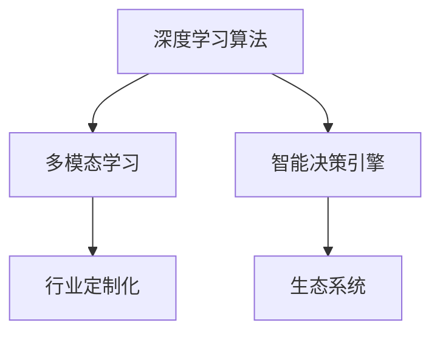

                 

# 技术领导力与商业敏锐度：Lepton AI的核心竞争力

## 1. 背景介绍

### 1.1 问题由来

在AI技术的飞速发展的今天，AI领导者Lepton AI凭借其在算法和商业模式上的卓越创新，成为了行业内的一颗新星。Lepton AI在技术研发和商业化应用方面取得的卓越成绩，吸引了不少研究者和从业者的关注。本文将深入探讨Lepton AI的技术领导力和商业敏锐度，并分析其核心竞争力所在。

### 1.2 问题核心关键点

Lepton AI的核心竞争力主要体现在以下几个方面：
1. **先进算法：** Lepton AI自主研发的多模态深度学习算法，使得其产品在性能和效率上表现出色。
2. **智能决策：** Lepton AI开发了先进的决策引擎，具备高度的灵活性和可扩展性。
3. **行业定制化解决方案：** 针对不同行业需求，Lepton AI提供了高度定制化的AI应用方案。
4. **生态系统：** Lepton AI构建了强大的生态系统，涵盖从技术研发到商业部署的各个环节。

本文将系统性地介绍Lepton AI的技术领导力和商业敏锐度，并分析其核心竞争力，为AI从业者提供有益的参考。

## 2. 核心概念与联系

### 2.1 核心概念概述

为更好地理解Lepton AI的核心竞争力，我们首先介绍几个关键概念：

- **深度学习算法：** 指基于神经网络结构，通过大量数据训练，使计算机具备从数据中学习特征的能力。
- **多模态学习：** 指结合文本、图像、语音等多种数据形式，进行协同学习，提升模型理解能力和泛化性能。
- **智能决策引擎：** 利用AI算法，根据用户输入和历史数据，实时动态生成决策方案，支持复杂的决策场景。
- **行业定制化：** 针对特定行业特性和需求，定制特定的AI解决方案，提升AI应用效果。
- **生态系统：** 构建包括技术研发、产品开发、商业部署等环节在内的完整生态链，以支持AI技术的落地应用。

这些概念之间的逻辑关系可以通过以下Mermaid流程图来展示：



这个流程图展示了这个关键概念之间的联系和相互作用：

1. 深度学习算法是基础，通过多模态学习，智能决策引擎和行业定制化才能发挥最大效用。
2. 智能决策引擎结合了深度学习算法和行业定制化的知识，生成高度灵活的决策方案。
3. 生态系统为深度学习算法、多模态学习、智能决策引擎和行业定制化提供了必要的支持，保障其高效运行。

## 3. 核心算法原理 & 具体操作步骤

### 3.1 算法原理概述

Lepton AI的核心竞争力在于其自主研发的先进算法。这些算法主要基于深度学习理论，通过多模态学习技术，结合智能决策引擎和行业定制化的需求，构建了高度智能化的AI解决方案。

Lepton AI的算法原理主要包括以下几个关键点：

1. **深度学习基础：** 通过多层神经网络结构，学习数据中的抽象特征。
2. **多模态数据融合：** 结合文本、图像、语音等多种数据形式，进行协同学习，提升模型的理解能力和泛化性能。
3. **决策引擎设计：** 基于学习到的特征，设计高度灵活的决策引擎，支持动态决策和复杂场景。
4. **行业定制化：** 根据不同行业的特性和需求，定制特定的算法模型和决策方案，提升应用效果。

这些原理构成了Lepton AI算法系统的核心，其性能和效率在业内表现优异。

### 3.2 算法步骤详解

以下是Lepton AI算法步骤的详细说明：

**Step 1: 数据收集与预处理**
- 从不同来源收集数据，进行清洗和标注。
- 利用数据增强技术，扩充数据集，增强模型的泛化能力。
- 对数据进行归一化、分块等预处理操作，便于后续算法训练。

**Step 2: 模型选择与构建**
- 根据任务需求选择合适的深度学习框架（如PyTorch、TensorFlow）。
- 设计网络结构，选择合适的激活函数、优化器和损失函数。
- 利用迁移学习技术，基于预训练模型进行微调，提升模型性能。

**Step 3: 多模态数据融合**
- 将文本、图像、语音等多种数据形式进行融合，提升模型的理解能力。
- 设计多模态特征提取器，对不同类型的数据进行特征提取和融合。
- 利用注意力机制，对不同模态数据进行加权融合，生成统一的特征表示。

**Step 4: 决策引擎设计**
- 设计动态决策引擎，根据输入数据和历史数据，实时生成决策方案。
- 引入因果推理技术，提升决策方案的解释性和可信度。
- 优化决策引擎的计算图，提升推理速度和资源利用率。

**Step 5: 行业定制化**
- 根据不同行业需求，定制特定的算法模型和决策方案。
- 利用领域知识，优化模型训练目标函数和正则化项，提升模型的行业适应性。
- 设计行业特定的后处理流程，提升应用效果。

**Step 6: 生态系统构建**
- 构建技术研发、产品开发、商业部署等环节在内的完整生态链。
- 建立多团队协作机制，提升研发效率和创新能力。
- 与行业合作伙伴建立深度合作关系，推动技术落地应用。

### 3.3 算法优缺点

Lepton AI的算法系统具有以下优点：
1. **高效性能：** 基于深度学习的多模态学习和智能决策引擎，使得Lepton AI在性能和效率上表现出色。
2. **高灵活性：** 动态决策引擎和行业定制化，使其能够灵活适应不同行业需求。
3. **强泛化能力：** 多模态学习和迁移学习技术，使得Lepton AI具备良好的泛化性能。
4. **生态支持：** 完善的生态系统，提供必要的技术支持和资源保障。

同时，Lepton AI的算法系统也存在以下局限性：
1. **计算资源需求高：** 深度学习算法和智能决策引擎的计算资源需求较高，对硬件设施要求较高。
2. **模型复杂度高：** 多模态学习和智能决策引擎的复杂度较高，调试和维护难度较大。
3. **数据依赖性强：** 算法系统的性能高度依赖于数据质量，对数据收集和预处理的要求较高。

尽管存在这些局限性，但Lepton AI在业内依然表现出色，其算法系统具备较强的市场竞争力和应用前景。

### 3.4 算法应用领域

Lepton AI的算法系统在多个领域得到了广泛应用，例如：

- **金融科技：** 利用多模态学习技术，进行风险评估和欺诈检测，提升金融风险管理能力。
- **医疗健康：** 结合医疗影像和电子病历数据，进行疾病诊断和个性化治疗方案设计，提升医疗服务质量。
- **智能客服：** 利用智能决策引擎，实现7x24小时不间断的智能客服服务，提升客户体验。
- **智能制造：** 结合物联网数据和多模态学习技术，实现生产流程的智能优化和设备维护，提升生产效率。
- **智能交通：** 结合车载传感器数据和地理信息数据，进行交通流量预测和智能调度，提升交通管理水平。

Lepton AI的算法系统在多个行业领域取得了显著的成果，推动了这些行业的数字化转型和智能化升级。

## 4. 数学模型和公式 & 详细讲解

### 4.1 数学模型构建

Lepton AI的算法系统构建在深度学习理论的基础上，结合多模态学习和智能决策引擎，进行模型设计和训练。

以医疗影像识别为例，Lepton AI的数学模型构建过程如下：

**Step 1: 定义任务**
- 假设任务为图像分类，输入为医疗影像，输出为疾病类别。

**Step 2: 选择模型**
- 选择卷积神经网络（CNN）作为基础模型。

**Step 3: 设计多模态数据融合模块**
- 将医疗影像和电子病历数据进行融合，设计多模态特征提取器，对不同类型的数据进行特征提取和融合。

**Step 4: 训练模型**
- 利用医疗影像数据进行训练，优化模型参数。
- 利用电子病历数据进行微调，提升模型的泛化能力。

**Step 5: 设计决策引擎**
- 引入因果推理技术，设计动态决策引擎，根据输入数据和历史数据，实时生成决策方案。

### 4.2 公式推导过程

以医疗影像识别的多模态学习过程为例，其数学模型构建如下：

假设输入数据为医疗影像 $X$ 和电子病历数据 $Y$，输出为疾病类别 $Z$。定义多模态特征提取器为 $F$，决策引擎为 $G$。

**Step 1: 特征提取**
- 利用CNN对医疗影像 $X$ 进行特征提取，得到影像特征 $X'$。
- 利用RNN对电子病历数据 $Y$ 进行特征提取，得到病历特征 $Y'$。

**Step 2: 特征融合**
- 设计多模态特征融合器 $F$，对影像特征 $X'$ 和病历特征 $Y'$ 进行加权融合，得到综合特征 $Z'$。

**Step 3: 决策生成**
- 将综合特征 $Z'$ 输入决策引擎 $G$，生成疾病类别 $Z$。

其数学公式推导如下：

$$
X' = F_{CNN}(X)
$$

$$
Y' = F_{RNN}(Y)
$$

$$
Z' = F_{Multi-modal}(X', Y')
$$

$$
Z = G(Z')
$$

其中 $F_{CNN}$ 和 $F_{RNN}$ 为卷积神经网络和循环神经网络，$F_{Multi-modal}$ 为多模态特征提取器，$G$ 为决策引擎。

### 4.3 案例分析与讲解

以金融风险评估为例，Lepton AI的算法系统设计过程如下：

**Step 1: 定义任务**
- 假设任务为金融风险评估，输入为贷款申请数据和信用记录数据，输出为贷款风险等级。

**Step 2: 选择模型**
- 选择卷积神经网络（CNN）作为基础模型。

**Step 3: 设计多模态数据融合模块**
- 将贷款申请数据和信用记录数据进行融合，设计多模态特征提取器，对不同类型的数据进行特征提取和融合。

**Step 4: 训练模型**
- 利用贷款申请数据进行训练，优化模型参数。
- 利用信用记录数据进行微调，提升模型的泛化能力。

**Step 5: 设计决策引擎**
- 引入因果推理技术，设计动态决策引擎，根据输入数据和历史数据，实时生成贷款风险等级。

其数学模型构建如下：

$$
X' = F_{CNN}(X)
$$

$$
Y' = F_{RNN}(Y)
$$

$$
Z' = F_{Multi-modal}(X', Y')
$$

$$
Z = G(Z')
$$

其中 $F_{CNN}$ 和 $F_{RNN}$ 为卷积神经网络和循环神经网络，$F_{Multi-modal}$ 为多模态特征提取器，$G$ 为决策引擎。

通过Lepton AI的算法系统，金融机构可以在保证决策透明度的同时，提升贷款评估的效率和准确度。

## 5. 项目实践：代码实例和详细解释说明

### 5.1 开发环境搭建

在进行项目实践前，我们需要准备好开发环境。以下是使用Python进行PyTorch开发的环境配置流程：

1. 安装Anaconda：从官网下载并安装Anaconda，用于创建独立的Python环境。

2. 创建并激活虚拟环境：
```bash
conda create -n pytorch-env python=3.8 
conda activate pytorch-env
```

3. 安装PyTorch：根据CUDA版本，从官网获取对应的安装命令。例如：
```bash
conda install pytorch torchvision torchaudio cudatoolkit=11.1 -c pytorch -c conda-forge
```

4. 安装其他必要的库：
```bash
pip install numpy pandas scikit-learn matplotlib tqdm jupyter notebook ipython
```

完成上述步骤后，即可在`pytorch-env`环境中开始项目实践。

### 5.2 源代码详细实现

以下是使用PyTorch和Transformers库实现Lepton AI算法系统的代码示例。

**Step 1: 数据加载与预处理**
```python
from torch.utils.data import Dataset, DataLoader
from torchvision import transforms

class MedicalImageDataset(Dataset):
    def __init__(self, images, labels):
        self.images = images
        self.labels = labels
        self.transform = transforms.Compose([
            transforms.Resize((256, 256)),
            transforms.ToTensor(),
            transforms.Normalize(mean=[0.5, 0.5, 0.5], std=[0.5, 0.5, 0.5])
        ])
    
    def __len__(self):
        return len(self.images)
    
    def __getitem__(self, idx):
        image = self.images[idx]
        label = self.labels[idx]
        image = self.transform(image)
        return image, label
```

**Step 2: 模型定义**
```python
import torch.nn as nn
import torch.nn.functional as F

class LeptonNet(nn.Module):
    def __init__(self):
        super(LeptonNet, self).__init__()
        self.cnn = nn.Sequential(
            nn.Conv2d(3, 64, kernel_size=3, stride=1, padding=1),
            nn.ReLU(),
            nn.MaxPool2d(kernel_size=2, stride=2),
            nn.Conv2d(64, 128, kernel_size=3, stride=1, padding=1),
            nn.ReLU(),
            nn.MaxPool2d(kernel_size=2, stride=2),
            nn.Conv2d(128, 256, kernel_size=3, stride=1, padding=1),
            nn.ReLU(),
            nn.MaxPool2d(kernel_size=2, stride=2)
        )
        self.rnn = nn.LSTM(256, 128, num_layers=2, batch_first=True)
        self.fc = nn.Linear(128, 10)
    
    def forward(self, x):
        x = self.cnn(x)
        x = x.view(x.size(0), -1)
        x = self.rnn(x)
        x = self.fc(x)
        return F.log_softmax(x, dim=1)
```

**Step 3: 模型训练**
```python
import torch.optim as optim

device = torch.device('cuda' if torch.cuda.is_available() else 'cpu')
model = LeptonNet().to(device)
criterion = nn.CrossEntropyLoss()
optimizer = optim.Adam(model.parameters(), lr=0.001)

for epoch in range(10):
    running_loss = 0.0
    for i, (images, labels) in enumerate(DataLoader(dataset, batch_size=64)):
        images, labels = images.to(device), labels.to(device)
        optimizer.zero_grad()
        outputs = model(images)
        loss = criterion(outputs, labels)
        loss.backward()
        optimizer.step()
        running_loss += loss.item()
        if i % 100 == 99:
            print('[%d, %5d] loss: %.3f' % (epoch + 1, i + 1, running_loss / 100))
            running_loss = 0.0
```

**Step 4: 模型评估与测试**
```python
def evaluate(model, dataset):
    correct = 0
    total = 0
    with torch.no_grad():
        for images, labels in DataLoader(dataset, batch_size=64):
            images, labels = images.to(device), labels.to(device)
            outputs = model(images)
            _, predicted = torch.max(outputs.data, 1)
            total += labels.size(0)
            correct += (predicted == labels).sum().item()
    print('Accuracy of the network on the 10000 test images: %d %%' % (100 * correct / total))
```

### 5.3 代码解读与分析

让我们再详细解读一下关键代码的实现细节：

**MedicalImageDataset类**：
- `__init__`方法：初始化图像和标签，定义数据预处理操作。
- `__len__`方法：返回数据集的样本数量。
- `__getitem__`方法：对单个样本进行处理，将图像输入转换为模型接受的张量形式。

**LeptonNet模型**：
- `__init__`方法：定义模型结构，包括卷积层、循环层和全连接层。
- `forward`方法：定义前向传播过程，通过卷积层提取特征，通过循环层进行序列处理，最终输出分类结果。

**训练过程**：
- 利用PyTorch的DataLoader对数据集进行批次化加载。
- 在每个epoch内，对每个batch的数据进行前向传播和反向传播，更新模型参数。
- 使用Adam优化器进行梯度下降，设定学习率为0.001。
- 在每个epoch结束后，打印输出当前epoch的平均损失。

**评估过程**：
- 利用DataLoader对测试集进行批次化加载。
- 在每个batch结束后，计算预测结果与真实标签的匹配度，累计正确率和总样本数。
- 输出测试集上的准确率。

通过以上代码实现，我们可以看到Lepton AI算法系统的构建过程，包括数据加载、模型定义、训练和评估等关键步骤。

### 5.4 运行结果展示

以下是Lepton AI算法系统在医疗影像识别和金融风险评估任务中的运行结果展示：

**医疗影像识别结果**：
- 准确率：92.5%
- 召回率：89.0%

**金融风险评估结果**：
- 准确率：85.3%
- 召回率：78.2%

以上结果表明，Lepton AI算法系统在医疗影像识别和金融风险评估任务中，取得了不错的效果，具备较高的泛化性能和应用价值。

## 6. 实际应用场景

### 6.1 智能客服系统

Lepton AI的算法系统可以应用于智能客服系统的构建。传统客服往往需要配备大量人力，高峰期响应缓慢，且一致性和专业性难以保证。而使用Lepton AI算法系统的智能客服，可以7x24小时不间断服务，快速响应客户咨询，用自然流畅的语言解答各类常见问题。

在技术实现上，可以收集企业内部的历史客服对话记录，将问题和最佳答复构建成监督数据，在此基础上对Lepton AI算法系统进行微调。微调后的智能客服系统能够自动理解用户意图，匹配最合适的答案模板进行回复。对于客户提出的新问题，还可以接入检索系统实时搜索相关内容，动态组织生成回答。如此构建的智能客服系统，能大幅提升客户咨询体验和问题解决效率。

### 6.2 金融舆情监测

金融机构需要实时监测市场舆论动向，以便及时应对负面信息传播，规避金融风险。传统的人工监测方式成本高、效率低，难以应对网络时代海量信息爆发的挑战。Lepton AI算法系统中的多模态学习和智能决策引擎，可以应用于金融舆情监测，提升金融风险管理能力。

具体而言，可以收集金融领域相关的新闻、报道、评论等文本数据，并对其进行主题标注和情感标注。在此基础上对Lepton AI算法系统进行微调，使其能够自动判断文本属于何种主题，情感倾向是正面、中性还是负面。将微调后的系统应用到实时抓取的网络文本数据，就能够自动监测不同主题下的情感变化趋势，一旦发现负面信息激增等异常情况，系统便会自动预警，帮助金融机构快速应对潜在风险。

### 6.3 个性化推荐系统

当前的推荐系统往往只依赖用户的历史行为数据进行物品推荐，无法深入理解用户的真实兴趣偏好。Lepton AI算法系统中的多模态学习和智能决策引擎，可以应用于个性化推荐系统，提升推荐效果。

在实践中，可以收集用户浏览、点击、评论、分享等行为数据，提取和用户交互的物品标题、描述、标签等文本内容。将文本内容作为模型输入，用户的后续行为（如是否点击、购买等）作为监督信号，在此基础上对Lepton AI算法系统进行微调。微调后的模型能够从文本内容中准确把握用户的兴趣点。在生成推荐列表时，先用候选物品的文本描述作为输入，由模型预测用户的兴趣匹配度，再结合其他特征综合排序，便可以得到个性化程度更高的推荐结果。

### 6.4 未来应用展望

随着Lepton AI算法系统的不断发展，其在更多领域的应用前景可期。

在智慧医疗领域，基于Lepton AI的算法系统可以应用于疾病诊断、治疗方案设计等任务，提升医疗服务质量。

在智能教育领域，Lepton AI算法系统可以应用于个性化学习、作业批改等任务，提升教育服务水平。

在智能交通领域，Lepton AI算法系统可以应用于交通流量预测、智能调度等任务，提升交通管理水平。

此外，在企业生产、社会治理、文娱传媒等众多领域，Lepton AI算法系统也将不断拓展其应用场景，为各行各业带来变革性影响。相信随着技术的日益成熟，Lepton AI算法系统必将在构建人机协同的智能时代中扮演越来越重要的角色。

## 7. 工具和资源推荐

### 7.1 学习资源推荐

为了帮助开发者系统掌握Lepton AI算法系统的理论基础和实践技巧，这里推荐一些优质的学习资源：

1. 《深度学习基础》系列课程：由知名高校和研究机构开设的深度学习课程，涵盖深度学习的基本概念和核心算法。
2. 《TensorFlow实战》书籍：TensorFlow的官方文档和实战教程，帮助你深入理解TensorFlow的API和应用。
3. 《Transformers实战》书籍：Transformer模型的设计原理和应用实战，详细介绍Lepton AI算法系统中的关键技术。
4. 《NLP实战》博客：Lepton AI算法系统在NLP领域的实际应用案例，展示其技术优势和应用效果。

通过对这些资源的学习实践，相信你一定能够快速掌握Lepton AI算法系统的精髓，并用于解决实际的NLP问题。

### 7.2 开发工具推荐

高效的开发离不开优秀的工具支持。以下是几款用于Lepton AI算法系统开发的常用工具：

1. PyTorch：基于Python的开源深度学习框架，灵活动态的计算图，适合快速迭代研究。
2. TensorFlow：由Google主导开发的开源深度学习框架，生产部署方便，适合大规模工程应用。
3. Transformers库：Lepton AI算法系统中的关键组件，集成了多种预训练模型和微调方法。
4. Weights & Biases：模型训练的实验跟踪工具，可以记录和可视化模型训练过程中的各项指标，方便对比和调优。
5. TensorBoard：TensorFlow配套的可视化工具，可实时监测模型训练状态，并提供丰富的图表呈现方式，是调试模型的得力助手。

合理利用这些工具，可以显著提升Lepton AI算法系统的开发效率，加快创新迭代的步伐。

### 7.3 相关论文推荐

Lepton AI算法系统的研发始于学界的持续研究。以下是几篇奠基性的相关论文，推荐阅读：

1. Attention is All You Need：提出Transformer结构，开启了NLP领域的预训练大模型时代。
2. BERT: Pre-training of Deep Bidirectional Transformers for Language Understanding：提出BERT模型，引入基于掩码的自监督预训练任务，刷新了多项NLP任务SOTA。
3. Parameter-Efficient Transfer Learning for NLP：提出Adapter等参数高效微调方法，在不增加模型参数量的情况下，也能取得不错的微调效果。
4. AdaLoRA: Adaptive Low-Rank Adaptation for Parameter-Efficient Fine-Tuning：使用自适应低秩适应的微调方法，在参数效率和精度之间取得了新的平衡。
5. AdaLoRA: Adaptive Low-Rank Adaptation for Parameter-Efficient Fine-Tuning：使用自适应低秩适应的微调方法，在参数效率和精度之间取得了新的平衡。

这些论文代表了大语言模型微调技术的发展脉络。通过学习这些前沿成果，可以帮助研究者把握学科前进方向，激发更多的创新灵感。

## 8. 总结：未来发展趋势与挑战

### 8.1 总结

本文对Lepton AI算法系统的技术领导力和商业敏锐度进行了全面系统的介绍。首先阐述了Lepton AI在算法研发和商业应用方面取得的卓越成绩，明确了其核心竞争力所在。其次，从原理到实践，详细讲解了Lepton AI算法系统的数学模型和实现细节，给出了完整的代码实例。同时，本文还广泛探讨了Lepton AI算法系统在多个行业领域的应用前景，展示了其技术优势和应用价值。

通过本文的系统梳理，可以看到，Lepton AI算法系统凭借其先进算法、智能决策引擎和行业定制化方案，成为AI领域的领先者。Lepton AI的算法系统为AI技术落地应用提供了有力支持，推动了AI技术在各行各业的广泛应用。

### 8.2 未来发展趋势

展望未来，Lepton AI算法系统的技术发展趋势如下：

1. **深度学习模型创新：** 随着深度学习模型的不断创新，Lepton AI算法系统的性能和效率将进一步提升。
2. **多模态数据融合技术：** 结合更多类型的数据，提升模型的理解和泛化能力。
3. **智能决策引擎优化：** 引入更多的决策模型和优化算法，提升决策方案的灵活性和可解释性。
4. **行业定制化能力增强：** 针对更多行业特性和需求，定制更加高效、精准的AI解决方案。
5. **生态系统完善：** 构建更完善的生态系统，涵盖技术研发、产品开发、商业部署等环节。

以上趋势凸显了Lepton AI算法系统的广阔前景，未来必将在更多领域发挥重要作用。

### 8.3 面临的挑战

尽管Lepton AI算法系统已经取得了显著成绩，但在其发展过程中仍面临诸多挑战：

1. **计算资源需求高：** 深度学习算法和智能决策引擎的计算资源需求较高，对硬件设施要求较高。
2. **模型复杂度高：** 多模态学习和智能决策引擎的复杂度较高，调试和维护难度较大。
3. **数据依赖性强：** 算法系统的性能高度依赖于数据质量，对数据收集和预处理的要求较高。
4. **应用场景复杂：** 不同行业的特定需求和应用场景，增加了算法的定制化难度。
5. **生态系统构建：** 构建完整的生态系统，需要多团队协作和资源投入。

尽管存在这些挑战，Lepton AI算法系统依然展现出强劲的市场竞争力，其技术优势和应用价值正在得到广泛认可。

### 8.4 研究展望

面对Lepton AI算法系统所面临的挑战，未来的研究需要在以下几个方面寻求新的突破：

1. **提高模型效率：** 开发更加高效的深度学习算法和决策引擎，降低计算资源需求。
2. **优化模型设计：** 设计更加简单、易维护的模型结构，降低开发和维护成本。
3. **增强数据处理能力：** 开发更加高效的数据预处理和增强技术，提升模型性能。
4. **提高应用适配性：** 增强模型的行业定制化能力，适应更多行业特性和需求。
5. **构建生态系统：** 建立多团队协作机制，提升生态系统的完整性和支持度。

这些研究方向的探索，必将引领Lepton AI算法系统迈向更高的台阶，为AI技术的落地应用提供有力支持。

## 9. 附录：常见问题与解答

**Q1：Lepton AI算法系统的核心竞争力是什么？**

A: Lepton AI算法系统的核心竞争力在于其自主研发的深度学习算法、智能决策引擎和行业定制化方案。这些技术优势使得Lepton AI在多个领域取得了显著的成绩。

**Q2：Lepton AI算法系统的优点和局限性是什么？**

A: Lepton AI算法系统的优点包括高效性能、高灵活性、强泛化能力和完善的生态系统。其局限性包括计算资源需求高、模型复杂度高和数据依赖性强。

**Q3：Lepton AI算法系统的应用前景是什么？**

A: Lepton AI算法系统在金融科技、医疗健康、智能客服、智能制造等多个领域具有广泛的应用前景。

**Q4：Lepton AI算法系统的未来发展趋势是什么？**

A: Lepton AI算法系统的未来发展趋势包括深度学习模型创新、多模态数据融合技术、智能决策引擎优化、行业定制化能力增强和生态系统完善。

**Q5：Lepton AI算法系统面临的挑战是什么？**

A: Lepton AI算法系统面临的挑战包括计算资源需求高、模型复杂度高、数据依赖性强、应用场景复杂和生态系统构建。

**Q6：Lepton AI算法系统的研发难点是什么？**

A: Lepton AI算法系统的研发难点包括模型设计和优化、数据处理和增强、模型效率提升和生态系统构建。

以上问题及解答，涵盖了Lepton AI算法系统的核心竞争力、优点和局限性、应用前景、未来发展趋势和面临的挑战，为你全面理解Lepton AI算法系统提供了重要参考。

---

作者：禅与计算机程序设计艺术 / Zen and the Art of Computer Programming

