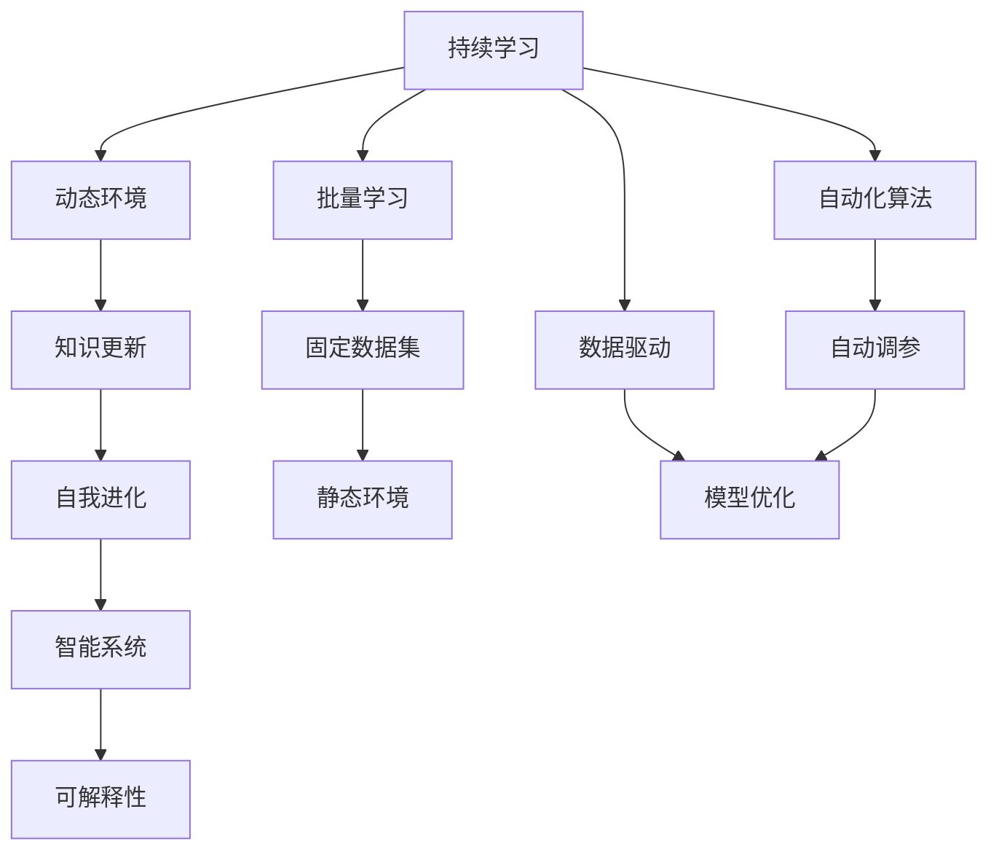

                 

# 持续学习：保持竞争力的秘诀

> 关键词：持续学习, 竞争优势, 动态环境, 知识更新, 自我进化, 智能系统, 自动化算法, 可解释性, 教育意义, 数据驱动, 创新能力, 人才培养

## 1. 背景介绍

在今天这个快速变化的时代，持续学习成为了个人和组织保持竞争力的关键。随着技术的飞速发展和市场的瞬息万变，无论是企业还是个人，如果不能持续更新知识和技能，就会被竞争对手远远抛在后面。尤其是在人工智能和数据科学领域，技术的演进日新月异，只有持续学习才能跟上时代的步伐，保持领先地位。

本文将深入探讨持续学习的原理与实践，揭示它是如何帮助我们在动态环境中保持竞争力的。通过理解持续学习的核心概念和应用，我们将能够更好地应对未来的挑战，实现自我进化，推动企业和个人不断前进。

## 2. 核心概念与联系

### 2.1 核心概念概述

为了更好地理解持续学习，我们首先需要明确几个关键概念及其相互关系。

#### 持续学习（Continuous Learning）
持续学习是一种能够持续从新数据和经验中学习，同时保留旧知识的学习方式。它与传统的批量学习（Batch Learning）不同，后者在固定的时间周期内学习完整个数据集后就不再学习。

#### 动态环境（Dynamic Environment）
动态环境是指外部环境不断变化的环境。这些变化可能是市场趋势、技术革新、政策法规等方面的改变。

#### 知识更新（Knowledge Update）
知识更新是指学习者不断地获取新知识，更新现有知识体系，以适应环境变化的过程。

#### 自我进化（Self-Evolution）
自我进化是学习者根据环境变化主动调整自身能力的过程，包括技能提升、思维方式转变等。

#### 智能系统（Intelligent System）
智能系统指的是能够根据环境反馈自动调整策略的系统，包括机器学习模型、自动化算法等。

#### 可解释性（Explainability）
可解释性是指系统能够清晰地解释其决策过程，使得用户理解系统行为的能力。

这些概念相互关联，共同构成了持续学习的核心框架。在动态环境中，通过持续学习，智能系统能够不断地更新知识，进行自我进化，从而在不断变化的市场中保持竞争优势。

### 2.2 核心概念原理和架构的 Mermaid 流程图



这个流程图展示了持续学习的基本流程和架构：

1. **A**（持续学习）通过**B**（动态环境）接收新数据和反馈。
2. **C**（知识更新）处理新数据，并更新现有的知识体系。
3. **D**（自我进化）根据新知识调整系统策略。
4. **E**（智能系统）通过**F**（可解释性）向用户提供清晰的行为解释。
5. **G**（批量学习）在固定数据集上学习，**I**（静态环境）与**A**（持续学习）相对应。
6. **J**（自动化算法）用于自动调参和模型优化，**K**（自动调参）与**M**（模型优化）相连。
7. **L**（数据驱动）通过**M**（模型优化）实现模型改进，**L**与**M**相连。

这个架构清晰地展示了持续学习如何在动态环境中保持竞争力，并强调了自动化算法和数据驱动的重要性。

## 3. 核心算法原理 & 具体操作步骤

### 3.1 算法原理概述

持续学习的核心原理是利用新数据和新经验不断调整模型和策略，以适应环境变化。其核心算法包括：

- **增量学习（Incremental Learning）**：在现有模型基础上，逐步添加新数据进行训练，以避免对原有模型的完全重新训练。
- **在线学习（Online Learning）**：实时接收新数据，并不断更新模型，适用于数据流式输入的场景。
- **强化学习（Reinforcement Learning）**：通过与环境的交互，学习最优策略，适应环境变化。

### 3.2 算法步骤详解

#### 增量学习
增量学习是持续学习的一种常见形式，它通过逐步添加新数据来更新模型。增量学习的步骤如下：

1. **初始化模型**：使用预定义的初始模型参数。
2. **接收新数据**：每次接收一批新的数据。
3. **更新模型**：利用新数据更新模型参数，以适应新数据分布。
4. **评估模型**：使用测试集评估模型性能，确定是否继续更新。

以下是使用Python实现增量学习的代码示例：

```python
from sklearn.linear_model import SGDClassifier
from sklearn.datasets import make_classification

# 生成数据集
X, y = make_classification(n_samples=1000, n_features=10, n_classes=2, random_state=42)

# 初始化模型
model = SGDClassifier()

# 增量学习
for i in range(1, 11):
    # 每次接收100个样本
    X_new = X[i*100:(i+1)*100]
    y_new = y[i*100:(i+1)*100]
    model.partial_fit(X_new, y_new, classes=[0, 1])
```

#### 在线学习
在线学习适用于数据流式输入的场景，如实时交易系统。在线学习的步骤如下：

1. **初始化模型**：使用预定义的初始模型参数。
2. **接收新数据**：每次接收一个数据点。
3. **更新模型**：利用新数据更新模型参数。
4. **评估模型**：使用测试集评估模型性能，确定是否继续更新。

以下是使用Python实现在线学习的代码示例：

```python
from sklearn.linear_model import SGDClassifier
from sklearn.datasets import make_classification

# 生成数据流
X, y = make_classification(n_samples=1000, n_features=10, n_classes=2, random_state=42)

# 初始化模型
model = SGDClassifier()

# 在线学习
for i in range(1000):
    X_new = X[i]
    y_new = y[i]
    model.partial_fit(X_new, y_new, classes=[0, 1])
```

#### 强化学习
强化学习通过与环境的交互，学习最优策略。强化学习的步骤如下：

1. **初始化模型**：使用预定义的初始模型参数。
2. **选择动作**：根据当前状态选择动作。
3. **接收反馈**：接收环境反馈，如奖励或惩罚。
4. **更新模型**：利用反馈更新模型参数。

以下是使用Python实现强化学习的代码示例：

```python
import numpy as np

# 定义环境
class Environment:
    def __init__(self):
        self.state = 0
        self.reward = 0

    def step(self, action):
        if action == 1:
            self.state += 1
            self.reward = 1
        else:
            self.state -= 1
            self.reward = -1
        return self.state, self.reward

# 初始化模型
model = np.zeros([2, 2])

# 强化学习
for i in range(1000):
    state = i % 2
    action = 1 if np.random.rand() > 0.5 else 0
    next_state, reward = Environment().step(action)
    model[state, action] += reward
```

### 3.3 算法优缺点

#### 增量学习的优点：
1. 可以处理大数据集，避免一次性加载全部数据。
2. 可以实时更新模型，适应环境变化。
3. 计算效率高，适用于在线学习场景。

#### 增量学习的缺点：
1. 每次更新模型的过程可能引入偏差，影响模型性能。
2. 需要优化内存管理，避免内存溢出。

#### 在线学习的优点：
1. 实时处理数据流，适用于动态环境。
2. 可以连续学习，避免数据过时问题。
3. 适用于在线广告、实时推荐等场景。

#### 在线学习的缺点：
1. 每次更新模型的时间可能较长，影响实时性。
2. 对硬件要求较高，需要高性能的计算资源。

#### 强化学习的优点：
1. 能够通过与环境交互学习最优策略。
2. 可以处理复杂决策问题，如机器人控制、游戏AI等。
3. 适用于自适应系统，如自动驾驶、智能家居等。

#### 强化学习的缺点：
1. 需要大量的试验数据，训练时间较长。
2. 需要设计合理的奖励机制，避免奖励信号干扰。

### 3.4 算法应用领域

持续学习和相关算法在多个领域都有广泛应用，包括：

1. **机器学习**：增量学习、在线学习、强化学习等算法在机器学习中应用广泛。
2. **自动驾驶**：强化学习用于自动驾驶车辆在复杂环境中的决策。
3. **金融风控**：在线学习用于实时分析交易数据，预测市场风险。
4. **推荐系统**：增量学习用于实时更新用户偏好模型。
5. **物联网**：在线学习用于实时处理传感器数据，优化系统性能。
6. **自然语言处理**：持续学习用于语言模型在动态环境中的适应。

## 4. 数学模型和公式 & 详细讲解 & 举例说明

### 4.1 数学模型构建

为了更好地理解持续学习，我们需要使用数学语言对相关模型进行描述。

#### 增量学习模型
增量学习模型基于现有模型参数 $\theta$，每次接收新数据 $(x_i, y_i)$ 进行更新。假设模型为线性回归模型，则增量学习的数学模型为：

$$
\theta_{i+1} = \theta_i + \alpha_i \sum_{i=1}^N (x_i - \hat{x}_i)(x_i - \hat{x}_i)^T
$$

其中 $\hat{x}_i$ 为当前模型对 $x_i$ 的预测，$\alpha_i$ 为学习率，$N$ 为数据集大小。

### 4.2 公式推导过程

#### 增量学习公式推导
增量学习的公式推导如下：

假设模型为线性回归模型，其预测函数为 $f(x) = \theta^T x$。现有模型参数为 $\theta$，接收新数据 $(x_i, y_i)$，则增量学习模型的更新公式为：

$$
\theta_{i+1} = \theta_i + \alpha_i (y_i - f(x_i)) x_i
$$

将 $f(x_i)$ 替换为 $\theta^T x_i$，得：

$$
\theta_{i+1} = \theta_i + \alpha_i (y_i - \theta^T x_i) x_i
$$

展开 $y_i - \theta^T x_i$，得：

$$
\theta_{i+1} = \theta_i + \alpha_i (y_i - \theta^T x_i) x_i = \theta_i + \alpha_i y_i x_i - \alpha_i \theta^T x_i x_i
$$

将 $y_i x_i$ 和 $\theta^T x_i x_i$ 分别记为 $b_i$ 和 $A_i$，得：

$$
\theta_{i+1} = \theta_i + \alpha_i b_i - \alpha_i A_i
$$

因此，增量学习的公式为：

$$
\theta_{i+1} = \theta_i + \alpha_i (y_i x_i - \theta^T x_i x_i)
$$

这个公式展示了增量学习的基本原理，即每次更新模型参数时，都利用新数据对现有模型进行调整。

### 4.3 案例分析与讲解

#### 在线学习案例
假设我们有一个在线广告推荐系统，需要实时更新用户兴趣模型。现有模型参数为 $\theta$，每次接收一个新数据点 $(x, y)$，其中 $x$ 为用户兴趣向量，$y$ 为广告类型。在线学习模型的更新公式为：

$$
\theta_{i+1} = \theta_i + \alpha_i (y - f(x)) x
$$

其中 $f(x) = \theta^T x$ 为模型预测函数。每次接收一个数据点，更新模型参数，可以实时推荐用户感兴趣的广告。

#### 强化学习案例
假设我们有一个智能机器人，需要学习在复杂环境中的导航策略。现有模型参数为 $\theta$，每次接收一个状态 $s$ 和动作 $a$，以及环境反馈 $r$。强化学习模型的更新公式为：

$$
\theta_{i+1} = \theta_i + \alpha_i r s
$$

其中 $s$ 为当前状态，$a$ 为选择动作，$r$ 为环境反馈。通过不断与环境交互，机器人可以学习到最优的导航策略。

## 5. 项目实践：代码实例和详细解释说明

### 5.1 开发环境搭建

在进行持续学习项目实践前，我们需要准备好开发环境。以下是使用Python进行PyTorch开发的环境配置流程：

1. 安装Anaconda：从官网下载并安装Anaconda，用于创建独立的Python环境。

2. 创建并激活虚拟环境：
```bash
conda create -n pytorch-env python=3.8 
conda activate pytorch-env
```

3. 安装PyTorch：根据CUDA版本，从官网获取对应的安装命令。例如：
```bash
conda install pytorch torchvision torchaudio cudatoolkit=11.1 -c pytorch -c conda-forge
```

4. 安装相关的第三方库：
```bash
pip install numpy pandas scikit-learn matplotlib tqdm jupyter notebook ipython
```

完成上述步骤后，即可在`pytorch-env`环境中开始持续学习实践。

### 5.2 源代码详细实现

这里我们以增量学习模型为例，使用PyTorch实现增量学习。

```python
import torch
import numpy as np

# 定义增量学习模型
class IncrementalModel(torch.nn.Module):
    def __init__(self, input_dim, output_dim):
        super(IncrementalModel, self).__init__()
        self.fc1 = torch.nn.Linear(input_dim, 100)
        self.fc2 = torch.nn.Linear(100, output_dim)

    def forward(self, x):
        x = self.fc1(x)
        x = torch.sigmoid(x)
        x = self.fc2(x)
        return x

# 定义增量学习函数
def incremental_learning(model, x, y, alpha):
    model.zero_grad()
    predictions = model(x)
    loss = torch.nn.functional.mse_loss(predictions, y)
    loss.backward()
    model.parameters().data = (model.parameters().data - alpha * loss.grad)
    return model

# 准备数据
x = torch.randn(100, 10)
y = torch.randn(100, 1)

# 初始化模型
model = IncrementalModel(10, 1)
model.to('cuda')

# 增量学习
for i in range(100):
    x_new = torch.randn(1, 10)
    y_new = torch.randn(1, 1)
    model = incremental_learning(model, x_new, y_new, 0.1)
    if i % 10 == 0:
        print('Iteration', i, 'Loss:', loss.item())
```

### 5.3 代码解读与分析

让我们再详细解读一下关键代码的实现细节：

**IncrementalModel类**：
- `__init__`方法：初始化线性层。
- `forward`方法：定义前向传播过程。

**incremental_learning函数**：
- 接收增量学习函数，新数据 $(x,y)$，学习率 $\alpha$。
- 每次更新模型时，使用前向传播计算预测值，并计算损失。
- 反向传播计算梯度，并更新模型参数。
- 使用 `model.parameters().data` 获取模型参数，并赋值为更新后的值。

**增量学习实践**：
- 使用随机生成的数据进行增量学习。
- 每次接收一个新数据点，更新模型参数，并计算损失。
- 每10次迭代输出一次损失值。

## 6. 实际应用场景

### 6.1 持续学习在企业中的应用

在企业中，持续学习被广泛应用于多个方面，以提升组织竞争力和运营效率。以下是几个典型的应用场景：

#### 客户服务
企业可以利用持续学习模型，实时分析客户反馈和行为数据，优化客户服务流程，提升客户满意度。例如，利用在线学习模型，分析客户投诉数据，自动调整客服策略，实现更高效的客户问题解决。

#### 产品优化
企业可以利用持续学习模型，实时分析用户反馈和市场趋势，快速优化产品功能。例如，利用增量学习模型，分析用户使用数据，自动更新产品参数，提高用户体验。

#### 供应链管理
企业可以利用持续学习模型，实时分析供应链数据，优化供应链流程，提高供应链效率。例如，利用强化学习模型，自动调整订单分配和物流策略，降低成本，提升交付速度。

### 6.2 持续学习在教育中的应用

教育领域也广泛应用持续学习技术，以提升教学质量和学生学习体验。以下是几个典型的应用场景：

#### 个性化学习
教育机构可以利用持续学习模型，实时分析学生的学习行为和成绩数据，定制个性化的学习计划。例如，利用在线学习模型，分析学生的学习进度和知识掌握情况，自动调整学习内容和难度，提高学习效果。

#### 智能辅导
教育机构可以利用持续学习模型，实时分析学生的疑问和错误，提供智能辅导和答疑服务。例如，利用增量学习模型，分析学生的错误问题，自动生成解释和练习题，帮助学生纠正错误，提升理解能力。

#### 教师培训
教育机构可以利用持续学习模型，实时分析教师的教学行为和效果，提升教师的教学水平。例如，利用强化学习模型，分析教师的课堂表现和学生反馈，自动调整教学策略，提高教学质量。

## 7. 工具和资源推荐

### 7.1 学习资源推荐

为了帮助开发者系统掌握持续学习的理论基础和实践技巧，这里推荐一些优质的学习资源：

1. 《机器学习实战》：这是一本优秀的机器学习入门书籍，详细介绍了增量学习、在线学习、强化学习等基本概念和实现方法。
2. 《深度学习》课程：斯坦福大学开设的深度学习课程，介绍了深度学习的基本原理和应用，包括持续学习范式。
3. 《在线学习：算法和实践》：这是一本系统介绍在线学习的书籍，涵盖了在线学习算法和实际应用案例。
4. 《强化学习》课程：由MIT和IBM联合开发的强化学习课程，介绍了强化学习的基本概念和实际应用。
5. 《Python深度学习》：这是一本优秀的深度学习入门书籍，详细介绍了深度学习的实现方法和应用案例，包括持续学习范式。

通过对这些资源的学习实践，相信你一定能够快速掌握持续学习的精髓，并用于解决实际的业务问题。

### 7.2 开发工具推荐

高效的开发离不开优秀的工具支持。以下是几款用于持续学习开发的常用工具：

1. PyTorch：基于Python的开源深度学习框架，灵活动态的计算图，适合快速迭代研究。大部分持续学习模型都有PyTorch版本的实现。
2. TensorFlow：由Google主导开发的开源深度学习框架，生产部署方便，适合大规模工程应用。同样有丰富的持续学习模型资源。
3. Scikit-learn：Python机器学习库，提供了多种增量学习算法和在线学习算法，易于实现和应用。
4. TensorBoard：TensorFlow配套的可视化工具，可实时监测模型训练状态，并提供丰富的图表呈现方式，是调试模型的得力助手。
5. Weights & Biases：模型训练的实验跟踪工具，可以记录和可视化模型训练过程中的各项指标，方便对比和调优。
6. Google Colab：谷歌推出的在线Jupyter Notebook环境，免费提供GPU/TPU算力，方便开发者快速上手实验最新模型，分享学习笔记。

合理利用这些工具，可以显著提升持续学习模型的开发效率，加快创新迭代的步伐。

### 7.3 相关论文推荐

持续学习技术的发展源于学界的持续研究。以下是几篇奠基性的相关论文，推荐阅读：

1. A Survey of Online Learning: The Coming of Age of a New Conceptual Frontier for Machine Learning（《在线学习综述》）：该论文全面综述了在线学习的理论和应用，提出了在线学习的分类和实现方法。
2. Online Learning of Neural Networks: An Empirical Comparison of Adaptive Gradient Methods（《神经网络在线学习：自适应梯度方法的比较》）：该论文详细比较了不同的在线学习算法，并提出了自适应梯度方法。
3. Reinforcement Learning: An Introduction（《强化学习导论》）：该书籍全面介绍了强化学习的基本概念和实现方法，是学习强化学习的经典教材。
4. Incremental and Online Learning: Algorithms, Applications, and Coding（《增量学习和在线学习：算法、应用和编码》）：该书籍详细介绍了增量学习、在线学习的算法和实际应用案例。
5. Deep Online Learning: Methods, Strategies, and Applications（《深度在线学习：方法、策略和应用》）：该论文综述了深度在线学习的最新研究进展，提出了深度在线学习的实现方法。

这些论文代表了大持续学习技术的发展脉络。通过学习这些前沿成果，可以帮助研究者把握学科前进方向，激发更多的创新灵感。

## 8. 总结：未来发展趋势与挑战

### 8.1 总结

本文对持续学习原理与实践进行了全面系统的介绍。首先阐述了持续学习在动态环境中的重要性，明确了持续学习在保持竞争力和应对环境变化方面的独特价值。其次，从原理到实践，详细讲解了增量学习、在线学习和强化学习的核心算法和具体操作步骤，给出了持续学习任务开发的完整代码实例。同时，本文还广泛探讨了持续学习在企业、教育等多个行业领域的应用前景，展示了持续学习技术的广泛应用。

通过本文的系统梳理，可以看到，持续学习已经成为企业、组织和个人保持竞争力的重要工具。在动态环境中，通过持续学习，智能系统能够不断地更新知识，进行自我进化，从而在不断变化的市场中保持竞争优势。未来，伴随技术的持续演进和应用场景的不断拓展，持续学习技术必将在更多的领域得到应用，带来更广泛的影响。

### 8.2 未来发展趋势

展望未来，持续学习技术将呈现以下几个发展趋势：

1. 自动化学习：自动化学习算法能够自动选择和应用不同的学习算法，提升学习效率。
2. 分布式学习：分布式学习算法能够在多个设备上并行学习，提高学习速度。
3. 跨领域学习：跨领域学习算法能够在多个领域内同时学习，提高模型的泛化能力。
4. 自适应学习：自适应学习算法能够根据环境变化动态调整学习策略，提高学习效果。
5. 零样本学习：零样本学习算法能够在没有标注数据的情况下进行学习，提高模型的通用性。
6. 多模态学习：多模态学习算法能够融合多种数据模态，提高模型的综合能力。

以上趋势凸显了持续学习技术的广阔前景。这些方向的探索发展，必将进一步提升持续学习模型的性能和应用范围，为智能系统提供更强大的支持。

### 8.3 面临的挑战

尽管持续学习技术已经取得了显著进展，但在迈向更加智能化、普适化应用的过程中，它仍面临着诸多挑战：

1. 数据质量和多样性：持续学习依赖于高质量、多样性的数据，但实际应用中数据往往不完整、不均衡，影响学习效果。
2. 模型复杂性：持续学习模型通常较为复杂，训练和推理耗时较长，难以满足实时性要求。
3. 模型解释性：持续学习模型通常是黑盒系统，难以解释其决策过程，缺乏可解释性。
4. 安全性：持续学习模型可能学习到有害数据，输出误导性结果，带来安全隐患。
5. 资源消耗：持续学习模型需要大量计算资源，难以在资源有限的设备上运行。

正视持续学习面临的这些挑战，积极应对并寻求突破，将是持续学习技术走向成熟的必由之路。相信随着学界和产业界的共同努力，这些挑战终将一一被克服，持续学习技术必将在构建智能系统的过程中发挥重要作用。

### 8.4 研究展望

面向未来，持续学习技术的研究方向可能包括以下几个方面：

1. 自适应学习算法：研究自适应学习算法，根据环境变化动态调整学习策略，提高学习效率。
2. 跨领域学习算法：研究跨领域学习算法，提升模型在多个领域内的泛化能力。
3. 多模态学习算法：研究多模态学习算法，融合多种数据模态，提高模型的综合能力。
4. 自动化学习算法：研究自动化学习算法，自动选择和应用不同的学习算法，提升学习效率。
5. 分布式学习算法：研究分布式学习算法，提高学习速度和资源利用率。
6. 模型解释性算法：研究模型解释性算法，提高模型的可解释性，增强用户信任。

这些研究方向将引领持续学习技术迈向更高的台阶，为智能系统的构建提供更强大的技术支持。相信随着技术的不断进步，持续学习技术将带来更多创新，推动智能系统在更广阔的领域得到应用。

## 9. 附录：常见问题与解答

**Q1：持续学习和传统机器学习有什么区别？**

A: 持续学习与传统机器学习的区别在于学习的方式和模型的更新策略。传统机器学习通常在固定的时间周期内学习完整个数据集后就不再学习，而持续学习则能够在动态环境中不断学习新数据和新知识，进行自我更新和进化。

**Q2：持续学习适用于哪些场景？**

A: 持续学习适用于动态环境下的多个场景，包括在线广告推荐、客户服务、智能辅导、自动化控制等。这些场景中的数据流式输入和环境变化要求，使得持续学习成为一种更加灵活和高效的学习方式。

**Q3：如何应对数据质量和多样性的挑战？**

A: 为应对数据质量和多样性的挑战，持续学习模型需要设计合理的正则化和数据增强策略。例如，使用对抗样本、数据平滑等方法，提升模型对噪声数据的鲁棒性。同时，可以使用多模态融合技术，提升模型的综合能力。

**Q4：如何提高持续学习模型的可解释性？**

A: 提高持续学习模型的可解释性，可以通过引入可解释性算法，如LIME、SHAP等，对模型的决策过程进行可视化解释。此外，还可以设计任务适配层，使模型输出更加符合人类理解方式。

**Q5：如何优化持续学习模型的资源消耗？**

A: 优化持续学习模型的资源消耗，可以通过模型压缩、剪枝等方法，减小模型尺寸和计算量。同时，可以使用分布式学习算法，提高学习效率和资源利用率。

通过对这些问题的解答，相信你能够更好地理解持续学习的原理和应用，并应用于实际场景中。

---

作者：禅与计算机程序设计艺术 / Zen and the Art of Computer Programming

