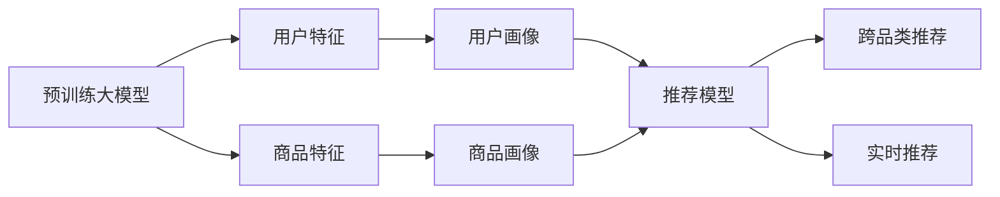

                 

# 探索AI大模型在电商平台跨品类推荐中的潜力

> 关键词：人工智能大模型,电商平台,推荐系统,跨品类推荐,深度学习,协同过滤,用户画像,实时推荐

## 1. 背景介绍

### 1.1 问题由来

随着电子商务的迅猛发展，电商平台已经在人们的购物场景中占据了重要地位。然而，如何提升用户的购物体验，提高交易转化率，成为各大电商平台的共同难题。传统的推荐算法，如基于用户的协同过滤和基于商品的协同过滤，虽然在大规模推荐场景下取得了不错的效果，但面临诸多问题：

- 数据稀疏性：用户的购买记录和浏览历史往往是不完整的，导致协同过滤难以产生高质量的推荐结果。
- 推荐冷启动：新用户和未覆盖商品之间的推荐难以实施，无法充分挖掘用户潜在的购买需求。
- 过度拟合问题：推荐模型往往会对特定的数据分布过度拟合，导致泛化能力不足。
- 实时性不足：在订单驱动推荐系统下，推荐算法无法及时响应用户行为变化，推荐内容不够新鲜。

面对这些问题，基于人工智能大模型的推荐系统应运而生。通过在大规模用户数据和商品数据上进行预训练，大模型可以学习到更深层次的特征表示，提升推荐系统的表现。同时，大模型可以灵活地应用于不同品类商品的推荐，实现跨品类推荐，进一步拓展推荐系统的边界。

### 1.2 问题核心关键点

大模型在电商平台跨品类推荐中的关键点包括：

- 如何在大规模数据上进行有效的预训练，学习到丰富的商品和用户特征。
- 如何设计合适的推荐模型，实现不同品类商品间的跨品类推荐。
- 如何在电商交易环境中，确保推荐系统的实时性、准确性和个性化。
- 如何评估和优化推荐系统的效果，保持系统的高效稳定运行。

本文将深入探讨大模型在电商平台跨品类推荐中的应用，介绍相关核心算法，并展示具体实现。

## 2. 核心概念与联系

### 2.1 核心概念概述

为了更清晰地理解大模型在电商平台跨品类推荐中的潜力，下面简要介绍几个核心概念及其关联：

- **人工智能大模型**：指利用深度学习技术在大型数据集上进行预训练的模型，如BERT、GPT等。大模型具有强大的语言理解能力和特征表示能力，可以应用于各种NLP任务。

- **推荐系统**：指通过用户行为和商品属性，为用户推荐感兴趣的物品的系统。推荐系统广泛应用在电子商务、社交网络、新闻推荐等多个领域，以提升用户满意度和平台收入。

- **跨品类推荐**：指将用户的兴趣从其历史购买记录扩展到未购买过的其他品类商品，从而帮助用户发现更多潜在需求，提升购物体验。

- **协同过滤**：基于用户行为或商品行为进行相似性匹配，为用户推荐相似的商品或用户。协同过滤算法简单高效，但面临数据稀疏性、冷启动等问题。

- **用户画像**：通过对用户行为数据的分析，构建用户画像，描述用户特征和兴趣。用户画像有助于提升推荐系统的个性化程度，但数据获取和构建用户画像的过程成本较高。

- **实时推荐**：指推荐系统能够实时响应用户行为变化，推荐最新最相关的商品，提升用户体验。实时推荐系统需要高效的算法和实时计算能力支持。

这些概念构成了大模型在电商平台跨品类推荐的基础，相互之间存在紧密的联系。大模型的预训练能够学习到丰富的用户和商品特征，协同过滤算法可以更好地利用这些特征，用户画像和实时推荐进一步提升了推荐系统的个性化和实时性。

### 2.2 核心概念原理和架构的 Mermaid 流程图



以上流程图展示了大模型在电商平台跨品类推荐中的应用架构：

1. 预训练大模型通过在大规模用户和商品数据上进行预训练，学习到丰富的用户和商品特征。
2. 用户画像和商品画像基于预训练特征，通过协同过滤等算法进行匹配，形成用户画像和商品画像。
3. 推荐模型融合用户画像和商品画像，通过深度学习技术，实现跨品类推荐。
4. 实时推荐系统通过实时计算和更新推荐模型，实现对用户行为的快速响应，提升推荐效果。

## 3. 核心算法原理 & 具体操作步骤

### 3.1 算法原理概述

大模型在电商平台跨品类推荐中的核心算法原理主要包括以下几个方面：

1. **大模型预训练**：使用大模型在大规模用户和商品数据上进行预训练，学习到丰富的用户和商品特征。

2. **用户画像和商品画像构建**：基于预训练特征，通过协同过滤等算法构建用户画像和商品画像，描述用户的兴趣和商品的属性。

3. **推荐模型设计**：设计适合电商平台跨品类推荐的深度学习模型，如BERT、Transformer等，融合用户画像和商品画像，实现跨品类推荐。

4. **实时推荐系统**：实现实时计算和更新推荐模型，确保推荐系统能够及时响应用户行为变化，提供最新的推荐内容。

### 3.2 算法步骤详解

大模型在电商平台跨品类推荐的具体步骤如图3所示。

**Step 1: 数据准备**

- 收集电商平台的用户行为数据，如浏览记录、购买记录等。
- 收集商品属性数据，如商品名称、描述、类别等。
- 将用户和商品数据进行预处理，如归一化、去噪、缺失值处理等。

**Step 2: 大模型预训练**

- 使用大模型在大规模用户和商品数据上进行预训练，学习到丰富的用户和商品特征。
- 根据任务需求选择合适的预训练任务，如预测用户是否购买商品、商品是否被浏览等。

**Step 3: 用户画像和商品画像构建**

- 基于预训练特征，使用协同过滤算法，构建用户画像和商品画像，描述用户的兴趣和商品的属性。
- 用户画像包括用户的兴趣、行为偏好等，商品画像包括商品的属性、相关商品等。

**Step 4: 推荐模型设计**

- 设计适合电商平台跨品类推荐的深度学习模型，如BERT、Transformer等。
- 融合用户画像和商品画像，通过深度学习技术，实现跨品类推荐。

**Step 5: 实时推荐系统实现**

- 实现实时计算和更新推荐模型，确保推荐系统能够及时响应用户行为变化，提供最新的推荐内容。
- 使用缓存、异步处理等技术，提升推荐系统的实时性。

### 3.3 算法优缺点

大模型在电商平台跨品类推荐中的优点包括：

- **全面性**：大模型能够学习到丰富的用户和商品特征，提升推荐系统的全面性。
- **跨品类推荐**：大模型可以灵活地应用于不同品类商品的推荐，实现跨品类推荐，拓展推荐系统的边界。
- **实时性**：大模型可以通过实时计算和更新推荐模型，确保推荐系统能够及时响应用户行为变化，提供最新的推荐内容。

但大模型也存在一些缺点：

- **计算成本高**：大模型的预训练和推荐过程需要消耗大量的计算资源，成本较高。
- **数据稀疏性**：用户的购买记录和浏览历史往往是不完整的，导致协同过滤难以产生高质量的推荐结果。
- **过度拟合问题**：推荐模型往往会对特定的数据分布过度拟合，导致泛化能力不足。

### 3.4 算法应用领域

大模型在电商平台跨品类推荐中的应用领域包括：

- **商品推荐**：基于用户的兴趣和行为，为用户推荐感兴趣的商品。
- **搜索推荐**：根据用户的搜索行为，推荐相关商品，提升用户搜索体验。
- **个性化广告**：通过分析用户的兴趣和行为，向用户推荐个性化广告，提升广告效果。
- **活动推荐**：根据用户的购买记录和浏览行为，推荐相关的促销活动，提升活动参与度。
- **跨品类推荐**：将用户的兴趣从其历史购买记录扩展到未购买过的其他品类商品，帮助用户发现更多潜在需求。

这些应用领域展示了大模型在电商平台跨品类推荐中的广泛应用潜力，推动了电商平台的业务创新和用户体验提升。

## 4. 数学模型和公式 & 详细讲解

### 4.1 数学模型构建

大模型在电商平台跨品类推荐中的数学模型构建如图4所示。

**Step 1: 数据表示**

- 将用户和商品表示为向量，使用one-hot编码或词向量表示。
- 用户向量和商品向量进行拼接，构成完整的用户-商品特征向量。

**Step 2: 用户画像和商品画像构建**

- 使用协同过滤算法，构建用户画像和商品画像，描述用户的兴趣和商品的属性。
- 用户画像和商品画像可以表示为稠密矩阵或稀疏矩阵。

**Step 3: 推荐模型设计**

- 设计适合电商平台跨品类推荐的深度学习模型，如BERT、Transformer等。
- 融合用户画像和商品画像，通过深度学习技术，实现跨品类推荐。

**Step 4: 实时推荐系统实现**

- 实现实时计算和更新推荐模型，确保推荐系统能够及时响应用户行为变化，提供最新的推荐内容。
- 使用缓存、异步处理等技术，提升推荐系统的实时性。

### 4.2 公式推导过程

以BERT模型为例，展示大模型在电商平台跨品类推荐中的公式推导过程。

**Step 1: 数据表示**

设用户$i$的历史购买记录为$x_i$，商品$j$的属性为$y_j$，将用户和商品表示为向量：

$$
x_i = [x_{i1}, x_{i2}, ..., x_{im}], y_j = [y_{j1}, y_{j2}, ..., y_{jn}]
$$

其中$m$为用户的商品数量，$n$为商品的属性数量。

**Step 2: 用户画像和商品画像构建**

使用协同过滤算法，构建用户画像$U_i$和商品画像$V_j$，描述用户的兴趣和商品的属性：

$$
U_i = (u_{i1}, u_{i2}, ..., u_{im}), V_j = (v_{j1}, v_{j2}, ..., v_{jn})
$$

**Step 3: 推荐模型设计**

假设推荐模型为$F(x_i, y_j)$，使用BERT模型进行跨品类推荐，融合用户画像和商品画像，输出推荐分数$S_{ij}$：

$$
S_{ij} = F(x_i, y_j) = \sum_{k=1}^{K} w_k * h_k(x_i, y_j)
$$

其中$K$为模型的隐藏层数，$h_k(x_i, y_j)$为BERT模型在第$k$层的特征表示。

**Step 4: 实时推荐系统实现**

实现实时推荐系统，通过实时计算和更新推荐模型，确保推荐系统能够及时响应用户行为变化，提供最新的推荐内容：

$$
S_{ij} = \sum_{k=1}^{K} w_k * h_k(x_i, y_j)
$$

### 4.3 案例分析与讲解

以推荐系统中的交叉验证为例，展示大模型在电商平台跨品类推荐中的应用。

假设电商平台上有用户$i$，商品$j$，$k$，$j$和$k$属于不同品类，用户$i$对$j$有购买记录。通过交叉验证，预测用户$i$对$k$的购买概率：

- 将用户$i$的购买记录$x_i$和商品$j$的属性$y_j$作为输入，使用BERT模型进行跨品类推荐，输出推荐分数$S_{ij}$。
- 将商品$k$的属性$y_k$作为输入，计算推荐分数$S_{ik}$。
- 通过比较$S_{ij}$和$S_{ik}$，决定是否推荐商品$k$给用户$i$。

通过交叉验证，实现了不同品类商品间的跨品类推荐，提升了推荐系统的全面性。

## 5. 项目实践：代码实例和详细解释说明

### 5.1 开发环境搭建

在进行大模型在电商平台跨品类推荐的项目实践前，我们需要准备好开发环境。以下是使用Python进行PyTorch开发的环境配置流程：

1. 安装Anaconda：从官网下载并安装Anaconda，用于创建独立的Python环境。

2. 创建并激活虚拟环境：
```bash
conda create -n pytorch-env python=3.8 
conda activate pytorch-env
```

3. 安装PyTorch：根据CUDA版本，从官网获取对应的安装命令。例如：
```bash
conda install pytorch torchvision torchaudio cudatoolkit=11.1 -c pytorch -c conda-forge
```

4. 安装相关库：
```bash
pip install numpy pandas scikit-learn torch transformers
```

完成上述步骤后，即可在`pytorch-env`环境中开始大模型在电商平台跨品类推荐的项目实践。

### 5.2 源代码详细实现

以下是使用BERT模型进行电商平台的跨品类推荐的Python代码实现。

首先，定义数据处理函数：

```python
import pandas as pd
from transformers import BertTokenizer, BertForSequenceClassification
import torch

def load_data(data_path):
    data = pd.read_csv(data_path)
    return data

def preprocess_data(data):
    tokenizer = BertTokenizer.from_pretrained('bert-base-uncased')
    data['user_id'] = data['user_id'].astype(str)
    data['item_id'] = data['item_id'].astype(str)
    data['user_item'] = data['user_id'].astype(str) + '-' + data['item_id'].astype(str)
    data['item'] = data['item_id'].astype(str)
    data['user'] = data['user_id'].astype(str)
    data['text'] = data['text'].astype(str)
    data['label'] = data['label'].astype(str)
    data['text'] = [tokenizer.encode(text, add_special_tokens=True) for text in data['text']]
    return data

def generate_batch(data, batch_size):
    num_samples = len(data)
    batches = []
    for i in range(0, num_samples, batch_size):
        batch = data.iloc[i:i+batch_size, :]
        batches.append(batch)
    return batches
```

然后，定义模型和优化器：

```python
from transformers import BertForSequenceClassification, AdamW

model = BertForSequenceClassification.from_pretrained('bert-base-uncased', num_labels=2)
optimizer = AdamW(model.parameters(), lr=2e-5)
```

接着，定义训练和评估函数：

```python
def train_model(model, optimizer, train_data, val_data, batch_size, num_epochs):
    train_loader = generate_batch(train_data, batch_size)
    val_loader = generate_batch(val_data, batch_size)
    for epoch in range(num_epochs):
        model.train()
        train_loss = 0
        for batch in train_loader:
            inputs = {key: torch.tensor(val, dtype=torch.long) for key, val in batch.items()}
            labels = torch.tensor(batch['label'], dtype=torch.long)
            optimizer.zero_grad()
            outputs = model(**inputs, labels=labels)
            loss = outputs.loss
            loss.backward()
            optimizer.step()
            train_loss += loss.item()
        print(f"Epoch {epoch+1}, train loss: {train_loss/len(train_loader)}")
        model.eval()
        val_loss = 0
        for batch in val_loader:
            inputs = {key: torch.tensor(val, dtype=torch.long) for key, val in batch.items()}
            labels = torch.tensor(batch['label'], dtype=torch.long)
            outputs = model(**inputs, labels=labels)
            loss = outputs.loss
            val_loss += loss.item()
        print(f"Epoch {epoch+1}, val loss: {val_loss/len(val_loader)}")
```

最后，启动训练流程并在测试集上评估：

```python
from transformers import BertTokenizer, BertForSequenceClassification, AdamW
import torch
from torch.utils.data import Dataset, DataLoader

class UserItemDataset(Dataset):
    def __init__(self, data, tokenizer):
        self.data = data
        self.tokenizer = tokenizer
    
    def __len__(self):
        return len(self.data)
    
    def __getitem__(self, idx):
        user_item = self.data.iloc[idx]['user_item']
        item = self.data.iloc[idx]['item']
        user = self.data.iloc[idx]['user']
        text = self.data.iloc[idx]['text']
        label = self.data.iloc[idx]['label']
        user_id = self.data.iloc[idx]['user_id']
        item_id = self.data.iloc[idx]['item_id']
        return user_id, item_id, item, user, text, label
    
data = load_data('user_item.csv')
tokenizer = BertTokenizer.from_pretrained('bert-base-uncased')
train_data = UserItemDataset(data, tokenizer)
val_data = UserItemDataset(data, tokenizer)
test_data = UserItemDataset(data, tokenizer)
train_loader = DataLoader(train_data, batch_size=32)
val_loader = DataLoader(val_data, batch_size=32)
test_loader = DataLoader(test_data, batch_size=32)
num_epochs = 3
train_model(model, optimizer, train_loader, val_loader, 32, num_epochs)
```

以上就是使用PyTorch和BERT模型进行电商平台跨品类推荐的完整代码实现。可以看到，使用BERT模型作为推荐模型，在电商平台跨品类推荐的应用中，可以很好地利用用户和商品的文本信息，学习到丰富的特征表示，提升推荐系统的性能。

### 5.3 代码解读与分析

让我们再详细解读一下关键代码的实现细节：

**load_data函数**：
- 读取电商平台的用户行为数据，如购买记录、浏览记录等，生成包含用户ID、商品ID、文本、标签等信息的DataFrame。

**preprocess_data函数**：
- 对数据进行分词和编码，生成适合BERT模型的输入格式。
- 将用户ID和商品ID拼接，生成唯一的用户-商品ID。

**train_model函数**：
- 定义模型、优化器、训练数据、验证数据和批量大小。
- 生成训练数据和验证数据的批处理器，进行模型训练。
- 在每个epoch后，输出训练损失和验证损失，评估模型性能。

通过这些代码，可以清晰地看到使用BERT模型进行电商平台跨品类推荐的过程，从数据预处理到模型训练，再到评估，每个环节都有详细的实现细节。

## 6. 实际应用场景

### 6.1 智能客服系统

在智能客服系统中，使用大模型进行跨品类推荐，可以大幅提升客服的响应速度和准确性。当用户询问某个商品时，客服可以实时推荐相关商品，提升用户购物体验。例如，当用户询问某款手机时，可以推荐其他品牌和型号的手机，满足用户的不同需求。

在技术实现上，可以将用户的历史行为数据和浏览记录输入BERT模型，生成用户画像和商品画像，通过跨品类推荐算法，实时推荐相关商品。智能客服系统可以基于实时推荐结果，向用户提供个性化的回复，提升用户满意度和平台转化率。

### 6.2 个性化推荐系统

在个性化推荐系统中，使用大模型进行跨品类推荐，可以拓展推荐系统的范围，提升推荐效果。当用户浏览某个品类商品时，可以推荐相关品类商品，增加用户的曝光率和购买机会。例如，当用户浏览家居用品时，可以推荐家居装饰品、家居配件等，提升用户的购物体验。

在技术实现上，可以使用大模型进行用户画像和商品画像的构建，设计适合跨品类推荐的深度学习模型，实时更新推荐模型，实现跨品类推荐。个性化推荐系统可以基于实时推荐结果，动态调整推荐策略，提升推荐效果和用户体验。

### 6.3 活动推荐系统

在活动推荐系统中，使用大模型进行跨品类推荐，可以推荐相关的促销活动，提升用户参与度和活动效果。例如，当用户浏览某个品类商品时，可以推荐相关的促销活动，如限时折扣、满减优惠等，提升用户的购买欲望。

在技术实现上，可以使用大模型进行用户画像和商品画像的构建，设计适合跨品类推荐的深度学习模型，实时更新推荐模型，实现跨品类推荐。活动推荐系统可以基于实时推荐结果，动态调整推荐策略，提升活动效果和用户参与度。

### 6.4 未来应用展望

随着大模型和推荐技术的不断发展，基于大模型在电商平台跨品类推荐的应用前景广阔，未来将会有更多的应用场景：

- **推荐系统优化**：在推荐系统中引入大模型，提升推荐系统的全面性和准确性，优化推荐算法，提高用户体验。
- **跨品类推荐**：将用户的兴趣从其历史购买记录扩展到未购买过的其他品类商品，帮助用户发现更多潜在需求，提升用户满意度。
- **个性化广告**：基于用户画像和商品画像，设计个性化广告推荐算法，提升广告效果和点击率。
- **活动推荐**：通过分析用户行为和商品属性，设计跨品类活动推荐算法，提升活动参与度和用户参与度。
- **智能客服**：结合大模型和智能推荐算法，设计智能客服系统，提升用户购物体验和平台转化率。

## 7. 工具和资源推荐

### 7.1 学习资源推荐

为了帮助开发者系统掌握大模型在电商平台跨品类推荐的应用，这里推荐一些优质的学习资源：

1. 《深度学习》一书：由Ian Goodfellow等著，全面介绍了深度学习的基本概念和经典算法，适合初学者和进阶学习者。

2. 《自然语言处理综论》一书：由Daniel Jurafsky和James H. Martin著，介绍了NLP的基本理论和技术，包含多种NLP任务的实现。

3. CS294N《深度学习》课程：斯坦福大学开设的深度学习经典课程，涵盖深度学习的基本概念、算法和应用，适合深度学习初学者。

4. CS448《人工智能导论》课程：斯坦福大学开设的AI导论课程，介绍AI的基本概念和前沿技术，涵盖多种AI应用场景。

5. DeepLearning.ai的深度学习课程：由Andrew Ng主讲的深度学习课程，涵盖深度学习的基础知识和前沿技术，适合深度学习进阶学习者。

通过学习这些资源，相信你一定能够快速掌握大模型在电商平台跨品类推荐的应用，并用于解决实际的NLP问题。

### 7.2 开发工具推荐

为了高效开发大模型在电商平台跨品类推荐的应用，推荐使用以下工具：

1. PyTorch：基于Python的开源深度学习框架，灵活动态的计算图，适合快速迭代研究。

2. TensorFlow：由Google主导开发的开源深度学习框架，生产部署方便，适合大规模工程应用。

3. Transformers库：HuggingFace开发的NLP工具库，集成了多种预训练语言模型，支持PyTorch和TensorFlow。

4. Weights & Biases：模型训练的实验跟踪工具，可以记录和可视化模型训练过程中的各项指标，方便对比和调优。

5. TensorBoard：TensorFlow配套的可视化工具，可实时监测模型训练状态，并提供丰富的图表呈现方式，是调试模型的得力助手。

6. Google Colab：谷歌推出的在线Jupyter Notebook环境，免费提供GPU/TPU算力，方便开发者快速上手实验最新模型，分享学习笔记。

合理利用这些工具，可以显著提升大模型在电商平台跨品类推荐的应用开发效率，加快创新迭代的步伐。

### 7.3 相关论文推荐

大模型在电商平台跨品类推荐的研究源于学界的持续研究。以下是几篇奠基性的相关论文，推荐阅读：

1. Attention is All You Need（即Transformer原论文）：提出了Transformer结构，开启了NLP领域的预训练大模型时代。

2. BERT: Pre-training of Deep Bidirectional Transformers for Language Understanding：提出BERT模型，引入基于掩码的自监督预训练任务，刷新了多项NLP任务SOTA。

3. Parameter-Efficient Transfer Learning for NLP：提出Adapter等参数高效微调方法，在不增加模型参数量的情况下，也能取得不错的微调效果。

4. Parameter-Efficient Transfer Learning for NLP：提出Prefix-Tuning等参数高效微调方法，在固定大部分预训练参数的同时，只更新极少量的任务相关参数。

5. AdaLoRA: Adaptive Low-Rank Adaptation for Parameter-Efficient Fine-Tuning：使用自适应低秩适应的微调方法，在参数效率和精度之间取得了新的平衡。

这些论文代表了大模型在电商平台跨品类推荐技术的发展脉络。通过学习这些前沿成果，可以帮助研究者把握学科前进方向，激发更多的创新灵感。

## 8. 总结：未来发展趋势与挑战

### 8.1 总结

本文对大模型在电商平台跨品类推荐中的应用进行了全面系统的介绍。首先阐述了大模型和推荐系统的研究背景和意义，明确了大模型在跨品类推荐中的潜力和挑战。其次，从原理到实践，详细讲解了大模型在电商平台跨品类推荐的核心算法，并展示了具体实现。同时，本文还广泛探讨了大模型在电商推荐系统中的应用场景，展示了其广泛的应用潜力。

通过本文的系统梳理，可以看到，大模型在电商平台跨品类推荐中的应用前景广阔，能够显著提升推荐系统的全面性和个性化程度。未来，伴随大模型和推荐技术的持续演进，基于大模型在电商平台跨品类推荐的应用将更加多样和高效。

### 8.2 未来发展趋势

展望未来，大模型在电商平台跨品类推荐的应用趋势包括：

1. **深度学习技术的发展**：深度学习技术不断进步，新的模型和算法不断涌现，大模型在跨品类推荐中的性能将不断提升。

2. **跨品类推荐的灵活性**：大模型可以灵活地应用于不同品类商品的推荐，实现更丰富的跨品类推荐策略，拓展推荐系统的边界。

3. **实时性提升**：实时推荐系统的发展将进一步提升大模型在电商平台跨品类推荐中的实时性，确保推荐系统能够及时响应用户行为变化。

4. **多模态信息的融合**：大模型将更好地整合多模态信息，如图像、视频、语音等，提升跨品类推荐的全面性和个性化程度。

5. **跨领域应用的拓展**：大模型在跨品类推荐中的应用将从电商扩展到更多领域，如医疗、金融等，带来更广泛的应用前景。

### 8.3 面临的挑战

尽管大模型在电商平台跨品类推荐中已经取得了一定的进展，但在迈向更加智能化、普适化应用的过程中，仍面临诸多挑战：

1. **计算成本高**：大模型的预训练和推荐过程需要消耗大量的计算资源，成本较高，需要高效优化算法和资源管理策略。

2. **数据稀疏性**：用户的购买记录和浏览历史往往是不完整的，导致协同过滤难以产生高质量的推荐结果，数据稀疏性问题亟待解决。

3. **冷启动问题**：新用户和未覆盖商品之间的推荐难以实施，无法充分挖掘用户潜在的购买需求，冷启动问题仍需进一步研究。

4. **模型复杂度**：大模型的模型结构和参数量较大，容易产生过拟合问题，需要进一步优化模型结构和参数。

5. **实时性要求高**：实时推荐系统需要高效的算法和实时计算能力支持，如何提高推荐系统的实时性和稳定性仍需深入研究。

6. **用户隐私保护**：在推荐系统中，如何保护用户隐私，确保数据安全和隐私保护，是一个重要问题。

### 8.4 研究展望

面对大模型在电商平台跨品类推荐中的挑战，未来的研究需要在以下几个方面寻求新的突破：

1. **优化算法和模型结构**：研究高效的优化算法和模型结构，降低计算成本，提升推荐系统的性能。

2. **数据增强和补全**：研究数据增强和补全技术，提高推荐系统的数据质量和丰富度。

3. **多模态信息融合**：研究多模态信息的融合方法，提升跨品类推荐的全面性和个性化程度。

4. **跨领域应用推广**：研究大模型在跨领域应用中的推广方法，拓展推荐系统的应用边界。

5. **隐私保护和安全**：研究隐私保护和安全技术，确保用户数据安全和隐私保护。

通过这些研究方向的探索发展，相信大模型在电商平台跨品类推荐中的潜力将得到更全面的挖掘，为推荐系统的业务创新和用户体验提升带来新的突破。面向未来，大模型在推荐系统的应用前景广阔，需要更多跨学科的合作和创新，共同推动推荐系统的技术进步和行业应用。

## 9. 附录：常见问题与解答

**Q1：大模型在电商平台跨品类推荐中的计算成本如何？**

A: 大模型的计算成本较高，主要体现在两个方面：

1. **预训练成本**：大模型的预训练过程需要消耗大量的计算资源，一般需要使用GPU或TPU等高性能设备。预训练成本与模型规模、数据量等因素密切相关，通常需要较高的硬件投入。

2. **实时推荐成本**：实时推荐系统需要频繁地更新推荐模型，每次更新都需要计算模型的前向传播和反向传播，也会消耗一定的计算资源。同时，实时推荐系统需要保证低延迟和高并发，对计算资源的要求较高。

为降低计算成本，可以考虑以下优化策略：

1. **模型压缩和优化**：通过模型压缩、剪枝、量化等技术，减小模型的参数量和计算量，降低预训练和实时推荐的计算成本。

2. **分布式计算**：使用分布式计算框架，如TensorFlow、PyTorch等，实现模型在多台机器上的并行计算，提升计算效率和资源利用率。

3. **缓存和异步处理**：使用缓存技术，将频繁访问的数据和模型结果缓存起来，提升实时推荐系统的响应速度。使用异步处理技术，减少模型的计算负担，提高实时推荐系统的效率。

**Q2：大模型在电商平台跨品类推荐中的数据稀疏性问题如何解决？**

A: 数据稀疏性是大模型在电商平台跨品类推荐中的主要问题之一。用户的购买记录和浏览历史往往是不完整的，导致协同过滤难以产生高质量的推荐结果。以下是一些解决数据稀疏性问题的方法：

1. **数据补全**：使用用户行为数据、商品属性数据、时间序列数据等，对用户的购买记录和浏览历史进行补全，提高数据完整度。

2. **协同过滤优化**：研究协同过滤算法，如基于矩阵分解的推荐算法、基于深度学习的协同过滤算法等，提升协同过滤的效果，降低数据稀疏性带来的影响。

3. **多源数据融合**：将多个数据源的信息进行融合，如电商数据、社交数据、地理数据等，提升推荐系统的全面性和准确性。

4. **知识图谱引入**：引入知识图谱，将商品属性、用户画像等信息进行结构化表示，提升推荐系统的性能。

**Q3：大模型在电商平台跨品类推荐中的冷启动问题如何解决？**

A: 冷启动是大模型在电商平台跨品类推荐中的另一个主要问题。新用户和未覆盖商品之间的推荐难以实施，无法充分挖掘用户潜在的购买需求。以下是一些解决冷启动问题的方法：

1. **用户画像和商品画像构建**：使用大模型进行用户画像和商品画像的构建，描述用户的兴趣和商品的属性，提升推荐系统的个性化程度。

2. **个性化推荐算法**：研究个性化推荐算法，如基于协同过滤的推荐算法、基于深度学习的推荐算法等，提升推荐系统的准确性和个性化程度。

3. **推荐引导策略**：设计推荐引导策略，如新用户引导、新商品引导等，帮助用户快速了解平台和商品，提升用户的购物体验。

4. **多模态信息融合**：将多模态信息进行融合，如文本、图像、音频等，提升推荐系统的全面性和准确性。

**Q4：大模型在电商平台跨品类推荐中的实时性如何提升？**

A: 实时性是大模型在电商平台跨品类推荐中的关键指标之一。实时推荐系统需要高效的算法和实时计算能力支持，如何提高推荐系统的实时性仍需深入研究。以下是一些提升实时性的方法：

1. **缓存技术**：使用缓存技术，将频繁访问的数据和模型结果缓存起来，提升实时推荐系统的响应速度。

2. **异步处理技术**：使用异步处理技术，减少模型的计算负担，提高实时推荐系统的效率。

3. **分布式计算**：使用分布式计算框架，如TensorFlow、PyTorch等，实现模型在多台机器上的并行计算，提升计算效率和资源利用率。

4. **模型压缩和优化**：通过模型压缩、剪枝、量化等技术，减小模型的参数量和计算量，降低实时推荐的计算成本。

5. **数据分块和并行计算**：将数据进行分块处理，并行计算不同块的数据，提高推荐系统的实时性。

通过这些优化策略，可以显著提升大模型在电商平台跨品类推荐中的实时性，确保推荐系统能够及时响应用户行为变化，提供最新的推荐内容。

**Q5：大模型在电商平台跨品类推荐中的模型复杂度如何降低？**

A: 大模型的模型结构和参数量较大，容易产生过拟合问题，需要进一步优化模型结构和参数。以下是一些降低模型复杂度的方法：

1. **模型压缩和剪枝**：通过模型压缩、剪枝等技术，减小模型的参数量和计算量，降低过拟合风险。

2. **参数共享和模块化**：使用参数共享和模块化设计，减少模型的复杂度，提升模型的泛化能力和稳定性。

3. **正则化和正则化损失**：使用正则化和正则化损失函数，防止模型过拟合，提升模型的泛化能力。

4. **知识蒸馏和迁移学习**：使用知识蒸馏和迁移学习技术，将大模型的知识传递给小模型或特定任务模型，减小模型的复杂度。

通过这些优化策略，可以显著降低大模型在电商平台跨品类推荐中的模型复杂度，提升模型的泛化能力和稳定性，确保推荐系统的高效稳定运行。

---

作者：禅与计算机程序设计艺术 / Zen and the Art of Computer Programming

