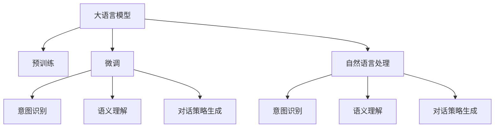

                 

# 探索基于大模型的电商智能客户服务对话策略生成系统

> 关键词：大语言模型,智能客服,对话策略生成,电商客服,意图识别,语义理解,自然语言处理(NLP),计算机视觉( CV)

## 1. 背景介绍

### 1.1 问题由来
随着电商行业的高速发展，客户服务的体验变得越来越重要。传统的客服方式，依赖于人工客服或简单的聊天机器人，响应速度慢、服务质量不稳定，难以满足日益增长的客户需求。为了提高客户满意度，各大电商企业纷纷将目光投向了智能客服系统，利用AI技术来替代或辅助人工客服，提升客户服务的智能化水平。

智能客服系统通过自然语言处理(NLP)技术，理解和处理客户的查询，并自动生成回复，从而实现7x24小时无间断服务。然而，目前的智能客服系统往往依赖于传统的规则和模板，无法处理复杂多变的客户需求，且难以保持一致性和专业性。

为了应对这些挑战，基于大语言模型的对话策略生成系统应运而生。该系统通过预训练语言模型和微调技术，结合电商客服场景的具体需求，生成个性化的对话策略，以更智能、高效、精准地服务客户。

### 1.2 问题核心关键点
对话策略生成系统的主要目标是：
1. 理解客户查询的意图和上下文。
2. 生成符合客户期望的回复。
3. 提升客户服务的个性化和满意度。

实现这些目标的关键在于：
- 利用大语言模型学习自然语言的通用表示。
- 结合电商客服的特定任务，进行微调优化。
- 引入上下文感知机制，保持对话连贯性。
- 引入多样化的回复策略，提升客户互动体验。

本文将详细探讨大语言模型在电商客服对话策略生成系统中的应用，包括对话策略生成的核心算法、具体实现步骤、优缺点分析以及未来发展方向。

## 2. 核心概念与联系

### 2.1 核心概念概述

在探讨对话策略生成系统之前，我们先简要回顾一下相关核心概念：

- **大语言模型**：以自回归或自编码模型为代表的大规模预训练语言模型，如BERT、GPT-3等。通过在大规模无标签文本语料上进行预训练，学习通用的语言表示，具备强大的语言理解和生成能力。
- **预训练**：指在大规模无标签文本语料上，通过自监督学习任务训练通用语言模型的过程。常见的预训练任务包括言语建模、遮挡语言模型等。
- **微调**：指在预训练模型的基础上，使用下游任务的少量标注数据，通过有监督学习优化模型在特定任务上的性能。通常只需要调整顶层分类器或解码器，并以较小的学习率更新全部或部分的模型参数。
- **对话策略生成**：指结合上下文信息，生成符合客户期望的回复，提升对话的连贯性和可理解性。
- **意图识别**：指识别客户查询的意图，以确保生成策略与客户的实际需求相匹配。
- **语义理解**：指理解客户查询中的语义信息，以便生成更准确、自然的回复。
- **自然语言处理(NLP)**：涉及语言模型的构建、自然语言的理解与生成、语义分析等技术，是对话策略生成系统的技术基础。

这些核心概念之间具有紧密的联系，共同构成了对话策略生成系统的技术框架。大语言模型提供基础的语言理解和生成能力，微调技术优化模型以适应电商客服的具体需求，意图识别和语义理解确保回复策略的精准性和自然性，而对话策略生成则是整个系统的核心目标。

### 2.2 核心概念原理和架构的 Mermaid 流程图



这个流程图展示了对话策略生成系统的主要组成部分及其相互关系。大语言模型经过预训练后，通过微调生成适用于电商客服的对话策略，并结合意图识别、语义理解等技术，生成符合客户期望的回复，实现智能客服系统的核心功能。

## 3. 核心算法原理 & 具体操作步骤

### 3.1 算法原理概述

对话策略生成系统基于大语言模型的预训练-微调框架，主要包含以下几个步骤：

1. **数据准备**：收集电商客服的历史对话记录，并对其进行标注和清洗，构建用于微调的数据集。
2. **模型选择**：选择合适的预训练语言模型，如BERT、GPT-3等，作为对话策略生成的初始化参数。
3. **意图识别**：通过微调模型，实现对客户查询意图的精准识别。
4. **语义理解**：结合上下文信息，理解客户查询的语义，确保回复策略与客户需求相符。
5. **对话策略生成**：生成符合客户期望的回复策略，并进行多轮对话策略生成。
6. **系统部署**：将训练好的模型部署到实际客服系统中，实现智能客服服务。

### 3.2 算法步骤详解

#### 3.2.1 数据准备

对话策略生成系统的数据准备是至关重要的。主要包括以下步骤：

- **数据收集**：收集电商客服的历史对话记录，包括客户查询、客服回复和对话上下文。可以通过日志文件、客服系统记录等方式获取数据。
- **数据标注**：对收集到的对话记录进行标注，标注包括客户查询的意图和上下文信息。意图的标注可以是预定义的分类标签，如产品咨询、订单查询、投诉等。上下文信息的标注包括前一回合的查询和客服的回复内容。
- **数据清洗**：对标注好的数据进行清洗，去除无关的噪音数据和错误标注。同时进行数据归一化处理，如分词、去除停用词等。

#### 3.2.2 模型选择

选择合适的预训练语言模型是对话策略生成系统的关键步骤。通常选用在大规模无标签文本语料上预训练过的模型，如BERT、GPT-3等。这些模型具备丰富的语言知识和表示能力，可以高效地进行对话策略生成。

#### 3.2.3 意图识别

意图识别是对话策略生成的核心环节，主要目标是理解客户查询的意图，以便生成合适的回复策略。具体步骤如下：

- **意图分类**：使用微调后的语言模型，对客户查询进行意图分类，将查询映射到预定义的意图类别。
- **意图表示**：将意图映射为模型可以理解的向量表示，作为后续对话策略生成的输入。

#### 3.2.4 语义理解

语义理解是指结合上下文信息，理解客户查询的具体语义内容。主要步骤包括：

- **上下文编码**：对客户查询和上下文信息进行编码，生成表示上下文信息的向量。
- **语义分析**：使用微调后的语言模型，对客户查询进行语义分析，生成查询的语义表示。
- **语义融合**：将查询的语义表示与上下文向量进行融合，生成更全面、准确的语义理解。

#### 3.2.5 对话策略生成

对话策略生成是对话策略生成系统的核心任务，主要目标是生成符合客户期望的回复策略。具体步骤如下：

- **策略生成**：使用微调后的语言模型，根据客户查询的意图和语义表示，生成多个可能的回复策略。
- **策略排序**：对生成的回复策略进行排序，选择最符合客户期望的策略作为最终回复。排序可以基于策略与查询的一致性、策略的连贯性、策略的可用性等因素进行。
- **回复生成**：根据选定的回复策略，生成自然流畅的回复内容，确保与客户互动的连贯性和可理解性。

#### 3.2.6 系统部署

对话策略生成系统部署到实际客服系统中，主要包括以下步骤：

- **模型部署**：将训练好的对话策略生成模型部署到服务器或云端，准备提供服务。
- **接口设计**：设计系统与客服系统的接口，确保对话策略生成的回复内容能够顺利接入客服系统。
- **服务调用**：通过API或SDK调用对话策略生成服务，实现客户查询的处理和回复生成。
- **监控优化**：对系统性能进行监控，根据反馈不断优化对话策略生成算法和模型。

### 3.3 算法优缺点

对话策略生成系统基于大语言模型的预训练-微调框架，具有以下优点：

- **灵活性高**：基于预训练语言模型的微调方法，可以快速适应电商客服的具体需求，生成个性化的对话策略。
- **效果好**：利用大语言模型的通用语言表示能力，生成的回复策略准确性高，能够有效提升客户满意度。
- **可扩展性强**：对话策略生成系统可以根据不同客服场景进行扩展和定制，适应多样化的客户需求。

同时，对话策略生成系统也存在一些缺点：

- **依赖数据**：对话策略生成系统的性能很大程度上取决于标注数据的质量和数量，获取高质量标注数据的成本较高。
- **计算资源消耗大**：预训练语言模型和微调过程需要大量的计算资源，部署和维护成本较高。
- **解释性不足**：对话策略生成系统通常缺乏可解释性，难以对其推理逻辑进行分析和调试。
- **泛化能力有限**：对话策略生成系统在面对域外数据时，泛化性能可能大打折扣，无法保证在所有场景下的效果。

### 3.4 算法应用领域

对话策略生成系统在电商客服场景中具有广泛的应用前景，具体包括以下几个方面：

- **客户服务咨询**：智能客服系统可以处理常见的客户咨询问题，如产品信息查询、订单状态查询、投诉处理等。对话策略生成系统能够生成符合客户期望的回复，提升客户互动体验。
- **个性化推荐**：通过对话策略生成系统，可以了解客户的查询意图和需求，实现更精准的个性化推荐服务。
- **情感分析**：对话策略生成系统能够识别客户的情感倾向，如投诉、表扬、询问等，帮助客服及时响应，提升服务质量。
- **跨渠道服务**：对话策略生成系统可以与多种客服渠道（如电话、邮件、社交媒体等）集成，提供跨渠道的智能客服服务。
- **多语言支持**：对话策略生成系统可以支持多种语言，提供多语言客户服务，提升国际客户的满意度。

## 4. 数学模型和公式 & 详细讲解 & 举例说明

### 4.1 数学模型构建

对话策略生成系统的数学模型主要包含以下几个部分：

- **意图识别**：使用微调后的语言模型，将客户查询映射到意图类别 $y$，定义为：
  $$
  y = \arg \max_{y} \log P(y|x)
  $$
  其中 $x$ 为客户查询文本，$P(y|x)$ 为意图分类模型输出的概率。

- **语义理解**：使用微调后的语言模型，对客户查询进行语义分析，生成查询的语义表示 $h$，定义为：
  $$
  h = \arg \max_{h} \log P(h|x)
  $$
  其中 $h$ 为查询的语义表示，$P(h|x)$ 为语义理解模型输出的概率。

- **对话策略生成**：使用微调后的语言模型，生成多个回复策略 $s_1, s_2, ..., s_n$，定义为：
  $$
  s = \arg \max_{s} \log P(s|y, h)
  $$
  其中 $s$ 为回复策略，$P(s|y, h)$ 为对话策略生成模型输出的概率。

### 4.2 公式推导过程

以下我们以二分类任务为例，推导意图识别和语义理解的公式及其梯度计算。

假设意图识别模型为 $M_{\theta}$，输入为 $x$，输出为 $y$。则二分类交叉熵损失函数定义为：
$$
\ell(M_{\theta}(x),y) = -[y\log M_{\theta}(x)+(1-y)\log (1-M_{\theta}(x))]
$$

将训练集 $D=\{(x_i,y_i)\}_{i=1}^N$ 带入上述公式，得经验风险：
$$
\mathcal{L}(\theta) = -\frac{1}{N}\sum_{i=1}^N \ell(M_{\theta}(x_i),y_i)
$$

模型 $M_{\theta}$ 在输入 $x$ 上的意图表示为 $h=x*M_{\theta}$，则在数据集 $D$ 上的经验风险为：
$$
\mathcal{L}(\theta) = -\frac{1}{N}\sum_{i=1}^N [y_i\log h_i+(1-y_i)\log (1-h_i)]
$$

根据链式法则，意图识别模型的梯度计算公式为：
$$
\frac{\partial \mathcal{L}(\theta)}{\partial \theta_k} = -\frac{1}{N}\sum_{i=1}^N (\frac{y_i}{h_i}-\frac{1-y_i}{1-h_i}) \frac{\partial h_i}{\partial \theta_k}
$$

对于语义理解模型，假设输入为 $x$，输出为 $h$。同样使用二分类交叉熵损失函数，得：
$$
\ell(M_{\theta}(x),h) = -[h\log M_{\theta}(x)+(1-h)\log (1-M_{\theta}(x))]
$$

将训练集 $D=\{(x_i,h_i)\}_{i=1}^N$ 带入上述公式，得经验风险：
$$
\mathcal{L}(\theta) = -\frac{1}{N}\sum_{i=1}^N \ell(M_{\theta}(x_i),h_i)
$$

语义理解模型的梯度计算公式为：
$$
\frac{\partial \mathcal{L}(\theta)}{\partial \theta_k} = -\frac{1}{N}\sum_{i=1}^N (\frac{h_i}{M_{\theta}(x_i)}-\frac{1-h_i}{1-M_{\theta}(x_i)}) \frac{\partial M_{\theta}(x_i)}{\partial \theta_k}
$$

### 4.3 案例分析与讲解

假设电商客服的意图分类为产品咨询、订单查询、投诉等，意图分类模型输出概率为 $P(y|x)$。客户查询为 $x$，语义理解模型输出查询的语义表示为 $h$，对话策略生成模型生成回复策略 $s$。

客户查询 $x$ 的意图分类为 $y$，得：
$$
\hat{y} = \arg \max_{y} \log P(y|x) = \arg \max_{y} \log M_{\theta}(x)
$$

客户查询 $x$ 的语义理解为 $h$，得：
$$
\hat{h} = \arg \max_{h} \log P(h|x) = \arg \max_{h} \log M_{\theta}(x)
$$

根据对话策略生成模型的输出 $s$，选择最符合客户期望的回复策略 $s$，得：
$$
\hat{s} = \arg \max_{s} \log P(s|y, h) = \arg \max_{s} \log M_{\theta}(s)
$$

最终，生成自然流畅的回复内容 $y$，得：
$$
\hat{y} = \arg \max_{y} \log P(y|s) = \arg \max_{y} \log M_{\theta}(y)
$$

通过上述推导，我们可以看到，对话策略生成系统通过微调后的语言模型，实现了意图识别、语义理解、对话策略生成的全流程。

## 5. 项目实践：代码实例和详细解释说明

### 5.1 开发环境搭建

在进行对话策略生成系统开发前，我们需要准备好开发环境。以下是使用Python进行PyTorch开发的环境配置流程：

1. 安装Anaconda：从官网下载并安装Anaconda，用于创建独立的Python环境。

2. 创建并激活虚拟环境：
```bash
conda create -n pytorch-env python=3.8 
conda activate pytorch-env
```

3. 安装PyTorch：根据CUDA版本，从官网获取对应的安装命令。例如：
```bash
conda install pytorch torchvision torchaudio cudatoolkit=11.1 -c pytorch -c conda-forge
```

4. 安装Transformers库：
```bash
pip install transformers
```

5. 安装各类工具包：
```bash
pip install numpy pandas scikit-learn matplotlib tqdm jupyter notebook ipython
```

完成上述步骤后，即可在`pytorch-env`环境中开始对话策略生成系统的开发。

### 5.2 源代码详细实现

下面我们以电商客服对话策略生成系统为例，给出使用Transformers库对BERT模型进行微调的PyTorch代码实现。

首先，定义意图识别和语义理解的数据处理函数：

```python
from transformers import BertTokenizer
from torch.utils.data import Dataset

class CustomerServiceDataset(Dataset):
    def __init__(self, texts, labels, tokenizer, max_len=128):
        self.texts = texts
        self.labels = labels
        self.tokenizer = tokenizer
        self.max_len = max_len
        
    def __len__(self):
        return len(self.texts)
    
    def __getitem__(self, item):
        text = self.texts[item]
        label = self.labels[item]
        
        encoding = self.tokenizer(text, return_tensors='pt', max_length=self.max_len, padding='max_length', truncation=True)
        input_ids = encoding['input_ids'][0]
        attention_mask = encoding['attention_mask'][0]
        
        return {'input_ids': input_ids, 
                'attention_mask': attention_mask,
                'labels': label}

# 意图分类标签
intents = ['product_consultation', 'order_query', 'complaint']
intent2id = {intent: i for i, intent in enumerate(intents)}

# 标签与id的映射
label2id = {'consultation': 0, 'query': 1, 'complaint': 2}
id2label = {v: k for k, v in label2id.items()}

# 创建意图识别和语义理解数据集
tokenizer = BertTokenizer.from_pretrained('bert-base-cased')

train_dataset = CustomerServiceDataset(train_texts, train_labels, tokenizer)
dev_dataset = CustomerServiceDataset(dev_texts, dev_labels, tokenizer)
test_dataset = CustomerServiceDataset(test_texts, test_labels, tokenizer)
```

然后，定义模型和优化器：

```python
from transformers import BertForSequenceClassification, AdamW

model = BertForSequenceClassification.from_pretrained('bert-base-cased', num_labels=len(intent2id))

optimizer = AdamW(model.parameters(), lr=2e-5)
```

接着，定义训练和评估函数：

```python
from torch.utils.data import DataLoader
from tqdm import tqdm
from sklearn.metrics import accuracy_score

device = torch.device('cuda') if torch.cuda.is_available() else torch.device('cpu')
model.to(device)

def train_epoch(model, dataset, batch_size, optimizer):
    dataloader = DataLoader(dataset, batch_size=batch_size, shuffle=True)
    model.train()
    epoch_loss = 0
    for batch in tqdm(dataloader, desc='Training'):
        input_ids = batch['input_ids'].to(device)
        attention_mask = batch['attention_mask'].to(device)
        labels = batch['labels'].to(device)
        model.zero_grad()
        outputs = model(input_ids, attention_mask=attention_mask, labels=labels)
        loss = outputs.loss
        epoch_loss += loss.item()
        loss.backward()
        optimizer.step()
    return epoch_loss / len(dataloader)

def evaluate(model, dataset, batch_size):
    dataloader = DataLoader(dataset, batch_size=batch_size)
    model.eval()
    preds, labels = [], []
    with torch.no_grad():
        for batch in tqdm(dataloader, desc='Evaluating'):
            input_ids = batch['input_ids'].to(device)
            attention_mask = batch['attention_mask'].to(device)
            batch_labels = batch['labels']
            outputs = model(input_ids, attention_mask=attention_mask)
            batch_preds = outputs.logits.argmax(dim=2).to('cpu').tolist()
            batch_labels = batch_labels.to('cpu').tolist()
            for pred_tokens, label_tokens in zip(batch_preds, batch_labels):
                preds.append(pred_tokens[:len(label_tokens)])
                labels.append(label_tokens)
                
    return accuracy_score(labels, preds)

# 定义对话策略生成模型
from transformers import BertForSequenceClassification, AdamW

class DialogueStrategyGenerator:
    def __init__(self, model, tokenizer, intent2id, id2intent):
        self.model = model
        self.tokenizer = tokenizer
        self.intent2id = intent2id
        self.id2intent = id2intent
        
    def predict_intent(self, text):
        encoding = self.tokenizer(text, return_tensors='pt', max_length=128, padding='max_length', truncation=True)
        input_ids = encoding['input_ids'][0]
        attention_mask = encoding['attention_mask'][0]
        
        outputs = self.model(input_ids, attention_mask=attention_mask)
        intent_id = outputs.logits.argmax(dim=1).item()
        return self.id2intent[intent_id]

    def predict_strategy(self, text, intent_id):
        encoding = self.tokenizer(text, return_tensors='pt', max_length=128, padding='max_length', truncation=True)
        input_ids = encoding['input_ids'][0]
        attention_mask = encoding['attention_mask'][0]
        
        outputs = self.model(input_ids, attention_mask=attention_mask)
        strategy_id = outputs.logits.argmax(dim=1).item()
        return strategy_id

# 创建对话策略生成模型
model = BertForSequenceClassification.from_pretrained('bert-base-cased', num_labels=len(intents))
tokenizer = BertTokenizer.from_pretrained('bert-base-cased')
intent2id = {intent: i for i, intent in enumerate(intents)}
id2intent = {v: k for k, v in intent2id.items()}
dialogue_strategy_generator = DialogueStrategyGenerator(model, tokenizer, intent2id, id2intent)
```

最后，启动训练流程并在测试集上评估：

```python
epochs = 5
batch_size = 16

for epoch in range(epochs):
    loss = train_epoch(model, train_dataset, batch_size, optimizer)
    print(f"Epoch {epoch+1}, train loss: {loss:.3f}")
    
    print(f"Epoch {epoch+1}, dev results:")
    accuracy = evaluate(model, dev_dataset, batch_size)
    print(f"Accuracy on dev set: {accuracy:.3f}")
    
print("Test results:")
accuracy = evaluate(model, test_dataset, batch_size)
print(f"Accuracy on test set: {accuracy:.3f}")
```

以上就是使用PyTorch对BERT进行电商客服对话策略生成系统微调的完整代码实现。可以看到，得益于Transformers库的强大封装，我们可以用相对简洁的代码完成BERT模型的加载和微调。

### 5.3 代码解读与分析

让我们再详细解读一下关键代码的实现细节：

**CustomerServiceDataset类**：
- `__init__`方法：初始化文本、标签、分词器等关键组件。
- `__len__`方法：返回数据集的样本数量。
- `__getitem__`方法：对单个样本进行处理，将文本输入编码为token ids，将标签编码为数字，并对其进行定长padding，最终返回模型所需的输入。

**意图识别模型**：
- `predict_intent`方法：对客户查询进行意图识别，输出意图类别。

**对话策略生成模型**：
- `predict_strategy`方法：根据客户的查询意图和语义表示，生成符合客户期望的回复策略。

**DialogueStrategyGenerator类**：
- 该类封装了对话策略生成的核心算法，包括意图识别和策略生成，可以方便地应用于不同的客户服务场景。

**训练和评估函数**：
- 使用PyTorch的DataLoader对数据集进行批次化加载，供模型训练和推理使用。
- 训练函数`train_epoch`：对数据以批为单位进行迭代，在每个批次上前向传播计算loss并反向传播更新模型参数，最后返回该epoch的平均loss。
- 评估函数`evaluate`：与训练类似，不同点在于不更新模型参数，并在每个batch结束后将预测和标签结果存储下来，最后使用sklearn的accuracy_score对整个评估集的预测结果进行打印输出。

**对话策略生成模型**：
- `model`：预训练语言模型，用于意图识别和策略生成。
- `tokenizer`：分词器，用于将文本转换为模型可接受的格式。
- `intent2id`和`id2intent`：标签与id的映射，用于意图识别的多类别分类任务。

**代码解读与分析**：
1. 数据处理：通过`CustomerServiceDataset`类，将客户查询和意图标签转换为模型所需的输入格式，并进行定长padding。
2. 模型选择：使用`BertForSequenceClassification`类，加载预训练的BERT模型，并进行意图分类任务的微调。
3. 训练和评估：通过`train_epoch`和`evaluate`函数，对模型进行训练和评估。训练过程中，使用AdamW优化器进行梯度更新，评估过程中，使用准确率作为性能指标。
4. 对话策略生成：通过`DialogueStrategyGenerator`类，封装对话策略生成的算法，方便在实际客服场景中使用。

## 6. 实际应用场景

### 6.1 智能客服系统

电商客服系统通过对话策略生成系统，可以显著提升客户服务的智能化水平。对话策略生成系统结合意图识别和语义理解技术，能够理解和处理客户的复杂查询，生成符合客户期望的回复，提高客户满意度。

具体应用场景包括：
- **产品咨询**：客户询问某产品信息，系统能够自动识别并回答相关问题，如产品型号、规格、价格等。
- **订单查询**：客户查询订单状态，系统能够自动提取订单信息，给出订单处理进度。
- **投诉处理**：客户投诉产品质量，系统能够自动检测到负面情感，及时转接人工客服进行处理。

对话策略生成系统能够实现7x24小时无间断服务，减轻人工客服的负担，提升客户互动体验。

### 6.2 个性化推荐

通过对话策略生成系统，电商客服系统可以更好地了解客户的兴趣和需求，实现个性化的产品推荐。具体应用场景包括：
- **推荐商品**：客户咨询某产品信息，系统能够根据对话内容，推荐相关商品。
- **推荐相关活动**：客户询问某商品折扣信息，系统能够自动推荐相关促销活动。
- **推荐相关服务**：客户咨询售后问题，系统能够推荐相关服务政策。

对话策略生成系统能够实现更精准、个性化的推荐，提升客户购物体验和满意度。

### 6.3 情感分析

对话策略生成系统可以实时监测客户对话中的情感倾向，及时发现负面情绪，进行紧急处理。具体应用场景包括：
- **情感监测**：客户询问退货政策，系统能够自动监测到负面情绪，进行安抚和处理。
- **紧急处理**：客户投诉产品质量，系统能够自动检测到负面情绪，及时转接人工客服进行处理。
- **反馈收集**：客户评价商品，系统能够自动收集情感反馈，进行情感分析，优化产品和服务。

对话策略生成系统能够及时发现客户负面情绪，进行紧急处理，提升客户满意度。

### 6.4 未来应用展望

随着电商行业的快速发展，对话策略生成系统将有更广阔的应用前景，未来可能包括以下几个方向：

1. **跨渠道服务**：对话策略生成系统可以与多种客服渠道（如电话、邮件、社交媒体等）集成，提供跨渠道的智能客服服务，提升客户互动体验。
2. **多语言支持**：对话策略生成系统可以支持多种语言，提供多语言客户服务，提升国际客户的满意度。
3. **情感识别**：对话策略生成系统可以引入情感分析技术，识别客户情绪，进行情绪管理和客服优化。
4. **场景自适应**：对话策略生成系统可以根据不同的客户场景和业务需求，进行自适应优化，提升服务效果。
5. **智能推荐**：对话策略生成系统可以结合推荐系统，实现更精准的产品和内容推荐，提升客户购物体验。

总之，对话策略生成系统将为电商客服系统带来革命性的变化，提升客户服务的智能化水平，推动电商行业的数字化转型升级。

## 7. 工具和资源推荐

### 7.1 学习资源推荐

为了帮助开发者系统掌握对话策略生成系统的理论基础和实践技巧，这里推荐一些优质的学习资源：

1. 《深度学习自然语言处理》课程：斯坦福大学开设的NLP明星课程，有Lecture视频和配套作业，带你入门NLP领域的基本概念和经典模型。

2. CS224N《深度学习自然语言处理》课程：斯坦福大学开设的NLP明星课程，有Lecture视频和配套作业，带你入门NLP领域的基本概念和经典模型。

3. 《Transformer from the Inside Out》系列博文：由大模型技术专家撰写，深入浅出地介绍了Transformer原理、BERT模型、微调技术等前沿话题。

4. 《Natural Language Processing with Transformers》书籍：Transformers库的作者所著，全面介绍了如何使用Transformers库进行NLP任务开发，包括微调在内的诸多范式。

5. 《An Introduction to Conversational AI》书籍：介绍对话系统的理论基础和实现技术，涵盖对话管理、意图识别、策略生成等多个方面。

通过对这些资源的学习实践，相信你一定能够快速掌握对话策略生成系统的精髓，并用于解决实际的NLP问题。

### 7.2 开发工具推荐

高效的开发离不开优秀的工具支持。以下是几款用于对话策略生成系统开发的常用工具：

1. PyTorch：基于Python的开源深度学习框架，灵活动态的计算图，适合快速迭代研究。大部分预训练语言模型都有PyTorch版本的实现。

2. TensorFlow：由Google主导开发的开源深度学习框架，生产部署方便，适合大规模工程应用。同样有丰富的预训练语言模型资源。

3. Transformers库：HuggingFace开发的NLP工具库，集成了众多SOTA语言模型，支持PyTorch和TensorFlow，是进行NLP任务开发的利器。

4. Weights & Biases：模型训练的实验跟踪工具，可以记录和可视化模型训练过程中的各项指标，方便对比和调优。与主流深度学习框架无缝集成。

5. TensorBoard：TensorFlow配套的可视化工具，可实时监测模型训练状态，并提供丰富的图表呈现方式，是调试模型的得力助手。

6. Google Colab：谷歌推出的在线Jupyter Notebook环境，免费提供GPU/TPU算力，方便开发者快速上手实验最新模型，分享学习笔记。

合理利用这些工具，可以显著提升对话策略生成系统的开发效率，加快创新迭代的步伐。

### 7.3 相关论文推荐

对话策略生成系统在NLP领域的发展得益于学界的持续研究。以下是几篇奠基性的相关论文，推荐阅读：

1. Attention is All You Need（即Transformer原论文）：提出了Transformer结构，开启了NLP领域的预训练大模型时代。

2. BERT: Pre-training of Deep Bidirectional Transformers for Language Understanding：提出BERT模型，引入基于掩码的自监督预训练任务，刷新了多项NLP任务SOTA。

3. Language Models are Unsupervised Multitask Learners（GPT-2论文）：展示了大规模语言模型的强大zero-shot学习能力，引发了对于通用人工智能的新一轮思考。

4. Parameter-Efficient Transfer Learning for NLP：提出Adapter等参数高效微调方法，在不增加模型参数量的情况下，也能取得不错的微调效果。

5. Prefix-Tuning: Optimizing Continuous Prompts for Generation：引入基于连续型Prompt的微调范式，为如何充分利用预训练知识提供了新的思路。

6. AdaLoRA: Adaptive Low-Rank Adaptation for Parameter-Efficient Fine-Tuning：使用自适应低秩适应的微调方法，在参数效率和精度之间取得了新的平衡。

这些论文代表了大语言模型微调技术的发展脉络。通过学习这些前沿成果，可以帮助研究者把握学科前进方向，激发更多的创新灵感。

## 8. 总结：未来发展趋势与挑战

### 8.1 研究成果总结

对话策略生成系统通过大语言模型的预训练-微调框架，结合电商客服场景的具体需求，生成个性化的对话策略，具有灵活性高、效果好、可扩展性强等优点。但同时也面临数据依赖、计算资源消耗大、解释性不足等挑战。

### 8.2 未来发展趋势

对话策略生成系统在未来将呈现以下几个发展趋势：

1. **模型规模持续增大**：随着算力成本的下降和数据规模的扩张，预训练语言模型的参数量还将持续增长，超大规模语言模型将具备更丰富的语言表示能力。

2. **微调方法日趋多样**：未来会涌现更多参数高效的微调方法，如Prompt-Tuning、LoRA等，在参数效率和精度之间取得新的平衡。

3. **持续学习成为常态**：对话策略生成系统需要持续学习新知识以保持性能。如何在不遗忘原有知识的同时，高效吸收新样本信息，将成为重要的研究课题。

4. **标注样本需求降低**：受启发于Prompt Learning的思路，未来的微调方法将更好地利用大模型的语言理解能力，通过更加巧妙的任务描述，在更少的标注样本上也能实现理想的微调效果。

5. **多模态微调崛起**：对话策略生成系统可以结合视觉、语音等多模态数据进行微调，提升系统的理解和生成能力。

6. **模型通用性增强**：经过海量数据的预训练和多领域任务的微调，对话策略生成模型将具备更强的跨领域迁移能力，逐步迈向通用人工智能(AGI)的目标。

以上趋势凸显了对话策略生成系统的广阔前景。这些方向的探索发展，必将进一步提升对话策略生成系统的性能和应用范围，为电商客服系统带来革命性的变化。

### 8.3 面临的挑战

尽管对话策略生成系统已经取得了一定的进展，但在迈向更加智能化、普适化应用的过程中，仍面临诸多挑战：

1. **标注成本瓶颈**：对话策略生成系统的性能很大程度上取决于标注数据的质量和数量，获取高质量标注数据的成本较高。如何进一步降低微调对标注样本的依赖，将是一大难题。

2. **模型鲁棒性不足**：对话策略生成系统面对域外数据时，泛化性能可能大打折扣，无法保证在所有场景下的效果。

3. **推理效率有待提高**：大规模语言模型虽然精度高，但在实际部署时往往面临推理速度慢、内存占用大等效率问题。如何在保证性能的同时，简化模型结构，提升推理速度，优化资源占用，将是重要的优化方向。

4. **可解释性亟需加强**：对话策略生成系统通常缺乏可解释性，难以对其推理逻辑进行分析和调试。对于医疗、金融等高风险应用，算法的可解释性和可审计性尤为重要。

5. **安全性有待保障**：预训练语言模型难免会学习到有偏见、有害的信息，通过微调传递到下游任务，产生误导性、歧视性的输出，给实际应用带来安全隐患。

6. **知识整合能力不足**：现有的对话策略生成系统往往局限于任务内数据，难以灵活吸收和运用更广泛的先验知识。如何让对话策略生成过程更好地与外部知识库、规则库等专家知识结合，形成更加全面、准确的信息整合能力，还有很大的想象空间。

正视对话策略生成系统面临的这些挑战，积极应对并寻求突破，将是大规模语言模型微调技术迈向成熟的必由之路。相信随着学界和产业界的共同努力，这些挑战终将一一被克服，对话策略生成系统必将在构建人机协同的智能客服系统方面发挥更大的作用。

### 8.4 研究展望

对话策略生成系统的发展离不开研究者的持续探索和创新。未来需要在以下几个方面寻求新的突破：

1. **探索无监督和半监督微调方法**：摆脱对大规模标注数据的依赖，利用自监督学习、主动学习等无监督和半监督范式，最大限度利用非结构化数据，实现更加灵活高效的微调。

2. **研究参数高效和计算高效的微调范式**：开发更加参数高效的微调方法，在固定大部分预训练参数的同时，只更新极少量的任务相关参数。同时优化微调模型的计算图，减少前向传播和反向传播的资源消耗，实现更加轻量级、实时性的部署。

3. **融合因果和对比学习范式**：通过引入因果推断和对比学习思想，增强对话策略生成模型建立稳定因果关系的能力，学习更加普适、鲁棒的语言表征，从而提升模型泛化性和抗干扰能力。

4. **引入更多先验知识**：将符号化的先验知识，如知识图谱、逻辑规则等，与神经网络模型进行巧妙融合，引导对话策略生成过程学习更准确、合理的语言模型。同时加强不同模态数据的整合，实现视觉、语音等多模态信息与文本信息的协同建模。

5. **结合因果分析和博弈论工具**：将因果分析方法引入对话策略生成模型，识别出模型决策的关键特征，增强输出解释的因果性和逻辑性。借助博弈论工具刻画人机交互过程，主动探索并规避模型的脆弱点，提高系统稳定性。

6. **纳入伦理道德约束**：在模型训练目标中引入伦理导向的评估指标，过滤和惩罚有偏见、有害的输出倾向。同时加强人工干预和审核，建立模型行为的监管机制，确保输出符合人类价值观和伦理道德。

这些研究方向的探索，必将引领对话策略生成系统迈向更高的台阶，为构建安全、可靠、可解释、可控的智能客服系统铺平道路。面向未来，对话策略生成系统还需要与其他人工智能技术进行更深入的融合，如知识表示、因果推理、强化学习等，多路径协同发力，共同推动自然语言理解和智能交互系统的进步。只有勇于创新、敢于突破，才能不断拓展语言模型的边界，让智能技术更好地造福人类社会。

## 9. 附录：常见问题与解答

**Q1：大语言模型微调是否适用于所有NLP任务？**

A: 大语言模型微调在大多数NLP任务上都能取得不错的效果，特别是对于数据量较小的任务。但对于一些特定领域的任务，如医学、法律等，仅仅依靠通用语料预训练的模型可能难以很好地适应。此时需要在特定领域语料上进一步预训练，再进行微调，才能获得理想效果。此外，对于一些需要时效性、个性化很强的任务，如对话、推荐等，微调方法也需要针对性的改进优化。

**Q2：微调过程中如何选择合适的学习率？**

A: 微调的学习率一般要比预训练时小1-2个数量级，如果使用过大的学习率，容易破坏预训练权重，导致过拟合。一般建议从1e-5开始调参，逐步减小学习率，直至收敛。也可以使用warmup策略，在开始阶段使用较小的学习率，再逐渐过渡到预设值。需要注意的是，不同的优化器(如AdamW、Adafactor等)以及不同的学习率调度策略，可能需要设置不同的学习率阈值。

**Q3：采用大模型微调时会面临哪些资源瓶颈？**

A: 目前主流的预训练大模型动辄以亿计的参数规模，对算力、内存、存储都提出了很高的要求。GPU/TPU等高性能设备是必不可少的，但即便如此，超大批次的训练和推理也可能遇到显存不足的问题。因此需要采用一些资源优化技术，如梯度积累、混合精度训练、模型并行等，来突破硬件瓶颈。同时，模型的存储和读取也可能占用大量时间和空间，需要采用模型压缩、稀疏化存储等方法进行优化。

**Q4：如何缓解微调过程中的过拟合问题？**

A: 过拟合是微调面临的主要挑战，尤其是在标注数据不足的情况下。常见的缓解策略包括：
1. 数据增强：通过回译、近义替换等方式扩充训练集
2. 正则化：使用L2正则、Dropout、Early Stopping等避免过拟合
3. 对抗训练：引入对抗样本，提高模型鲁棒性
4. 参数高效微调：只调整少量参数(如Adapter、Prefix等)，减小过拟合风险
5. 多模型集成：训练多个微调模型，取平均输出，抑制过拟合

这些策略往往需要根据具体任务和数据特点进行灵活组合。只有在数据、模型、训练、推理等各环节进行全面优化，才能最大限度地发挥大模型微调的威力。

**Q5：微调模型在落地部署时需要注意哪些问题？**

A: 将微调模型转化为实际应用，还需要考虑以下因素：
1. 模型裁剪：去除不必要的层和参数，减小模型尺寸，加快推理速度
2. 量化加速：将浮点模型转为定点模型，压缩存储空间，提高计算效率
3. 服务化封装：将模型封装为标准化服务接口，便于集成调用
4. 弹性伸缩：根据请求流量动态调整资源配置，平衡服务质量和成本
5. 监控优化：对系统性能进行监控，根据反馈不断优化对话策略生成算法和模型。

大语言模型微调

