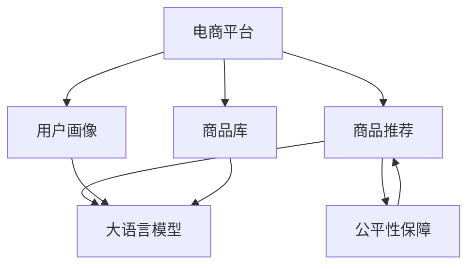

                 

# 探讨大模型在电商平台商品推荐公平性保障中的作用

> 关键词：大语言模型,电商平台,商品推荐,公平性保障,算法公正性,多目标优化

## 1. 背景介绍

在电商平台商品推荐中，公平性是一个重要而复杂的议题。传统的推荐算法如协同过滤、内容推荐等，在一定程度上缓解了冷启动问题和稀疏性问题，但往往忽视了推荐系统的公平性，导致部分用户被算法忽视或低估。近年来，随着大语言模型的兴起，其在商品推荐中的应用开始引起关注。大模型凭借其强大的语言理解和生成能力，有望通过训练学习到丰富的用户和商品特征，提升推荐系统的公平性，保障用户权益，避免推荐算法歧视。本文将深入探讨大模型在电商平台商品推荐公平性保障中的作用，并提出相应的解决方案。

## 2. 核心概念与联系

### 2.1 核心概念概述

为更好地理解大模型在商品推荐中的应用，本节将介绍几个核心概念：

- 电商平台：以互联网为平台，提供商品销售、交易、支付等服务的商业模型。常见的平台包括淘宝、京东、亚马逊等。
- 商品推荐：根据用户的兴趣、历史行为、社交关系等特征，动态生成商品列表，帮助用户快速找到所需商品的推荐算法。
- 公平性保障：在商品推荐中，通过算法设计、数据预处理、模型优化等手段，保障不同用户群体、商品类型等的公平性，避免推荐结果出现系统性偏差。
- 大语言模型：以自回归（如GPT）或自编码（如BERT）模型为代表的大规模预训练语言模型。通过在海量文本数据上进行预训练，学习到丰富的语言知识和常识。
- 多目标优化：在优化推荐算法时，同时考虑推荐效果、公平性、效率等多个目标，寻找多目标之间的平衡点。

这些核心概念之间的关系可以通过以下Mermaid流程图来展示：



这个流程图展示了大模型在电商平台商品推荐中的应用流程：

1. 电商平台构建用户画像和商品库。
2. 商品推荐系统根据用户画像和商品库生成推荐列表。
3. 使用大语言模型进行模型训练，学习用户和商品特征。
4. 引入公平性保障机制，确保推荐结果的公平性。
5. 将优化后的推荐模型集成到电商平台，提升用户体验。

## 3. 核心算法原理 & 具体操作步骤

### 3.1 算法原理概述

大模型在商品推荐中的应用，主要基于其在自然语言处理领域的强大能力。通过在电商平台收集用户评论、产品描述、交易记录等文本数据，使用大模型进行预训练和微调，学习用户和商品的特征表示，从而生成个性化的推荐结果。这一过程可以通过以下步骤进行：

1. 数据收集：收集用户画像、商品库和交易记录等文本数据。
2. 预训练：使用大模型对文本数据进行预训练，学习通用特征表示。
3. 微调：在预训练模型基础上，使用电商平台特定的推荐任务进行微调，学习个性化的特征表示。
4. 生成推荐：将微调后的模型应用于用户画像和商品库，生成个性化的推荐结果。
5. 公平性优化：引入公平性约束，优化推荐算法，确保不同用户、商品等的公平性。

### 3.2 算法步骤详解

#### 3.2.1 数据预处理

大模型在电商平台商品推荐中的应用，首先需要对数据进行预处理，以适应模型的输入格式。具体步骤如下：

1. 文本清洗：去除文本中的无关信息（如停用词、噪音等），保留有意义的词汇。
2. 分词：将文本划分为有意义的词汇或词组，方便模型处理。
3. 特征抽取：从清洗后的文本中提取特征，如词频、TF-IDF、词向量等。

#### 3.2.2 预训练模型选择

选择合适的预训练模型，是应用大模型进行商品推荐的关键步骤。当前主流的预训练模型包括BERT、GPT、T5等。这些模型已经在各种NLP任务上取得了显著的成效，适合用于电商平台商品推荐。

#### 3.2.3 微调任务设计

在预训练模型基础上，设计适合电商平台的微调任务。常见的微调任务包括：

1. 用户画像生成：根据用户行为、历史交易记录等生成用户画像，用于个性化推荐。
2. 商品推荐生成：根据商品描述、标签、类别等生成商品推荐列表，帮助用户快速找到所需商品。
3. 交叉验证：将数据集划分为训练集、验证集和测试集，用于模型训练和评估。

#### 3.2.4 模型训练与优化

使用大模型对电商平台数据进行训练，优化模型参数，使其能够生成符合公平性要求的推荐结果。具体步骤如下：

1. 数据划分：将数据集划分为训练集和验证集，确保数据的多样性和代表性。
2. 模型训练：使用优化算法（如Adam、SGD等）训练模型，调整模型参数，最小化损失函数。
3. 公平性约束：引入公平性约束，优化推荐算法，确保不同用户、商品等的公平性。
4. 超参数调优：调整学习率、批大小、迭代轮数等超参数，提高模型性能。

#### 3.2.5 生成推荐结果

将训练好的模型应用于电商平台，生成个性化的推荐结果。具体步骤如下：

1. 用户画像输入：将用户画像输入模型，生成推荐列表。
2. 商品库输入：将商品库输入模型，生成推荐列表。
3. 结果展示：将推荐列表展示给用户，提升用户体验。

### 3.3 算法优缺点

使用大模型进行电商平台商品推荐，具有以下优点：

1. 强大的语言理解能力：大模型能够学习到丰富的语言知识和常识，对文本数据的理解更加全面，提升推荐效果。
2. 个性化的推荐结果：通过学习用户和商品的特征，能够生成符合用户需求的个性化推荐，提高用户满意度。
3. 跨领域应用能力强：大模型可以在不同领域应用，提升推荐系统的通用性。

同时，大模型在商品推荐中也有以下局限性：

1. 数据隐私问题：电商平台上收集的数据包含用户隐私信息，存在数据隐私和安全问题。
2. 资源消耗大：大模型需要大量的计算资源和存储空间，导致平台资源消耗大。
3. 训练时间长：大模型参数量庞大，训练时间较长，需要较长的迭代周期。
4. 结果解释性差：大模型作为"黑盒"模型，推荐结果难以解释，影响用户信任。

### 3.4 算法应用领域

大语言模型在电商平台商品推荐中的应用，主要包括以下几个方面：

1. 个性化推荐：根据用户画像和商品库，生成个性化推荐列表，提升用户满意度。
2. 交叉销售：推荐用户购买相关商品或配套商品，提升销售额。
3. 用户行为分析：分析用户行为数据，预测用户需求，提前做好商品准备。
4. 营销活动推荐：根据用户画像和行为数据，推荐合适的营销活动，提高转化率。
5. 商品相似度匹配：利用大模型学习商品特征，匹配相似度高的商品，推荐给用户。

## 4. 数学模型和公式 & 详细讲解 & 举例说明

### 4.1 数学模型构建

假设电商平台有 $N$ 个用户 $u_1, u_2, \cdots, u_N$，$M$ 种商品 $i_1, i_2, \cdots, i_M$，用户对商品的评分 $r_{ui}$ 为 $[1, 5]$ 之间的整数。电商平台的目标是最大化用户满意度和商品曝光率。

定义用户画像 $X$ 和商品特征 $Y$，使用大模型 $M_{\theta}$ 进行训练，学习用户和商品的特征表示。通过最大似然估计法，优化损失函数：

$$
\mathcal{L}(\theta) = \sum_{ui} \log p_{ui}(r_{ui} | X, Y)
$$

其中 $p_{ui}(r_{ui} | X, Y)$ 表示用户 $u_i$ 在商品 $i_j$ 上评分为 $r_{ui}$ 的概率，可以通过大模型计算得到。

### 4.2 公式推导过程

为了计算 $p_{ui}(r_{ui} | X, Y)$，需要引入隐式反馈模型和概率图模型。

假设用户 $u_i$ 对商品 $i_j$ 的评分 $r_{ui}$ 服从伯努利分布，其概率为 $p_{ui}(r_{ui} | X, Y) = \sigma(X_i \cdot W_i + Y_j \cdot V_j + b_{ij})$，其中 $W_i$、$V_j$、$b_{ij}$ 为模型参数，$\sigma$ 为激活函数。

通过隐式反馈模型，可以计算出每个评分 $r_{ui}$ 的预测概率，从而得到平均预测评分 $\hat{r}_{ui}$。然后，使用 KL 散度损失函数对预测评分进行优化：

$$
\mathcal{L}(\theta) = \sum_{ui} KL(r_{ui} || \hat{r}_{ui})
$$

其中 $KL$ 为KL散度，用于度量预测评分和真实评分之间的差异。

### 4.3 案例分析与讲解

假设电商平台上有 100 个用户，每个用户购买 10 种商品，共收集到 1000 条评分数据。使用 BERT 模型作为预训练模型，对其进行了微调。

具体步骤如下：

1. 数据预处理：清洗数据，去除停用词和噪音，将文本转换为词向量。
2. 模型选择：选择 BERT 模型作为预训练模型，进行微调。
3. 任务设计：设计商品推荐任务，使用最大似然估计法进行优化。
4. 模型训练：使用 Adam 优化算法进行训练，调整模型参数。
5. 公平性约束：引入公平性约束，优化推荐算法，确保不同用户、商品等的公平性。
6. 生成推荐结果：将训练好的模型应用于电商平台，生成个性化推荐结果。

## 5. 项目实践：代码实例和详细解释说明

### 5.1 开发环境搭建

在进行大模型应用开发前，需要先准备好开发环境。以下是使用 Python 进行 PyTorch 开发的环境配置流程：

1. 安装 Anaconda：从官网下载并安装 Anaconda，用于创建独立的 Python 环境。

2. 创建并激活虚拟环境：
```bash
conda create -n pytorch-env python=3.8 
conda activate pytorch-env
```

3. 安装 PyTorch：根据 CUDA 版本，从官网获取对应的安装命令。例如：
```bash
conda install pytorch torchvision torchaudio cudatoolkit=11.1 -c pytorch -c conda-forge
```

4. 安装 Transformers 库：
```bash
pip install transformers
```

5. 安装各类工具包：
```bash
pip install numpy pandas scikit-learn matplotlib tqdm jupyter notebook ipython
```

完成上述步骤后，即可在 `pytorch-env` 环境中开始大模型应用开发。

### 5.2 源代码详细实现

下面我们以电商平台商品推荐为例，给出使用 Transformers 库对 BERT 模型进行微调的 PyTorch 代码实现。

首先，定义商品推荐任务的数据处理函数：

```python
from transformers import BertTokenizer
from torch.utils.data import Dataset
import torch

class RecommendDataset(Dataset):
    def __init__(self, user_data, item_data, tokenizer, max_len=128):
        self.user_data = user_data
        self.item_data = item_data
        self.tokenizer = tokenizer
        self.max_len = max_len
        
    def __len__(self):
        return len(self.user_data)
    
    def __getitem__(self, item):
        user = self.user_data[item]
        item = self.item_data[item]
        
        encoding = self.tokenizer(user, return_tensors='pt', max_length=self.max_len, padding='max_length', truncation=True)
        input_ids = encoding['input_ids'][0]
        attention_mask = encoding['attention_mask'][0]
        
        # 对token-wise的评分进行编码
        encoded_ratings = [rating] for rating in user
        encoded_ratings.extend([0.] * (self.max_len - len(encoded_ratings)))
        labels = torch.tensor(encoded_ratings, dtype=torch.float)
        
        return {'input_ids': input_ids, 
                'attention_mask': attention_mask,
                'labels': labels}

# 评分与标签的映射
rating2label = {1: 0, 2: 1, 3: 2, 4: 3, 5: 4}

# 创建dataset
tokenizer = BertTokenizer.from_pretrained('bert-base-cased')

train_dataset = RecommendDataset(train_user_data, train_item_data, tokenizer)
dev_dataset = RecommendDataset(dev_user_data, dev_item_data, tokenizer)
test_dataset = RecommendDataset(test_user_data, test_item_data, tokenizer)
```

然后，定义模型和优化器：

```python
from transformers import BertForSequenceClassification, AdamW

model = BertForSequenceClassification.from_pretrained('bert-base-cased', num_labels=len(rating2label))

optimizer = AdamW(model.parameters(), lr=2e-5)
```

接着，定义训练和评估函数：

```python
from torch.utils.data import DataLoader
from tqdm import tqdm
from sklearn.metrics import mean_squared_error

device = torch.device('cuda') if torch.cuda.is_available() else torch.device('cpu')
model.to(device)

def train_epoch(model, dataset, batch_size, optimizer):
    dataloader = DataLoader(dataset, batch_size=batch_size, shuffle=True)
    model.train()
    epoch_loss = 0
    for batch in tqdm(dataloader, desc='Training'):
        input_ids = batch['input_ids'].to(device)
        attention_mask = batch['attention_mask'].to(device)
        labels = batch['labels'].to(device)
        model.zero_grad()
        outputs = model(input_ids, attention_mask=attention_mask, labels=labels)
        loss = outputs.loss
        epoch_loss += loss.item()
        loss.backward()
        optimizer.step()
    return epoch_loss / len(dataloader)

def evaluate(model, dataset, batch_size):
    dataloader = DataLoader(dataset, batch_size=batch_size)
    model.eval()
    preds, labels = [], []
    with torch.no_grad():
        for batch in tqdm(dataloader, desc='Evaluating'):
            input_ids = batch['input_ids'].to(device)
            attention_mask = batch['attention_mask'].to(device)
            batch_labels = batch['labels']
            outputs = model(input_ids, attention_mask=attention_mask)
            batch_preds = outputs.logits.argmax(dim=2).to('cpu').tolist()
            batch_labels = batch_labels.to('cpu').tolist()
            for pred_tokens, label_tokens in zip(batch_preds, batch_labels):
                pred_ratings = [rating2label[_id] for _id in pred_tokens]
                label_ratings = [rating2label[_id] for _id in label_tokens]
                preds.append(pred_ratings[:len(label_tokens)])
                labels.append(label_ratings)
                
    print(mean_squared_error(labels, preds))
```

最后，启动训练流程并在测试集上评估：

```python
epochs = 5
batch_size = 16

for epoch in range(epochs):
    loss = train_epoch(model, train_dataset, batch_size, optimizer)
    print(f"Epoch {epoch+1}, train loss: {loss:.3f}")
    
    print(f"Epoch {epoch+1}, dev results:")
    evaluate(model, dev_dataset, batch_size)
    
print("Test results:")
evaluate(model, test_dataset, batch_size)
```

以上就是使用 PyTorch 对 BERT 进行电商平台商品推荐任务的微调的完整代码实现。可以看到，得益于 Transformers 库的强大封装，我们可以用相对简洁的代码完成 BERT 模型的加载和微调。

### 5.3 代码解读与分析

让我们再详细解读一下关键代码的实现细节：

**RecommendDataset类**：
- `__init__`方法：初始化用户数据、商品数据、分词器等关键组件。
- `__len__`方法：返回数据集的样本数量。
- `__getitem__`方法：对单个样本进行处理，将用户行为数据输入编码为token ids，将评分编码成标签，并对其进行定长padding，最终返回模型所需的输入。

**rating2label字典**：
- 定义了评分与标签之间的映射关系，用于将token-wise的预测结果解码回真实的评分。

**训练和评估函数**：
- 使用PyTorch的DataLoader对数据集进行批次化加载，供模型训练和推理使用。
- 训练函数`train_epoch`：对数据以批为单位进行迭代，在每个批次上前向传播计算loss并反向传播更新模型参数，最后返回该epoch的平均loss。
- 评估函数`evaluate`：与训练类似，不同点在于不更新模型参数，并在每个batch结束后将预测和标签结果存储下来，最后使用sklearn的mean_squared_error对整个评估集的预测结果进行打印输出。

**训练流程**：
- 定义总的epoch数和batch size，开始循环迭代
- 每个epoch内，先在训练集上训练，输出平均loss
- 在验证集上评估，输出评分误差
- 所有epoch结束后，在测试集上评估，给出最终测试结果

可以看到，PyTorch配合Transformers库使得BERT微调的代码实现变得简洁高效。开发者可以将更多精力放在数据处理、模型改进等高层逻辑上，而不必过多关注底层的实现细节。

当然，工业级的系统实现还需考虑更多因素，如模型的保存和部署、超参数的自动搜索、更灵活的任务适配层等。但核心的微调范式基本与此类似。

## 6. 实际应用场景

### 6.1 智能客服系统

基于大语言模型微调的对话技术，可以广泛应用于智能客服系统的构建。传统客服往往需要配备大量人力，高峰期响应缓慢，且一致性和专业性难以保证。而使用微调后的对话模型，可以7x24小时不间断服务，快速响应客户咨询，用自然流畅的语言解答各类常见问题。

在技术实现上，可以收集企业内部的历史客服对话记录，将问题和最佳答复构建成监督数据，在此基础上对预训练对话模型进行微调。微调后的对话模型能够自动理解用户意图，匹配最合适的答案模板进行回复。对于客户提出的新问题，还可以接入检索系统实时搜索相关内容，动态组织生成回答。如此构建的智能客服系统，能大幅提升客户咨询体验和问题解决效率。

### 6.2 金融舆情监测

金融机构需要实时监测市场舆论动向，以便及时应对负面信息传播，规避金融风险。传统的人工监测方式成本高、效率低，难以应对网络时代海量信息爆发的挑战。基于大语言模型微调的文本分类和情感分析技术，为金融舆情监测提供了新的解决方案。

具体而言，可以收集金融领域相关的新闻、报道、评论等文本数据，并对其进行主题标注和情感标注。在此基础上对预训练语言模型进行微调，使其能够自动判断文本属于何种主题，情感倾向是正面、中性还是负面。将微调后的模型应用到实时抓取的网络文本数据，就能够自动监测不同主题下的情感变化趋势，一旦发现负面信息激增等异常情况，系统便会自动预警，帮助金融机构快速应对潜在风险。

### 6.3 个性化推荐系统

当前的推荐系统往往只依赖用户的历史行为数据进行物品推荐，无法深入理解用户的真实兴趣偏好。基于大语言模型微调技术，个性化推荐系统可以更好地挖掘用户行为背后的语义信息，从而提供更精准、多样的推荐内容。

在实践中，可以收集用户浏览、点击、评论、分享等行为数据，提取和用户交互的物品标题、描述、标签等文本内容。将文本内容作为模型输入，用户的后续行为（如是否点击、购买等）作为监督信号，在此基础上微调预训练语言模型。微调后的模型能够从文本内容中准确把握用户的兴趣点。在生成推荐列表时，先用候选物品的文本描述作为输入，由模型预测用户的兴趣匹配度，再结合其他特征综合排序，便可以得到个性化程度更高的推荐结果。

### 6.4 未来应用展望

随着大语言模型微调技术的不断发展，其在电商平台商品推荐中的应用将得到更广泛的推广和应用。未来，基于大模型微调的推荐系统将在个性化推荐、交叉销售、用户行为分析、营销活动推荐等方面发挥更大的作用。

具体而言，未来的推荐系统将具备以下特点：

1. 高度个性化：通过学习用户画像和商品库，生成高度个性化的推荐列表，满足用户需求。
2. 高效率：利用大模型的高效推理能力，提升推荐系统响应速度。
3. 高精度：通过多目标优化，平衡推荐效果和公平性，提升推荐精度。
4. 低成本：利用大模型的泛化能力，降低推荐系统的开发和维护成本。

## 7. 工具和资源推荐

### 7.1 学习资源推荐

为了帮助开发者系统掌握大语言模型微调的理论基础和实践技巧，这里推荐一些优质的学习资源：

1. 《Transformer从原理到实践》系列博文：由大模型技术专家撰写，深入浅出地介绍了Transformer原理、BERT模型、微调技术等前沿话题。

2. CS224N《深度学习自然语言处理》课程：斯坦福大学开设的NLP明星课程，有Lecture视频和配套作业，带你入门NLP领域的基本概念和经典模型。

3. 《Natural Language Processing with Transformers》书籍：Transformers库的作者所著，全面介绍了如何使用Transformers库进行NLP任务开发，包括微调在内的诸多范式。

4. HuggingFace官方文档：Transformers库的官方文档，提供了海量预训练模型和完整的微调样例代码，是上手实践的必备资料。

5. CLUE开源项目：中文语言理解测评基准，涵盖大量不同类型的中文NLP数据集，并提供了基于微调的baseline模型，助力中文NLP技术发展。

通过对这些资源的学习实践，相信你一定能够快速掌握大语言模型微调的精髓，并用于解决实际的NLP问题。

### 7.2 开发工具推荐

高效的开发离不开优秀的工具支持。以下是几款用于大语言模型微调开发的常用工具：

1. PyTorch：基于Python的开源深度学习框架，灵活动态的计算图，适合快速迭代研究。大部分预训练语言模型都有PyTorch版本的实现。

2. TensorFlow：由Google主导开发的开源深度学习框架，生产部署方便，适合大规模工程应用。同样有丰富的预训练语言模型资源。

3. Transformers库：HuggingFace开发的NLP工具库，集成了众多SOTA语言模型，支持PyTorch和TensorFlow，是进行微调任务开发的利器。

4. Weights & Biases：模型训练的实验跟踪工具，可以记录和可视化模型训练过程中的各项指标，方便对比和调优。与主流深度学习框架无缝集成。

5. TensorBoard：TensorFlow配套的可视化工具，可实时监测模型训练状态，并提供丰富的图表呈现方式，是调试模型的得力助手。

6. Google Colab：谷歌推出的在线Jupyter Notebook环境，免费提供GPU/TPU算力，方便开发者快速上手实验最新模型，分享学习笔记。

合理利用这些工具，可以显著提升大语言模型微调的开发效率，加快创新迭代的步伐。

### 7.3 相关论文推荐

大语言模型和微调技术的发展源于学界的持续研究。以下是几篇奠基性的相关论文，推荐阅读：

1. Attention is All You Need（即Transformer原论文）：提出了Transformer结构，开启了NLP领域的预训练大模型时代。

2. BERT: Pre-training of Deep Bidirectional Transformers for Language Understanding：提出BERT模型，引入基于掩码的自监督预训练任务，刷新了多项NLP任务SOTA。

3. Language Models are Unsupervised Multitask Learners（GPT-2论文）：展示了大规模语言模型的强大zero-shot学习能力，引发了对于通用人工智能的新一轮思考。

4. Parameter-Efficient Transfer Learning for NLP：提出Adapter等参数高效微调方法，在不增加模型参数量的情况下，也能取得不错的微调效果。

5. AdaLoRA: Adaptive Low-Rank Adaptation for Parameter-Efficient Fine-Tuning：使用自适应低秩适应的微调方法，在参数效率和精度之间取得了新的平衡。

这些论文代表了大语言模型微调技术的发展脉络。通过学习这些前沿成果，可以帮助研究者把握学科前进方向，激发更多的创新灵感。

## 8. 总结：未来发展趋势与挑战

### 8.1 研究成果总结

本文对基于大语言模型的电商平台商品推荐公平性保障进行了系统性的介绍。首先阐述了电商平台的推荐系统面临的公平性挑战，并介绍了大模型在推荐系统中的应用，揭示了其在提升推荐系统公平性方面的潜力。其次，从原理到实践，详细讲解了推荐系统的建模方法、训练流程和评估指标。最后，探讨了大模型在推荐系统中的实际应用场景，并给出了相应的解决方案。

通过本文的系统梳理，可以看到，大模型在电商平台商品推荐中的应用前景广阔，其强大的语言理解和生成能力有望解决推荐系统面临的公平性问题。未来，随着大模型的不断发展，其在推荐系统中的应用将得到更广泛的推广和应用，为电商平台带来更高的用户满意度和业务价值。

### 8.2 未来发展趋势

展望未来，大模型在电商平台商品推荐中的应用将呈现以下几个发展趋势：

1. 模型规模持续增大：随着算力成本的下降和数据规模的扩张，预训练语言模型的参数量还将持续增长。超大模型蕴含的丰富语言知识，将进一步提升推荐系统的公平性和效果。

2. 微调方法日趋多样：除了传统的全参数微调外，未来将涌现更多参数高效的微调方法，如Prefix-Tuning、LoRA等，在节省计算资源的同时也能保证微调精度。

3. 跨领域应用能力增强：大模型将更多地应用于不同领域的推荐系统，提升推荐系统的通用性和适应性。

4. 持续学习成为常态：推荐系统需要不断学习新数据，以保持推荐结果的时效性和相关性。持续学习技术将发挥越来越重要的作用。

5. 少样本学习成为可能：受启发于提示学习(Prompt-based Learning)的思路，未来的微调方法将更好地利用大模型的语言理解能力，在更少的标注样本上也能实现理想的微调效果。

6. 多目标优化成为主流：推荐系统需要同时考虑推荐效果、公平性、效率等多个目标，多目标优化技术将成为推荐系统设计的重要手段。

以上趋势凸显了大模型在电商平台商品推荐中的应用前景。这些方向的探索发展，必将进一步提升推荐系统的性能和用户体验，为电商平台带来更高的用户满意度和业务价值。

### 8.3 面临的挑战

尽管大语言模型在电商平台商品推荐中的应用前景广阔，但在实际应用中也面临诸多挑战：

1. 数据隐私问题：电商平台收集的数据包含用户隐私信息，存在数据隐私和安全问题。如何保护用户隐私，防止数据泄露，是一个重要的挑战。

2. 资源消耗大：大模型需要大量的计算资源和存储空间，导致平台资源消耗大。如何降低资源消耗，提升系统的可扩展性，是一个亟待解决的问题。

3. 训练时间长：大模型参数量庞大，训练时间较长，需要较长的迭代周期。如何加速模型训练，提高模型收敛速度，是一个需要关注的问题。

4. 结果解释性差：大模型作为"黑盒"模型，推荐结果难以解释，影响用户信任。如何增强模型可解释性，提升用户信任度，是一个重要的研究课题。

5. 模型鲁棒性不足：大模型在面对域外数据时，泛化性能往往大打折扣。如何在保持模型泛化能力的同时，提高模型鲁棒性，是一个需要深入探索的问题。

6. 公平性问题：推荐系统需要考虑公平性问题，避免出现系统性偏见。如何在保持推荐效果的同时，提升公平性，是一个需要综合考虑的问题。

7. 数据异质性：不同用户和商品之间存在数据异质性，如何应对数据异质性，提升推荐系统的泛化能力，是一个需要解决的问题。

8. 用户反馈机制：推荐系统需要引入用户反馈机制，根据用户反馈及时调整推荐结果，提升用户体验。如何设计有效的用户反馈机制，是一个需要研究的问题。

以上挑战凸显了大语言模型在电商平台商品推荐中的应用复杂性。如何克服这些挑战，需要进一步的深入研究和技术创新。

### 8.4 研究展望

面对大语言模型在电商平台商品推荐中面临的挑战，未来的研究需要在以下几个方面寻求新的突破：

1. 数据隐私保护：研究如何保护用户隐私，防止数据泄露，确保推荐系统的合法合规。

2. 资源优化：研究如何降低模型资源消耗，提升系统的可扩展性，提升用户体验。

3. 模型加速：研究如何加速模型训练，提高模型收敛速度，提升推荐系统的响应速度。

4. 模型解释性：研究如何增强模型可解释性，提升用户信任度，确保推荐系统的透明度和可解释性。

5. 鲁棒性提升：研究如何提高模型的鲁棒性，提升模型泛化能力，确保推荐系统的公平性和稳定性。

6. 数据异质性应对：研究如何应对数据异质性，提升推荐系统的泛化能力，确保推荐系统的普适性。

7. 用户反馈机制设计：研究如何设计有效的用户反馈机制，根据用户反馈及时调整推荐结果，提升用户体验。

这些研究方向将引领大语言模型在电商平台商品推荐中的应用向更深层次发展，为推荐系统带来更高的性能和更好的用户体验。

## 9. 附录：常见问题与解答

**Q1：大语言模型在电商平台商品推荐中的应用有哪些局限性？**

A: 大语言模型在电商平台商品推荐中的应用，虽然具备诸多优点，但也存在一些局限性：

1. 数据隐私问题：电商平台收集的数据包含用户隐私信息，存在数据隐私和安全问题。

2. 资源消耗大：大模型需要大量的计算资源和存储空间，导致平台资源消耗大。

3. 训练时间长：大模型参数量庞大，训练时间较长，需要较长的迭代周期。

4. 结果解释性差：大模型作为"黑盒"模型，推荐结果难以解释，影响用户信任。

5. 模型鲁棒性不足：大模型在面对域外数据时，泛化性能往往大打折扣。

6. 公平性问题：推荐系统需要考虑公平性问题，避免出现系统性偏见。

7. 数据异质性：不同用户和商品之间存在数据异质性，如何应对数据异质性，提升推荐系统的泛化能力，是一个需要解决的问题。

8. 用户反馈机制：推荐系统需要引入用户反馈机制，根据用户反馈及时调整推荐结果，提升用户体验。

这些局限性需要开发者在实际应用中加以注意，并采取相应的策略进行优化。

**Q2：电商平台商品推荐系统如何应对数据隐私问题？**

A: 电商平台商品推荐系统需要应对数据隐私问题，主要通过以下几种方式：

1. 数据匿名化：对收集到的数据进行匿名化处理，去除用户身份信息，保护用户隐私。

2. 数据加密：对敏感数据进行加密处理，防止数据泄露。

3. 隐私计算：利用差分隐私、联邦学习等技术，保护用户隐私，同时获取推荐模型所需的数据。

4. 用户控制：允许用户控制其数据的共享和使用，尊重用户隐私权。

5. 合规性审查：建立合规性审查机制，确保推荐系统符合法律法规要求。

通过这些方式，电商平台商品推荐系统可以更好地保护用户隐私，避免数据泄露风险，提升用户信任度。

**Q3：如何降低电商平台商品推荐系统的资源消耗？**

A: 电商平台商品推荐系统需要降低资源消耗，主要通过以下几种方式：

1. 模型压缩：对大模型进行压缩，减小模型大小，减少内存和计算资源的消耗。

2. 量化加速：将浮点模型转为定点模型，压缩存储空间，提高计算效率。

3. 模型并行：利用模型并行技术，提升模型训练和推理速度，减少资源消耗。

4. 分布式训练：利用分布式训练技术，将模型训练任务分配到多个计算节点上进行，提升训练效率，降低资源消耗。

5. 数据分片：将数据划分为多个分片，分别在不同的节点上进行训练，减少单个节点资源占用。

6. 轻量化模型：使用轻量化模型替代大模型，降低资源消耗，提升系统响应速度。

通过这些方式，电商平台商品推荐系统可以更好地降低资源消耗，提高系统的可扩展性和响应速度。

**Q4：电商平台商品推荐系统如何加速模型训练？**

A: 电商平台商品推荐系统需要加速模型训练，主要通过以下几种方式：

1. 数据增强：通过数据增强技术，扩充训练集，提高模型泛化能力，加快训练速度。

2. 梯度积累：利用梯度积累技术，将多个小批量梯度累加，减少梯度更新频率，提高训练速度。

3. 混合精度训练：使用混合精度训练技术，提高模型训练速度，降低资源消耗。

4. 模型并行：利用模型并行技术，提升模型训练和推理速度，加快模型收敛。

5. 动态学习率：使用动态学习率技术，根据模型训练状态动态调整学习率，提高模型训练效率。

6. 预训练技术：利用预训练技术，加快模型收敛速度，提升模型性能。

通过这些方式，电商平台商品推荐系统可以更好地加速模型训练，提升推荐系统的效果和性能。

**Q5：电商平台商品推荐系统如何增强模型可解释性？**

A: 电商平台商品推荐系统需要增强模型可解释性，主要通过以下几种方式：

1. 特征可视化：利用特征可视化技术，展示模型的特征重要性，增强模型的可解释性。

2. 模型融合：利用模型融合技术，将多个模型的预测结果进行融合，提高模型的透明性和可解释性。

3. 模型解释工具：利用模型解释工具，如LIME、SHAP等，对推荐结果进行解释，提高模型的透明度和可解释性。

4. 用户反馈机制：利用用户反馈机制，根据用户反馈及时调整推荐结果，增强模型的可解释性和用户信任度。

5. 知识图谱：利用知识图谱技术，将推荐结果与外部知识库进行关联，提高模型的可解释性和用户理解度。

通过这些方式，电商平台商品推荐系统可以更好地增强模型可解释性，提升用户信任度和系统透明度。

**Q6：电商平台商品推荐系统如何提高模型的鲁棒性？**

A: 电商平台商品推荐系统需要提高模型的鲁棒性，主要通过以下几种方式：

1. 数据扩充：通过数据扩充技术，扩充训练集，提高模型泛化能力，减少过拟合风险。

2. 正则化技术：利用正则化技术，如L2正则、Dropout等，避免模型过拟合，提高模型的鲁棒性。

3. 对抗训练：利用对抗训练技术，生成对抗样本，提高模型鲁棒性，避免模型过拟合。

4. 多模型集成：利用多模型集成技术，将多个模型的预测结果进行融合，提高模型的鲁棒性。

5. 数据增强：通过数据增强技术，扩充训练集，提高模型泛化能力，减少过拟合风险。

6. 模型融合：利用模型融合技术，将多个模型的预测结果进行融合，提高模型的鲁棒性。

通过这些方式，电商平台商品推荐系统可以更好地提高模型的鲁棒性，提升模型的泛化能力和稳定性。

**Q7：电商平台商品推荐系统如何设计有效的用户反馈机制？**

A: 电商平台商品推荐系统需要设计有效的用户反馈机制，主要通过以下几种方式：

1. 反馈收集：通过用户界面、邮件、短信等方式，收集用户反馈信息。

2. 反馈处理：对收集到的反馈信息进行分析和处理，提取用户需求和意见。

3. 反馈融合：将用户反馈信息融合到推荐模型中，优化推荐算法，提升推荐效果。

4. 反馈迭代：根据用户反馈，不断迭代优化推荐模型，提升推荐系统性能。

5. 用户引导：利用推荐系统引导用户反馈，获取更有价值的反馈信息。

6. 反馈可视化：利用可视化技术，展示用户反馈结果，提高用户满意度。

通过这些方式，电商平台商品推荐系统可以更好地设计有效的用户反馈机制，提升推荐系统性能和用户满意度。

