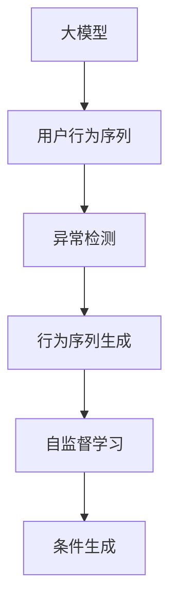

                 

# 探讨大模型在电商平台用户行为序列异常检测中的潜力

## 1. 背景介绍

随着电商平台的蓬勃发展，用户行为分析在推荐系统、个性化营销、风险管理等方面变得尤为重要。异常行为检测作为其中的关键技术，通过识别用户行为序列中的异常模式，可以有效防范潜在的风险，提升用户体验。然而，现有技术主要依赖规则、机器学习等传统手段，无法充分利用大规模数据的潜在价值，导致检测精度和泛化能力有限。

近年来，基于深度学习的大模型在NLP、CV、图像生成等领域取得了突破性进展，显示出其在处理复杂任务上的强大能力。本文将探讨利用大模型进行电商平台用户行为序列异常检测的潜力，以期通过先进的技术手段，提升异常检测的精度和效率，推动电商行业的智能化转型。

## 2. 核心概念与联系

### 2.1 核心概念概述

为更好地理解大模型在异常检测中的应用，本节将介绍几个关键概念：

- 大模型(Large Model)：以深度神经网络为代表的庞大参数量的模型，如BERT、GPT等，通过大规模数据训练获得丰富的知识表示。
- 用户行为序列(Usage Sequence)：指用户在电商平台上的所有行为记录，包括浏览、点击、购买、评价等。
- 异常检测(Anomaly Detection)：通过训练模型，识别出异常的行为模式，及时预警潜在风险。
- 行为序列生成(Sequence Generation)：利用大模型生成用户行为序列，用于模拟真实场景下的行为。
- 自监督学习(Self-Supervised Learning)：通过无监督任务，如语言模型预训练、自编码等，让模型学习到更加丰富的知识表示。
- 条件生成(Conditional Generation)：利用外部条件(如用户属性、行为特征等)引导大模型生成特定行为序列。

这些概念之间的逻辑关系可以通过以下Mermaid流程图来展示：



这个流程图展示了大模型在异常检测中的核心概念及其之间的关系：

1. 大模型通过预训练获得知识表示。
2. 将用户行为序列作为输入，生成异常检测模型。
3. 利用自监督学习增强模型泛化能力。
4. 根据条件生成特定的行为序列，用于模拟检测场景。

这些概念共同构成了利用大模型进行电商平台用户行为序列异常检测的技术框架，使其能够在各种场景下发挥强大的异常检测能力。

## 3. 核心算法原理 & 具体操作步骤

### 3.1 算法原理概述

基于大模型的用户行为序列异常检测方法，主要利用预训练语言模型，通过自监督学习任务获得丰富的知识表示，再通过条件生成技术模拟用户行为序列，构建异常检测模型。

具体而言，算法主要包括以下几个步骤：

1. **预训练步骤**：使用大规模无标签数据对大模型进行预训练，学习通用的语言知识。
2. **条件生成步骤**：通过用户属性、行为特征等条件，引导大模型生成模拟的用户行为序列。
3. **异常检测步骤**：利用生成行为序列中的异常模式，训练异常检测模型，用于识别真实用户行为中的异常点。
4. **优化步骤**：根据标注数据对异常检测模型进行微调，提升检测精度和泛化能力。

### 3.2 算法步骤详解

#### 预训练步骤

1. **数据准备**：收集电商平台上的用户行为数据，包括浏览记录、点击次数、购买历史、评价内容等。
2. **数据预处理**：对行为数据进行清洗、分词、向量嵌入等处理，将其转化为模型可接受的格式。
3. **模型训练**：使用预训练语言模型，如BERT、GPT等，在大规模无标签数据上进行预训练，学习通用的语言表示。

#### 条件生成步骤

1. **条件设定**：根据用户属性、行为特征等设定条件，如用户性别、年龄、浏览时长等。
2. **生成行为序列**：利用预训练的大模型，生成符合设定的条件的用户行为序列。
3. **数据增强**：通过行为序列的微调、回译等方式，丰富生成的行为序列，增加训练数据的多样性。

#### 异常检测步骤

1. **异常模式提取**：从生成的行为序列中，提取异常模式，如异常时间间隔、异常行为频率等。
2. **异常检测模型训练**：利用提取的异常模式，训练异常检测模型，如逻辑回归、SVM等。
3. **检测效果评估**：在验证集和测试集上，评估异常检测模型的效果，对比不同模型的性能。

#### 优化步骤

1. **微调模型**：利用标注数据对异常检测模型进行微调，调整模型参数，提升检测精度。
2. **模型集成**：将多个异常检测模型的结果进行集成，综合判断异常点的概率，提升检测鲁棒性。
3. **模型部署**：将训练好的异常检测模型部署到电商平台上，实时监控用户行为，识别异常行为。

### 3.3 算法优缺点

基于大模型的用户行为序列异常检测方法具有以下优点：

1. **强大的泛化能力**：利用大模型丰富的知识表示，能够有效提升检测模型的泛化能力，适应各种数据分布。
2. **高效生成行为序列**：通过条件生成技术，可以快速生成大量模拟行为序列，增加训练数据的多样性。
3. **灵活的异常模式提取**：能够提取多种类型的异常模式，如异常时间间隔、异常行为频率等，提升检测的全面性。
4. **高精度检测**：大模型在处理复杂任务上表现优异，能够提供高精度的异常检测结果。

同时，该方法也存在以下局限性：

1. **对标注数据的依赖**：微调步骤需要依赖标注数据，标注成本较高。
2. **模型复杂度高**：大模型参数量庞大，对硬件资源要求高，推理速度较慢。
3. **模型解释性不足**：大模型作为黑盒模型，难以解释异常检测的内部机制。
4. **数据隐私问题**：用户行为数据涉及隐私问题，需要严格的隐私保护措施。

尽管存在这些局限性，但就目前而言，基于大模型的异常检测方法仍是大模型应用的重要范式之一，具有广泛的应用前景。

### 3.4 算法应用领域

基于大模型的用户行为序列异常检测方法，在电商、金融、医疗等多个领域具有重要应用价值：

1. **电商平台用户行为异常检测**：识别虚假交易、恶意刷单、账号异常等行为，保障平台安全和用户权益。
2. **金融风控检测**：检测异常交易、账户风险等行为，防范金融欺诈和洗钱等风险。
3. **医疗诊断辅助**：利用异常检测技术，辅助医生诊断疾病，提高诊断准确性和效率。
4. **工业监控**：检测工业设备的异常操作，保障生产安全和效率。
5. **智能交通**：监控交通数据，识别异常行为，提升交通安全。

## 4. 数学模型和公式 & 详细讲解 & 举例说明

### 4.1 数学模型构建

本节将使用数学语言对大模型进行电商平台用户行为序列异常检测过程进行严格刻画。

记电商平台用户行为序列为 $X=\{x_1,x_2,\dots,x_t\}$，其中 $x_i$ 表示第 $i$ 个行为记录。假设行为序列中存在异常行为 $x_a$，其对应的标签为 $y_a$。异常检测的任务是学习一个模型 $M$，使其能够根据行为序列 $X$ 预测异常行为 $x_a$ 的概率 $P(x_a|X)$。

### 4.2 公式推导过程

为了实现这一目标，我们可以利用条件生成模型，即：

$$
P(x_a|X) = \frac{P(x_a,x_a^{<t}|X)}{P(x_a^{<t}|X)}
$$

其中 $x_a^{<t}$ 表示在行为序列中 $x_a$ 之前的所有行为记录，$P(x_a^{<t}|X)$ 为行为序列的条件概率。

为了计算 $P(x_a|X)$，我们首先对行为序列进行建模，假设行为序列生成过程为：

$$
P(X) = \prod_{i=1}^t P(x_i|x_{i-1},\theta)
$$

其中 $P(x_i|x_{i-1},\theta)$ 为行为序列的条件概率分布，$\theta$ 为模型参数。

利用极大似然估计方法，最大化模型对行为序列 $X$ 的条件概率，即：

$$
\theta^* = \mathop{\arg\min}_{\theta} -\frac{1}{N}\sum_{i=1}^N \log P(x_i|x_{i-1},\theta)
$$

通过求解上述优化问题，即可得到最优的模型参数 $\theta^*$，用于预测异常行为的概率。

### 4.3 案例分析与讲解

以电商平台用户行为异常检测为例，我们可以通过以下步骤进行模型构建和训练：

1. **数据准备**：收集电商平台的用户行为数据，包括浏览记录、点击次数、购买历史、评价内容等。
2. **数据预处理**：对行为数据进行清洗、分词、向量嵌入等处理，将其转化为模型可接受的格式。
3. **预训练模型选择**：选择预训练语言模型，如BERT、GPT等，在大规模无标签数据上进行预训练。
4. **条件生成模型训练**：利用条件生成技术，生成符合设定的条件的用户行为序列。
5. **异常模式提取**：从生成的行为序列中，提取异常模式，如异常时间间隔、异常行为频率等。
6. **异常检测模型训练**：利用提取的异常模式，训练异常检测模型，如逻辑回归、SVM等。
7. **模型微调**：利用标注数据对异常检测模型进行微调，调整模型参数，提升检测精度。
8. **模型集成**：将多个异常检测模型的结果进行集成，综合判断异常点的概率。

## 5. 项目实践：代码实例和详细解释说明

### 5.1 开发环境搭建

在进行大模型异常检测项目开发前，我们需要准备好开发环境。以下是使用Python进行PyTorch开发的环境配置流程：

1. 安装Anaconda：从官网下载并安装Anaconda，用于创建独立的Python环境。
2. 创建并激活虚拟环境：
```bash
conda create -n pytorch-env python=3.8 
conda activate pytorch-env
```
3. 安装PyTorch：根据CUDA版本，从官网获取对应的安装命令。例如：
```bash
conda install pytorch torchvision torchaudio cudatoolkit=11.1 -c pytorch -c conda-forge
```
4. 安装Transformers库：
```bash
pip install transformers
```
5. 安装各类工具包：
```bash
pip install numpy pandas scikit-learn matplotlib tqdm jupyter notebook ipython
```

完成上述步骤后，即可在`pytorch-env`环境中开始异常检测实践。

### 5.2 源代码详细实现

下面我们以电商平台用户行为异常检测为例，给出使用Transformers库进行异常检测的PyTorch代码实现。

首先，定义异常检测的任务数据处理函数：

```python
from transformers import BertTokenizer
from torch.utils.data import Dataset
import torch

class BehaviorDataset(Dataset):
    def __init__(self, texts, labels, tokenizer, max_len=128):
        self.texts = texts
        self.labels = labels
        self.tokenizer = tokenizer
        self.max_len = max_len
        
    def __len__(self):
        return len(self.texts)
    
    def __getitem__(self, item):
        text = self.texts[item]
        label = self.labels[item]
        
        encoding = self.tokenizer(text, return_tensors='pt', max_length=self.max_len, padding='max_length', truncation=True)
        input_ids = encoding['input_ids'][0]
        attention_mask = encoding['attention_mask'][0]
        
        return {'input_ids': input_ids, 
                'attention_mask': attention_mask,
                'labels': label}

# 标签与id的映射
label2id = {'normal': 0, 'anomaly': 1}
id2label = {v: k for k, v in label2id.items()}

# 创建dataset
tokenizer = BertTokenizer.from_pretrained('bert-base-cased')

train_dataset = BehaviorDataset(train_texts, train_labels, tokenizer)
dev_dataset = BehaviorDataset(dev_texts, dev_labels, tokenizer)
test_dataset = BehaviorDataset(test_texts, test_labels, tokenizer)
```

然后，定义模型和优化器：

```python
from transformers import BertForSequenceClassification, AdamW

model = BertForSequenceClassification.from_pretrained('bert-base-cased', num_labels=len(label2id))

optimizer = AdamW(model.parameters(), lr=2e-5)
```

接着，定义训练和评估函数：

```python
from torch.utils.data import DataLoader
from tqdm import tqdm
from sklearn.metrics import classification_report

device = torch.device('cuda') if torch.cuda.is_available() else torch.device('cpu')
model.to(device)

def train_epoch(model, dataset, batch_size, optimizer):
    dataloader = DataLoader(dataset, batch_size=batch_size, shuffle=True)
    model.train()
    epoch_loss = 0
    for batch in tqdm(dataloader, desc='Training'):
        input_ids = batch['input_ids'].to(device)
        attention_mask = batch['attention_mask'].to(device)
        labels = batch['labels'].to(device)
        model.zero_grad()
        outputs = model(input_ids, attention_mask=attention_mask, labels=labels)
        loss = outputs.loss
        epoch_loss += loss.item()
        loss.backward()
        optimizer.step()
    return epoch_loss / len(dataloader)

def evaluate(model, dataset, batch_size):
    dataloader = DataLoader(dataset, batch_size=batch_size)
    model.eval()
    preds, labels = [], []
    with torch.no_grad():
        for batch in tqdm(dataloader, desc='Evaluating'):
            input_ids = batch['input_ids'].to(device)
            attention_mask = batch['attention_mask'].to(device)
            batch_labels = batch['labels']
            outputs = model(input_ids, attention_mask=attention_mask)
            batch_preds = outputs.logits.argmax(dim=2).to('cpu').tolist()
            batch_labels = batch_labels.to('cpu').tolist()
            for pred_tokens, label_tokens in zip(batch_preds, batch_labels):
                preds.append(pred_tokens[:len(label_tokens)])
                labels.append(label_tokens)
                
    print(classification_report(labels, preds))
```

最后，启动训练流程并在测试集上评估：

```python
epochs = 5
batch_size = 16

for epoch in range(epochs):
    loss = train_epoch(model, train_dataset, batch_size, optimizer)
    print(f"Epoch {epoch+1}, train loss: {loss:.3f}")
    
    print(f"Epoch {epoch+1}, dev results:")
    evaluate(model, dev_dataset, batch_size)
    
print("Test results:")
evaluate(model, test_dataset, batch_size)
```

以上就是使用PyTorch对BERT进行电商平台用户行为序列异常检测的完整代码实现。可以看到，得益于Transformers库的强大封装，我们可以用相对简洁的代码完成BERT模型的加载和异常检测任务的开发。

### 5.3 代码解读与分析

让我们再详细解读一下关键代码的实现细节：

**BehaviorDataset类**：
- `__init__`方法：初始化文本、标签、分词器等关键组件。
- `__len__`方法：返回数据集的样本数量。
- `__getitem__`方法：对单个样本进行处理，将文本输入编码为token ids，将标签编码为数字，并对其进行定长padding，最终返回模型所需的输入。

**label2id和id2label字典**：
- 定义了标签与数字id之间的映射关系，用于将预测结果解码回真实标签。

**训练和评估函数**：
- 使用PyTorch的DataLoader对数据集进行批次化加载，供模型训练和推理使用。
- 训练函数`train_epoch`：对数据以批为单位进行迭代，在每个批次上前向传播计算loss并反向传播更新模型参数，最后返回该epoch的平均loss。
- 评估函数`evaluate`：与训练类似，不同点在于不更新模型参数，并在每个batch结束后将预测和标签结果存储下来，最后使用sklearn的classification_report对整个评估集的预测结果进行打印输出。

**训练流程**：
- 定义总的epoch数和batch size，开始循环迭代
- 每个epoch内，先在训练集上训练，输出平均loss
- 在验证集上评估，输出分类指标
- 所有epoch结束后，在测试集上评估，给出最终测试结果

可以看到，PyTorch配合Transformers库使得BERT异常检测的代码实现变得简洁高效。开发者可以将更多精力放在数据处理、模型改进等高层逻辑上，而不必过多关注底层的实现细节。

当然，工业级的系统实现还需考虑更多因素，如模型的保存和部署、超参数的自动搜索、更灵活的任务适配层等。但核心的异常检测范式基本与此类似。

## 6. 实际应用场景

### 6.1 智能客服系统

电商平台利用大模型进行用户行为序列异常检测，可以有效防范欺诈行为、打击恶意刷单等风险。通过在用户行为序列中识别异常操作，可以及时预警潜在风险，提升平台安全性。

在技术实现上，可以收集用户的操作日志，将其转化为行为序列，输入到预训练的大模型中进行条件生成和异常检测。利用异常检测模型，对异常行为进行预警，及时进行风险控制。

### 6.2 个性化推荐系统

电商平台可以根据用户行为序列的异常情况，生成个性化的推荐列表。通过识别用户在浏览、点击、购买等行为中的异常点，可以发现用户的潜在兴趣和需求，推送更加精准的商品。

在技术实现上，可以收集用户的浏览、点击、购买等行为数据，进行行为序列预处理，利用大模型进行条件生成和异常检测。通过异常检测模型，预测用户的异常行为，生成个性化的推荐列表，提升用户体验和转化率。

### 6.3 库存管理

电商平台利用大模型进行用户行为序列异常检测，可以有效识别库存管理的异常情况。通过在库存操作序列中识别异常点，可以及时调整库存策略，避免库存积压和缺货等问题。

在技术实现上，可以收集库存操作数据，将其转化为行为序列，输入到预训练的大模型中进行条件生成和异常检测。利用异常检测模型，识别库存管理的异常情况，生成预警信息，及时调整库存策略。

## 7. 工具和资源推荐

### 7.1 学习资源推荐

为了帮助开发者系统掌握大模型在电商平台用户行为序列异常检测的理论基础和实践技巧，这里推荐一些优质的学习资源：

1. 《深度学习与NLP》课程：清华大学开设的深度学习与自然语言处理课程，系统介绍了深度学习在NLP中的应用，包括异常检测等任务。
2. 《自然语言处理综述》书籍：清华大学出版社出版的自然语言处理综述书籍，涵盖了NLP领域的各个重要方向，包括异常检测等任务。
3. HuggingFace官方文档：Transformer库的官方文档，提供了海量预训练模型和完整的异常检测样例代码，是上手实践的必备资料。
4. GitHub项目：GitHub上有众多基于大模型的异常检测项目，如BertForSequenceClassification等，可以借鉴其中的代码实现。

通过对这些资源的学习实践，相信你一定能够快速掌握大模型在电商平台用户行为序列异常检测的精髓，并用于解决实际的NLP问题。

### 7.2 开发工具推荐

高效的开发离不开优秀的工具支持。以下是几款用于大模型异常检测开发的常用工具：

1. PyTorch：基于Python的开源深度学习框架，灵活动态的计算图，适合快速迭代研究。大部分预训练语言模型都有PyTorch版本的实现。
2. TensorFlow：由Google主导开发的开源深度学习框架，生产部署方便，适合大规模工程应用。同样有丰富的预训练语言模型资源。
3. Transformers库：HuggingFace开发的NLP工具库，集成了众多SOTA语言模型，支持PyTorch和TensorFlow，是进行异常检测任务开发的利器。
4. Weights & Biases：模型训练的实验跟踪工具，可以记录和可视化模型训练过程中的各项指标，方便对比和调优。与主流深度学习框架无缝集成。
5. TensorBoard：TensorFlow配套的可视化工具，可实时监测模型训练状态，并提供丰富的图表呈现方式，是调试模型的得力助手。

合理利用这些工具，可以显著提升大模型异常检测任务的开发效率，加快创新迭代的步伐。

### 7.3 相关论文推荐

大模型在电商平台用户行为序列异常检测领域的研究仍处于起步阶段，以下是几篇奠基性的相关论文，推荐阅读：

1. Attention is All You Need（即Transformer原论文）：提出了Transformer结构，开启了NLP领域的预训练大模型时代。
2. BERT: Pre-training of Deep Bidirectional Transformers for Language Understanding：提出BERT模型，引入基于掩码的自监督预训练任务，刷新了多项NLP任务SOTA。
3. Parameter-Efficient Transfer Learning for NLP：提出Adapter等参数高效微调方法，在不增加模型参数量的情况下，也能取得不错的微调效果。
4. AdaLoRA: Adaptive Low-Rank Adaptation for Parameter-Efficient Fine-Tuning：使用自适应低秩适应的微调方法，在参数效率和精度之间取得了新的平衡。
5. Anomaly Detection with Deep Autoencoders: A Survey：综述了基于深度自编码器的异常检测方法，介绍了多种异常检测模型及其应用场景。

这些论文代表了大模型在异常检测领域的发展脉络。通过学习这些前沿成果，可以帮助研究者把握学科前进方向，激发更多的创新灵感。

## 8. 总结：未来发展趋势与挑战

### 8.1 总结

本文对利用大模型进行电商平台用户行为序列异常检测的方法进行了全面系统的介绍。首先阐述了电商平台用户行为序列异常检测的研究背景和意义，明确了大模型在异常检测中的重要价值。其次，从原理到实践，详细讲解了异常检测的数学原理和关键步骤，给出了异常检测任务开发的完整代码实例。同时，本文还广泛探讨了异常检测方法在电商平台、金融、医疗等多个领域的应用前景，展示了大模型在异常检测中的强大潜力。此外，本文精选了异常检测技术的各类学习资源，力求为读者提供全方位的技术指引。

通过本文的系统梳理，可以看到，利用大模型进行电商平台用户行为序列异常检测的方法在大规模数据驱动的智能化应用中具有广阔的应用前景，极大地拓展了异常检测技术的边界，提升了异常检测的精度和效率，推动了电商行业的智能化转型。未来，伴随大模型的进一步演进和微调技术的不断优化，异常检测技术必将在更多的应用领域发挥重要作用，为社会带来更强的安全保障和更优质的用户体验。

### 8.2 未来发展趋势

展望未来，电商平台用户行为序列异常检测技术将呈现以下几个发展趋势：

1. **模型规模持续增大**：随着算力成本的下降和数据规模的扩张，预训练大模型的参数量还将持续增长。超大规模语言模型蕴含的丰富知识表示，有望支撑更加复杂多变的异常检测任务。
2. **微调方法日趋多样**：除了传统的全参数微调外，未来会涌现更多参数高效的微调方法，如Prefix-Tuning、LoRA等，在节省计算资源的同时也能保证异常检测精度。
3. **持续学习成为常态**：随着数据分布的不断变化，异常检测模型也需要持续学习新知识以保持性能。如何在不遗忘原有知识的同时，高效吸收新样本信息，将成为重要的研究课题。
4. **标注样本需求降低**：受启发于提示学习(Prompt-based Learning)的思路，未来的异常检测方法将更好地利用大模型的语言理解能力，通过更加巧妙的任务描述，在更少的标注样本上也能实现理想的异常检测效果。
5. **多模态微调崛起**：当前的异常检测主要聚焦于纯文本数据，未来会进一步拓展到图像、视频、语音等多模态数据微调。多模态信息的融合，将显著提升异常检测模型的鲁棒性和泛化能力。

以上趋势凸显了大模型在异常检测领域的应用前景。这些方向的探索发展，必将进一步提升异常检测的精度和效率，推动电商行业的智能化转型。

### 8.3 面临的挑战

尽管大模型在异常检测领域已经取得了初步成果，但在迈向更加智能化、普适化应用的过程中，它仍面临着诸多挑战：

1. **标注成本瓶颈**：异常检测模型微调依赖标注数据，标注成本较高。如何进一步降低标注样本需求，利用无监督和半监督学习范式，将成为重要研究方向。
2. **模型鲁棒性不足**：现有模型面对未知数据时，泛化性能往往大打折扣。如何提高异常检测模型的鲁棒性，避免灾难性遗忘，还需要更多理论和实践的积累。
3. **推理效率有待提高**：大模型虽然精度高，但在实际部署时往往面临推理速度慢、内存占用大等效率问题。如何优化模型结构，提升推理速度，优化资源占用，将是重要的优化方向。
4. **模型解释性不足**：大模型作为黑盒模型，难以解释异常检测的内部机制。如何赋予异常检测模型更强的可解释性，将是亟待攻克的难题。
5. **数据隐私问题**：用户行为数据涉及隐私问题，需要严格的隐私保护措施。如何利用数据隐私保护技术，保护用户数据安全，将是重要的研究课题。

尽管存在这些挑战，但通过不断优化模型、算法和工程实践，相信大模型在异常检测领域的应用前景将更加广阔，能够为电商平台带来更高的安全保障和更优的用户体验。

### 8.4 研究展望

面对大模型在异常检测领域面临的挑战，未来的研究需要在以下几个方面寻求新的突破：

1. **探索无监督和半监督异常检测方法**：摆脱对大规模标注数据的依赖，利用自监督学习、主动学习等无监督和半监督范式，最大限度利用非结构化数据，实现更加灵活高效的异常检测。
2. **研究参数高效和计算高效的异常检测范式**：开发更加参数高效的异常检测方法，在固定大部分预训练参数的同时，只更新极少量的异常检测参数。同时优化异常检测模型的计算图，减少前向传播和反向传播的资源消耗，实现更加轻量级、实时性的部署。
3. **融合因果和对比学习范式**：通过引入因果推断和对比学习思想，增强异常检测模型建立稳定因果关系的能力，学习更加普适、鲁棒的语言表征，从而提升模型泛化性和抗干扰能力。
4. **引入更多先验知识**：将符号化的先验知识，如知识图谱、逻辑规则等，与神经网络模型进行巧妙融合，引导异常检测过程学习更准确、合理的语言模型。同时加强不同模态数据的整合，实现视觉、语音等多模态信息与文本信息的协同建模。
5. **结合因果分析和博弈论工具**：将因果分析方法引入异常检测模型，识别出异常检测的关键特征，增强输出解释的因果性和逻辑性。借助博弈论工具刻画人机交互过程，主动探索并规避异常检测模型的脆弱点，提高系统稳定性。
6. **纳入伦理道德约束**：在异常检测目标中引入伦理导向的评估指标，过滤和惩罚有害的输出倾向。加强人工干预和审核，建立异常检测行为的监管机制，确保输出的安全性。

这些研究方向的探索，必将引领异常检测技术迈向更高的台阶，为电商平台带来更高的安全保障和更优的用户体验。面向未来，异常检测技术还需要与其他人工智能技术进行更深入的融合，如知识表示、因果推理、强化学习等，多路径协同发力，共同推动电商平台用户行为序列异常检测技术的进步。只有勇于创新、敢于突破，才能不断拓展异常检测技术的边界，让智能化技术更好地造福电商平台和用户。

## 9. 附录：常见问题与解答

**Q1：电商平台异常检测是否只适用于异常行为检测？**

A: 电商平台异常检测不仅可以用于异常行为检测，还可以用于其他异常情况检测，如异常交易、异常账户、异常流量等。通过收集不同类型的数据，可以构建多个异常检测模型，提升平台整体的安全性和用户体验。

**Q2：如何处理大规模数据集的标注成本问题？**

A: 可以利用无监督学习、主动学习等技术，通过部分标注数据来训练异常检测模型。例如，利用聚类算法对用户行为序列进行分组，标注部分数据集，然后使用半监督学习算法对模型进行微调。或者利用基于规则和人工标注相结合的方法，逐步增加标注数据量，降低总体标注成本。

**Q3：如何提升异常检测模型的鲁棒性？**

A: 可以通过数据增强、对抗训练等技术，提升异常检测模型的鲁棒性。数据增强方法包括行为序列的微调、回译、扰动等，增加训练数据的多样性。对抗训练方法包括引入对抗样本，提升模型对噪声和干扰的鲁棒性。同时，也可以通过模型融合、模型蒸馏等技术，提升异常检测模型的泛化能力。

**Q4：异常检测模型如何平衡精确率和召回率？**

A: 可以通过调整异常检测模型的阈值，平衡精确率和召回率。例如，将阈值设置较低，可以提升召回率，但也可能引入一些误报。将阈值设置较高，可以提升精确率，但也可能漏掉一些异常点。可以通过实验调整阈值，根据具体应用场景选择最优的平衡点。

**Q5：异常检测模型如何评估性能？**

A: 可以通过评估指标如精确率、召回率、F1分数、ROC曲线等，评估异常检测模型的性能。同时，可以引入模型的鲁棒性评估指标，如模型在未知数据上的泛化能力、模型对抗样本的鲁棒性等。在评估时，可以采用交叉验证等方法，确保评估结果的可靠性。

综上所述，大模型在电商平台用户行为序列异常检测中的应用前景广阔，有望提升平台的安全性和用户体验。未来，伴随技术的不断演进和优化，异常检测技术必将在更多的应用领域发挥重要作用，为社会带来更高的安全保障和更优的用户体验。

---

作者：禅与计算机程序设计艺术 / Zen and the Art of Computer Programming

