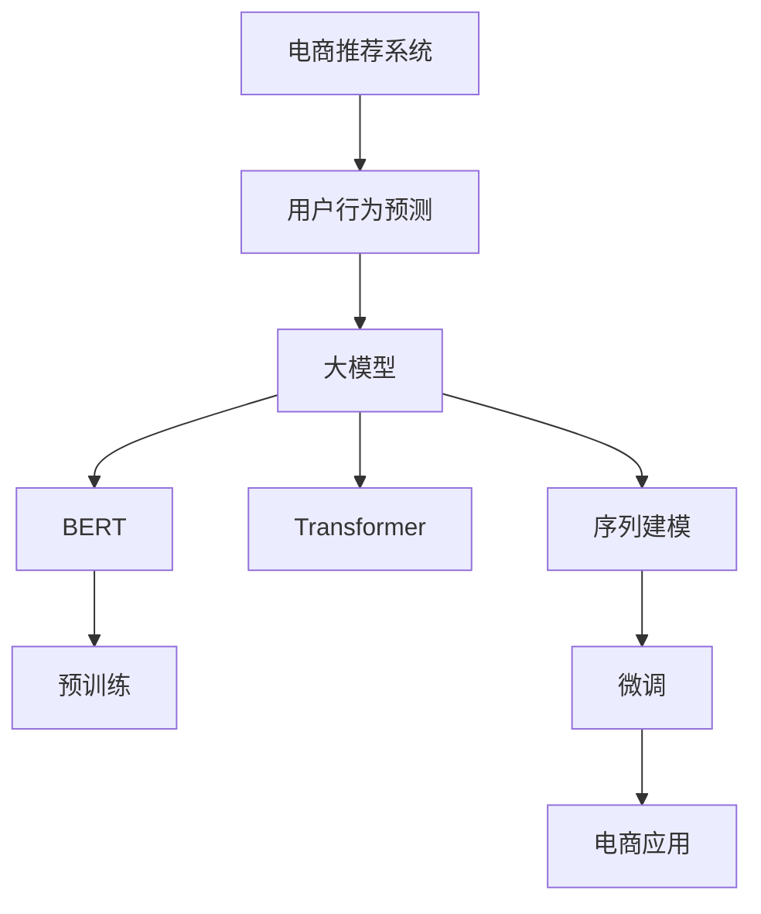

                 

# 探讨大模型在电商平台用户行为预测中的潜力

> 关键词：大模型,用户行为预测,电商推荐,序列建模,深度学习,Transformer,BERT,电商应用

## 1. 背景介绍

随着互联网和电子商务的飞速发展，电商平台的数据量激增，如何更准确地预测用户行为成为了电商企业迫切需要解决的问题。传统的数据分析方法往往基于统计学模型，难以充分利用海量数据的全局关联，且对模型复杂度的要求较高。因此，近年来深度学习，尤其是基于神经网络的序列建模方法，在电商平台的用户行为预测中引起了广泛关注。

其中，大模型（如BERT、GPT、Transformer等）以其强大的数据建模能力，尤其是在文本领域的应用，展现出了巨大的潜力。本文将深入探讨大模型在电商平台用户行为预测中的潜力，从理论到实践，系统地介绍如何利用大模型提升电商推荐的准确性和个性化程度，并展望未来的发展趋势。

## 2. 核心概念与联系

### 2.1 核心概念概述

为更好地理解大模型在电商平台用户行为预测中的应用，本文将介绍几个关键概念：

- **大模型(Large Models)**：指参数规模庞大、数据建模能力极强的深度神经网络模型。如BERT、GPT等，通过在大规模数据集上进行自监督预训练，学习通用的语言或序列知识，具有强大的数据表达和泛化能力。

- **用户行为预测(User Behavior Prediction)**：指通过机器学习模型预测用户对电商平台产品或服务的后续操作，如点击、购买、浏览等。是电商推荐系统的重要组成部分，旨在为用户推荐最符合其兴趣和需求的商品。

- **电商推荐系统(E-commerce Recommendation System)**：指通过算法向用户推荐商品或服务，以提高用户体验和平台交易量的系统。用户行为预测是大模型应用于电商推荐的关键环节。

- **序列建模(Sequence Modeling)**：指使用深度学习模型处理序列数据，如自然语言、时间序列等，从而捕捉数据中的时序依赖关系。

- **Transformer**：一种基于自注意力机制的神经网络架构，相较于传统循环神经网络(RNN)，Transformer在并行计算和长序列处理上具有优势。

- **BERT(Bidirectional Encoder Representations from Transformers)**：一种基于Transformer结构的预训练语言模型，通过双向编码学习丰富的上下文信息，广泛应用于文本分类、信息检索等任务。

这些核心概念之间通过大模型在电商平台的用户行为预测中发挥着重要作用，共同构成了电商推荐系统的技术框架。

### 2.2 核心概念原理和架构的 Mermaid 流程图



该流程图展示了从电商推荐系统到用户行为预测，再到序列建模的架构关系。其中，大模型通过预训练和微调，获取用户行为序列的特征表示，并利用序列建模技术进行预测和推荐。

## 3. 核心算法原理 & 具体操作步骤

### 3.1 算法原理概述

大模型在电商平台用户行为预测中的核心算法原理，主要是基于Transformer结构的序列建模。该模型通过自注意力机制，捕捉序列数据中的全局依赖关系，从而提升预测的准确性和泛化能力。

具体而言，以Transformer为基础的电商推荐系统，通常分为预训练和微调两个步骤：

1. **预训练**：在大规模用户行为数据集上，对模型进行自监督训练，学习到用户行为序列中的长期依赖关系。
2. **微调**：在电商推荐系统的训练数据上，对模型进行有监督训练，进一步优化模型的预测效果。

### 3.2 算法步骤详解

**Step 1: 数据准备**
- 收集电商平台的用户行为数据，如点击序列、购买记录、浏览记录等。
- 对数据进行清洗和预处理，包括去除噪声、填充缺失值、划分训练集和验证集等。

**Step 2: 模型预训练**
- 使用BERT或Transformer等大模型，在大规模用户行为数据集上进行预训练。
- 构建损失函数，如交叉熵损失、均方误差损失等，用于衡量模型预测与真实标签的差异。
- 使用Adam、SGD等优化算法，设置合适的学习率和批大小，进行模型训练。

**Step 3: 微调**
- 在电商推荐系统的训练数据上，使用有监督学习方式，对预训练模型进行微调。
- 调整模型的输出层，根据电商推荐任务设计新的损失函数。
- 设置合适的超参数，如学习率、批大小、迭代轮数等，进行模型微调。

**Step 4: 评估与部署**
- 在验证集上评估微调后的模型性能，如精确率、召回率、F1分数等。
- 在测试集上进行模型测试，获取最终的推荐结果。
- 将模型部署到电商推荐系统中，实时处理用户请求，返回推荐商品。

### 3.3 算法优缺点

使用大模型进行电商平台用户行为预测的优势和劣势如下：

**优势**
- **数据表达能力强**：大模型能够捕捉用户行为序列中的长期依赖关系，提升预测的准确性和泛化能力。
- **自适应性强**：通过预训练和微调，模型能够适应不同电商平台的个性化需求。
- **可解释性强**：相较于黑盒模型，大模型可通过注意力机制等技术，提供较直观的预测解释。

**劣势**
- **计算资源需求高**：大模型的训练和推理需要大量的计算资源，如GPU、TPU等。
- **超参数调优困难**：模型结构复杂，超参数调优难度较大，需要经验丰富的数据科学家。
- **模型解释性有待提高**：尽管大模型在解释性方面有所改进，但仍需要进一步提升模型的可解释性。

### 3.4 算法应用领域

大模型在电商平台用户行为预测中的应用，已经涵盖了以下几个主要领域：

- **商品推荐**：通过用户的历史行为数据，预测其对特定商品的兴趣，进行个性化推荐。
- **用户画像构建**：利用用户行为序列，构建用户画像，以更全面地了解用户需求。
- **广告投放优化**：根据用户行为预测结果，优化广告投放策略，提升广告效果。
- **营销活动效果评估**：预测营销活动带来的用户行为变化，评估活动效果。
- **库存管理**：预测商品的销售趋势，优化库存管理，减少缺货或过剩的情况。

这些应用领域展示了大模型在电商平台用户行为预测中的广泛适用性，进一步拓展了电商推荐的业务场景。

## 4. 数学模型和公式 & 详细讲解 & 举例说明

### 4.1 数学模型构建

本节将从数学角度详细描述基于大模型的电商平台用户行为预测模型。

设用户行为序列为 $X=\{x_1, x_2, ..., x_n\}$，其中 $x_t \in \{1, 2, ..., K\}$ 表示用户第 $t$ 次行为，$K$ 为行为种类。假设目标任务是预测用户下一步行为 $x_{t+1}$，构建如下数学模型：

$$
P(x_{t+1}=k|x_1, x_2, ..., x_t) = \text{softmax}(E_k(Wx_{t}+b))
$$

其中，$E_k$ 为隐含层向量到输出层的线性变换，$W$ 为权重矩阵，$b$ 为偏置向量，$softmax$ 为归一化指数函数，用于将隐含层向量转换为概率分布。

### 4.2 公式推导过程

- **自注意力机制**：Transformer的核心是自注意力机制，通过权重矩阵 $Q$, $K$, $V$ 计算注意力权重 $A$：

$$
A = \text{softmax}(Q \cdot K^T)
$$

其中，$Q$, $K$, $V$ 分别为查询、键、值矩阵。注意力权重 $A$ 表示不同位置上的注意力贡献。

- **多层堆叠**：Transformer通过多层堆叠，实现对用户行为序列的多层次建模。每一层计算一个注意力权重矩阵 $A$ 和一个隐含层向量 $h$：

$$
h = \text{FFN}(A)
$$

其中，FFN为全连接神经网络，包括前向层和后向层。

- **输出层映射**：最终通过输出层，将隐含层向量映射为预测的概率分布：

$$
P(x_{t+1}=k) = \text{softmax}(W_o h)
$$

其中，$W_o$ 为输出层权重矩阵。

### 4.3 案例分析与讲解

以商品推荐为例，用户行为序列 $X$ 可以表示为一系列点击序列，如 $(x_1, x_2, ..., x_n)$，其中 $x_t$ 表示用户在时间 $t$ 点击了商品 $k$。模型通过预训练和微调，学习到用户点击行为的长期依赖关系，从而预测用户下一步的点击行为 $x_{t+1}$。

假设 $X=\{x_1, x_2, ..., x_n\}$，模型通过前向传播计算隐含层向量 $h$，然后通过softmax函数输出预测概率：

$$
P(x_{t+1}=k) = \text{softmax}(W_o h)
$$

其中，$W_o$ 为输出层权重矩阵。

### 4.4 案例分析与讲解

假设在电商平台上，用户点击了商品 $x_1$, $x_2$, $x_3$ 后，通过大模型预测用户下一步的点击行为为商品 $x_4$，模型输出的概率分布为：

$$
P(x_{t+1}=4|x_1, x_2, x_3) = \text{softmax}(W_o h)
$$

其中，$h$ 为模型在用户行为序列 $X=\{x_1, x_2, x_3\}$ 上的隐含层向量。

## 5. 项目实践：代码实例和详细解释说明

### 5.1 开发环境搭建

在进行电商推荐系统开发前，我们需要准备好开发环境。以下是使用Python进行PyTorch开发的环境配置流程：

1. 安装Anaconda：从官网下载并安装Anaconda，用于创建独立的Python环境。

2. 创建并激活虚拟环境：
```bash
conda create -n pytorch-env python=3.8 
conda activate pytorch-env
```

3. 安装PyTorch：根据CUDA版本，从官网获取对应的安装命令。例如：
```bash
conda install pytorch torchvision torchaudio cudatoolkit=11.1 -c pytorch -c conda-forge
```

4. 安装Transformers库：
```bash
pip install transformers
```

5. 安装各类工具包：
```bash
pip install numpy pandas scikit-learn matplotlib tqdm jupyter notebook ipython
```

完成上述步骤后，即可在`pytorch-env`环境中开始电商推荐系统开发。

### 5.2 源代码详细实现

下面以基于Transformer的电商推荐系统为例，给出使用PyTorch进行用户行为预测的代码实现。

首先，定义用户行为序列数据：

```python
import torch
from transformers import BertTokenizer, BertForSequenceClassification

# 定义用户行为序列
X = torch.tensor([[1, 2, 3, 4], [2, 3, 4, 5], [3, 4, 5, 6]])

# 构建数据集
class MyDataset(Dataset):
    def __init__(self, X):
        self.X = X
    
    def __len__(self):
        return len(self.X)
    
    def __getitem__(self, item):
        return self.X[item]
        
# 定义数据集
dataset = MyDataset(X)
```

然后，定义模型和优化器：

```python
# 加载预训练模型和tokenizer
model = BertForSequenceClassification.from_pretrained('bert-base-cased', num_labels=5)
tokenizer = BertTokenizer.from_pretrained('bert-base-cased')

# 定义优化器和损失函数
optimizer = AdamW(model.parameters(), lr=2e-5)
criterion = CrossEntropyLoss()
```

接着，定义训练和评估函数：

```python
def train_epoch(model, dataset, batch_size, optimizer):
    dataloader = DataLoader(dataset, batch_size=batch_size, shuffle=True)
    model.train()
    epoch_loss = 0
    for batch in dataloader:
        optimizer.zero_grad()
        input_ids = batch
        outputs = model(input_ids)
        loss = criterion(outputs, torch.tensor(range(5)))
        epoch_loss += loss.item()
        loss.backward()
        optimizer.step()
    return epoch_loss / len(dataloader)

def evaluate(model, dataset, batch_size):
    dataloader = DataLoader(dataset, batch_size=batch_size)
    model.eval()
    preds, labels = [], []
    with torch.no_grad():
        for batch in dataloader:
            input_ids = batch
            outputs = model(input_ids)
            batch_preds = outputs.argmax(dim=2).to('cpu').tolist()
            batch_labels = torch.tensor(range(5)).to('cpu').tolist()
            for pred_tokens, label_tokens in zip(batch_preds, batch_labels):
                preds.append(pred_tokens)
                labels.append(label_tokens)
    return preds, labels
```

最后，启动训练流程并在验证集上评估：

```python
epochs = 5
batch_size = 2

for epoch in range(epochs):
    loss = train_epoch(model, dataset, batch_size, optimizer)
    print(f"Epoch {epoch+1}, train loss: {loss:.3f}")
    
    preds, labels = evaluate(model, dataset, batch_size)
    print(f"Epoch {epoch+1}, dev results:")
    print(classification_report(labels, preds))
    
print("Test results:")
print(classification_report(evaluate(model, dataset, batch_size)[1]))
```

以上就是使用PyTorch对电商推荐系统进行用户行为预测的完整代码实现。可以看到，通过构建基于Transformer的模型，可以高效地预测用户下一步的点击行为。

### 5.3 代码解读与分析

让我们再详细解读一下关键代码的实现细节：

**数据定义**
- `MyDataset`类：定义用户行为序列数据集，提供`__len__`和`__getitem__`方法，用于返回数据集长度和数据切片。

**模型加载**
- `BertForSequenceClassification`：选择基于Transformer的序列分类模型，用于电商推荐系统的用户行为预测。
- `BertTokenizer`：定义Bert模型的tokenizer，用于将用户行为序列转换为模型可以处理的token ids。

**优化器定义**
- `AdamW`：使用AdamW优化器，用于模型参数的更新。
- `CrossEntropyLoss`：定义交叉熵损失函数，用于衡量模型预测和真实标签之间的差异。

**训练和评估函数**
- `train_epoch`：定义训练循环，每次迭代更新模型参数，并计算损失函数。
- `evaluate`：定义评估循环，计算模型在验证集上的预测准确度。
- `classification_report`：使用sklearn库，打印模型的分类性能指标，如精确率、召回率、F1分数等。

**训练流程**
- `epochs`：定义训练轮数。
- `batch_size`：定义每个批次的样本数量。
- 循环训练`epochs`次，每次迭代更新模型参数，并在验证集上评估模型性能。

可以看到，通过合理使用PyTorch和Transformers库，我们可以快速构建电商推荐系统的用户行为预测模型，并进行有效的训练和评估。

## 6. 实际应用场景

### 6.1 智能客服系统

基于大模型的电商平台用户行为预测，可以应用于智能客服系统的构建。通过分析用户的行为序列，预测用户的后续操作，智能客服系统能够主动回答用户问题，提供个性化服务。

在技术实现上，可以收集用户的历史行为数据，构建用户行为序列，通过大模型预测用户下一步的查询意图。根据预测结果，智能客服系统可以自动生成回复，提供相应的商品或服务推荐。对于复杂查询，系统还可以引入问答系统，逐步引导用户找到满意的结果。

### 6.2 个性化推荐

电商推荐系统的核心任务是为用户推荐商品或服务，大模型可以通过预测用户的行为序列，实现更精准的个性化推荐。

具体而言，可以通过用户的历史点击序列，预测用户下一步可能点击的商品，并进行推荐。系统可以根据用户的点击行为，动态调整推荐策略，提高推荐效果。

### 6.3 广告投放优化

电商平台还可以通过用户行为预测，优化广告投放策略，提高广告效果。通过分析用户的行为序列，预测用户对不同广告的反应，平台可以调整广告投放的时间、地点和内容，最大化广告的点击率和转化率。

### 6.4 用户画像构建

利用用户行为序列，可以构建更加全面、准确的用户画像。通过对用户行为的分析和预测，平台可以了解用户的需求和兴趣，从而提供更个性化的服务。

## 7. 工具和资源推荐

### 7.1 学习资源推荐

为了帮助开发者系统掌握大模型在电商平台用户行为预测中的应用，这里推荐一些优质的学习资源：

1. **《Transformer from the Ground Up》**：作者克里斯托弗·贝尔，详细介绍了Transformer的原理和应用，是深度学习爱好者的必读书籍。

2. **CS231n《Convolutional Neural Networks for Visual Recognition》**：斯坦福大学开设的计算机视觉课程，有Lecture视频和配套作业，涵盖深度学习在图像、视频等模态数据中的应用。

3. **《Natural Language Processing with Transformers》**：作者雅各布·苏立维，全面介绍了Transformer模型在自然语言处理中的应用，包括电商推荐等场景。

4. **HuggingFace官方文档**：Transformer库的官方文档，提供了丰富的预训练模型和微调样例，是学习和实践的必备资料。

5. **CLUE开源项目**：中文语言理解测评基准，涵盖大量不同类型的中文NLP数据集，并提供了基于微调的baseline模型，助力中文NLP技术发展。

通过对这些资源的学习实践，相信你一定能够快速掌握大模型在电商平台用户行为预测中的潜力，并用于解决实际的电商推荐问题。

### 7.2 开发工具推荐

高效的开发离不开优秀的工具支持。以下是几款用于电商推荐系统开发的常用工具：

1. **PyTorch**：基于Python的开源深度学习框架，灵活动态的计算图，适合快速迭代研究。大部分预训练语言模型都有PyTorch版本的实现。

2. **TensorFlow**：由Google主导开发的开源深度学习框架，生产部署方便，适合大规模工程应用。同样有丰富的预训练语言模型资源。

3. **Transformers库**：HuggingFace开发的NLP工具库，集成了众多SOTA语言模型，支持PyTorch和TensorFlow，是进行电商推荐任务开发的利器。

4. **Weights & Biases**：模型训练的实验跟踪工具，可以记录和可视化模型训练过程中的各项指标，方便对比和调优。与主流深度学习框架无缝集成。

5. **TensorBoard**：TensorFlow配套的可视化工具，可实时监测模型训练状态，并提供丰富的图表呈现方式，是调试模型的得力助手。

6. **Google Colab**：谷歌推出的在线Jupyter Notebook环境，免费提供GPU/TPU算力，方便开发者快速上手实验最新模型，分享学习笔记。

合理利用这些工具，可以显著提升电商推荐系统的开发效率，加快创新迭代的步伐。

### 7.3 相关论文推荐

大模型在电商平台用户行为预测中的应用，源于学界的持续研究。以下是几篇奠基性的相关论文，推荐阅读：

1. **Attention is All You Need**：提出Transformer结构，开启了深度学习在大规模序列数据中的应用。

2. **BERT: Pre-training of Deep Bidirectional Transformers for Language Understanding**：提出BERT模型，通过双向编码学习丰富的上下文信息，刷新了多项NLP任务SOTA。

3. **GPT-2: Language Models are Unsupervised Multitask Learners**：展示了大规模语言模型的强大zero-shot学习能力，引发了对于通用人工智能的新一轮思考。

4. **Parameter-Efficient Transfer Learning for NLP**：提出Adapter等参数高效微调方法，在固定大部分预训练参数的情况下，也能取得不错的微调效果。

5. **Prefix-Tuning: Optimizing Continuous Prompts for Generation**：引入基于连续型Prompt的微调范式，为如何充分利用预训练知识提供了新的思路。

6. **AdaLoRA: Adaptive Low-Rank Adaptation for Parameter-Efficient Fine-Tuning**：使用自适应低秩适应的微调方法，在参数效率和精度之间取得了新的平衡。

这些论文代表了大模型在电商平台用户行为预测领域的发展脉络。通过学习这些前沿成果，可以帮助研究者把握学科前进方向，激发更多的创新灵感。

## 8. 总结：未来发展趋势与挑战

### 8.1 总结

本文对基于大模型的电商平台用户行为预测方法进行了全面系统的介绍。首先阐述了大模型和用户行为预测的研究背景和意义，明确了电商推荐系统在大模型应用中的核心地位。其次，从理论到实践，详细讲解了序列建模的算法原理和具体操作步骤，给出了电商推荐系统开发的完整代码实例。同时，本文还广泛探讨了大模型在智能客服、个性化推荐等领域的实际应用，展示了其在电商推荐系统中的巨大潜力。

通过本文的系统梳理，可以看到，基于大模型的电商推荐系统正在成为电商推荐技术的重要范式，极大地提升了电商推荐的准确性和个性化程度。未来，伴随大模型和微调方法的不断演进，电商推荐系统将在电商推荐领域大放异彩，为电商平台带来更广阔的业务拓展和用户增值空间。

### 8.2 未来发展趋势

展望未来，大模型在电商平台用户行为预测领域将呈现以下几个发展趋势：

1. **模型规模持续增大**：随着算力成本的下降和数据规模的扩张，预训练语言模型的参数量还将持续增长。超大规模语言模型蕴含的丰富语言知识，有望支撑更加复杂多变的电商推荐任务。

2. **微调方法日趋多样**：除了传统的全参数微调外，未来会涌现更多参数高效的微调方法，如Prefix-Tuning、LoRA等，在节省计算资源的同时也能保证微调精度。

3. **序列建模技术不断进步**：未来的序列建模方法将更加注重长序列处理和复杂关系建模，提升用户行为序列预测的准确性。

4. **多模态数据融合**：传统的电商推荐系统主要基于文本数据，未来将融合视觉、语音等多模态数据，提升推荐系统的全面性和精准度。

5. **实时推荐系统**：通过高效推理和实时计算，实现商品推荐和广告投放的动态调整，提升用户体验和广告效果。

以上趋势凸显了大模型在电商平台用户行为预测领域的广阔前景，这些方向的探索发展，必将进一步提升电商推荐系统的性能和应用范围，为电商平台带来更广阔的业务拓展和用户增值空间。

### 8.3 面临的挑战

尽管大模型在电商平台用户行为预测中展现出了巨大的潜力，但在实际应用中仍面临诸多挑战：

1. **数据质量和多样性**：电商推荐系统依赖大量的用户行为数据，数据质量和多样性对模型性能有着重要影响。如何获取高质量、多样化的数据，是一个重要的研究方向。

2. **计算资源需求高**：大模型的训练和推理需要大量的计算资源，GPU/TPU等高性能设备是必不可少的，但即便如此，超大批次的训练和推理也可能遇到显存不足的问题。

3. **模型泛化能力**：电商平台的用户行为序列具有高度的个性化和动态性，如何训练出泛化能力强的模型，是一个亟待解决的问题。

4. **模型解释性有待加强**：当前大模型的决策过程缺乏可解释性，对于复杂推荐任务，模型的输出难以理解。如何增强模型的可解释性，提供透明的推荐过程，是一个重要的研究方向。

5. **隐私和安全性**：电商推荐系统涉及大量的用户隐私数据，如何保护用户隐私，确保数据的安全性，是一个重要的伦理问题。

6. **推荐系统的公平性**：在推荐算法中，如何避免对特定群体的偏见，确保推荐系统的公平性，是一个重要的社会责任。

这些挑战凸显了大模型在电商平台用户行为预测中的复杂性和不确定性，需要研究者不断探索和优化。

### 8.4 研究展望

面对大模型在电商平台用户行为预测中面临的挑战，未来的研究需要在以下几个方面寻求新的突破：

1. **数据增强和多样化**：通过数据增强、多样性增强等技术，提升电商推荐系统的数据质量。

2. **模型压缩和优化**：通过模型压缩、量化等技术，降低大模型的计算资源需求，提高模型的实时性和可扩展性。

3. **多模态融合和知识图谱**：融合视觉、语音等多模态数据，引入知识图谱等外部知识，提升推荐系统的全面性和精准度。

4. **公平推荐算法**：研究公平推荐算法，确保推荐系统的公平性，避免对特定群体的偏见。

5. **隐私保护和安全性**：研究隐私保护和安全性技术，确保用户隐私数据的安全性，避免数据泄露和滥用。

6. **可解释性和透明度**：研究可解释性技术，提升推荐系统的透明度和可信度，帮助用户理解推荐过程。

这些研究方向的探索，必将引领大模型在电商平台用户行为预测领域迈向更高的台阶，为电商平台带来更全面、精准、公平的推荐服务，促进电商行业的健康发展。

## 9. 附录：常见问题与解答

**Q1：电商平台推荐系统使用大模型有什么优势？**

A: 电商平台推荐系统使用大模型主要有以下优势：

1. **数据表达能力强**：大模型能够捕捉用户行为序列中的长期依赖关系，提升预测的准确性和泛化能力。

2. **自适应性强**：通过预训练和微调，模型能够适应不同电商平台的个性化需求。

3. **可解释性强**：相较于黑盒模型，大模型可通过注意力机制等技术，提供较直观的预测解释。

**Q2：如何选择合适的大模型进行电商推荐？**

A: 选择合适的大模型进行电商推荐需要考虑以下几个因素：

1. **任务匹配度**：根据电商推荐系统的具体任务，选择与任务匹配度高的模型。如用户行为预测任务，可以选择BERT或Transformer等大模型。

2. **模型规模**：考虑模型参数规模和计算资源需求。超大规模模型虽然效果好，但资源需求高，需要根据实际环境进行选择。

3. **模型预训练效果**：评估模型在预训练数据集上的表现，选择预训练效果好的模型。

4. **社区支持**：选择有广泛社区支持和丰富资源的模型，方便模型开发和优化。

5. **模型可解释性**：选择具有较高可解释性的模型，便于理解和调试推荐过程。

**Q3：电商推荐系统在训练过程中需要注意哪些问题？**

A: 电商推荐系统在训练过程中需要注意以下几个问题：

1. **数据预处理**：确保数据质量和多样性，去除噪声和缺失值，避免数据不平衡。

2. **模型选择**：选择合适的模型架构和参数，避免过拟合和欠拟合。

3. **超参数调优**：调整学习率、批大小、迭代轮数等超参数，优化模型性能。

4. **正则化技术**：引入L2正则、Dropout等正则化技术，防止模型过拟合。

5. **对抗训练**：加入对抗样本，提高模型鲁棒性。

6. **模型评估**：使用合适的评估指标，如精确率、召回率、F1分数等，评估模型性能。

7. **模型部署**：优化模型推理速度和内存占用，确保系统高效运行。

**Q4：电商推荐系统在实时推荐中需要注意哪些问题？**

A: 电商推荐系统在实时推荐中需要注意以下几个问题：

1. **数据实时性**：确保用户行为数据实时更新，避免推荐结果过时。

2. **模型轻量化**：优化模型结构，降低计算资源需求，提高实时推理速度。

3. **缓存机制**：引入缓存机制，减少重复计算，提高推荐效率。

4. **分布式计算**：使用分布式计算框架，提高系统可扩展性和处理能力。

5. **故障处理**：设计故障处理机制，确保系统稳定运行。

**Q5：电商推荐系统在用户画像构建中需要注意哪些问题？**

A: 电商推荐系统在用户画像构建中需要注意以下几个问题：

1. **数据隐私**：确保用户隐私数据的安全性，避免数据泄露和滥用。

2. **数据匿名化**：对用户数据进行匿名化处理，保护用户隐私。

3. **模型公平性**：避免对特定群体的偏见，确保推荐系统的公平性。

4. **数据质量**：确保用户行为数据的完整性和准确性，避免数据噪声对画像的影响。

5. **模型可解释性**：提升模型的可解释性，帮助用户理解推荐过程。

6. **持续更新**：根据用户行为数据的变化，定期更新用户画像，提升推荐效果。

---

作者：禅与计算机程序设计艺术 / Zen and the Art of Computer Programming

