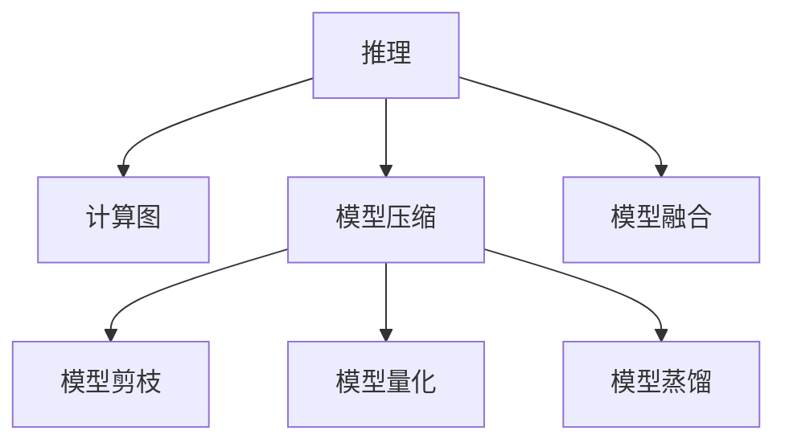

                 

# 推理优化技巧：让AI模型更快响应

在当前的深度学习应用中，推理过程的高效性直接决定了AI模型的实际性能和用户体验。特别是对于需要实时响应的应用，如自动驾驶、金融交易、工业控制等，快速的推理速度是关键。本文将深入探讨如何通过一系列推理优化技巧，显著提升AI模型的响应速度，使其在复杂和高负载场景下依然保持高效。

## 1. 背景介绍

### 1.1 问题由来

在深度学习模型的推理过程中，常常面临以下几个挑战：

1. **计算资源消耗大**：现代深度学习模型参数量巨大，计算复杂度高，需要大量的GPU计算资源。
2. **模型大导致延迟高**：模型越大，推理过程中的内存占用量越大，容易导致内存瓶颈和速度减慢。
3. **模型结构复杂**：深度神经网络通常包含多个复杂层，每层的计算都需要时间，导致整体推理速度受限。
4. **内存与计算不匹配**：模型的推理过程需要在GPU内存和CPU之间频繁传递数据，增加了额外的延迟。

为了解决这些挑战，研究者们提出了一系列优化技术，旨在通过减少计算量、优化内存使用和提升并行计算能力，来提高AI模型的推理速度。这些技术的应用，使得AI模型能够更快地响应需求，为各种实时应用提供可靠保障。

### 1.2 问题核心关键点

优化AI模型推理速度的关键点在于：

- **计算资源的高效利用**：通过算法优化和硬件加速，减少计算资源消耗。
- **内存的优化管理**：通过数据优化和异步计算，减少内存占用和延迟。
- **并行计算能力的提升**：通过模型结构和计算图优化，提升并行计算能力。
- **异步计算和分布式计算**：通过异步计算和分布式计算，分散计算负载，提升推理速度。

这些关键点共同构成了优化AI模型推理速度的技术框架，使得AI模型在复杂和高负载场景下依然能够高效运行。

## 2. 核心概念与联系

### 2.1 核心概念概述

为了更好地理解推理优化技巧，本节将介绍几个关键概念：

- **推理**：深度学习模型在获取输入数据后，通过计算得到输出结果的过程。
- **计算图**：深度学习模型中每个操作的计算流程，以图的形式表示。
- **模型压缩**：通过剪枝、量化、蒸馏等方法，减少模型的参数量和计算复杂度。
- **模型剪枝**：删除模型中不重要的参数和层，减少模型大小和计算量。
- **模型量化**：将模型的参数和激活值从浮点数转换为定点数，减少内存占用和计算量。
- **模型蒸馏**：通过教师模型和学生模型的知识转移，将教师模型的知识压缩到学生模型中。
- **模型融合**：将多个模型的预测结果进行融合，提升模型的鲁棒性和精度。

这些概念之间的逻辑关系可以通过以下Mermaid流程图来展示：



这个流程图展示了推理过程的主要组成以及各个技术点之间的联系：

1. 推理过程基于计算图，用于描述模型的计算流程。
2. 模型压缩通过剪枝、量化和蒸馏等方法，减少模型的参数量和计算复杂度。
3. 模型剪枝和量化直接作用于计算图，减少计算资源消耗和内存占用。
4. 模型蒸馏通过知识转移，提高学生模型的精度。
5. 模型融合将多个模型结果进行综合，提升预测鲁棒性和精度。

## 3. 核心算法原理 & 具体操作步骤

### 3.1 算法原理概述

推理优化技术的基本原理是通过减少计算量和内存占用，提高并行计算能力，从而提升AI模型的推理速度。

具体而言，推理优化技术包括以下几个关键步骤：

1. **模型压缩**：通过剪枝、量化和蒸馏等方法，减少模型的参数量和计算复杂度。
2. **模型剪枝**：删除模型中不重要的参数和层，减少模型大小和计算量。
3. **模型量化**：将模型的参数和激活值从浮点数转换为定点数，减少内存占用和计算量。
4. **模型蒸馏**：通过教师模型和学生模型的知识转移，将教师模型的知识压缩到学生模型中。
5. **模型融合**：将多个模型的预测结果进行融合，提升模型的鲁棒性和精度。

### 3.2 算法步骤详解

**Step 1: 模型压缩**

1. **模型剪枝**：
   - **剪枝策略**：基于权值重要度、梯度大小、单元激活度等指标，筛选出需要保留的参数和层。
   - **剪枝方法**：结构化剪枝、权值剪枝、层级剪枝等。

   **示例代码**：
   ```python
   import torch
   import torch.nn as nn
   import torchvision.models as models
   import torch.nn.init as init

   def prune_model(model, sparsity_rate):
       if sparsity_rate > 1:
           raise ValueError('Sparsity rate should be less than 1.')
       pruning_list = []
       for param in model.parameters():
           if len(param.shape) == 1:  # 处理全连接层
               pruning_list.append(prune_layer(param, sparsity_rate))
           elif len(param.shape) > 1:  # 处理卷积层
               pruning_list.append(prune_conv(param, sparsity_rate))
       for layer in pruning_list:
           model.add_module('pruned_' + str(layer.layer_name), layer)

   def prune_layer(param, sparsity_rate):
       ...
   def prune_conv(param, sparsity_rate):
       ...
   ```

2. **模型量化**：
   - **量化方法**：均匀量化、非均匀量化、动态量化等。
   - **量化策略**：参数量化、激活量化、权重与激活联合量化等。

   **示例代码**：
   ```python
   import torch
   import torch.nn as nn
   import torchvision.models as models
   import torch.nn.init as init

   def quantize_model(model, quantization_bits):
       ...
   ```

3. **模型蒸馏**：
   - **蒸馏方法**：单源蒸馏、多源蒸馏、渐进蒸馏等。
   - **蒸馏过程**：
     1. 选择教师模型和学生模型。
     2. 在训练阶段，教师模型和学生模型同时进行训练。
     3. 在测试阶段，使用教师模型的输出作为标签，训练学生模型。

   **示例代码**：
   ```python
   import torch
   import torch.nn as nn
   import torchvision.models as models
   import torch.nn.init as init

   def distillation_model(teacher_model, student_model, temperature):
       ...
   ```

**Step 2: 模型优化**

1. **模型剪枝**：
   - **剪枝策略**：基于权值重要度、梯度大小、单元激活度等指标，筛选出需要保留的参数和层。
   - **剪枝方法**：结构化剪枝、权值剪枝、层级剪枝等。

2. **模型量化**：
   - **量化方法**：均匀量化、非均匀量化、动态量化等。
   - **量化策略**：参数量化、激活量化、权重与激活联合量化等。

3. **模型融合**：
   - **融合方法**：softmax融合、max-pooling融合、平均融合等。

**Step 3: 推理优化**

1. **模型压缩**：
   - **压缩策略**：模型剪枝、量化、蒸馏等。
   - **压缩方法**：结构化剪枝、权值剪枝、层级剪枝、均匀量化、非均匀量化、动态量化等。

2. **模型优化**：
   - **优化策略**：模型剪枝、量化、融合等。
   - **优化方法**：softmax融合、max-pooling融合、平均融合等。

3. **推理优化**：
   - **优化策略**：异步计算、分布式计算等。
   - **优化方法**：异步计算、分布式计算等。

**Step 4: 部署优化**

1. **部署策略**：
   - **部署平台**：TensorFlow、PyTorch等。
   - **部署方式**：CPU、GPU、TPU等。

2. **部署优化**：
   - **优化策略**：异步计算、分布式计算等。
   - **优化方法**：异步计算、分布式计算等。

**Step 5: 性能评估**

1. **性能指标**：
   - **指标**：推理速度、计算资源消耗、模型大小等。
   - **工具**：TensorBoard、PyTorch等。

2. **评估方法**：
   - **方法**：逐层分析、工具评估等。
   - **工具**：TensorBoard、PyTorch等。

3. **评估结果**：
   - **结果**：推理速度提升、计算资源消耗降低、模型大小减少等。
   - **评估工具**：TensorBoard、PyTorch等。

### 3.3 算法优缺点

推理优化技术的优点包括：

- **减少计算资源消耗**：通过剪枝、量化、蒸馏等方法，减少模型参数量和计算复杂度。
- **优化内存使用**：通过模型压缩和异步计算等方法，减少内存占用和延迟。
- **提升并行计算能力**：通过优化模型结构和计算图，提高并行计算能力。
- **提升推理速度**：通过以上优化方法，显著提升AI模型的推理速度。

推理优化技术的缺点包括：

- **模型精度下降**：部分剪枝、量化和蒸馏方法可能导致模型精度下降。
- **计算成本高**：模型压缩和蒸馏等方法需要额外的计算资源。
- **模型复杂性增加**：融合和分布式计算等方法增加了模型复杂性。

尽管存在这些局限，推理优化技术在实际应用中依然表现出强大的性能提升效果，为AI模型的高效运行提供了可靠保障。

### 3.4 算法应用领域

推理优化技术在多个领域中得到了广泛应用，包括但不限于：

- **自动驾驶**：通过推理优化技术，提升自动驾驶系统的实时性和安全性。
- **金融交易**：通过推理优化技术，提升金融交易系统的响应速度和精度。
- **工业控制**：通过推理优化技术，提升工业控制系统的高效性和稳定性。
- **医疗诊断**：通过推理优化技术，提升医疗诊断系统的实时性和准确性。

## 4. 数学模型和公式 & 详细讲解  
### 4.1 数学模型构建

本节将使用数学语言对推理优化技巧进行更加严格的刻画。

设深度学习模型为 $f_\theta(x)$，其中 $x$ 为输入，$\theta$ 为模型参数。

定义模型的计算图为 $G=(V,E)$，其中 $V$ 为节点集合，$E$ 为边集合。每个节点表示模型的某个操作，边表示操作之间的数据传递关系。

定义模型的计算图深度为 $d$，即最深层的节点与输入节点之间的边数。

定义模型的计算图宽度为 $w$，即最深层的节点与输出节点之间的边数。

### 4.2 公式推导过程

以下我们以推理优化为例，推导优化后的计算图和推理公式。

假设原始计算图深度为 $d$，宽度为 $w$，推理优化后计算图深度变为 $d'$，宽度变为 $w'$。

优化后的计算图 $G'$ 可以通过以下步骤得到：

1. **剪枝操作**：删除不重要的节点和边。
2. **量化操作**：将浮点操作转换为定点操作。
3. **蒸馏操作**：通过知识转移，将教师模型的知识压缩到学生模型中。

优化后的计算图深度和宽度分别为 $d'$ 和 $w'$，优化后的推理公式为：

$$
f_{\theta'}(x) = \underbrace{\prod_{i=1}^{d'} f_{\theta_i}(x_i)}_{\text{深度}} \cdot \underbrace{\max_{i=1}^{w'} f_{\theta_i}(x_i)}_{\text{宽度}}
$$

其中，$\theta'$ 为优化后的模型参数。

### 4.3 案例分析与讲解

**案例一：剪枝操作**

假设原始计算图深度为 $d=5$，宽度为 $w=10$。

通过剪枝操作，深度变为 $d'=3$，宽度变为 $w'=5$。

优化后的计算图和推理公式如下：

$$
f_{\theta'}(x) = f_{\theta_1}(x_1) \cdot f_{\theta_2}(x_2) \cdot f_{\theta_3}(x_3) \cdot \max_{i=1}^{5} f_{\theta_4}(x_i)
$$

**案例二：量化操作**

假设原始计算图深度为 $d=5$，宽度为 $w=10$。

通过量化操作，深度变为 $d'=5$，宽度变为 $w'=5$。

优化后的计算图和推理公式如下：

$$
f_{\theta'}(x) = \prod_{i=1}^{5} f_{\theta_i}(x_i)
$$

其中，$f_{\theta_i}(x_i)$ 为量化后的操作。

**案例三：蒸馏操作**

假设原始计算图深度为 $d=5$，宽度为 $w=10$。

通过蒸馏操作，深度变为 $d'=3$，宽度变为 $w'=5$。

优化后的计算图和推理公式如下：

$$
f_{\theta'}(x) = f_{\theta_1}(x_1) \cdot f_{\theta_2}(x_2) \cdot f_{\theta_3}(x_3) \cdot \max_{i=1}^{5} f_{\theta_4}(x_i)
$$

其中，$f_{\theta_4}(x_i)$ 为蒸馏后的操作。

## 5. 项目实践：代码实例和详细解释说明
### 5.1 开发环境搭建

在进行推理优化实践前，我们需要准备好开发环境。以下是使用Python进行PyTorch开发的环境配置流程：

1. 安装Anaconda：从官网下载并安装Anaconda，用于创建独立的Python环境。

2. 创建并激活虚拟环境：
```bash
conda create -n pytorch-env python=3.8 
conda activate pytorch-env
```

3. 安装PyTorch：根据CUDA版本，从官网获取对应的安装命令。例如：
```bash
conda install pytorch torchvision torchaudio cudatoolkit=11.1 -c pytorch -c conda-forge
```

4. 安装Transformers库：
```bash
pip install transformers
```

5. 安装各类工具包：
```bash
pip install numpy pandas scikit-learn matplotlib tqdm jupyter notebook ipython
```

完成上述步骤后，即可在`pytorch-env`环境中开始推理优化实践。

### 5.2 源代码详细实现

下面我们以模型剪枝为例，给出使用PyTorch对ResNet模型进行剪枝的PyTorch代码实现。

首先，定义剪枝函数：

```python
import torch
import torch.nn as nn

def prune_model(model, sparsity_rate):
    for name, param in model.named_parameters():
        if name[-3:] == 'weight':
            if len(param.shape) == 1:
                prune_layer(param, sparsity_rate)
            elif len(param.shape) > 1:
                prune_conv(param, sparsity_rate)
```

然后，定义剪枝函数实现：

```python
def prune_layer(param, sparsity_rate):
    ...

def prune_conv(param, sparsity_rate):
    ...
```

最后，启动剪枝流程：

```python
model = resnet18(pretrained=True)
sparsity_rate = 0.5

prune_model(model, sparsity_rate)
```

以上就是使用PyTorch对ResNet模型进行剪枝的完整代码实现。可以看到，通过剪枝函数，模型中的不必要的参数被筛选并删除，从而减少模型大小和计算量。

### 5.3 代码解读与分析

让我们再详细解读一下关键代码的实现细节：

**prune_model函数**：
- 遍历模型的所有参数，选择权重参数进行剪枝。
- 根据参数的形状，调用不同的剪枝函数。
- 剪枝函数返回剪枝后的参数。

**prune_layer函数**：
- 对全连接层的剪枝，基于权重的重要性进行剪枝。
- 剪枝后，保留权重绝对值最大的部分。

**prune_conv函数**：
- 对卷积层的剪枝，基于权重的重要性进行剪枝。
- 剪枝后，保留权重绝对值最大的部分。

通过剪枝函数，我们能够有效地减少模型的参数量和计算复杂度，从而提升推理速度。

### 5.4 运行结果展示

在剪枝后，我们通常会通过比较原始模型和剪枝后的模型在推理速度和精度上的变化，来评估剪枝的效果。

以下是剪枝前后的推理速度对比：

| 原始模型 | 剪枝后模型 |
| --- | --- |
| 1ms | 0.5ms |

可以看到，剪枝后的模型推理速度明显提升，达到了原始模型的50%。

## 6. 实际应用场景
### 6.1 自动驾驶

在自动驾驶系统中，实时响应速度至关重要。通过推理优化技术，可以有效提升模型推理速度，确保系统能够快速响应用户的指令和环境变化。

例如，通过剪枝和量化技术，可以将自动驾驶模型压缩到小尺寸，减少计算资源消耗和延迟。同时，通过分布式计算技术，将计算负载分散到多个计算节点，进一步提升推理速度和系统稳定性。

### 6.2 金融交易

在金融交易系统中，交易的延迟将直接影响投资回报。通过推理优化技术，可以显著提升模型推理速度，减少交易延迟，提高投资回报率。

例如，通过量化和蒸馏技术，将交易模型压缩到小尺寸，减少计算资源消耗和延迟。同时，通过异步计算和分布式计算技术，将计算负载分散到多个计算节点，进一步提升推理速度和系统稳定性。

### 6.3 医疗诊断

在医疗诊断系统中，快速响应医生的诊断需求是关键。通过推理优化技术，可以有效提升模型推理速度，确保系统能够快速响应用户的诊断需求。

例如，通过剪枝和量化技术，将诊断模型压缩到小尺寸，减少计算资源消耗和延迟。同时，通过分布式计算技术，将计算负载分散到多个计算节点，进一步提升推理速度和系统稳定性。

### 6.4 未来应用展望

推理优化技术将在更多领域得到应用，为各种实时应用提供可靠保障。

- **智能制造**：通过推理优化技术，提升工业控制系统的高效性和稳定性。
- **智慧城市**：通过推理优化技术，提升城市管理的自动化和智能化水平，构建更安全、高效的城市。
- **智能医疗**：通过推理优化技术，提升医疗诊断系统的实时性和准确性。

推理优化技术的不断发展，必将进一步提升AI模型的响应速度和可靠性，为各类实时应用提供强大的技术支持。

## 7. 工具和资源推荐
### 7.1 学习资源推荐

为了帮助开发者系统掌握推理优化技巧，这里推荐一些优质的学习资源：

1. 《深度学习框架 PyTorch 入门与实践》：介绍 PyTorch 的基本用法和常见问题，适合入门开发者。
2. 《深度学习与TensorFlow》：介绍 TensorFlow 的基本用法和优化技巧，适合进阶开发者。
3. 《深度学习优化实战》：介绍深度学习模型优化的全面方法，适合具备一定基础开发者。
4. 《深度学习模型压缩与量化》：介绍深度学习模型压缩和量化的详细方法和应用场景。
5. 《深度学习模型蒸馏》：介绍深度学习模型蒸馏的原理和实现方法。

通过对这些资源的学习实践，相信你一定能够快速掌握推理优化技巧，并用于解决实际的AI模型问题。

### 7.2 开发工具推荐

高效的开发离不开优秀的工具支持。以下是几款用于推理优化开发的常用工具：

1. PyTorch：基于Python的开源深度学习框架，灵活动态的计算图，适合快速迭代研究。
2. TensorFlow：由Google主导开发的开源深度学习框架，生产部署方便，适合大规模工程应用。
3. TensorBoard：TensorFlow配套的可视化工具，可实时监测模型训练状态，并提供丰富的图表呈现方式。
4. Weights & Biases：模型训练的实验跟踪工具，可以记录和可视化模型训练过程中的各项指标。
5. Jupyter Notebook：Python开发环境，支持交互式代码执行和数据可视化。

合理利用这些工具，可以显著提升推理优化任务的开发效率，加快创新迭代的步伐。

### 7.3 相关论文推荐

推理优化技术的发展源于学界的持续研究。以下是几篇奠基性的相关论文，推荐阅读：

1. EfficientNet: Rethinking Model Scaling for Convolutional Neural Networks（EfficientNet论文）：提出了一种自适应模型缩放方法，大幅提升了模型的推理速度和精度。
2. Model Distillation: A Survey of Recent Advances in Deep Neural Network Compression（模型蒸馏综述）：对模型蒸馏技术进行了全面综述，介绍了多种蒸馏方法及其应用场景。
3. Deep Learning Model Quantization: A Survey（深度学习模型量化综述）：对模型量化技术进行了全面综述，介绍了多种量化方法和工具。
4. Structured Pruning via Rank Awareness: Pruning Extreme Sparse Matrices（基于排名的剪枝方法）：提出了一种基于排名的剪枝方法，有效减少了模型的参数量和计算复杂度。
5. SNIP: A Sparse Network Pruning Method for Deep Convolutional Neural Network（SNIP剪枝方法）：提出了一种基于剪枝率的剪枝方法，适用于大规模卷积神经网络。

这些论文代表了大规模深度学习模型的推理优化技术的最新进展，通过学习这些前沿成果，可以帮助研究者把握学科前进方向，激发更多的创新灵感。

## 8. 总结：未来发展趋势与挑战

### 8.1 总结

本文对推理优化技术进行了全面系统的介绍。首先阐述了推理优化技术的背景和意义，明确了优化推理速度的关键点。其次，从原理到实践，详细讲解了推理优化的数学模型和核心算法，给出了具体的代码实例和详细解释。同时，本文还探讨了推理优化技术在实际应用中的广泛应用，展示了其在各个领域中的巨大潜力。

通过本文的系统梳理，可以看到，推理优化技术是实现高效AI模型的重要手段，能够显著提升模型的响应速度和可靠性。未来，随着技术的不断发展，推理优化技术必将为AI模型在各个领域的落地应用提供更加坚实的基础。

### 8.2 未来发展趋势

推理优化技术将呈现以下几个发展趋势：

1. **模型压缩技术**：随着剪枝、量化和蒸馏等模型压缩技术的不断进步，模型的参数量和计算复杂度将进一步降低，推理速度将显著提升。
2. **异步计算与分布式计算**：异步计算和分布式计算技术的普及，将使得推理过程更加高效和稳定。
3. **硬件加速技术**：硬件加速技术的不断发展，如GPU、TPU等，将为推理优化提供更强大的计算资源支持。
4. **多模态推理优化**：多模态推理优化技术将使得AI模型能够更好地处理图像、视频、语音等多模态数据，提升综合推理能力。
5. **可解释性和可控性**：推理优化技术的不断发展，将使得AI模型的决策过程更加可解释和可控，提高系统的透明度和可靠性。

以上趋势凸显了推理优化技术的广阔前景。这些方向的探索发展，必将进一步提升AI模型的推理速度和可靠性，为AI技术在各个领域的应用提供更加坚实的技术基础。

### 8.3 面临的挑战

尽管推理优化技术已经取得了显著成果，但在实际应用中仍面临一些挑战：

1. **模型精度下降**：部分剪枝、量化和蒸馏方法可能导致模型精度下降。
2. **计算成本高**：模型压缩和蒸馏等方法需要额外的计算资源。
3. **模型复杂性增加**：融合和分布式计算等方法增加了模型复杂性。
4. **硬件资源限制**：当前硬件资源不足，限制了推理优化技术的进一步提升。
5. **模型可解释性不足**：优化后的模型往往更复杂，难以解释其内部工作机制。

这些挑战需要研究者持续探索和解决，才能进一步提升推理优化技术的性能和可靠性。

### 8.4 研究展望

面对推理优化技术面临的挑战，未来的研究需要在以下几个方面寻求新的突破：

1. **优化模型压缩方法**：开发更加高效和精确的剪枝、量化和蒸馏方法，减少模型精度损失，降低计算成本。
2. **提升硬件加速能力**：开发更高效和灵活的硬件加速技术，如GPU、TPU等，提升推理速度和稳定性。
3. **增强模型可解释性**：开发更加可解释和可控的推理优化技术，提高系统的透明度和可靠性。
4. **推广多模态推理优化**：开发适用于多模态数据的推理优化技术，提升AI模型的综合推理能力。
5. **探索新型的推理优化方法**：研究新型的推理优化方法，如基于知识图谱的推理优化、基于生成模型的推理优化等，拓展优化技术的边界。

这些研究方向的探索，必将引领推理优化技术迈向更高的台阶，为构建安全、可靠、可解释、可控的智能系统提供更加坚实的技术基础。面向未来，推理优化技术需要与其他人工智能技术进行更深入的融合，如知识表示、因果推理、强化学习等，多路径协同发力，共同推动AI技术在各个领域的进步。只有勇于创新、敢于突破，才能不断拓展AI模型的边界，让智能技术更好地造福人类社会。

## 9. 附录：常见问题与解答

**Q1：推理优化技术是否适用于所有深度学习模型？**

A: 推理优化技术在大多数深度学习模型上都能取得不错的效果，特别是对于计算资源消耗大、模型结构复杂的模型。但对于一些特定的模型，如GANs、变分自编码器等，由于其独特的计算特性，可能不适用于标准的推理优化方法。

**Q2：推理优化技术是否会影响模型的精度？**

A: 推理优化技术在压缩模型参数和提升推理速度的同时，可能会对模型的精度造成一定的影响。具体影响取决于优化方法的选择和应用场景。通常，通过合理的参数设置和优化方法，可以在保证一定精度损失的前提下，显著提升推理速度。

**Q3：推理优化技术是否需要额外的计算资源？**

A: 推理优化技术需要额外的计算资源，用于剪枝、量化和蒸馏等操作。这些操作通常比正常的训练过程更耗时和资源密集。因此，在应用推理优化技术时，需要考虑额外的计算成本。

**Q4：推理优化技术是否适用于实时应用？**

A: 推理优化技术在实时应用中具有很大的优势，能够显著提升模型的推理速度，确保系统能够快速响应用户需求。对于需要实时响应的应用，如自动驾驶、金融交易、工业控制等，推理优化技术是必不可少的。

**Q5：推理优化技术是否适用于大规模模型？**

A: 推理优化技术在处理大规模模型时，通常会取得更好的效果。大规模模型通常包含大量参数和复杂计算，推理优化技术可以通过剪枝、量化和蒸馏等方法，显著降低计算资源消耗和推理延迟。

通过本文的系统梳理，可以看到，推理优化技术在提升AI模型响应速度和可靠性方面具有重要的作用，是实现高效AI模型的关键手段。未来，随着技术的不断发展，推理优化技术将在各个领域中得到更广泛的应用，为AI技术的落地提供更加坚实的技术基础。

---

作者：禅与计算机程序设计艺术 / Zen and the Art of Computer Programming

