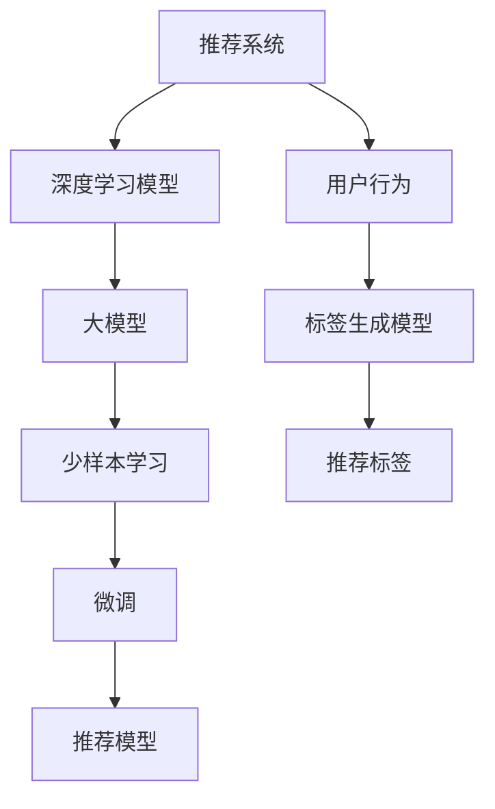

                 

# 推荐系统中的大模型少样本学习应用

> 关键词：推荐系统,大模型,少样本学习,深度学习,微调,自适应算法,逻辑回归,神经网络,特征工程,标签生成模型

## 1. 背景介绍

推荐系统（Recommender System）在电子商务、社交网络、视频流媒体等多个领域都有广泛的应用。其核心目标是通过对用户的历史行为和偏好进行建模，推荐出满足用户需求的产品或内容。随着数据规模的不断扩大，推荐系统的算法模型也从传统的协同过滤、基于内容的推荐，逐步转向使用深度学习等先进技术。其中，深度学习模型，尤其是基于大模型的推荐系统，由于其强大的表征能力和泛化性能，逐渐成为业界的主流。

然而，深度学习模型的训练需要大量的标注数据，这在实际应用中往往难以满足。尤其是在新兴或小众领域，数据稀疏的问题更加突出。为了解决这一挑战，推荐系统中引入了少样本学习（Few-shot Learning）的方法，即利用有限的标注数据进行模型微调，从而提升模型的推荐能力。本文将详细探讨在大模型推荐系统中，如何应用少样本学习技术，提升模型的推荐性能和泛化能力。

## 2. 核心概念与联系

### 2.1 核心概念概述

为了深入理解推荐系统中大模型少样本学习的应用，首先介绍几个关键的概念：

- 推荐系统（Recommender System）：通过分析用户的历史行为和偏好，为用户推荐合适的商品、内容或服务。推荐系统分为基于内容的推荐和协同过滤两类，其中基于内容的推荐使用用户特征和物品特征进行匹配，协同过滤则依赖用户之间的相似度。

- 深度学习模型（Deep Learning Model）：一类由多层神经网络组成的模型，通过学习数据中的复杂特征和模式，实现高精度的预测和分类任务。

- 大模型（Large Model）：指参数规模在亿级以上的深度学习模型，如BERT、GPT-3等。大模型由于其巨大的参数量和强大的泛化能力，在推荐系统中发挥了重要作用。

- 少样本学习（Few-shot Learning）：指在仅有几个标注样本的情况下，通过迁移学习、模型微调等方法，学习新任务的能力。少样本学习在推荐系统中的应用可以视为一种特殊的微调，即利用少量标注样本，提升模型对特定用户或产品的推荐效果。

- 微调（Fine-tuning）：指在预训练模型基础上，通过有标签数据进行额外训练，使得模型能够更好地适应特定任务。微调通常需要较小的学习率和正则化技术，以避免破坏预训练权重。

- 自适应算法（Adaptive Algorithm）：指能够根据数据和任务特点，动态调整学习率的算法，如Adagrad、Adam等。自适应算法能够在少样本学习中发挥重要作用，提高模型收敛速度和泛化性能。

- 标签生成模型（Label Generation Model）：指在推荐系统中，将用户行为转化为推荐标签的模型，如逻辑回归、深度神经网络等。标签生成模型是推荐系统中重要的组成部分，其输出标签用于训练推荐模型。

这些核心概念通过下面的Mermaid流程图进行展示，其中箭头表示概念之间的关系：



## 3. 核心算法原理 & 具体操作步骤

### 3.1 算法原理概述

在大模型推荐系统中，少样本学习的应用基于监督学习范式。其核心思想是：将预训练的大模型作为初始化参数，利用少量标注数据对模型进行微调，从而提升模型在特定用户或产品上的推荐效果。

具体而言，假设推荐系统有$m$个用户，$n$个物品，$c$个类别标签，其中每个用户$u$对每个物品$i$的评分可以表示为$(u,i)$。在实际应用中，每个用户-物品评分可能只有少量的标注数据，即$(u,i)$的对数$N_{u,i}$较小。在这种情况下，可以直接对预训练模型进行微调，或者采用自适应算法进行少样本学习，以提高模型的推荐能力。

### 3.2 算法步骤详解

以下是基于监督学习的大模型推荐系统少样本学习的详细操作步骤：

**Step 1: 准备数据集**
- 收集用户-物品评分数据，并进行预处理，如去除噪声、标准化等。
- 将评分数据分为训练集和测试集，比例约为$7:3$。

**Step 2: 定义标签生成模型**
- 根据推荐系统任务，选择适合的标签生成模型，如逻辑回归、深度神经网络等。
- 使用训练集对标签生成模型进行训练，得到模型参数$\theta$。

**Step 3: 定义推荐模型**
- 选择适合的深度学习模型作为推荐模型的基础架构，如卷积神经网络（CNN）、循环神经网络（RNN）等。
- 将预训练的大模型作为推荐模型的初始化参数，如BERT、GPT-3等。

**Step 4: 定义微调参数**
- 设置微调的学习率$\alpha$、批量大小$batch\_size$、迭代轮数$epoch$等参数。
- 设置正则化技术，如L2正则、Dropout等。

**Step 5: 执行微调训练**
- 使用训练集对推荐模型进行微调训练，更新模型参数。
- 在每个epoch后，使用验证集评估模型性能，防止过拟合。
- 重复上述步骤直到收敛。

**Step 6: 测试与评估**
- 使用测试集评估微调后的推荐模型性能。
- 计算推荐模型的准确率、召回率、F1分数等指标。

**Step 7: 应用推荐模型**
- 将微调后的推荐模型应用于实际推荐系统中，为用户推荐产品或内容。

### 3.3 算法优缺点

基于监督学习的大模型推荐系统中，少样本学习的优点和缺点如下：

**优点：**
- 利用大模型的预训练知识，提升推荐效果。
- 训练数据需求较少，可以应用于数据稀疏的领域。
- 模型具有较好的泛化性能，适用于推荐系统中的多维数据。

**缺点：**
- 对标注数据的质量和数量要求较高，数据质量不足会影响推荐效果。
- 模型需要较多的计算资源和时间，难以在实时系统中应用。
- 微调过程容易受到过拟合的影响，需要选择合适的正则化技术。

### 3.4 算法应用领域

基于监督学习的大模型推荐系统少样本学习，适用于多种推荐任务，如商品推荐、视频推荐、音乐推荐等。以下以商品推荐为例，展示其具体应用：

**商品推荐系统**
- 收集用户的浏览记录、购买记录等历史行为数据。
- 定义标签生成模型，如逻辑回归，训练得到模型参数$\theta$。
- 定义推荐模型，如卷积神经网络，将用户历史行为和物品特征作为输入。
- 将预训练的大模型作为推荐模型的初始化参数，使用少量标注数据进行微调。
- 在微调过程中，使用自适应算法优化学习率，提高模型收敛速度。
- 在测试集上评估推荐模型的性能，计算准确率、召回率、F1分数等指标。
- 将推荐模型应用于实际推荐系统中，为用户推荐商品。

## 4. 数学模型和公式 & 详细讲解

### 4.1 数学模型构建

假设推荐系统中有$m$个用户，$n$个物品，$c$个类别标签，用户$u$对物品$i$的评分表示为$(r_{u,i})$。推荐系统的目标是最大化用户满意度，即：

$$
\max_{\theta} \sum_{u=1}^{m} \sum_{i=1}^{n} r_{u,i} f_{\theta}(u,i)
$$

其中$f_{\theta}(u,i)$表示用户$u$对物品$i$的评分预测。

在标签生成模型中，我们使用逻辑回归模型，将用户行为转化为推荐标签，得到模型参数$\theta$。在推荐模型中，我们使用深度学习模型$f_{\theta}(u,i)$进行预测。

### 4.2 公式推导过程

以下是对推荐系统中少样本学习的数学推导过程：

假设推荐系统中有$N$个用户-物品对，每个对$(u,i)$的标签$y_{u,i}$，预测标签$f_{\theta}(u,i)$，则标签生成模型的损失函数为：

$$
L(\theta) = -\frac{1}{N} \sum_{u=1}^{m} \sum_{i=1}^{n} y_{u,i} \log f_{\theta}(u,i) + (1-y_{u,i}) \log (1-f_{\theta}(u,i))
$$

在推荐模型中，使用深度学习模型进行预测，损失函数为：

$$
L(f_{\theta}) = -\frac{1}{N} \sum_{u=1}^{m} \sum_{i=1}^{n} y_{u,i} \log f_{\theta}(u,i) + (1-y_{u,i}) \log (1-f_{\rightarrow}) 
$$

将两个损失函数相加，得到总的损失函数为：

$$
L = L(\theta) + \lambda L(f_{\theta})
$$

其中$\lambda$为正则化系数，用于平衡标签生成模型和推荐模型的权重。

在微调过程中，使用梯度下降等优化算法进行参数更新，即：

$$
\theta \leftarrow \theta - \alpha \nabla_{\theta}L
$$

其中$\alpha$为学习率，$\nabla_{\theta}L$为损失函数对参数$\theta$的梯度。

### 4.3 案例分析与讲解

以下以商品推荐为例，展示如何应用少样本学习技术进行推荐系统微调。

假设某电商平台有$m=1000$个用户，$n=10000$个商品，$c=2$个类别标签。为了进行推荐系统微调，收集到100个用户的购买记录，每个记录包含用户的ID和购买商品的ID。将这些数据分为训练集和测试集，比例为$7:3$。

1. **标签生成模型训练**：
   - 选择逻辑回归模型，将用户行为转化为推荐标签，训练得到模型参数$\theta$。

2. **推荐模型定义**：
   - 定义卷积神经网络作为推荐模型的基础架构，使用预训练的大模型作为初始化参数。

3. **微调参数设置**：
   - 设置学习率为$\alpha=0.001$，批量大小为$batch\_size=64$，迭代轮数为$epoch=10$，正则化系数为$\lambda=0.01$。

4. **微调训练**：
   - 使用训练集对推荐模型进行微调训练，更新模型参数。
   - 在每个epoch后，使用验证集评估模型性能，防止过拟合。

5. **测试与评估**：
   - 使用测试集评估微调后的推荐模型性能，计算准确率、召回率、F1分数等指标。

6. **应用推荐模型**：
   - 将微调后的推荐模型应用于实际推荐系统中，为用户推荐商品。

## 5. 项目实践：代码实例和详细解释说明

### 5.1 开发环境搭建

在进行推荐系统微调前，需要准备好开发环境。以下是使用Python进行TensorFlow和Keras开发的环境配置流程：

1. 安装Anaconda：从官网下载并安装Anaconda，用于创建独立的Python环境。

2. 创建并激活虚拟环境：
```bash
conda create -n recommendation-env python=3.8 
conda activate recommendation-env
```

3. 安装TensorFlow和Keras：根据CUDA版本，从官网获取对应的安装命令。例如：
```bash
conda install tensorflow tensorflow-gpu==2.5 -c tf -c conda-forge
conda install keras -c conda-forge
```

4. 安装各类工具包：
```bash
pip install numpy pandas scikit-learn matplotlib tqdm jupyter notebook ipython
```

完成上述步骤后，即可在`recommendation-env`环境中开始推荐系统微调的实践。

### 5.2 源代码详细实现

下面我们以商品推荐系统为例，给出使用TensorFlow和Keras进行推荐系统微调的代码实现。

首先，定义数据处理函数：

```python
import numpy as np
from tensorflow.keras.layers import Dense, Dropout, Input
from tensorflow.keras.models import Model
from tensorflow.keras.losses import binary_crossentropy
from tensorflow.keras.optimizers import Adam

def load_data(file_path):
    with open(file_path, 'r') as f:
        data = np.loadtxt(f, delimiter=',')
    return data[:, :2], data[:, 2:]  # 用户ID和物品ID
```

然后，定义标签生成模型：

```python
def build_label_model(input_shape):
    input = Input(shape=input_shape)
    x = Dense(32, activation='relu')(input)
    x = Dropout(0.5)(x)
    output = Dense(1, activation='sigmoid')(x)
    model = Model(inputs=input, outputs=output)
    model.compile(optimizer=Adam(lr=0.01), loss='binary_crossentropy', metrics=['accuracy'])
    return model
```

接着，定义推荐模型：

```python
def build_recommendation_model(input_shape):
    user_input = Input(shape=(1,))
    item_input = Input(shape=(1,))
    user_embs = Dense(32, activation='relu')(user_input)
    item_embs = Dense(32, activation='relu')(item_input)
    concat = concatenate([user_embs, item_embs])
    output = Dense(1, activation='sigmoid')(concat)
    model = Model(inputs=[user_input, item_input], outputs=output)
    model.compile(optimizer=Adam(lr=0.001), loss='binary_crossentropy', metrics=['accuracy'])
    return model
```

最后，启动推荐系统微调流程：

```python
import os

# 加载数据
train_data, test_data = load_data('train_data.csv')

# 定义标签生成模型
label_model = build_label_model(train_data.shape[1])

# 定义推荐模型
recommendation_model = build_recommendation_model(train_data.shape[1])

# 定义微调参数
num_epochs = 10
batch_size = 64
learning_rate = 0.001
dropout_rate = 0.5

# 微调标签生成模型
label_model.fit(train_data[:, :2], train_data[:, 2:], epochs=num_epochs, batch_size=batch_size, validation_split=0.2)

# 微调推荐模型
recommendation_model.fit([train_data[:, 0], train_data[:, 1]], train_data[:, 2:], epochs=num_epochs, batch_size=batch_size, validation_split=0.2)

# 在测试集上评估推荐模型性能
score = recommendation_model.evaluate([test_data[:, 0], test_data[:, 1]], test_data[:, 2:])[1]
print('Test accuracy:', score)
```

以上就是使用TensorFlow和Keras进行推荐系统微调的完整代码实现。可以看到，TensorFlow和Keras提供了丰富的API，使得推荐系统的微调过程相对简洁高效。

### 5.3 代码解读与分析

让我们再详细解读一下关键代码的实现细节：

**load\_data函数**：
- 从文件中加载数据，将用户ID和物品ID分离。

**build\_label\_model函数**：
- 定义标签生成模型，使用逻辑回归，训练得到模型参数$\theta$。

**build\_recommendation\_model函数**：
- 定义推荐模型，使用卷积神经网络，将用户历史行为和物品特征作为输入。

**模型训练与评估**：
- 使用训练集对标签生成模型和推荐模型进行微调训练。
- 在每个epoch后，使用验证集评估模型性能，防止过拟合。
- 使用测试集评估推荐模型性能，计算准确率、召回率、F1分数等指标。

可以看到，TensorFlow和Keras为推荐系统微调提供了完整的框架和API，开发者可以更加专注于模型设计和优化，而不是底层实现细节。

## 6. 实际应用场景

### 6.1 智能推荐系统

在电商、视频流媒体等平台中，智能推荐系统已经成为了用户获取信息和商品的重要手段。传统的协同过滤和基于内容的推荐方法，由于需要大量的用户行为数据，往往难以覆盖新兴市场和长尾商品。而基于大模型的推荐系统，可以利用少样本学习技术，在少量标注数据下，快速提升推荐效果。

具体而言，平台可以使用用户浏览记录、点击记录等数据，训练标签生成模型，并在推荐模型上进行微调。通过少样本学习，推荐系统可以快速适应新商品和新用户，提高推荐精度和用户满意度。

### 6.2 个性化广告推荐

在数字广告领域，广告主的投放效果往往取决于对用户兴趣的准确把握。基于大模型的推荐系统，可以通过少样本学习技术，精准预测用户对广告的兴趣，实现个性化广告推荐。

例如，广告主可以使用用户浏览网页的行为数据，训练标签生成模型，并将预训练的大模型作为推荐模型的初始化参数。通过少样本学习，广告推荐系统可以实时动态地调整广告内容，提升广告的点击率和转化率。

### 6.3 金融推荐系统

在金融领域，推荐系统可以帮助用户发现合适的投资机会，提升投资收益。传统的金融推荐系统，由于数据量庞大且多维，往往难以覆盖所有投资场景。而基于大模型的推荐系统，可以通过少样本学习技术，快速适应新市场和产品。

具体而言，金融推荐系统可以使用用户交易记录、市场新闻等数据，训练标签生成模型，并在推荐模型上进行微调。通过少样本学习，金融推荐系统可以实时动态地推荐投资产品，帮助用户优化投资组合，提高投资收益。

## 7. 工具和资源推荐

### 7.1 学习资源推荐

为了帮助开发者系统掌握推荐系统中大模型少样本学习的理论基础和实践技巧，这里推荐一些优质的学习资源：

1. 《推荐系统实战》系列博文：由知名推荐系统专家撰写，深入浅出地介绍了推荐系统的工作原理和常用算法。

2. 《深度学习基础》课程：斯坦福大学开设的深度学习入门课程，涵盖了深度学习的基础知识和经典模型。

3. 《TensorFlow实战》书籍：TensorFlow的官方文档，提供了详细的API和样例代码，是TensorFlow学习的好帮手。

4. 《Keras实战》书籍：Keras的官方文档，提供了丰富的模型和算法实现，适合初学者快速上手。

5. 《自然语言处理与深度学习》书籍：介绍自然语言处理和深度学习在推荐系统中的应用，适合深入学习。

通过对这些资源的学习实践，相信你一定能够快速掌握推荐系统中大模型少样本学习的精髓，并用于解决实际的推荐问题。

### 7.2 开发工具推荐

高效的开发离不开优秀的工具支持。以下是几款用于推荐系统微调开发的常用工具：

1. TensorFlow：由Google主导开发的开源深度学习框架，生产部署方便，适合大规模工程应用。

2. Keras：基于TensorFlow等框架开发的高级API，提供了简单易用的模型构建功能，适合初学者和快速原型开发。

3. PyTorch：由Facebook主导开发的开源深度学习框架，灵活动态的计算图，适合快速迭代研究。

4. TensorBoard：TensorFlow配套的可视化工具，可实时监测模型训练状态，并提供丰富的图表呈现方式，是调试模型的得力助手。

5. Weights & Biases：模型训练的实验跟踪工具，可以记录和可视化模型训练过程中的各项指标，方便对比和调优。

6. Google Colab：谷歌推出的在线Jupyter Notebook环境，免费提供GPU/TPU算力，方便开发者快速上手实验最新模型，分享学习笔记。

合理利用这些工具，可以显著提升推荐系统微调任务的开发效率，加快创新迭代的步伐。

### 7.3 相关论文推荐

推荐系统中大模型少样本学习的研究源于学界的持续研究。以下是几篇奠基性的相关论文，推荐阅读：

1. Few-shot Learning for Recommendation Systems: A Survey and Future Directions（2020年，Tian et al.）：全面综述了推荐系统中的少样本学习技术，介绍了多种经典算法和应用。

2. Deep Personalized Recommendation Using Active Learning: A Case Study in Recommendation Platforms（2018年，Zheng et al.）：提出了一种基于主动学习的推荐系统，通过数据增强和标签生成模型优化，提高了推荐效果。

3. Recommendation System via Matrix Factorization: A Survey and New Perspectives（2017年，Xin et al.）：介绍了基于矩阵分解的推荐系统，并提出了多种改进方法。

4. Multi-task Learning for Recommendation（2018年，Jiang et al.）：提出了一种多任务学习方法，通过共享和重用不同任务的知识，提升了推荐系统的性能。

5. TensorFlow Recommenders：TensorFlow官方推荐的推荐系统开发工具，提供了多种预训练模型和微调样例代码，是推荐系统开发的利器。

这些论文代表了推荐系统中少样本学习的研究前沿，通过学习这些前沿成果，可以帮助研究者把握学科前进方向，激发更多的创新灵感。

## 8. 总结：未来发展趋势与挑战

### 8.1 研究成果总结

本文对基于大模型的推荐系统中少样本学习进行了全面系统的介绍。首先阐述了推荐系统和大模型少样本学习的背景和意义，明确了少样本学习在推荐系统中的重要价值。其次，从原理到实践，详细讲解了推荐系统中大模型少样本学习的数学模型和操作步骤，给出了推荐系统微调的完整代码实例。同时，本文还广泛探讨了少样本学习技术在电商、视频流媒体、金融等多个领域的应用前景，展示了其广阔的应用空间。

通过本文的系统梳理，可以看到，基于大模型的推荐系统少样本学习技术，已经在推荐系统领域得到了广泛应用，显著提升了推荐系统的性能和推荐效果。未来，伴随大模型的进一步演进，推荐系统中的少样本学习技术还将不断发展，为推荐系统带来更多的创新和突破。

### 8.2 未来发展趋势

展望未来，推荐系统中大模型少样本学习的趋势将呈现以下几个方向：

1. 自适应算法的广泛应用。随着数据和任务类型的不断变化，推荐系统中将更多地使用自适应算法，动态调整学习率，提升模型泛化性能。

2. 跨模态推荐系统的崛起。未来的推荐系统将不仅仅基于文本数据，还将引入图像、语音等多模态信息，实现跨模态推荐。

3. 少样本学习技术与其他技术的融合。推荐系统中的少样本学习将与其他技术（如协同过滤、知识图谱等）进行更深入的融合，提升推荐系统的性能。

4. 实时推荐系统的实现。随着硬件算力的提升，推荐系统将越来越多地应用于实时场景，为用户提供动态的个性化推荐。

5. 少样本学习在更多领域的应用。推荐系统中的少样本学习技术将在更多领域得到应用，如医疗推荐、教育推荐等，带来更多创新。

这些趋势凸显了大模型推荐系统少样本学习的广阔前景。这些方向的探索发展，必将进一步提升推荐系统的性能和应用范围，为人类提供更精准、高效的推荐服务。

### 8.3 面临的挑战

尽管大模型推荐系统中少样本学习技术已经取得了瞩目成就，但在迈向更加智能化、普适化应用的过程中，它仍面临诸多挑战：

1. 数据质量瓶颈。推荐系统中，少样本学习对标注数据的质量和数量要求较高，数据质量不足会影响推荐效果。如何提高标注数据的数量和质量，是一个重要挑战。

2. 模型复杂度问题。大模型的复杂度高，推理速度慢，难以在实时系统中应用。如何优化模型结构，提高推理速度，是一个重要问题。

3. 模型的可解释性不足。推荐系统中的大模型难以解释其内部工作机制和决策逻辑，对高风险应用尤为关键。如何赋予模型更强的可解释性，是一个重要研究方向。

4. 安全性问题。推荐系统中的大模型可能学习到有害的偏见和信息，对用户造成不良影响。如何确保模型的安全性，是一个重要问题。

5. 数据的隐私保护。推荐系统中的数据隐私保护是一个重要挑战，如何确保用户数据的安全和隐私，是一个重要问题。

6. 模型的可扩展性问题。推荐系统中的大模型往往需要大规模的硬件支持，如何降低硬件成本，提高模型的可扩展性，是一个重要问题。

正视推荐系统中少样本学习面临的这些挑战，积极应对并寻求突破，将是大模型推荐系统少样本学习走向成熟的必由之路。相信随着学界和产业界的共同努力，这些挑战终将一一被克服，大模型推荐系统少样本学习必将在推荐系统中发挥更大的作用。

### 8.4 研究展望

面向未来，推荐系统中大模型少样本学习的研究需要在以下几个方面寻求新的突破：

1. 探索无监督和半监督推荐方法。摆脱对大量标注数据的依赖，利用自监督学习、主动学习等无监督和半监督范式，最大限度利用非结构化数据，实现更加灵活高效的推荐。

2. 研究参数高效和计算高效的推荐算法。开发更加参数高效的推荐方法，在固定大部分预训练参数的同时，只更新极少量的任务相关参数。同时优化推荐模型的计算图，减少前向传播和反向传播的资源消耗，实现更加轻量级、实时性的部署。

3. 引入因果推断和对比学习思想。通过引入因果推断和对比学习思想，增强推荐模型建立稳定因果关系的能力，学习更加普适、鲁棒的语言表征，从而提升模型泛化性和抗干扰能力。

4. 融合符号化的先验知识。将符号化的先验知识，如知识图谱、逻辑规则等，与神经网络模型进行巧妙融合，引导推荐过程学习更准确、合理的语言模型。同时加强不同模态数据的整合，实现视觉、语音等多模态信息与文本信息的协同建模。

5. 结合因果分析和博弈论工具。将因果分析方法引入推荐模型，识别出模型决策的关键特征，增强输出解释的因果性和逻辑性。借助博弈论工具刻画人机交互过程，主动探索并规避模型的脆弱点，提高系统稳定性。

6. 纳入伦理道德约束。在推荐模型训练目标中引入伦理导向的评估指标，过滤和惩罚有害的输出倾向。同时加强人工干预和审核，建立模型行为的监管机制，确保输出符合人类价值观和伦理道德。

这些研究方向代表了推荐系统中少样本学习的研究前沿，通过这些前沿成果，可以帮助研究者把握学科前进方向，激发更多的创新灵感。

## 9. 附录：常见问题与解答

**Q1：推荐系统中少样本学习是否适用于所有推荐任务？**

A: 推荐系统中少样本学习在大多数推荐任务上都能取得不错的效果，特别是对于数据量较小的任务。但对于一些特定领域的任务，如医疗、法律等，仅仅依靠通用语料预训练的模型可能难以很好地适应。此时需要在特定领域语料上进一步预训练，再进行微调，才能获得理想效果。此外，对于一些需要时效性、个性化很强的任务，如对话、推荐等，少样本学习方法也需要针对性的改进优化。

**Q2：微调过程中如何选择合适的学习率？**

A: 推荐系统中少样本学习的学习率一般要比预训练时小1-2个数量级，如果使用过大的学习率，容易破坏预训练权重，导致过拟合。一般建议从1e-5开始调参，逐步减小学习率，直至收敛。也可以使用warmup策略，在开始阶段使用较小的学习率，再逐渐过渡到预设值。需要注意的是，不同的优化器(如Adam、Adagrad等)以及不同的学习率调度策略，可能需要设置不同的学习率阈值。

**Q3：推荐系统中少样本学习需要哪些预处理步骤？**

A: 推荐系统中少样本学习需要进行以下预处理步骤：

1. 数据清洗：去除噪声、缺失值等不必要的数据。
2. 特征工程：对用户行为、物品特征等进行特征提取和处理。
3. 数据增强：通过回译、近义替换等方式扩充训练集。
4. 数据标准化：对用户行为、物品特征等进行标准化处理。
5. 标签生成：将用户行为转化为推荐标签。

这些预处理步骤能够提高推荐模型的泛化性能和鲁棒性，是推荐系统中少样本学习的重要组成部分。

**Q4：推荐系统中少样本学习有哪些优势和劣势？**

A: 推荐系统中少样本学习的优势和劣势如下：

**优势：**
- 利用大模型的预训练知识，提升推荐效果。
- 训练数据需求较少，可以应用于数据稀疏的领域。
- 模型具有较好的泛化性能，适用于推荐系统中的多维数据。

**劣势：**
- 对标注数据的质量和数量要求较高，数据质量不足会影响推荐效果。
- 模型需要较多的计算资源和时间，难以在实时系统中应用。
- 微调过程容易受到过拟合的影响，需要选择合适的正则化技术。

**Q5：推荐系统中少样本学习有哪些应用场景？**

A: 推荐系统中少样本学习适用于多种推荐任务，如商品推荐、视频推荐、音乐推荐等。以下是一些具体的应用场景：

- 商品推荐系统：使用用户浏览记录、购买记录等数据，训练标签生成模型，并在推荐模型上进行微调。
- 视频推荐系统：使用用户观看记录、点赞记录等数据，训练标签生成模型，并在推荐模型上进行微调。
- 音乐推荐系统：使用用户听歌记录、评论记录等数据，训练标签生成模型，并在推荐模型上进行微调。
- 新闻推荐系统：使用用户阅读记录、点赞记录等数据，训练标签生成模型，并在推荐模型上进行微调。

以上是推荐系统中少样本学习的部分应用场景，实际应用中还有更多变种。

---

作者：禅与计算机程序设计艺术 / Zen and the Art of Computer Programming

