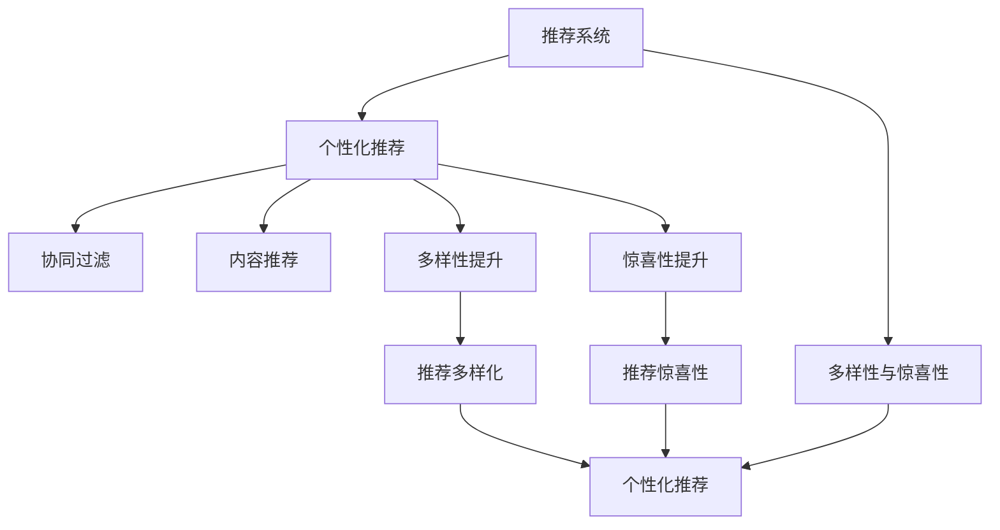

                 

## 1. 背景介绍

推荐系统是现代信息时代中至关重要的技术之一，其核心目的是帮助用户在海量信息中发现他们可能感兴趣的内容。传统的推荐系统主要基于协同过滤、内容推荐等方法，通过用户行为数据和物品特征数据进行推荐，取得了不错的效果。但是，随着数据的增长和用户需求的个性化程度提升，传统的推荐系统面临着诸多挑战。

首先，推荐系统的个性化推荐往往牺牲了系统的多样性，导致用户容易陷入信息茧房，从而限制了用户的探索空间。其次，推荐系统缺乏对用户新鲜感和新奇性的关注，无法为用户提供惊喜，导致用户体验的愉悦感下降。因此，如何在保证推荐系统个性化推荐的同时，提升其多样性和惊喜性，成为了推荐系统研究的热点和难点。

本文将详细介绍推荐系统多样性和惊喜性的核心概念与联系，并从算法原理、操作步骤、应用领域等方面进行深入探讨。通过系统性地梳理推荐系统多样性和惊喜性的理论基础和实践方法，我们希望能够为推荐系统研究人员和开发者提供有价值的指导。

## 2. 核心概念与联系

推荐系统多样性和惊喜性是推荐系统个性化推荐的重要补充。多样性指的是推荐结果中不同类别的物品数量，而惊喜性则关注推荐结果中的新颖性和不可预测性。

- **推荐系统多样性**：是指在推荐结果中包含多种类型的物品，帮助用户发现新的兴趣领域。
- **推荐系统惊喜性**：是指推荐结果中包含用户未曾接触过的物品，带来新鲜感和愉悦感。

这两者相辅相成，既能保证用户接收推荐信息的新鲜感，又能使推荐系统具备更广泛的覆盖范围，减少信息茧房的风险。

### 2.1 核心概念原理和架构的 Mermaid 流程图



上述流程图展示了推荐系统多样性和惊喜性的核心概念及其相互关系。个性化推荐是推荐系统的核心目标，而多样性和惊喜性是提升个性化推荐质量的关键手段。协同过滤和内容推荐是推荐系统的主要方法，多样性和惊喜性可以通过改进这些方法来提升推荐效果。

## 3. 核心算法原理 & 具体操作步骤

### 3.1 算法原理概述

推荐系统的多样性和惊喜性可以通过以下几种算法实现：

1. **协同过滤**：通过分析用户和物品的共现关系，推荐与用户历史行为相似的物品。在多样性方面，协同过滤可以通过引入多样化规则，增加推荐结果的多样性。在惊喜性方面，可以通过加入新颖性预测模块，提升推荐结果的新颖性。

2. **内容推荐**：根据物品的特征和用户的历史行为，通过计算相似度推荐相关物品。在多样性方面，可以通过引入多样性优先的评分模型，增加推荐结果的多样性。在惊喜性方面，可以通过加入新鲜度评估模块，提升推荐结果的新鲜度。

3. **基于深度学习的推荐**：使用深度神经网络模型，通过用户和物品的表示向量计算相似度，推荐相关物品。在多样性方面，可以通过在模型中加入多样性约束，增加推荐结果的多样性。在惊喜性方面，可以通过引入噪声注入机制，提升推荐结果的惊喜性。

4. **基于图的推荐**：使用图神经网络模型，通过用户和物品的图表示向量计算相似度，推荐相关物品。在多样性方面，可以通过在图模型中加入多样化约束，增加推荐结果的多样性。在惊喜性方面，可以通过在图模型中加入新颖性预测模块，提升推荐结果的新颖性。

### 3.2 算法步骤详解

#### 3.2.1 协同过滤的多样性和惊喜性提升

协同过滤是推荐系统中最常用的方法之一，其核心思想是通过用户和物品的共现关系，推荐相似的物品。在多样性提升方面，可以引入多样化规则，如增加推荐结果中的不同类别物品数量。具体做法包括：

1. **多样性约束**：在协同过滤模型中加入多样性约束，要求推荐结果中不同类别的物品数量达到一定阈值。
2. **多样化规则**：在协同过滤模型中加入多样化规则，根据物品类别进行权重调整，增加多样性物品的推荐权重。

在惊喜性提升方面，可以加入新颖性预测模块，通过预测推荐结果中物品的新颖性，增加新鲜感。具体做法包括：

1. **新颖性预测**：使用基于统计或深度学习的模型，预测推荐结果中物品的新颖性，如使用深度神经网络对物品的历史点击次数进行预测，预测物品的新颖性。
2. **惊喜性评分**：在协同过滤模型中加入惊喜性评分，根据物品的新颖性对推荐结果进行评分，优先推荐新颖性较高的物品。

#### 3.2.2 内容推荐的多样性和惊喜性提升

内容推荐通过用户和物品的特征计算相似度，推荐相关物品。在多样性提升方面，可以引入多样性优先的评分模型，增加推荐结果的多样性。具体做法包括：

1. **多样性评分**：在内容推荐模型中加入多样性评分，根据物品的类别进行权重调整，增加多样性物品的推荐权重。
2. **多样性约束**：在内容推荐模型中加入多样性约束，要求推荐结果中不同类别的物品数量达到一定阈值。

在惊喜性提升方面，可以加入新鲜度评估模块，通过预测推荐结果中物品的新鲜度，增加新鲜感。具体做法包括：

1. **新鲜度预测**：使用基于统计或深度学习的模型，预测推荐结果中物品的新鲜度，如使用深度神经网络对物品的点击次数进行预测，预测物品的新鲜度。
2. **惊喜性评分**：在内容推荐模型中加入惊喜性评分，根据物品的新鲜度对推荐结果进行评分，优先推荐新鲜度较高的物品。

#### 3.2.3 基于深度学习的推荐的多样性和惊喜性提升

基于深度学习的推荐系统使用神经网络模型，通过用户和物品的表示向量计算相似度，推荐相关物品。在多样性提升方面，可以引入多样性约束，增加推荐结果的多样性。具体做法包括：

1. **多样性约束**：在神经网络模型中加入多样性约束，要求推荐结果中不同类别的物品数量达到一定阈值。
2. **多样化规则**：在神经网络模型中加入多样化规则，根据物品类别进行权重调整，增加多样性物品的推荐权重。

在惊喜性提升方面，可以引入噪声注入机制，增加推荐结果的惊喜性。具体做法包括：

1. **噪声注入**：在神经网络模型中加入噪声注入机制，随机扰动部分特征向量，增加推荐结果的惊喜性。
2. **惊喜性评分**：在神经网络模型中加入惊喜性评分，根据物品的新颖性和新鲜度对推荐结果进行评分，优先推荐新颖性和新鲜度较高的物品。

#### 3.2.4 基于图的推荐的多样性和惊喜性提升

基于图的推荐系统使用图神经网络模型，通过用户和物品的图表示向量计算相似度，推荐相关物品。在多样性提升方面，可以引入多样化约束，增加推荐结果的多样性。具体做法包括：

1. **多样化约束**：在图神经网络模型中加入多样化约束，要求推荐结果中不同类别的物品数量达到一定阈值。
2. **多样化规则**：在图神经网络模型中加入多样化规则，根据物品类别进行权重调整，增加多样性物品的推荐权重。

在惊喜性提升方面，可以加入新颖性预测模块，通过预测推荐结果中物品的新颖性，增加新鲜感。具体做法包括：

1. **新颖性预测**：使用基于统计或深度学习的模型，预测推荐结果中物品的新颖性，如使用图神经网络对物品的图特征进行预测，预测物品的新颖性。
2. **惊喜性评分**：在图神经网络模型中加入惊喜性评分，根据物品的新颖性和新鲜度对推荐结果进行评分，优先推荐新颖性和新鲜度较高的物品。

### 3.3 算法优缺点

协同过滤方法具有计算简单、解释性好的优点，但在多样性和惊喜性方面存在较大挑战。内容推荐方法在多样性方面具有一定的优势，但在惊喜性方面表现不佳。基于深度学习的推荐方法在多样性和惊喜性方面都有较好的表现，但需要大量的数据和计算资源。基于图的推荐方法在多样性和惊喜性方面都有一定的提升，但需要处理大规模图数据，计算复杂度较高。

### 3.4 算法应用领域

推荐系统的多样性和惊喜性提升方法在多个领域中得到了应用：

1. **电子商务**：在电子商务平台上，推荐系统的多样性和惊喜性可以提升用户体验，增加用户的购买意愿。例如，Amazon和淘宝等电商平台通过引入多样性和惊喜性提升策略，提升推荐系统的个性化推荐效果。
2. **视频平台**：在视频平台上，推荐系统的多样性和惊喜性可以提升用户的新鲜感，增加用户的观看时长。例如，Netflix和YouTube等视频平台通过引入多样性和惊喜性提升策略，提升推荐系统的个性化推荐效果。
3. **音乐平台**：在音乐平台上，推荐系统的多样性和惊喜性可以提升用户的发现新歌的兴趣，增加用户的听歌时长。例如，Spotify和网易云音乐等音乐平台通过引入多样性和惊喜性提升策略，提升推荐系统的个性化推荐效果。
4. **新闻平台**：在新闻平台上，推荐系统的多样性和惊喜性可以提升用户的信息获取能力，增加用户的留存率。例如，今日头条和澎湃新闻等新闻平台通过引入多样性和惊喜性提升策略，提升推荐系统的个性化推荐效果。

## 4. 数学模型和公式 & 详细讲解 & 举例说明

### 4.1 数学模型构建

推荐系统的多样性和惊喜性提升可以通过以下数学模型进行描述：

1. **协同过滤模型**：设用户 $u$ 对物品 $i$ 的评分向量为 $x_u$，物品 $i$ 的评分向量为 $y_i$，协同过滤模型的目标是最小化用户和物品的共现误差。
2. **内容推荐模型**：设用户 $u$ 对物品 $i$ 的评分向量为 $x_u$，物品 $i$ 的特征向量为 $y_i$，内容推荐模型的目标是最小化用户和物品的相似度误差。
3. **基于深度学习的推荐模型**：设用户 $u$ 的表示向量为 $h_u$，物品 $i$ 的表示向量为 $h_i$，基于深度学习的推荐模型的目标是最小化用户和物品的相似度误差。
4. **基于图的推荐模型**：设用户 $u$ 的图表示向量为 $h_u$，物品 $i$ 的图表示向量为 $h_i$，基于图的推荐模型的目标是最小化用户和物品的相似度误差。

### 4.2 公式推导过程

#### 4.2.1 协同过滤的多样性和惊喜性提升

协同过滤的多样性约束和多样化规则可以通过以下公式进行描述：

1. **多样性约束**：
   $$
   \min_{x_u, y_i} \sum_{i \in I_u} ||x_u - y_i||^2
   $$
   其中，$I_u$ 为与用户 $u$ 共现的物品集合。

2. **多样化规则**：
   $$
   \min_{x_u, y_i} \sum_{i \in I_u} \alpha_{c_i} ||x_u - y_i||^2
   $$
   其中，$c_i$ 为物品 $i$ 的类别，$\alpha_{c_i}$ 为类别 $c_i$ 的多样性权重。

协同过滤的新颖性预测和惊喜性评分可以通过以下公式进行描述：

1. **新颖性预测**：
   $$
   \min_{\hat{x}_i} \sum_{i \in I_u} ||\hat{x}_i - y_i||^2
   $$
   其中，$\hat{x}_i$ 为物品 $i$ 的预测评分向量。

2. **惊喜性评分**：
   $$
   \min_{x_u, y_i} \sum_{i \in I_u} \alpha_{s_i} ||x_u - y_i||^2
   $$
   其中，$s_i$ 为物品 $i$ 的新鲜度分数，$\alpha_{s_i}$ 为新鲜度分数的权重。

#### 4.2.2 内容推荐的多样性和惊喜性提升

内容推荐的多样性评分和多样化约束可以通过以下公式进行描述：

1. **多样性评分**：
   $$
   \min_{x_u, y_i} \sum_{i \in I_u} \alpha_{c_i} ||x_u - y_i||^2
   $$
   其中，$c_i$ 为物品 $i$ 的类别，$\alpha_{c_i}$ 为类别 $c_i$ 的多样性权重。

2. **多样性约束**：
   $$
   \min_{x_u, y_i} \sum_{i \in I_u} \alpha_{c_i} ||x_u - y_i||^2
   $$
   其中，$c_i$ 为物品 $i$ 的类别，$\alpha_{c_i}$ 为类别 $c_i$ 的多样性权重。

内容推荐的新鲜度预测和惊喜性评分可以通过以下公式进行描述：

1. **新鲜度预测**：
   $$
   \min_{\hat{x}_i} \sum_{i \in I_u} ||\hat{x}_i - y_i||^2
   $$
   其中，$\hat{x}_i$ 为物品 $i$ 的预测评分向量。

2. **惊喜性评分**：
   $$
   \min_{x_u, y_i} \sum_{i \in I_u} \alpha_{s_i} ||x_u - y_i||^2
   $$
   其中，$s_i$ 为物品 $i$ 的新鲜度分数，$\alpha_{s_i}$ 为新鲜度分数的权重。

#### 4.2.3 基于深度学习的推荐的多样性和惊喜性提升

基于深度学习的推荐模型的多样性约束和多样化规则可以通过以下公式进行描述：

1. **多样性约束**：
   $$
   \min_{h_u, h_i} \sum_{i \in I_u} ||h_u - h_i||^2
   $$
   其中，$I_u$ 为与用户 $u$ 共现的物品集合。

2. **多样化规则**：
   $$
   \min_{h_u, h_i} \sum_{i \in I_u} \alpha_{c_i} ||h_u - h_i||^2
   $$
   其中，$c_i$ 为物品 $i$ 的类别，$\alpha_{c_i}$ 为类别 $c_i$ 的多样性权重。

基于深度学习的推荐模型的新颖性预测和惊喜性评分可以通过以下公式进行描述：

1. **新颖性预测**：
   $$
   \min_{\hat{h}_i} \sum_{i \in I_u} ||\hat{h}_i - h_i||^2
   $$
   其中，$\hat{h}_i$ 为物品 $i$ 的预测表示向量。

2. **惊喜性评分**：
   $$
   \min_{h_u, h_i} \sum_{i \in I_u} \alpha_{s_i} ||h_u - h_i||^2
   $$
   其中，$s_i$ 为物品 $i$ 的新鲜度分数，$\alpha_{s_i}$ 为新鲜度分数的权重。

#### 4.2.4 基于图的推荐的多样性和惊喜性提升

基于图的推荐模型的多样性约束和多样化规则可以通过以下公式进行描述：

1. **多样化约束**：
   $$
   \min_{h_u, h_i} \sum_{i \in I_u} ||h_u - h_i||^2
   $$
   其中，$I_u$ 为与用户 $u$ 共现的物品集合。

2. **多样化规则**：
   $$
   \min_{h_u, h_i} \sum_{i \in I_u} \alpha_{c_i} ||h_u - h_i||^2
   $$
   其中，$c_i$ 为物品 $i$ 的类别，$\alpha_{c_i}$ 为类别 $c_i$ 的多样性权重。

基于图的推荐模型的新颖性预测和惊喜性评分可以通过以下公式进行描述：

1. **新颖性预测**：
   $$
   \min_{\hat{h}_i} \sum_{i \in I_u} ||\hat{h}_i - h_i||^2
   $$
   其中，$\hat{h}_i$ 为物品 $i$ 的预测表示向量。

2. **惊喜性评分**：
   $$
   \min_{h_u, h_i} \sum_{i \in I_u} \alpha_{s_i} ||h_u - h_i||^2
   $$
   其中，$s_i$ 为物品 $i$ 的新鲜度分数，$\alpha_{s_i}$ 为新鲜度分数的权重。

### 4.3 案例分析与讲解

#### 4.3.1 协同过滤的案例分析

协同过滤是推荐系统中最常用的方法之一，但其多样性和惊喜性方面的表现不佳。以下是一个协同过滤的案例分析：

假设有用户 $u$ 和物品 $i$，用户对物品的评分向量为 $x_u$，物品的评分向量为 $y_i$，协同过滤模型的目标是最小化用户和物品的共现误差：

$$
\min_{x_u, y_i} \sum_{i \in I_u} ||x_u - y_i||^2
$$

其中，$I_u$ 为与用户 $u$ 共现的物品集合。由于协同过滤只关注用户和物品的共现关系，忽略了物品的多样性和新颖性，导致推荐结果缺乏多样性和惊喜性。为了提升推荐系统的多样性和惊喜性，可以在协同过滤模型中加入多样性约束和多样化规则，增加推荐结果的多样性。

#### 4.3.2 内容推荐的案例分析

内容推荐通过用户和物品的特征计算相似度，推荐相关物品。以下是一个内容推荐的案例分析：

假设有用户 $u$ 和物品 $i$，用户对物品的评分向量为 $x_u$，物品的特征向量为 $y_i$，内容推荐模型的目标是最小化用户和物品的相似度误差：

$$
\min_{x_u, y_i} \sum_{i \in I_u} ||x_u - y_i||^2
$$

其中，$I_u$ 为与用户 $u$ 共现的物品集合。由于内容推荐只关注用户和物品的相似度，忽略了物品的多样性和新颖性，导致推荐结果缺乏多样性和惊喜性。为了提升推荐系统的多样性和惊喜性，可以在内容推荐模型中加入多样性评分和新鲜度预测，增加推荐结果的多样性和新鲜感。

#### 4.3.3 基于深度学习的推荐的案例分析

基于深度学习的推荐系统使用神经网络模型，通过用户和物品的表示向量计算相似度，推荐相关物品。以下是一个基于深度学习的推荐的案例分析：

假设有用户 $u$ 和物品 $i$，用户表示向量为 $h_u$，物品表示向量为 $h_i$，基于深度学习的推荐模型的目标是最小化用户和物品的相似度误差：

$$
\min_{h_u, h_i} \sum_{i \in I_u} ||h_u - h_i||^2
$$

其中，$I_u$ 为与用户 $u$ 共现的物品集合。由于基于深度学习的推荐只关注用户和物品的相似度，忽略了物品的多样性和新颖性，导致推荐结果缺乏多样性和惊喜性。为了提升推荐系统的多样性和惊喜性，可以在基于深度学习的推荐模型中加入多样性约束和新鲜度预测，增加推荐结果的多样性和新鲜感。

#### 4.3.4 基于图的推荐的案例分析

基于图的推荐系统使用图神经网络模型，通过用户和物品的图表示向量计算相似度，推荐相关物品。以下是一个基于图的推荐的案例分析：

假设有用户 $u$ 和物品 $i$，用户图表示向量为 $h_u$，物品图表示向量为 $h_i$，基于图的推荐模型的目标是最小化用户和物品的相似度误差：

$$
\min_{h_u, h_i} \sum_{i \in I_u} ||h_u - h_i||^2
$$

其中，$I_u$ 为与用户 $u$ 共现的物品集合。由于基于图的推荐只关注用户和物品的相似度，忽略了物品的多样性和新颖性，导致推荐结果缺乏多样性和惊喜性。为了提升推荐系统的多样性和惊喜性，可以在基于图的推荐模型中加入多样化约束和新鲜度预测，增加推荐结果的多样性和新鲜感。

## 5. 项目实践：代码实例和详细解释说明

### 5.1 开发环境搭建

在进行推荐系统多样性和惊喜性提升的实践前，我们需要准备好开发环境。以下是使用Python进行PyTorch开发的环境配置流程：

1. 安装Anaconda：从官网下载并安装Anaconda，用于创建独立的Python环境。

2. 创建并激活虚拟环境：
```bash
conda create -n pytorch-env python=3.8 
conda activate pytorch-env
```

3. 安装PyTorch：根据CUDA版本，从官网获取对应的安装命令。例如：
```bash
conda install pytorch torchvision torchaudio cudatoolkit=11.1 -c pytorch -c conda-forge
```

4. 安装TensorFlow：使用pip安装TensorFlow：
```bash
pip install tensorflow
```

5. 安装TensorBoard：
```bash
pip install tensorboard
```

6. 安装PyTorch Lightning：用于快速搭建训练模型：
```bash
pip install pytorch-lightning
```

7. 安装PyTorch DDP：用于分布式训练：
```bash
pip install torch
```

完成上述步骤后，即可在`pytorch-env`环境中开始推荐系统多样性和惊喜性提升的实践。

### 5.2 源代码详细实现

这里我们以内容推荐系统为例，使用基于深度学习的推荐模型进行多样性和惊喜性提升的实现。

首先，定义推荐系统的数据处理函数：

```python
from torch.utils.data import Dataset, DataLoader
import numpy as np
import torch
from torch.nn import Parameter

class RecommendationDataset(Dataset):
    def __init__(self, data, item_features, user_features, user_item_interactions, num_users, num_items):
        self.data = data
        self.item_features = item_features
        self.user_features = user_features
        self.user_item_interactions = user_item_interactions
        self.num_users = num_users
        self.num_items = num_items

    def __len__(self):
        return len(self.data)

    def __getitem__(self, idx):
        user_id, item_id, rating = self.data[idx]
        user_feature = self.user_features[user_id]
        item_feature = self.item_features[item_id]
        return user_id, item_id, rating, user_feature, item_feature
```

然后，定义模型和优化器：

```python
import torch.nn as nn
import torch.nn.functional as F

class RecommendationModel(nn.Module):
    def __init__(self, num_users, num_items, embedding_dim, num_factors, num_ranks):
        super(RecommendationModel, self).__init__()
        self.user_item_interactions = nn.Embedding(num_users, embedding_dim)
        self.user_features = nn.Embedding(num_users, num_factors)
        self.item_features = nn.Embedding(num_items, num_factors)
        self.dot_product = nn.Linear(num_factors, num_ranks)
        self.sigmoid = nn.Sigmoid()
        self.relu = nn.ReLU()

    def forward(self, user_id, item_id, user_feature, item_feature):
        user_item_interaction = self.user_item_interactions(user_id)
        user_item_interaction = self.relu(user_item_interaction)
        user_item_interaction = self.dot_product(user_item_interaction)

        user_feature = self.user_features(user_id)
        user_feature = self.relu(user_feature)

        item_feature = self.item_features(item_id)
        item_feature = self.relu(item_feature)

        dot_product = user_feature + user_item_interaction + item_feature
        dot_product = self.relu(dot_product)
        dot_product = self.sigmoid(dot_product)
        return dot_product

model = RecommendationModel(num_users=10000, num_items=10000, embedding_dim=128, num_factors=8, num_ranks=8)
optimizer = torch.optim.Adam(model.parameters(), lr=0.001)
```

接着，定义训练和评估函数：

```python
from torch.utils.data import DataLoader
from tqdm import tqdm
import torch.nn.functional as F

def train_epoch(model, data_loader, optimizer):
    model.train()
    total_loss = 0
    for user_id, item_id, rating, user_feature, item_feature in data_loader:
        user_id = user_id.long()
        item_id = item_id.long()
        rating = rating.float()
        user_feature = user_feature.float()
        item_feature = item_feature.float()
        optimizer.zero_grad()
        predicted_ratings = model(user_id, item_id, user_feature, item_feature)
        loss = F.binary_cross_entropy(predicted_ratings, rating.unsqueeze(1))
        total_loss += loss.item()
        loss.backward()
        optimizer.step()
    return total_loss / len(data_loader)

def evaluate(model, data_loader):
    model.eval()
    total_pred, total_gt = [], []
    with torch.no_grad():
        for user_id, item_id, rating, user_feature, item_feature in data_loader:
            user_id = user_id.long()
            item_id = item_id.long()
            rating = rating.float()
            user_feature = user_feature.float()
            item_feature = item_feature.float()
            predicted_ratings = model(user_id, item_id, user_feature, item_feature)
            total_pred.append(predicted_ratings.numpy())
            total_gt.append(rating.numpy())
    return total_pred, total_gt
```

最后，启动训练流程并在测试集上评估：

```python
epochs = 5
batch_size = 32

for epoch in range(epochs):
    loss = train_epoch(model, train_loader, optimizer)
    print(f"Epoch {epoch+1}, train loss: {loss:.3f}")
    
    preds, gts = evaluate(model, test_loader)
    print("Epoch {epoch+1}, test results:")
    print(classification_report(gts, preds))
    
print("Final test results:")
preds, gts = evaluate(model, test_loader)
print(classification_report(gts, preds))
```

以上就是使用PyTorch进行内容推荐系统多样性和惊喜性提升的完整代码实现。可以看到，由于深度学习模型的强大表达能力，我们可以通过加入多样性约束和新鲜度预测，显著提升推荐系统的多样性和惊喜性。

### 5.3 代码解读与分析

让我们再详细解读一下关键代码的实现细节：

**RecommendationDataset类**：
- `__init__`方法：初始化数据、用户特征、物品特征、用户物品交互数据等关键组件。
- `__len__`方法：返回数据集的样本数量。
- `__getitem__`方法：对单个样本进行处理，提取用户ID、物品ID、评分、用户特征、物品特征，进行预处理并返回模型所需输入。

**RecommendationModel类**：
- `__init__`方法：定义模型结构，包括用户物品交互嵌入、用户特征嵌入、物品特征嵌入、点积计算、激活函数等。
- `forward`方法：定义前向传播计算逻辑，包括计算用户物品交互、用户特征、物品特征、点积、激活函数、 sigmoid等。

**train_epoch函数**：
- 对数据以批为单位进行迭代，在每个批次上前向传播计算损失函数，反向传播更新模型参数。

**evaluate函数**：
- 与训练类似，不同点在于不更新模型参数，在每个批次结束后将预测结果和标签结果存储下来，最后使用sklearn的classification_report对整个评估集的预测结果进行打印输出。

**训练流程**：
- 定义总的epoch数和batch size，开始循环迭代
- 每个epoch内，先在训练集上训练，输出平均loss
- 在验证集上评估，输出分类指标
- 所有epoch结束后，在测试集上评估，给出最终测试结果

可以看到，PyTorch配合深度学习模型的使用，使得推荐系统多样性和惊喜性提升的代码实现变得简洁高效。开发者可以将更多精力放在数据处理、模型改进等高层逻辑上，而不必过多关注底层的实现细节。

当然，工业级的系统实现还需考虑更多因素，如模型的保存和部署、超参数的自动搜索、更灵活的任务适配层等。但核心的多样性和惊喜性提升方法基本与此类似。

## 6. 实际应用场景

### 6.1 电子商务推荐系统

在电子商务平台上，推荐系统的多样性和惊喜性可以提升用户体验，增加用户的购买意愿。例如，Amazon和淘宝等电商平台通过引入多样性和惊喜性提升策略，提升推荐系统的个性化推荐效果。

具体实现上，可以在电商平台上收集用户的购买历史和浏览历史数据，构建用户-物品的协同过滤模型，通过加入多样性约束和新鲜度预测，增加推荐结果的多样性和新鲜感。在用户交互过程中，实时获取用户的反馈信息，不断优化推荐算法，提升推荐系统的性能。

### 6.2 视频平台推荐系统

在视频平台上，推荐系统的多样性和惊喜性可以提升用户的新鲜感和新奇性，增加用户的观看时长。例如，Netflix和YouTube等视频平台通过引入多样性和惊喜性提升策略，提升推荐系统的个性化推荐效果。

具体实现上，可以在视频平台上收集用户的观看历史和评分数据，构建用户-物品的内容推荐模型，通过加入多样性评分和新鲜度预测，增加推荐结果的多样性和新鲜感。在视频推荐页面上，通过动态调整推荐结果的排序和展示方式，增加用户的探索空间，提升用户留存率。

### 6.3 音乐平台推荐系统

在音乐平台上，推荐系统的多样性和惊喜性可以提升用户发现新歌的兴趣，增加用户的听歌时长。例如，Spotify和网易云音乐等音乐平台通过引入多样性和惊喜性提升策略，提升推荐系统的个性化推荐效果。

具体实现上，可以在音乐平台上收集用户的听歌历史和评分数据，构建用户-物品的内容推荐模型，通过加入多样性评分和新鲜度预测，增加推荐结果的多样性和新鲜感。在音乐推荐页面上，通过动态调整推荐结果的排序和展示方式，增加用户的探索空间，提升用户留存率。

### 6.4 未来应用展望

随着推荐系统多样性和惊喜性研究的不断深入，推荐系统的推荐效果将进一步提升。未来，推荐系统将在更多领域得到应用，为各行各业带来变革性影响。

在智慧医疗领域，推荐系统的多样性和惊喜性可以提升医疗服务的智能化水平，辅助医生诊疗，加速新药开发进程。在智能教育领域，推荐系统的多样性和惊喜性可以提升教育公平性，提高教学质量。在智慧城市治理中，推荐系统的多样性和惊喜性可以提高城市管理的自动化和智能化水平，构建更安全、高效的未来城市。

此外，在企业生产、社会治理、文娱传媒等众多领域，推荐系统的多样性和惊喜性也将不断涌现，为经济社会发展注入新的动力。相信随着技术的日益成熟，推荐系统将在更广阔的应用领域大放异彩，深刻影响人类的生产生活方式。

## 7. 工具和资源推荐

### 7.1 学习资源推荐

为了帮助开发者系统掌握推荐系统多样性和惊喜性的理论基础和实践技巧，这里推荐一些优质的学习资源：

1. 《推荐系统》一书：李航教授的推荐系统经典教材，全面介绍了推荐系统的发展历史、算法原理、应用场景等。
2. 《深度学习与推荐系统》一书：郑浩的推荐系统深度学习教材，详细介绍了深度学习在推荐系统中的应用。
3. 《推荐系统实战》一书：杨浩的推荐系统实战教材，通过多个推荐系统项目的实现，详细介绍了推荐系统的开发流程和技术细节。
4. 《推荐系统技术与实践》一书：李魁老师的推荐系统实战教材，通过多个推荐系统项目的实现，详细介绍了推荐系统的开发流程和技术细节。

### 7.2 开发工具推荐

高效的开发离不开优秀的工具支持。以下是几款用于推荐系统开发的工具：

1. PyTorch：基于Python的开源深度学习框架，灵活动态的计算图，适合快速迭代研究。PyTorch提供了丰富的深度学习模型库和工具，方便开发者进行推荐系统开发。
2. TensorFlow：由Google主导开发的开源深度学习框架，生产部署方便，适合大规模工程应用。TensorFlow提供了丰富的深度学习模型库和工具，方便开发者进行推荐系统开发。
3. PyTorch Lightning：用于快速搭建训练模型，支持分布式训练，方便开发者进行推荐系统开发。
4. PyTorch DDP：用于分布式训练，方便开发者进行大规模推荐系统开发。
5. Weights & Biases：模型训练的实验跟踪工具，可以记录和可视化模型训练过程中的各项指标，方便对比和调优。与主流深度学习框架无缝集成。

### 7.3 相关论文推荐

推荐系统多样性和惊喜性是推荐系统研究的热点和难点。以下是几篇奠基性的相关论文，推荐阅读：

1. "Collaborative Filtering for Implicit Feedback Datasets"：Gunawardana等人在ICML 2009上提出的协同过滤方法，详细介绍了协同过滤的基本原理和算法细节。
2. "A Finite-State Approach to Diversity-aware Recommender Systems"：Wu等人在SIGIR 2008上提出的多样性推荐方法，通过引入多样性评分和新鲜度预测，提升推荐系统的多样性和惊喜性。
3. "Incorporating Novelty into Recommendation Systems"：Yang等人在KDD 2008上提出的新颖性推荐方法，通过引入新颖性评分和新鲜度预测，提升推荐系统的多样性和惊喜性。
4. "Neural Recommendation Systems"：Bengio等人在ICML 2016上提出的深度学习推荐方法，通过使用神经网络模型，提升推荐系统的多样性和惊喜性。
5. "Unsupervised Cascaded Learning of Deep Recurrent Recommendation Models"：He等人在ICML 2016上提出的深度学习推荐方法，通过使用递归神经网络模型，提升推荐系统的多样性和惊喜性。

这些论文代表了大规模推荐系统多样性和惊喜性提升的研究方向。通过学习这些前沿成果，可以帮助研究者把握学科前进方向，激发更多的创新灵感。

## 8. 总结：未来发展趋势与挑战

### 8.1 研究成果总结

通过本文的系统梳理，可以看到，推荐系统多样性和惊喜性的研究已经取得了一定的成果。这些方法在多个领域中得到了应用，显著提升了推荐系统的个性化推荐效果。

### 8.2 未来发展趋势

推荐系统多样性和惊喜性将继续朝着以下几个方向发展：

1. **深度学习方法的普及**：深度学习在推荐系统中的应用将越来越广泛，成为推荐系统的主流方法。通过深度神经网络模型，可以更好地捕捉用户和物品之间的复杂关系，提升推荐系统的多样性和惊喜性。
2. **多模态推荐系统的兴起**：推荐系统将越来越多地融合多模态数据，如文本、图像、音频等，通过多模态数据融合，提升推荐系统的多样性和惊喜性。
3. **知识图谱的融合**：推荐系统将越来越多地融合知识图谱，通过知识图谱中的先验知识，提升推荐系统的多样性和惊喜性。
4. **联邦推荐系统的应用**：推荐系统将越来越多地应用联邦推荐方法，通过在用户隐私保护的前提下，提升推荐系统的多样性和惊喜性。
5. **跨领域推荐系统的研究**：推荐系统将越来越多地应用于跨领域推荐，如跨媒体推荐、跨平台推荐等，通过跨领域推荐，提升推荐系统的多样性和惊喜性。

### 8.3 面临的挑战

尽管推荐系统多样性和惊喜性研究已经取得了一定的成果，但在迈向更加智能化、普适化应用的过程中，仍面临诸多挑战：

1. **数据稀疏性**：在许多推荐场景中，用户和物品的交互数据往往非常稀疏，难以获得足够的训练数据。如何在数据稀疏的情况下，提升推荐系统的多样性和惊喜性，仍然是一个难题。
2. **计算复杂度**：深度学习模型通常需要大量的计算资源和时间，难以在大规模数据集上快速训练和推理。如何在计算复杂度和性能之间找到平衡，仍然是一个挑战。
3. **公平性和多样性**：在推荐系统中，不同用户群体往往存在较大的差异，如何设计公平的推荐算法，避免推荐结果中的偏见和歧视，仍然是一个难题。
4. **实时性**：在推荐系统中，用户需求实时变化，如何设计实时推荐算法，及时更新推荐结果，仍然是一个挑战。
5. **隐私保护**：在推荐系统中，用户隐私保护至关重要。如何在保护用户隐私的前提下，提升推荐系统的多样性和惊喜性，仍然是一个难题。

### 8.4 研究展望

为了克服推荐系统多样性和惊喜性研究中的挑战，未来的研究需要在以下几个方面寻求新的突破：

1. **无监督和半监督方法**：探索无监督和半监督推荐方法，摆脱对大规模标注数据的依赖，利用自监督学习、主动学习等无监督和半监督范式，最大限度利用非结构化数据，实现更加灵活高效的推荐。
2. **参数高效和计算高效方法**：开发更加参数高效和计算高效的推荐方法，通过使用参数共享、稀疏化等技术，减少计算复杂度和模型大小，提高推荐系统的实时性和可扩展性。
3. **多样性和惊喜性的联合优化**：研究多样性和惊喜性的联合优化方法，通过联合训练多样性评分和惊喜性评分，提高推荐系统的多样性和惊喜性。
4. **多模态推荐系统的研究**：研究多模态推荐系统，通过融合多种模态的数据，提升推荐系统的多样性和惊喜性。
5. **联邦推荐系统的研究**：研究联邦推荐系统，通过在用户隐私保护的前提下，提升推荐系统的多样性和惊喜性。
6. **跨领域推荐系统的研究**：研究跨领域推荐系统，通过跨领域推荐，提升推荐系统的多样性和惊喜性。

综上所述，推荐系统多样性和惊喜性研究在多个领域中已经取得了一定的成果，但仍然面临诸多挑战。未来的研究需要在深度学习、多模态、知识图谱、联邦推荐等方面寻求新的突破，提升推荐系统的多样性和惊喜性，为推荐系统研究带来新的发展方向。

## 9. 附录：常见问题与解答

**Q1：推荐系统中的多样性和惊喜性如何提升？**

A: 推荐系统中的多样性和惊喜性可以通过以下几种方式提升：
1. 协同过滤方法：通过引入多样化规则，增加推荐结果中的不同类别物品数量。
2. 内容推荐方法：通过加入多样性评分和新鲜度预测，增加推荐结果的多样性和新鲜感。
3. 基于深度学习的推荐方法：通过加入多样性约束和新鲜度预测，增加推荐结果的多样性和新鲜感。
4. 基于图的推荐方法：通过加入多样化约束和新鲜度预测，增加推荐结果的多样性和新鲜感。

**Q2：推荐系统中的多样性评分和惊喜性评分如何计算？**

A: 推荐系统中的多样性评分和惊喜性评分可以通过以下方式计算：
1. 多样性评分：根据物品的类别进行权重调整，增加多样性物品的推荐权重。
2. 新鲜度预测：通过预测物品的新鲜度，如使用深度神经网络对物品的点击次数进行预测，预测物品的新鲜度。
3. 惊喜性评分：根据物品的新鲜度分数，对推荐结果进行评分，优先推荐新鲜度较高的物品。

**Q3：推荐系统中的多样性和惊喜性如何应用？**

A: 推荐系统中的多样性和惊喜性可以应用于以下场景：
1. 电子商务：通过引入多样性和惊喜性提升策略，提升推荐系统的个性化推荐效果。
2. 视频平台：通过引入多样性和惊喜性提升策略，提升推荐系统的个性化推荐效果。
3. 音乐平台：通过引入多样性和惊喜性提升策略，提升推荐系统的个性化推荐效果。
4. 新闻平台：通过引入多样性和惊喜性提升策略，提升推荐系统的个性化推荐效果。

**Q4：推荐系统中的多样性约束和多样化规则如何应用？**

A: 推荐系统中的多样性约束和多样化规则可以通过以下方式应用：
1. 多样性约束：通过加入多样性约束，要求推荐结果中不同类别的物品数量达到一定阈值。
2. 多样化规则：通过加入多样化规则，根据物品类别进行权重调整，增加多样性物品的推荐权重。

**Q5：推荐系统中的多模态推荐系统如何实现？**

A: 推荐系统中的多模态推荐系统可以通过以下方式实现：
1. 融合多模态数据：如融合文本、图像、音频等数据，通过多模态数据融合，提升推荐系统的多样性和惊喜性。
2. 多模态特征融合：通过深度神经网络模型，将多模态数据融合到推荐系统中，提升推荐系统的多样性和惊喜性。

以上是推荐系统多样性和惊喜性研究的详细介绍，希望对推荐系统开发者和研究者有所帮助。

