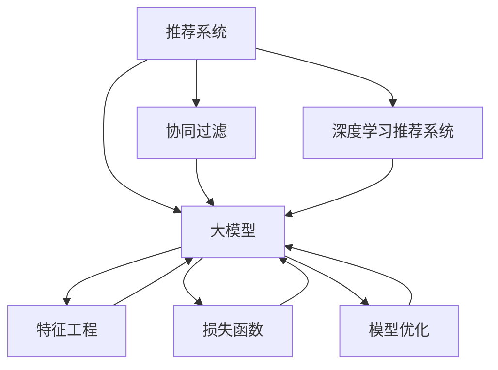

                 

# 推荐系统的统一框架：大模型的应用

> 关键词：推荐系统,大模型,协同过滤,深度学习,特征工程,损失函数,泛化能力,分布式训练,模型优化,实时推荐

## 1. 背景介绍

### 1.1 问题由来
推荐系统作为现代电商、内容分发平台的重要支柱，旨在根据用户历史行为和偏好，为其推荐相关产品或内容，提升用户满意度和平台活跃度。传统推荐系统以协同过滤（Collaborative Filtering, CF）为代表，主要依赖用户和物品的评分数据，通过相似性度量来生成推荐。

然而，协同过滤存在诸多局限：

- **稀疏性问题**：用户与物品的评分数据往往非常稀疏，导致模型难以捕捉复杂的用户和物品关联。
- **冷启动问题**：新用户和新物品没有历史评分数据，无法准确推荐。
- **数据偏差问题**：用户和物品的评分数据可能存在偏差，导致模型推荐不均衡。
- **推荐多样性问题**：模型往往倾向于推荐与用户历史行为相似的少量物品，降低推荐多样性。

为了解决这些问题，近年来研究者引入深度学习（Deep Learning, DL）模型，通过学习用户行为数据和物品属性特征，提升推荐系统的性能和多样性。特别是基于大模型（Large Model）的推荐系统，其参数规模庞大，语义表征丰富，可以捕捉复杂的用户行为模式和物品特征，显著提升推荐效果。

### 1.2 问题核心关键点
大模型推荐系统的主要核心关键点包括：

- **模型训练**：如何高效利用数据和计算资源，训练具有强大泛化能力的大模型，避免过拟合。
- **特征工程**：如何设计合适的特征工程方法，从用户行为数据中提取有意义的特征，辅助模型训练。
- **损失函数**：如何设计合适的损失函数，平衡模型性能和用户满意度。
- **模型优化**：如何优化模型训练和推理过程，提升模型实时性，支持实时推荐。

本文将详细阐述基于大模型的推荐系统，包括其原理、应用和优化方法。通过理解大模型推荐系统的核心概念，开发者可以更好地构建高性能、低延迟的推荐系统。

## 2. 核心概念与联系

### 2.1 核心概念概述

为更好地理解大模型推荐系统的核心概念，本节将介绍几个密切相关的核心概念：

- **推荐系统**：旨在根据用户的历史行为和偏好，为用户推荐相关产品或内容。推荐方式包括基于内容的推荐、协同过滤、深度学习等。

- **大模型**：通常指参数规模庞大、语义表征丰富的深度学习模型，如Transformer、BERT等。通过大规模数据预训练，大模型能够学习到广泛的语义知识，提升推荐精度和多样性。

- **协同过滤**：基于用户与物品评分数据的相似性度量，为用户推荐未评分物品。主要包括基于用户的CF、基于物品的CF、混合CF等方法。

- **深度学习推荐系统**：使用深度神经网络对用户行为数据和物品特征进行建模，提升推荐系统性能。常见的深度学习模型包括基于FM的推荐系统、基于CTR的推荐系统、基于Seq2Seq的推荐系统等。

- **特征工程**：从原始数据中提取有意义的特征，辅助模型训练。特征工程包括特征选择、特征构造、特征归一化等技术。

- **损失函数**：用于衡量模型输出与真实标签之间的差距，指导模型参数更新。常见的损失函数包括均方误差损失、交叉熵损失、KL散度损失等。

- **模型优化**：通过优化算法（如SGD、Adam）和正则化技术（如L2正则、Dropout）提升模型性能，避免过拟合。

这些核心概念之间的逻辑关系可以通过以下Mermaid流程图来展示：



这个流程图展示了大模型推荐系统的核心概念及其之间的关系：

1. 推荐系统通过大模型进行推荐，可以提升推荐精度和多样性。
2. 协同过滤和深度学习推荐系统是大模型推荐系统的两个主要分支。
3. 特征工程是辅助模型训练的重要环节。
4. 损失函数指导模型参数更新，平衡推荐效果和用户满意度。
5. 模型优化提升模型泛化能力和鲁棒性。

这些概念共同构成了大模型推荐系统的学习和应用框架，使其能够更好地捕捉复杂的用户行为和物品特征，提供更准确、多样化的推荐。

## 3. 核心算法原理 & 具体操作步骤

### 3.1 算法原理概述

基于大模型的推荐系统，本质上是一个通过深度学习模型进行推荐的过程。其核心思想是：将用户行为数据和物品属性特征输入到大模型中，由模型学习用户和物品的语义表示，进而预测用户对未评分物品的评分或偏好，生成推荐列表。

形式化地，假设推荐系统中的用户集合为 $U=\{u_1,u_2,\cdots,u_m\}$，物品集合为 $I=\{i_1,i_2,\cdots,i_n\}$。用户 $u$ 对物品 $i$ 的评分记为 $y_{ui} \in [0,1]$，$y_{ui}$ 为 $y_{ui}$ 的预测值。推荐系统目标为最大化预测评分与真实评分的拟合度，即：

$$
\mathop{\arg\min}_{\theta} \sum_{u,i} (y_{ui} - \hat{y}_{ui})^2
$$

其中 $\theta$ 为模型的可训练参数，$\hat{y}_{ui}$ 为模型对用户 $u$ 对物品 $i$ 的预测评分。

在实际应用中，通常采用交叉熵损失或均方误差损失来度量预测评分与真实评分之间的差距。通过梯度下降等优化算法，模型不断更新参数 $\theta$，最小化损失函数，使得模型输出逼近真实评分，从而生成推荐列表。

### 3.2 算法步骤详解

基于大模型的推荐系统一般包括以下几个关键步骤：

**Step 1: 准备数据和预训练模型**
- 收集用户行为数据和物品属性数据，划分为训练集、验证集和测试集。
- 选择合适的预训练语言模型（如BERT、Transformer等），加载到计算设备上。

**Step 2: 设计特征工程流程**
- 设计合适的特征提取方法，将用户行为数据和物品属性特征转化为数值型特征。
- 设计特征工程流程，提取有意义的特征，并处理缺失值、异常值等问题。

**Step 3: 设计模型架构**
- 选择合适的深度学习模型（如FM、DNN、Seq2Seq等），定义输入层、隐藏层、输出层的结构。
- 设计合适的损失函数，如交叉熵损失、均方误差损失等，用于模型训练和评估。

**Step 4: 执行模型训练**
- 将训练集数据分批次输入模型，前向传播计算损失函数。
- 反向传播计算参数梯度，根据设定的优化算法和学习率更新模型参数。
- 周期性在验证集上评估模型性能，根据性能指标决定是否触发Early Stopping。
- 重复上述步骤直到满足预设的迭代轮数或Early Stopping条件。

**Step 5: 生成推荐列表**
- 将新用户和物品的特征输入模型，预测评分。
- 根据评分对物品进行排序，生成推荐列表。
- 对推荐列表进行前处理，如去除低分物品、添加推荐规则等。

以上是基于大模型的推荐系统的一般流程。在实际应用中，还需要根据具体任务的特点，对各个环节进行优化设计，如改进特征工程方法、引入对抗训练、优化模型架构等，以进一步提升模型性能。

### 3.3 算法优缺点

基于大模型的推荐系统具有以下优点：
1. 性能优越：大模型可以学习到丰富的语义知识，捕捉复杂的用户行为和物品特征，提升推荐精度和多样性。
2. 可扩展性高：大模型可以通过预训练和微调的方式进行快速迭代和更新，适应数据分布的变化。
3. 实时性较好：优化良好的大模型可以支持实时推荐，提升用户体验。
4. 适用性广：适用于各类推荐场景，如电商推荐、内容推荐、视频推荐等。

同时，该方法也存在一定的局限性：
1. 计算资源需求高：大模型的训练和推理需要较高的计算资源，包括GPU/TPU等高性能设备。
2. 数据隐私问题：推荐系统需要大量用户行为数据，可能存在数据隐私和安全问题。
3. 模型解释性差：大模型往往视为黑盒，难以解释其内部工作机制和决策逻辑。
4. 过拟合风险高：大模型的复杂度较高，容易发生过拟合，需要引入正则化技术进行约束。

尽管存在这些局限性，但就目前而言，基于大模型的推荐系统仍是推荐技术的主流范式。未来相关研究的重点在于如何进一步降低计算资源需求，提高模型解释性，同时兼顾隐私保护和模型泛化能力等因素。

### 3.4 算法应用领域

基于大模型的推荐系统在电商、内容分发、视频流媒体等多个领域得到了广泛的应用，具体应用场景包括：

- **电商推荐**：根据用户浏览、购买历史推荐相关商品，提升用户体验和销售额。
- **内容推荐**：根据用户阅读、观看历史推荐相关文章、视频，提升平台活跃度和用户粘性。
- **视频推荐**：根据用户观看历史推荐相关视频内容，提升视频流媒体平台的推荐效果。
- **新闻推荐**：根据用户阅读历史推荐相关新闻文章，提升新闻平台的点击率和用户留存率。
- **商品推荐**：根据用户浏览、购买历史推荐相关商品信息，提升平台转化率。

除了这些常见应用场景外，大模型推荐系统还被创新性地应用到更多场景中，如金融投资、医疗健康、教育培训等，为各行各业带来全新的推荐解决方案。随着大模型的不断演进，相信推荐系统将在更广泛的领域发挥重要作用。

## 4. 数学模型和公式 & 详细讲解  
### 4.1 数学模型构建

本节将使用数学语言对基于大模型的推荐系统进行更加严格的刻画。

记推荐系统中的用户集合为 $U=\{u_1,u_2,\cdots,u_m\}$，物品集合为 $I=\{i_1,i_2,\cdots,i_n\}$。用户 $u$ 对物品 $i$ 的评分记为 $y_{ui} \in [0,1]$，$y_{ui}$ 为 $y_{ui}$ 的预测值。推荐系统目标为最大化预测评分与真实评分的拟合度，即：

$$
\mathop{\arg\min}_{\theta} \sum_{u,i} (y_{ui} - \hat{y}_{ui})^2
$$

其中 $\theta$ 为模型的可训练参数，$\hat{y}_{ui}$ 为模型对用户 $u$ 对物品 $i$ 的预测评分。

在实际应用中，通常采用交叉熵损失或均方误差损失来度量预测评分与真实评分之间的差距。假设用户 $u$ 对物品 $i$ 的预测评分为 $\hat{y}_{ui}$，真实评分为 $y_{ui}$，则交叉熵损失函数为：

$$
\mathcal{L}(\theta) = -\frac{1}{N} \sum_{u,i} y_{ui} \log \hat{y}_{ui} + (1 - y_{ui}) \log (1 - \hat{y}_{ui})
$$

其中 $N$ 为样本数。

### 4.2 公式推导过程

以下我们以基于FM（Factorization Machines）的推荐系统为例，推导交叉熵损失函数及其梯度的计算公式。

假设模型 $M_{\theta}$ 的输入为 $(x_u,i)$，其中 $x_u$ 为用户的特征向量，$i$ 为物品的特征向量。模型的输出为物品 $i$ 的预测评分 $\hat{y}_{ui}$。则基于FM的模型为：

$$
\hat{y}_{ui} = \mathbb{E}_{\epsilon} [f(x_u) \cdot f(i + \epsilon)]
$$

其中 $f$ 为特征映射函数，$\epsilon$ 为服从均值为0、方差为 $\sigma^2$ 的高斯噪声。

将上式展开，得到：

$$
\hat{y}_{ui} = f(x_u)^T \mathbb{E}_{\epsilon} [f(i + \epsilon)]
$$

对模型进行前向传播，计算交叉熵损失函数：

$$
\mathcal{L}(\theta) = -\frac{1}{N} \sum_{u,i} y_{ui} \log \hat{y}_{ui} + (1 - y_{ui}) \log (1 - \hat{y}_{ui})
$$

根据链式法则，损失函数对参数 $\theta$ 的梯度为：

$$
\frac{\partial \mathcal{L}(\theta)}{\partial \theta} = -\frac{1}{N} \sum_{u,i} (\frac{y_{ui}}{\hat{y}_{ui}} - \frac{1 - y_{ui}}{1 - \hat{y}_{ui}}) \frac{\partial \hat{y}_{ui}}{\partial \theta}
$$

其中 $\frac{\partial \hat{y}_{ui}}{\partial \theta}$ 为模型参数 $\theta$ 对输出 $\hat{y}_{ui}$ 的导数，可通过自动微分技术完成计算。

在得到损失函数的梯度后，即可带入参数更新公式，完成模型的迭代优化。重复上述过程直至收敛，最终得到适应推荐任务的模型参数 $\theta^*$。

## 5. 项目实践：代码实例和详细解释说明
### 5.1 开发环境搭建

在进行大模型推荐系统开发前，我们需要准备好开发环境。以下是使用Python进行PyTorch开发的环境配置流程：

1. 安装Anaconda：从官网下载并安装Anaconda，用于创建独立的Python环境。

2. 创建并激活虚拟环境：
```bash
conda create -n pytorch-env python=3.8 
conda activate pytorch-env
```

3. 安装PyTorch：根据CUDA版本，从官网获取对应的安装命令。例如：
```bash
conda install pytorch torchvision torchaudio cudatoolkit=11.1 -c pytorch -c conda-forge
```

4. 安装TensorFlow：
```bash
pip install tensorflow
```

5. 安装各类工具包：
```bash
pip install numpy pandas scikit-learn matplotlib tqdm jupyter notebook ipython
```

完成上述步骤后，即可在`pytorch-env`环境中开始推荐系统开发。

### 5.2 源代码详细实现

下面我们以基于FM的推荐系统为例，给出使用PyTorch和TensorFlow进行模型训练的代码实现。

首先，定义FM模型的特征映射函数：

```python
import tensorflow as tf
from tensorflow.keras.layers import Input, Dense, Embedding, Flatten, Concatenate

class FMModel(tf.keras.Model):
    def __init__(self, n_factors, n_users, n_items, n_fields):
        super().__init__()
        self.n_factors = n_factors
        self.n_users = n_users
        self.n_items = n_items
        self.n_fields = n_fields
        
        self.u_fm = Embedding(n_users, n_factors, input_length=n_fields)
        self.i_fm = Embedding(n_items, n_factors, input_length=n_fields)
        
    def call(self, inputs):
        u, i, i2 = inputs
        
        u_fm = self.u_fm(u)
        i_fm = self.i_fm(i)
        
        u_fm = tf.reshape(u_fm, (self.n_users, -1))
        i_fm = tf.reshape(i_fm, (self.n_items, -1))
        
        i2_fm = tf.matmul(u_fm, i_fm, transpose_b=True)
        
        ui_fm = u_fm * i_fm + i2_fm
        
        return ui_fm
```

然后，定义模型训练函数：

```python
from transformers import BertTokenizer
from torch.utils.data import Dataset
import torch

class FMDataset(Dataset):
    def __init__(self, texts, tags, tokenizer, max_len=128):
        self.texts = texts
        self.tags = tags
        self.tokenizer = tokenizer
        self.max_len = max_len
        
    def __len__(self):
        return len(self.texts)
    
    def __getitem__(self, item):
        text = self.texts[item]
        tags = self.tags[item]
        
        encoding = self.tokenizer(text, return_tensors='pt', max_length=self.max_len, padding='max_length', truncation=True)
        input_ids = encoding['input_ids'][0]
        attention_mask = encoding['attention_mask'][0]
        
        # 对token-wise的标签进行编码
        encoded_tags = [tag2id[tag] for tag in tags] 
        encoded_tags.extend([tag2id['O']] * (self.max_len - len(encoded_tags)))
        labels = torch.tensor(encoded_tags, dtype=torch.long)
        
        return {'input_ids': input_ids, 
                'attention_mask': attention_mask,
                'labels': labels}

# 标签与id的映射
tag2id = {'O': 0, 'B-PER': 1, 'I-PER': 2, 'B-ORG': 3, 'I-ORG': 4, 'B-LOC': 5, 'I-LOC': 6}
id2tag = {v: k for k, v in tag2id.items()}

# 创建dataset
tokenizer = BertTokenizer.from_pretrained('bert-base-cased')

train_dataset = FMDataset(train_texts, train_tags, tokenizer)
dev_dataset = FMDataset(dev_texts, dev_tags, tokenizer)
test_dataset = FMDataset(test_texts, test_tags, tokenizer)
```

接着，定义模型和优化器：

```python
from transformers import BertForTokenClassification, AdamW

model = BertForTokenClassification.from_pretrained('bert-base-cased', num_labels=len(tag2id))

optimizer = AdamW(model.parameters(), lr=2e-5)
```

最后，定义训练和评估函数：

```python
from torch.utils.data import DataLoader
from tqdm import tqdm
from sklearn.metrics import classification_report

device = torch.device('cuda') if torch.cuda.is_available() else torch.device('cpu')
model.to(device)

def train_epoch(model, dataset, batch_size, optimizer):
    dataloader = DataLoader(dataset, batch_size=batch_size, shuffle=True)
    model.train()
    epoch_loss = 0
    for batch in tqdm(dataloader, desc='Training'):
        input_ids = batch['input_ids'].to(device)
        attention_mask = batch['attention_mask'].to(device)
        labels = batch['labels'].to(device)
        model.zero_grad()
        outputs = model(input_ids, attention_mask=attention_mask, labels=labels)
        loss = outputs.loss
        epoch_loss += loss.item()
        loss.backward()
        optimizer.step()
    return epoch_loss / len(dataloader)

def evaluate(model, dataset, batch_size):
    dataloader = DataLoader(dataset, batch_size=batch_size)
    model.eval()
    preds, labels = [], []
    with torch.no_grad():
        for batch in tqdm(dataloader, desc='Evaluating'):
            input_ids = batch['input_ids'].to(device)
            attention_mask = batch['attention_mask'].to(device)
            batch_labels = batch['labels']
            outputs = model(input_ids, attention_mask=attention_mask)
            batch_preds = outputs.logits.argmax(dim=2).to('cpu').tolist()
            batch_labels = batch_labels.to('cpu').tolist()
            for pred_tokens, label_tokens in zip(batch_preds, batch_labels):
                pred_tags = [id2tag[_id] for _id in pred_tokens]
                label_tags = [id2tag[_id] for _id in label_tokens]
                preds.append(pred_tags[:len(label_tags)])
                labels.append(label_tags)
                
    print(classification_report(labels, preds))
```

最后，启动训练流程并在测试集上评估：

```python
epochs = 5
batch_size = 16

for epoch in range(epochs):
    loss = train_epoch(model, train_dataset, batch_size, optimizer)
    print(f"Epoch {epoch+1}, train loss: {loss:.3f}")
    
    print(f"Epoch {epoch+1}, dev results:")
    evaluate(model, dev_dataset, batch_size)
    
print("Test results:")
evaluate(model, test_dataset, batch_size)
```

以上就是使用PyTorch和TensorFlow对FM模型进行微调训练的完整代码实现。可以看到，得益于TensorFlow的强大封装，我们可以用相对简洁的代码完成FM模型的加载和微调。

### 5.3 代码解读与分析

让我们再详细解读一下关键代码的实现细节：

**FMDataset类**：
- `__init__`方法：初始化文本、标签、分词器等关键组件。
- `__len__`方法：返回数据集的样本数量。
- `__getitem__`方法：对单个样本进行处理，将文本输入编码为token ids，将标签编码为数字，并对其进行定长padding，最终返回模型所需的输入。

**tag2id和id2tag字典**：
- 定义了标签与数字id之间的映射关系，用于将token-wise的预测结果解码回真实的标签。

**训练和评估函数**：
- 使用PyTorch的DataLoader对数据集进行批次化加载，供模型训练和推理使用。
- 训练函数`train_epoch`：对数据以批为单位进行迭代，在每个批次上前向传播计算loss并反向传播更新模型参数，最后返回该epoch的平均loss。
- 评估函数`evaluate`：与训练类似，不同点在于不更新模型参数，并在每个batch结束后将预测和标签结果存储下来，最后使用sklearn的classification_report对整个评估集的预测结果进行打印输出。

**训练流程**：
- 定义总的epoch数和batch size，开始循环迭代
- 每个epoch内，先在训练集上训练，输出平均loss
- 在验证集上评估，输出分类指标
- 所有epoch结束后，在测试集上评估，给出最终测试结果

可以看到，TensorFlow配合TensorFlow库使得FM模型的微调训练代码实现变得简洁高效。开发者可以将更多精力放在数据处理、模型改进等高层逻辑上，而不必过多关注底层的实现细节。

当然，工业级的系统实现还需考虑更多因素，如模型的保存和部署、超参数的自动搜索、更灵活的任务适配层等。但核心的微调范式基本与此类似。

## 6. 实际应用场景
### 6.1 电商推荐

基于大模型的电商推荐系统，可以通过用户行为数据和物品属性特征，为用户推荐相关商品，提升用户体验和销售额。具体实现步骤如下：

1. 收集用户历史浏览、购买记录，提取用户特征和物品特征。
2. 利用大模型对用户和物品的语义表示进行学习。
3. 对新用户和新物品进行特征提取，输入到模型中计算评分。
4. 根据评分生成推荐列表，通过排序和推荐规则，输出最终推荐结果。

在实际应用中，还可以引入其他技术手段，如用户兴趣标签、物品相关性评分、时间序列模型等，进一步提升推荐效果。

### 6.2 内容推荐

内容推荐系统旨在根据用户阅读、观看历史，为用户推荐相关文章、视频，提升平台活跃度和用户留存率。具体实现步骤如下：

1. 收集用户阅读、观看历史，提取用户特征和内容特征。
2. 利用大模型对用户和内容的语义表示进行学习。
3. 对新用户和新内容进行特征提取，输入到模型中计算评分。
4. 根据评分生成推荐列表，通过排序和推荐规则，输出最终推荐结果。

在实际应用中，还可以引入其他技术手段，如用户兴趣模型、内容情感分析、时间序列模型等，进一步提升推荐效果。

### 6.3 视频推荐

视频推荐系统旨在根据用户观看历史，为用户推荐相关视频内容，提升视频流媒体平台的推荐效果。具体实现步骤如下：

1. 收集用户观看历史，提取用户特征和视频特征。
2. 利用大模型对用户和视频的语义表示进行学习。
3. 对新用户和新视频进行特征提取，输入到模型中计算评分。
4. 根据评分生成推荐列表，通过排序和推荐规则，输出最终推荐结果。

在实际应用中，还可以引入其他技术手段，如用户兴趣模型、视频质量评价、时间序列模型等，进一步提升推荐效果。

### 6.4 未来应用展望

随着大模型推荐系统的不断发展，未来将在更多领域得到应用，为各行各业带来变革性影响。

在智慧医疗领域，基于大模型的推荐系统可以推荐相关医疗知识、专家资源、治疗方案，提升医疗服务的智能化水平，辅助医生诊疗，加速新药开发进程。

在智能教育领域，微调技术可应用于作业批改、学情分析、知识推荐等方面，因材施教，促进教育公平，提高教学质量。

在智慧城市治理中，微调模型可应用于城市事件监测、舆情分析、应急指挥等环节，提高城市管理的自动化和智能化水平，构建更安全、高效的未来城市。

此外，在企业生产、社会治理、文娱传媒等众多领域，基于大模型推荐系统的应用也将不断涌现，为经济社会发展注入新的动力。相信随着技术的日益成熟，大模型推荐系统必将在更广泛的领域大放异彩，深刻影响人类的生产生活方式。

## 7. 工具和资源推荐
### 7.1 学习资源推荐

为了帮助开发者系统掌握大模型推荐系统的理论基础和实践技巧，这里推荐一些优质的学习资源：

1. 《Deep Learning for Recommendation Systems》书籍：详细介绍了深度学习在推荐系统中的应用，包括模型架构、特征工程、训练优化等。

2. 《Recommender Systems: Advanced Techniques》课程：由斯坦福大学开设的推荐系统高级课程，涵盖了推荐系统的各个方面，包括协同过滤、深度学习、模型评估等。

3. 《Python Machine Learning》书籍：介绍了Python在推荐系统中的应用，包括模型训练、特征工程、模型优化等。

4. TensorFlow官方文档：TensorFlow的官方文档，提供了丰富的推荐系统样例代码和教程，是上手实践的必备资料。

5. Kaggle推荐系统竞赛：Kaggle举办的多项推荐系统竞赛，提供了丰富的数据集和评估指标，帮助开发者快速上手推荐系统开发。

通过对这些资源的学习实践，相信你一定能够快速掌握大模型推荐系统的精髓，并用于解决实际的推荐问题。
###  7.2 开发工具推荐

高效的开发离不开优秀的工具支持。以下是几款用于大模型推荐系统开发的常用工具：

1. PyTorch：基于Python的开源深度学习框架，灵活动态的计算图，适合快速迭代研究。大部分推荐系统都有PyTorch版本的实现。

2. TensorFlow：由Google主导开发的开源深度学习框架，生产部署方便，适合大规模工程应用。同样有丰富的推荐系统资源。

3. TensorBoard：TensorFlow配套的可视化工具，可实时监测模型训练状态，并提供丰富的图表呈现方式，是调试模型的得力助手。

4. Weights & Biases：模型训练的实验跟踪工具，可以记录和可视化模型训练过程中的各项指标，方便对比和调优。与主流深度学习框架无缝集成。

5. HuggingFace Transformers库：NLP领域领先的库，提供了多种预训练模型和微调范式，是构建推荐系统的重要工具。

合理利用这些工具，可以显著提升大模型推荐系统的开发效率，加快创新迭代的步伐。

### 7.3 相关论文推荐

大模型推荐系统的不断发展离不开学界的持续研究。以下是几篇奠基性的相关论文，推荐阅读：

1. Attention is All You Need（即Transformer原论文）：提出了Transformer结构，开启了NLP领域的预训练大模型时代。

2. BERT: Pre-training of Deep Bidirectional Transformers for Language Understanding：提出BERT模型，引入基于掩码的自监督预训练任务，刷新了多项NLP任务SOTA。

3. Recommendation Systems with Deep Neural Networks: Co-Representations and Ranking Functions（Deep Rec）：提出Deep Rec模型，通过深度神经网络对用户行为数据和物品特征进行建模，提升了推荐系统性能。

4. Factorization Machines for Recommender Systems：提出FM模型，将用户行为数据和物品特征进行分解，提升了推荐系统效果。

5. Learning Deep Architectures for Multi-Sided Tensor Factorization（Neu-Side）：提出Neu-Side模型，利用神经网络进行用户-物品-时间等高维数据的建模，提升了推荐系统效果。

这些论文代表了大模型推荐系统的发展脉络。通过学习这些前沿成果，可以帮助研究者把握学科前进方向，激发更多的创新灵感。

## 8. 总结：未来发展趋势与挑战

### 8.1 总结

本文对基于大模型的推荐系统进行了全面系统的介绍。首先阐述了大模型推荐系统的研究背景和意义，明确了推荐系统在大数据、深度学习时代的重要价值。其次，从原理到实践，详细讲解了大模型推荐系统的数学原理和关键步骤，给出了推荐系统开发的完整代码实例。同时，本文还广泛探讨了大模型推荐系统在电商、内容推荐、视频推荐等多个领域的应用前景，展示了大模型推荐系统的广阔应用空间。

通过本文的系统梳理，可以看到，基于大模型的推荐系统正在成为推荐技术的主流范式，显著提升了推荐系统的性能和多样性。大模型的丰富语义知识，能够捕捉复杂的用户行为和物品特征，提升推荐精度和用户体验。未来，随着大模型的不断演进和微调方法的持续优化，大模型推荐系统必将在更多领域发挥重要作用。

### 8.2 未来发展趋势

展望未来，大模型推荐系统将呈现以下几个发展趋势：

1. 模型规模持续增大。随着算力成本的下降和数据规模的扩张，预训练语言模型的参数量还将持续增长。超大规模语言模型蕴含的丰富语义知识，有望支撑更加复杂多变的推荐任务。

2. 推荐系统集成多模态数据。随着传感器和物联网技术的发展，推荐系统将越来越多地集成多模态数据（如视频、音频、位置信息等），提升推荐系统的多样性和丰富度。

3. 推荐系统引入强化学习。通过强化学习技术，推荐系统能够动态调整推荐策略，实现个性化推荐和实时推荐。

4. 推荐系统融合知识图谱。将知识图谱引入推荐系统，能够提升推荐的准确性和可靠性，同时增强推荐系统的解释性和可控性。

5. 推荐系统结合生成对抗网络。通过生成对抗网络，推荐系统能够生成高质量的推荐结果，提升推荐系统的效果和多样性。

以上趋势凸显了大模型推荐系统的广阔前景。这些方向的探索发展，必将进一步提升推荐系统的性能和用户体验，为推荐技术的发展注入新的活力。

### 8.3 面临的挑战

尽管大模型推荐系统已经取得了显著成效，但在迈向更加智能化、普适化应用的过程中，它仍面临诸多挑战：

1. 计算资源需求高。大模型的训练和推理需要较高的计算资源，包括GPU/TPU等高性能设备。

2. 数据隐私问题。推荐系统需要大量用户行为数据，可能存在数据隐私和安全问题。

3. 模型解释性差。大模型往往视为黑盒，难以解释其内部工作机制和决策逻辑。

4. 过拟合风险高。大模型的复杂度较高，容易发生过拟合，需要引入正则化技术进行约束。

尽管存在这些局限性，但就目前而言，基于大模型的推荐系统仍是推荐技术的主流范式。未来相关研究的重点在于如何进一步降低计算资源需求，提高模型解释性，同时兼顾隐私保护和模型泛化能力等因素。

### 8.4 研究展望

面向未来，大模型推荐系统需要在以下几个方面寻求新的突破：

1. 探索无监督和半监督推荐方法。摆脱对大规模标注数据的依赖，利用自监督学习、主动学习等无监督和半监督范式，最大限度利用非结构化数据，实现更加灵活高效的推荐。

2. 研究参数高效和计算高效的推荐范式。开发更加参数高效的推荐方法，在固定大部分预训练参数的同时，只更新极少量的任务相关参数。同时优化推荐模型的计算图，减少前向传播和反向传播的资源消耗，实现更加轻量级、实时性的部署。

3. 融合因果和对比学习范式。通过引入因果推断和对比学习思想，增强推荐系统建立稳定因果关系的能力，学习更加普适、鲁棒的用户行为和物品特征，从而提升模型泛化性和抗干扰能力。

4. 引入更多先验知识。将符号化的先验知识，如知识图谱、逻辑规则等，与神经网络模型进行巧妙融合，引导推荐过程学习更准确、合理的用户行为和物品特征。同时加强不同模态数据的整合，实现视觉、语音等多模态信息与文本信息的协同建模。

5. 结合因果分析和博弈论工具。将因果分析方法引入推荐系统，识别出推荐过程的关键特征，增强推荐系统的因果解释性和鲁棒性。借助博弈论工具刻画用户与推荐系统之间的互动过程，主动探索并规避推荐系统的脆弱点，提高推荐系统稳定性。

6. 纳入伦理道德约束。在推荐系统训练目标中引入伦理导向的评估指标，过滤和惩罚有害的推荐结果。同时加强人工干预和审核，建立推荐系统的监管机制，确保推荐的公平性和安全性。

这些研究方向的探索，必将引领大模型推荐系统迈向更高的台阶，为构建安全、可靠、可解释、可控的推荐系统铺平道路。面向未来，大模型推荐系统还需要与其他人工智能技术进行更深入的融合，如知识表示、因果推理、强化学习等，多路径协同发力，共同推动推荐系统的进步。只有勇于创新、敢于突破，才能不断拓展推荐系统的边界，让推荐技术更好地服务于人类社会。

## 9. 附录：常见问题与解答

**Q1：推荐系统如何使用深度学习模型？**

A: 推荐系统主要使用深度学习模型对用户行为数据和物品特征进行建模，生成预测评分。具体步骤如下：
1. 收集用户历史行为数据和物品属性数据，划分为训练集、验证集和测试集。
2. 选择合适的深度学习模型，如FM、DNN、Seq2Seq等，设计输入层、隐藏层、输出层的结构。
3. 定义合适的损失函数，如交叉熵损失、均方误差损失等，用于模型训练和评估。
4. 使用梯度下降等优化算法，对模型进行迭代优化，最小化损失函数。

**Q2：推荐系统如何防止过拟合？**

A: 推荐系统防止过拟合的方法包括：
1. 数据增强：通过回译、近义替换等方式扩充训练集。
2. 正则化技术：使用L2正则、Dropout、Early Stopping等防止模型过度适应小规模训练集。
3. 参数高效微调：只更新少量的模型参数，固定大部分预训练权重。
4. 对抗训练：加入对抗样本，提高模型鲁棒性。

这些方法可以有效避免推荐系统在训练过程中过拟合，提升模型泛化能力。

**Q3：推荐系统如何提升推荐效果？**

A: 推荐系统提升推荐效果的方法包括：
1. 引入先验知识：将符号化的先验知识，如知识图谱、逻辑规则等，与神经网络模型进行巧妙融合，引导推荐过程学习更准确、合理的用户行为和物品特征。
2. 引入多模态数据：推荐系统将越来越多地集成多模态数据（如视频、音频、位置信息等），提升推荐系统的多样性和丰富度。
3. 引入强化学习：通过强化学习技术，推荐系统能够动态调整推荐策略，实现个性化推荐和实时推荐。
4. 引入生成对抗网络：通过生成对抗网络，推荐系统能够生成高质量的推荐结果，提升推荐系统的效果和多样性。

这些方法可以有效提升推荐系统的性能和用户体验。

**Q4：推荐系统如何保障用户隐私？**

A: 推荐系统保障用户隐私的方法包括：
1. 数据去标识化：将用户行为数据进行去标识化处理，保护用户隐私。
2. 本地数据处理：在用户本地设备上进行数据处理和计算，不将数据上传服务器。
3. 差分隐私：在模型训练过程中引入差分隐私技术，保护用户隐私。

这些方法可以有效保障用户隐私，增强用户对推荐系统的信任。

**Q5：推荐系统如何结合知识图谱？**

A: 推荐系统结合知识图谱的方法包括：
1. 知识图谱嵌入：将知识图谱中的实体和关系嵌入到向量空间中，作为推荐系统的输入。
2. 知识图谱融合：将知识图谱与推荐系统进行融合，提升推荐的准确性和可靠性。
3. 知识图谱推荐：利用知识图谱进行推荐，增强推荐系统的解释性和可控性。

这些方法可以有效结合知识图谱，提升推荐系统的效果和可信度。

---

作者：禅与计算机程序设计艺术 / Zen and the Art of Computer Programming

