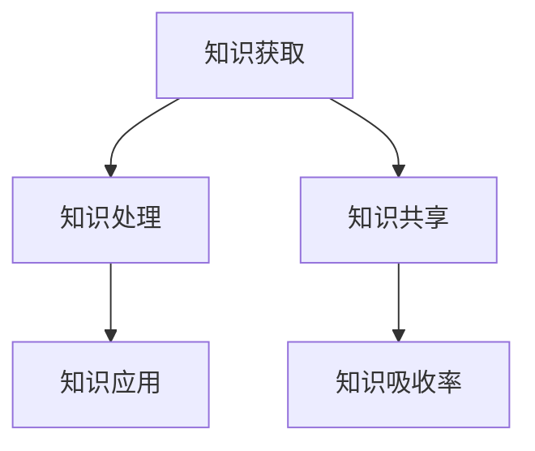

                 

# 提升知识吸收率:管理者成长的关键

## 1. 背景介绍

### 1.1 问题由来
在现代信息爆炸的时代，知识更新迭代速度加快，如何高效吸收和应用新知识，成为了管理者成长的关键。传统的“专家-学生”模式难以满足快速变化的知识需求。管理者需要掌握一套系统的知识吸收策略，以应对不断变化的环境和挑战。

### 1.2 问题核心关键点
知识吸收率是指个人或组织从外部环境中获取、处理并应用新知识的能力。提升知识吸收率不仅是提升个体专业能力的途径，也是推动组织创新和发展的核心驱动力。提高知识吸收率，可以加速管理者成长，提升决策质量，增强组织竞争力。

### 1.3 问题研究意义
本文聚焦于提升管理者知识吸收率的方法和策略，分析了知识吸收过程中面临的主要障碍，探讨了如何通过系统化的学习和实践，有效提升知识吸收效率，促进管理者的职业发展。研究对于提升组织的学习力、创新力和竞争力具有重要意义。

## 2. 核心概念与联系

### 2.1 核心概念概述

为更好地理解管理者知识吸收的过程，本节将介绍几个关键概念：

- 知识吸收率(Knowledge Absorption Rate, KAR)：指管理者在一定时间内，从外部环境中获取、处理并应用于实践的新知识的量。通常用新知识的获取量、处理深度和应用效果来衡量。
- 知识获取(Knowledge Acquisition)：通过阅读、学习、讨论等方式，从外部环境中收集新知识。
- 知识处理(Knowledge Processing)：对获取的知识进行理解和内化，形成个人或团队的认知模型。
- 知识应用(Knowledge Application)：将处理过的知识应用于实际问题解决、决策制定、创新研发等过程。
- 知识共享(Knowledge Sharing)：通过培训、会议、文档等形式，将新知识在团队或组织内部进行传播和应用。

这些核心概念之间的逻辑关系可以通过以下Mermaid流程图来展示：



这个流程图展示了知识吸收的整个流程：

1. 通过知识获取渠道，管理者获取新知识。
2. 知识经过处理，形成可供应用的认知模型。
3. 知识被应用于具体的实践和决策中。
4. 通过知识共享，新知识在组织内部得到传播和应用。
5. 整个过程的结果是知识吸收率。

## 3. 核心算法原理 & 具体操作步骤
### 3.1 算法原理概述

提升管理者知识吸收率的核心在于设计一套系统化的学习和应用框架，包括知识获取、处理、应用和共享四个环节。具体而言，管理者需要：

- 设计有效的知识获取策略，广泛收集新知识。
- 选择合适的知识处理工具，深入理解新知识。
- 采用多样化的知识应用方法，灵活应用新知识。
- 建立良好的知识共享机制，促进知识在组织内传播。

### 3.2 算法步骤详解

提升管理者知识吸收率的算法步骤主要包括以下几个环节：

**Step 1: 制定知识吸收策略**
- 明确知识吸收目标，如提升决策质量、推动创新等。
- 分析知识吸收的主要障碍，如时间、资源、能力等。
- 设计知识吸收的总体流程和关键节点。

**Step 2: 拓宽知识获取渠道**
- 利用多种信息源，如专业书籍、在线课程、行业报告、会议等。
- 制定系统化的学习计划，保证持续学习和知识更新。
- 借助技术工具，如RSS订阅、AI推荐系统等，快速获取新知识。

**Step 3: 选择合适的知识处理工具**
- 选择合适的知识管理工具，如MindMeister、Notion等，用于知识整理和笔记管理。
- 应用认知科学方法，如费曼学习法、故事叙述法等，提升知识理解深度。
- 使用AI辅助工具，如推荐系统、文本摘要等，帮助理解和筛选关键知识。

**Step 4: 应用多样化的知识应用方法**
- 采用实验法，将新知识应用于实际问题解决和决策制定中。
- 利用模拟和仿真工具，如Tableau、PowerBI等，进行数据驱动的决策支持。
- 进行知识评估和反馈，通过绩效考核、反馈机制等方式，不断优化知识应用效果。

**Step 5: 建立良好的知识共享机制**
- 建立知识共享平台，如企业内网、知识库等，促进知识在组织内传播。
- 组织知识分享活动，如读书会、讨论会、工作坊等，促进知识交流和互动。
- 鼓励知识内化，通过个人学习记录和团队讨论，深化知识理解和应用。

### 3.3 算法优缺点

提升管理者知识吸收率的算法具有以下优点：
1. 系统化：通过明确的目标和流程，管理者能够有条不紊地进行知识吸收，避免杂乱无章。
2. 全面性：涵盖知识获取、处理、应用和共享四个环节，确保知识吸收的全面性和系统性。
3. 灵活性：通过多种工具和方法，适应不同管理者的学习风格和需求。
4. 可持续性：强调持续学习和知识更新，保持知识的活力和时效性。

同时，该算法也存在一定的局限性：
1. 依赖个人主动性：管理者需要自我驱动，否则难以实现有效知识吸收。
2. 需要时间和资源投入：知识获取和处理过程可能耗时较多，且需投入一定的技术工具和人力资源。
3. 缺乏即时反馈：知识吸收过程的即时反馈较少，难以快速调整策略。

尽管存在这些局限性，但就目前而言，提升管理者知识吸收率的系统化策略，仍是最主流和最有效的方法。未来相关研究的重点在于如何进一步提升知识获取效率，优化知识处理工具，加强知识应用效果，以及建立更有效的知识共享机制。

### 3.4 算法应用领域

提升管理者知识吸收率的算法在管理实践中得到了广泛应用，覆盖了多个领域，例如：

- 人力资源管理：通过系统化的知识吸收策略，提升人力资源管理者的专业能力和决策水平。
- 财务管理：利用财务知识获取和处理工具，提升财务管理者的业务能力，优化财务管理决策。
- 项目管理：通过项目管理和知识管理工具，提升项目管理人员的知识吸收和应用能力，提高项目管理效果。
- 创新管理：借助创新知识获取和处理，促进组织的创新研发活动，加速技术创新和商业化进程。
- 战略管理：通过系统化的知识吸收策略，提升战略管理者的行业洞察力和决策能力，推动企业战略转型。

除了上述这些经典领域外，提升知识吸收率的方法也在更多组织和管理场景中得到应用，为管理者的成长和组织的发展提供了新的视角和工具。

## 4. 数学模型和公式 & 详细讲解 & 举例说明

### 4.1 数学模型构建

知识吸收率可以通过以下公式进行建模：

$$ KAR = \frac{K_{获取}}{K_{处理}} \times \frac{K_{应用}}{K_{总}} $$

其中：
- $K_{获取}$ 表示管理者在一定时间内获取的新知识量。
- $K_{处理}$ 表示管理者对新知识的处理深度。
- $K_{应用}$ 表示管理者将新知识应用于实践的效果。
- $K_{总}$ 表示管理者在一定时间内获取的新知识总量。

### 4.2 公式推导过程

根据上述公式，知识吸收率可以分为三个部分：

1. **知识获取能力(K_{获取})**：指管理者获取新知识的能力，可以通过统计获取信息的来源、频率和数量来衡量。
2. **知识处理能力(K_{处理})**：指管理者对获取知识进行理解和内化的能力，可以通过知识整理、笔记、思维导图等形式来衡量。
3. **知识应用能力(K_{应用})**：指管理者将新知识应用于实际问题和决策中的能力，可以通过绩效评估、项目成果等指标来衡量。

### 4.3 案例分析与讲解

以一个企业项目管理团队为例，分析其知识吸收率和提升策略。

假设该团队需要提升项目管理能力，制定了以下策略：

1. **知识获取**：通过参加项目管理培训班、订阅项目管理期刊、参加行业会议等方式，获取新知识。
2. **知识处理**：使用项目管理工具Notion进行知识整理和笔记管理，使用认知科学方法（如费曼学习法）加深理解。
3. **知识应用**：在实际项目管理中应用新知识，进行项目管理方法的实验和改进，定期进行绩效评估和反馈。
4. **知识共享**：在团队内部组织项目管理知识分享活动，通过读书会、案例讨论等方式，促进知识传播和应用。

通过上述策略的实施，该团队的知识吸收率显著提升，项目管理能力得到了全面提升。

## 5. 项目实践：代码实例和详细解释说明

### 5.1 开发环境搭建

在进行知识吸收策略的实践前，我们需要准备好开发环境。以下是使用Python进行系统设计的开发环境配置流程：

1. 安装Anaconda：从官网下载并安装Anaconda，用于创建独立的Python环境。

2. 创建并激活虚拟环境：
```bash
conda create -n knowledge-env python=3.8 
conda activate knowledge-env
```

3. 安装相关工具包：
```bash
pip install pandas numpy scikit-learn matplotlib
```

完成上述步骤后，即可在`knowledge-env`环境中开始知识吸收策略的开发和实践。

### 5.2 源代码详细实现

下面以项目管理知识吸收为例，给出使用Python进行知识管理工具Notion的代码实现。

首先，定义知识管理类：

```python
import notion
import pandas as pd
from datetime import datetime

class NotionKnowledgeManager:
    def __init__(self, key):
        self.notion = notion.Client(auth_key=key)

    def get_notes(self, project_id):
        notes = self.notion.get_notes(project_id)
        return notes

    def add_note(self, note_title, note_content):
        new_note = {
            'parent': {'id': project_id},
            'title': note_title,
            'body': note_content,
            'last_edited': datetime.now().isoformat()
        }
        self.notion.create_note(new_note)
```

然后，定义知识获取和处理函数：

```python
from transformers import pipeline

class KnowledgeAcquisitionProcessor:
    def __init__(self):
        self.pipeline = pipeline('summarization', model='T5-small')

    def get_summarization(self, text):
        summarization_result = self.pipeline(text, max_length=150)
        return summarization_result['output']
```

接着，定义知识应用和反馈函数：

```python
class KnowledgeApplicationEvaluator:
    def __init__(self):
        self.kpi = {'project_completion_rate': 0.9, 'resource_utilization': 0.95, 'customer_satisfaction': 0.8}

    def evaluate_project(self, project_id, metrics):
        for k, v in self.kpi.items():
            if metrics[k] < v:
                return False
        return True
```

最后，启动知识吸收流程并在项目团队中进行实践：

```python
project_id = 'your_project_id'

# 初始化知识管理工具和处理器
knowledge_manager = NotionKnowledgeManager('your_notion_key')
acquisition_processor = KnowledgeAcquisitionProcessor()

# 获取项目笔记，处理并应用知识
notes = knowledge_manager.get_notes(project_id)
for note in notes:
    note_title = note['title']
    note_content = note['body']
    summarized_content = acquisition_processor.get_summarization(note_content)
    knowledge_manager.add_note(note_title, summarized_content)
    if KnowledgeApplicationEvaluator().evaluate_project(project_id, metrics):
        print(f'{note_title} is successful.')
    else:
        print(f'{note_title} is failed.')

print('Knowledge acquisition and processing complete.')
```

以上就是使用Python进行项目管理知识吸收的完整代码实现。可以看到，通过Notion和Transformers库，我们能够实现系统化的知识吸收和管理。

### 5.3 代码解读与分析

让我们再详细解读一下关键代码的实现细节：

**NotionKnowledgeManager类**：
- `__init__`方法：初始化Notion客户端，获取项目ID。
- `get_notes`方法：从Notion中获取项目笔记。
- `add_note`方法：将处理后的新笔记添加到Notion中。

**KnowledgeAcquisitionProcessor类**：
- `__init__`方法：初始化Transformers的summarization pipeline。
- `get_summarization`方法：对项目笔记进行文本摘要。

**KnowledgeApplicationEvaluator类**：
- `__init__`方法：初始化项目绩效评估指标。
- `evaluate_project`方法：根据指标评估项目管理效果。

**主流程代码**：
- 初始化知识管理工具和处理器。
- 获取项目笔记，处理并应用知识。
- 对每个项目进行绩效评估。
- 输出项目知识吸收情况。

可以看出，Python代码实现简单明了，能够帮助管理者高效地进行知识获取、处理和应用，提升项目管理能力。

当然，工业级的系统实现还需考虑更多因素，如知识存储、检索、检索优化等。但核心的知识吸收流程基本与此类似。

## 6. 实际应用场景
### 6.1 人力资源管理

人力资源管理者的知识吸收主要集中在人力资源管理理论、法律法规、实践经验等方面。通过系统化的学习计划和知识共享机制，人力资源管理者可以不断提升自身的专业能力和管理水平。

在技术实现上，可以构建HR知识库和在线课程平台，提供丰富的学习资源和知识分享机会，同时借助知识管理工具，如Confluence、SharePoint等，进行知识整理和传播。

### 6.2 财务管理

财务管理者需要掌握财务理论、会计准则、财务软件使用等方面的知识。通过系统化的知识获取和处理策略，财务管理者可以提升财务分析和决策能力，优化财务管理流程。

在技术实现上，可以利用财务管理软件如SAP、Oracle等，提供丰富的财务管理培训和知识库，同时借助知识管理工具，如Notion、OneNote等，进行知识整理和传播。

### 6.3 项目管理

项目管理者的知识吸收主要集中在项目管理方法论、工具使用、风险管理等方面。通过系统化的知识获取和处理策略，项目管理者的项目管理能力和项目执行效率可以得到显著提升。

在技术实现上，可以构建项目管理知识库和在线课程平台，提供丰富的项目管理培训和知识分享机会，同时借助知识管理工具，如Notion、Asana等，进行知识整理和传播。

### 6.4 未来应用展望

随着知识吸收策略的不断演进，基于系统化学习的方法将在更多领域得到应用，为管理者的成长和组织的发展提供新的动力。

在智慧城市治理中，管理者可以通过系统化的知识吸收策略，提升城市管理的智能化水平，构建更安全、高效的未来城市。

在智能制造领域，管理者可以通过系统化的知识吸收策略，提升生产管理的效率和质量，推动制造业的数字化转型。

在医疗健康领域，管理者可以通过系统化的知识吸收策略，提升医疗服务的管理水平和患者满意度，推动医疗事业的进步。

除了上述这些领域外，系统化的知识吸收策略还在教育、金融、交通等多个领域得到了广泛应用，为管理者的成长和组织的发展提供了新的视角和工具。

## 7. 工具和资源推荐
### 7.1 学习资源推荐

为了帮助管理者系统掌握知识吸收策略的理论基础和实践技巧，这里推荐一些优质的学习资源：

1. 《知识吸收率提升指南》系列博文：由知识管理专家撰写，深入浅出地介绍了知识吸收率提升的理论和实践方法。

2. 《管理学基础》课程：在线学习平台提供的管理学基础课程，涵盖了知识吸收、决策制定、组织行为等多个方面。

3. 《知识管理与创新》书籍：全面介绍了知识管理的理论和实践，包括知识获取、处理、应用、共享等多个环节。

4. 《知识吸收率提升工具包》：总结了多种知识管理工具和系统，如Confluence、SharePoint、Notion等，帮助管理者选择适合的工具。

5. 《知识吸收率提升案例集》：收集了多个行业和组织的知识吸收提升案例，提供丰富的学习参考。

通过对这些资源的学习实践，相信管理者能够系统掌握知识吸收的策略和工具，提升自身的专业能力和组织的管理水平。

### 7.2 开发工具推荐

高效的开发离不开优秀的工具支持。以下是几款用于知识管理工具的推荐：

1. Confluence：Atlassian提供的知识管理工具，支持文档、页面、链接等多种知识组织方式。
2. SharePoint：Microsoft提供的企业级知识管理平台，支持文件、文档、列表等多种知识组织方式。
3. Notion：一款功能强大的知识管理工具，支持笔记、数据库、日历等多种知识组织方式。
4. OneNote：微软提供的笔记应用，支持笔记、剪贴贴、列表等多种知识组织方式。
5. Google Drive：谷歌提供的云存储和文档协作平台，支持多种文档和文件类型。
6. Evernote：一款功能强大的笔记应用，支持笔记、标签、笔记本等多种知识组织方式。

合理利用这些工具，可以显著提升知识管理的效率和效果，帮助管理者更好地吸收和应用新知识。

### 7.3 相关论文推荐

知识吸收策略的研究源于学界的持续研究。以下是几篇奠基性的相关论文，推荐阅读：

1. 《知识吸收的认知过程》：探讨了知识吸收的认知过程，包括感知、理解、内化等多个环节。
2. 《知识共享在组织中的应用》：介绍了知识共享在组织中的应用，包括知识共享平台、知识共享活动等多种形式。
3. 《基于知识管理的组织学习》：分析了知识管理对组织学习的影响，提出了基于知识管理的组织学习模型。
4. 《知识吸收率提升的方法和策略》：总结了多种知识吸收率提升的方法和策略，如系统化学习、知识管理工具、知识共享机制等。
5. 《知识吸收与组织创新的关系》：探讨了知识吸收对组织创新的影响，提出了提升知识吸收率以促进组织创新的方法。

这些论文代表了大语言模型微调技术的发展脉络。通过学习这些前沿成果，可以帮助管理者把握学科前进方向，激发更多的创新灵感。

## 8. 总结：未来发展趋势与挑战
### 8.1 总结

本文对提升管理者知识吸收率的方法和策略进行了全面系统的介绍。首先阐述了知识吸收过程中面临的主要障碍，分析了知识吸收的主要环节，明确了提升知识吸收率的路径。其次，从原理到实践，详细讲解了知识获取、处理、应用和共享四个环节，给出了知识吸收策略的完整代码实现。同时，本文还广泛探讨了知识吸收策略在人力资源管理、财务管理、项目管理等多个领域的应用前景，展示了知识吸收策略的巨大潜力。

通过本文的系统梳理，可以看到，系统化的知识吸收策略已经成为管理者成长的重要工具。这些策略不仅能够提升个体的专业能力，还能够推动组织的创新和发展。未来，伴随知识吸收策略的不断演进，管理者将能够更好地应对不断变化的知识环境，实现个人和组织的持续成长。

### 8.2 未来发展趋势

展望未来，知识吸收策略将呈现以下几个发展趋势：

1. 自动化和智能化：借助AI和机器学习技术，知识吸收过程将更加自动化和智能化，能够智能推荐相关知识，提高知识获取和处理的效率。

2. 多模态融合：知识吸收不仅仅局限于文本信息，还将包括图像、视频、音频等多种模态信息。通过多模态融合，知识吸收过程将更加全面和深入。

3. 知识图谱应用：知识图谱将知识之间的关联关系可视化，帮助管理者更好地理解和应用新知识。知识图谱的应用将推动知识吸收策略的进一步发展。

4. 社交网络支持：社交网络在知识共享和传播中扮演着重要角色，未来的知识吸收策略将更加注重社交网络的支持，通过社交网络拓展知识获取渠道。

5. 实时反馈机制：实时反馈机制能够帮助管理者及时调整知识吸收策略，优化知识应用效果。未来的知识吸收策略将更加注重实时反馈和优化。

6. 跨领域应用：知识吸收策略将不仅仅应用于某一领域，还将广泛应用于多个领域，推动跨领域的知识整合和创新。

以上趋势凸显了知识吸收策略的广阔前景。这些方向的探索发展，必将进一步提升知识吸收的效率和效果，推动管理者和管理组织的持续成长。

### 8.3 面临的挑战

尽管知识吸收策略已经取得了瞩目成就，但在迈向更加智能化、普适化应用的过程中，它仍面临着诸多挑战：

1. 知识量爆炸：信息爆炸导致知识量激增，如何从海量知识中筛选和提取有用的信息，是一大挑战。
2. 知识更新迅速：知识更新速度快，管理者需要不断学习和更新，保持知识的时效性和先进性。
3. 知识获取渠道多样：知识获取渠道多样化，如何高效筛选和管理这些渠道，是一大挑战。
4. 知识处理复杂：知识处理过程复杂，如何高效处理和应用新知识，是一大挑战。
5. 知识共享困难：知识共享过程中可能面临信息不对称、知识断层等问题，如何建立有效的知识共享机制，是一大挑战。
6. 知识应用难度大：知识应用过程中可能面临实际操作和决策问题，如何有效应用新知识，是一大挑战。

尽管存在这些挑战，但未来相关研究的重点在于如何进一步提升知识吸收效率，优化知识处理工具，加强知识应用效果，以及建立更有效的知识共享机制。

### 8.4 研究展望

面向未来，知识吸收策略的研究需要在以下几个方面寻求新的突破：

1. 探索知识获取的自动化方法：通过AI和机器学习技术，实现知识获取的自动化和智能化，提高知识获取的效率和效果。

2. 研究知识处理的优化算法：开发更加高效的知识处理算法，如知识图谱、自然语言处理等，提升知识处理的效率和效果。

3. 引入知识应用的多样化方法：结合决策支持系统、模拟仿真工具等，提高知识应用的灵活性和有效性。

4. 融合多模态知识：将视觉、听觉、触觉等多种模态知识融合，提升知识吸收的全面性和深度。

5. 加强知识共享机制：通过知识共享平台、社交网络等工具，提升知识在组织内的传播和应用效果。

6. 开发知识应用的实时反馈系统：引入实时反馈机制，帮助管理者及时调整知识吸收策略，优化知识应用效果。

这些研究方向将推动知识吸收策略的不断演进，为管理者的成长和组织的发展提供新的工具和方法。

## 9. 附录：常见问题与解答

**Q1：知识吸收率提升策略是否适用于所有管理者？**

A: 知识吸收率提升策略适用于大多数管理者，特别是在信息爆炸、知识更新迅速的现代环境中，管理者需要系统化的学习方法和工具来提升自身和组织的学习力。

**Q2：如何平衡知识获取、处理和应用之间的关系？**

A: 知识吸收率提升的关键在于系统化地协调这三个环节。管理者需要制定明确的学习计划，选择合适的知识处理工具，并在实践中不断优化知识应用策略，形成一个闭环的提升过程。

**Q3：知识管理工具如何选择合适的？**

A: 选择知识管理工具应考虑其功能、易用性、成本等多方面因素。一般来说，多功能的综合性工具如Confluence、SharePoint等较为适合，而专注于笔记管理的工具如Notion、Evernote等也有其优势。

**Q4：知识共享机制如何建立？**

A: 建立知识共享机制需要考虑组织文化、团队结构、知识类型等多种因素。可以通过内部培训、知识库、知识会议等方式，促进知识在组织内的传播和应用。

**Q5：知识应用中如何处理数据隐私问题？**

A: 在知识应用过程中，数据隐私问题需要得到充分重视。应采用数据脱敏、权限控制等措施，确保知识共享过程中数据的安全和隐私保护。

通过以上问题的解答，可以帮助管理者更好地理解知识吸收率提升策略的实际应用和潜在挑战。

---

作者：禅与计算机程序设计艺术 / Zen and the Art of Computer Programming

