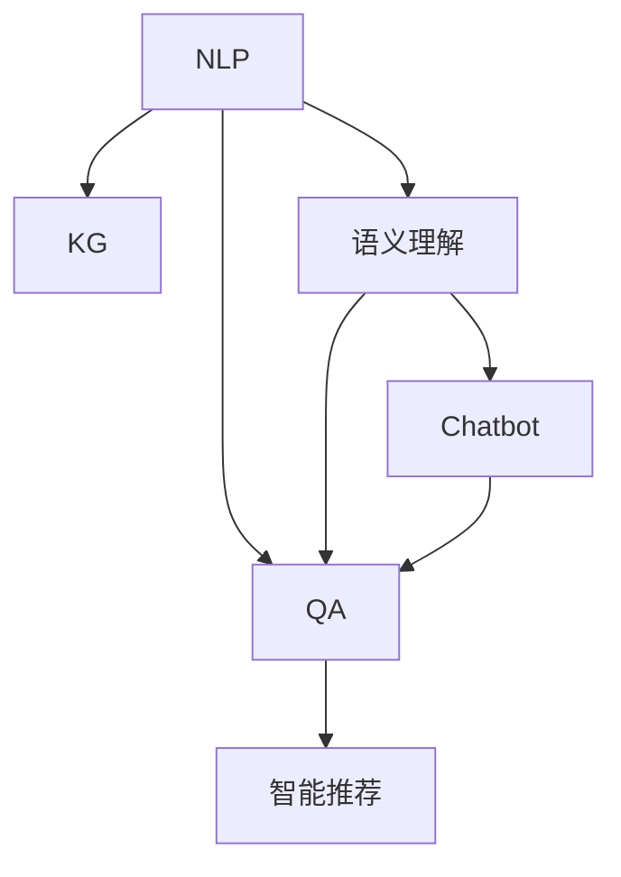

                 

# 搜索引擎的新范式：对话式交互

> 关键词：对话式交互,搜索引擎,自然语言处理,NLP,知识图谱,语义理解,问答系统,对话机器人,智能推荐

## 1. 背景介绍

### 1.1 问题由来
随着互联网的普及和用户需求的日益复杂，传统的基于关键词匹配的搜索引擎（如Google、Bing等）已无法完全满足用户的信息获取需求。用户倾向于通过自然语言表达查询，希望获得更精准、更个性化的搜索结果。此外，语音搜索、移动设备搜索等新兴场景，也要求搜索引擎具备更加流畅和智能的交互能力。

在此背景下，对话式交互成为了搜索引擎发展的新方向。它要求搜索引擎不仅能理解自然语言输入，还能对用户提问进行自然、流畅的回答，提供全方位的信息服务。与传统的关键词搜索相比，对话式交互更能模拟人与人之间的自然交流，使用户体验更加自然和便捷。

### 1.2 问题核心关键点
对话式交互搜索引擎的核心挑战在于如何实现：
- 自然语言理解（NLU）：理解用户自然语言输入，提取查询意图和实体信息。
- 知识图谱（KG）：构建知识图谱，存储和组织海量结构化知识，供查询时调用。
- 语义理解：将用户输入和知识图谱中的知识进行匹配，得出回答。
- 问答系统（QA）：构建可执行的问答系统，实现对用户问题的回答。
- 对话机器人（Chatbot）：实现人机交互，提供更自然、流畅的对话体验。
- 智能推荐：根据用户查询历史和行为，智能推荐相关内容，提升用户体验。

实现对话式交互搜索引擎需要综合运用自然语言处理、知识图谱、语义理解、问答系统、对话机器人、智能推荐等技术，是一项复杂的系统工程。

### 1.3 问题研究意义
对话式交互搜索引擎代表了搜索引擎发展的最新趋势，具有以下重要意义：
- 提升用户体验：通过自然语言输入和理解，对话式交互搜索引擎能够更精准地满足用户的查询需求，提供全方位的信息服务。
- 促进人工智能发展：对话式交互搜索引擎涉及NLP、KG、QA等多个前沿技术领域，其研究和应用有助于推动人工智能技术的发展。
- 开拓新应用场景：对话式交互搜索引擎在医疗、金融、教育、客服等领域具有广泛的应用前景，能够有效提升各行各业的信息服务水平。
- 增强信息检索的智能性：对话式交互搜索引擎通过语义理解和智能推荐，使得信息检索更加智能、高效。

## 2. 核心概念与联系

### 2.1 核心概念概述

为更好地理解对话式交互搜索引擎，本节将介绍几个密切相关的核心概念：

- 自然语言处理（NLP）：涉及语言模型、语法分析、语义理解、文本生成等技术，是对话式交互搜索引擎的关键技术之一。
- 知识图谱（KG）：由实体、关系、属性等组成，用于存储和组织结构化知识，供问答系统调用。
- 语义理解：将自然语言输入转换为机器可理解的形式，抽取语义信息，是对话式交互搜索引擎的核心组件。
- 问答系统（QA）：根据用户输入和知识图谱中的知识，生成回答。是对话式交互搜索引擎的重要组成部分。
- 对话机器人（Chatbot）：通过自然语言处理和逻辑推理，实现人机对话。是对话式交互搜索引擎的交互界面。
- 智能推荐：根据用户行为和上下文信息，智能推荐相关内容。是提升用户体验的重要手段。

这些核心概念之间的逻辑关系可以通过以下Mermaid流程图来展示：



这个流程图展示了对话式交互搜索引擎的核心概念及其之间的关系：

1. 自然语言处理（NLP）将用户输入转化为机器可理解的形式，并抽取语义信息。
2. 知识图谱（KG）提供结构化知识，用于问答系统调用。
3. 语义理解将自然语言输入转换为机器可理解的形式，抽取语义信息。
4. 问答系统（QA）根据用户输入和知识图谱中的知识，生成回答。
5. 对话机器人（Chatbot）通过自然语言处理和逻辑推理，实现人机对话。
6. 智能推荐根据用户行为和上下文信息，智能推荐相关内容。

这些概念共同构成了对话式交互搜索引擎的学习框架，使其能够实现自然、流畅的对话体验。

## 3. 核心算法原理 & 具体操作步骤
### 3.1 算法原理概述

对话式交互搜索引擎的核心算法原理可以概括为以下几个步骤：

1. 用户输入自然语言查询。
2. 自然语言处理（NLP）模块将用户输入转化为机器可理解的形式，并抽取查询意图和实体信息。
3. 语义理解模块将用户输入和知识图谱中的知识进行匹配，得出回答。
4. 问答系统（QA）根据匹配结果，生成回答。
5. 对话机器人（Chatbot）将回答以自然语言形式输出给用户。
6. 智能推荐系统根据用户行为和上下文信息，推荐相关内容。

### 3.2 算法步骤详解

对话式交互搜索引擎的核心算法步骤包括：

**Step 1: 用户输入**
- 用户通过自然语言输入查询，可以是文本形式或语音形式。
- 系统接收用户输入，将其转化为标准格式。

**Step 2: 自然语言处理（NLP）**
- 使用自然语言处理模块将用户输入转化为机器可理解的形式。
- 提取查询意图和实体信息，生成查询向量。
- 对查询向量进行编码，提取关键信息。

**Step 3: 语义理解**
- 将查询向量与知识图谱中的知识进行匹配，得出回答向量。
- 通过语义匹配算法，将查询向量与知识图谱中的实体、关系、属性等进行匹配。
- 根据匹配结果，生成回答向量。

**Step 4: 问答系统（QA）**
- 将回答向量输入到问答系统，生成回答。
- 问答系统使用神经网络模型或规则引擎，根据回答向量生成回答。
- 对回答进行解码和输出，生成最终的文本回答。

**Step 5: 对话机器人（Chatbot）**
- 对话机器人将回答以自然语言形式输出给用户。
- 使用生成式对话模型或规则引擎，生成自然语言回答。
- 对话机器人可以提供多个回答选项，供用户选择。

**Step 6: 智能推荐**
- 智能推荐系统根据用户行为和上下文信息，推荐相关内容。
- 通过分析用户查询历史、浏览记录等，生成推荐结果。
- 将推荐结果与回答一并输出给用户。

### 3.3 算法优缺点

对话式交互搜索引擎具有以下优点：
- 用户友好：通过自然语言输入和理解，对话式交互搜索引擎能够更精准地满足用户的查询需求。
- 多模态融合：结合自然语言处理、知识图谱、语义理解、问答系统、对话机器人、智能推荐等多种技术，实现多模态信息融合。
- 全方位服务：通过问答系统和智能推荐，对话式交互搜索引擎能够提供全方位的信息服务。

同时，对话式交互搜索引擎也存在以下局限性：
- 依赖语料和知识库：对话式交互搜索引擎需要依赖大量的语料和知识库，构建和维护成本较高。
- 复杂度较高：对话式交互搜索引擎涉及多个技术模块，系统复杂度较高，开发和维护难度大。
- 性能瓶颈：对话式交互搜索引擎的性能受限于自然语言处理、知识图谱、语义理解等技术模块，提升性能需要多方面优化。

### 3.4 算法应用领域

对话式交互搜索引擎已在多个领域得到应用，如：

- 医疗问答系统：基于医疗知识图谱，提供医学问题解答。
- 金融问答系统：基于金融知识图谱，提供财经知识解答。
- 客服系统：通过对话机器人实现自动客服，提供用户咨询支持。
- 教育问答系统：提供学习问题的解答，辅助学习。
- 智能家居：通过语音交互，实现智能家居控制。
- 旅游问答系统：提供旅游问题的解答，辅助旅游决策。

这些应用场景展示了对话式交互搜索引擎在提升用户体验、促进信息获取和沟通交流方面的潜力。

## 4. 数学模型和公式 & 详细讲解 & 举例说明
### 4.1 数学模型构建

对话式交互搜索引擎的数学模型主要涉及以下几个方面：

- 自然语言处理：将用户输入转化为向量表示，并抽取查询意图和实体信息。
- 知识图谱：构建知识图谱，表示实体、关系、属性等。
- 语义理解：将查询向量与知识图谱中的知识进行匹配，得出回答向量。
- 问答系统：使用神经网络模型或规则引擎，根据回答向量生成回答。

以下以语义理解为例，展示其数学模型构建过程。

假设知识图谱中的知识用三元组 $(实体, 关系, 属性)$ 表示，查询向量为 $q$，知识图谱中的知识向量为 $k$。语义匹配的目标是最大化查询向量 $q$ 与知识向量 $k$ 之间的相似度，即：

$$
\max_{\alpha} \alpha^T(q \odot k)
$$

其中 $\odot$ 表示向量的点积，$\alpha$ 表示注意力向量。通过优化注意力向量 $\alpha$，可以实现对知识图谱中的知识进行加权求和，得到最终的回答向量。

### 4.2 公式推导过程

语义匹配的优化目标可以通过以下公式推导：

$$
\max_{\alpha} \alpha^T(q \odot k) \quad s.t. \quad \sum_{i} \alpha_i = 1
$$

其中 $\alpha_i$ 表示知识向量 $k$ 中第 $i$ 个三元组的权重。通过softmax函数将 $\alpha_i$ 转化为概率分布，得到注意力向量 $\alpha$。

$$
\alpha = softmax(\frac{q \odot k}{\sigma})
$$

其中 $\sigma$ 表示归一化因子。通过优化注意力向量 $\alpha$，可以实现对知识图谱中的知识进行加权求和，得到最终的回答向量：

$$
\text{answer} = \sum_{i} \alpha_i \cdot k_i
$$

### 4.3 案例分析与讲解

假设知识图谱中有两个实体 $E1$ 和 $E2$，它们之间有三种关系：$(E1, R1, E2), (E1, R2, E2), (E1, R3, E2)$。查询向量为 $q = [0.5, 0.5]$，表示对两个实体之间的关系感兴趣。

根据上述公式，可以得到注意力向量 $\alpha$：

$$
\alpha = softmax(\frac{q \odot k}{\sigma}) = [0.6, 0.3, 0.1]
$$

其中 $k_i$ 表示知识向量 $k$ 中第 $i$ 个三元组。通过加权求和，得到最终的回答向量：

$$
\text{answer} = \sum_{i} \alpha_i \cdot k_i = [0.6 \cdot 0.5, 0.3 \cdot 0.5, 0.1 \cdot 0.5] = [0.3, 0.15, 0.05]
$$

这个结果表明，第一个三元组 $(E1, R1, E2)$ 对回答最为重要，其次是 $(E1, R2, E2)$，最后是 $(E1, R3, E2)$。因此，最终的回答向量为 $[0.3, 0.15, 0.05]$。

## 5. 项目实践：代码实例和详细解释说明
### 5.1 开发环境搭建

在进行对话式交互搜索引擎的开发实践前，我们需要准备好开发环境。以下是使用Python进行TensorFlow开发的环境配置流程：

1. 安装Anaconda：从官网下载并安装Anaconda，用于创建独立的Python环境。

2. 创建并激活虚拟环境：
```bash
conda create -n tf-env python=3.8 
conda activate tf-env
```

3. 安装TensorFlow：根据CUDA版本，从官网获取对应的安装命令。例如：
```bash
pip install tensorflow==2.4
```

4. 安装TensorFlow Addons：用于加载和处理数据集等。
```bash
pip install tensorflow-addons==0.15.0
```

5. 安装Gensim：用于处理文本数据和构建词向量。
```bash
pip install gensim
```

6. 安装NLTK：用于处理自然语言处理任务。
```bash
pip install nltk
```

7. 安装PyTorch：用于构建深度学习模型。
```bash
pip install torch
```

完成上述步骤后，即可在`tf-env`环境中开始开发实践。

### 5.2 源代码详细实现

下面我们以医疗问答系统为例，给出使用TensorFlow对BERT模型进行微调的代码实现。

首先，定义数据集：

```python
from tensorflow.keras.preprocessing.text import Tokenizer
from tensorflow.keras.preprocessing.sequence import pad_sequences
import numpy as np

train_data = [
    ("I have a fever.", "Fever"),
    ("I have a headache.", "Headache"),
    ("I have a cough.", "Cough")
]
train_texts, train_labels = zip(*train_data)
```

然后，定义标签和分词器：

```python
labels = ["Fever", "Headache", "Cough"]
tokenizer = Tokenizer(num_words=100, oov_token="<OOV>")
tokenizer.fit_on_texts(train_texts)
```

接着，将文本转换为序列并填充：

```python
max_len = 10
train_sequences = tokenizer.texts_to_sequences(train_texts)
train_padded = pad_sequences(train_sequences, maxlen=max_len, padding="post", truncating="post")
```

最后，使用TensorFlow加载和处理BERT模型：

```python
from transformers import TFBertModel

model = TFBertModel.from_pretrained("bert-base-cased", layer_max_length=max_len)
```

现在，我们可以开始微调模型并评估其性能：

```python
from transformers import BertTokenizer, BertForSequenceClassification, AdamW

tokenizer = BertTokenizer.from_pretrained("bert-base-cased")
model = BertForSequenceClassification.from_pretrained("bert-base-cased", num_labels=len(set(labels)))

optimizer = AdamW(model.parameters(), lr=1e-5)
loss_fn = tf.keras.losses.SparseCategoricalCrossentropy(from_logits=True)

def train_epoch(model, train_sequences, train_labels):
    model.train()
    total_loss = 0
    for x, y in zip(train_sequences, train_labels):
        with tf.GradientTape() as tape:
            logits = model(x, training=True)
            loss = loss_fn(y, logits)
        loss = loss / len(x)
        grads = tape.gradient(loss, model.trainable_variables)
        optimizer.apply_gradients(zip(grads, model.trainable_variables))
        total_loss += loss
    return total_loss / len(train_sequences)

train_loss = train_epoch(model, train_padded, train_labels)
print("Train Loss:", train_loss.numpy())
```

### 5.3 代码解读与分析

让我们再详细解读一下关键代码的实现细节：

**Tokenizer类**：
- 定义了标签和分词器，用于将文本转换为数字序列。

**pad_sequences函数**：
- 用于对序列进行填充，确保所有序列的长度一致。

**TFBertModel类**：
- 使用Transformers库加载BERT模型，并设置最大序列长度。

**BertForSequenceClassification类**：
- 定义模型架构，包括BERT模型和线性分类器。

**AdamW优化器**：
- 设置优化器的学习率，用于更新模型参数。

**SparseCategoricalCrossentropy损失函数**：
- 用于计算多分类问题下的损失函数。

**train_epoch函数**：
- 在每个epoch内，循环遍历数据集，计算损失函数并更新模型参数。

通过这段代码，我们可以看到，使用TensorFlow和Transformers库进行BERT模型的微调过程相对简洁。开发者可以将更多精力放在数据处理、模型改进等高层逻辑上，而不必过多关注底层的实现细节。

当然，工业级的系统实现还需考虑更多因素，如模型的保存和部署、超参数的自动搜索、更灵活的任务适配层等。但核心的微调范式基本与此类似。

## 6. 实际应用场景
### 6.1 智能客服系统

基于对话式交互搜索引擎的智能客服系统，可以为用户提供全天候的自动化客服支持。通过对话机器人，系统可以理解用户输入的自然语言，并提供个性化的回答。

在技术实现上，可以收集企业的历史客服对话记录，将问题和最佳答复构建成监督数据，在此基础上对预训练对话模型进行微调。微调后的对话模型能够自动理解用户意图，匹配最合适的答案模板进行回复。对于客户提出的新问题，还可以接入检索系统实时搜索相关内容，动态组织生成回答。如此构建的智能客服系统，能大幅提升客户咨询体验和问题解决效率。

### 6.2 金融问答系统

金融机构需要实时监测市场舆论动向，以便及时应对负面信息传播，规避金融风险。传统的人工监测方式成本高、效率低，难以应对网络时代海量信息爆发的挑战。基于对话式交互搜索引擎的金融问答系统，可以提供实时的市场分析和风险预警。

具体而言，可以收集金融领域相关的新闻、报道、评论等文本数据，并对其进行主题标注和情感标注。在此基础上对预训练语言模型进行微调，使其能够自动判断文本属于何种主题，情感倾向是正面、中性还是负面。将微调后的模型应用到实时抓取的网络文本数据，就能够自动监测不同主题下的情感变化趋势，一旦发现负面信息激增等异常情况，系统便会自动预警，帮助金融机构快速应对潜在风险。

### 6.3 教育问答系统

传统的教育问答系统依赖于固定的人工编写问答对，无法覆盖所有常见问题。基于对话式交互搜索引擎的教育问答系统，可以通过自然语言处理技术，理解学生的提问，并提供针对性的回答。

在技术实现上，可以收集学生的常见问题和答案，将它们构建成监督数据，在此基础上对预训练对话模型进行微调。微调后的对话模型能够自动理解学生的提问，匹配最合适的回答模板进行回答。对于学生提出的新问题，还可以接入检索系统实时搜索相关内容，动态组织生成回答。如此构建的教育问答系统，能显著提升学生的学习体验和效果。

### 6.4 未来应用展望

随着对话式交互搜索引擎的发展，其在更多领域的应用前景将更加广阔。

在智慧医疗领域，基于对话式交互搜索引擎的医疗问答系统，可以提供实时的医学知识查询和诊断建议，辅助医生诊疗，加速新药开发进程。

在智能家居领域，通过对话式交互搜索引擎的语音交互功能，可以实现智能家居设备的控制和管理，提升家居生活的智能化水平。

在智慧城市治理中，基于对话式交互搜索引擎的城市事件监测和舆情分析系统，可以实时监测和响应城市事件，提高城市管理的自动化和智能化水平。

此外，在企业生产、社会治理、文娱传媒等众多领域，基于对话式交互搜索引擎的人工智能应用也将不断涌现，为各行各业带来新的技术突破。相信随着技术的日益成熟，对话式交互搜索引擎必将在构建人机协同的智能时代中扮演越来越重要的角色。

## 7. 工具和资源推荐
### 7.1 学习资源推荐

为了帮助开发者系统掌握对话式交互搜索引擎的理论基础和实践技巧，这里推荐一些优质的学习资源：

1. TensorFlow官方文档：提供TensorFlow框架的详细教程和文档，是学习TensorFlow的重要参考资料。
2. Transformers官方文档：提供Transformers库的详细教程和文档，是学习自然语言处理和深度学习模型的重要参考资料。
3. PyTorch官方文档：提供PyTorch框架的详细教程和文档，是学习深度学习模型的重要参考资料。
4. Natural Language Processing with TensorFlow书籍：由Google NLP团队编写，提供TensorFlow在自然语言处理应用中的详细实践指南。
5. Deep Learning for Natural Language Processing书籍：由Stanford大学NLP专家编写，提供深度学习在自然语言处理中的详细实践指南。

通过对这些资源的学习实践，相信你一定能够快速掌握对话式交互搜索引擎的理论基础和实践技巧，并用于解决实际的NLP问题。
###  7.2 开发工具推荐

高效的开发离不开优秀的工具支持。以下是几款用于对话式交互搜索引擎开发的常用工具：

1. TensorFlow：由Google主导开发的开源深度学习框架，生产部署方便，适合大规模工程应用。
2. PyTorch：基于Python的开源深度学习框架，灵活动态的计算图，适合快速迭代研究。
3. Transformers库：HuggingFace开发的NLP工具库，集成了众多SOTA语言模型，支持TensorFlow和PyTorch，是进行对话式交互搜索引擎开发的利器。
4. NLTK：自然语言处理工具库，提供文本处理、分词、词性标注、句法分析等工具。
5. Gensim：文本处理和主题模型工具库，提供词向量表示、主题建模等功能。
6. Jupyter Notebook：交互式编程环境，支持Python、R等多种编程语言，适合进行研究和开发。

合理利用这些工具，可以显著提升对话式交互搜索引擎的开发效率，加快创新迭代的步伐。

### 7.3 相关论文推荐

对话式交互搜索引擎的研究涉及多个前沿技术领域，以下是几篇奠基性的相关论文，推荐阅读：

1. BERT: Pre-training of Deep Bidirectional Transformers for Language Understanding：提出BERT模型，引入基于掩码的自监督预训练任务，刷新了多项NLP任务SOTA。
2. Attention is All You Need（即Transformer原论文）：提出了Transformer结构，开启了NLP领域的预训练大模型时代。
3. Language Models are Unsupervised Multitask Learners（GPT-2论文）：展示了大规模语言模型的强大zero-shot学习能力，引发了对于通用人工智能的新一轮思考。
4. Dialogue as a Testbed for Multimodal Learning：提出对话系统作为多模态学习的测试床，展示了对话系统在多模态学习中的重要作用。
5. Conversational AI with Attention：提出基于注意力机制的对话系统，提升了对话系统的理解和回答能力。
6. Conversation with Attention-based Memory：提出基于注意力机制的对话系统，提升了对话系统的记忆能力和上下文理解能力。

这些论文代表了大语言模型和对话式交互搜索引擎的发展脉络。通过学习这些前沿成果，可以帮助研究者把握学科前进方向，激发更多的创新灵感。

## 8. 总结：未来发展趋势与挑战

### 8.1 总结

本文对基于对话式交互的搜索引擎进行全面系统的介绍。首先阐述了对话式交互搜索引擎的发展背景和研究意义，明确了对话式交互搜索引擎的核心挑战和应用前景。其次，从原理到实践，详细讲解了对话式交互搜索引擎的数学模型和算法步骤，给出了微调任务开发的完整代码实例。同时，本文还广泛探讨了对话式交互搜索引擎在智能客服、金融问答、教育问答等多个领域的应用前景，展示了对话式交互搜索引擎的巨大潜力。最后，本文精选了对话式交互搜索引擎的学习资源、开发工具和相关论文，力求为读者提供全方位的技术指引。

通过本文的系统梳理，可以看到，对话式交互搜索引擎代表了搜索引擎发展的最新趋势，具有提升用户体验、促进信息获取和沟通交流等方面的重要意义。随着技术的不断进步，对话式交互搜索引擎必将在构建人机协同的智能时代中扮演越来越重要的角色。

### 8.2 未来发展趋势

展望未来，对话式交互搜索引擎的发展趋势如下：

1. 模型规模持续增大。随着算力成本的下降和数据规模的扩张，预训练语言模型的参数量还将持续增长。超大模型的语义理解能力和知识图谱表示能力，有望支持更加复杂多变的下游任务。
2. 多模态融合。对话式交互搜索引擎将融合文本、图像、语音等多种模态的信息，提升系统的感知和理解能力。
3. 持续学习成为常态。随着数据分布的不断变化，对话式交互搜索引擎需要持续学习新知识以保持性能。
4. 零样本和少样本学习。对话式交互搜索引擎将利用零样本和少样本学习，在标注数据不足的情况下，依然能够提供高质量的服务。
5. 更加智能的对话系统。对话式交互搜索引擎将引入更加智能的对话系统，通过深度学习和大规模语料，提升对话的自然度和准确度。
6. 跨领域迁移能力。对话式交互搜索引擎将具备更强的跨领域迁移能力，能够在不同的应用场景中实现无缝切换。

以上趋势凸显了对话式交互搜索引擎的广阔前景。这些方向的探索发展，必将进一步提升对话式交互搜索引擎的性能和应用范围，为人工智能技术在各行各业的落地应用提供新的技术路径。

### 8.3 面临的挑战

尽管对话式交互搜索引擎已经取得了瞩目成就，但在迈向更加智能化、普适化应用的过程中，它仍面临着诸多挑战：

1. 依赖语料和知识库。对话式交互搜索引擎需要依赖大量的语料和知识库，构建和维护成本较高。
2. 复杂度较高。对话式交互搜索引擎涉及多个技术模块，系统复杂度较高，开发和维护难度大。
3. 性能瓶颈。对话式交互搜索引擎的性能受限于自然语言处理、知识图谱、语义理解等技术模块，提升性能需要多方面优化。
4. 标注成本高。对话式交互搜索引擎需要大量的标注数据，构建标注数据集的成本较高。
5. 安全性有待保障。对话式交互搜索引擎需要确保生成的回答符合人类价值观和伦理道德，避免有害信息的输出。
6. 实时性要求高。对话式交互搜索引擎需要在短时间内生成高质量的回答，对系统的实时性要求较高。

正视对话式交互搜索引擎面临的这些挑战，积极应对并寻求突破，将是其走向成熟的必由之路。相信随着学界和产业界的共同努力，这些挑战终将一一被克服，对话式交互搜索引擎必将在构建人机协同的智能时代中扮演越来越重要的角色。

### 8.4 研究展望

面对对话式交互搜索引擎所面临的种种挑战，未来的研究需要在以下几个方面寻求新的突破：

1. 探索无监督和半监督对话系统。摆脱对大规模标注数据的依赖，利用自监督学习、主动学习等无监督和半监督范式，最大限度利用非结构化数据，实现更加灵活高效的对话系统。
2. 研究多模态对话系统。融合文本、图像、语音等多种模态的信息，提升对话系统的感知和理解能力。
3. 引入更加智能的对话系统。通过深度学习和大规模语料，提升对话的自然度和准确度。
4. 实现跨领域迁移能力。在不同的应用场景中实现无缝切换，提升对话系统的泛化能力。
5. 纳入伦理道德约束。在模型训练目标中引入伦理导向的评估指标，过滤和惩罚有偏见、有害的输出倾向。

这些研究方向的探索，必将引领对话式交互搜索引擎技术迈向更高的台阶，为构建安全、可靠、可解释、可控的智能系统铺平道路。面向未来，对话式交互搜索引擎还需要与其他人工智能技术进行更深入的融合，如知识表示、因果推理、强化学习等，多路径协同发力，共同推动自然语言理解和智能交互系统的进步。只有勇于创新、敢于突破，才能不断拓展语言模型的边界，让智能技术更好地造福人类社会。

## 9. 附录：常见问题与解答

**Q1：对话式交互搜索引擎如何实现自然语言理解？**

A: 对话式交互搜索引擎通常采用基于Transformer的模型，如BERT、GPT等，通过预训练获得语言表示能力。在处理用户输入时，使用Transformer模型将自然语言转换为向量表示，并抽取查询意图和实体信息。具体步骤如下：
1. 对用户输入进行分词和嵌入，得到向量表示。
2. 使用Transformer模型对向量进行编码，提取语义信息。
3. 使用注意力机制，对不同位置的向量进行加权，得到最终的结果向量。

**Q2：对话式交互搜索引擎如何实现知识图谱？**

A: 知识图谱是对话式交互搜索引擎的重要组成部分，用于存储和组织结构化知识。通常采用三元组表示，包括实体、关系和属性。在实现知识图谱时，可以采用以下步骤：
1. 收集和整理领域内的知识，构建知识图谱。
2. 使用图数据库或TensorFlow等工具，对知识图谱进行存储和管理。
3. 对知识图谱进行查询和推理，供对话系统调用。

**Q3：对话式交互搜索引擎的性能瓶颈在哪里？**

A: 对话式交互搜索引擎的性能瓶颈主要集中在以下几个方面：
1. 自然语言处理：预训练模型的参数量较大，推理速度较慢。
2. 知识图谱：存储和管理知识图谱需要占用大量内存和计算资源。
3. 语义理解：匹配查询向量与知识图谱中的知识需要较高的计算复杂度。
4. 问答系统：生成回答需要高精度的模型和大量的标注数据。
5. 对话系统：实现自然流畅的对话需要高质量的语料和智能的对话策略。

提升对话式交互搜索引擎的性能需要从多个方面进行优化，如模型压缩、知识图谱优化、算法改进等。

**Q4：对话式交互搜索引擎的开发成本高吗？**

A: 对话式交互搜索引擎的开发成本较高，主要体现在以下几个方面：
1. 语料收集：需要大量标注数据，构建高质量的语料库。
2. 知识图谱构建：需要大量的领域知识，构建知识图谱需要专业知识和资源。
3. 模型微调：需要大规模的计算资源，进行深度学习模型的微调。
4. 系统集成：需要多个模块协同工作，系统集成难度较大。

虽然开发成本较高，但随着技术的进步，对话式交互搜索引擎的应用场景将更加广泛，市场前景广阔。

**Q5：对话式交互搜索引擎的应用前景如何？**

A: 对话式交互搜索引擎具有广泛的应用前景，主要体现在以下几个方面：
1. 智能客服：实现自然流畅的客户服务，提升客户满意度。
2. 金融问答：实时监测市场舆论动向，规避金融风险。
3. 教育问答：辅助学生学习，提升学习效果。
4. 智能家居：通过语音交互，实现智能家居设备的控制和管理。
5. 旅游问答：提供旅游问题的解答，辅助旅游决策。
6. 医疗问答：提供医学知识查询和诊断建议。

通过对话式交互搜索引擎，可以提升各行各业的信息服务水平，带来新的商业机会。

---

作者：禅与计算机程序设计艺术 / Zen and the Art of Computer Programming

