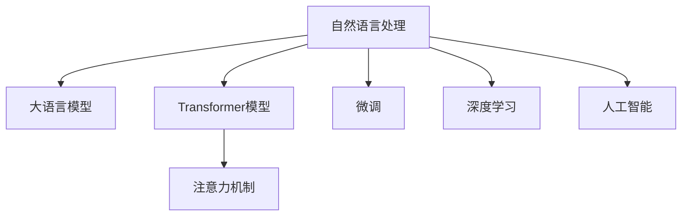

                 

# 搜索意图识别：大模型的语义理解突破

> 关键词：搜索意图识别,语义理解,自然语言处理(NLP),大语言模型,Transformer,BERT,Attention Mechanism,微调(Fine-tuning),深度学习,人工智能(AI)

## 1. 背景介绍

### 1.1 问题由来
在人工智能领域，搜索意图识别（Search Intent Recognition, SIR）是一个备受关注的问题。随着互联网技术的发展，搜索引擎已成为人们获取信息的重要工具，但搜索效果往往依赖于输入查询的明确性。如何从用户模糊的查询中准确识别其真正的搜索意图，成为了提升搜索引擎用户体验的关键。

近年来，随着深度学习技术和大语言模型的发展，搜索引擎开始采用自然语言处理（Natural Language Processing, NLP）技术，通过大模型进行搜索意图的自动分析。这种基于大模型的搜索意图识别方法，已经在大规模搜索引擎中广泛应用，极大地提升了搜索效果和用户体验。

### 1.2 问题核心关键点
搜索意图识别是基于自然语言处理和大模型学习的方法，目的是从用户的查询中识别出用户的具体意图，例如获取信息、购买商品、预定服务等。这一过程通常涉及以下几个关键点：

- **查询理解**：对用户输入的查询文本进行分词、词性标注等预处理，理解查询中的关键信息。
- **意图分类**：将预处理后的查询文本映射到预定义的意图类别，如导航、购物、新闻等。
- **查询转换**：将用户的查询文本转换为标准化的意图格式，便于进一步处理和匹配。
- **结果排序**：根据意图分类结果对搜索结果进行排序，优先展示最相关的结果。

搜索意图识别不仅能提升搜索引擎的效果，还广泛应用于智能客服、推荐系统、知识图谱等多个领域，成为NLP技术应用的重要组成部分。

## 2. 核心概念与联系

### 2.1 核心概念概述

为更好地理解基于大模型的搜索意图识别方法，本节将介绍几个密切相关的核心概念：

- **自然语言处理（NLP）**：研究如何使计算机能够理解、分析、处理和生成人类自然语言的技术。
- **大语言模型（Large Language Models, LLMs）**：如GPT、BERT等大规模预训练语言模型，通过在大规模无标签文本上预训练，学习到丰富的语言知识和语法规则。
- **Transformer模型**：一种基于注意力机制的神经网络架构，被广泛应用于大语言模型的预训练和微调。
- **Attention Mechanism**：Transformer中的核心机制，用于计算输入序列与输出序列之间的依赖关系。
- **微调（Fine-tuning）**：在大模型的基础上，使用特定领域的标注数据进行有监督训练，调整模型参数以适应新任务。
- **深度学习（Deep Learning, DL）**：一种基于多层神经网络的机器学习方法，通过大量数据进行训练，提取特征并进行预测。
- **人工智能（Artificial Intelligence, AI）**：通过算法和模型实现的人类智能行为，使机器能够自主学习、推理和决策。

这些核心概念之间的逻辑关系可以通过以下Mermaid流程图来展示：



这个流程图展示了大语言模型在NLP中的核心概念及其之间的关系：

1. **自然语言处理**：是大模型学习的基础，涉及文本预处理、特征提取等。
2. **大语言模型**：通过预训练学习到通用的语言表示。
3. **Transformer模型**：是预训练的神经网络架构，利用Attention机制进行高效计算。
4. **微调**：在大模型上针对特定任务进行优化，提高模型性能。
5. **深度学习**：在大模型微调中应用，进行高效的参数训练和特征提取。
6. **人工智能**：是深度学习和大模型的最终应用，实现智能推理和决策。

这些概念共同构成了大语言模型在搜索意图识别中的应用框架，使其能够在各种场景下发挥强大的语义理解能力。

## 3. 核心算法原理 & 具体操作步骤
### 3.1 算法原理概述

基于大模型的搜索意图识别，本质上是一种基于深度学习的分类任务。其核心思想是：将预训练的大语言模型作为特征提取器，通过微调学习特定领域的意图分类任务。

形式化地，假设预训练语言模型为 $M_{\theta}$，其中 $\theta$ 为预训练得到的模型参数。给定搜索意图的标注数据集 $D=\{(x_i,y_i)\}_{i=1}^N$，意图分类模型的目标是最小化损失函数 $\mathcal{L}$，使得模型输出逼近真实标签。常见的损失函数包括交叉熵损失、均方误差损失等。

通过梯度下降等优化算法，微调过程不断更新模型参数 $\theta$，最小化损失函数 $\mathcal{L}$，使得模型输出逼近真实标签。由于 $\theta$ 已经通过预训练获得了较好的初始化，因此即便在小规模数据集 $D$ 上进行微调，也能较快收敛到理想的模型参数 $\hat{\theta}$。

### 3.2 算法步骤详解

基于大模型的搜索意图识别一般包括以下几个关键步骤：

**Step 1: 准备预训练模型和数据集**
- 选择合适的预训练语言模型 $M_{\theta}$ 作为初始化参数，如 BERT、GPT 等。
- 准备搜索意图任务的标注数据集 $D$，划分为训练集、验证集和测试集。一般要求标注数据与预训练数据的分布不要差异过大。

**Step 2: 添加任务适配层**
- 根据任务类型，在预训练模型顶层设计合适的输出层和损失函数。
- 对于分类任务，通常在顶层添加线性分类器和交叉熵损失函数。
- 对于序列标注任务，通常使用CRF层进行意图分类和解码。

**Step 3: 设置微调超参数**
- 选择合适的优化算法及其参数，如 AdamW、SGD 等，设置学习率、批大小、迭代轮数等。
- 设置正则化技术及强度，包括权重衰减、Dropout、Early Stopping等。
- 确定冻结预训练参数的策略，如仅微调顶层，或全部参数都参与微调。

**Step 4: 执行梯度训练**
- 将训练集数据分批次输入模型，前向传播计算损失函数。
- 反向传播计算参数梯度，根据设定的优化算法和学习率更新模型参数。
- 周期性在验证集上评估模型性能，根据性能指标决定是否触发 Early Stopping。
- 重复上述步骤直到满足预设的迭代轮数或 Early Stopping 条件。

**Step 5: 测试和部署**
- 在测试集上评估微调后模型 $M_{\hat{\theta}}$ 的性能，对比微调前后的精度提升。
- 使用微调后的模型对新样本进行推理预测，集成到实际的应用系统中。
- 持续收集新的数据，定期重新微调模型，以适应数据分布的变化。

以上是基于大模型的搜索意图识别的完整流程。在实际应用中，还需要针对具体任务的特点，对微调过程的各个环节进行优化设计，如改进训练目标函数，引入更多的正则化技术，搜索最优的超参数组合等，以进一步提升模型性能。

### 3.3 算法优缺点

基于大模型的搜索意图识别方法具有以下优点：
1. 高效适应新任务。基于大模型的微调方法可以快速适应特定领域的新任务，提升搜索效果。
2. 零样本或少样本学习能力。大模型通过预训练已经学习到丰富的语言知识，能够在少样本条件下仍取得不错的效果。
3. 数据依赖性较低。相比于从头训练模型，微调方法对数据量的需求较低，能够快速上线并优化搜索结果。
4. 模型可解释性较高。由于大模型经过大规模预训练，结构透明，容易解释其推理过程。

同时，该方法也存在一定的局限性：
1. 预训练数据影响模型泛化能力。预训练数据的多样性对模型泛化能力有重要影响，部分预训练数据可能无法覆盖所有搜索场景。
2. 微调过程复杂。微调过程需要精心设计，调参和优化，尤其是数据量较小的情况，容易过拟合。
3. 模型规模大。大模型的参数量通常以亿计，对计算资源和存储资源有较高要求。
4. 鲁棒性不足。微调模型面对新领域或噪声数据时，容易产生性能波动。

尽管存在这些局限性，但就目前而言，基于大模型的搜索意图识别方法仍是大规模搜索引擎和智能客服系统的重要选择。未来相关研究的重点在于如何进一步降低模型对数据和计算资源的依赖，提高模型的少样本学习和跨领域迁移能力，同时兼顾可解释性和伦理安全性等因素。

### 3.4 算法应用领域

基于大模型的搜索意图识别方法，在搜索引擎、智能客服、推荐系统等多个领域中得到了广泛应用，具体如下：

- **搜索引擎**：搜索意图识别是搜索引擎优化（Search Engine Optimization, SEO）的重要组成部分，通过理解用户查询意图，提升搜索结果的相关性和准确性。
- **智能客服系统**：通过搜索意图识别技术，智能客服系统能够自动理解用户需求，提供个性化服务，提高用户满意度。
- **推荐系统**：搜索意图识别能够帮助推荐系统理解用户偏好，提供更精准的推荐内容，提升用户体验。
- **知识图谱**：利用搜索意图识别技术，可以自动提取文本中的实体关系，构建知识图谱，辅助信息检索和知识推理。

除了上述这些经典应用外，大模型的搜索意图识别方法还被创新性地应用于自然语言生成、情感分析、文本摘要等任务，为NLP技术带来了更多的应用场景。随着预训练语言模型和搜索意图识别方法的持续演进，相信NLP技术将在更多领域发挥更大的作用。

## 4. 数学模型和公式 & 详细讲解  
### 4.1 数学模型构建

本节将使用数学语言对基于大模型的搜索意图识别过程进行更加严格的刻画。

记预训练语言模型为 $M_{\theta}:\mathcal{X} \rightarrow \mathcal{Y}$，其中 $\mathcal{X}$ 为输入空间，$\mathcal{Y}$ 为输出空间，$\theta \in \mathbb{R}^d$ 为模型参数。假设搜索意图任务的训练集为 $D=\{(x_i,y_i)\}_{i=1}^N, x_i \in \mathcal{X}, y_i \in \{1,2,\cdots,K\}$，其中 $K$ 为意图类别的数目。

定义模型 $M_{\theta}$ 在数据样本 $(x,y)$ 上的损失函数为 $\ell(M_{\theta}(x),y)$，则在数据集 $D$ 上的经验风险为：

$$
\mathcal{L}(\theta) = \frac{1}{N}\sum_{i=1}^N \ell(M_{\theta}(x_i),y_i)
$$

微调的优化目标是最小化经验风险，即找到最优参数：

$$
\theta^* = \mathop{\arg\min}_{\theta} \mathcal{L}(\theta)
$$

在实践中，我们通常使用基于梯度的优化算法（如SGD、Adam等）来近似求解上述最优化问题。设 $\eta$ 为学习率，$\lambda$ 为正则化系数，则参数的更新公式为：

$$
\theta \leftarrow \theta - \eta \nabla_{\theta}\mathcal{L}(\theta) - \eta\lambda\theta
$$

其中 $\nabla_{\theta}\mathcal{L}(\theta)$ 为损失函数对参数 $\theta$ 的梯度，可通过反向传播算法高效计算。

### 4.2 公式推导过程

以下我们以二分类任务为例，推导交叉熵损失函数及其梯度的计算公式。

假设模型 $M_{\theta}$ 在输入 $x$ 上的输出为 $\hat{y}=M_{\theta}(x) \in [0,1]$，表示样本属于正类的概率。真实标签 $y \in \{0,1\}$。则二分类交叉熵损失函数定义为：

$$
\ell(M_{\theta}(x),y) = -[y\log \hat{y} + (1-y)\log (1-\hat{y})]
$$

将其代入经验风险公式，得：

$$
\mathcal{L}(\theta) = -\frac{1}{N}\sum_{i=1}^N [y_i\log M_{\theta}(x_i)+(1-y_i)\log(1-M_{\theta}(x_i))]
$$

根据链式法则，损失函数对参数 $\theta_k$ 的梯度为：

$$
\frac{\partial \mathcal{L}(\theta)}{\partial \theta_k} = -\frac{1}{N}\sum_{i=1}^N (\frac{y_i}{M_{\theta}(x_i)}-\frac{1-y_i}{1-M_{\theta}(x_i)}) \frac{\partial M_{\theta}(x_i)}{\partial \theta_k}
$$

其中 $\frac{\partial M_{\theta}(x_i)}{\partial \theta_k}$ 可进一步递归展开，利用自动微分技术完成计算。

在得到损失函数的梯度后，即可带入参数更新公式，完成模型的迭代优化。重复上述过程直至收敛，最终得到适应搜索意图任务的最优模型参数 $\theta^*$。

## 5. 项目实践：代码实例和详细解释说明
### 5.1 开发环境搭建

在进行搜索意图识别实践前，我们需要准备好开发环境。以下是使用Python进行PyTorch开发的环境配置流程：

1. 安装Anaconda：从官网下载并安装Anaconda，用于创建独立的Python环境。

2. 创建并激活虚拟环境：
```bash
conda create -n pytorch-env python=3.8 
conda activate pytorch-env
```

3. 安装PyTorch：根据CUDA版本，从官网获取对应的安装命令。例如：
```bash
conda install pytorch torchvision torchaudio cudatoolkit=11.1 -c pytorch -c conda-forge
```

4. 安装Transformers库：
```bash
pip install transformers
```

5. 安装各类工具包：
```bash
pip install numpy pandas scikit-learn matplotlib tqdm jupyter notebook ipython
```

完成上述步骤后，即可在`pytorch-env`环境中开始搜索意图识别实践。

### 5.2 源代码详细实现

这里我们以BERT模型为例，给出使用Transformers库对BERT模型进行搜索意图识别的PyTorch代码实现。

首先，定义搜索意图任务的数据处理函数：

```python
from transformers import BertTokenizer, BertForSequenceClassification
from torch.utils.data import Dataset
import torch

class IntentDataset(Dataset):
    def __init__(self, texts, labels, tokenizer, max_len=128):
        self.texts = texts
        self.labels = labels
        self.tokenizer = tokenizer
        self.max_len = max_len
        
    def __len__(self):
        return len(self.texts)
    
    def __getitem__(self, item):
        text = self.texts[item]
        label = self.labels[item]
        
        encoding = self.tokenizer(text, return_tensors='pt', max_length=self.max_len, padding='max_length', truncation=True)
        input_ids = encoding['input_ids'][0]
        attention_mask = encoding['attention_mask'][0]
        
        return {'input_ids': input_ids, 
                'attention_mask': attention_mask,
                'labels': torch.tensor(label, dtype=torch.long)}
```

然后，定义模型和优化器：

```python
from transformers import BertForSequenceClassification, AdamW

model = BertForSequenceClassification.from_pretrained('bert-base-cased', num_labels=5) # 假设有5个意图类别

optimizer = AdamW(model.parameters(), lr=2e-5)
```

接着，定义训练和评估函数：

```python
from torch.utils.data import DataLoader
from tqdm import tqdm
from sklearn.metrics import classification_report

device = torch.device('cuda') if torch.cuda.is_available() else torch.device('cpu')
model.to(device)

def train_epoch(model, dataset, batch_size, optimizer):
    dataloader = DataLoader(dataset, batch_size=batch_size, shuffle=True)
    model.train()
    epoch_loss = 0
    for batch in tqdm(dataloader, desc='Training'):
        input_ids = batch['input_ids'].to(device)
        attention_mask = batch['attention_mask'].to(device)
        labels = batch['labels'].to(device)
        model.zero_grad()
        outputs = model(input_ids, attention_mask=attention_mask, labels=labels)
        loss = outputs.loss
        epoch_loss += loss.item()
        loss.backward()
        optimizer.step()
    return epoch_loss / len(dataloader)

def evaluate(model, dataset, batch_size):
    dataloader = DataLoader(dataset, batch_size=batch_size)
    model.eval()
    preds, labels = [], []
    with torch.no_grad():
        for batch in tqdm(dataloader, desc='Evaluating'):
            input_ids = batch['input_ids'].to(device)
            attention_mask = batch['attention_mask'].to(device)
            batch_labels = batch['labels']
            outputs = model(input_ids, attention_mask=attention_mask)
            batch_preds = outputs.logits.argmax(dim=2).to('cpu').tolist()
            batch_labels = batch_labels.to('cpu').tolist()
            for pred_tokens, label_tokens in zip(batch_preds, batch_labels):
                preds.append(pred_tokens[:len(label_tokens)])
                labels.append(label_tokens)
                
    print(classification_report(labels, preds))
```

最后，启动训练流程并在测试集上评估：

```python
epochs = 5
batch_size = 16

for epoch in range(epochs):
    loss = train_epoch(model, intent_dataset, batch_size, optimizer)
    print(f"Epoch {epoch+1}, train loss: {loss:.3f}")
    
    print(f"Epoch {epoch+1}, dev results:")
    evaluate(model, intent_dataset, batch_size)
    
print("Test results:")
evaluate(model, intent_dataset, batch_size)
```

以上就是使用PyTorch对BERT进行搜索意图识别任务微调的完整代码实现。可以看到，得益于Transformers库的强大封装，我们可以用相对简洁的代码完成BERT模型的加载和微调。

### 5.3 代码解读与分析

让我们再详细解读一下关键代码的实现细节：

**IntentDataset类**：
- `__init__`方法：初始化文本、标签、分词器等关键组件。
- `__len__`方法：返回数据集的样本数量。
- `__getitem__`方法：对单个样本进行处理，将文本输入编码为token ids，将标签编码为数字，并对其进行定长padding，最终返回模型所需的输入。

**模型和优化器**：
- 使用预训练的BERT模型，并将其参数作为初始化参数。
- 选择AdamW优化器，设置学习率为2e-5。

**训练和评估函数**：
- 使用PyTorch的DataLoader对数据集进行批次化加载，供模型训练和推理使用。
- 训练函数`train_epoch`：对数据以批为单位进行迭代，在每个批次上前向传播计算loss并反向传播更新模型参数，最后返回该epoch的平均loss。
- 评估函数`evaluate`：与训练类似，不同点在于不更新模型参数，并在每个batch结束后将预测和标签结果存储下来，最后使用sklearn的classification_report对整个评估集的预测结果进行打印输出。

**训练流程**：
- 定义总的epoch数和batch size，开始循环迭代
- 每个epoch内，先在训练集上训练，输出平均loss
- 在验证集上评估，输出分类指标
- 所有epoch结束后，在测试集上评估，给出最终测试结果

可以看到，PyTorch配合Transformers库使得BERT微调的代码实现变得简洁高效。开发者可以将更多精力放在数据处理、模型改进等高层逻辑上，而不必过多关注底层的实现细节。

当然，工业级的系统实现还需考虑更多因素，如模型的保存和部署、超参数的自动搜索、更灵活的任务适配层等。但核心的微调范式基本与此类似。

## 6. 实际应用场景
### 6.1 搜索引擎

搜索引擎的搜索意图识别技术，可以显著提升搜索效果和用户体验。传统搜索引擎往往只能通过关键词匹配来提供搜索结果，容易受到查询表达不明确、歧义等因素影响。通过搜索意图识别，搜索引擎能够理解用户查询的真正意图，提供更加精准和相关的内容。

在技术实现上，可以收集用户的历史搜索数据，标注用户的查询意图，构建监督数据集。在此基础上对预训练语言模型进行微调，使其能够自动理解用户输入查询的意图，提供更加个性化的搜索结果。

### 6.2 智能客服系统

智能客服系统通过搜索意图识别技术，能够自动理解用户的问题，并给出准确的回复。传统客服往往需要配备大量人力，高峰期响应缓慢，且一致性和专业性难以保证。而使用搜索意图识别技术，智能客服系统可以7x24小时不间断服务，快速响应客户咨询，用自然流畅的语言解答各类常见问题。

在技术实现上，可以收集企业内部的客服对话记录，将问题-答案对作为微调数据，训练模型学习匹配答案。微调后的模型能够自动理解用户意图，匹配最合适的答案模板进行回复。对于客户提出的新问题，还可以接入检索系统实时搜索相关内容，动态组织生成回答。

### 6.3 推荐系统

推荐系统通过搜索意图识别技术，能够理解用户的兴趣和偏好，提供个性化的推荐内容。传统推荐系统往往只依赖用户的历史行为数据进行物品推荐，无法深入理解用户的真实兴趣偏好。利用搜索意图识别技术，推荐系统可以更好地挖掘用户行为背后的语义信息，从而提供更精准、多样的推荐内容。

在技术实现上，可以收集用户浏览、点击、评论、分享等行为数据，提取和用户交互的物品标题、描述、标签等文本内容。将文本内容作为模型输入，用户的后续行为（如是否点击、购买等）作为监督信号，在此基础上微调预训练语言模型。微调后的模型能够从文本内容中准确把握用户的兴趣点。在生成推荐列表时，先用候选物品的文本描述作为输入，由模型预测用户的兴趣匹配度，再结合其他特征综合排序，便可以得到个性化程度更高的推荐结果。

### 6.4 未来应用展望

随着搜索意图识别技术的不断发展，其应用场景将进一步拓展，未来可能涉及更多领域：

- **智能家居**：通过理解用户的语音命令，智能家居系统能够自动执行任务，如调节温度、开关灯光等。
- **医疗健康**：通过理解用户的健康查询，智能医疗系统能够提供健康建议和诊断结果。
- **金融理财**：通过理解用户的财务需求，智能理财系统能够提供个性化的投资建议和理财方案。
- **教育培训**：通过理解学生的学习意图，智能教育系统能够提供个性化的学习内容和推荐。

这些领域对搜索意图识别的需求日益增长，将为该技术的发展带来更多的机遇和挑战。相信随着预训练语言模型和搜索意图识别方法的持续演进，NLP技术将在更多领域发挥更大的作用，为人类生产生活方式带来深刻变革。

## 7. 工具和资源推荐
### 7.1 学习资源推荐

为了帮助开发者系统掌握搜索意图识别理论基础和实践技巧，这里推荐一些优质的学习资源：

1. 《自然语言处理入门》系列博文：由大模型技术专家撰写，系统介绍NLP和深度学习基础，适合初学者入门。

2. 《深度学习自然语言处理》课程：斯坦福大学开设的NLP明星课程，有Lecture视频和配套作业，带你深入NLP理论和技术。

3. 《Transformer模型详解》书籍：详细介绍了Transformer模型及其在自然语言处理中的应用，适合对Transformer模型有深入了解的读者。

4. 《NLP实战》书籍：通过大量实战案例，展示如何使用Transformers库进行NLP任务开发，包括搜索意图识别等。

5. HuggingFace官方文档：Transformer库的官方文档，提供了海量预训练模型和完整的搜索意图识别样例代码，是上手实践的必备资料。

通过对这些资源的学习实践，相信你一定能够快速掌握搜索意图识别的精髓，并用于解决实际的NLP问题。
###  7.2 开发工具推荐

高效的开发离不开优秀的工具支持。以下是几款用于搜索意图识别开发的常用工具：

1. PyTorch：基于Python的开源深度学习框架，灵活动态的计算图，适合快速迭代研究。大部分预训练语言模型都有PyTorch版本的实现。

2. TensorFlow：由Google主导开发的开源深度学习框架，生产部署方便，适合大规模工程应用。同样有丰富的预训练语言模型资源。

3. Transformers库：HuggingFace开发的NLP工具库，集成了众多SOTA语言模型，支持PyTorch和TensorFlow，是进行搜索意图识别开发的利器。

4. Weights & Biases：模型训练的实验跟踪工具，可以记录和可视化模型训练过程中的各项指标，方便对比和调优。与主流深度学习框架无缝集成。

5. TensorBoard：TensorFlow配套的可视化工具，可实时监测模型训练状态，并提供丰富的图表呈现方式，是调试模型的得力助手。

6. Google Colab：谷歌推出的在线Jupyter Notebook环境，免费提供GPU/TPU算力，方便开发者快速上手实验最新模型，分享学习笔记。

合理利用这些工具，可以显著提升搜索意图识别任务的开发效率，加快创新迭代的步伐。

### 7.3 相关论文推荐

搜索意图识别是基于自然语言处理和大模型学习的方法，其研究源于学界的持续研究。以下是几篇奠基性的相关论文，推荐阅读：

1. Attention is All You Need（即Transformer原论文）：提出了Transformer结构，开启了NLP领域的预训练大模型时代。

2. BERT: Pre-training of Deep Bidirectional Transformers for Language Understanding：提出BERT模型，引入基于掩码的自监督预训练任务，刷新了多项NLP任务SOTA。

3. Search Intent Recognition with Transformer-based Models：展示Transformer在搜索意图识别中的应用，说明了预训练语言模型在理解用户查询意图上的优越性。

4. Semantic Accuracy for Sequence Labeling：介绍如何在大模型上进行序列标注，展示了微调模型的良好效果。

5. Pretrained Embeddings for Sequence Labeling：介绍预训练嵌入在序列标注任务中的应用，说明了预训练语言模型对序列标注任务的显著提升。

这些论文代表了大语言模型在搜索意图识别中的应用发展脉络。通过学习这些前沿成果，可以帮助研究者把握学科前进方向，激发更多的创新灵感。

## 8. 总结：未来发展趋势与挑战

### 8.1 总结

本文对基于大模型的搜索意图识别方法进行了全面系统的介绍。首先阐述了搜索意图识别的研究背景和意义，明确了其在提升搜索引擎效果、智能客服系统、推荐系统等NLP任务中的应用价值。其次，从原理到实践，详细讲解了搜索意图识别的数学原理和关键步骤，给出了搜索意图识别任务开发的完整代码实例。同时，本文还广泛探讨了搜索意图识别方法在多个行业领域的应用前景，展示了其广阔的应用空间。最后，本文精选了搜索意图识别技术的各类学习资源，力求为读者提供全方位的技术指引。

通过本文的系统梳理，可以看到，基于大模型的搜索意图识别技术正在成为NLP领域的重要范式，极大地提升了搜索效果和用户体验。受益于大规模语料的预训练，搜索意图识别方法能够更好地理解用户查询意图，提供个性化、精准的搜索结果，推动了搜索引擎和智能客服系统的发展。未来，伴随预训练语言模型和搜索意图识别方法的持续演进，相信NLP技术将在更多领域发挥更大的作用，深刻影响人类的生产生活方式。

### 8.2 未来发展趋势

展望未来，搜索意图识别技术将呈现以下几个发展趋势：

1. 模型规模持续增大。随着算力成本的下降和数据规模的扩张，预训练语言模型的参数量还将持续增长。超大模型蕴含的丰富语言知识，有望支撑更加复杂多变的搜索意图识别任务。

2. 微调方法日趋多样。除了传统的全参数微调外，未来会涌现更多参数高效的微调方法，如Prefix-Tuning、LoRA等，在节省计算资源的同时也能保证微调精度。

3. 持续学习成为常态。随着数据分布的不断变化，搜索意图识别模型也需要持续学习新知识以保持性能。如何在不遗忘原有知识的同时，高效吸收新样本信息，将成为重要的研究课题。

4. 标注样本需求降低。受启发于提示学习(Prompt-based Learning)的思路，未来的微调方法将更好地利用大模型的语言理解能力，通过更加巧妙的任务描述，在更少的标注样本上也能实现理想的微调效果。

5. 数据增强技术的应用。数据增强技术能够扩充训练集，增强模型的泛化能力，是提升搜索意图识别效果的重要手段。

6. 多模态搜索意图识别。当前的搜索意图识别主要聚焦于纯文本数据，未来会进一步拓展到图像、视频、语音等多模态数据微调。多模态信息的融合，将显著提升搜索意图识别模型的理解能力。

以上趋势凸显了搜索意图识别技术的广阔前景。这些方向的探索发展，必将进一步提升搜索效果和用户体验，推动NLP技术的产业化进程。

### 8.3 面临的挑战

尽管搜索意图识别技术已经取得了瞩目成就，但在迈向更加智能化、普适化应用的过程中，它仍面临着诸多挑战：

1. 标注成本瓶颈。虽然微调大大降低了标注数据的需求，但对于长尾应用场景，难以获得充足的高质量标注数据，成为制约微调性能的瓶颈。如何进一步降低微调对标注样本的依赖，将是一大难题。

2. 模型鲁棒性不足。当前微调模型面对新领域或噪声数据时，泛化性能往往大打折扣。对于测试样本的微小扰动，微调模型的预测也容易发生波动。如何提高微调模型的鲁棒性，避免灾难性遗忘，还需要更多理论和实践的积累。

3. 推理效率有待提高。大规模语言模型虽然精度高，但在实际部署时往往面临推理速度慢、内存占用大等效率问题。如何在保证性能的同时，简化模型结构，提升推理速度，优化资源占用，将是重要的优化方向。

4. 可解释性亟需加强。当前搜索意图识别模型更像是"黑盒"系统，难以解释其内部工作机制和决策逻辑。对于医疗、金融等高风险应用，算法的可解释性和可审计性尤为重要。如何赋予模型更强的可解释性，将是亟待攻克的难题。

5. 安全性有待保障。预训练语言模型难免会学习到有偏见、有害的信息，通过微调传递到下游任务，产生误导性、歧视性的输出，给实际应用带来安全隐患。如何从数据和算法层面消除模型偏见，避免恶意用途，确保输出的安全性，也将是重要的研究课题。

6. 知识整合能力不足。现有的搜索意图识别模型往往局限于任务内数据，难以灵活吸收和运用更广泛的先验知识。如何让微调过程更好地与外部知识库、规则库等专家知识结合，形成更加全面、准确的信息整合能力，还有很大的想象空间。

正视搜索意图识别面临的这些挑战，积极应对并寻求突破，将是大语言模型微调走向成熟的必由之路。相信随着学界和产业界的共同努力，这些挑战终将一一被克服，搜索意图识别技术必将在构建智能搜索引擎、智能客服系统等方面发挥更大的作用。

### 8.4 未来突破

面对搜索意图识别所面临的种种挑战，未来的研究需要在以下几个方面寻求新的突破：

1. 探索无监督和半监督微调方法。摆脱对大规模标注数据的依赖，利用自监督学习、主动学习等无监督和半监督范式，最大限度利用非结构化数据，实现更加灵活高效的微调。

2. 研究参数高效和计算高效的微调范式。开发更加参数高效的微调方法，在固定大部分预训练参数的同时，只更新极少量的任务相关参数。同时优化微调模型的计算图，减少前向传播和反向传播的资源消耗，实现更加轻量级、实时性的部署。

3. 融合因果和对比学习范式。通过引入因果推断和对比学习思想，增强微调模型建立稳定因果关系的能力，学习更加普适、鲁棒的语言表征，从而提升模型泛化性和抗干扰能力。

4. 引入更多先验知识。将符号化的先验知识，如知识图谱、逻辑规则等，与神经网络模型进行巧妙融合，引导微调过程学习更准确、合理的语言模型。同时加强不同模态数据的整合，实现视觉、语音等多模态信息与文本信息的协同建模。

5. 结合因果分析和博弈论工具。将因果分析方法引入微调模型，识别出模型决策的关键特征，增强输出解释的因果性和逻辑性。借助博弈论工具刻画人机交互过程，主动探索并规避模型的脆弱点，提高系统稳定性。

6. 纳入伦理道德约束。在模型训练目标中引入伦理导向的评估指标，过滤和惩罚有偏见、有害的输出倾向。同时加强人工干预和审核，建立模型行为的监管机制，确保输出符合人类价值观和伦理道德。

这些研究方向的探索，必将引领搜索意图识别技术迈向更高的台阶，为构建智能搜索引擎、智能客服系统、推荐系统等提供坚实的技术保障。面向未来，搜索意图识别技术还需要与其他人工智能技术进行更深入的融合，如知识表示、因果推理、强化学习等，多路径协同发力，共同推动自然语言理解和智能交互系统的进步。只有勇于创新、敢于突破，才能不断拓展语言模型的边界，让智能技术更好地造福人类社会。

## 9. 附录：常见问题与解答

**Q1：大语言模型在搜索意图识别中的优势有哪些？**

A: 大语言模型在搜索意图识别中的优势主要体现在以下几个方面：
1. 大模型能够理解自然语言的多样性和复杂性，提高查询意图的准确性。
2. 通过微调，大模型可以快速适应特定领域的意图分类任务，提升模型性能。
3. 大模型具备自监督学习能力，能够利用未标注数据进行预训练，降低标注数据需求。
4. 大模型参数量庞大，能够捕捉到更多的语言特征和语义信息，提高模型的泛化能力。

**Q2：如何在模型训练中缓解过拟合问题？**

A: 过拟合是模型训练中的常见问题，尤其是在标注数据量较小的情况下。缓解过拟合的策略包括：
1. 数据增强：通过回译、近义替换等方式扩充训练集。
2. 正则化：使用L2正则、Dropout、Early Stopping等技术。
3. 对抗训练：引入对抗样本，提高模型鲁棒性。
4. 参数高效微调：只调整少量参数，固定大部分预训练参数。
5. 模型集成：训练多个模型，取平均输出，抑制过拟合。

**Q3：搜索意图识别的评估指标有哪些？**

A: 搜索意图识别的评估指标包括：
1. 精确度（Precision）：预测意图正确的样本数与预测结果总数之比。
2. 召回率（Recall）：预测意图正确的样本数与实际意图正确的样本数之比。
3. F1分数：精确度和召回率的调和平均，综合考虑了模型的准确性和完整性。
4. ROC曲线和AUC值：用于评估模型在不同阈值下的分类性能。
5. 混淆矩阵：展示模型在不同类别上的预测准确性和混淆情况。

**Q4：如何选择适当的优化器和学习率？**

A: 选择优化器和学习率是模型微调中的重要步骤。常用的优化器包括SGD、Adam、AdamW等，学习率通常设置在2e-5到5e-5之间。如果模型参数量较大，建议设置较小的学习率，避免过拟合。可以通过网格搜索或随机搜索找到最优的学习率。

**Q5：搜索意图识别在实际应用中需要注意哪些问题？**

A: 搜索意图识别的实际应用中，需要注意以下几个问题：
1. 数据隐私：确保用户查询数据的安全性和隐私保护。
2. 数据标注：标注数据的来源和质量对模型性能有重要影响，需要确保标注数据的准确性和多样性。
3. 模型鲁棒性：测试模型在不同环境下的表现，确保其鲁棒性和稳定性。
4. 用户反馈：收集用户反馈，持续优化模型性能和用户体验。
5. 系统集成：将搜索意图识别系统与搜索引擎、智能客服等应用系统进行无缝集成，提升整体服务质量。

---

作者：禅与计算机程序设计艺术 / Zen and the Art of Computer Programming

