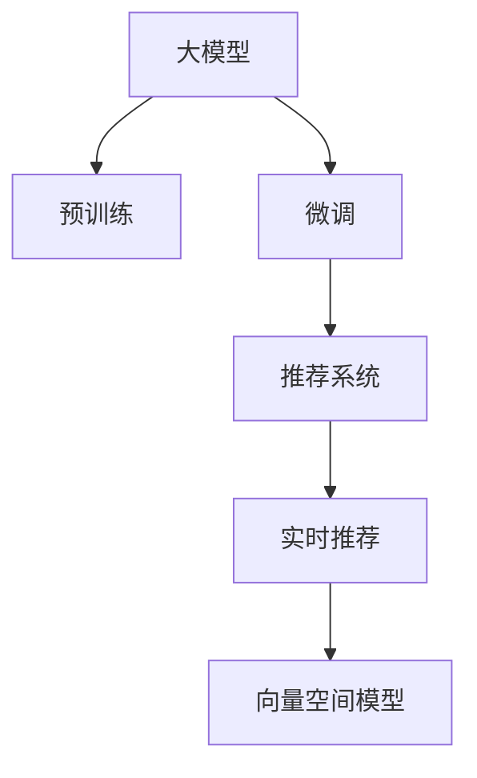

                 

# 搜索推荐的实时个性化：大模型高效方案

## 1. 背景介绍

### 1.1 问题由来
在当今的互联网时代，个性化推荐已经成为各类电商、社交、新闻、视频等平台提升用户体验、提高用户留存和转化率的重要手段。为了满足用户的个性化需求，平台需要实时动态地调整推荐内容，这涉及到大量的数据收集、存储、计算和模型训练等复杂过程。尽管当前的推荐系统已经具备一定的个性化能力，但面临数据多样性、动态性、规模性等多方面的挑战，亟需进一步的优化和升级。

大模型（如BERT、GPT等）的出现为推荐系统的个性化推荐提供了新的方向。通过在大规模文本数据上进行预训练，大模型可以学习到丰富的语言知识和语义表示，在微调时能够适应多种推荐场景，提高推荐的精度和效果。但同时，大模型的计算资源需求也极大，如何在保证推荐效果的同时，降低计算成本，是当前需要解决的重要问题。

### 1.2 问题核心关键点
大模型的高效推荐方案，需要综合考虑以下几个关键点：

1. **数据预处理**：如何高效地将用户行为数据转化为推荐模型能够理解的格式。
2. **模型优化**：如何在大模型上进行高效微调，适应推荐任务的需求。
3. **实时推荐**：如何在实时场景下高效地生成推荐结果。
4. **结果评估**：如何高效地评估推荐效果，及时调整模型。
5. **系统架构**：如何构建一个高效、可扩展的推荐系统架构，支撑大规模推荐任务。

## 2. 核心概念与联系

### 2.1 核心概念概述

为更好地理解大模型在搜索推荐中的高效应用方案，本节将介绍几个密切相关的核心概念：

- **大模型**：以自回归(如GPT)或自编码(如BERT)模型为代表的大规模预训练语言模型。通过在大规模无标签文本语料上进行预训练，学习通用的语言表示，具备强大的语言理解和生成能力。

- **预训练(Pre-training)**：指在大规模无标签文本语料上，通过自监督学习任务训练通用语言模型的过程。常见的预训练任务包括言语建模、遮挡语言模型等。预训练使得模型学习到语言的通用表示。

- **微调(Fine-tuning)**：指在预训练模型的基础上，使用下游任务的少量标注数据，通过有监督地训练来优化模型在特定任务上的性能。通常只需要调整顶层分类器或解码器，并以较小的学习率更新全部或部分的模型参数。

- **推荐系统**：使用算法或模型，对用户的行为数据进行分析，推荐可能满足用户需求的产品、内容等。

- **实时推荐**：指在用户访问网页或应用时，根据用户实时行为数据，动态生成并推送推荐结果的系统。

- **向量空间模型(VSM)**：将文本数据映射到高维向量空间中，通过计算向量之间的相似度进行推荐。

这些核心概念之间的逻辑关系可以通过以下Mermaid流程图来展示：



这个流程图展示了大模型的核心概念及其之间的关系：

1. 大模型通过预训练获得基础能力。
2. 微调对预训练模型进行任务特定的优化，使得模型能够适应推荐任务。
3. 推荐系统利用微调后的模型，结合用户行为数据，动态生成推荐结果。
4. 实时推荐确保推荐结果能够及时推送给用户。
5. 向量空间模型为推荐系统提供了一种高效的文本表示和推荐方法。

这些概念共同构成了大模型在搜索推荐中的应用框架，使其能够高效地提供个性化推荐服务。通过理解这些核心概念，我们可以更好地把握大模型的工作原理和优化方向。

## 3. 核心算法原理 & 具体操作步骤
### 3.1 算法原理概述

基于大模型的搜索推荐方案，本质上是一个深度学习的微调过程。其核心思想是：将预训练的大模型视作一个强大的"特征提取器"，通过在下游推荐任务的数据上进行有监督的微调，使得模型能够提取用户行为特征，并生成个性化推荐结果。

形式化地，假设预训练模型为 $M_{\theta}$，其中 $\theta$ 为预训练得到的模型参数。给定推荐任务 $T$ 的训练集 $D=\{(x_i, y_i)\}_{i=1}^N, x_i \in \mathbb{R}^{d}, y_i \in \{0,1\}$，微调的目标是找到新的模型参数 $\hat{\theta}$，使得：

$$
\hat{\theta}=\mathop{\arg\min}_{\theta} \mathcal{L}(M_{\theta},D)
$$

其中 $\mathcal{L}$ 为针对任务 $T$ 设计的损失函数，用于衡量模型预测输出与真实标签之间的差异。常见的损失函数包括交叉熵损失、均方误差损失等。

通过梯度下降等优化算法，微调过程不断更新模型参数 $\theta$，最小化损失函数 $\mathcal{L}$，使得模型输出逼近真实标签。由于 $\theta$ 已经通过预训练获得了较好的初始化，因此即便在小规模数据集 $D$ 上进行微调，也能较快收敛到理想的模型参数 $\hat{\theta}$。

### 3.2 算法步骤详解

基于大模型的搜索推荐微调一般包括以下几个关键步骤：

**Step 1: 准备预训练模型和数据集**
- 选择合适的预训练语言模型 $M_{\theta}$ 作为初始化参数，如 BERT、GPT 等。
- 准备推荐任务 $T$ 的训练集 $D$，划分为训练集、验证集和测试集。一般要求训练集与预训练数据的分布不要差异过大。

**Step 2: 添加任务适配层**
- 根据任务类型，在预训练模型顶层设计合适的输出层和损失函数。
- 对于分类任务，通常在顶层添加线性分类器和交叉熵损失函数。
- 对于生成任务，通常使用语言模型的解码器输出概率分布，并以负对数似然为损失函数。

**Step 3: 设置微调超参数**
- 选择合适的优化算法及其参数，如 AdamW、SGD 等，设置学习率、批大小、迭代轮数等。
- 设置正则化技术及强度，包括权重衰减、Dropout、Early Stopping等。
- 确定冻结预训练参数的策略，如仅微调顶层，或全部参数都参与微调。

**Step 4: 执行梯度训练**
- 将训练集数据分批次输入模型，前向传播计算损失函数。
- 反向传播计算参数梯度，根据设定的优化算法和学习率更新模型参数。
- 周期性在验证集上评估模型性能，根据性能指标决定是否触发 Early Stopping。
- 重复上述步骤直到满足预设的迭代轮数或 Early Stopping 条件。

**Step 5: 测试和部署**
- 在测试集上评估微调后模型 $M_{\hat{\theta}}$ 的性能，对比微调前后的精度提升。
- 使用微调后的模型对新样本进行推理预测，集成到实际的应用系统中。
- 持续收集新的数据，定期重新微调模型，以适应数据分布的变化。

以上是基于大模型微调的推荐方案的一般流程。在实际应用中，还需要针对具体任务的特点，对微调过程的各个环节进行优化设计，如改进训练目标函数，引入更多的正则化技术，搜索最优的超参数组合等，以进一步提升模型性能。

### 3.3 算法优缺点

基于大模型的搜索推荐方案具有以下优点：
1. 简单高效。只需准备少量标注数据，即可对预训练模型进行快速适配，获得较大的性能提升。
2. 通用适用。适用于各种推荐任务，包括个性化推荐、协同过滤、混合推荐等，设计简单的任务适配层即可实现微调。
3. 效果显著。在学术界和工业界的诸多推荐场景上，基于微调的方法已经刷新了多项推荐任务SOTA。

同时，该方案也存在一定的局限性：
1. 依赖标注数据。微调的效果很大程度上取决于标注数据的质量和数量，获取高质量标注数据的成本较高。
2. 迁移能力有限。当目标任务与预训练数据的分布差异较大时，微调的性能提升有限。
3. 可解释性不足。微调模型的决策过程通常缺乏可解释性，难以对其推理逻辑进行分析和调试。

尽管存在这些局限性，但就目前而言，基于大模型的推荐方案仍是最主流范式。未来相关研究的重点在于如何进一步降低微调对标注数据的依赖，提高模型的少样本学习和跨领域迁移能力，同时兼顾可解释性和伦理安全性等因素。

### 3.4 算法应用领域

基于大模型的搜索推荐方案在电商、社交、新闻、视频等推荐场景中已经得到了广泛的应用，覆盖了几乎所有常见推荐任务，例如：

- 个性化推荐：如电商平台的商品推荐、新闻平台的资讯推荐等。
- 协同过滤：通过用户行为数据，找到相似用户，进行推荐。
- 混合推荐：结合内容推荐和协同过滤，提升推荐效果。

除了上述这些经典任务外，大模型推荐方案也被创新性地应用到更多场景中，如可控推荐、需求预测、市场分析等，为推荐技术带来了全新的突破。随着预训练模型和微调方法的不断进步，相信推荐技术将在更广阔的应用领域大放异彩。

## 4. 数学模型和公式 & 详细讲解
### 4.1 数学模型构建

本节将使用数学语言对基于大模型的推荐微调过程进行更加严格的刻画。

记预训练语言模型为 $M_{\theta}:\mathbb{R}^{d} \rightarrow \mathbb{R}^{d'}$，其中 $\mathbb{R}^{d}$ 为输入空间的向量表示，$\mathbb{R}^{d'}$ 为输出空间的向量表示，$\theta \in \mathbb{R}^d$ 为模型参数。假设推荐任务 $T$ 的训练集为 $D=\{(x_i, y_i)\}_{i=1}^N, x_i \in \mathbb{R}^{d}, y_i \in \{0,1\}$。

定义模型 $M_{\theta}$ 在数据样本 $(x,y)$ 上的损失函数为 $\ell(M_{\theta}(x),y)$，则在数据集 $D$ 上的经验风险为：

$$
\mathcal{L}(\theta) = \frac{1}{N} \sum_{i=1}^N \ell(M_{\theta}(x_i),y_i)
$$

微调的优化目标是最小化经验风险，即找到最优参数：

$$
\theta^* = \mathop{\arg\min}_{\theta} \mathcal{L}(\theta)
$$

在实践中，我们通常使用基于梯度的优化算法（如SGD、Adam等）来近似求解上述最优化问题。设 $\eta$ 为学习率，$\lambda$ 为正则化系数，则参数的更新公式为：

$$
\theta \leftarrow \theta - \eta \nabla_{\theta}\mathcal{L}(\theta) - \eta\lambda\theta
$$

其中 $\nabla_{\theta}\mathcal{L}(\theta)$ 为损失函数对参数 $\theta$ 的梯度，可通过反向传播算法高效计算。

### 4.2 公式推导过程

以下我们以二分类推荐任务为例，推导交叉熵损失函数及其梯度的计算公式。

假设模型 $M_{\theta}$ 在输入 $x$ 上的输出为 $\hat{y}=M_{\theta}(x) \in [0,1]$，表示样本属于正类的概率。真实标签 $y \in \{0,1\}$。则二分类交叉熵损失函数定义为：

$$
\ell(M_{\theta}(x),y) = -[y\log \hat{y} + (1-y)\log (1-\hat{y})]
$$

将其代入经验风险公式，得：

$$
\mathcal{L}(\theta) = -\frac{1}{N}\sum_{i=1}^N [y_i\log M_{\theta}(x_i)+(1-y_i)\log(1-M_{\theta}(x_i))]
$$

根据链式法则，损失函数对参数 $\theta_k$ 的梯度为：

$$
\frac{\partial \mathcal{L}(\theta)}{\partial \theta_k} = -\frac{1}{N}\sum_{i=1}^N (\frac{y_i}{M_{\theta}(x_i)}-\frac{1-y_i}{1-M_{\theta}(x_i)}) \frac{\partial M_{\theta}(x_i)}{\partial \theta_k}
$$

其中 $\frac{\partial M_{\theta}(x_i)}{\partial \theta_k}$ 可进一步递归展开，利用自动微分技术完成计算。

在得到损失函数的梯度后，即可带入参数更新公式，完成模型的迭代优化。重复上述过程直至收敛，最终得到适应下游任务的最优模型参数 $\theta^*$。

## 5. 项目实践：代码实例和详细解释说明
### 5.1 开发环境搭建

在进行推荐微调实践前，我们需要准备好开发环境。以下是使用Python进行PyTorch开发的环境配置流程：

1. 安装Anaconda：从官网下载并安装Anaconda，用于创建独立的Python环境。

2. 创建并激活虚拟环境：
```bash
conda create -n pytorch-env python=3.8 
conda activate pytorch-env
```

3. 安装PyTorch：根据CUDA版本，从官网获取对应的安装命令。例如：
```bash
conda install pytorch torchvision torchaudio cudatoolkit=11.1 -c pytorch -c conda-forge
```

4. 安装Transformers库：
```bash
pip install transformers
```

5. 安装各类工具包：
```bash
pip install numpy pandas scikit-learn matplotlib tqdm jupyter notebook ipython
```

完成上述步骤后，即可在`pytorch-env`环境中开始推荐微调实践。

### 5.2 源代码详细实现

这里我们以电商平台的个性化推荐任务为例，给出使用Transformers库对BERT模型进行推荐微调的PyTorch代码实现。

首先，定义推荐任务的数据处理函数：

```python
from transformers import BertTokenizer
from torch.utils.data import Dataset
import torch

class RecommendationDataset(Dataset):
    def __init__(self, items, ratings, tokenizer, max_len=128):
        self.items = items
        self.ratings = ratings
        self.tokenizer = tokenizer
        self.max_len = max_len
        
    def __len__(self):
        return len(self.items)
    
    def __getitem__(self, item):
        item = self.items[item]
        rating = self.ratings[item]
        
        encoding = self.tokenizer(item, return_tensors='pt', max_length=self.max_len, padding='max_length', truncation=True)
        input_ids = encoding['input_ids'][0]
        attention_mask = encoding['attention_mask'][0]
        
        # 对评分进行编码
        rating = [rating] * self.max_len
        labels = torch.tensor(rating, dtype=torch.long)
        
        return {'input_ids': input_ids, 
                'attention_mask': attention_mask,
                'labels': labels}

# 数据示例
items = ["item1", "item2", "item3"]
ratings = [5, 3, 4]
tokenizer = BertTokenizer.from_pretrained('bert-base-cased')

recommend_dataset = RecommendationDataset(items, ratings, tokenizer)
```

然后，定义模型和优化器：

```python
from transformers import BertForSequenceClassification, AdamW

model = BertForSequenceClassification.from_pretrained('bert-base-cased', num_labels=2)

optimizer = AdamW(model.parameters(), lr=2e-5)
```

接着，定义训练和评估函数：

```python
from torch.utils.data import DataLoader
from tqdm import tqdm
from sklearn.metrics import classification_report

device = torch.device('cuda') if torch.cuda.is_available() else torch.device('cpu')
model.to(device)

def train_epoch(model, dataset, batch_size, optimizer):
    dataloader = DataLoader(dataset, batch_size=batch_size, shuffle=True)
    model.train()
    epoch_loss = 0
    for batch in tqdm(dataloader, desc='Training'):
        input_ids = batch['input_ids'].to(device)
        attention_mask = batch['attention_mask'].to(device)
        labels = batch['labels'].to(device)
        model.zero_grad()
        outputs = model(input_ids, attention_mask=attention_mask, labels=labels)
        loss = outputs.loss
        epoch_loss += loss.item()
        loss.backward()
        optimizer.step()
    return epoch_loss / len(dataloader)

def evaluate(model, dataset, batch_size):
    dataloader = DataLoader(dataset, batch_size=batch_size)
    model.eval()
    preds, labels = [], []
    with torch.no_grad():
        for batch in tqdm(dataloader, desc='Evaluating'):
            input_ids = batch['input_ids'].to(device)
            attention_mask = batch['attention_mask'].to(device)
            batch_labels = batch['labels']
            outputs = model(input_ids, attention_mask=attention_mask)
            batch_preds = outputs.logits.argmax(dim=2).to('cpu').tolist()
            batch_labels = batch_labels.to('cpu').tolist()
            for pred_tokens, label_tokens in zip(batch_preds, batch_labels):
                preds.append(pred_tokens[:len(label_tokens)])
                labels.append(label_tokens)
                
    print(classification_report(labels, preds))
```

最后，启动训练流程并在测试集上评估：

```python
epochs = 5
batch_size = 16

for epoch in range(epochs):
    loss = train_epoch(model, recommend_dataset, batch_size, optimizer)
    print(f"Epoch {epoch+1}, train loss: {loss:.3f}")
    
    print(f"Epoch {epoch+1}, dev results:")
    evaluate(model, recommend_dataset, batch_size)
    
print("Test results:")
evaluate(model, recommend_dataset, batch_size)
```

以上就是使用PyTorch对BERT进行电商推荐任务微调的完整代码实现。可以看到，得益于Transformers库的强大封装，我们可以用相对简洁的代码完成BERT模型的加载和微调。

### 5.3 代码解读与分析

让我们再详细解读一下关键代码的实现细节：

**RecommendationDataset类**：
- `__init__`方法：初始化商品、评分、分词器等关键组件。
- `__len__`方法：返回数据集的样本数量。
- `__getitem__`方法：对单个样本进行处理，将商品输入编码为token ids，将评分编码为数字，并对其进行定长padding，最终返回模型所需的输入。

**数据示例**：
- 定义商品和评分样本，作为微调的监督数据。

**训练和评估函数**：
- 使用PyTorch的DataLoader对数据集进行批次化加载，供模型训练和推理使用。
- 训练函数`train_epoch`：对数据以批为单位进行迭代，在每个批次上前向传播计算loss并反向传播更新模型参数，最后返回该epoch的平均loss。
- 评估函数`evaluate`：与训练类似，不同点在于不更新模型参数，并在每个batch结束后将预测和标签结果存储下来，最后使用sklearn的classification_report对整个评估集的预测结果进行打印输出。

**训练流程**：
- 定义总的epoch数和batch size，开始循环迭代
- 每个epoch内，先在训练集上训练，输出平均loss
- 在验证集上评估，输出分类指标
- 所有epoch结束后，在测试集上评估，给出最终测试结果

可以看到，PyTorch配合Transformers库使得BERT微调的代码实现变得简洁高效。开发者可以将更多精力放在数据处理、模型改进等高层逻辑上，而不必过多关注底层的实现细节。

当然，工业级的系统实现还需考虑更多因素，如模型的保存和部署、超参数的自动搜索、更灵活的任务适配层等。但核心的微调范式基本与此类似。

## 6. 实际应用场景
### 6.1 电商推荐系统

基于大模型推荐技术，电商平台的推荐系统可以实现高效的个性化推荐，提升用户购物体验和转化率。传统的推荐系统往往依赖用户的历史行为数据进行推荐，无法充分利用丰富的用户信息。而使用微调后的推荐模型，能够根据用户的实时行为数据，动态生成推荐内容。

在技术实现上，可以收集用户的浏览、点击、收藏、购买等行为数据，将这些数据转化为模型能够理解的格式。通过微调BERT等预训练语言模型，使其学习到用户行为特征，并生成个性化推荐结果。推荐系统可以根据用户的实时行为数据，动态更新模型，快速生成推荐内容，从而提升用户体验和推荐效果。

### 6.2 新闻推荐系统

新闻平台的推荐系统可以根据用户的历史阅读行为，推荐相关新闻资讯。传统的推荐系统往往采用协同过滤、矩阵分解等方法，无法灵活考虑新闻内容的多样性和时效性。而使用微调后的推荐模型，能够根据用户的历史阅读行为和实时访问数据，生成更符合用户兴趣的个性化推荐结果。

在具体实现上，可以通过微调BERT等预训练语言模型，使其学习到新闻文本的语义表示，并能够进行推荐。推荐系统可以根据用户的实时访问数据，动态调整推荐内容，从而提升用户的新闻阅读体验。

### 6.3 视频推荐系统

视频平台的推荐系统可以根据用户的历史观看行为，推荐相关视频内容。传统的推荐系统往往依赖基于内容的推荐方法和协同过滤方法，无法灵活考虑视频的情感、时长等多样性特征。而使用微调后的推荐模型，能够根据用户的历史观看行为和实时访问数据，生成更符合用户兴趣的个性化推荐结果。

在具体实现上，可以通过微调BERT等预训练语言模型，使其学习到视频标题、描述、评论等文本的语义表示，并能够进行推荐。推荐系统可以根据用户的实时访问数据，动态调整推荐内容，从而提升用户的观看体验。

### 6.4 未来应用展望

随着大语言模型推荐技术的不断发展，推荐系统将在更多领域得到应用，为平台带来更多的用户价值。

在智慧零售领域，推荐系统能够提升用户的购物体验，提高销售额。在智能交通领域，推荐系统能够为用户提供最合适的出行方案，提高出行效率。在金融领域，推荐系统能够为用户提供个性化的理财方案，提高用户满意度。在娱乐领域，推荐系统能够为用户提供个性化的音乐、电影、游戏等内容，提高用户的娱乐体验。

此外，在教育、医疗、健康等更多垂直领域，基于大模型的推荐系统也将不断涌现，为行业带来新的变革和机遇。相信随着技术的日益成熟，推荐系统必将成为各行各业数字化转型的重要工具，推动社会的进步和发展。

## 7. 工具和资源推荐
### 7.1 学习资源推荐

为了帮助开发者系统掌握大模型推荐技术的理论基础和实践技巧，这里推荐一些优质的学习资源：

1. 《推荐系统实战》系列博文：由大模型技术专家撰写，深入浅出地介绍了推荐系统的基本概念和算法。

2. CS272《推荐系统》课程：麻省理工学院开设的推荐系统课程，详细讲解了推荐系统的理论和实践。

3. 《推荐系统》书籍：JacobABesaggy著，全面介绍了推荐系统的方法和应用，适合初学者和进阶者阅读。

4. KDD 2020推荐系统竞赛：世界顶级数据竞赛，深入了解了推荐系统在实际应用中的方法和挑战。

5. Google Scholar：收集和整理了大量推荐系统的经典论文，适合进一步阅读和研究。

通过对这些资源的学习实践，相信你一定能够快速掌握大模型推荐技术的精髓，并用于解决实际的推荐问题。
###  7.2 开发工具推荐

高效的开发离不开优秀的工具支持。以下是几款用于大模型推荐开发的常用工具：

1. PyTorch：基于Python的开源深度学习框架，灵活动态的计算图，适合快速迭代研究。大部分预训练语言模型都有PyTorch版本的实现。

2. TensorFlow：由Google主导开发的开源深度学习框架，生产部署方便，适合大规模工程应用。同样有丰富的预训练语言模型资源。

3. Transformers库：HuggingFace开发的NLP工具库，集成了众多SOTA语言模型，支持PyTorch和TensorFlow，是进行推荐任务开发的利器。

4. Weights & Biases：模型训练的实验跟踪工具，可以记录和可视化模型训练过程中的各项指标，方便对比和调优。与主流深度学习框架无缝集成。

5. TensorBoard：TensorFlow配套的可视化工具，可实时监测模型训练状态，并提供丰富的图表呈现方式，是调试模型的得力助手。

6. Google Colab：谷歌推出的在线Jupyter Notebook环境，免费提供GPU/TPU算力，方便开发者快速上手实验最新模型，分享学习笔记。

合理利用这些工具，可以显著提升大模型推荐任务的开发效率，加快创新迭代的步伐。

### 7.3 相关论文推荐

大模型推荐技术的发展源于学界的持续研究。以下是几篇奠基性的相关论文，推荐阅读：

1. Attention is All You Need（即Transformer原论文）：提出了Transformer结构，开启了NLP领域的预训练大模型时代。

2. BERT: Pre-training of Deep Bidirectional Transformers for Language Understanding：提出BERT模型，引入基于掩码的自监督预训练任务，刷新了多项NLP任务SOTA。

3. Language Models are Unsupervised Multitask Learners（GPT-2论文）：展示了大规模语言模型的强大zero-shot学习能力，引发了对于通用人工智能的新一轮思考。

4. Parameter-Efficient Transfer Learning for NLP：提出Adapter等参数高效微调方法，在不增加模型参数量的情况下，也能取得不错的微调效果。

5. Recommendation System: A Unified Framework for Personalized Information Retrieval and Ranking：系统总结了推荐系统的方法和应用，为进一步研究提供了重要参考。

这些论文代表了大模型推荐技术的发展脉络。通过学习这些前沿成果，可以帮助研究者把握学科前进方向，激发更多的创新灵感。

## 8. 总结：未来发展趋势与挑战
### 8.1 总结

本文对基于大模型的搜索推荐方案进行了全面系统的介绍。首先阐述了搜索推荐系统的背景和应用场景，明确了微调在大模型推荐中的重要价值。其次，从原理到实践，详细讲解了推荐微调的数学原理和关键步骤，给出了微调任务开发的完整代码实例。同时，本文还广泛探讨了微调方法在电商、新闻、视频等推荐场景中的应用前景，展示了微调范式的巨大潜力。此外，本文精选了微调技术的各类学习资源，力求为读者提供全方位的技术指引。

通过本文的系统梳理，可以看到，基于大模型的推荐微调方案正在成为推荐系统的核心技术范式，极大地拓展了推荐系统的应用边界，催生了更多的落地场景。得益于大规模语料的预训练，微调模型能够充分利用丰富的语言知识，在推荐任务上取得不俗的效果，助力平台提升用户体验和转化率。未来，伴随预训练语言模型和微调方法的持续演进，相信推荐系统将在更多领域大放异彩，为平台带来更多的用户价值。

### 8.2 未来发展趋势

展望未来，大模型推荐技术将呈现以下几个发展趋势：

1. 模型规模持续增大。随着算力成本的下降和数据规模的扩张，预训练语言模型的参数量还将持续增长。超大规模语言模型蕴含的丰富语言知识，有望支撑更加复杂多变的推荐场景，提升推荐精度和效果。

2. 推荐方法日趋多样。除了传统的基于大模型的推荐方法外，未来会涌现更多参数高效的推荐方法，如Prefix-Tuning、LoRA等，在节省计算资源的同时也能保证推荐精度。

3. 持续学习成为常态。随着数据分布的不断变化，推荐模型也需要持续学习新知识以保持性能。如何在不遗忘原有知识的同时，高效吸收新样本信息，将成为重要的研究课题。

4. 标注样本需求降低。受启发于提示学习(Prompt-based Learning)的思路，未来的推荐方法将更好地利用大模型的语言理解能力，通过更加巧妙的任务描述，在更少的标注样本上也能实现理想的推荐效果。

5. 推荐系统更普适、更透明。推荐系统将能够适应更多领域的推荐任务，如视频、新闻、音乐等，并具有更好的可解释性和透明度，使用户能够更好地理解和信任推荐结果。

6. 推荐系统与其他技术的深度融合。推荐系统将与知识图谱、自然语言理解、多模态学习等技术深度融合，提升推荐结果的精准性和多样性。

以上趋势凸显了大模型推荐技术的广阔前景。这些方向的探索发展，必将进一步提升推荐系统的性能和应用范围，为平台带来更多的用户价值。

### 8.3 面临的挑战

尽管大模型推荐技术已经取得了瞩目成就，但在迈向更加智能化、普适化应用的过程中，它仍面临着诸多挑战：

1. 数据依赖性强。推荐模型通常需要大量的用户行为数据进行训练，数据的多样性和丰富性直接影响推荐效果。对于新平台或新领域，数据的收集和处理成本较高。

2. 计算资源需求高。尽管大模型的参数量减少，但训练和推理的计算资源需求仍然较高。如何在保证推荐效果的同时，优化计算资源的使用，是当前的一大挑战。

3. 用户隐私保护。推荐系统需要收集用户的个人数据，如何保障用户隐私，防止数据滥用，是推荐系统面临的重要问题。

4. 系统可扩展性。推荐系统需要支撑大规模的用户和数据，如何构建可扩展的系统架构，处理海量数据，是推荐系统需要考虑的关键问题。

5. 模型偏见和公平性。推荐模型可能存在偏见，对某些群体或产品存在歧视性推荐，如何设计公平无偏的推荐系统，是推荐系统需要解决的重要问题。

6. 冷启动问题。对于新用户或新商品，推荐系统难以给出合适的推荐结果，如何解决冷启动问题，是推荐系统需要解决的重要问题。

正视推荐系统面临的这些挑战，积极应对并寻求突破，将是大模型推荐技术走向成熟的必由之路。相信随着学界和产业界的共同努力，这些挑战终将一一被克服，大模型推荐技术必将在推荐领域发挥更大的作用。

### 8.4 未来突破

面对大模型推荐系统所面临的种种挑战，未来的研究需要在以下几个方面寻求新的突破：

1. 探索无监督和半监督推荐方法。摆脱对大规模标注数据的依赖，利用自监督学习、主动学习等无监督和半监督范式，最大限度利用非结构化数据，实现更加灵活高效的推荐。

2. 研究参数高效和计算高效的推荐范式。开发更加参数高效的推荐方法，在固定大部分预训练参数的同时，只更新极少量的推荐相关参数。同时优化推荐模型的计算图，减少前向传播和反向传播的资源消耗，实现更加轻量级、实时性的部署。

3. 引入更多先验知识。将符号化的先验知识，如知识图谱、逻辑规则等，与神经网络模型进行巧妙融合，引导推荐过程学习更准确、合理的推荐结果。同时加强不同模态数据的整合，实现视觉、语音等多模态信息与文本信息的协同建模。

4. 结合因果分析和博弈论工具。将因果分析方法引入推荐模型，识别出推荐决策的关键特征，增强推荐结果的因果性和逻辑性。借助博弈论工具刻画人机交互过程，主动探索并规避推荐系统的脆弱点，提高系统稳定性。

5. 纳入伦理道德约束。在推荐模型训练目标中引入伦理导向的评估指标，过滤和惩罚有偏见、有害的推荐结果。同时加强人工干预和审核，建立推荐行为的监管机制，确保推荐结果符合人类价值观和伦理道德。

这些研究方向的探索，必将引领大模型推荐技术迈向更高的台阶，为推荐系统带来更多的用户价值。面向未来，大模型推荐技术还需要与其他人工智能技术进行更深入的融合，如知识表示、因果推理、强化学习等，多路径协同发力，共同推动推荐系统的发展和进步。只有勇于创新、敢于突破，才能不断拓展推荐系统的边界，让推荐系统更好地服务于用户，提升社会的整体福祉。

## 9. 附录：常见问题与解答

**Q1：大模型推荐系统是否适用于所有推荐任务？**

A: 大模型推荐系统在大多数推荐任务上都能取得不错的效果，特别是对于数据量较小的任务。但对于一些特定领域的任务，如医学、法律等，仅仅依靠通用语料预训练的模型可能难以很好地适应。此时需要在特定领域语料上进一步预训练，再进行微调，才能获得理想效果。此外，对于一些需要时效性、个性化很强的任务，如对话、推荐等，推荐方法也需要针对性的改进优化。

**Q2：如何在推荐微调中防止过拟合？**

A: 过拟合是推荐微调面临的主要挑战，尤其是在标注数据不足的情况下。常见的缓解策略包括：
1. 数据增强：通过回译、近义替换等方式扩充训练集
2. 正则化：使用L2正则、Dropout、Early Stopping等避免过拟合
3. 对抗训练：引入对抗样本，提高模型鲁棒性
4. 参数高效微调：只调整少量参数(如Adapter、Prefix等)，减小过拟合风险
5. 多模型集成：训练多个推荐模型，取平均输出，抑制过拟合

这些策略往往需要根据具体任务和数据特点进行灵活组合。只有在数据、模型、训练、推理等各环节进行全面优化，才能最大限度地发挥大模型推荐的优势。

**Q3：推荐微调中的损失函数如何选择？**

A: 推荐微调中的损失函数选择取决于具体任务类型。对于分类任务，如商品推荐，通常使用交叉熵损失；对于排序任务，如新闻推荐，可以使用排序损失函数。此外，还可以结合不同的任务特点，引入更多的任务特定损失函数，如对偶损失、Focal Loss等。选择合适的损失函数是推荐微调的关键步骤，需要根据具体任务进行设计。

**Q4：推荐微调中的模型评估方法如何选择？**

A: 推荐模型的评估方法主要有两种：离线评估和在线评估。离线评估通常使用交叉验证或留一验证等方法，评估模型的预测准确率和召回率等指标。在线评估则通过A/B测试等方法，评估模型在实际应用中的效果。在线评估通常更具参考价值，但实现较为复杂。在实际应用中，可以根据具体情况选择适合的评估方法。

**Q5：推荐微调中的推荐结果如何排序？**

A: 推荐结果的排序是推荐系统的核心问题。传统的排序方法包括基于内容的排序、基于协同过滤的排序等。近年来，基于深度学习的方法，如DNN、SVM、BERT等，在推荐结果排序上也取得了很好的效果。在推荐微调中，通常会根据模型的输出概率或评分，使用排序算法进行推荐结果排序。常见的排序算法包括TopK排序、基于距离的排序等。

这些回答提供了关于大模型推荐系统的一些常见问题和解决方法，帮助开发者更好地理解和使用大模型进行推荐实践。

---

作者：禅与计算机程序设计艺术 / Zen and the Art of Computer Programming

