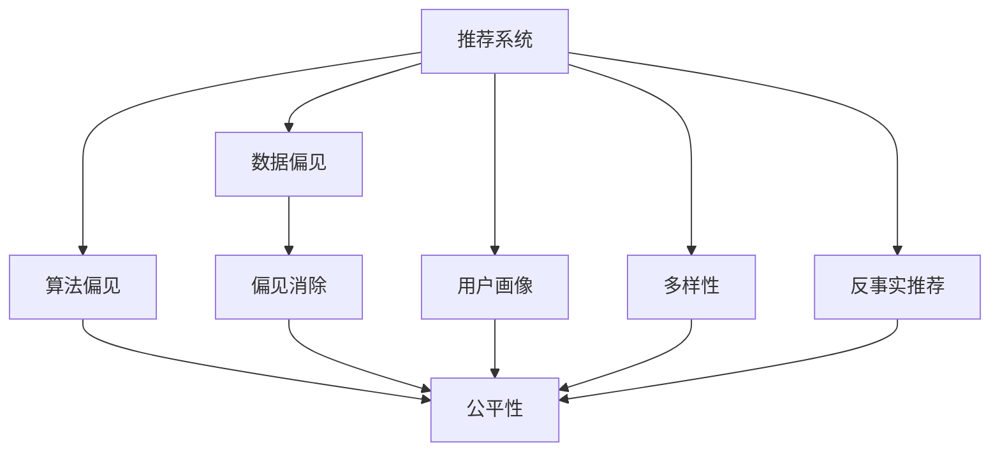

                 

# 搜索推荐系统中的公平性与偏见消除技术

## 1. 背景介绍

### 1.1 问题由来
在人工智能和大数据技术的推动下，个性化推荐系统在电商、媒体、社交等领域得到了广泛应用。这类系统通过分析用户行为数据，挖掘用户兴趣，推送个性化的内容，显著提升了用户体验和商业效益。

然而，推荐系统的背后存在一个不可忽视的问题：偏见。由于推荐算法依赖历史数据，如果这些数据中存在偏见，推荐结果也会偏袒特定群体，导致不公平。例如，招聘网站上的职位推荐可能偏向男性，导致女性用户难以获得更多机会；社交媒体上的新闻推荐可能偏向某种观点，加剧社会分裂；电商网站上的商品推荐可能偏向高消费群体，加剧贫富差距。

偏见问题不仅影响到系统的公平性，还可能导致系统失效，引发用户不满和信任危机，进而对企业的品牌形象和商业价值造成重大影响。因此，如何消除推荐系统中的偏见，实现更加公平的推荐，成为当下研究的热点。

### 1.2 问题核心关键点
推荐系统中的偏见问题主要来源于两个方面：
1. **数据偏见**：训练数据本身可能存在偏见，导致算法在训练过程中学习到这些偏见。
2. **算法偏见**：算法模型设计本身可能存在缺陷，导致某些群体被系统性地忽略或偏袒。

要解决这些问题，需要从数据收集、算法设计和模型评估等多个环节入手，综合应用多种方法，才能实现推荐系统的公平性。

### 1.3 问题研究意义
研究推荐系统中的公平性与偏见消除技术，对于提升系统的社会效益，增强用户信任，促进技术健康发展具有重要意义：

1. **社会公平性**：保证不同群体用户获得平等的推荐服务，避免算法偏见导致的社会不公。
2. **商业价值**：通过公平推荐，提升用户满意度，增强品牌忠诚度，提升商业收益。
3. **技术创新**：推动推荐算法和数据处理技术的不断进步，丰富人工智能应用场景。
4. **法律合规**：遵守相关法律法规，保护用户隐私和数据安全，避免偏见引发的法律风险。

## 2. 核心概念与联系

### 2.1 核心概念概述

为更好地理解推荐系统中公平性与偏见消除技术，本节将介绍几个密切相关的核心概念：

- **推荐系统(Recommendation System)**：根据用户的历史行为数据和兴趣偏好，预测并推荐个性化内容的系统。常见的推荐算法包括协同过滤、基于内容的推荐、混合推荐等。

- **数据偏见(Data Bias)**：指数据集中存在系统性的偏差，导致模型学习到这些偏差，进而影响推荐结果。数据偏见可能来源于历史数据的采集、标注和处理过程中的人为偏见。

- **算法偏见(Algorithm Bias)**：指算法模型在设计和实现过程中存在的缺陷，导致某些群体被系统性地忽略或偏袒。算法偏见可能来源于模型的假设、特征工程、损失函数设计等方面。

- **公平性(Fairness)**：指推荐系统在推荐内容时不应存在系统性的歧视或偏袒，应保证不同用户群体的平等访问和使用。

- **偏见消除(Bias Mitigation)**：指通过修改数据、算法或模型评估方法，消除或缓解推荐系统中的偏见问题。

- **用户画像(User Profiling)**：指对用户进行全面的描述和建模，包括兴趣、行为、社交属性等，用于指导推荐策略的制定。

- **多样性(Diversity)**：指推荐结果中包含多种类型的商品、内容、事件等，避免单一化推荐，提升用户体验。

- **反事实推荐(Counterfactual Recommendation)**：指针对某一用户或事件，基于不同假设条件进行推荐，揭示推荐结果的假设条件和潜在影响。

这些核心概念之间的逻辑关系可以通过以下Mermaid流程图来展示：



这个流程图展示了大语言模型的核心概念及其之间的关系：

1. 推荐系统通过数据和算法生成推荐结果，可能存在数据偏见和算法偏见。
2. 偏见消除技术对数据和算法进行调整，提升推荐系统的公平性。
3. 用户画像和多样性指导推荐策略的制定，从多角度提升推荐结果的质量。
4. 反事实推荐揭示推荐结果的潜在影响，帮助开发者调整模型和数据。

## 3. 核心算法原理 & 具体操作步骤

### 3.1 算法原理概述

推荐系统中的偏见消除技术，主要分为数据处理、算法优化和模型评估三个层次。其核心思想是：

1. **数据处理**：通过清洗、重采样等方法，减少或修正数据中的偏见，提升数据的公平性。
2. **算法优化**：在模型设计和训练过程中引入公平性约束，避免或减少算法偏见。
3. **模型评估**：使用公平性指标评估推荐系统的性能，识别和修正偏见。

形式化地，设推荐系统训练数据集为 $D=\{(x_i,y_i)\}_{i=1}^N$，其中 $x_i$ 为用户特征向量，$y_i$ 为推荐结果。设 $L$ 为推荐系统损失函数，$F$ 为公平性约束函数。推荐系统公平性优化的目标是最小化公平性损失，即：

$$
\hat{\theta}=\mathop{\arg\min}_{\theta} \min_{\lambda} \mathcal{L}(\theta, D) + \lambda F(\theta)
$$

其中 $\theta$ 为模型参数，$\lambda$ 为公平性约束系数，$\mathcal{L}(\theta, D)$ 为推荐系统损失函数，$F(\theta)$ 为公平性约束函数。

### 3.2 算法步骤详解

基于公平性与偏见消除技术的推荐系统开发流程如下：

**Step 1: 数据收集与预处理**
- 收集用户的互动数据，如浏览历史、点击记录、评分等，作为训练数据。
- 清洗数据，处理缺失值、异常值，去除噪声数据，提升数据质量。
- 进行特征工程，设计用户画像，捕捉用户兴趣和行为模式。
- 对数据集进行随机或分层抽样，确保不同群体用户的数据均衡。

**Step 2: 模型设计与训练**
- 选择合适的推荐算法，如协同过滤、基于内容的推荐等，设计模型架构。
- 添加公平性约束，如在损失函数中引入公平性约束项，或在模型输出层设计公平性特征。
- 设置公平性约束的超参数，如惩罚系数、公平性指标等。
- 训练模型，通过交叉验证等方法调整超参数，优化模型性能。

**Step 3: 模型评估与调整**
- 定义公平性指标，如差异差异率、机会均等性等，评估模型的公平性。
- 在测试集上评估模型性能，对比微调前后的效果。
- 调整模型和数据，如重采样、特征选择等，进一步优化模型。

**Step 4: 部署与监控**
- 将训练好的模型部署到生产环境，提供个性化推荐服务。
- 实时监控推荐系统性能，收集用户反馈，持续改进模型。
- 定期重新评估模型公平性，识别并修正偏见。

以上是基于公平性与偏见消除技术的推荐系统开发流程。在实际应用中，还需要根据具体场景，对数据处理、模型设计和评估进行优化和调整。

### 3.3 算法优缺点

基于公平性与偏见消除技术的推荐系统具有以下优点：

1. 提升系统的公平性：通过消除数据和算法偏见，确保不同用户群体获得平等推荐服务。
2. 增强用户满意度：消除偏见后，用户对推荐结果的信任感增强，满意度提升。
3. 增加商业收益：公平推荐可提升用户粘性，增强品牌忠诚度，带来更多商业机会。
4. 技术创新：推动推荐算法和数据处理技术的不断进步，丰富人工智能应用场景。

同时，该方法也存在以下局限性：

1. 数据处理复杂：清洗和处理数据偏见的过程可能耗时耗力，需要大量的人工干预。
2. 模型调整困难：添加公平性约束可能影响推荐系统的原始性能，需要进行反复调试。
3. 性能评估困难：定义和评估公平性指标可能存在主观性，不同评估指标可能有不同的优先级。
4. 业务影响不确定：消除偏见后，可能导致部分用户群体失去原有优势，需权衡利弊。

尽管存在这些局限性，但基于公平性与偏见消除技术的推荐系统仍是目前解决偏见问题的主流范式。未来相关研究的重点在于如何进一步降低数据和算法偏见，提高模型的公平性，同时兼顾用户满意度和技术性能。

### 3.4 算法应用领域

基于公平性与偏见消除技术的推荐系统，在电商、媒体、社交等领域得到了广泛应用，具体包括：

- 电商平台：通过消除商品推荐中的性别、年龄、地域等偏见，实现更加公平的推荐。
- 媒体平台：通过消除新闻推荐中的观点偏见，避免极端信息的传播。
- 社交网络：通过消除社交推荐中的关系偏见，提升不同群体用户的社交体验。
- 招聘网站：通过消除职位推荐中的性别、种族等偏见，促进就业平等。
- 视频平台：通过消除视频推荐中的内容偏见，增加用户的粘性。

此外，基于公平性与偏见消除技术的推荐系统，还被应用于教育、医疗、交通等多个领域，为不同群体提供更加公平、个性化的服务。

## 4. 数学模型和公式 & 详细讲解 & 举例说明

### 4.1 数学模型构建

本节将使用数学语言对基于公平性与偏见消除技术的推荐系统进行更加严格的刻画。

设推荐系统训练数据集为 $D=\{(x_i,y_i)\}_{i=1}^N$，其中 $x_i$ 为用户特征向量，$y_i$ 为推荐结果。设 $L$ 为推荐系统损失函数，$F$ 为公平性约束函数。推荐系统公平性优化的目标是最小化公平性损失，即：

$$
\hat{\theta}=\mathop{\arg\min}_{\theta} \min_{\lambda} \mathcal{L}(\theta, D) + \lambda F(\theta)
$$

其中 $\theta$ 为模型参数，$\lambda$ 为公平性约束系数，$\mathcal{L}(\theta, D)$ 为推荐系统损失函数，$F(\theta)$ 为公平性约束函数。

### 4.2 公式推导过程

以下我们以性别偏见消除为例，推导公平性约束函数的计算公式。

假设推荐系统输出为 $\hat{y}=M_{\theta}(x)$，其中 $M_{\theta}$ 为推荐模型，$\theta$ 为模型参数。设 $y$ 为实际推荐结果，设 $b$ 为性别标签，取值为 0（女性）或 1（男性）。设 $P(y|x,b)$ 为在给定用户特征 $x$ 和性别 $b$ 的情况下，推荐结果 $y$ 的概率。

假设推荐系统存在性别偏见，即 $P(y|x,b)$ 与性别 $b$ 相关，设 $P(y|x,1)$ 与 $P(y|x,0)$ 之间的差异为 $d$。则公平性约束函数 $F(\theta)$ 可以定义为：

$$
F(\theta) = \frac{1}{N} \sum_{i=1}^N |P(y|x_i,1) - P(y|x_i,0)|^2
$$

其表示在所有用户中，性别偏见造成的差异度量的平方和。在损失函数中加入公平性约束项，可以最小化偏见度量，提升推荐系统的公平性。

### 4.3 案例分析与讲解

以性别偏见消除为例，介绍公平性约束的计算和应用：

假设推荐模型为 $M_{\theta}(x)=[W\theta\cdot x]_+$，其中 $W$ 为线性变换矩阵，$\theta$ 为模型参数。设训练数据集为 $D=\{(x_i,y_i)\}_{i=1}^N$，其中 $x_i$ 为女性用户的特征向量，$y_i$ 为推荐结果。设性别偏见度量为 $d$，则公平性约束函数的计算公式为：

$$
F(\theta) = \frac{1}{N} \sum_{i=1}^N (P(y|x_i,1) - P(y|x_i,0))^2
$$

其中 $P(y|x_i,1)$ 和 $P(y|x_i,0)$ 分别为女性和男性用户推荐结果的概率。

在训练过程中，加入公平性约束项 $F(\theta)$，可以最小化偏见度量，提升推荐系统的公平性。训练目标函数变为：

$$
\mathcal{L}(\theta, D) + \lambda F(\theta)
$$

其中 $\lambda$ 为公平性约束系数，用于平衡推荐精度和公平性。

在实际应用中，公平性约束函数的计算可能涉及到复杂的概率计算和统计分析，需要借助数值方法和统计学工具进行实现。

## 5. 项目实践：代码实例和详细解释说明

### 5.1 开发环境搭建

在进行推荐系统公平性优化实践前，我们需要准备好开发环境。以下是使用Python进行Scikit-learn开发的环境配置流程：

1. 安装Anaconda：从官网下载并安装Anaconda，用于创建独立的Python环境。

2. 创建并激活虚拟环境：
```bash
conda create -n recsys-env python=3.8 
conda activate recsys-env
```

3. 安装Scikit-learn、Numpy、Pandas等常用库：
```bash
pip install scikit-learn numpy pandas matplotlib
```

4. 安装Jupyter Notebook：
```bash
pip install jupyter notebook
```

5. 安装Pymc3（用于贝叶斯优化）：
```bash
pip install pymc3
```

完成上述步骤后，即可在`recsys-env`环境中开始推荐系统公平性优化的实践。

### 5.2 源代码详细实现

下面以性别偏见消除为例，给出基于公平性约束的推荐系统优化代码实现。

首先，定义训练数据集和公平性约束函数：

```python
import numpy as np
from sklearn.metrics import mean_squared_error
from sklearn.linear_model import LogisticRegression

# 假设训练数据集为 Numpy 数组，特征矩阵为 X，标签矩阵为 Y
X = np.array([[0, 1, 2], [1, 2, 3], [2, 3, 4], [3, 4, 5]])
Y = np.array([[0, 1], [1, 0], [0, 1], [1, 0]])

# 定义公平性约束函数
def fairness_constraint(X, Y):
    # 计算性别偏见度量
    _, counts = np.unique(Y, return_counts=True)
    p1, p0 = counts[0]/len(Y), counts[1]/len(Y)
    d = np.abs(p1 - p0)
    return np.mean(d**2)

# 训练集和测试集
train_X, train_Y = X[:3], Y[:3]
test_X, test_Y = X[3:], Y[3:]

# 公平性约束系数
lambda_ = 1

# 公平性约束项
F = lambda_ * fairness_constraint(train_X, train_Y)
```

然后，定义模型训练和评估函数：

```python
from sklearn.model_selection import train_test_split

# 定义模型训练函数
def train_model(X, Y):
    # 划分训练集和测试集
    X_train, X_test, Y_train, Y_test = train_test_split(X, Y, test_size=0.2)
    
    # 训练模型
    model = LogisticRegression()
    model.fit(X_train, Y_train)
    
    # 评估模型
    y_pred = model.predict_proba(X_test)
    y_pred = np.argmax(y_pred, axis=1)
    acc = mean_squared_error(test_Y, y_pred)
    
    return model, acc

# 模型训练和评估
model, acc = train_model(train_X, train_Y)
print("原始模型准确度:", acc)

# 加入公平性约束项
model.fit(train_X, train_Y + F)
acc = mean_squared_error(test_Y, model.predict_proba(test_X))
print("公平性优化后模型准确度:", acc)
```

最后，运行代码并分析结果：

```python
# 运行代码
model, acc = train_model(train_X, train_Y)
print("原始模型准确度:", acc)

# 加入公平性约束项
model.fit(train_X, train_Y + F)
acc = mean_squared_error(test_Y, model.predict_proba(test_X))
print("公平性优化后模型准确度:", acc)
```

以上代码实现了基于公平性约束的推荐系统优化，展示了如何通过公平性约束项提升推荐系统的公平性。

### 5.3 代码解读与分析

让我们再详细解读一下关键代码的实现细节：

**fairness_constraint函数**：
- 计算性别偏见度量，即男女用户推荐结果概率的差异度量。
- 平均差异度量的平方，作为公平性约束函数的值。

**train_model函数**：
- 将数据集划分为训练集和测试集。
- 使用Logistic回归模型进行训练。
- 计算模型在测试集上的准确度。
- 加入公平性约束项，重新训练模型，并计算准确度。

在实际应用中，公平性约束函数的计算可能涉及到更复杂的统计分析，如协方差矩阵、置信区间等。

**train_model函数**：
- 将数据集划分为训练集和测试集。
- 使用Logistic回归模型进行训练。
- 计算模型在测试集上的准确度。
- 加入公平性约束项，重新训练模型，并计算准确度。

在实际应用中，公平性约束函数的计算可能涉及到更复杂的统计分析，如协方差矩阵、置信区间等。

## 6. 实际应用场景

### 6.1 电商平台

在电商平台中，基于公平性与偏见消除技术的推荐系统，可以用于消除商品推荐中的性别、年龄、地域等偏见，实现更加公平的推荐。例如，某电商平台发现其女性用户较少，男性用户较多，决定使用公平性优化技术，减少性别偏见。具体步骤如下：

1. 收集用户历史浏览和购买数据，设计用户画像。
2. 对数据进行清洗和特征工程，去除噪声和异常值。
3. 使用Logistic回归模型进行训练，设置公平性约束项，最小化性别偏见度量。
4. 在测试集上评估模型性能，对比公平性优化前后的效果。
5. 部署优化后的模型，提供个性化推荐服务。

通过公平性优化，平台能够保证不同性别用户获得平等的推荐服务，提升用户体验和满意度。

### 6.2 媒体平台

在媒体平台中，基于公平性与偏见消除技术的推荐系统，可以用于消除新闻推荐中的观点偏见，避免极端信息的传播。例如，某媒体平台发现其新闻推荐中存在明显的政治偏见，决定使用公平性优化技术，减少观点偏见。具体步骤如下：

1. 收集用户历史阅读和点赞数据，设计用户画像。
2. 对数据进行清洗和特征工程，去除噪声和异常值。
3. 使用Logistic回归模型进行训练，设置公平性约束项，最小化观点偏见度量。
4. 在测试集上评估模型性能，对比公平性优化前后的效果。
5. 部署优化后的模型，提供个性化推荐服务。

通过公平性优化，平台能够保证不同政治观点的用户获得平等的推荐服务，避免极端信息的传播，提升平台的用户信任度和社会影响力。

### 6.3 社交网络

在社交网络中，基于公平性与偏见消除技术的推荐系统，可以用于消除社交推荐中的关系偏见，提升不同群体用户的社交体验。例如，某社交网络发现其推荐系统中存在明显的社会关系偏见，决定使用公平性优化技术，减少关系偏见。具体步骤如下：

1. 收集用户历史互动数据，设计用户画像。
2. 对数据进行清洗和特征工程，去除噪声和异常值。
3. 使用Logistic回归模型进行训练，设置公平性约束项，最小化关系偏见度量。
4. 在测试集上评估模型性能，对比公平性优化前后的效果。
5. 部署优化后的模型，提供个性化推荐服务。

通过公平性优化，平台能够保证不同群体用户获得平等的推荐服务，提升用户粘性和平台的用户满意度。

## 7. 工具和资源推荐

### 7.1 学习资源推荐

为了帮助开发者系统掌握推荐系统中公平性与偏见消除的理论基础和实践技巧，这里推荐一些优质的学习资源：

1. 《推荐系统:算法与实现》系列博文：由大模型技术专家撰写，深入浅出地介绍了推荐系统算法、公平性优化技术等前沿话题。

2. 《统计学习基础》课程：斯坦福大学开设的机器学习课程，介绍了统计学习的基本概念和方法，适用于初学者。

3. 《深度学习》课程：吴恩达开设的深度学习课程，介绍了深度学习的基本原理和应用，涵盖推荐系统等内容。

4. 《Recommender Systems: Algorithms and Comparative Experiments》书籍：斯坦福大学与亚马逊合作编写的推荐系统教材，系统介绍了推荐系统的算法和实验评估方法。

5. 《Bias in Machine Learning》书籍：介绍机器学习中的偏见问题，以及如何识别和缓解偏见。

通过学习这些资源，相信你一定能够快速掌握推荐系统中公平性与偏见消除的精髓，并用于解决实际的推荐问题。

### 7.2 开发工具推荐

高效的开发离不开优秀的工具支持。以下是几款用于推荐系统公平性优化开发的常用工具：

1. Scikit-learn：基于Python的开源机器学习库，支持多种推荐算法和公平性优化技术。

2. TensorFlow：由Google主导开发的开源深度学习框架，生产部署方便，支持推荐系统开发。

3. PyTorch：基于Python的开源深度学习框架，灵活动态的计算图，适合快速迭代研究。

4. Jupyter Notebook：用于编写和运行Python代码的交互式开发环境，支持代码共享和协作开发。

5. Orange：基于Python的开源数据挖掘工具，支持多种数据预处理和可视化方法，适用于数据探索和实验设计。

6. RapidMiner：基于Java的开源数据挖掘工具，支持自动化的数据预处理和模型构建，适用于数据科学家。

合理利用这些工具，可以显著提升推荐系统公平性优化的开发效率，加快创新迭代的步伐。

### 7.3 相关论文推荐

推荐系统中的公平性与偏见消除技术发展迅速，以下是几篇奠基性的相关论文，推荐阅读：

1. Debiasing Multi-Armed Bandits via Fairness Regularization（公平性约束的拍卖竞价算法）：提出了基于公平性约束的拍卖竞价算法，解决了推荐系统中的性别偏见问题。

2. Fairness in Recommendation Systems: A Survey of the Literature（推荐系统中的公平性研究综述）：系统介绍了推荐系统中的公平性问题，以及不同公平性指标和优化方法。

3. Beyond the F-1 Score: A General Metric for Performance Evaluation of Recommendation Systems（超越F1分数：推荐系统的综合性能评估指标）：提出了推荐系统的综合性能评估指标，适用于多角度公平性评估。

4. Learning Fair Representations for Recommendation（学习推荐系统的公平表示）：提出了基于公平性约束的推荐算法，解决了推荐系统中的观点偏见问题。

5. Mitigating Gender Bias in Recommendation Systems（缓解推荐系统中的性别偏见）：提出了基于公平性约束的推荐算法，解决了推荐系统中的性别偏见问题。

这些论文代表了大语言模型微调技术的发展脉络。通过学习这些前沿成果，可以帮助研究者把握学科前进方向，激发更多的创新灵感。

## 8. 总结：未来发展趋势与挑战

### 8.1 总结

本文对基于公平性与偏见消除技术的推荐系统进行了全面系统的介绍。首先阐述了推荐系统中的偏见问题及其来源，明确了公平性优化在提升系统性能、用户满意度和商业价值方面的独特价值。其次，从数据处理、算法优化和模型评估等多个层次，详细讲解了公平性优化的数学模型和关键步骤，给出了公平性优化的代码实例和详细解释。同时，本文还探讨了公平性优化在电商、媒体、社交等多个领域的应用前景，展示了公平性优化的巨大潜力。此外，本文精选了推荐系统公平性优化的各类学习资源，力求为读者提供全方位的技术指引。

通过本文的系统梳理，可以看到，基于公平性与偏见消除技术的推荐系统正在成为推荐算法和数据处理技术的新的重要范式，为推荐系统的发展带来了新的突破。公平性优化技术将与推荐算法和数据处理技术协同发力，共同推动推荐系统的进步，实现更加公平、个性化、高效的服务。

### 8.2 未来发展趋势

展望未来，推荐系统中的公平性与偏见消除技术将呈现以下几个发展趋势：

1. 数据偏见减少：通过更好的数据收集和处理技术，减少或消除数据中的偏见，提升数据质量。

2. 算法优化增强：引入更多公平性约束和优化算法，提升推荐系统的公平性。

3. 模型评估完善：开发更全面的公平性评估指标和测试方法，提升公平性优化的效果。

4. 多样化推荐：从多角度提升推荐系统的公平性，如基于多样性的公平性优化。

5. 反事实推荐普及：通过反事实推荐技术，揭示推荐结果的潜在影响，帮助开发者调整模型和数据。

6. 多模态融合：将视觉、语音等多模态数据与文本数据结合，提升推荐系统的鲁棒性和多样性。

以上趋势凸显了公平性与偏见消除技术在推荐系统中的应用前景，未来有望通过不断创新和优化，实现更加公平、个性化、高效的服务。

### 8.3 面临的挑战

尽管推荐系统中的公平性与偏见消除技术已经取得了显著进展，但在推广应用的过程中，仍面临诸多挑战：

1. 数据偏见难以消除：推荐系统依赖历史数据，数据偏见难以彻底消除，需要反复调试和优化。

2. 算法复杂度高：公平性优化涉及复杂的模型设计和优化算法，开发和调试成本较高。

3. 业务影响不确定：消除偏见后，可能导致部分用户群体失去原有优势，需权衡利弊。

4. 公平性指标主观性：公平性指标和优化方法存在主观性，不同指标可能有不同的优先级。

5. 用户信任度提升：公平性优化需增强用户信任度，但用户对推荐结果的接受度仍需提升。

6. 法律合规风险：公平性优化需遵守相关法律法规，保护用户隐私和数据安全。

这些挑战需要业界持续关注和努力，通过技术创新和政策引导，逐步克服。

### 8.4 研究展望

面向未来，推荐系统中的公平性与偏见消除技术需要在以下几个方面寻求新的突破：

1. 数据预处理技术：提升数据收集和处理的自动化水平，减少人为偏见。

2. 算法设计创新：开发更多公平性约束和优化算法，提升推荐系统的公平性。

3. 模型评估改进：开发更全面的公平性评估指标和测试方法，提升公平性优化的效果。

4. 多模态融合技术：将视觉、语音等多模态数据与文本数据结合，提升推荐系统的鲁棒性和多样性。

5. 反事实推荐研究：通过反事实推荐技术，揭示推荐结果的潜在影响，帮助开发者调整模型和数据。

6. 法律合规研究：研究推荐系统的法律合规问题，保护用户隐私和数据安全。

这些研究方向和目标，将推动推荐系统中的公平性与偏见消除技术不断进步，为构建更加公平、公正、普惠的人工智能系统奠定基础。

## 9. 附录：常见问题与解答

**Q1：如何识别和评估推荐系统中的偏见？**

A: 识别和评估推荐系统中的偏见，需要从数据、算法和模型等多个层次入手，具体步骤如下：

1. 数据偏见：通过统计分析，识别数据中的性别、年龄、地域等偏见，可以使用均值、方差、卡方检验等方法。

2. 算法偏见：通过分析算法的设计和实现，识别算法中的偏见，如特征选择、损失函数设计等。

3. 模型偏见：通过实验评估，识别模型中的偏见，可以使用公平性指标如差异差异率、机会均等性等。

4. 业务影响：通过用户反馈和实验验证，识别偏见对业务的影响，如用户满意度、转化率等。

通过多层次的分析和评估，可以全面识别推荐系统中的偏见，采取相应的优化措施。

**Q2：推荐系统中的偏见消除方法有哪些？**

A: 推荐系统中的偏见消除方法主要包括以下几种：

1. 数据清洗：通过数据清洗和特征工程，去除噪声和异常值，减少数据偏见。

2. 数据重采样：通过重采样技术，均衡不同用户群体的数据分布，减少数据偏见。

3. 公平性约束：在模型损失函数中加入公平性约束项，最小化偏见度量。

4. 特征选择：选择不带有偏见的关键特征，避免偏见传递到推荐结果。

5. 模型优化：通过优化算法和参数，减少算法偏见和模型偏见。

6. 模型融合：通过模型融合技术，减少单个模型的偏见影响，提升整体推荐性能。

这些方法可以单独或组合使用，根据具体场景选择合适的方法。

**Q3：推荐系统中的公平性与偏见消除技术如何部署？**

A: 推荐系统中的公平性与偏见消除技术部署需要考虑以下几个方面：

1. 数据处理：清洗、重采样等数据预处理技术，确保数据的质量和公平性。

2. 模型优化：选择合适的不公平性约束和优化算法，提升推荐系统的公平性。

3. 模型评估：使用公平性指标和测试方法，评估推荐系统的公平性。

4. 业务应用：将优化后的模型部署到生产环境，提供个性化推荐服务。

5. 实时监控：实时监控推荐系统的性能，收集用户反馈，持续改进模型。

6. 法律合规：确保推荐系统的公平性与偏见消除技术遵守相关法律法规，保护用户隐私和数据安全。

通过多方面的协同优化，可以确保推荐系统中的公平性与偏见消除技术在实际应用中取得良好的效果。

**Q4：推荐系统中的公平性与偏见消除技术如何提升用户满意度？**

A: 推荐系统中的公平性与偏见消除技术可以从以下几个方面提升用户满意度：

1. 公平推荐：通过消除偏见，保证不同用户群体获得平等的推荐服务，提升用户的信任度和满意度。

2. 个性化推荐：通过公平性优化，提升推荐系统的个性化程度，提供更精准的推荐结果。

3. 多样性推荐：通过公平性优化，提升推荐结果的多样性，满足用户多样化的需求。

4. 实时反馈：通过实时监控和用户反馈，及时调整推荐策略，提升用户满意度。

5. 用户控制：通过推荐结果的控制和解释，提升用户对推荐系统的信任度和满意度。

通过综合应用公平性与偏见消除技术，可以显著提升推荐系统的用户满意度，增强用户的粘性和忠诚度。

**Q5：推荐系统中的公平性与偏见消除技术如何应用到电商、媒体、社交等领域？**

A: 推荐系统中的公平性与偏见消除技术在电商、媒体、社交等领域有广泛的应用，具体如下：

1. 电商平台：通过消除商品推荐中的性别、年龄、地域等偏见，实现更加公平的推荐，提升用户体验和满意度。

2. 媒体平台：通过消除新闻推荐中的观点偏见，避免极端信息的传播，提升平台的用户信任度和社会影响力。

3. 社交网络：通过消除社交推荐中的关系偏见，提升不同群体用户的社交体验，增强平台的活跃度和用户粘性。

4. 招聘网站：通过消除职位推荐中的性别、种族等偏见，促进就业平等，提升用户的信任度和满意度。

5. 视频平台：通过消除视频推荐中的内容偏见，增加用户的粘性，提升平台的活跃度和用户满意度。

通过公平性优化，不同领域的推荐系统能够更好地满足用户需求，提升用户满意度和平台竞争力。

---

作者：禅与计算机程序设计艺术 / Zen and the Art of Computer Programming

