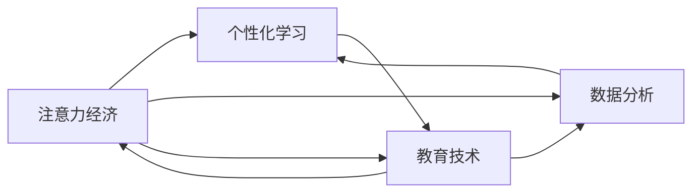

                 

# 教育领域如何应对注意力经济

> 关键词：教育技术,注意力经济,数字化转型,人工智能,个性化学习,数据分析

## 1. 背景介绍

### 1.1 问题由来

随着互联网和信息技术的迅猛发展，我们进入了数字化的时代，特别是大数据和人工智能的兴起，正在改变着各行各业的运作方式。教育领域也不例外，传统的教育模式正在逐渐被数字化、智能化的教育模式所替代。然而，数字化转型同样面临着巨大的挑战，尤其是如何在信息过载、注意力分散的数字化时代，保持教育的有效性，是教育领域必须面对的重大问题。

### 1.2 问题核心关键点

本节将分析注意力经济时代下，教育领域面临的主要问题和挑战，包括注意力分散、信息过载、个性化学习需求、技术依赖性等。

1. **注意力分散**：在数字化时代，学生面临着来自互联网和社交媒体的强烈诱惑，注意力分散是影响学习效果的主要因素之一。
2. **信息过载**：数字化技术带来了海量的教育资源，但这些资源的质量参差不齐，甚至存在大量冗余和误导性内容。
3. **个性化学习需求**：不同学生有不同的学习风格和需求，传统的“一刀切”教育模式无法满足个性化学习的需求。
4. **技术依赖性**：教育数字化转型过程中，对技术的依赖性越来越强，但如何保证技术的有效性和可操作性是一个关键问题。

这些挑战的共同点是都涉及到如何更好地分配和利用注意力资源，如何更好地管理和优化教育信息，以及如何实现个性化和高效的学习。

## 2. 核心概念与联系

### 2.1 核心概念概述

在分析教育领域应对注意力经济问题时，需要引入几个核心概念：

1. **注意力经济**：注意力经济是指在信息社会中，注意力作为一种稀缺资源，其分配和使用对经济活动具有重要影响。在教育领域，注意力经济强调如何吸引和保持学生的注意力，以提高教育效果。
2. **个性化学习**：个性化学习是指根据学生的个人兴趣、能力和需求，量身定制教学内容和策略，以提高学习效果。
3. **教育技术**：教育技术是指应用信息技术和其他技术手段，以提高教育质量和效率。教育技术的发展为个性化学习和教育管理提供了强有力的支持。
4. **数据分析**：数据分析是指通过收集、处理和分析教育数据，以发现教育规律、优化教育决策和提升教育质量。数据分析在个性化学习、教育评估和教育管理中发挥着重要作用。

这些概念之间存在着密切的联系，共同构成了数字化时代下教育领域的复杂系统。

### 2.2 核心概念原理和架构的 Mermaid 流程图



这个流程图展示了注意力经济、个性化学习、教育技术和数据分析之间的关系。其中，注意力经济是核心，个性化学习通过教育技术得到实现，而数据分析则提供了实现个性化学习的数据支持和评估工具。

## 3. 核心算法原理 & 具体操作步骤

### 3.1 算法原理概述

在教育领域应对注意力经济问题的过程中，算法和技术的介入是不可或缺的。本节将介绍几个核心算法原理及其操作步骤。

### 3.2 算法步骤详解

#### 3.2.1 注意力分配算法

注意力分配算法旨在通过算法模型，动态调整教育内容的呈现顺序，以吸引和保持学生的注意力。例如，可以通过基于时间的奖励机制，对学生进行奖励，以提高他们对学习内容的关注度。

#### 3.2.2 信息过滤和推荐算法

信息过滤和推荐算法可以筛选出高质量的教育资源，并向学生推荐符合其兴趣和需求的内容。例如，通过协同过滤、内容过滤等技术，可以推荐个性化的学习材料。

#### 3.2.3 数据分析和建模

数据分析和建模是通过对教育数据的收集和分析，发现教育规律和趋势，以优化教学策略和提高教育质量。例如，通过聚类分析，可以将学生划分为不同的学习群体，从而进行更有针对性的教学。

#### 3.2.4 机器学习与深度学习

机器学习与深度学习可以用于个性化学习，例如通过预测学生学习行为，调整教学内容和策略，以适应不同学生的学习需求。例如，通过深度学习模型，可以预测学生的学习兴趣和难点，从而进行针对性辅导。

### 3.3 算法优缺点

#### 3.3.1 优点

1. **个性化学习**：通过算法，可以提供个性化的学习路径和资源，满足不同学生的学习需求。
2. **高效管理**：算法可以自动化地处理大量的教育数据，优化教育资源的分配和使用。
3. **智能决策**：基于数据分析和机器学习，可以做出更科学的教育决策，提高教育效果。

#### 3.3.2 缺点

1. **技术复杂性**：算法和技术的使用需要较高的技术门槛，需要专业的技术人员进行开发和维护。
2. **数据隐私**：算法的运行需要大量的教育数据，数据隐私和安全问题需要得到充分考虑。
3. **成本高昂**：算法的开发和应用需要投入大量资源，包括人力、物力和财力。

### 3.4 算法应用领域

算法和技术的运用不仅限于课堂教学，还可以扩展到教育管理的各个方面，例如：

1. **学生评估**：通过数据分析，评估学生的学习情况，提供个性化的学习建议。
2. **课程设计**：通过算法，优化课程设计和教学策略，提高教学效果。
3. **教育资源管理**：通过信息过滤和推荐算法，优化教育资源的配置和使用。
4. **教师培训**：通过数据分析，发现教师教学中的问题和改进点，提供教师培训和发展建议。

## 4. 数学模型和公式 & 详细讲解 & 举例说明

### 4.1 数学模型构建

本节将通过数学模型来描述算法和技术的核心机制。

#### 4.1.1 注意力分配模型

注意力分配模型可以通过以下公式进行描述：

$$
\text{Attention} = \frac{\text{Relevance}(\text{Content})}{\sum_{i} \text{Relevance}(\text{Content}_i)}
$$

其中，$\text{Attention}$ 表示学生对内容的注意力分配，$\text{Relevance}(\text{Content})$ 表示内容与学生学习需求的匹配度。

#### 4.1.2 信息过滤和推荐模型

信息过滤和推荐模型可以通过以下公式进行描述：

$$
\text{Recommendation} = \text{Function}(\text{User Profile}, \text{Content Metadata})
$$

其中，$\text{Recommendation}$ 表示推荐结果，$\text{User Profile}$ 表示用户的基本信息和偏好，$\text{Content Metadata}$ 表示内容的元数据，如作者、发布日期等。

### 4.2 公式推导过程

#### 4.2.1 注意力分配公式推导

注意力分配模型的推导可以通过最大化注意力分数来实现。假设学生对内容的关注度可以通过加权平均的方式计算：

$$
\text{Attention} = \frac{\text{Relevance}(\text{Content})}{\sum_{i} \text{Relevance}(\text{Content}_i)}
$$

该公式表示，学生的注意力分配与内容的相关性成正比，与所有内容的平均相关性成反比。

#### 4.2.2 推荐模型公式推导

推荐模型的推导可以通过协同过滤算法来实现。假设用户和内容之间的相似度可以通过余弦相似度计算：

$$
\text{Similarity}(\text{User}, \text{Content}) = \frac{\text{Dot Product}(\text{User Profile}, \text{Content Metadata})}{\|\text{User Profile}\| \cdot \|\text{Content Metadata}\|}
$$

该公式表示，相似度越大，推荐的内容越符合用户的兴趣和需求。

### 4.3 案例分析与讲解

#### 4.3.1 案例1：智能推荐系统

某在线教育平台使用信息过滤和推荐算法，向学生推荐个性化的学习材料。该平台首先收集学生的学习行为数据，如观看时长、浏览频率等，然后通过协同过滤算法，向学生推荐与他们兴趣相符的内容。例如，通过分析学生的观看历史，发现其对数学题的解析视频特别感兴趣，于是平台推荐更多的类似视频，从而提高学生的学习效果。

#### 4.3.2 案例2：注意力分配应用

某学校使用注意力分配算法，调整课堂教学内容的呈现顺序，以提高学生的注意力集中度。该学校通过分析学生的注意力数据，发现学生在观看视频时，注意力在前30分钟最为集中。因此，教师将重要的讲解内容放在视频的前30分钟，同时加入互动环节，如提问、讨论等，以保持学生的注意力，从而提高教学效果。

## 5. 项目实践：代码实例和详细解释说明

### 5.1 开发环境搭建

在进行项目实践前，需要搭建好开发环境。以下是使用Python进行项目开发的常用环境配置流程：

1. 安装Anaconda：从官网下载并安装Anaconda，用于创建独立的Python环境。

2. 创建并激活虚拟环境：
```bash
conda create -n env_name python=3.8 
conda activate env_name
```

3. 安装必要的依赖包：
```bash
pip install numpy pandas scikit-learn torch torchvision transformers
```

完成上述步骤后，即可在虚拟环境中进行项目开发。

### 5.2 源代码详细实现

#### 5.2.1 案例1：智能推荐系统

```python
import pandas as pd
import numpy as np
from sklearn.metrics.pairwise import cosine_similarity
from transformers import T5Tokenizer, T5ForConditionalGeneration

# 加载用户数据和内容数据
user_data = pd.read_csv('user_data.csv')
content_data = pd.read_csv('content_data.csv')

# 定义相似度计算函数
def compute_similarity(user_profile, content_metadata):
    return cosine_similarity(user_profile, content_metadata)

# 定义推荐函数
def recommend_content(user_profile, content_metadata):
    similarity = compute_similarity(user_profile, content_metadata)
    recommendation = np.argsort(similarity)[::-1]
    return recommendation[:10]

# 实例化T5模型
tokenizer = T5Tokenizer.from_pretrained('t5-small')
model = T5ForConditionalGeneration.from_pretrained('t5-small')

# 定义推荐系统
class RecommendationSystem:
    def __init__(self, user_profile, content_metadata):
        self.user_profile = user_profile
        self.content_metadata = content_metadata
        self.recommendation = recommend_content(self.user_profile, self.content_metadata)

    def generate_output(self):
        tokens = tokenizer.encode(self.recommendation, return_tensors='pt')
        outputs = model.generate(tokens, max_length=10, num_beams=5)
        return tokenizer.decode(outputs[0])

# 实例化推荐系统并生成推荐内容
recommendation_system = RecommendationSystem(user_data, content_data)
output = recommendation_system.generate_output()
print(output)
```

#### 5.2.2 案例2：注意力分配应用

```python
import numpy as np
from sklearn.metrics.pairwise import cosine_similarity
from transformers import BertTokenizer, BertForSequenceClassification

# 加载用户注意力数据和内容数据
attention_data = pd.read_csv('attention_data.csv')
content_data = pd.read_csv('content_data.csv')

# 定义相似度计算函数
def compute_similarity(attention_data, content_metadata):
    return cosine_similarity(attention_data, content_metadata)

# 定义注意力分配函数
def allocate_attention(attention_data, content_metadata):
    similarity = compute_similarity(attention_data, content_metadata)
    attention分配 = np.argsort(similarity)[::-1]
    return attention分配[:10]

# 实例化Bert模型
tokenizer = BertTokenizer.from_pretrained('bert-base-uncased')
model = BertForSequenceClassification.from_pretrained('bert-base-uncased', num_labels=2)

# 定义注意力分配系统
class AttentionAllocationSystem:
    def __init__(self, attention_data, content_metadata):
        self.attention_data = attention_data
        self.content_metadata = content_metadata
        self.attention_allocation = allocate_attention(self.attention_data, self.content_metadata)

    def generate_output(self):
        tokens = tokenizer.encode(self.attention_allocation, return_tensors='pt')
        outputs = model(tokens, attention_mask=model.attention_mask)
        return outputs.logits.argmax(dim=1).item()

# 实例化注意力分配系统并生成注意力分配结果
attention_allocation_system = AttentionAllocationSystem(attention_data, content_data)
output = attention_allocation_system.generate_output()
print(output)
```

### 5.3 代码解读与分析

#### 5.3.1 智能推荐系统代码解读

在智能推荐系统的代码实现中，我们首先加载用户数据和内容数据，然后定义相似度计算函数，用于计算用户和内容之间的相似度。接着定义推荐函数，根据相似度排序，推荐与用户兴趣相符的内容。最后，我们实例化T5模型，定义推荐系统类，通过生成推荐内容，实现个性化的推荐。

#### 5.3.2 注意力分配应用代码解读

在注意力分配应用的代码实现中，我们首先加载用户注意力数据和内容数据，然后定义相似度计算函数，用于计算注意力数据和内容数据之间的相似度。接着定义注意力分配函数，根据相似度排序，分配学生的注意力资源。最后，我们实例化Bert模型，定义注意力分配系统类，通过生成注意力分配结果，实现对教学内容的动态调整。

## 6. 实际应用场景

### 6.1 智能推荐系统应用场景

智能推荐系统在在线教育平台中有着广泛的应用，例如Khan Academy、Coursera等平台都使用智能推荐系统，向学生推荐个性化的学习材料。通过智能推荐系统，可以大大提高学生的学习效果和满意度，同时也能优化教育资源的分配。

### 6.2 注意力分配应用场景

注意力分配系统在传统课堂教学中也有着重要的应用。例如，某学校在课堂教学中，使用注意力分配系统，动态调整教学内容的呈现顺序，以提高学生的注意力集中度。该系统通过分析学生的注意力数据，发现学生在观看视频时，注意力在前30分钟最为集中，从而调整教学策略，提高教学效果。

## 7. 工具和资源推荐

### 7.1 学习资源推荐

为了帮助开发者系统掌握算法和技术的原理和实践技巧，这里推荐一些优质的学习资源：

1. **《深度学习》课程**：斯坦福大学开设的深度学习课程，详细介绍了深度学习的基本概念和算法。
2. **《Python数据科学手册》**：由Jake VanderPlas所著，详细介绍了Python在数据科学中的应用。
3. **Transformers官方文档**：HuggingFace提供的Transformers库的详细文档，介绍了如何利用Transformer进行自然语言处理。
4. **Kaggle**：Kaggle提供了大量的数据集和比赛，可以帮助开发者实践和提升算法技能。

### 7.2 开发工具推荐

在开发过程中，以下工具可以显著提升效率：

1. **Jupyter Notebook**：开源的交互式Python开发环境，支持代码编辑和可视化。
2. **PyTorch**：开源的深度学习框架，支持动态计算图和分布式训练。
3. **TensorFlow**：由Google主导的深度学习框架，支持分布式训练和GPU加速。
4. **Scikit-learn**：开源的机器学习库，提供了大量的数据预处理和模型评估工具。

### 7.3 相关论文推荐

以下是几篇具有代表性的论文，推荐阅读：

1. **Attention is All You Need**：Transformer模型的经典论文，提出了自注意力机制。
2. **Recommender Systems**：由Daniel Lemire所著，介绍了推荐系统的基本概念和算法。
3. **Collaborative Filtering for Implicit Feedback Datasets**：介绍了协同过滤算法的原理和应用。

## 8. 总结：未来发展趋势与挑战

### 8.1 总结

本文对教育领域如何应对注意力经济的问题进行了系统分析和探讨。从核心概念到算法原理，再到项目实践，逐步深入地介绍了注意力分配、信息过滤和推荐等算法的原理和实现。通过案例分析，展示了算法在教育中的应用，并提出了一些技术实现上的建议和改进点。

### 8.2 未来发展趋势

展望未来，教育领域的数字化转型将继续深入，智能化和个性化学习将成为主流。算法和技术将在教育领域发挥越来越重要的作用，以下趋势值得关注：

1. **智能化的教学管理**：智能化的教学管理系统将得到广泛应用，通过数据分析和机器学习，优化教学资源配置，提高教学效果。
2. **个性化的学习体验**：个性化学习将得到更广泛的应用，通过算法和技术的支持，提供定制化的学习路径和资源。
3. **多模态教育**：教育将不再是单一的文本学习，而是包括视频、音频、图像等多种形式的多模态教育。
4. **数据驱动的教育决策**：教育决策将更加数据驱动，通过数据分析和建模，支持科学的教育政策制定。

### 8.3 面临的挑战

尽管数字化转型带来了诸多便利，但同时也面临着诸多挑战：

1. **技术门槛高**：算法的开发和应用需要较高的技术门槛，需要专业的技术人员进行开发和维护。
2. **数据隐私和安全**：算法的运行需要大量的教育数据，数据隐私和安全问题需要得到充分考虑。
3. **资源投入大**：算法的开发和应用需要投入大量资源，包括人力、物力和财力。

### 8.4 研究展望

未来的研究需要在以下几个方面寻求新的突破：

1. **算法优化**：开发更加高效和精准的算法，以提高教育效果和资源利用率。
2. **跨学科合作**：将算法和技术与其他学科进行交叉融合，探索更加多样化的教育模式。
3. **社会效益评估**：评估算法的社会效益和教育效果，确保算法在教育中的应用能够真正促进教育公平和质量提升。

总之，通过算法的优化和技术的创新，教育领域的数字化转型将更加深入，为教育事业的发展注入新的活力。

## 9. 附录：常见问题与解答

**Q1：如何衡量算法的准确性和效果？**

A: 算法的准确性和效果可以通过以下指标进行衡量：

1. **准确率（Accuracy）**：衡量算法的分类准确度，即正确分类的样本数与总样本数的比率。
2. **精确率（Precision）**：衡量算法预测的正样本中，实际为正样本的比例。
3. **召回率（Recall）**：衡量算法预测的正样本中，实际为正样本的比例。
4. **F1分数（F1 Score）**：综合考虑精确率和召回率，是一个综合性的评估指标。

**Q2：如何优化算法的性能？**

A: 算法的性能优化可以从以下几个方面入手：

1. **特征工程**：通过选择合适的特征，提高算法的预测准确度。
2. **超参数调优**：通过调整算法中的超参数，优化算法的效果。
3. **模型压缩**：通过模型压缩技术，减少模型的大小，提高推理速度。
4. **分布式训练**：通过分布式训练，提高算法的训练速度和效果。

**Q3：如何处理算法的模型偏见问题？**

A: 算法的模型偏见问题可以通过以下方法进行缓解：

1. **数据清洗**：通过清洗和过滤数据，减少数据中的偏见。
2. **公平性约束**：在算法中引入公平性约束，避免算法对某些群体产生歧视。
3. **多样性训练**：通过多样性训练，减少模型对某些群体的依赖。

总之，通过算法优化和数据处理，可以有效地缓解算法的偏见问题，提高算法的公平性和可靠性。

**Q4：如何处理算法的计算资源瓶颈问题？**

A: 算法的计算资源瓶颈问题可以通过以下方法进行缓解：

1. **模型压缩**：通过模型压缩技术，减少模型的大小，提高推理速度。
2. **分布式计算**：通过分布式计算，将计算任务分散到多台设备上，提高计算效率。
3. **硬件加速**：通过硬件加速技术，如GPU、TPU等，提高算法的计算速度。

总之，通过算法优化和硬件加速，可以有效地缓解算法的计算资源瓶颈问题，提高算法的计算效率和效果。

**Q5：如何处理算法的模型解释性问题？**

A: 算法的模型解释性问题可以通过以下方法进行缓解：

1. **可解释性算法**：选择可解释性强的算法，如决策树、线性回归等。
2. **可视化技术**：通过可视化技术，可视化算法的决策过程和结果，提高算法的可解释性。
3. **模型压缩**：通过模型压缩技术，减少模型的大小，提高算法的可解释性。

总之，通过算法选择和可视化技术，可以有效地缓解算法的模型解释性问题，提高算法的可解释性和可信度。

---

作者：禅与计算机程序设计艺术 / Zen and the Art of Computer Programming

