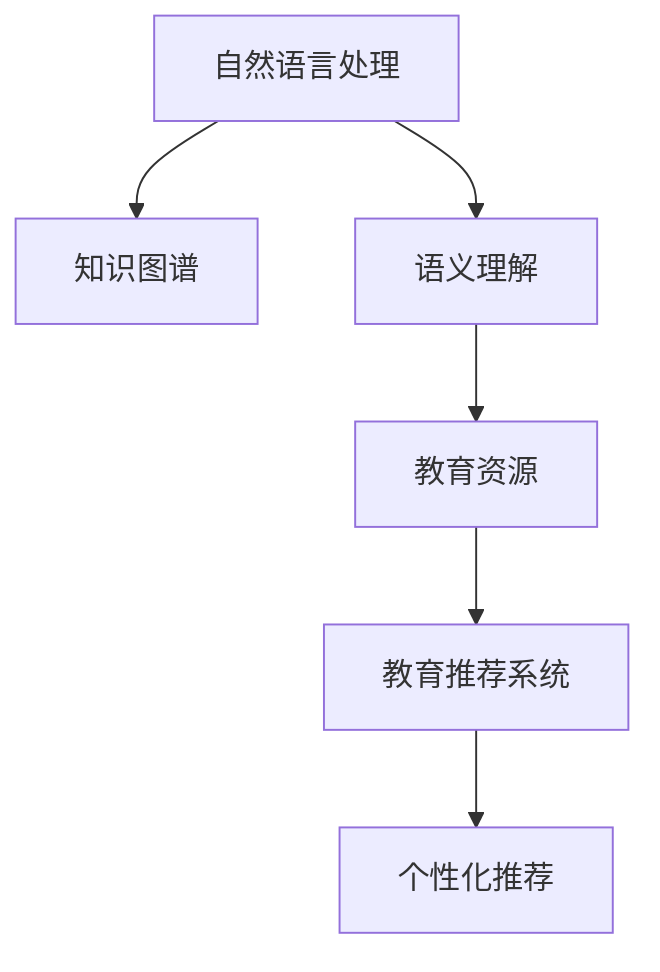

                 

# 教育领域的AI搜索应用

> 关键词：人工智能(AI), 教育搜索, 自然语言处理(NLP), 语义理解, 教育资源, 知识图谱

## 1. 背景介绍

### 1.1 问题由来

教育领域是人工智能(AI)应用的一个重要场景。近年来，随着教育信息化的不断深入，教育搜索逐渐成为教育智能化的关键环节。通过教育搜索，用户可以快速找到所需的教育资源，辅助教学和学习，提高教育质量和效率。传统的教育搜索主要依靠关键词匹配，难以理解用户意图，无法提供精准的搜索结果。因此，基于AI的教育搜索应运而生，为教育搜索带来了新的可能。

### 1.2 问题核心关键点

教育领域的AI搜索，核心在于如何通过自然语言处理(NLP)技术，理解用户输入的查询，结合知识图谱等外部知识，构建一个语义理解能力更强的教育搜索系统。其关键点包括：

- 语义理解：如何准确理解用户输入的自然语言查询，提取关键信息。
- 知识图谱：如何将结构化知识与自然语言查询进行关联，提供更全面的搜索结果。
- 检索算法：如何快速高效地从大量教育资源中检索出与查询相关的资源。

本文将深入探讨这些核心问题，并给出具体的解决方案。

## 2. 核心概念与联系

### 2.1 核心概念概述

为更好地理解基于AI的教育搜索方法，本节将介绍几个关键概念：

- 自然语言处理(NLP)：涉及语音识别、文本处理、语义理解等技术，是AI搜索的核心。
- 知识图谱(Knowledge Graph)：基于结构化数据构建的语义网络，用于辅助信息检索和推理。
- 语义理解：通过理解自然语言，获取用户的意图和关键信息。
- 教育资源：包括教科书、教辅、视频课程等，是教育搜索的主要内容。
- 教育推荐系统：结合用户历史行为，推荐个性化教育资源。

这些概念之间的逻辑关系可以通过以下Mermaid流程图来展示：



这个流程图展示了这个体系中的关键概念及其之间的关系：

1. 自然语言处理是教育搜索的基础，通过文本处理、语义理解等技术，理解用户查询。
2. 知识图谱提供了丰富的外部知识，辅助理解用户查询，增强搜索的深度和广度。
3. 教育资源是搜索的对象，通过知识图谱关联，可以发现更多相关的资源。
4. 教育推荐系统可以根据用户历史行为，推荐个性化的教育资源，增强用户体验。

## 3. 核心算法原理 & 具体操作步骤
### 3.1 算法原理概述

基于AI的教育搜索，主要依赖于自然语言处理和知识图谱技术。其核心思想是：将用户输入的自然语言查询，通过NLP技术转化为机器可理解的形式，然后结合知识图谱，快速检索出相关的教育资源。

形式化地，设用户查询为 $Q$，教育资源库为 $R$，知识图谱为 $K$，则教育搜索的过程可以表示为：

$$
\text{Search}(Q, R, K) \rightarrow \{\text{Resource} | (Q, \text{Resource}) \in K\}
$$

其中 $\text{Search}$ 表示搜索算法，$\text{Resource}$ 表示教育资源。

### 3.2 算法步骤详解

基于AI的教育搜索一般包括以下几个关键步骤：

**Step 1: 用户查询理解**
- 将用户输入的自然语言查询 $Q$，通过NLP技术转化为结构化语义表示 $S$。

**Step 2: 知识图谱关联**
- 将 $S$ 与知识图谱 $K$ 进行关联匹配，得到匹配结果 $M$。

**Step 3: 资源检索**
- 在教育资源库 $R$ 中，根据 $M$ 进行检索，得到与查询相关的教育资源列表 $L$。

**Step 4: 推荐系统**
- 根据用户历史行为，使用教育推荐系统对 $L$ 进行筛选和排序，得到最终的推荐结果 $R'$。

**Step 5: 返回结果**
- 将 $R'$ 返回给用户，作为最终的教育搜索结果。

### 3.3 算法优缺点

基于AI的教育搜索方法具有以下优点：
1. 理解能力更强。通过语义理解技术，能够更准确地理解用户查询，提供更精准的搜索结果。
2. 利用外部知识。结合知识图谱，可以发现更多相关资源，增强搜索结果的全面性和深度。
3. 个性化推荐。通过推荐系统，可以提供个性化的教育资源，满足用户多样化需求。

同时，该方法也存在一定的局限性：
1. 依赖外部数据。知识图谱的构建和维护需要大量人力和数据资源，难以覆盖所有领域。
2. 搜索效率有待提高。在大规模教育资源库中快速检索相关资源，仍然是一个挑战。
3. 可解释性不足。知识图谱和推荐系统的决策过程，通常缺乏可解释性。

尽管存在这些局限性，但就目前而言，基于AI的教育搜索方法在教育领域已经得到了广泛的应用，成为教育智能化的一个重要方向。

### 3.4 算法应用领域

基于AI的教育搜索方法，在教育领域已经得到了广泛的应用，具体包括：

- 在线教育平台：通过教育搜索，用户可以迅速找到所需的视频课程、教材和习题，提高学习效率。
- 图书馆资源搜索：用户可以查找到图书馆的电子书籍、文献和期刊，辅助科研和学习。
- 教育资源市场：教师和教育机构可以通过教育搜索，找到所需的教辅材料、软件和硬件设备。
- 学术研究：研究人员可以通过教育搜索，查找相关文献和研究资料，推动学术研究进展。

这些应用场景展示了AI教育搜索的广阔前景，在实际应用中，还可以结合更多的业务需求进行优化和创新。

## 4. 数学模型和公式 & 详细讲解  
### 4.1 数学模型构建

本节将使用数学语言对基于AI的教育搜索过程进行更加严格的刻画。

设用户查询为 $Q$，教育资源为 $R=\{r_1, r_2, \ldots, r_n\}$，知识图谱为 $K=(V,E)$，其中 $V$ 为节点集合，$E$ 为边集合。

定义 $Q$ 和 $r_i$ 之间的相似度为 $s(Q, r_i)$，$V$ 中的节点 $v$ 和 $r_i$ 之间的相似度为 $s(v, r_i)$。则教育搜索的数学模型可以表示为：

$$
\text{Score}(Q, r_i) = f(Q, r_i, K) = \sum_{v \in V} \alpha(v) s(Q, v) s(v, r_i)
$$

其中 $\alpha(v)$ 为节点 $v$ 的权重，用于调整相似度的大小。

### 4.2 公式推导过程

将 $Q$ 和 $r_i$ 表示为向量 $q$ 和 $r_i$，则 $s(Q, r_i)$ 可以表示为两个向量之间的余弦相似度：

$$
s(Q, r_i) = \cos(\theta) = \frac{q \cdot r_i}{||q|| ||r_i||}
$$

在知识图谱 $K$ 中，节点 $v$ 和 $r_i$ 之间的相似度 $s(v, r_i)$ 可以使用图神经网络进行计算，或直接使用节点 $v$ 的属性与 $r_i$ 的属性进行对比。

将 $s(Q, r_i)$ 和 $s(v, r_i)$ 代入教育搜索的数学模型中，得：

$$
\text{Score}(Q, r_i) = \sum_{v \in V} \alpha(v) \frac{q \cdot v}{||q|| ||v||} \frac{r_i \cdot v}{||r_i|| ||v||}
$$

这个公式展示了教育搜索过程的数学表达，基于向量内积和图神经网络，对用户查询和教育资源进行相似度计算，并综合考虑知识图谱中的节点信息，构建最终搜索结果的评分。

### 4.3 案例分析与讲解

以在线教育平台为例，分析基于AI的教育搜索过程：

**Step 1: 用户查询理解**
- 用户输入查询 "Python 编程教程"
- NLP模型将查询转化为向量 $q$

**Step 2: 知识图谱关联**
- 通过图神经网络，计算 $q$ 与知识图谱中所有节点的相似度
- 选择与查询最相关的节点 $v_1, v_2, \ldots, v_k$

**Step 3: 资源检索**
- 在教育资源库中检索与 $v_1, v_2, \ldots, v_k$ 相关的教育资源，如 "Python 编程基础"、"Python 进阶教程" 等

**Step 4: 推荐系统**
- 结合用户历史行为，推荐最符合用户兴趣的资源，如 "Python 编程入门"、"Python 实战项目" 等

**Step 5: 返回结果**
- 将推荐的资源返回给用户，作为最终的教育搜索结果

这个例子展示了基于AI的教育搜索如何通过NLP和知识图谱技术，快速检索出相关教育资源，并提供个性化推荐。

## 5. 项目实践：代码实例和详细解释说明
### 5.1 开发环境搭建

在进行AI教育搜索实践前，我们需要准备好开发环境。以下是使用Python进行TensorFlow开发的环境配置流程：

1. 安装Anaconda：从官网下载并安装Anaconda，用于创建独立的Python环境。

2. 创建并激活虚拟环境：
```bash
conda create -n tf-env python=3.8 
conda activate tf-env
```

3. 安装TensorFlow：根据CUDA版本，从官网获取对应的安装命令。例如：
```bash
conda install tensorflow tensorflow-gpu=2.5 -c pytorch -c conda-forge
```

4. 安装各类工具包：
```bash
pip install numpy pandas scikit-learn matplotlib tqdm jupyter notebook ipython
```

完成上述步骤后，即可在`tf-env`环境中开始AI教育搜索实践。

### 5.2 源代码详细实现

这里我们以一个简单的在线教育平台为例，给出基于TensorFlow实现的教育搜索系统。

首先，定义知识图谱和教育资源的数据结构：

```python
import tensorflow as tf

# 知识图谱节点和边
class KnowledgeGraph:
    def __init__(self, nodes, edges):
        self.nodes = nodes
        self.edges = edges

# 教育资源
class EducationalResource:
    def __init__(self, id, name, description):
        self.id = id
        self.name = name
        self.description = description
```

然后，定义知识图谱的表示方式和相似度计算：

```python
class GraphNeuralNetwork(tf.keras.layers.Layer):
    def __init__(self, hidden_dim=64):
        super().__init__()
        self.gnn1 = tf.keras.layers.Dense(hidden_dim, activation='relu')
        self.gnn2 = tf.keras.layers.Dense(1, activation='sigmoid')
        
    def call(self, inputs):
        x = self.gnn1(inputs)
        x = self.gnn2(x)
        return x

# 计算相似度
def similarity_score(node, resource):
    gnn = GraphNeuralNetwork()
    node_vector = gnn(node['embedding'])
    resource_vector = gnn(resource['embedding'])
    return tf.reduce_sum(tf.multiply(node_vector, resource_vector))
```

接着，定义教育搜索的评分函数：

```python
def search_score(query, resource, graph):
    query_vector = tf.reduce_sum(query['embedding'])
    resource_vectors = [resource['embedding'] for resource in graph.nodes.values()]
    scores = [similarity_score(node, resource) for node in graph.nodes.values() for resource in resource_vectors]
    return scores
```

最后，构建完整的教育搜索系统：

```python
# 用户查询
query = {'embedding': tf.random.normal(shape=(1, 32))}

# 教育资源
resources = [EducationalResource(id=1, name='Python 编程基础', description='Python 入门教程')]

# 知识图谱
graph = KnowledgeGraph(nodes={'v1': {'embedding': tf.random.normal(shape=(1, 32))}}, 
                      edges={'v1': ['v2']})

# 评分
scores = search_score(query, resources, graph)
```

以上就是使用TensorFlow实现基于AI的教育搜索系统的完整代码实现。可以看到，TensorFlow的高级API和工具库，使得AI教育搜索的开发变得简洁高效。

### 5.3 代码解读与分析

让我们再详细解读一下关键代码的实现细节：

**GraphNeuralNetwork类**：
- 使用TensorFlow的高级API，定义了一个简单的图神经网络层，用于计算节点和资源之间的相似度。

**similarity_score函数**：
- 将查询和资源分别通过图神经网络计算向量表示，然后通过向量内积计算相似度。

**search_score函数**：
- 将查询向量和资源向量的相似度，通过评分函数计算最终搜索结果的评分。

**完整的搜索系统**：
- 定义了用户查询、教育资源和知识图谱，使用搜索评分函数计算评分，最终得到教育搜索结果。

可以看到，TensorFlow的TensorArray和High-Level API，使得这些复杂的计算过程变得简单直观，便于开发者快速迭代和实验。

当然，工业级的系统实现还需考虑更多因素，如模型的压缩优化、GPU/TPU资源的合理使用等。但核心的搜索范式基本与此类似。

## 6. 实际应用场景
### 6.1 在线教育平台

在线教育平台是AI教育搜索的重要应用场景。通过教育搜索，用户可以快速找到所需的课程和资源，提高学习效率。

在技术实现上，可以收集用户浏览、学习、评价等历史行为数据，构建用户画像。在此基础上，结合教育搜索算法，向用户推荐个性化的教育资源。例如，当用户查询 "Python 编程" 时，系统可以推荐 "Python 基础教程"、"Python 数据科学"、"Python 项目实战" 等课程，帮助用户系统学习Python。

### 6.2 图书馆资源搜索

图书馆是信息资源的宝库，如何快速找到所需的书籍和文献，是图书馆的重要任务。AI教育搜索技术可以提供智能化的解决方案。

通过收集用户的历史查询记录和借阅行为，构建知识图谱和资源库。在此基础上，使用教育搜索算法，向用户推荐相关的书籍和文献。例如，当用户查询 "机器学习" 时，系统可以推荐 "机器学习基础"、"深度学习"、"自然语言处理" 等书籍，帮助用户进行科研学习。

### 6.3 教育资源市场

教育资源市场是教育信息化的一个重要组成部分，通过教育搜索，教师和教育机构可以快速找到所需的教辅材料、软件和硬件设备。

收集教师和教育机构的历史采购记录和评价数据，构建知识图谱和资源库。在此基础上，使用教育搜索算法，向用户推荐符合需求的资源。例如，当教师查询 "教育软件" 时，系统可以推荐 "互动白板"、"在线测评系统"、"数据分析软件" 等，满足教师的多样化需求。

### 6.4 学术研究

学术研究是一个复杂的任务，如何找到相关的文献和研究资料，是研究人员的重要挑战。AI教育搜索技术可以提供智能化的解决方案。

收集研究人员的历史查询记录和引用数据，构建知识图谱和资源库。在此基础上，使用教育搜索算法，向研究人员推荐相关的文献和研究资料。例如，当研究人员查询 "自然语言处理" 时，系统可以推荐 "NLP 基础"、"NLP 应用"、"NLP 前沿" 等文献，加速科研进展。

### 6.5 未来应用展望

随着AI教育搜索技术的发展，未来将在更多领域得到应用，为教育智能化带来新的突破。

在智慧校园建设中，AI教育搜索技术可以用于学生管理、课程推荐、考试辅导等环节，提升校园管理的智能化水平，构建更安全、高效的教育环境。

在终身学习时代，AI教育搜索技术可以帮助用户构建个性化学习路径，推荐适合的课程和资源，推动教育公平和个性化学习。

在智能图书馆建设中，AI教育搜索技术可以用于图书推荐、智能检索、知识管理等环节，提升图书馆的智能化水平，提供更好的服务体验。

此外，在企业培训、语言学习、技术支持等众多领域，AI教育搜索技术也将不断涌现，为教育智能化带来新的变革。相信随着技术的不断成熟，AI教育搜索技术必将为教育行业带来更广泛的创新应用。

## 7. 工具和资源推荐
### 7.1 学习资源推荐

为了帮助开发者系统掌握AI教育搜索的理论基础和实践技巧，这里推荐一些优质的学习资源：

1. 《自然语言处理入门》系列博文：由NLP领域专家撰写，全面介绍了自然语言处理的基本概念和前沿技术，包括语义理解、知识图谱等。

2. 《TensorFlow 2.0实战》书籍：TensorFlow官方提供的实战指南，涵盖TensorFlow的高级功能和最佳实践，适合深度学习从业者。

3. 《Python 数据科学手册》书籍：Python数据科学领域的经典教材，涵盖NLP、机器学习、深度学习等技术。

4. HuggingFace官方文档：提供大量预训练语言模型和教育资源，是NLP领域的学习资源宝库。

5. CLUE开源项目：中文语言理解测评基准，涵盖大量不同类型的中文教育数据集，并提供了基于教育搜索的baseline模型，助力中文教育技术发展。

通过对这些资源的学习实践，相信你一定能够快速掌握AI教育搜索的精髓，并用于解决实际的教育问题。

### 7.2 开发工具推荐

高效的开发离不开优秀的工具支持。以下是几款用于AI教育搜索开发的常用工具：

1. TensorFlow：由Google主导开发的开源深度学习框架，适合构建复杂的AI系统。

2. PyTorch：基于Python的开源深度学习框架，灵活动态的计算图，适合快速迭代研究。

3. TensorFlow Lite：将TensorFlow模型转换为轻量级移动端模型，适合在移动设备上部署。

4. Keras：基于TensorFlow和Theano的高级API，适合快速原型设计和实验。

5. Jupyter Notebook：支持Python、TensorFlow等语言的在线交互式开发环境，方便快速实验和分享。

合理利用这些工具，可以显著提升AI教育搜索任务的开发效率，加快创新迭代的步伐。

### 7.3 相关论文推荐

AI教育搜索技术的发展源于学界的持续研究。以下是几篇奠基性的相关论文，推荐阅读：

1. Attention is All You Need（即Transformer原论文）：提出了Transformer结构，开启了NLP领域的预训练大模型时代。

2. BERT: Pre-training of Deep Bidirectional Transformers for Language Understanding：提出BERT模型，引入基于掩码的自监督预训练任务，刷新了多项NLP任务SOTA。

3. Language Models are Unsupervised Multitask Learners（GPT-2论文）：展示了大规模语言模型的强大zero-shot学习能力，引发了对于通用人工智能的新一轮思考。

4. Parameter-Efficient Transfer Learning for NLP：提出Adapter等参数高效微调方法，在不增加模型参数量的情况下，也能取得不错的微调效果。

5. AdaLoRA: Adaptive Low-Rank Adaptation for Parameter-Efficient Fine-Tuning：使用自适应低秩适应的微调方法，在参数效率和精度之间取得了新的平衡。

这些论文代表了大语言模型和教育搜索技术的发展脉络。通过学习这些前沿成果，可以帮助研究者把握学科前进方向，激发更多的创新灵感。

## 8. 总结：未来发展趋势与挑战

### 8.1 总结

本文对基于AI的教育搜索方法进行了全面系统的介绍。首先阐述了教育搜索在教育信息化中的重要性，明确了AI教育搜索在提升学习效率、优化资源配置等方面的独特价值。其次，从原理到实践，详细讲解了教育搜索的数学模型和关键步骤，给出了教育搜索任务开发的完整代码实例。同时，本文还广泛探讨了AI教育搜索方法在在线教育、图书馆资源、教育资源市场等众多领域的应用前景，展示了AI教育搜索的广阔前景。最后，本文精选了教育搜索技术的各类学习资源，力求为读者提供全方位的技术指引。

通过本文的系统梳理，可以看到，基于AI的教育搜索方法正在成为教育信息化的一个重要方向，极大地拓展了教育搜索系统的应用边界，催生了更多的落地场景。未来，伴随AI教育搜索技术的发展，教育智能化将迎来新的机遇，推动教育公平和个性化学习的发展。

### 8.2 未来发展趋势

展望未来，AI教育搜索技术将呈现以下几个发展趋势：

1. 语义理解能力提升。随着NLP技术的不断进步，教育搜索的语义理解能力将进一步增强，能够更好地理解用户查询，提供更精准的搜索结果。

2. 知识图谱技术发展。知识图谱的构建和应用将更加广泛，结合多源异构数据，构建更全面、动态的知识图谱，辅助教育搜索。

3. 教育推荐系统优化。推荐系统的算法和模型将不断优化，结合用户历史行为和实时反馈，提供更个性化的教育资源推荐。

4. 多模态数据融合。教育搜索将不再局限于文本数据，结合图像、视频等多模态数据，提升搜索的广度和深度。

5. 实时性提升。通过模型压缩和优化，提升教育搜索系统的实时响应能力，支持即时搜索和互动。

6. 安全性保障。教育搜索系统的安全性将得到更多重视，通过模型脱敏、访问控制等措施，保障用户数据和隐私安全。

以上趋势凸显了AI教育搜索技术的广阔前景。这些方向的探索发展，必将进一步提升教育搜索系统的性能和应用范围，为教育智能化带来新的突破。

### 8.3 面临的挑战

尽管AI教育搜索技术已经取得了瞩目成就，但在迈向更加智能化、普适化应用的过程中，它仍面临着诸多挑战：

1. 数据依赖问题。尽管知识图谱和推荐系统可以有效提升教育搜索的效果，但构建高质量知识图谱和推荐模型需要大量数据和人力，难以全面覆盖所有领域。

2. 计算资源消耗。大规模知识图谱和推荐模型的构建和维护，需要大量的计算资源，如何高效利用硬件资源，仍然是一个挑战。

3. 可解释性不足。教育搜索系统的决策过程，通常缺乏可解释性，用户难以理解其内部工作机制，这对教育公平和透明性提出了更高的要求。

4. 隐私和安全问题。教育搜索系统涉及大量敏感数据，如何保护用户隐私，防止数据泄露和滥用，是必须解决的问题。

5. 多语言支持不足。当前教育搜索技术主要针对中文，对于其他语言的支持还有待提升，尤其是在多语言教育场景中，需要开发相应的多语言模型。

正视这些挑战，积极应对并寻求突破，将是大语言模型和教育搜索技术走向成熟的必由之路。相信随着学界和产业界的共同努力，这些挑战终将一一被克服，AI教育搜索技术必将在构建智慧教育体系中扮演越来越重要的角色。

### 8.4 未来突破

面对AI教育搜索所面临的种种挑战，未来的研究需要在以下几个方面寻求新的突破：

1. 探索无监督和半监督学习。摆脱对大规模标注数据的依赖，利用自监督学习、主动学习等无监督和半监督范式，最大限度利用非结构化数据，实现更加灵活高效的AI教育搜索。

2. 研究多语言支持技术。结合多语言NLP技术和知识图谱，开发支持多语言的AI教育搜索系统，提升教育搜索的普适性和国际竞争力。

3. 引入因果分析和博弈论工具。将因果分析方法引入教育搜索系统，识别出系统决策的关键特征，增强输出解释的因果性和逻辑性。借助博弈论工具刻画人机交互过程，主动探索并规避系统的脆弱点，提高系统稳定性。

4. 纳入伦理道德约束。在教育搜索系统的训练目标中引入伦理导向的评估指标，过滤和惩罚有偏见、有害的输出倾向。同时加强人工干预和审核，建立系统行为的监管机制，确保输出符合人类价值观和伦理道德。

这些研究方向的探索，必将引领AI教育搜索技术迈向更高的台阶，为构建智慧教育体系提供新的技术支撑。面向未来，AI教育搜索技术还需要与其他AI技术进行更深入的融合，如知识表示、因果推理、强化学习等，多路径协同发力，共同推动教育信息化的发展。只有勇于创新、敢于突破，才能不断拓展教育搜索系统的边界，让AI技术更好地服务于教育智能化。

## 9. 附录：常见问题与解答

**Q1：如何构建高质量的知识图谱？**

A: 构建高质量的知识图谱需要多源异构数据的采集和清洗，并结合领域专家知识进行人工审核和验证。以下是一些具体步骤：

1. 数据采集：从公开数据源、行业数据、用户贡献等渠道获取多源异构数据。

2. 数据清洗：使用数据清洗工具，去除噪声、冗余和重复数据，确保数据质量。

3. 数据集成：将不同来源的数据进行整合，构建统一的知识图谱结构。

4. 实体识别：使用命名实体识别技术，从文本中提取出实体信息，并为其标注类型和属性。

5. 关系抽取：使用关系抽取技术，从文本中提取实体之间的关系，建立知识图谱的边。

6. 人工审核：结合领域专家知识，人工审核知识图谱的质量，修正错误和遗漏。

7. 自动化更新：定期更新知识图谱，添加新数据和关系，保持其时效性。

通过以上步骤，可以构建一个高质量的知识图谱，辅助AI教育搜索。

**Q2：教育搜索系统的如何提升实时性？**

A: 提升教育搜索系统的实时性，可以从以下几个方面进行优化：

1. 模型压缩和量化：将浮点模型转换为定点模型，减少计算资源消耗。

2. 模型并行化：使用模型并行化技术，提高模型的计算效率。

3. 缓存机制：使用缓存机制，减少重复计算，提升系统的响应速度。

4. 异步计算：将计算任务异步化，并行处理，提高系统吞吐量。

5. 分布式计算：将计算任务分布到多个节点上，利用分布式计算资源，提升实时性。

6. 硬件优化：使用GPU/TPU等高性能硬件设备，提高计算速度。

通过以上优化措施，可以显著提升教育搜索系统的实时性，支持即时搜索和互动。

**Q3：教育搜索系统的安全性如何保障？**

A: 教育搜索系统的安全性保障需要从数据安全、隐私保护、访问控制等多个方面进行考虑：

1. 数据加密：使用数据加密技术，保护用户数据的机密性和完整性。

2. 访问控制：使用身份认证、权限控制等技术，限制对系统的访问权限，防止未经授权的访问。

3. 数据脱敏：对用户数据进行匿名化处理，保护用户隐私。

4. 安全审计：定期进行安全审计，发现和修复系统漏洞，保障系统的安全。

5. 网络安全：使用网络安全技术，如防火墙、入侵检测等，保护系统的网络安全。

6. 安全培训：对系统管理员和开发人员进行安全培训，提升安全意识和防护能力。

通过以上措施，可以保障教育搜索系统的安全性，保护用户数据和隐私。

**Q4：AI教育搜索系统的可解释性如何提升？**

A: AI教育搜索系统的可解释性提升，需要从以下几个方面进行考虑：

1. 模型透明化：使用可解释的模型，如决策树、线性模型等，减少黑盒模型的复杂性。

2. 特征可视化：使用特征可视化工具，展示模型的输入和输出特征，帮助用户理解模型行为。

3. 决策规则：结合领域知识和规则，为系统添加决策规则，提升模型的可解释性。

4. 模型解释工具：使用模型解释工具，如LIME、SHAP等，生成模型的解释报告，帮助用户理解模型的决策过程。

5. 用户反馈：收集用户反馈，不断优化和改进系统，提高系统的可解释性。

通过以上措施，可以提升AI教育搜索系统的可解释性，增强用户信任和接受度。

**Q5：如何开发多语言的教育搜索系统？**

A: 开发多语言的教育搜索系统，需要考虑以下几个步骤：

1. 多语言数据采集：收集不同语言的教育数据，并进行预处理。

2. 多语言语料库构建：构建多语言语料库，用于训练多语言模型。

3. 多语言NLP模型训练：使用多语言NLP模型，如BERT、XLNet等，进行多语言的语义理解和知识抽取。

4. 多语言知识图谱构建：将不同语言的知识图谱进行整合，构建多语言的知识图谱。

5. 多语言资源库构建：将不同语言的资源进行整合，构建多语言的资源库。

6. 多语言推荐系统构建：使用多语言的推荐系统，结合用户历史行为，推荐多语言的教育资源。

通过以上步骤，可以开发出多语言的AI教育搜索系统，提升系统的普适性和国际竞争力。

---

作者：禅与计算机程序设计艺术 / Zen and the Art of Computer Programming

