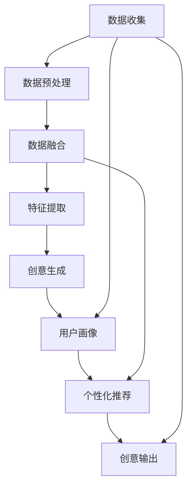

                 

## 1. 背景介绍

### 1.1 问题由来

近年来，人工智能（AI）技术的发展已渗透到各个领域，尤其在创意产业的应用中，AI正在显现出其独特优势。传统创意产业如广告、音乐、绘画、设计等，往往依赖于创意思维和直觉，这些领域的工作常需天马行空的想象力，但繁琐的手工操作却限制了创作者的自由。而AI的加入，不仅能大幅提升创作效率，还能激发新的创意，引领行业变革。

AI如何激发创意？其核心在于强大的数据处理能力和机器学习算法。通过深度学习等技术，AI能分析海量数据，挖掘模式，生成新颖内容，甚至还能协助人类进行复杂决策。但仅有技术并不足以促进创新，我们需要的是一种能够催生新思路、新方法的催化剂。本文将探讨基于AI的创新思维激发器，并探讨其原理、操作步骤、优缺点及其应用领域。

### 1.2 问题核心关键点

AI驱动的创新思维激发器，旨在通过算法模型和数据处理技术，分析和整合海量数据，揭示创意思维的规律，辅助人类进行创造性工作。其关键点包括：

- **数据驱动**：以大数据为支撑，挖掘出创意产生的内在模式和规律。
- **智能辅助**：通过AI算法辅助进行数据处理和创意生成，提高创作效率。
- **个性化定制**：针对不同用户或项目的特点，提供量身定制的创意建议。
- **跨界融合**：结合不同领域的知识与技术，创造出新的创意产品。

## 2. 核心概念与联系

### 2.1 核心概念概述

为理解AI驱动的创新思维激发器，我们先明确几个核心概念：

- **AI创意生成**：利用AI技术，根据输入数据自动生成创意内容，如文本、图像、音乐等。
- **数据融合**：将来自不同来源的数据整合在一起，形成有价值的信息集，辅助生成创意。
- **用户画像**：通过分析用户的行为、偏好和历史数据，建立用户画像，用于个性化创意推荐。
- **创新理论**：理论研究如何通过技术手段激发和提升创意思维，从而推动创造性工作。

这些概念之间联系紧密，形成一个完整的创新思维激发系统，其核心在于通过AI算法，整合多源数据，挖掘创意思维的规律，并据此生成创意内容。

### 2.2 核心概念原理和架构的 Mermaid 流程图



该图展示了从数据收集到创意输出的整个过程。数据收集后，通过预处理、融合和特征提取，最终利用AI模型生成创意，并通过用户画像实现个性化推荐。

## 3. 核心算法原理 & 具体操作步骤

### 3.1 算法原理概述

AI驱动的创新思维激发器，通常基于深度学习等技术，通过以下几个步骤实现：

1. **数据收集**：从不同渠道收集创意相关数据，如文本、图像、音频等。
2. **数据预处理**：对收集到的数据进行清洗、标注、格式转换等预处理操作，提高数据质量。
3. **特征提取**：利用算法提取数据的关键特征，如NLP中的词向量、CNN中的图像特征等。
4. **创意生成**：通过生成对抗网络（GAN）、变分自编码器（VAE）等模型，生成新的创意内容。
5. **用户画像构建**：通过用户行为数据分析，构建用户画像，了解用户兴趣和需求。
6. **个性化推荐**：根据用户画像，推荐符合用户口味的创意作品。
7. **创意输出**：将生成的创意作品输出给用户，供其进一步创作或直接使用。

### 3.2 算法步骤详解

**步骤一：数据收集与预处理**

数据是AI激发创意的基础。首先需要从不同来源收集相关数据，包括文本、图像、音频等。收集到的数据可能格式各异，需要进行预处理，如去除噪声、标注类别、归一化等操作。

**步骤二：特征提取**

特征提取是将原始数据转换为机器可以理解的形式的过程。NLP中常用的特征提取方式包括词嵌入（Word Embedding）、BERT等；图像领域常用卷积神经网络（CNN）提取特征；音频领域则可能采用MFCC（Mel频率倒谱系数）等技术。

**步骤三：创意生成**

创意生成阶段是整个激发器的核心。目前，生成对抗网络（GAN）和变分自编码器（VAE）是最流行的两种生成模型，通过训练这些模型，能够生成具有高度创意性的内容，如图片、音乐等。

**步骤四：用户画像构建**

用户画像的构建基于用户历史行为数据，通过数据分析挖掘用户兴趣、需求、偏好等关键信息。用户画像为后续的个性化推荐提供重要依据。

**步骤五：个性化推荐**

个性化推荐系统通过用户画像，对生成的创意作品进行筛选和推荐，确保推荐的创意作品与用户的兴趣和需求高度匹配。

**步骤六：创意输出**

创意作品生成并经过个性化推荐后，可以通过网站、APP等平台输出给用户，供其进一步创作或直接使用。

### 3.3 算法优缺点

**优点：**

1. **高效率**：AI自动生成创意，大幅提高创作效率。
2. **高质量**：AI算法能挖掘数据深层规律，生成高质量创意。
3. **个性化**：根据用户画像进行个性化推荐，满足用户需求。
4. **跨界融合**：结合不同领域的知识和技术，创造新的创意产品。

**缺点：**

1. **依赖数据质量**：创意生成的质量依赖于数据质量，数据缺失或噪声过多会影响效果。
2. **生成内容的普适性**：生成的创意内容可能无法全面覆盖所有用户，缺乏普遍性。
3. **需要高成本设备**：深度学习模型训练通常需要高性能计算设备，投入成本较高。
4. **算法复杂性**：创意生成算法复杂，模型调整和优化难度大。

### 3.4 算法应用领域

AI驱动的创新思维激发器可以应用于多个领域，具体包括：

- **广告创意**：根据用户数据，自动生成广告文案和图片，提升广告效果。
- **音乐创作**：基于用户偏好，生成个性化的音乐作品，助力音乐创作。
- **图像设计**：生成符合用户要求的图像设计，辅助设计工作。
- **影视制作**：自动生成电影剧本、场景设计等，加速影视制作流程。
- **游戏开发**：生成游戏背景、角色设计等内容，辅助游戏创作。

## 4. 数学模型和公式 & 详细讲解

### 4.1 数学模型构建

基于创意生成，我们可以构建如下数学模型：

$$
y = f(x)
$$

其中 $y$ 表示生成的创意内容，$x$ 为输入数据（如文本、图像），$f$ 为生成函数，表示创意生成算法。

### 4.2 公式推导过程

以生成对抗网络（GAN）为例，推导创意生成公式：

$$
G(x) = y
$$

其中 $G$ 为生成器，$x$ 为输入噪声向量，$y$ 为生成的创意内容。生成器 $G$ 通过学习大量的创意数据，将其映射为创意内容 $y$。

### 4.3 案例分析与讲解

以生成图片为例，分析GAN的工作原理。假设有输入噪声向量 $z$，生成器 $G$ 将 $z$ 映射为创意图片 $y$：

1. **输入噪声**：$z \sim N(0,1)$，随机生成噪声向量。
2. **生成图片**：$y = G(z)$，将噪声向量 $z$ 映射为创意图片 $y$。
3. **判别器**：$D(y)$，判断图片 $y$ 是否为真实图片，通过反向传播优化生成器 $G$。
4. **对抗训练**：交替优化生成器和判别器，直至 $D(G(z))$ 最小。

## 5. 项目实践：代码实例和详细解释说明

### 5.1 开发环境搭建

以下是基于Python的深度学习框架TensorFlow 2.0和Keras，使用GAN生成创意图片的开发环境搭建步骤：

1. 安装Anaconda：从官网下载并安装Anaconda，用于创建独立的Python环境。
2. 创建并激活虚拟环境：
   ```bash
   conda create -n gans-env python=3.7
   conda activate gans-env
   ```
3. 安装依赖库：
   ```bash
   pip install tensorflow
   pip install matplotlib
   pip install numpy
   pip install imageio
   ```

### 5.2 源代码详细实现

下面给出一个基于TensorFlow 2.0的GAN模型代码实现，用于生成创意图片：

```python
import tensorflow as tf
from tensorflow.keras import layers
import matplotlib.pyplot as plt
import numpy as np
import imageio

# 定义生成器
def make_generator_model():
    model = tf.keras.Sequential()
    model.add(layers.Dense(256, use_bias=False, input_shape=(100,)))
    model.add(layers.BatchNormalization())
    model.add(layers.LeakyReLU())
    model.add(layers.Dropout(0.2))
    model.add(layers.Dense(512))
    model.add(layers.BatchNormalization())
    model.add(layers.LeakyReLU())
    model.add(layers.Dropout(0.2))
    model.add(layers.Dense(1024))
    model.add(layers.BatchNormalization())
    model.add(layers.LeakyReLU())
    model.add(layers.Dropout(0.2))
    model.add(layers.Dense(784, activation='tanh'))
    return model

# 定义判别器
def make_discriminator_model():
    model = tf.keras.Sequential()
    model.add(layers.Flatten(input_shape=(28, 28)))
    model.add(layers.Dense(1024))
    model.add(layers.LeakyReLU())
    model.add(layers.Dropout(0.2))
    model.add(layers.Dense(512))
    model.add(layers.LeakyReLU())
    model.add(layers.Dropout(0.2))
    model.add(layers.Dense(1, activation='sigmoid'))
    return model

# 定义GAN模型
def make_gan_model(generator, discriminator):
    model = tf.keras.Sequential()
    model.add(generator)
    model.add(discriminator)
    model.compile(loss='binary_crossentropy', optimizer='adam')
    return model

# 训练GAN模型
def train_gan(generator, discriminator, dataset, batch_size=32, epochs=100):
    # 生成器损失函数
    generator_loss = tf.keras.losses.BinaryCrossentropy()
    # 判别器损失函数
    discriminator_loss = tf.keras.losses.BinaryCrossentropy()

    # 训练过程
    for epoch in range(epochs):
        for batch in dataset:
            # 训练生成器
            noise = tf.random.normal([batch_size, 100])
            generated_images = generator(noise)
            real_images = batch
            gen_loss = generator_loss(discriminator(tf.concat([real_images, generated_images], axis=0)), [True] * 2 * batch_size)
            disc_loss = discriminator_loss(discriminator(tf.concat([real_images, generated_images], axis=0)), [True] * batch_size + [False] * batch_size)
            gen_loss = gen_loss
            disc_loss = disc_loss
            generator.train_on_batch(noise, generated_images)
            discriminator.train_on_batch(tf.concat([real_images, generated_images], axis=0), tf.concat([tf.ones_like(disc_loss), tf.zeros_like(disc_loss)], axis=0))

        # 评估
        gen_loss, disc_loss = generator_loss(discriminator(tf.concat([real_images, generated_images], axis=0)), [True] * 2 * batch_size)
        print(f'Epoch {epoch+1}/{epochs}, Generative Loss: {gen_loss.numpy()}, Discriminative Loss: {disc_loss.numpy()}')

# 加载数据集
mnist = tf.keras.datasets.mnist.load_data()
(x_train, _), (x_test, _) = mnist
x_train = x_train / 255.0
x_test = x_test / 255.0

# 生成器和判别器模型
generator = make_generator_model()
discriminator = make_discriminator_model()

# 组合模型
gan_model = make_gan_model(generator, discriminator)

# 训练模型
train_gan(generator, discriminator, x_train, batch_size=32, epochs=100)

# 生成并保存图像
n = 16
noise = tf.random.normal([n, 100])
generated_images = generator(noise)
plt.figure(figsize=(10,10))
for i in range(n):
    plt.subplot(4,4,i+1)
    plt.imshow(generated_images[i].numpy().reshape(28,28), cmap='gray')
plt.show()
```

### 5.3 代码解读与分析

以上代码实现了基于GAN的创意图片生成，详细解读如下：

1. **生成器定义**：通过一系列全连接层和激活函数，将随机噪声映射为创意图片。
2. **判别器定义**：通过全连接层和激活函数，判断输入图片是否为真实图片。
3. **GAN模型定义**：将生成器和判别器组合在一起，形成GAN模型，并编译损失函数。
4. **训练模型**：通过交替优化生成器和判别器，提高生成图片的质量和逼真度。
5. **数据集加载**：使用MNIST数据集，预处理数据并标准化。
6. **训练和生成**：通过训练模型生成创意图片，并展示生成图片。

## 6. 实际应用场景

### 6.1 广告创意

在广告创意生成中，AI可以依据用户行为数据，生成符合用户偏好的广告文案和图片。例如，某电商平台通过分析用户购买历史，生成针对不同用户的个性化广告，大大提升广告点击率和转化率。

### 6.2 音乐创作

AI驱动的音乐创作，能够生成符合用户偏好的个性化音乐作品。例如，Spotify使用深度学习模型，分析用户听歌历史和偏好，自动推荐新的音乐，并生成个性化的音乐作品，提高了用户的满意度和黏性。

### 6.3 图像设计

AI在图像设计中的应用同样广泛。例如，Adobe的DeepArt工具，基于GAN生成各种风格的图片设计，助力设计师进行创意设计。

### 6.4 未来应用展望

未来，AI驱动的创新思维激发器将在更多领域得到应用，为人类提供更高效的创意工具。例如：

1. **自动编剧**：AI可以根据用户提供的故事情节，自动生成完整剧本，辅助编剧工作。
2. **虚拟现实（VR）内容创作**：AI生成符合用户偏好的虚拟现实内容，助力游戏和娱乐行业。
3. **自动化设计**：AI自动生成服装、家具等设计，提升设计效率和创新性。

## 7. 工具和资源推荐

### 7.1 学习资源推荐

为帮助开发者深入了解AI驱动的创新思维激发器，推荐以下学习资源：

1. 《深度学习》（Ian Goodfellow）：全面介绍了深度学习的基本概念和前沿技术，适合初学者和进阶开发者。
2. 《生成对抗网络：原理与实现》（Ian Goodfellow, Jonathon Shlens, Alex M. Citigan）：深入浅出地讲解了GAN的工作原理和实现方法。
3. Coursera的深度学习课程：由Andrew Ng主讲的深度学习课程，涵盖深度学习基本概念和实践技巧，适合入门学习。
4. PyTorch官方文档：PyTorch深度学习框架的官方文档，提供了大量教程和代码示例。
5. Hugging Face Transformers库文档：Transformer库的官方文档，介绍了多种预训练语言模型和微调方法。

### 7.2 开发工具推荐

以下是几款用于创意生成开发的常用工具：

1. TensorFlow：由Google主导开发的开源深度学习框架，生产部署方便，适合大规模工程应用。
2. PyTorch：基于Python的开源深度学习框架，灵活便捷，适合快速迭代研究。
3. Keras：高级神经网络API，在TensorFlow和Theano之上，提供简洁的API接口，易于上手。
4. OpenAI的DALL·E：生成对抗网络模型，能够生成高质量的艺术图片，助力创意生成。
5. AI Studio：阿里云提供的AI开发平台，提供了丰富的预训练模型和可视化工具，方便开发者快速迭代。

### 7.3 相关论文推荐

以下是几篇奠基性的相关论文，推荐阅读：

1. Generative Adversarial Nets（GAN）：Ian Goodfellow, Jean Pouget-Abadie, Mehryar Mohri, et al.：提出GAN模型，生成高质量的创意内容。
2. Conditional Image Synthesis with Auxiliary Classifier GANs（AC-GAN）：Takeru Miyato, Andrew M. Miyato, Masanori Koyama, et al.：通过条件对抗网络，生成符合特定条件的图片。
3. Progressive Growing of GANs for Improved Quality, Stability, and Variation（PG-GAN）：Tinghui Zhou, Jianing Zhao, Guosheng Lin, et al.：提出渐进式增长的GAN模型，提升生成质量。
4. Deep Unsupervised Learning with Conversational Adversarial Networks（DUCGAN）：Yang Li, Mohit Bansal, Hai Zhou, et al.：利用对话对抗网络，生成具有交互性的创意内容。

## 8. 总结：未来发展趋势与挑战

### 8.1 研究成果总结

AI驱动的创新思维激发器，在多个领域展示了其巨大的潜力，并已得到了广泛应用。通过整合多源数据，结合深度学习等技术，AI能够辅助人类进行创意生成，大幅提升创作效率和质量。未来，随着技术的不断进步，AI将进一步深入到创意产业的各个环节，为人类提供更多高效、创新的工具。

### 8.2 未来发展趋势

未来，AI驱动的创新思维激发器将呈现以下发展趋势：

1. **多模态融合**：将文本、图像、音频等多模态数据融合，生成更加丰富多样的创意内容。
2. **跨领域应用**：在广告、音乐、影视等不同领域，提供个性化创意生成服务。
3. **高效优化**：利用高效优化算法，提升创意生成的速度和质量。
4. **用户互动**：通过与用户互动，生成更加贴合用户需求和偏好的创意内容。
5. **伦理和安全**：关注模型生成内容的伦理和安全问题，确保其符合社会价值观。

### 8.3 面临的挑战

尽管AI驱动的创新思维激发器在创意产业中表现出色，但仍然面临一些挑战：

1. **数据隐私和安全**：创意生成依赖大量用户数据，如何保障用户隐私和数据安全是一个重要问题。
2. **创意版权**：AI生成的创意内容是否具有版权问题，尚无统一法律规定，需进一步探讨。
3. **生成内容的可控性**：如何确保生成内容的可控性，避免生成不当内容，是一个重要的研究课题。
4. **人机协作**：如何实现人与AI的有效协作，提升创作效果，也是一个重要的挑战。

### 8.4 研究展望

未来，我们需要在以下几个方面进行深入研究：

1. **生成内容的伦理和法律**：研究AI生成的内容是否具有版权和伦理问题，制定相关法律和规范。
2. **数据隐私和安全**：保护用户数据隐私，确保数据安全和隐私不被泄露。
3. **人机协作**：研究如何实现人与AI的有效协作，提升创作效果。
4. **多模态融合**：将文本、图像、音频等多模态数据融合，生成更加丰富多样的创意内容。

## 9. 附录：常见问题与解答

**Q1：AI创意生成需要多少数据？**

A: AI创意生成的质量高度依赖于数据量。通常情况下，数据量越大，生成的创意内容越丰富、越有创意。但在数据量较少的情况下，可通过数据增强、迁移学习等方法提高模型效果。

**Q2：AI创意生成是否需要人类干预？**

A: 在创意生成过程中，人类干预是必要的。AI可以通过大数据分析生成创意，但最终创意内容仍需由人类判断和筛选，确保其符合用户需求和价值观。

**Q3：AI创意生成的应用前景如何？**

A: AI创意生成在广告、音乐、设计等领域展现出巨大的应用前景，未来有望进一步拓展到更多领域。AI能够大幅提升创意创作效率，助力创意产业的数字化转型。

**Q4：AI创意生成的缺点是什么？**

A: AI创意生成的缺点主要在于：依赖大量高质量数据、生成的内容可能缺乏独特性、生成的内容缺乏人类情感深度等。这些问题仍需通过不断优化算法和改进数据处理方式来解决。

---

作者：禅与计算机程序设计艺术 / Zen and the Art of Computer Programming

