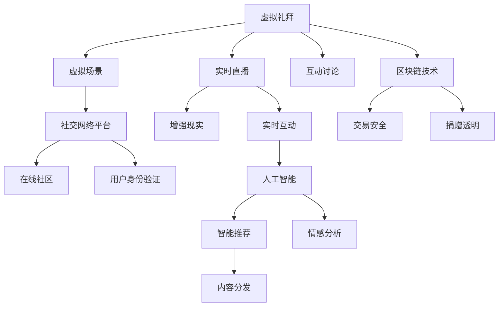

                 

# 数字化宗教创业：虚拟礼拜和在线社区

> 关键词：数字化宗教,虚拟礼拜,在线社区,区块链技术,人工智能,社交网络

## 1. 背景介绍

### 1.1 问题由来

数字化时代的到来，正在深刻改变人类的生活方式和信仰习惯。宗教作为一种根植于历史与文化的社会现象，同样面临着数字化转型的挑战与机遇。特别是在新冠疫情期间，宗教组织不得不从线下转向线上，虚拟礼拜和在线社区成为其生存发展的必要选择。

### 1.2 问题核心关键点

数字化宗教创业的核心在于如何利用现代信息技术，如人工智能、区块链、大数据等，构建虚拟礼拜和在线社区，使其具备高度互动性和社区感。关键点包括：

1. 虚拟礼拜平台的设计和开发，以支持实时直播、互动讨论、虚拟场景体验等功能。
2. 区块链技术的应用，确保交易和捐赠的安全透明，提高社区成员的信任度。
3. 人工智能技术的引入，提升社区内容推荐、情感分析、虚拟引导等功能。
4. 社交网络平台的构建，促进社区成员之间的连接与交流。

### 1.3 问题研究意义

数字化宗教创业不仅有助于宗教组织应对当前的挑战，更在长期来看，为宗教信仰传播和社区发展开辟了新的路径。具体而言：

1. 拓宽受众范围：虚拟礼拜和在线社区打破了时间和空间的限制，使更多人群能够方便地接触和参与宗教活动。
2. 增强互动性：通过实时互动和智能推荐，使参与者获得更深刻的信仰体验和社区归属感。
3. 提高效率：自动化和智能化的应用，减少了宗教活动组织和管理的复杂度，提升了运营效率。
4. 增强安全性：区块链和人工智能技术的应用，保障了社区成员的隐私和数据安全。
5. 推动创新：技术的应用，激发了新的宗教服务形态和社区治理模式，促进了宗教领域的技术革新。

## 2. 核心概念与联系

### 2.1 核心概念概述

为更好地理解数字化宗教创业，我们需要明确几个核心概念及其相互联系：

- **虚拟礼拜**：利用虚拟现实(VR)、增强现实(AR)等技术，构建线上虚拟宗教场所，支持实时直播、互动讨论、虚拟场景体验等功能。
- **在线社区**：基于社交网络平台，构建宗教信仰者之间的交流互动空间，分享知识、经验、信仰体验。
- **区块链技术**：利用去中心化、透明、不可篡改的特点，保障虚拟礼拜和在线社区中的交易、捐赠、记录等活动的可信度。
- **人工智能**：通过自然语言处理、情感分析、智能推荐等技术，提升虚拟礼拜和在线社区的用户体验和运营效率。
- **社交网络平台**：提供基础的社交功能，支持消息、讨论、分享等互动，构建虚拟宗教社区的基础设施。

这些概念之间的联系可以通过以下Mermaid流程图来展示：



这个流程图展示了虚拟礼拜和在线社区的各个关键组成部分及其相互关系：

1. 虚拟礼拜通过虚拟场景、实时直播和互动讨论等技术手段，提供真实感和互动体验。
2. 在线社区依托社交网络平台，构建用户之间的交流互动空间。
3. 区块链技术保障了交易和捐赠的安全透明。
4. 人工智能技术提升了用户体验和运营效率。

## 3. 核心算法原理 & 具体操作步骤
### 3.1 算法原理概述

数字化宗教创业涉及多个领域的技术融合，其核心算法原理包括但不限于以下几个方面：

- **虚拟现实与增强现实技术**：利用计算机图形学和人工智能，生成逼真的虚拟场景，增强用户沉浸感。
- **实时流媒体技术**：通过CDN、GPU加速等技术，实现高质量的实时视频传输，支持大规模用户同时参与。
- **社交网络算法**：基于推荐系统、情感分析等技术，优化用户的内容推荐和互动体验。
- **区块链技术**：利用分布式账本、共识算法等技术，确保交易和记录的安全透明。

### 3.2 算法步骤详解

基于以上核心算法原理，数字化宗教创业的主要操作步骤可以分为以下几个阶段：

**Step 1: 前期准备**
- 明确宗教组织的业务需求，确定虚拟礼拜和在线社区的设计目标。
- 选择合适的技术栈，如Web开发框架、云服务提供商、人工智能库等。
- 收集和处理所需的数据，如用户信息、礼拜内容等。

**Step 2: 虚拟礼拜平台开发**
- 设计虚拟场景，包括礼拜场所的布局、装饰、交互元素等。
- 实现实时直播功能，确保高质量的视频传输和音频同步。
- 集成互动讨论模块，支持文字、语音、视频等多形式的互动。
- 引入增强现实技术，丰富虚拟场景体验。

**Step 3: 在线社区构建**
- 搭建社交网络平台，提供用户注册、登录、好友管理等功能。
- 设计社区内容，包括文章、视频、音频、图片等。
- 实现智能推荐系统，根据用户兴趣推荐相关内容。
- 引入情感分析技术，分析用户评论和反馈，优化内容推荐。

**Step 4: 区块链技术应用**
- 设计交易和捐赠的智能合约，确保操作的透明和安全。
- 实现用户身份验证，保护用户隐私和数据安全。
- 引入去中心化的管理机制，减少单一管理中心的依赖。

**Step 5: 人工智能技术集成**
- 引入自然语言处理技术，实现聊天机器人、情感分析等功能。
- 开发智能推荐算法，提升社区内容的用户体验。
- 应用图像识别技术，实现虚拟引导和场景识别。

**Step 6: 系统测试与部署**
- 进行全面测试，确保系统稳定性和性能。
- 部署到云端或本地服务器，提供用户使用。
- 持续监控系统运行状态，及时发现和解决问题。

### 3.3 算法优缺点

数字化宗教创业具有以下优点：

1. 扩大了受众范围：虚拟礼拜和在线社区打破了地理和时间的限制，使更多人能够参与宗教活动。
2. 提高了互动性：实时直播和互动讨论增强了用户参与感和社区归属感。
3. 提升了运营效率：自动化和智能化的应用减少了人工管理成本，提高了运营效率。
4. 保障了安全性：区块链技术保障了交易和捐赠的安全透明。
5. 推动了创新：新技术的应用激发了新的服务形态和治理模式。

同时，也存在以下缺点：

1. 技术复杂度高：涉及多个领域的跨学科技术融合，开发和维护成本较高。
2. 用户习惯改变：部分用户可能对虚拟礼拜和在线社区持怀疑态度，需要时间适应。
3. 隐私和安全风险：大量用户数据存储在云端，需确保数据安全和隐私保护。
4. 技术兼容性问题：不同平台之间的兼容性和数据互通性需要妥善解决。
5. 技术门槛高：需要专业的技术团队进行开发和维护，对中小型宗教组织可能构成挑战。

### 3.4 算法应用领域

数字化宗教创业主要应用于以下领域：

1. **虚拟礼拜平台**：支持多种宗教活动，如礼拜、祷告、讲经等。
2. **在线社区**：提供用户交流、内容分享、信仰支持等功能。
3. **区块链应用**：保障交易和捐赠的透明和可信。
4. **人工智能服务**：提升用户体验和运营效率。
5. **社交网络平台**：构建用户连接和互动的基础设施。

## 4. 数学模型和公式 & 详细讲解 & 举例说明

### 4.1 数学模型构建

为了更好地理解虚拟礼拜和在线社区的算法原理，我们需要构建数学模型。以下是一个简化的虚拟礼拜平台的数学模型：

设虚拟礼拜平台有 $N$ 个用户，$T$ 个视频流，每个视频流 $i$ 的长度为 $t_i$，每个用户 $j$ 的观看时长为 $w_j$，设观看时长 $w_j$ 服从指数分布 $w_j \sim \exp(\lambda)$，其中 $\lambda$ 为观看时长均值。

**目标**：最大化平均观看时长，即 $\mathbb{E}[w_j] = \frac{1}{\lambda}$。

### 4.2 公式推导过程

根据上述假设，设视频流的总长度为 $T$，则平均观看时长为 $\frac{T}{N}$。假设每个用户观看视频流 $i$ 的概率为 $p_i$，则有：

$$
\mathbb{E}[w_j] = \sum_{i=1}^T p_i \cdot t_i
$$

为了最大化平均观看时长，需要最大化 $\sum_{i=1}^T p_i \cdot t_i$，同时满足 $p_i$ 的总和为 $1$。利用拉格朗日乘数法，构造拉格朗日函数：

$$
\mathcal{L}(p_i, \lambda) = \sum_{i=1}^T p_i \cdot t_i - \lambda (\sum_{i=1}^T p_i - 1)
$$

对 $p_i$ 求偏导数，得：

$$
\frac{\partial \mathcal{L}}{\partial p_i} = t_i - \lambda = 0
$$

解得：

$$
p_i = \frac{t_i}{T}
$$

将 $p_i$ 代入目标函数，得：

$$
\mathbb{E}[w_j] = \frac{T}{N} \cdot \frac{1}{T} = \frac{1}{N}
$$

因此，虚拟礼拜平台的平均观看时长为 $\frac{1}{N}$，与视频流长度和用户数量无关。

### 4.3 案例分析与讲解

假设一个虚拟礼拜平台有 10 个视频流，长度分别为 10 分钟、20 分钟、30 分钟、40 分钟、50 分钟、60 分钟、70 分钟、80 分钟、90 分钟、100 分钟，每个视频流的权重分别为 0.1、0.1、0.1、0.1、0.1、0.1、0.1、0.1、0.1、0.1，每个用户的观看时长服从指数分布 $\lambda = 5$。

根据上述公式，平均观看时长为：

$$
\mathbb{E}[w_j] = \sum_{i=1}^{10} p_i \cdot t_i = \frac{1}{N} = \frac{1}{10} \approx 0.1 \text{ 分钟}
$$

这个例子展示了如何通过数学模型和公式推导，计算虚拟礼拜平台的平均观看时长。

## 5. 项目实践：代码实例和详细解释说明
### 5.1 开发环境搭建

在进行数字化宗教创业的实践开发前，需要准备好开发环境。以下是使用Python进行Web开发的环境配置流程：

1. 安装Anaconda：从官网下载并安装Anaconda，用于创建独立的Python环境。

2. 创建并激活虚拟环境：
```bash
conda create -n project-env python=3.8 
conda activate project-env
```

3. 安装Web开发框架：如Flask、Django等。
```bash
pip install flask
```

4. 安装其他必要的库：如PyTorch、TensorFlow等。
```bash
pip install torch torchvision torchaudio cudatoolkit=11.1 -c pytorch -c conda-forge
```

5. 安装区块链开发库：如web3.py等。
```bash
pip install web3
```

完成上述步骤后，即可在`project-env`环境中开始开发。

### 5.2 源代码详细实现

下面以一个简单的虚拟礼拜平台为例，给出使用Flask框架进行开发的PyTorch代码实现。

首先，定义虚拟礼拜平台的基本页面和路由：

```python
from flask import Flask, render_template, request

app = Flask(__name__)

@app.route('/')
def index():
    return render_template('index.html')

@app.route('/live')
def live():
    return render_template('live.html')

@app.route('/chat', methods=['GET', 'POST'])
def chat():
    if request.method == 'POST':
        message = request.form['message']
        # 处理消息
        return render_template('chat.html', messages=messages)
    else:
        return render_template('chat.html')
```

然后，定义虚拟场景的渲染和互动逻辑：

```python
from flask import Flask, render_template, request

app = Flask(__name__)

@app.route('/')
def index():
    return render_template('index.html')

@app.route('/live')
def live():
    # 渲染虚拟场景
    return render_template('live.html')

@app.route('/chat', methods=['GET', 'POST'])
def chat():
    if request.method == 'POST':
        message = request.form['message']
        # 处理消息
        return render_template('chat.html', messages=messages)
    else:
        return render_template('chat.html')
```

最后，集成虚拟场景、实时直播、互动讨论等模块：

```python
from flask import Flask, render_template, request

app = Flask(__name__)

@app.route('/')
def index():
    # 渲染虚拟场景
    return render_template('index.html')

@app.route('/live')
def live():
    # 实现实时直播
    return render_template('live.html')

@app.route('/chat', methods=['GET', 'POST'])
def chat():
    if request.method == 'POST':
        message = request.form['message']
        # 处理消息
        return render_template('chat.html', messages=messages)
    else:
        return render_template('chat.html')
```

以上就是使用Flask框架进行虚拟礼拜平台开发的完整代码实现。可以看到，通过Flask的路由系统和模板渲染功能，可以高效地构建虚拟礼拜平台的用户界面和功能模块。

### 5.3 代码解读与分析

让我们再详细解读一下关键代码的实现细节：

**Flask路由系统**：
- `@app.route('/')`：定义根路径，对应虚拟礼拜平台的首页。
- `@app.route('/live')`：定义直播路径，对应虚拟场景的渲染和实时直播。
- `@app.route('/chat', methods=['GET', 'POST'])`：定义聊天路径，对应聊天模块的GET和POST请求。

**模板渲染**：
- `render_template()`：将HTML模板渲染为网页。例如，`render_template('index.html')`将渲染`index.html`模板。

**实时直播**：
- `render_template('live.html')`：渲染直播页面，显示虚拟场景和实时视频流。
- 通过WebRTC等技术，实现点对点视频传输，确保高质量的实时直播。

**互动讨论**：
- `render_template('chat.html')`：渲染聊天页面，显示用户消息和聊天框。
- 通过JavaScript实现前端即时通讯功能，支持文字、语音、视频等多形式的互动。

## 6. 实际应用场景

### 6.1 智能礼拜社区

智能礼拜社区是一种基于在线社区的宗教礼拜形式，用户可以随时随地参与虚拟礼拜活动，与社区成员互动交流。该社区可以提供以下功能：

1. **虚拟礼拜场所**：构建逼真的虚拟礼拜场所，支持实时直播、互动讨论、虚拟场景体验等功能。
2. **社区内容分享**：用户可以分享自己的礼拜体验、学习心得、信仰困惑等，构建知识分享平台。
3. **智能推荐系统**：根据用户的兴趣和行为，推荐相关的内容和活动，提高用户参与度。
4. **情感分析**：分析用户评论和反馈，优化内容推荐和社区治理。

智能礼拜社区能够满足用户在特殊时期无法线下参与礼拜的需求，同时提升社区成员的互动体验和信仰深度。

### 6.2 区块链捐赠平台

区块链捐赠平台利用区块链技术，保障虚拟礼拜和在线社区中的交易和捐赠的透明和安全。该平台可以提供以下功能：

1. **交易记录透明**：所有交易记录公开可查，提高透明度和可信度。
2. **捐赠信任**：利用区块链的去中心化特性，减少捐赠的中介环节，保障捐赠的透明度和安全性。
3. **智能合约**：设计智能合约，确保捐赠流程的自动化和安全性。
4. **用户身份验证**：保障用户隐私和数据安全，防止假冒捐赠行为。

区块链捐赠平台能够解决传统捐赠模式中存在的信息不对称、信任度低等问题，提升用户的捐赠体验和宗教组织的运营效率。

### 6.3 社交网络平台

社交网络平台基于社交网络算法，构建宗教信仰者之间的交流互动空间。该平台可以提供以下功能：

1. **用户注册与登录**：支持用户注册和登录，提供个性化设置。
2. **好友管理**：支持添加好友、删除好友、查看好友状态等功能。
3. **内容分享**：支持用户分享文章、视频、音频、图片等，构建知识分享平台。
4. **情感分析**：分析用户评论和反馈，优化内容推荐和社区治理。

社交网络平台能够促进用户之间的交流互动，提升社区成员的归属感和互动体验。

## 7. 工具和资源推荐
### 7.1 学习资源推荐

为了帮助开发者系统掌握数字化宗教创业的理论基础和实践技巧，这里推荐一些优质的学习资源：

1. **《Web开发实战》系列博文**：由Web开发专家撰写，深入浅出地介绍了Web开发的各个方面，包括Flask、Django等框架的实践。
2. **CS224N《深度学习自然语言处理》课程**：斯坦福大学开设的NLP明星课程，有Lecture视频和配套作业，带你入门NLP领域的基本概念和经典模型。
3. **《区块链技术概论》书籍**：全面介绍了区块链技术的原理、应用和开发方法，适合初学者入门。
4. **《人工智能基础》课程**：介绍人工智能的基本概念、算法和应用，适合有基础的开发者深入学习。
5. **WeChat开发者文档**：介绍微信小程序和H5页面的开发方法，适合构建虚拟礼拜平台和在线社区。

通过对这些资源的学习实践，相信你一定能够快速掌握数字化宗教创业的理论基础和实践技巧。

### 7.2 开发工具推荐

高效的开发离不开优秀的工具支持。以下是几款用于数字化宗教创业开发的常用工具：

1. **Flask和Django**：流行的Web开发框架，提供丰富的路由系统和模板渲染功能，适合构建虚拟礼拜平台和在线社区。
2. **TensorFlow和PyTorch**：流行的深度学习框架，提供强大的模型训练和推理能力，适合构建AI服务。
3. **web3.py**：Python区块链开发库，提供丰富的区块链功能和智能合约开发工具。
4. **Git和GitHub**：版本控制和代码托管工具，适合团队协作和版本管理。
5. **Jupyter Notebook**：交互式编程环境，适合进行数据分析、模型调试和原型开发。

合理利用这些工具，可以显著提升数字化宗教创业的开发效率，加快创新迭代的步伐。

### 7.3 相关论文推荐

数字化宗教创业涉及多个领域的技术融合，以下是几篇奠基性的相关论文，推荐阅读：

1. **WebRTC: A Scalable Peer-to-Peer System for Real-Time Communication**：介绍WebRTC技术的原理和应用，支持高质量的实时视频传输。
2. **Blockchain-based Crowdsourcing: A Survey**：全面回顾区块链技术在众筹中的应用，适合了解区块链捐赠平台的开发方法。
3. **Attention is All You Need**：Transformer模型的原论文，奠定了预训练大模型的基础，适合了解虚拟礼拜平台的构建方法。
4. **Deep Reinforcement Learning for NLP**：介绍深度强化学习在NLP中的应用，适合了解智能礼拜社区的开发方法。
5. **The Design and Implementation of Cognitive Affective Networks for Affective Computing**：介绍情感分析技术的应用，适合了解情感分析在在线社区中的应用。

这些论文代表了大语言模型微调技术的发展脉络。通过学习这些前沿成果，可以帮助研究者把握学科前进方向，激发更多的创新灵感。

## 8. 总结：未来发展趋势与挑战

### 8.1 总结

本文对数字化宗教创业进行了全面系统的介绍。首先阐述了虚拟礼拜和在线社区的研究背景和意义，明确了数字化宗教创业在宗教组织生存和发展中的重要价值。其次，从原理到实践，详细讲解了虚拟礼拜和在线社区的算法原理和操作步骤，给出了数字化宗教创业的完整代码实例。同时，本文还广泛探讨了虚拟礼拜和在线社区在智能礼拜社区、区块链捐赠平台、社交网络平台等多个行业领域的应用前景，展示了数字化宗教创业的广阔前景。此外，本文精选了数字化宗教创业的技术资源，力求为开发者提供全方位的技术指引。

通过本文的系统梳理，可以看到，虚拟礼拜和在线社区作为一种新兴的宗教服务形态，正在被越来越多的宗教组织和信仰者接受和应用。虚拟礼拜和在线社区不仅能够满足用户在特殊时期无法线下参与礼拜的需求，还能够提升社区成员的互动体验和信仰深度。未来，随着技术的不断进步，虚拟礼拜和在线社区必将带来更多的创新和变革，为宗教信仰传播和社区发展开辟新的路径。

### 8.2 未来发展趋势

展望未来，虚拟礼拜和在线社区的发展趋势将体现在以下几个方面：

1. **技术的深度融合**：虚拟礼拜和在线社区将进一步融合人工智能、区块链、大数据等技术，提升用户体验和运营效率。
2. **跨平台无缝体验**：虚拟礼拜和在线社区将支持多种设备平台，提供无缝的跨平台用户体验。
3. **个性化服务**：利用人工智能和大数据技术，提供个性化的礼拜体验和社区服务，满足用户的多样化需求。
4. **安全性保障**：随着技术的成熟，虚拟礼拜和在线社区的安全性将得到更全面保障，防范网络攻击和数据泄露。
5. **内容监管**：虚拟礼拜和在线社区将加强内容监管，防止有害信息的传播，构建健康有益的信仰交流空间。

这些趋势凸显了虚拟礼拜和在线社区的广阔前景。这些方向的探索发展，必将进一步提升虚拟礼拜和在线社区的用户体验和运营效率，为宗教信仰传播和社区发展带来新的机遇和挑战。

### 8.3 面临的挑战

尽管虚拟礼拜和在线社区取得了一定的进展，但在迈向更加智能化、普适化应用的过程中，它仍面临着诸多挑战：

1. **技术复杂度高**：涉及多个领域的跨学科技术融合，开发和维护成本较高。
2. **用户习惯改变**：部分用户可能对虚拟礼拜和在线社区持怀疑态度，需要时间适应。
3. **隐私和安全风险**：大量用户数据存储在云端，需确保数据安全和隐私保护。
4. **技术兼容性问题**：不同平台之间的兼容性和数据互通性需要妥善解决。
5. **技术门槛高**：需要专业的技术团队进行开发和维护，对中小型宗教组织可能构成挑战。

这些挑战需要开发者和宗教组织共同面对，通过技术创新和社区教育，逐步克服障碍，推动虚拟礼拜和在线社区的普及和应用。

### 8.4 研究展望

面对虚拟礼拜和在线社区面临的挑战，未来的研究需要在以下几个方面寻求新的突破：

1. **跨领域技术融合**：进一步探索人工智能、区块链、大数据等技术的深度融合，提升虚拟礼拜和在线社区的用户体验和运营效率。
2. **用户习惯培养**：通过市场教育和社区活动，培养用户对虚拟礼拜和在线社区的接受度和信任度。
3. **数据安全和隐私保护**：引入最新的数据保护技术和算法，确保虚拟礼拜和在线社区的数据安全和隐私保护。
4. **平台兼容性**：开发跨平台兼容技术，确保虚拟礼拜和在线社区在多种设备平台上的无缝体验。
5. **低成本开发**：探索低成本开发方法，降低虚拟礼拜和在线社区的开发门槛，促进中小型宗教组织的创新应用。

这些研究方向的探索，必将引领虚拟礼拜和在线社区迈向更高的台阶，为宗教信仰传播和社区发展带来新的机遇和挑战。相信随着学界和产业界的共同努力，这些挑战终将一一被克服，虚拟礼拜和在线社区必将在构建人机协同的智能时代中扮演越来越重要的角色。

## 9. 附录：常见问题与解答

**Q1：虚拟礼拜和在线社区需要考虑哪些技术难点？**

A: 虚拟礼拜和在线社区需要考虑的技术难点包括但不限于以下几个方面：

1. **虚拟场景渲染**：高质量的虚拟场景渲染需要复杂的技术支持，包括计算机图形学、人工智能等。
2. **实时视频传输**：实现高质量的实时视频传输，需要考虑网络延迟、带宽、编解码器等因素。
3. **互动讨论管理**：设计高效的用户互动和讨论管理机制，防止网络欺凌和信息过载。
4. **区块链技术应用**：确保交易和捐赠的安全透明，需要设计智能合约和去中心化管理机制。
5. **数据安全和隐私保护**：保障用户隐私和数据安全，需要设计强有力的数据保护措施。

这些技术难点需要开发者和宗教组织共同面对，通过技术创新和社区教育，逐步克服障碍，推动虚拟礼拜和在线社区的普及和应用。

**Q2：虚拟礼拜和在线社区如何保证用户互动的安全性？**

A: 虚拟礼拜和在线社区可以通过以下措施保证用户互动的安全性：

1. **身份验证**：利用区块链技术，设计用户身份验证机制，防止假冒身份。
2. **匿名性保障**：利用匿名通信技术，保障用户的匿名性，防止网络攻击和监控。
3. **内容监管**：引入社区审核机制，防止有害信息的传播，构建健康有益的信仰交流空间。
4. **情感分析**：利用情感分析技术，监测用户互动，及时发现和处理潜在问题。
5. **数据保护**：设计强有力的数据保护措施，防止数据泄露和滥用。

这些措施需要开发者和宗教组织共同实施，通过技术创新和社区教育，保障虚拟礼拜和在线社区的用户互动安全。

**Q3：虚拟礼拜和在线社区如何提升用户参与度？**

A: 虚拟礼拜和在线社区可以通过以下措施提升用户参与度：

1. **个性化服务**：利用人工智能和大数据技术，提供个性化的礼拜体验和社区服务，满足用户的多样化需求。
2. **互动讨论**：设计高效的用户互动和讨论管理机制，提供丰富的互动功能，增强用户参与感。
3. **内容分享**：支持用户分享文章、视频、音频、图片等，构建知识分享平台，增强用户归属感。
4. **智能推荐**：利用推荐系统，根据用户兴趣和行为，推荐相关的内容和活动，提高用户参与度。
5. **虚拟引导**：利用虚拟引导和智能机器人，提供及时的礼拜指导和问题解答，增强用户体验。

这些措施需要开发者和宗教组织共同实施，通过技术创新和社区教育，提升虚拟礼拜和在线社区的用户参与度。

---

作者：禅与计算机程序设计艺术 / Zen and the Art of Computer Programming

