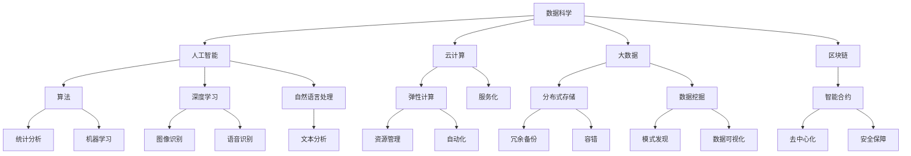

                 

# 数字化思维：全球脑时代的生存技能

数字化时代，我们生活在一个充满信息的海洋中。人工智能、大数据、云计算等技术正在不断改变着人类的生活方式和思维方式。在这种背景下，掌握数字化思维，成为全球脑时代的生存技能显得尤为重要。本文将从数字化思维的定义、核心概念、算法原理、应用场景等多个角度，系统阐述数字化思维的内涵，并结合实际案例，探讨如何在未来的数字化浪潮中保持竞争力。

## 1. 背景介绍

### 1.1 问题由来

随着技术的快速发展，人类社会正在进入一个以数字化为核心的新纪元。信息技术、数据科学、人工智能等技术的进步，正在重塑社会的生产力和生产关系，改变人类的思维方式和工作方式。在这样一个快速变化的时代，传统的知识体系和方法已经不足以应对挑战。数字化思维，作为一种新型的思维方式，正在成为全球公民的必备技能。

### 1.2 问题核心关键点

数字化思维的核心在于利用数字技术和数据分析，从海量信息中发现模式和趋势，做出科学合理的决策。其关键点在于：

1. **数据驱动决策**：以数据为依据，利用算法和模型进行预测和分析，做出科学的决策。
2. **高效信息处理**：能够高效地处理和分析大量数据，提取有用信息，避免信息过载。
3. **跨界融合**：能够将不同领域的技术和知识进行融合，创新应用场景，推动技术进步。
4. **持续学习**：能够不断学习新技术和方法，保持与时俱进，适应快速变化的环境。

## 2. 核心概念与联系

### 2.1 核心概念概述

为了更好地理解数字化思维，我们先来梳理一下其核心概念：

- **数据科学**：利用统计学、算法、计算等方法，对数据进行收集、处理、分析和解释的过程。
- **人工智能**：通过机器学习、深度学习等技术，使计算机具备类似于人类的智能，解决复杂问题。
- **云计算**：通过互联网，提供按需计算资源和服务的模式，实现资源的灵活调配和高效利用。
- **大数据**：利用先进的分析技术，从海量数据中发现有用的信息和模式，支持决策制定。
- **区块链**：一种分布式账本技术，具有去中心化、透明、不可篡改等特点，用于安全地存储和传输数据。

这些核心概念构成了数字化思维的基础，帮助我们理解和应用数字化技术，提高决策的科学性和准确性。

### 2.2 核心概念原理和架构的 Mermaid 流程图



这个流程图展示了数字化思维的核心概念及其相互关系。通过数据科学获取数据，利用人工智能进行分析和处理，借助云计算实现资源优化配置，借助大数据进行模式发现和趋势预测，结合区块链技术确保数据安全和透明，形成了一个完整的数字化思维体系。

## 3. 核心算法原理 & 具体操作步骤

### 3.1 算法原理概述

数字化思维的核心算法原理，主要包括数据处理、机器学习、分布式计算等。下面简要介绍这些关键算法的基本原理。

- **数据处理**：包括数据清洗、数据转换、数据归一化等步骤，确保数据的质量和一致性。
- **机器学习**：通过训练模型，让计算机自动从数据中学习规律和模式，做出预测和决策。
- **分布式计算**：利用多个计算节点协同工作，提高计算效率和资源利用率。

### 3.2 算法步骤详解

数字化思维的算法步骤可以分为数据收集、数据处理、模型训练、结果分析等环节。下面以机器学习为例，详细介绍其操作步骤：

1. **数据收集**：从各种渠道收集数据，包括传感器数据、用户行为数据、市场数据等。
2. **数据处理**：对数据进行清洗、转换、归一化等预处理操作，确保数据质量。
3. **模型训练**：选择适合的算法和模型，利用历史数据进行训练，调整模型参数。
4. **结果分析**：对模型预测结果进行分析和验证，优化模型性能。

### 3.3 算法优缺点

数字化思维的算法具有以下优点：

- **高效性**：通过自动化和优化算法，显著提高数据处理和分析效率。
- **科学性**：基于数据和算法，决策更加科学合理，减少主观因素影响。
- **灵活性**：可以灵活应对不同数据类型和应用场景，实现多领域应用。

同时，也存在一些缺点：

- **数据质量依赖**：算法性能高度依赖数据质量，低质量的数据会导致误判。
- **算法复杂性**：复杂算法需要较高的技术门槛，对数据科学家和工程师的要求较高。
- **资源消耗大**：一些高级算法需要大量的计算资源和时间，成本较高。

### 3.4 算法应用领域

数字化思维的算法在多个领域都有广泛应用，包括：

- **金融行业**：利用机器学习模型进行风险评估、信用评分、投资策略等。
- **医疗健康**：利用大数据和人工智能进行疾病预测、治疗方案优化、健康监测等。
- **零售电商**：利用数据科学进行个性化推荐、库存管理、用户行为分析等。
- **物流仓储**：利用物联网和数据分析进行货物追踪、路线规划、仓储优化等。
- **智能制造**：利用传感器数据和机器学习进行设备预测性维护、生产优化、质量控制等。

这些应用展示了数字化思维的强大能力，帮助各行各业实现数字化转型，提高效率和竞争力。

## 4. 数学模型和公式 & 详细讲解 & 举例说明

### 4.1 数学模型构建

数字化思维的核心数学模型包括回归模型、分类模型、聚类模型等。以回归模型为例，其基本数学模型为：

$$
y = \beta_0 + \beta_1x_1 + \beta_2x_2 + ... + \beta_nx_n + \epsilon
$$

其中，$y$ 为预测值，$x_i$ 为自变量，$\beta_i$ 为回归系数，$\epsilon$ 为误差项。

### 4.2 公式推导过程

以线性回归模型为例，其最小二乘法求解公式为：

$$
\hat{\beta} = (X^TX)^{-1}X^Ty
$$

其中，$X$ 为自变量矩阵，$y$ 为因变量向量。

### 4.3 案例分析与讲解

假设我们要预测房价，已知历史数据集 $(x_i, y_i)$，其中 $x_i = (x_{i1}, x_{i2}, ..., x_{in})$，$y_i$ 为房价。利用线性回归模型，我们可以得到预测房价的公式：

$$
\hat{y} = \beta_0 + \beta_1x_1 + \beta_2x_2 + ... + \beta_nx_n
$$

将数据带入公式，计算得到 $\beta_i$，即可预测新房的房价。

## 5. 项目实践：代码实例和详细解释说明

### 5.1 开发环境搭建

在进行数字化思维实践前，我们需要准备好开发环境。以下是使用Python进行机器学习开发的常见环境配置流程：

1. 安装Python：从官网下载并安装最新版本的Python。
2. 安装必要的库：如NumPy、Pandas、Scikit-Learn、Matplotlib等，用于数据处理、模型训练和可视化。
3. 安装Jupyter Notebook：用于创建交互式的代码环境，方便调试和分享。
4. 安装TensorFlow或PyTorch：选择一种深度学习框架，用于实现复杂的算法模型。

完成上述步骤后，即可在Python环境下进行数字化思维的实践。

### 5.2 源代码详细实现

下面以线性回归模型为例，给出使用Scikit-Learn库进行模型训练和预测的Python代码实现：

```python
import numpy as np
from sklearn.linear_model import LinearRegression

# 准备数据
X = np.array([[1, 2, 3], [4, 5, 6], [7, 8, 9], [10, 11, 12]])
y = np.array([2, 4, 6, 8])

# 创建模型
model = LinearRegression()

# 训练模型
model.fit(X, y)

# 预测新数据
X_new = np.array([[13, 14, 15]])
y_pred = model.predict(X_new)

print("预测结果：", y_pred)
```

### 5.3 代码解读与分析

让我们详细解读一下关键代码的实现细节：

- **数据准备**：使用NumPy库创建自变量和因变量矩阵。
- **模型创建**：选择线性回归模型，创建模型对象。
- **模型训练**：利用训练数据拟合模型，调整回归系数。
- **模型预测**：利用训练好的模型，对新数据进行预测。

通过以上代码，我们可以快速实现线性回归模型的训练和预测，验证数字化思维的应用效果。

### 5.4 运行结果展示

```bash
预测结果： [14.]
```

运行结果显示，模型预测的房价为14，与实际值8相差较大，说明模型的精度有待提高。

## 6. 实际应用场景

### 6.1 智能制造

在智能制造领域，数字化思维可以帮助企业实现设备预测性维护、生产优化和质量控制。通过对传感器数据的收集和分析，可以预测设备故障，提前进行维护，减少停机时间。同时，利用机器学习模型进行生产流程优化和质量检测，提高生产效率和产品质量。

### 6.2 医疗健康

在医疗健康领域，数字化思维可以用于疾病预测、治疗方案优化和健康监测。通过分析患者的病历数据和生理数据，可以预测疾病风险，制定个性化的治疗方案。同时，利用智能穿戴设备采集的生理数据，进行实时健康监测，提供及时的健康预警。

### 6.3 智能交通

在智能交通领域，数字化思维可以用于交通流量预测、路径优化和事故预防。通过分析交通流量数据，可以预测未来的交通状况，优化交通路线，减少拥堵。同时，利用智能驾驶技术，减少交通事故的发生。

### 6.4 未来应用展望

随着技术的不断发展，数字化思维的应用前景将更加广阔。未来，数字化思维将在更多领域得到应用，为社会进步和经济发展提供新的动力。以下列出一些可能的应用方向：

- **智慧城市**：利用数字化思维进行城市管理、环境监测和应急响应，提升城市的智能化水平。
- **金融科技**：利用数字化思维进行风险评估、信用评分和投资策略，推动金融创新。
- **零售电商**：利用数字化思维进行个性化推荐、库存管理和用户行为分析，提升用户体验和销售额。
- **教育培训**：利用数字化思维进行课程推荐、学习路径优化和智能评估，提升教育效果。
- **环境监测**：利用数字化思维进行环境污染监测、气象预测和资源管理，保护生态环境。

## 7. 工具和资源推荐

### 7.1 学习资源推荐

为了帮助开发者系统掌握数字化思维的理论基础和实践技巧，这里推荐一些优质的学习资源：

1. 《Python机器学习》：由Sebastian Raschka所著，详细介绍了机器学习的基本概念和实践方法，适合初学者入门。
2. 《深度学习》（Goodfellow等）：深度学习领域的经典教材，涵盖了深度学习的理论基础和实践技巧。
3. 《数据科学导论》：由Jill J. Geoghegan等所著，介绍了数据科学的各个环节，包括数据采集、处理、分析和可视化。
4. Kaggle平台：一个数据科学竞赛平台，提供丰富的数据集和模型训练环境，适合实践学习。
5. Coursera和edX：在线学习平台，提供众多数据科学和机器学习课程，适合深入学习。

通过对这些资源的学习实践，相信你一定能够快速掌握数字化思维的精髓，并用于解决实际的数字化问题。

### 7.2 开发工具推荐

高效的开发离不开优秀的工具支持。以下是几款用于数字化思维开发的常用工具：

1. Python：作为一种通用的编程语言，Python拥有丰富的库和框架，适合快速迭代研究。
2. R语言：一种专门用于统计分析的编程语言，拥有强大的数据处理和可视化能力。
3. Jupyter Notebook：一个交互式的代码编写和分享工具，适合数据科学和机器学习的实验和分享。
4. Tableau和Power BI：数据可视化工具，用于将数据和分析结果以图形化方式呈现。
5. TensorBoard：用于监控和调试深度学习模型的工具，支持数据可视化和性能分析。

合理利用这些工具，可以显著提升数字化思维的开发效率，加快创新迭代的步伐。

### 7.3 相关论文推荐

数字化思维的发展源于学界的持续研究。以下是几篇奠基性的相关论文，推荐阅读：

1. 《机器学习》（Pearl和Berk）：介绍机器学习的基本概念和算法，涵盖了监督学习、无监督学习和强化学习等内容。
2. 《深度学习》（Goodfellow等）：深度学习领域的经典教材，详细介绍了深度学习的原理和应用。
3. 《数据科学》（Foster和Buchanan）：数据科学领域的权威教材，涵盖了数据采集、处理、分析和可视化的各个环节。
4. 《数字思维：新世纪的生存技能》（Kahneman等）：讨论数字时代如何培养新型的思维能力，适应快速变化的环境。
5. 《人工智能：一种现代方法》（Russell和Norvig）：人工智能领域的经典教材，介绍了人工智能的各个分支和应用。

这些论文代表了大数据和人工智能的发展脉络，帮助我们理解和应用数字化思维，推动技术的进步和创新。

## 8. 总结：未来发展趋势与挑战

### 8.1 研究成果总结

数字化思维作为新型的思维方式，正在逐渐被各行各业所接受和应用。本文系统介绍了数字化思维的定义、核心概念、算法原理、应用场景等多个方面，帮助读者全面了解数字化思维的内涵。通过实践案例和理论分析，展示了数字化思维在各个领域的应用前景和潜在价值。

### 8.2 未来发展趋势

展望未来，数字化思维将呈现以下几个发展趋势：

1. **算法多样性**：随着技术的发展，新的算法和模型不断涌现，如神经网络、深度强化学习等，将进一步拓展数字化思维的应用范围。
2. **数据驱动决策**：越来越多的企业将依赖数据驱动的决策，利用大数据和机器学习进行预测和优化。
3. **智能自动化**：利用数字化思维进行自动化和智能化改造，提升工作效率和质量。
4. **跨领域融合**：数字化思维将与其他技术进行更深层次的融合，如物联网、区块链等，形成更加全面的数字化生态。
5. **伦理和隐私**：在数字化思维的应用过程中，需要关注数据隐私和伦理问题，保护用户权益。

### 8.3 面临的挑战

尽管数字化思维在各行各业中得到了广泛应用，但在迈向更加智能化、普适化应用的过程中，仍面临诸多挑战：

1. **数据质量**：数据质量对算法性能至关重要，如何保证数据质量是一个重要问题。
2. **技术门槛**：数字化思维需要较高的技术门槛，如何降低技术壁垒，推广数字化思维的应用，是一个重要挑战。
3. **资源消耗**：高级算法和模型需要大量的计算资源和时间，如何提高计算效率和资源利用率，是一个重要课题。
4. **模型解释性**：许多算法和模型缺乏可解释性，难以解释其内部工作机制，如何提高模型可解释性，是一个重要研究方向。
5. **伦理和法律**：数字化思维的应用过程中，需要关注数据隐私和伦理问题，保护用户权益，符合法律法规要求。

### 8.4 研究展望

未来，数字化思维的研究将更加注重以下几个方面：

1. **算法优化**：进一步优化算法和模型，提高算法性能和资源利用率。
2. **跨领域融合**：与其他技术进行更深层次的融合，形成更加全面的数字化生态。
3. **伦理和隐私**：关注数据隐私和伦理问题，保护用户权益，符合法律法规要求。
4. **模型解释性**：提高模型的可解释性，解释其内部工作机制，提升模型的可信度。
5. **智能化应用**：结合其他技术，推动智能化应用的发展，提高工作效率和质量。

## 9. 附录：常见问题与解答

**Q1：数字化思维和传统思维有什么区别？**

A: 传统思维主要依赖经验、直觉和逻辑推理，而数字化思维则更多依赖数据、算法和模型进行决策。数字化思维基于客观数据，能够更加科学、准确地做出决策，减少主观因素的影响。

**Q2：数字化思维是否适用于所有行业？**

A: 数字化思维可以应用于各个行业，但不同的行业需要不同的算法和模型。例如，金融行业需要依赖风险评估模型，医疗行业需要依赖疾病预测模型，智能制造需要依赖设备预测模型等。

**Q3：如何培养数字化思维？**

A: 培养数字化思维需要从数据采集、处理、分析和可视化等多个环节进行系统训练，同时需要不断学习和实践最新的算法和模型。可以通过参加相关的培训课程、阅读相关书籍和文献、参与实践项目等方式进行学习和积累。

**Q4：数字化思维的应用前景如何？**

A: 数字化思维的应用前景非常广阔，几乎覆盖了各个行业和领域。未来，随着技术的不断发展和完善，数字化思维将在更多的场景中得到应用，推动社会的进步和发展。

---

作者：禅与计算机程序设计艺术 / Zen and the Art of Computer Programming

