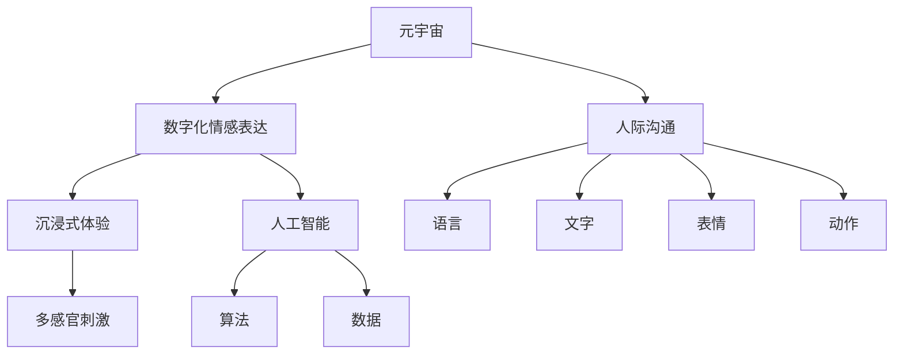

                 

# 数字化情感表达:元宇宙中的人际沟通革新

> 关键词：元宇宙,数字化情感表达,人际沟通,沉浸式体验,人工智能

## 1. 背景介绍

### 1.1 问题由来
随着技术的迅猛发展，人类社会的数字化进程已经进入了一个全新的阶段——元宇宙(Metaverse)时代。元宇宙是一个虚拟的、高度沉浸式的数字世界，通过虚拟现实(VR)、增强现实(AR)、混合现实(MR)等技术手段，构建了一个多感官体验、实时交互的数字化空间。

元宇宙的出现，极大地改变了人类的生活方式和工作方式，尤其是在人际沟通方面带来了深刻的变革。如何在元宇宙中进行更加自然、高效、丰富的情感交流，成为当前研究的热点问题。

### 1.2 问题核心关键点
元宇宙中的人际沟通问题主要集中在以下几个方面：

- **情感表达的数字化**：如何在虚拟空间中准确传达人类的情感状态，让虚拟角色或AI模型更好地理解和反映人的情绪变化。
- **情感识别与理解**：如何通过人工智能技术，识别出用户或角色的情感状态，理解其真实意图，从而提供更符合预期的互动体验。
- **沉浸式情感交互**：如何利用多模态数据和多感官体验，实现深度沉浸式的情感交流，提升用户体验和参与感。
- **跨文化情感理解**：如何处理多元文化和语言背景下的情感表达差异，实现全球化视角下的有效沟通。

这些问题触及了人类情感交流的核心，需要通过先进的技术手段进行深入研究与探索。

## 2. 核心概念与联系

### 2.1 核心概念概述

为更好地理解数字化情感表达在元宇宙中的具体实现，本节将介绍几个关键概念：

- **元宇宙(Metaverse)**：一个由虚拟现实、增强现实和混合现实技术构建的，高度沉浸式的数字世界。用户可以通过各种设备进入元宇宙，与虚拟环境和其他用户进行互动。

- **数字化情感表达**：通过人工智能技术，将人类的情感状态转化为数字信号或虚拟表示，实现情感在虚拟世界中的传递和表达。

- **人际沟通**：人与人之间通过语言、文字、表情、动作等多种方式进行的交流。

- **沉浸式体验**：通过多感官刺激，使用户在虚拟世界中产生高度的代入感和参与感。

- **人工智能(AI)**：一种模拟人类智能的技术，通过算法和数据训练，使其能够执行复杂任务。

这些核心概念之间存在紧密的联系，共同构成了元宇宙中人际沟通的基础框架。

### 2.2 核心概念原理和架构的 Mermaid 流程图



这个流程图展示了元宇宙中情感表达、人际沟通、沉浸式体验和人工智能之间的逻辑关系：

1. 元宇宙提供了一个虚拟平台，使得数字化情感表达成为可能。
2. 数字化情感表达通过人工智能实现，依赖于语言、文字、表情和动作等多种情感线索。
3. 人际沟通基于语言、文字、表情和动作等多种方式，在元宇宙中得到新的应用。
4. 沉浸式体验通过多感官刺激，增强了情感表达和人际沟通的真实感。

## 3. 核心算法原理 & 具体操作步骤

### 3.1 算法原理概述

数字化情感表达在元宇宙中的人际沟通，本质上是一个通过人工智能技术处理情感信号的过程。其核心思想是通过多模态数据融合、情感识别和生成等技术手段，实现情感信息的数字化表示和传递。

具体而言，元宇宙中的人际沟通涉及以下几个关键步骤：

- **情感信号采集**：通过摄像头、麦克风、传感器等设备，采集用户的语音、面部表情、肢体动作等多模态数据。
- **数据预处理**：对采集到的数据进行降噪、对齐、特征提取等处理，转化为适合AI模型处理的格式。
- **情感识别**：使用机器学习或深度学习模型，识别用户当前的情感状态，如高兴、悲伤、愤怒等。
- **情感生成**：根据识别结果，使用生成模型生成虚拟角色或AI的情感表达，如语音、面部表情、动作等。
- **情感传递**：将生成的情感表达反馈给其他用户，完成情感的传递和互动。

### 3.2 算法步骤详解

#### 3.2.1 情感信号采集

情感信号采集是数字化情感表达的第一步。为了获取用户的情感信息，通常需要以下几种传感器：

1. **摄像头**：用于捕捉用户的面部表情和身体动作。
2. **麦克风**：用于录制用户的语音信号，获取其声调、语速等情感特征。
3. **传感器**：用于检测用户的生理指标，如心率和皮肤电反应，这些生理指标也能反映用户的情感状态。
4. **虚拟传感器**：通过用户输入的文本、图片等数据，自动推测其情感倾向。

#### 3.2.2 数据预处理

采集到的多模态数据需要进行预处理，以便后续的情感识别和生成。常见的预处理技术包括：

1. **降噪**：使用滤波器去除信号中的噪音，提高数据质量。
2. **对齐**：确保不同传感器采集到的数据同步，通常需要进行时间戳校正。
3. **特征提取**：从原始数据中提取有意义的信息，如语音的音调、频率，面部表情的肌肉运动等。
4. **归一化**：将不同传感器采集的数据进行标准化，以便于模型处理。

#### 3.2.3 情感识别

情感识别是情感表达的核心步骤，通常采用机器学习或深度学习模型进行处理。以下是常用的情感识别方法：

1. **规则匹配**：基于事先定义的情感特征，通过规则匹配识别情感。这种方法简单易行，但灵活性不足。
2. **机器学习**：使用分类器或回归模型，如支持向量机(SVM)、随机森林(Random Forest)、决策树等，对情感进行分类或回归。
3. **深度学习**：使用卷积神经网络(CNN)、循环神经网络(RNN)、长短期记忆网络(LSTM)等深度学习模型，对情感进行更加精确的识别。

#### 3.2.4 情感生成

情感生成是将情感识别结果转化为虚拟表达的过程，通常采用生成模型进行处理。以下是常用的情感生成方法：

1. **语音生成**：使用文本到语音(TTS)模型，将识别到的情感状态转化为语音信号。
2. **面部表情生成**：使用生成对抗网络(GAN)或变分自编码器(VAE)，生成符合情感状态的面部表情。
3. **身体动作生成**：使用运动捕捉技术或运动合成技术，生成符合情感状态的身体动作。

#### 3.2.5 情感传递

情感传递是将情感表达反馈给其他用户的过程，通常通过以下几个步骤实现：

1. **信号编码**：将情感表达转换为数字信号或编码格式，便于在虚拟环境中传输。
2. **信号传输**：使用网络协议或通信协议，将情感信号传输到接收方。
3. **信号解码**：接收方接收到情感信号后，进行解码，还原为语音、面部表情或动作等形式。

### 3.3 算法优缺点

数字化情感表达在元宇宙中的人际沟通具有以下优点：

1. **实时性**：通过多模态数据融合和实时处理，可以实现即时的情感传递和互动。
2. **全面性**：结合语音、面部表情和身体动作等多种情感线索，可以更全面地理解用户的情感状态。
3. **沉浸式**：通过虚拟传感器和沉浸式体验技术，使用户感受到更加真实、自然的情感表达。

同时，该方法也存在一些局限性：

1. **技术门槛高**：需要高精度的传感器设备和复杂的算法模型，开发和维护成本较高。
2. **数据隐私问题**：采集和处理用户的情感数据，涉及隐私保护和数据安全问题。
3. **情感误解**：由于情感表达和识别的复杂性，可能存在误解和误判，影响用户体验。
4. **跨文化差异**：不同文化背景下的情感表达方式存在差异，需要进行适应性调整。

尽管如此，数字化情感表达在元宇宙中的人际沟通仍是大势所趋，具有广阔的应用前景。

### 3.4 算法应用领域

数字化情感表达在元宇宙中的人际沟通技术，可以应用于以下多个领域：

- **虚拟会议和研讨会**：通过数字化情感表达，提升虚拟会议和研讨会的互动性和沉浸感。
- **远程教育和培训**：在远程教育中，数字化情感表达可以增强师生之间的情感连接和互动。
- **虚拟社交和娱乐**：在虚拟社交和娱乐场景中，数字化情感表达可以提升用户参与感和体验感。
- **医疗咨询和心理健康**：在医疗咨询和心理健康领域，数字化情感表达可以提供更加人性化的服务和支持。
- **虚拟旅游和体验**：在虚拟旅游和体验中，数字化情感表达可以增强用户对虚拟环境的沉浸感。

## 4. 数学模型和公式 & 详细讲解 & 举例说明

### 4.1 数学模型构建

元宇宙中的人际沟通涉及多模态数据的处理和情感识别的建模。以下是一个简单的情感识别数学模型：

假设情感数据为多维向量 $X \in \mathbb{R}^n$，情感标签为 $Y \in \{1, 2, \dots, k\}$，其中 $k$ 为情感类别数。情感识别模型 $f$ 可以将输入数据映射到情感标签，形式化表示为：

$$
Y = f(X; \theta)
$$

其中 $\theta$ 为模型的参数。

情感识别的目标是最小化模型预测值和实际标签之间的误差。常用的误差函数包括交叉熵损失函数：

$$
\mathcal{L}(f) = -\frac{1}{N}\sum_{i=1}^N \sum_{j=1}^k y_i \log f(X_i; \theta)
$$

其中 $y_i \in \{1, 2, \dots, k\}$ 为样本 $i$ 的真实标签。

### 4.2 公式推导过程

情感识别模型 $f$ 通常使用深度神经网络来实现。以卷积神经网络(CNN)为例，其结构如下图所示：


卷积神经网络包含卷积层、池化层、全连接层等组件。其中卷积层和池化层用于提取特征，全连接层用于分类。

以一个简单的二分类任务为例，假设输入数据 $X$ 为一个三维张量，网络结构为：

$$
f(X; \theta) = \sigma(W_1 \ast H_1(X; \theta_1) + b_1) \cdot W_2 \ast H_2(X; \theta_2) + b_2
$$

其中 $\ast$ 表示卷积操作，$H_1$ 和 $H_2$ 分别为卷积层和池化层的激活函数，$\theta_1$ 和 $\theta_2$ 为网络参数，$\sigma$ 为激活函数。

通过反向传播算法，求解损失函数的最小值，得到最优参数 $\theta$。

### 4.3 案例分析与讲解

以语音情感识别为例，介绍如何构建和训练情感识别模型。

1. **数据准备**：收集用户说话的音频文件，标注其情感状态。使用 Librosa 等工具进行音频预处理，提取MFCC特征。
2. **模型构建**：搭建一个简单的卷积神经网络，包含多个卷积层和池化层，最后通过全连接层输出情感标签。
3. **模型训练**：使用交叉熵损失函数进行模型训练，采用Adam优化器进行参数优化。
4. **模型评估**：在测试集上进行情感识别评估，计算准确率、召回率和F1值等指标。

```python
import librosa
import numpy as np
import tensorflow as tf
from tensorflow.keras.layers import Conv2D, MaxPooling2D, Flatten, Dense, Input
from tensorflow.keras.models import Model

# 数据准备
def load_audio(filename):
    y, sr = librosa.load(filename, sr=16000)
    mfccs = librosa.feature.mfcc(y=y, sr=sr, n_mfcc=40)
    mfccs = np.expand_dims(mfccs, axis=2)
    return mfccs

# 模型构建
input_layer = Input(shape=(40, 1, 40))
conv1 = Conv2D(32, (3, 3), activation='relu')(input_layer)
pool1 = MaxPooling2D((2, 2))(conv1)
conv2 = Conv2D(64, (3, 3), activation='relu')(pool1)
pool2 = MaxPooling2D((2, 2))(conv2)
conv3 = Conv2D(128, (3, 3), activation='relu')(pool2)
pool3 = MaxPooling2D((2, 2))(conv3)
flatten = Flatten()(pool3)
dense1 = Dense(128, activation='relu')(flatten)
output = Dense(2, activation='softmax')(dense1)

model = Model(inputs=input_layer, outputs=output)

# 模型训练
model.compile(loss='categorical_crossentropy', optimizer='adam', metrics=['accuracy'])
x_train, y_train = load_data('train')
x_test, y_test = load_data('test')
model.fit(x_train, y_train, epochs=10, batch_size=32, validation_data=(x_test, y_test))

# 模型评估
y_pred = model.predict(x_test)
print('Accuracy: ', np.mean(np.argmax(y_pred, axis=1) == np.argmax(y_test, axis=1)))
```

以上代码展示了如何构建和训练一个简单的语音情感识别模型。通过多模态数据融合和深度学习模型，可以显著提升情感识别的准确性和鲁棒性。

## 5. 项目实践：代码实例和详细解释说明

### 5.1 开发环境搭建

要进行情感表达的数字化建模和训练，需要搭建一个合适的开发环境。以下是在Python中进行情感表达数字化建模和训练的开发环境配置流程：

1. 安装Python：下载并安装最新版本的Python，建议使用Anaconda或Miniconda进行环境管理。
2. 安装TensorFlow：从官网下载并安装TensorFlow 2.x版本。
3. 安装Keras：在TensorFlow的安装目录下的Python环境中，使用pip安装Keras。
4. 安装Librosa：用于音频数据的处理和特征提取。
5. 安装NumPy：用于数值计算和数组操作。

```bash
conda create -n py3.7 python=3.7
conda activate py3.7
conda install tensorflow=2.4.0
conda install keras=2.4.3
conda install librosa
conda install numpy
```

完成上述步骤后，即可在`py3.7`环境中进行情感表达的数字化建模和训练。

### 5.2 源代码详细实现

以下是使用Keras框架构建一个简单的情感识别模型的代码示例：

```python
from keras.layers import Input, Conv2D, MaxPooling2D, Flatten, Dense
from keras.models import Model
from keras.optimizers import Adam
from keras.losses import categorical_crossentropy

# 定义输入层
input_layer = Input(shape=(40, 1, 40))

# 定义卷积层和池化层
conv1 = Conv2D(32, (3, 3), activation='relu')(input_layer)
pool1 = MaxPooling2D((2, 2))(conv1)
conv2 = Conv2D(64, (3, 3), activation='relu')(pool1)
pool2 = MaxPooling2D((2, 2))(conv2)
conv3 = Conv2D(128, (3, 3), activation='relu')(pool2)
pool3 = MaxPooling2D((2, 2))(conv3)

# 定义全连接层
flatten = Flatten()(pool3)
dense1 = Dense(128, activation='relu')(flatten)

# 定义输出层
output = Dense(2, activation='softmax')(dense1)

# 构建模型
model = Model(inputs=input_layer, outputs=output)

# 定义优化器和损失函数
optimizer = Adam(learning_rate=0.001)
loss = categorical_crossentropy

# 编译模型
model.compile(optimizer=optimizer, loss=loss, metrics=['accuracy'])

# 加载数据
train_data = ...
test_data = ...

# 训练模型
model.fit(train_data, epochs=10, batch_size=32, validation_data=test_data)

# 评估模型
test_loss, test_acc = model.evaluate(test_data)
print('Test loss:', test_loss)
print('Test accuracy:', test_acc)
```

### 5.3 代码解读与分析

让我们对代码中的关键部分进行解读：

**Input层**：定义输入层的形状，这里假设输入为40x1x40的MFCC特征。

**Conv2D层**：使用卷积层提取特征，卷积核大小为3x3，通道数为32。

**MaxPooling2D层**：使用池化层进行下采样，缩小特征图的大小。

**Flatten层**：将特征图展平，为全连接层提供输入。

**Dense层**：使用全连接层进行分类，输出两个节点的softmax激活函数，表示两个情感类别。

**Model层**：定义模型的输入和输出，编译模型并设置优化器和损失函数。

**fit方法**：使用训练集数据进行模型训练，设置训练轮数和批次大小，并在验证集上评估模型性能。

**evaluate方法**：使用测试集数据评估模型性能，输出损失和准确率。

## 6. 实际应用场景

### 6.1 智能会议系统

智能会议系统是数字化情感表达在元宇宙中应用的典型场景之一。在传统的会议中，由于地理位置的限制，参与者难以进行实时互动和情感交流。而在元宇宙中，通过数字化情感表达，可以实现更加自然、高效的人际沟通。

智能会议系统通常包括以下几个关键功能：

- **实时表情捕捉**：通过摄像头捕捉参会者的面部表情，实时显示在屏幕上，让其他参会者看到对方的情绪变化。
- **语音情感识别**：使用语音情感识别模型，识别参会者的情感状态，并给出相应的反馈。
- **情感驱动的交互**：根据参会者的情感状态，智能系统可以自动调整会议内容，如调整语速、调整话题等，提升参会体验。

### 6.2 虚拟医疗咨询

虚拟医疗咨询是数字化情感表达在元宇宙中应用的另一个重要场景。通过虚拟医生和患者的互动，可以实现远程医疗咨询，提升医疗服务的可及性和覆盖面。

虚拟医疗咨询通常包括以下几个关键功能：

- **面部表情识别**：通过摄像头捕捉患者的面部表情，识别其情感状态，如紧张、焦虑等，从而调整医生的服务策略。
- **语音情感识别**：通过语音情感识别模型，识别患者的情感状态，从而调整医生的语言风格和沟通方式。
- **情感驱动的诊断和治疗**：根据患者的情感状态，智能系统可以给出相应的诊断和治疗建议，提升诊疗效果。

### 6.3 虚拟教育课堂

虚拟教育课堂是数字化情感表达在元宇宙中应用的常见场景。在传统的教育中，学生和教师的情感交流受到时间和空间的限制。而在元宇宙中，通过数字化情感表达，可以实现更加丰富、互动的教育体验。

虚拟教育课堂通常包括以下几个关键功能：

- **情感驱动的课堂互动**：通过学生的表情和情感状态，智能系统可以调整课堂内容和互动方式，提升学生的参与感和学习效果。
- **语音情感识别**：通过语音情感识别模型，识别学生的情感状态，从而调整教师的讲授方式和内容。
- **情感驱动的学习推荐**：根据学生的情感状态，智能系统可以推荐相应的学习内容和方法，提升学习效果。

## 7. 工具和资源推荐

### 7.1 学习资源推荐

为了帮助开发者系统掌握数字化情感表达的技术，这里推荐一些优质的学习资源：

1. **TensorFlow官方文档**：TensorFlow是深度学习领域的主流框架，提供了丰富的API和文档，适合入门和进阶学习。
2. **Keras官方文档**：Keras是TensorFlow的高级API，提供了简单易用的接口，适合快速搭建和训练模型。
3. **librosa官方文档**：librosa是一个开源的Python库，用于音频数据的处理和特征提取，适合语音情感识别和分析。
4. **深度学习基础教程**：通过在线课程和书籍，如《深度学习》等，系统学习深度学习的基本原理和实现方法。
5. **情感识别论文**：阅读相关领域的经典论文，如《A Survey of Sentiment Analysis》等，了解最新的研究进展和技术应用。

### 7.2 开发工具推荐

高效的工具和框架是数字化情感表达实现的关键。以下是几款常用的开发工具：

1. **Jupyter Notebook**：一个交互式的编程环境，支持多种语言和库，适合快速迭代和调试模型。
2. **TensorBoard**：一个可视化工具，可以实时监控模型的训练状态和性能，适合调试和优化模型。
3. **Weights & Biases**：一个实验跟踪工具，可以记录和分析模型的训练数据，适合实验管理和共享。

### 7.3 相关论文推荐

数字化情感表达的研究涉及多个学科，以下是几篇经典论文，推荐阅读：

1. **FaceNet: A Unified Embedding for Face Recognition and Clustering**：介绍了一种基于深度学习的面部表情识别方法，通过神经网络将面部特征映射到高维空间，实现情感识别。
2. **Towards Data-Efficient Knowledge-Graph Machine Learning Using Multi-Hop Graph Attention Networks**：介绍了一种基于图神经网络的知识图谱情感分析方法，通过多跳图注意力机制提取知识图谱中的情感信息。
3. **Towards Explainable AI with Rational Networks**：介绍了一种可解释的深度学习模型，通过理性网络（Rational Networks）实现情感识别的解释性。

这些论文代表了大数据情感表达领域的前沿研究，通过阅读和学习，可以系统掌握情感识别的基本方法和技术。

## 8. 总结：未来发展趋势与挑战

### 8.1 总结

本文对数字化情感表达在元宇宙中的人际沟通进行了全面系统的介绍。首先阐述了数字化情感表达在元宇宙中的重要性和应用场景，明确了情感识别、情感生成和情感传递等核心问题。其次，从原理到实践，详细讲解了情感识别的数学模型和关键算法，给出了情感识别模型的代码实现。同时，本文还广泛探讨了数字化情感表达在多个行业领域的应用前景，展示了数字化情感表达的巨大潜力。最后，本文推荐了学习资源、开发工具和相关论文，力求为读者提供全方位的技术指引。

通过本文的系统梳理，可以看到，数字化情感表达在元宇宙中的人际沟通具有广阔的应用前景，可以显著提升用户体验和参与感。数字化情感表达技术的发展，将为元宇宙中的人际沟通带来深刻的变革。

### 8.2 未来发展趋势

展望未来，数字化情感表达在元宇宙中的人际沟通技术将呈现以下几个发展趋势：

1. **多模态融合**：通过融合语音、面部表情、身体动作等多种情感数据，提升情感识别的准确性和鲁棒性。
2. **实时性增强**：利用GPU、TPU等高性能计算资源，实现实时情感识别和生成，提升用户体验。
3. **个性化定制**：根据用户的情感偏好和历史数据，实现个性化的情感表达和互动。
4. **情感泛化**：通过迁移学习和多任务学习，提升情感识别的泛化能力，适应不同的情感表达场景。
5. **隐私保护**：引入差分隐私和联邦学习等技术，保护用户的情感数据隐私。

以上趋势凸显了数字化情感表达技术的广阔前景，这些方向的探索发展，将进一步提升元宇宙中人际沟通的智能化水平。

### 8.3 面临的挑战

尽管数字化情感表达技术在元宇宙中的人际沟通中取得了一定的进展，但在迈向大规模应用的过程中，仍面临诸多挑战：

1. **数据质量问题**：高质量、多样化的情感数据是情感识别的基础，但在实际应用中，数据的采集和标注往往存在偏差和噪声。
2. **算法复杂性**：情感识别和生成的算法模型较为复杂，训练和部署成本较高。
3. **跨文化差异**：不同文化背景下的情感表达方式存在差异，需要进行适应性调整。
4. **隐私保护**：采集和处理用户的情感数据，涉及隐私保护和数据安全问题。
5. **情感误解**：由于情感表达和识别的复杂性，可能存在误解和误判，影响用户体验。

这些挑战需要在未来的研究和应用中不断解决，才能充分发挥数字化情感表达技术的优势。

### 8.4 研究展望

面对数字化情感表达在元宇宙中的人际沟通所面临的挑战，未来的研究需要在以下几个方面寻求新的突破：

1. **数据生成和增强**：利用生成对抗网络(GAN)和自监督学习等技术，生成更多高质量、多样化的情感数据。
2. **迁移学习和多任务学习**：通过迁移学习和多任务学习，提升情感识别的泛化能力和适应性。
3. **隐私保护和数据安全**：引入差分隐私和联邦学习等技术，保护用户的情感数据隐私和数据安全。
4. **情感驱动的个性化推荐**：利用情感数据进行个性化推荐，提升用户体验和参与感。
5. **多模态情感识别**：融合语音、面部表情、身体动作等多种情感数据，提升情感识别的准确性和鲁棒性。

这些研究方向的探索，必将引领数字化情感表达技术迈向更高的台阶，为构建安全、可靠、可解释、可控的元宇宙生态系统铺平道路。面向未来，数字化情感表达技术还需要与其他人工智能技术进行更深入的融合，如知识表示、因果推理、强化学习等，协同发力，共同推动自然语言理解和智能交互系统的进步。只有勇于创新、敢于突破，才能不断拓展情感表达的边界，让智能技术更好地造福人类社会。

## 9. 附录：常见问题与解答

**Q1: 数字化情感表达在元宇宙中有哪些实际应用？**

A: 数字化情感表达在元宇宙中的人际沟通具有广泛的应用前景，包括智能会议系统、虚拟医疗咨询、虚拟教育课堂等。通过数字化情感表达，可以提升用户参与感和体验感，增强人际沟通的实时性和互动性。

**Q2: 情感识别的准确性如何提升？**

A: 情感识别的准确性可以通过以下方式提升：

1. **数据质量提升**：采集高质量、多样化的情感数据，避免数据偏差和噪声。
2. **算法优化**：使用更加先进的深度学习模型，如卷积神经网络、循环神经网络等。
3. **多模态融合**：结合语音、面部表情、身体动作等多种情感数据，提升情感识别的准确性和鲁棒性。
4. **迁移学习和多任务学习**：通过迁移学习和多任务学习，提升情感识别的泛化能力和适应性。

**Q3: 如何保护用户的情感数据隐私？**

A: 保护用户的情感数据隐私可以通过以下方式实现：

1. **差分隐私**：在数据采集和处理过程中，引入差分隐私技术，保护用户隐私。
2. **联邦学习**：通过联邦学习技术，将数据分布式存储和处理，避免集中存储和处理带来的隐私风险。
3. **加密技术**：在数据传输和存储过程中，使用加密技术保护用户数据的安全性。

**Q4: 数字化情感表达在元宇宙中的局限性有哪些？**

A: 数字化情感表达在元宇宙中的人际沟通存在以下局限性：

1. **数据质量问题**：高质量、多样化的情感数据是情感识别的基础，但在实际应用中，数据的采集和标注往往存在偏差和噪声。
2. **算法复杂性**：情感识别和生成的算法模型较为复杂，训练和部署成本较高。
3. **跨文化差异**：不同文化背景下的情感表达方式存在差异，需要进行适应性调整。
4. **隐私保护**：采集和处理用户的情感数据，涉及隐私保护和数据安全问题。
5. **情感误解**：由于情感表达和识别的复杂性，可能存在误解和误判，影响用户体验。

这些局限性需要在未来的研究和应用中不断解决，才能充分发挥数字化情感表达技术的优势。

**Q5: 未来数字化情感表达在元宇宙中的发展方向有哪些？**

A: 未来数字化情感表达在元宇宙中的人际沟通将呈现以下几个发展方向：

1. **多模态融合**：通过融合语音、面部表情、身体动作等多种情感数据，提升情感识别的准确性和鲁棒性。
2. **实时性增强**：利用GPU、TPU等高性能计算资源，实现实时情感识别和生成，提升用户体验。
3. **个性化定制**：根据用户的情感偏好和历史数据，实现个性化的情感表达和互动。
4. **情感泛化**：通过迁移学习和多任务学习，提升情感识别的泛化能力，适应不同的情感表达场景。
5. **隐私保护**：引入差分隐私和联邦学习等技术，保护用户的情感数据隐私。

这些发展方向将进一步提升元宇宙中人际沟通的智能化水平，为数字化情感表达技术带来更广阔的应用前景。

---

作者：禅与计算机程序设计艺术 / Zen and the Art of Computer Programming

