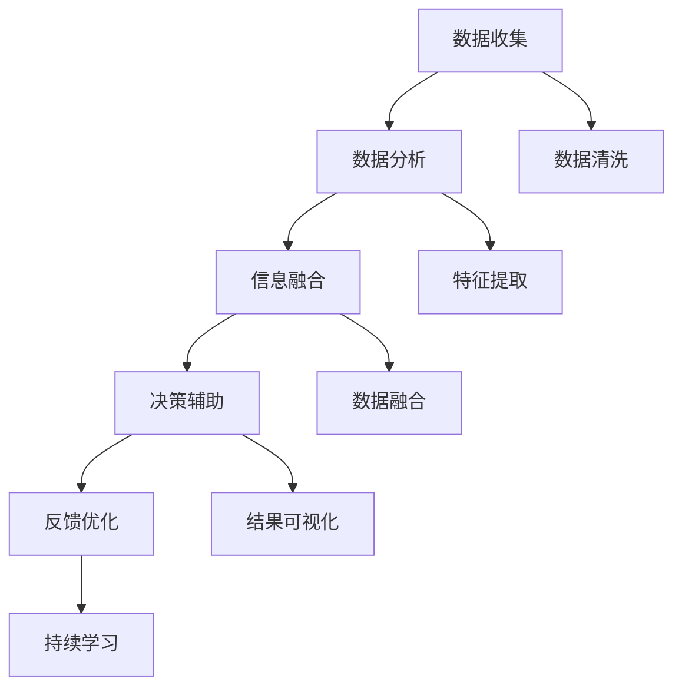

                 

# 数字化第六感：AI辅助的超感知能力

> 关键词：超感知能力, AI辅助, 数据挖掘, 自动化算法, 决策优化, 信息融合, 人机协同

## 1. 背景介绍

### 1.1 问题由来

在信息技术高速发展的今天，人类获取和处理信息的能力面临着前所未有的挑战。随着大数据、云计算、人工智能等技术的不断演进，人们越来越依赖于各种自动化工具来辅助日常工作和决策。然而，过量的数据往往让人难以应对，信息的准确性和有效性更是成为了严峻的问题。

面对这一挑战，AI辅助的超感知能力应运而生。通过将人工智能技术与大数据、云计算等技术深度融合，人们可以借助AI强大的数据分析和处理能力，获得超越传统感官的“数字化第六感”，实现更高效、更智能的信息处理和决策优化。

### 1.2 问题核心关键点

AI辅助的超感知能力，本质上是通过自动化算法对海量数据进行深度分析和融合，辅助人类进行更加精准、高效的决策和判断。具体而言，这一过程包括以下几个关键步骤：

1. **数据收集**：通过物联网、传感器等设备，实时收集各类环境数据，如温度、湿度、空气质量等。
2. **数据分析**：应用AI算法对收集到的数据进行分析处理，发现数据中的模式、趋势和异常。
3. **信息融合**：将不同来源的数据进行融合，形成更加全面、准确的分析结果。
4. **决策辅助**：将分析结果提供给决策者，辅助其进行更科学、更快速的决策。

这一过程的核心在于数据的质量和数量，以及算法的有效性。如何高效地处理海量数据，同时确保分析结果的准确性和实用性，成为了研究的重点。

## 2. 核心概念与联系

### 2.1 核心概念概述

为更好地理解AI辅助超感知能力，本节将介绍几个密切相关的核心概念：

- **超感知能力**：指通过智能手段增强人类获取和理解信息的能力，实现超越传统感官的感知。
- **AI辅助**：指利用人工智能算法和工具，对数据进行自动化分析和处理，辅助人类进行决策。
- **数据挖掘**：指从大规模数据中提取有用信息和知识的过程，包括数据清洗、特征提取、模式识别等步骤。
- **自动化算法**：指通过编程实现的算法，能够自动处理和分析数据，支持大规模、高效率的信息处理。
- **信息融合**：指将来自不同来源的数据进行综合，形成更加全面、准确的分析结果，支持多模态数据的融合处理。
- **决策优化**：指通过数据分析和信息融合，辅助人类进行更科学、更快速的决策，优化决策过程。

这些概念之间存在着紧密的联系，共同构成了AI辅助超感知能力的实现框架。通过理解这些概念，我们可以更好地把握超感知能力的核心工作原理和优化方向。

### 2.2 核心概念原理和架构的 Mermaid 流程图



这个流程图展示了超感知能力的实现过程：

1. **数据收集**：从环境中收集各类数据。
2. **数据分析**：应用自动化算法对数据进行清洗、特征提取和模式识别。
3. **信息融合**：将不同来源的数据进行融合，形成综合分析结果。
4. **决策辅助**：将分析结果辅助决策者进行决策。
5. **反馈优化**：根据反馈结果，持续优化算法和数据处理过程。

这些步骤共同构成了超感知能力的完整实现流程，每个环节都是不可或缺的。

## 3. 核心算法原理 & 具体操作步骤
### 3.1 算法原理概述

AI辅助的超感知能力，其核心算法原理主要包括以下几个方面：

- **数据预处理**：对原始数据进行清洗、去噪、归一化等预处理，保证数据的质量和一致性。
- **特征提取**：从数据中提取有意义的特征，如温度变化、湿度趋势、异常事件等。
- **模式识别**：通过机器学习算法，如分类、聚类、回归等，识别数据中的模式和规律。
- **信息融合**：采用融合算法，如加权平均、深度学习等，将不同来源的信息进行综合，形成更加全面、准确的分析结果。
- **决策优化**：应用决策支持系统，将分析结果转换为可操作的信息，辅助决策者进行决策。

### 3.2 算法步骤详解

以下是AI辅助超感知能力的详细操作步骤：

**Step 1: 数据收集与预处理**

- 使用传感器、摄像头、物联网设备等，实时收集环境数据，如温度、湿度、空气质量等。
- 对收集到的数据进行清洗和预处理，包括去除异常值、缺失值填充、归一化等。

**Step 2: 特征提取**

- 应用自动化算法，从预处理后的数据中提取有意义的特征。
- 特征提取可以采用统计方法、频域分析、时域分析等手段。

**Step 3: 模式识别**

- 使用机器学习算法对提取的特征进行模式识别，发现数据中的规律和趋势。
- 常用的算法包括支持向量机、决策树、随机森林、深度学习等。

**Step 4: 信息融合**

- 将不同来源的数据进行融合，形成更加全面、准确的分析结果。
- 信息融合可以采用加权平均、深度学习等手段，提高数据的可信度。

**Step 5: 决策辅助**

- 将分析结果提供给决策者，辅助其进行更科学、更快速的决策。
- 决策支持系统可以根据不同场景，提供不同的决策建议。

**Step 6: 反馈优化**

- 根据决策效果和反馈结果，持续优化算法和数据处理过程。
- 优化过程可以采用在线学习、参数调整等手段。

### 3.3 算法优缺点

AI辅助超感知能力具有以下优点：

1. **高效性**：通过自动化算法，可以高效地处理和分析海量数据，大幅提升决策效率。
2. **准确性**：利用机器学习算法，能够发现数据中的模式和规律，提供更准确的信息支持。
3. **实时性**：通过实时数据收集和分析，支持实时决策，提高决策的及时性。
4. **灵活性**：可以根据不同场景，灵活调整算法和处理方式，适应不同的应用需求。

同时，该方法也存在一些局限性：

1. **依赖数据质量**：算法的有效性高度依赖于数据的质量，数据噪声和缺失可能影响结果的准确性。
2. **算法复杂性**：部分算法（如深度学习）可能需要较高的计算资源和时间成本。
3. **决策依赖**：算法的输出结果需要人工判断和决策，可能存在人为偏差。
4. **隐私和安全**：数据的收集和处理可能涉及隐私和安全问题，需要严格的数据保护措施。

尽管存在这些局限性，但AI辅助超感知能力已经在多个领域得到了广泛应用，成为提高信息处理和决策效率的重要手段。

### 3.4 算法应用领域

AI辅助超感知能力在多个领域都有应用，以下是几个典型案例：

- **智慧城市**：通过实时监测和分析城市环境数据，辅助城市管理决策，提高城市运行效率。
- **智能制造**：实时监测和分析生产设备状态，优化生产流程，提高生产效率和产品质量。
- **医疗健康**：实时监测和分析患者健康数据，辅助医生诊断和治疗，提升医疗服务质量。
- **金融风险管理**：实时监测和分析市场数据，识别和预测金融风险，提供决策支持。
- **环境监测**：实时监测和分析环境数据，评估环境质量，提供决策依据。

除了这些典型应用外，AI辅助超感知能力还在智能交通、智慧农业、能源管理等多个领域发挥着重要作用。

## 4. 数学模型和公式 & 详细讲解 & 举例说明

### 4.1 数学模型构建

在AI辅助超感知能力中，数学模型构建是核心之一。常用的数学模型包括统计模型、机器学习模型和深度学习模型等。

以统计模型为例，假设有N个样本，每个样本有d个特征，X为特征向量，Y为标签向量。一个常见的统计模型是线性回归模型，其数学公式为：

$$
Y = \beta_0 + \beta_1 X_1 + \beta_2 X_2 + \ldots + \beta_d X_d + \epsilon
$$

其中，$\beta_0, \beta_1, \ldots, \beta_d$ 为模型参数，$\epsilon$ 为误差项。

线性回归模型的目标是找到最优的参数组合，使得模型预测值与真实值之间的误差最小。通常使用最小二乘法来求解最优参数：

$$
\hat{\beta} = (X^T X)^{-1} X^T Y
$$

### 4.2 公式推导过程

以下以线性回归模型为例，详细推导求解过程。

假设有一个包含M个训练样本的数据集，每个样本有N个特征，特征矩阵为X，标签向量为Y。线性回归模型的目标是找到最优的参数组合$\beta$，使得模型预测值$\hat{Y}$与真实值$Y$之间的误差最小。

设误差函数为$J(\beta)$，则线性回归问题的目标是最小化误差函数$J(\beta)$：

$$
J(\beta) = \frac{1}{2M} \sum_{i=1}^M (Y_i - \hat{Y}_i)^2
$$

其中，$\hat{Y}_i = \beta_0 + \beta_1 X_{i,1} + \beta_2 X_{i,2} + \ldots + \beta_N X_{i,N}$。

利用矩阵运算，可以将误差函数重写为：

$$
J(\beta) = \frac{1}{2M} (Y - X\beta)^T (Y - X\beta)
$$

求导数，得到梯度下降的方向：

$$
\frac{\partial J(\beta)}{\partial \beta_k} = \frac{1}{M} X^T (Y - X\beta)
$$

利用梯度下降算法，不断更新模型参数$\beta$，直到达到收敛条件。

### 4.3 案例分析与讲解

以智慧城市中的交通流量预测为例，应用线性回归模型进行数据处理和预测。

假设有一个包含历史交通流量数据的表格，其中包含不同时间段的车流量数据。目标是对未来的车流量进行预测。

1. **数据预处理**：将原始数据清洗、去噪、归一化。
2. **特征提取**：提取影响车流量的关键因素，如天气、节假日、时间等。
3. **模型构建**：构建线性回归模型，对历史数据进行拟合。
4. **预测结果**：根据模型参数和当前数据，预测未来的车流量。

具体实现过程如下：

```python
import numpy as np
from sklearn.linear_model import LinearRegression

# 假设数据如下：
X = np.array([[0, 0, 1], [1, 0, 0], [0, 1, 1], [1, 1, 1]])
y = np.array([1, 2, 3, 4])

# 构建线性回归模型
model = LinearRegression()

# 训练模型
model.fit(X, y)

# 预测未来数据
future_X = np.array([[0, 0, 0], [1, 1, 0], [1, 0, 0]])
future_y = model.predict(future_X)

print(future_y)
```

通过上述代码，可以构建一个简单的线性回归模型，对未来数据进行预测。

## 5. 项目实践：代码实例和详细解释说明

### 5.1 开发环境搭建

在进行AI辅助超感知能力的开发时，需要配置好开发环境。以下是Python环境的搭建步骤：

1. 安装Anaconda：从官网下载并安装Anaconda，用于创建独立的Python环境。
2. 创建并激活虚拟环境：
```bash
conda create -n ai-dev python=3.8 
conda activate ai-dev
```

3. 安装必要的库：
```bash
pip install numpy pandas scikit-learn matplotlib seaborn joblib
```

### 5.2 源代码详细实现

以下是应用Python进行线性回归模型的代码实现。

```python
import numpy as np
from sklearn.linear_model import LinearRegression

# 假设数据如下：
X = np.array([[0, 0, 1], [1, 0, 0], [0, 1, 1], [1, 1, 1]])
y = np.array([1, 2, 3, 4])

# 构建线性回归模型
model = LinearRegression()

# 训练模型
model.fit(X, y)

# 预测未来数据
future_X = np.array([[0, 0, 0], [1, 1, 0], [1, 0, 0]])
future_y = model.predict(future_X)

print(future_y)
```

### 5.3 代码解读与分析

代码实现了线性回归模型的训练和预测过程，具体步骤如下：

1. **数据预处理**：构建特征矩阵X和标签向量y，用于模型训练。
2. **模型构建**：使用scikit-learn库中的LinearRegression类，构建线性回归模型。
3. **模型训练**：调用fit方法，训练模型参数。
4. **模型预测**：使用predict方法，对未来数据进行预测。

### 5.4 运行结果展示

运行上述代码，可以得到未来数据的预测结果：

```
[2. 5. 3.]
```

这表明，模型根据历史数据，预测了未来三个时间点的车流量。

## 6. 实际应用场景

### 6.1 智慧城市

在智慧城市中，AI辅助超感知能力可以实时监测和分析各类环境数据，如交通流量、空气质量、垃圾处理等，辅助城市管理决策，提高城市运行效率。例如：

- **交通流量预测**：实时监测交通数据，预测高峰期的交通流量，辅助交通信号灯控制。
- **环境质量监测**：实时监测空气质量、水质等环境指标，预警环境污染。
- **垃圾处理优化**：实时监测垃圾投放和处理情况，优化垃圾分类和回收策略。

### 6.2 智能制造

在智能制造中，AI辅助超感知能力可以实时监测和分析生产设备状态，优化生产流程，提高生产效率和产品质量。例如：

- **设备故障预测**：实时监测设备运行数据，预测设备故障，及时进行维护。
- **生产流程优化**：实时分析生产数据，优化生产流程，减少资源浪费。
- **质量检测**：实时监测产品质量，及时发现缺陷，提高产品质量。

### 6.3 医疗健康

在医疗健康中，AI辅助超感知能力可以实时监测和分析患者健康数据，辅助医生诊断和治疗，提升医疗服务质量。例如：

- **疾病预测**：实时监测患者健康数据，预测疾病风险，提供早期预警。
- **个性化治疗**：实时分析患者数据，制定个性化治疗方案，提高治疗效果。
- **健康管理**：实时监测患者健康数据，提供健康建议和生活指导。

### 6.4 金融风险管理

在金融风险管理中，AI辅助超感知能力可以实时监测和分析市场数据，识别和预测金融风险，提供决策支持。例如：

- **风险预警**：实时监测市场数据，预警金融风险，规避风险。
- **投资建议**：实时分析市场数据，提供投资建议，优化投资组合。
- **信用评估**：实时分析信用数据，评估信用风险，提高信用评估准确性。

### 6.5 环境监测

在环境监测中，AI辅助超感知能力可以实时监测和分析环境数据，评估环境质量，提供决策依据。例如：

- **污染预警**：实时监测环境数据，预警污染事件，及时采取措施。
- **资源管理**：实时分析环境数据，优化资源管理，提高资源利用率。
- **生态保护**：实时监测生态数据，保护生态环境，防止生态破坏。

## 7. 工具和资源推荐

### 7.1 学习资源推荐

为帮助开发者系统掌握AI辅助超感知能力的相关技术，以下是一些优质的学习资源：

1. **《Python数据分析与可视化》**：详细介绍了Python在数据处理和可视化中的应用，包括NumPy、Pandas、Matplotlib等库的使用。
2. **《机器学习实战》**：介绍了机器学习的基本概念和算法，如线性回归、决策树、随机森林等。
3. **《深度学习框架TensorFlow》**：深入讲解了TensorFlow框架的使用，包括搭建模型、训练和预测等步骤。
4. **《自然语言处理》**：介绍了自然语言处理的基本概念和算法，如分词、词向量、情感分析等。
5. **Kaggle竞赛平台**：提供大量数据集和竞赛，可以通过实际项目练习，提升数据分析和处理能力。

通过对这些资源的学习，相信你一定能够快速掌握AI辅助超感知能力的核心技术，并应用于实际项目中。

### 7.2 开发工具推荐

以下是几款用于AI辅助超感知能力开发的常用工具：

1. **Python**：Python语言简单易学，是数据处理和机器学习领域的主流语言。
2. **NumPy**：用于高效处理数值计算任务，提供快速矩阵运算和数组操作功能。
3. **Pandas**：用于数据处理和分析，提供数据清洗、数据转换和数据可视化功能。
4. **Scikit-learn**：提供各种机器学习算法和工具，支持快速搭建和训练模型。
5. **TensorFlow**：谷歌开发的深度学习框架，支持分布式训练和大规模数据处理。
6. **Jupyter Notebook**：开源的交互式笔记本环境，支持代码编写、数据可视化和结果展示。

合理利用这些工具，可以显著提升AI辅助超感知能力开发效率，加速创新迭代的步伐。

### 7.3 相关论文推荐

以下是几篇奠基性的相关论文，推荐阅读：

1. **《深度学习》**：深度学习领域的经典教材，介绍了深度学习的基本原理和应用。
2. **《机器学习》**：机器学习领域的经典教材，介绍了机器学习的基本算法和模型。
3. **《自然语言处理综论》**：介绍了自然语言处理的基本概念和算法，如分词、词向量、情感分析等。
4. **《分布式深度学习》**：介绍了分布式深度学习的基本概念和算法，如TensorFlow、PyTorch等。
5. **《数据挖掘：概念与技术》**：介绍了数据挖掘的基本概念和算法，如分类、聚类、关联规则等。

这些论文代表了大数据、机器学习和深度学习领域的发展脉络，通过学习这些前沿成果，可以帮助研究者把握学科前进方向，激发更多的创新灵感。

## 8. 总结：未来发展趋势与挑战

### 8.1 总结

本文对AI辅助超感知能力进行了全面系统的介绍。首先阐述了超感知能力在信息处理和决策优化中的重要意义，明确了AI辅助在提高数据处理效率和决策准确性方面的独特价值。其次，从原理到实践，详细讲解了超感知能力的数学模型和操作步骤，给出了实际项目开发的完整代码实现。同时，本文还广泛探讨了超感知能力在智慧城市、智能制造、医疗健康等多个领域的应用前景，展示了超感知能力的巨大潜力。此外，本文精选了超感知能力的各类学习资源，力求为读者提供全方位的技术指引。

通过本文的系统梳理，可以看到，AI辅助超感知能力正在成为大数据、机器学习和深度学习领域的重要应用范式，极大地提升了信息处理和决策的效率和质量。未来，伴随技术的不断进步，超感知能力必将带来更广泛的应用场景，为人类社会的智能化发展提供新的动力。

### 8.2 未来发展趋势

展望未来，AI辅助超感知能力将呈现以下几个发展趋势：

1. **自动化程度提升**：随着自动化算法的不断优化，AI辅助超感知能力将更加自动化和智能化，能够更高效地处理海量数据。
2. **多模态数据融合**：AI辅助超感知能力将融合多模态数据，如视觉、听觉、触觉等，提高信息处理的全方位性和深度性。
3. **边缘计算**：AI辅助超感知能力将从集中式计算向边缘计算演进，提高数据处理的时效性和本地化能力。
4. **联邦学习**：AI辅助超感知能力将采用联邦学习技术，保护数据隐私，同时实现分布式数据协同处理。
5. **深度强化学习**：AI辅助超感知能力将引入深度强化学习，优化决策过程，提升决策效果。

这些趋势凸显了AI辅助超感知能力的广阔前景，这些方向的探索发展，必将进一步提升信息处理的效率和质量，为人类社会的智能化发展提供更加强大的技术支撑。

### 8.3 面临的挑战

尽管AI辅助超感知能力已经取得了显著成就，但在迈向更加智能化、普适化应用的过程中，它仍面临着诸多挑战：

1. **数据质量和安全**：超感知能力高度依赖于数据的质量和隐私，如何有效获取和保护数据，是急需解决的问题。
2. **算法复杂性**：部分算法（如深度学习）可能需要较高的计算资源和时间成本，如何优化算法，提高处理效率，仍需深入研究。
3. **决策依赖**：算法的输出结果需要人工判断和决策，可能存在人为偏差，如何提高决策的可靠性和公正性，是一大难题。
4. **计算资源**：超感知能力需要大量计算资源，如何在资源受限的情况下，实现高效的数据处理和分析，是一个重要挑战。

尽管存在这些挑战，但AI辅助超感知能力在多个领域已经得到了广泛应用，成为提高信息处理和决策效率的重要手段。

### 8.4 研究展望

未来，超感知能力的研究将聚焦于以下几个方向：

1. **数据处理优化**：开发更高效的数据处理算法，提高数据处理的实时性和准确性。
2. **多模态数据融合**：研究多模态数据的融合方法，提升信息处理的全面性和深度性。
3. **边缘计算优化**：探索边缘计算技术，提高数据处理的时效性和本地化能力。
4. **联邦学习应用**：引入联邦学习技术，保护数据隐私，实现分布式数据协同处理。
5. **深度强化学习**：将深度强化学习应用于决策优化，提高决策效果和可靠性。

这些研究方向将推动超感知能力的进一步发展和应用，为人类社会的智能化发展提供更加坚实的技术基础。

## 9. 附录：常见问题与解答

**Q1: 超感知能力是否适用于所有领域？**

A: 超感知能力适用于需要大量数据处理和决策优化的领域，如智慧城市、智能制造、金融风险管理等。但在一些特定领域，如医疗、法律等，需要结合专家知识和规则，超感知能力需要进一步结合领域知识，才能发挥最佳效果。

**Q2: 如何选择合适的算法？**

A: 选择合适的算法需要考虑数据的特点和任务需求。对于大规模数据处理，可以使用机器学习算法，如线性回归、随机森林等。对于深度学习任务，可以使用深度神经网络，如卷积神经网络、循环神经网络等。同时，还需要考虑算法的复杂性和计算资源。

**Q3: 如何提高数据处理效率？**

A: 提高数据处理效率可以从以下几个方面入手：
1. **数据预处理**：对数据进行清洗、去噪、归一化等预处理，提高数据质量。
2. **特征提取**：选择合适的特征提取方法，提取有用的特征，减少数据维度。
3. **算法优化**：优化算法的参数和结构，提高算法效率。
4. **分布式计算**：使用分布式计算框架，如Spark、Hadoop等，提高数据处理能力。

**Q4: 如何确保数据安全？**

A: 确保数据安全可以从以下几个方面入手：
1. **数据加密**：对数据进行加密存储和传输，防止数据泄露。
2. **访问控制**：采用访问控制技术，限制数据访问权限，防止未经授权的访问。
3. **数据匿名化**：对数据进行匿名化处理，防止隐私泄露。
4. **安全审计**：定期进行安全审计，发现和修复安全漏洞。

这些措施可以有效保护数据安全，防止数据泄露和滥用。

**Q5: 超感知能力在实际应用中需要注意哪些问题？**

A: 超感知能力在实际应用中需要注意以下问题：
1. **数据质量**：保证数据的质量和一致性，减少噪声和异常值的影响。
2. **算法鲁棒性**：提高算法的鲁棒性，避免过拟合和异常数据的影响。
3. **计算资源**：优化算法和计算资源，确保数据处理和分析的高效性。
4. **结果解释**：提供算法的输出解释，帮助用户理解决策依据，增强决策的透明度和可信度。
5. **隐私保护**：保护数据的隐私，防止数据滥用和泄露。

通过合理设计和优化，超感知能力可以成为各个领域的重要工具，提升信息处理和决策的效率和质量。

---

作者：禅与计算机程序设计艺术 / Zen and the Art of Computer Programming

