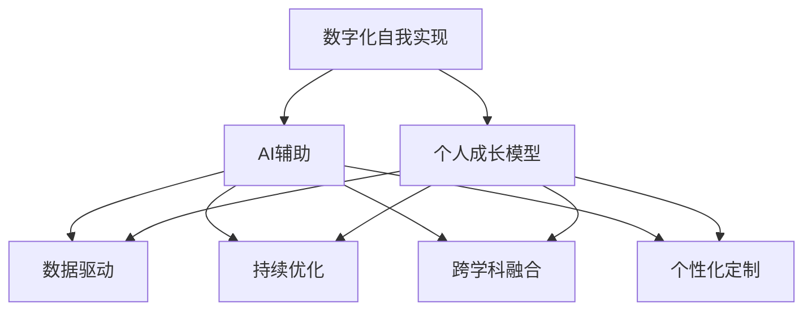

                 

# 数字化自我实现理论：AI辅助的个人成长模型

> 关键词：数字化自我实现, AI辅助, 个人成长模型, 数据驱动, 人工智能

## 1. 背景介绍

### 1.1 问题由来

在数字时代，个人的自我实现成为越来越多人的追求。如何利用数字化工具和AI技术，帮助个人全面提升自我，实现自我成长，成为了当下热门话题。通过AI辅助的个人成长模型，可以在数字化进程中提供系统性的引导和支持，促进个人在知识、技能、情感、认知等多个维度的全面发展。

### 1.2 问题核心关键点

AI辅助的个人成长模型，利用大数据、机器学习、自然语言处理等技术，为个体提供个性化、定制化的学习方案和成长建议。模型的核心在于能够从海量数据中挖掘出个体成长轨迹和规律，通过分析预测，为个体提供科学的自我发展路径。

这个模型结合了心理学、社会学、教育学等多学科知识，通过对个体历史数据和行为模式的学习，生成定制化的成长建议。模型的成功关键在于对数据的高效利用、算法的准确性和适用性，以及对个体成长动机的理解。

### 1.3 问题研究意义

构建AI辅助的个人成长模型，能够为个人成长提供智能化的指导，帮助其在知识获取、技能提升、情绪调节、价值观塑造等方面进行科学管理和高效提升。这对于推动个人全面发展，提升个体的生活质量和社会竞争力，具有重要的理论和实践意义：

1. **全面发展**：提供跨领域的知识与技能学习，帮助个体在各领域均衡发展。
2. **个性化定制**：根据个体兴趣、能力和需求，提供定制化学习建议，提升学习效果。
3. **持续优化**：通过持续的数据反馈和模型优化，保持成长建议的科学性和前瞻性。
4. **跨学科融合**：结合心理学、教育学、数据科学等多学科知识，提供全面的成长方案。
5. **普适性强**：适用于不同年龄、职业、背景的个体，具有广泛应用前景。

## 2. 核心概念与联系

### 2.1 核心概念概述

为了更好地理解AI辅助个人成长模型的工作原理和优化方向，本节将介绍几个关键核心概念：

- **数字化自我实现(Digital Self-Actualization)**：通过数字化手段，利用AI技术辅助个人成长，实现自我价值的最大化。
- **AI辅助(AI-Assisted)**：利用人工智能算法和工具，对个人成长路径进行科学预测和优化。
- **个人成长模型(Personal Growth Model)**：基于心理学、社会学等知识，构建用于指导个体成长的模型框架。
- **数据驱动(Data-Driven)**：以个体行为数据为基础，通过数据分析和机器学习，为个体提供科学的学习建议。
- **持续优化(Continuous Improvement)**：根据个体反馈和动态变化，持续调整成长路径，确保模型建议的实时性和准确性。
- **跨学科融合(Interdisciplinary Integration)**：结合心理学、教育学、数据科学等多学科知识，构建综合性的成长模型。
- **个性化定制(Personalization)**：根据个体兴趣、能力和需求，提供定制化学习方案，提升学习效果。

这些核心概念之间的逻辑关系可以通过以下Mermaid流程图来展示：



这个流程图展示了个体成长模型的核心概念及其之间的联系：

1. 数字化自我实现通过AI辅助，实现个体成长的科学管理和高效提升。
2. AI辅助利用数据驱动和持续优化，提供个性化的成长建议。
3. 个人成长模型结合跨学科融合和个性化定制，构建全面的成长方案。

这些概念共同构成了AI辅助个人成长模型的理论基础，使其能够有效地辅助个体在知识、技能、情绪、价值观等多方面进行科学管理。

## 3. 核心算法原理 & 具体操作步骤
### 3.1 算法原理概述

AI辅助个人成长模型的核心算法，是结合了心理学、社会学、教育学等多学科知识，构建的用于指导个体成长的模型框架。其基本原理可以概括为以下几个步骤：

1. **数据采集与预处理**：收集个体的历史行为数据，包括学习记录、兴趣偏好、社交互动、生理状态等，并进行数据清洗和特征提取。
2. **模型训练与优化**：利用机器学习算法（如决策树、随机森林、神经网络等）对采集到的数据进行建模，不断优化模型参数以提高预测准确性。
3. **个性化生成与反馈**：根据个体当前状态和目标，生成个性化的成长建议，并通过后续行为数据进行反馈，持续调整成长路径。
4. **跨学科融合**：结合心理学、社会学、教育学等多学科知识，提供全方位的成长方案，涵盖知识获取、技能提升、情绪调节、价值观塑造等多个方面。

### 3.2 算法步骤详解

AI辅助个人成长模型的核心算法步骤如下：

**Step 1: 数据采集与预处理**
- 收集个体的行为数据，包括学习记录、兴趣偏好、社交互动、生理状态等。
- 对数据进行清洗，去除噪声和异常值，避免对模型训练产生干扰。
- 提取关键特征，如学习时间、兴趣爱好、社交网络、身体健康状况等。

**Step 2: 模型训练与优化**
- 选择合适的机器学习算法，如决策树、随机森林、神经网络等，构建成长预测模型。
- 利用训练集进行模型训练，不断调整算法参数以提高预测准确性。
- 应用正则化技术，如L1正则、L2正则、Dropout等，防止模型过拟合。
- 采用交叉验证方法，评估模型在不同数据集上的泛化能力。

**Step 3: 个性化生成与反馈**
- 根据个体的当前状态和目标，结合模型预测结果，生成个性化的成长建议。
- 将成长建议以易于理解和执行的格式呈现给个体，如学习计划、技能提升方案、情绪调节策略等。
- 通过后续行为数据收集反馈，不断调整模型参数和成长建议，确保其科学性和适用性。

**Step 4: 跨学科融合**
- 结合心理学、社会学、教育学等多学科知识，为个体提供全方位的成长方案。
- 在生成成长建议时，综合考虑个体的兴趣、能力和需求，确保建议的科学性和可行性。
- 定期更新多学科知识库，保持模型和建议的前沿性和准确性。

### 3.3 算法优缺点

AI辅助个人成长模型的优点包括：

1. **全面性**：结合心理学、社会学、教育学等多学科知识，提供全方位的成长建议。
2. **个性化**：根据个体兴趣、能力和需求，提供定制化的学习方案。
3. **数据驱动**：利用大数据和机器学习，提供科学和准确的成长预测。
4. **持续优化**：通过数据反馈和模型调整，保持成长建议的实时性和适用性。

同时，该模型也存在一定的局限性：

1. **数据隐私**：需要收集和处理大量个人数据，可能涉及隐私保护问题。
2. **数据偏见**：模型的训练数据可能存在偏见，影响预测结果的公正性。
3. **适用性局限**：不同个体的成长需求和动机存在差异，模型需要不断优化以适应多样化的需求。
4. **计算资源需求高**：模型训练和运行需要大量计算资源，可能对硬件设备提出较高要求。

尽管存在这些局限性，但AI辅助个人成长模型仍具有广泛的应用前景，能够显著提升个体的生活质量和成长效果。

### 3.4 算法应用领域

AI辅助个人成长模型可以广泛应用于多个领域，包括但不限于：

- **教育培训**：提供个性化的学习建议和资源推荐，提升学习效果和效率。
- **职业发展**：帮助个体规划职业路径，提升职业技能，增强职场竞争力。
- **心理健康**：监测个体情绪状态，提供心理调适建议，提升心理健康水平。
- **个人管理**：优化时间管理、健康管理、财务管理等方面，提升生活品质。
- **社交互动**：分析社交网络行为，提供社交策略建议，提升社交效果。

## 4. 数学模型和公式 & 详细讲解 & 举例说明
### 4.1 数学模型构建

为更好地理解AI辅助个人成长模型的数学原理，本节将介绍几个关键的数学模型及其构建过程。

**用户行为预测模型**
- **数据**：历史行为数据，包括学习时间、兴趣爱好、社交互动等。
- **模型**：决策树、随机森林、神经网络等。
- **目标**：预测个体在未来的行为，如学习时间分配、技能掌握情况等。

**成长路径优化模型**
- **数据**：个体当前状态、目标、历史行为数据等。
- **模型**：线性回归、梯度提升机等。
- **目标**：生成最优化成长路径，最大化个体成长效果。

**情绪调适建议生成模型**
- **数据**：个体当前情绪状态、历史情绪数据等。
- **模型**：情感分析、情绪识别模型等。
- **目标**：生成情绪调适建议，帮助个体保持心理健康。

### 4.2 公式推导过程

以下我们将以用户行为预测模型为例，推导其核心公式和关键步骤。

假设个体在$t$时刻的学习行为为$x_t$，其学习效果为$y_t$。我们需要构建一个预测模型，预测在$t+1$时刻的学习行为$x_{t+1}$。

利用线性回归模型进行预测，设预测函数为：

$$
f(x_t; \theta) = \theta_0 + \theta_1 x_t + \theta_2 x_t^2 + \cdots + \theta_n x_t^n
$$

其中$\theta = [\theta_0, \theta_1, \theta_2, \cdots, \theta_n]^T$为模型参数。利用最小二乘法，求解模型参数：

$$
\theta = \arg\min_{\theta} \sum_{t=1}^N (y_t - f(x_t; \theta))^2
$$

求解上述最小二乘问题，得到模型参数$\theta$。

利用训练集$\{(x_i, y_i)\}_{i=1}^N$，计算预测误差：

$$
\hat{y} = f(x; \theta)
$$

预测误差为：

$$
\epsilon = y - \hat{y}
$$

模型预测精度可以通过均方误差、平均绝对误差等指标进行评估：

$$
MSE = \frac{1}{N} \sum_{i=1}^N \epsilon_i^2
$$

### 4.3 案例分析与讲解

**案例：个性化学习推荐**
假设某平台收集了用户的历史学习记录，包括课程名称、学习时长、考试成绩等。利用用户行为预测模型，预测用户在特定课程的学习效果。

**数据**：
- 用户学习记录：$\{x_1, x_2, \cdots, x_N\}$
- 用户考试成绩：$\{y_1, y_2, \cdots, y_N\}$

**模型**：
- 线性回归模型
- 训练集：$\{(x_i, y_i)\}_{i=1}^N$

**目标**：
- 预测用户在特定课程$x_{t+1}$的学习效果$y_{t+1}$

**步骤**：
1. 数据预处理：清洗和特征提取，确保数据的完整性和一致性。
2. 模型训练：利用线性回归模型，求解模型参数$\theta$。
3. 预测生成：根据预测模型，生成个性化学习建议。
4. 反馈优化：通过用户后续行为数据，不断调整模型参数，提升预测精度。

## 5. 项目实践：代码实例和详细解释说明
### 5.1 开发环境搭建

在进行AI辅助个人成长模型的项目实践前，我们需要准备好开发环境。以下是使用Python进行TensorFlow开发的环境配置流程：

1. 安装Anaconda：从官网下载并安装Anaconda，用于创建独立的Python环境。

2. 创建并激活虚拟环境：
```bash
conda create -n tf-env python=3.8 
conda activate tf-env
```

3. 安装TensorFlow：根据CUDA版本，从官网获取对应的安装命令。例如：
```bash
conda install tensorflow -c tf -c conda-forge
```

4. 安装TensorFlow Addons：安装TensorFlow生态系统中的扩展库，如Keras、TensorBoard等，提供更多功能支持。
```bash
pip install tensorflow-addons
```

5. 安装各类工具包：
```bash
pip install numpy pandas scikit-learn matplotlib tqdm jupyter notebook ipython
```

完成上述步骤后，即可在`tf-env`环境中开始项目实践。

### 5.2 源代码详细实现

下面我们以用户行为预测模型为例，给出使用TensorFlow进行开发的PyTorch代码实现。

首先，定义数据处理函数：

```python
import pandas as pd
import numpy as np

def load_data(file_path):
    data = pd.read_csv(file_path)
    return data['x'].values, data['y'].values

def preprocess_data(x, y):
    x = (x - np.mean(x)) / np.std(x)
    y = (y - np.mean(y)) / np.std(y)
    return x, y
```

然后，定义模型和优化器：

```python
import tensorflow as tf
from tensorflow.keras.models import Sequential
from tensorflow.keras.layers import Dense
from tensorflow.keras.optimizers import Adam

def create_model(input_dim, output_dim):
    model = Sequential([
        Dense(64, activation='relu', input_dim=input_dim),
        Dense(64, activation='relu'),
        Dense(output_dim)
    ])
    model.compile(loss='mse', optimizer=Adam(lr=0.001))
    return model

def train_model(model, x_train, y_train, x_test, y_test, epochs=100):
    history = model.fit(x_train, y_train, epochs=epochs, validation_data=(x_test, y_test), verbose=0)
    return history
```

接着，定义训练和评估函数：

```python
def evaluate_model(model, x_test, y_test):
    y_pred = model.predict(x_test)
    mse = np.mean((y_test - y_pred) ** 2)
    print('Mean Squared Error:', mse)
    return mse
```

最后，启动训练流程并在测试集上评估：

```python
x_train, y_train = load_data('train.csv')
x_test, y_test = load_data('test.csv')

input_dim = x_train.shape[1]
output_dim = 1

model = create_model(input_dim, output_dim)
history = train_model(model, x_train, y_train, x_test, y_test, epochs=100)

evaluate_model(model, x_test, y_test)
```

以上就是使用TensorFlow对用户行为预测模型进行开发的完整代码实现。可以看到，TensorFlow提供了丰富的API和工具，使得模型的构建和训练变得简洁高效。

### 5.3 代码解读与分析

让我们再详细解读一下关键代码的实现细节：

**load_data函数**：
- 从CSV文件中加载数据，并返回输入和输出。
- 对数据进行预处理，包括归一化等操作。

**preprocess_data函数**：
- 对输入和输出数据进行归一化处理，确保数据在同一尺度下。

**create_model函数**：
- 定义多层的神经网络模型。
- 设置损失函数为均方误差，优化器为Adam。

**train_model函数**：
- 训练模型，并在测试集上进行验证。
- 使用epoch作为训练轮数，定义训练和验证数据的分离。

**evaluate_model函数**：
- 在测试集上评估模型性能，计算均方误差。

**训练流程**：
- 定义输入和输出维度。
- 创建模型并设置训练参数。
- 在训练集上进行模型训练。
- 在测试集上评估模型性能。

可以看到，TensorFlow的TensorFlow API使得模型的开发和训练变得非常直观和高效。通过简单的代码，即可构建、训练和评估模型，大大简化了深度学习的开发流程。

## 6. 实际应用场景
### 6.1 在线教育平台

在线教育平台可以利用AI辅助个人成长模型，为学生提供个性化的学习建议和资源推荐。通过分析学生的学习行为和成绩数据，平台可以预测学生在特定课程或学习路径上的表现，生成个性化的学习建议，帮助学生高效学习，提升学习效果。

**案例**：个性化学习路径推荐
某在线教育平台收集了学生的学习行为数据，包括课程选择、学习时长、考试成绩等。利用用户行为预测模型，预测学生在特定课程上的学习效果。

**数据**：
- 学生学习记录：$\{x_1, x_2, \cdots, x_N\}$
- 学生考试成绩：$\{y_1, y_2, \cdots, y_N\}$

**模型**：
- 线性回归模型
- 训练集：$\{(x_i, y_i)\}_{i=1}^N$

**目标**：
- 预测学生在特定课程$x_{t+1}$的学习效果$y_{t+1}$

**步骤**：
1. 数据预处理：清洗和特征提取，确保数据的完整性和一致性。
2. 模型训练：利用线性回归模型，求解模型参数$\theta$。
3. 预测生成：根据预测模型，生成个性化学习建议。
4. 反馈优化：通过学生后续学习行为数据，不断调整模型参数，提升预测精度。

## 7. 工具和资源推荐
### 7.1 学习资源推荐

为了帮助开发者系统掌握AI辅助个人成长模型的理论基础和实践技巧，这里推荐一些优质的学习资源：

1. **《机器学习实战》**：由Peter Harrington著，全面介绍了机器学习的基本概念和算法，适合初学者学习。
2. **《深度学习》**：由Ian Goodfellow等著，涵盖了深度学习的理论基础和实践技巧，适合进阶学习。
3. **TensorFlow官方文档**：TensorFlow的官方文档，提供了丰富的教程和样例代码，适合快速上手。
4. **Kaggle机器学习竞赛**：Kaggle平台上众多机器学习竞赛，提供大量实际应用场景和数据集，适合实践训练。
5. **Coursera在线课程**：Coursera平台上众多机器学习课程，涵盖基础和高级内容，适合全面学习。

通过对这些资源的学习实践，相信你一定能够快速掌握AI辅助个人成长模型的精髓，并用于解决实际的NLP问题。

### 7.2 开发工具推荐

高效的开发离不开优秀的工具支持。以下是几款用于AI辅助个人成长模型开发的常用工具：

1. **TensorFlow**：由Google主导开发的开源深度学习框架，生产部署方便，适合大规模工程应用。
2. **TensorFlow Addons**：TensorFlow生态系统中的扩展库，提供更多功能支持。
3. **Keras**：基于TensorFlow的高级API，提供简单易用的接口，适合快速原型开发。
4. **TensorBoard**：TensorFlow配套的可视化工具，可实时监测模型训练状态，并提供丰富的图表呈现方式。
5. **Jupyter Notebook**：交互式编程环境，支持多种语言，适合快速迭代实验。
6. **PyTorch**：基于Python的开源深度学习框架，灵活动态的计算图，适合快速迭代研究。
7. **Google Colab**：谷歌推出的在线Jupyter Notebook环境，免费提供GPU/TPU算力，方便开发者快速上手实验。

合理利用这些工具，可以显著提升AI辅助个人成长模型的开发效率，加快创新迭代的步伐。

### 7.3 相关论文推荐

AI辅助个人成长模型的发展源于学界的持续研究。以下是几篇奠基性的相关论文，推荐阅读：

1. **《机器学习》**：Tom Mitchell著，系统介绍了机器学习的理论基础和应用实践，适合全面学习。
2. **《深度学习》**：Ian Goodfellow等著，涵盖了深度学习的理论基础和实践技巧，适合进阶学习。
3. **《个性化推荐系统》**：Tom Zhang等著，介绍了个性化推荐系统的理论和实践，适合应用参考。
4. **《情感分析》**：Richard Socher等著，介绍了情感分析的理论基础和应用实践，适合应用参考。
5. **《心理学与人工智能》**：朱瑟夫·贝尔著，介绍了心理学与人工智能的交叉领域研究，适合理论学习。

这些论文代表了大语言模型微调技术的发展脉络。通过学习这些前沿成果，可以帮助研究者把握学科前进方向，激发更多的创新灵感。

## 8. 总结：未来发展趋势与挑战
### 8.1 总结

本文对AI辅助个人成长模型进行了全面系统的介绍。首先阐述了数字化自我实现和AI辅助个人成长模型的研究背景和意义，明确了模型在知识获取、技能提升、情绪调节、价值观塑造等方面的应用价值。其次，从原理到实践，详细讲解了AI辅助个人成长模型的数学原理和关键步骤，给出了模型开发的完整代码实例。同时，本文还广泛探讨了模型在在线教育、职业发展、心理健康、个人管理等多个领域的应用前景，展示了AI辅助个人成长模型的广阔应用前景。此外，本文精选了模型的各类学习资源，力求为读者提供全方位的技术指引。

通过本文的系统梳理，可以看到，AI辅助个人成长模型为个体提供了科学化和个性化的成长路径，能够有效提升个体的学习效果、职业发展和生活品质。其结合了心理学、社会学、教育学等多学科知识，为个体的全面发展提供了有力支持。未来，伴随AI技术的不断进步和深度学习方法的不断发展，AI辅助个人成长模型必将在更多领域得到应用，为个人成长提供更加智能化、个性化的支持。

### 8.2 未来发展趋势

展望未来，AI辅助个人成长模型将呈现以下几个发展趋势：

1. **全面性增强**：模型将更全面地融合心理学、社会学、教育学等多学科知识，提供全方位的成长建议。
2. **个性化提升**：结合用户的历史数据和实时行为，提供更加精准和个性化的成长建议。
3. **数据驱动**：利用更多的数据来源和更先进的数据分析技术，提升模型预测的准确性。
4. **跨平台应用**：将模型部署到移动端、Web端等多种平台，提升用户体验。
5. **多模态融合**：结合语音、图像、文本等多种模态数据，提升模型的感知能力和决策水平。
6. **动态优化**：根据用户反馈和环境变化，动态调整成长建议，保持其实时性和适用性。
7. **伦理合规**：引入伦理和合规机制，确保模型的公正性和可解释性。

以上趋势凸显了AI辅助个人成长模型的广阔前景。这些方向的探索发展，必将进一步提升模型的科学性和适用性，为个体提供更加全面和精准的成长支持。

### 8.3 面临的挑战

尽管AI辅助个人成长模型已经取得了一定的成果，但在迈向更加智能化、普适化应用的过程中，它仍面临诸多挑战：

1. **数据隐私**：需要收集和处理大量个人数据，可能涉及隐私保护问题。
2. **数据偏见**：模型的训练数据可能存在偏见，影响预测结果的公正性。
3. **适用性局限**：不同个体的成长需求和动机存在差异，模型需要不断优化以适应多样化的需求。
4. **计算资源需求高**：模型训练和运行需要大量计算资源，可能对硬件设备提出较高要求。
5. **模型可解释性不足**：模型的决策过程难以解释，难以对其推理逻辑进行分析和调试。
6. **伦理道德问题**：需要考虑模型的公平性、透明性和责任归属，确保其应用的安全性和伦理性。

尽管存在这些挑战，但通过学界和产业界的共同努力，相信AI辅助个人成长模型能够逐步克服这些难题，在更多领域得到广泛应用。

### 8.4 未来突破

面对AI辅助个人成长模型所面临的种种挑战，未来的研究需要在以下几个方面寻求新的突破：

1. **多学科融合**：结合心理学、社会学、教育学等多学科知识，构建综合性的成长模型。
2. **跨模态融合**：结合语音、图像、文本等多种模态数据，提升模型的感知能力和决策水平。
3. **伦理道德规范**：引入伦理和合规机制，确保模型的公正性和可解释性。
4. **计算资源优化**：优化模型结构，减少计算资源消耗，提升模型效率。
5. **隐私保护**：引入隐私保护技术，确保用户数据的安全性和隐私性。
6. **动态优化**：根据用户反馈和环境变化，动态调整成长建议，保持其实时性和适用性。

这些研究方向的探索，必将引领AI辅助个人成长模型迈向更高的台阶，为个体提供更加全面和精准的成长支持。面向未来，AI辅助个人成长模型还需要与其他人工智能技术进行更深入的融合，如知识表示、因果推理、强化学习等，多路径协同发力，共同推动自然语言理解和智能交互系统的进步。只有勇于创新、敢于突破，才能不断拓展语言模型的边界，让智能技术更好地造福人类社会。

## 9. 附录：常见问题与解答

**Q1：AI辅助个人成长模型是否适用于所有个体？**

A: AI辅助个人成长模型能够为不同背景、不同需求的个体提供个性化的成长建议，但对于一些特殊个体，如精神障碍患者、儿童等，仍需结合专业人员的指导，才能提供更加科学和适用的建议。

**Q2：AI辅助个人成长模型是否能够完全取代人类指导？**

A: AI辅助个人成长模型能够提供科学和精准的成长建议，但无法完全取代人类指导。人类指导能够提供情感支持和心理辅导，帮助个体应对复杂情感和心理问题，AI模型在这方面仍有局限性。

**Q3：AI辅助个人成长模型是否能够识别个体的真实需求？**

A: AI辅助个人成长模型能够通过数据分析和机器学习，识别个体的行为模式和需求，但真实需求可能受到个体心理状态、环境因素等多种因素的影响，模型的预测仍存在一定偏差。

**Q4：AI辅助个人成长模型是否能够持续优化？**

A: AI辅助个人成长模型能够根据用户反馈和环境变化，不断调整成长建议，但持续优化的效果取决于模型的算法和数据质量。需要定期更新数据和优化算法，才能保持其前瞻性和适用性。

**Q5：AI辅助个人成长模型是否具有伦理道德风险？**

A: AI辅助个人成长模型需要考虑伦理道德问题，如模型的公正性、透明性和责任归属，确保其应用的安全性和伦理性。需要在设计和实施过程中引入伦理审查和监管机制，确保模型的公平性和可解释性。

通过这些问题的解答，可以看到，AI辅助个人成长模型在应用过程中仍需注意隐私保护、伦理道德、模型公正性等多个问题，才能真正实现其价值，为个体提供全面和精准的成长支持。

---

作者：禅与计算机程序设计艺术 / Zen and the Art of Computer Programming

