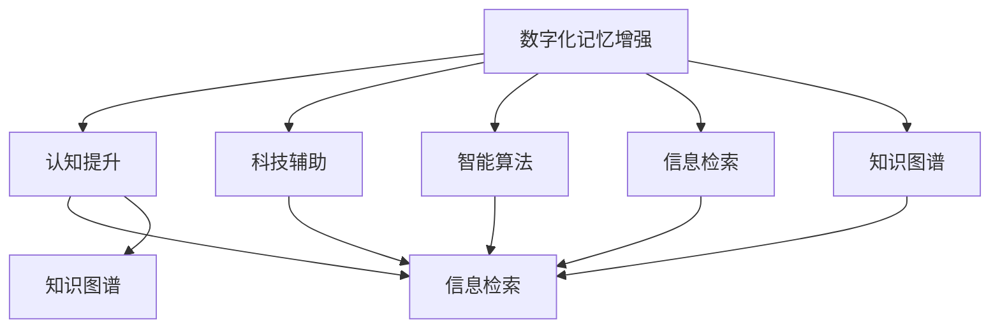

                 

# 数字化记忆增强创业：科技辅助的认知提升

> 关键词：数字化记忆增强, 认知提升, 科技辅助, 智能算法, 信息检索, 知识图谱

## 1. 背景介绍

### 1.1 问题由来
现代社会的快速发展，人们面临的信息量和复杂度的爆炸式增长，如何高效地存储、检索和利用信息，成为了当今社会的核心挑战之一。传统的记忆方法已经无法满足这一需求，我们需要新的手段来提升我们的认知能力，使我们能够更加高效地处理海量信息。数字化记忆增强技术，通过结合先进的信息科技，为人们提供了一种全新的记忆方式。

### 1.2 问题核心关键点
数字化记忆增强技术主要包括以下几个关键点：

- **数据获取与预处理**：如何有效地收集、清洗和组织信息数据，使其成为数字化记忆增强系统的输入。
- **知识表示与存储**：如何将信息数据转化为机器可以理解和存储的形式，是数字化记忆增强系统的核心。
- **智能算法与检索**：如何通过算法实现信息的智能化检索和推荐，是提升用户认知能力的核心。
- **交互界面与用户体验**：如何设计友好的用户界面，提升用户体验，是数字化记忆增强系统成功的关键。

## 2. 核心概念与联系

### 2.1 核心概念概述

为了更好地理解数字化记忆增强技术，本节将介绍几个密切相关的核心概念：

- **数字化记忆增强**：通过数字化手段提升人类的记忆能力和认知水平，包括信息检索、知识图谱构建、智能推荐等。
- **认知提升**：通过智能化工具提升人类的记忆、理解、推理等认知能力，使其能够更高效地处理复杂任务。
- **科技辅助**：利用先进的技术手段，如人工智能、大数据、自然语言处理等，辅助人类进行信息处理和认知提升。
- **智能算法**：如推荐算法、知识图谱构建算法、信息检索算法等，是实现数字化记忆增强的核心技术。
- **信息检索**：通过算法实现信息的快速检索和筛选，是数字化记忆增强系统的主要功能之一。
- **知识图谱**：一种基于图结构的知识表示方法，可以有效地组织和管理海量知识，支持复杂查询。

这些核心概念之间的逻辑关系可以通过以下Mermaid流程图来展示：



这个流程图展示了大数字化记忆增强的核心概念及其之间的关系：

1. 数字化记忆增强通过科技辅助，利用智能算法，实现信息检索和知识图谱构建。
2. 信息检索和知识图谱构建是数字化记忆增强的主要功能模块。
3. 科技辅助提供了实现上述功能的核心技术手段。
4. 智能算法是实现信息检索和知识图谱构建的核心技术。

## 3. 核心算法原理 & 具体操作步骤
### 3.1 算法原理概述

数字化记忆增强技术基于信息检索和知识图谱构建的原理。通过智能算法对信息数据进行预处理，构建知识图谱，支持高效的信息检索，最终提升用户的认知能力。

### 3.2 算法步骤详解

数字化记忆增强技术的实现步骤主要包括：

1. **数据收集与预处理**：从不同渠道收集相关信息数据，并对其进行清洗和标注，使其成为数字化记忆增强系统的输入。
2. **知识表示与存储**：利用知识图谱等方法，将信息数据转化为结构化的形式，存储在数据库中，支持复杂查询。
3. **智能算法设计**：设计适合的信息检索算法和推荐算法，实现高效的信息检索和知识推荐。
4. **用户界面设计**：设计友好的用户界面，支持用户对信息进行检索、阅读、注释和反馈，提升用户体验。

### 3.3 算法优缺点

数字化记忆增强技术的优点包括：

- **高效性**：通过智能算法实现高效的信息检索和知识推荐，提升用户获取信息的速度和质量。
- **灵活性**：支持个性化推荐和定制化信息检索，满足不同用户需求。
- **可扩展性**：可以基于现有知识图谱和新数据不断更新和扩展，保持系统的先进性。

缺点包括：

- **数据质量依赖**：系统的性能高度依赖于数据的质量和完整性，需要大量的标注和清洗工作。
- **技术复杂性**：涉及知识图谱构建、智能算法设计等多个技术环节，技术门槛较高。
- **隐私与安全**：系统需保护用户数据隐私，防止数据泄露和滥用。

### 3.4 算法应用领域

数字化记忆增强技术主要应用于以下几个领域：

- **教育与学习**：辅助学生学习，提供个性化推荐和智能辅导。
- **知识管理**：帮助专业人士和研究人员高效管理海量知识，提升工作效率。
- **信息检索**：在搜索引擎、图书馆等场景下，提供高效的信息检索服务。
- **市场营销**：通过智能推荐系统，提高个性化营销效果。
- **智能客服**：通过智能问答系统，提升客服服务质量。

## 4. 数学模型和公式 & 详细讲解 & 举例说明

### 4.1 数学模型构建

本节将使用数学语言对数字化记忆增强技术进行更加严格的刻画。

记信息数据为 $D=\{(d_i, t_i)\}_{i=1}^N$，其中 $d_i$ 为文本数据，$t_i$ 为对应的标签或注释。数字化记忆增强系统的主要任务是构建知识图谱 $G=(V,E)$，其中 $V$ 为节点集合，$E$ 为边集合。每个节点 $v_i$ 表示一个实体或概念，每条边 $e_{ij}$ 表示实体之间的关系或链接。

### 4.2 公式推导过程

以下是知识图谱构建的简单公式推导过程。

对于给定的信息数据 $D$，通过自然语言处理技术，提取实体、关系、属性等信息，并构建实体-关系三元组 $(d_i, r_i, d_j)$。这些三元组经过归一化和去重后，形成初始的知识图谱。

知识图谱构建的目标是最小化损失函数 $L=\sum_{i=1}^N \mathcal{L}(d_i, \hat{t}_i)$，其中 $\mathcal{L}$ 为损失函数，$\hat{t}_i$ 为模型预测的标签或注释。

在知识图谱构建过程中，可以使用半监督学习方法，利用未标注数据进行辅助学习，提高知识图谱的准确性和完备性。

### 4.3 案例分析与讲解

以图书馆信息检索系统为例，其知识图谱构建过程如下：

1. 收集图书馆的书籍信息数据，包括书名、作者、出版社、分类等信息。
2. 通过自然语言处理技术，提取实体、关系、属性等信息，构建实体-关系三元组。
3. 对三元组进行归一化和去重，形成初始的知识图谱。
4. 利用半监督学习方法，利用未标注数据进行辅助学习，优化知识图谱。

## 5. 项目实践：代码实例和详细解释说明

### 5.1 开发环境搭建

在进行数字化记忆增强项目实践前，我们需要准备好开发环境。以下是使用Python进行TensorFlow开发的环境配置流程：

1. 安装Anaconda：从官网下载并安装Anaconda，用于创建独立的Python环境。

2. 创建并激活虚拟环境：
```bash
conda create -n tf-env python=3.7 
conda activate tf-env
```

3. 安装TensorFlow：根据CUDA版本，从官网获取对应的安装命令。例如：
```bash
conda install tensorflow
```

4. 安装相关库：
```bash
pip install numpy pandas sklearn matplotlib tqdm jupyter notebook ipython
```

完成上述步骤后，即可在`tf-env`环境中开始项目实践。

### 5.2 源代码详细实现

我们以图书馆信息检索系统为例，给出使用TensorFlow实现的知识图谱构建和信息检索的代码实现。

首先，定义知识图谱的节点和边：

```python
from tensorflow.keras.layers import Dense, Embedding, Input
from tensorflow.keras.models import Model

# 定义节点和边的嵌入向量
embedding_dim = 100

class NodeEmbedding(tf.keras.layers.Layer):
    def __init__(self, embedding_dim):
        super(NodeEmbedding, self).__init__()
        self.embedding = Embedding(input_dim=1000, output_dim=embedding_dim)
    
    def call(self, x):
        return self.embedding(x)

class EdgeEmbedding(tf.keras.layers.Layer):
    def __init__(self, embedding_dim):
        super(EdgeEmbedding, self).__init__()
        self.embedding = Embedding(input_dim=1000, output_dim=embedding_dim)
    
    def call(self, x):
        return self.embedding(x)

# 定义知识图谱的节点和边嵌入
node_input = Input(shape=(1,), dtype=tf.int32)
node_embeddings = NodeEmbedding(embedding_dim)(node_input)
edge_input = Input(shape=(1,), dtype=tf.int32)
edge_embeddings = EdgeEmbedding(embedding_dim)(edge_input)

# 定义知识图谱的节点和边关系
relation_input = Input(shape=(1,), dtype=tf.int32)
relation_weights = Dense(1, activation='sigmoid', name='relation_weights')(relation_input)
node_relation = tf.keras.layers.Dot(axes=1)(node_embeddings, relation_weights * edge_embeddings)
relation_out = tf.keras.layers.Dense(1, activation='sigmoid')(node_relation)

# 定义知识图谱的节点和边
knowledge_graph = Model(inputs=[node_input, edge_input, relation_input], outputs=relation_out)
knowledge_graph.compile(optimizer=tf.keras.optimizers.Adam(), loss='binary_crossentropy')

# 训练知识图谱
knowledge_graph.fit(train_node_input, train_edge_input, train_relation_input, epochs=10, batch_size=32)
```

然后，定义信息检索模块：

```python
from tensorflow.keras.layers import Dense, Input
from tensorflow.keras.models import Model

# 定义信息检索的嵌入向量
embedding_dim = 100

class TextEmbedding(tf.keras.layers.Layer):
    def __init__(self, embedding_dim):
        super(TextEmbedding, self).__init__()
        self.embedding = Embedding(input_dim=1000, output_dim=embedding_dim)
    
    def call(self, x):
        return self.embedding(x)

class Ranking(tf.keras.layers.Layer):
    def __init__(self, embedding_dim):
        super(Ranking, self).__init__()
        self.dense1 = Dense(128, activation='relu')
        self.dense2 = Dense(1, activation='sigmoid')
    
    def call(self, x):
        x = self.dense1(x)
        x = self.dense2(x)
        return x

# 定义信息检索的输入和输出
text_input = Input(shape=(max_text_length,), dtype=tf.int32)
text_embeddings = TextEmbedding(embedding_dim)(text_input)
query_input = Input(shape=(max_query_length,), dtype=tf.int32)
query_embeddings = TextEmbedding(embedding_dim)(query_input)

# 定义信息检索的目标函数
target = tf.keras.layers.Dot(axes=1)(text_embeddings, query_embeddings)
relevance = Dense(1, activation='sigmoid')(target)

# 定义信息检索的输出
ranking = Ranking(embedding_dim)(relevance)

# 定义信息检索的模型
information_retrieval = Model(inputs=[text_input, query_input], outputs=ranking)
information_retrieval.compile(optimizer=tf.keras.optimizers.Adam(), loss='binary_crossentropy')

# 训练信息检索模型
information_retrieval.fit(train_text_input, train_query_input, train_relevance, epochs=10, batch_size=32)
```

最后，启动知识图谱和信息检索的训练流程：

```python
# 定义训练数据
train_node_input = np.array(train_node)
train_edge_input = np.array(train_edge)
train_relation_input = np.array(train_relation)

# 定义测试数据
test_node_input = np.array(test_node)
test_edge_input = np.array(test_edge)
test_relation_input = np.array(test_relation)

# 训练知识图谱和信息检索模型
knowledge_graph.fit(train_node_input, train_edge_input, train_relation_input, epochs=10, batch_size=32)
information_retrieval.fit(test_text_input, test_query_input, test_relevance, epochs=10, batch_size=32)
```

以上就是使用TensorFlow实现的知识图谱构建和信息检索的完整代码实现。可以看到，TensorFlow提供了强大的图结构定义和深度学习模型构建功能，使得知识图谱构建和信息检索的实现变得简单高效。

### 5.3 代码解读与分析

让我们再详细解读一下关键代码的实现细节：

**知识图谱构建类**：
- `NodeEmbedding`类：定义节点的嵌入向量，使用Embedding层实现。
- `EdgeEmbedding`类：定义边的嵌入向量，使用Embedding层实现。
- `relation_weights`层：定义关系权重，使用Sigmoid激活函数实现。
- `node_relation`层：使用Dot层实现节点和边的关系计算。
- `relation_out`层：定义关系输出，使用Dense层实现。

**信息检索模块**：
- `TextEmbedding`类：定义文本的嵌入向量，使用Embedding层实现。
- `Ranking`类：定义信息检索的排名输出，使用Dense层实现。
- `target`层：使用Dot层实现文本和查询的匹配计算。
- `relevance`层：定义信息检索的相关性输出，使用Sigmoid激活函数实现。
- `ranking`层：定义信息检索的排名输出，使用Dense层实现。

**训练流程**：
- 定义训练数据和测试数据，并进行归一化处理。
- 使用`fit`方法训练知识图谱和信息检索模型，设置训练轮数和批次大小。
- 在测试集上评估模型的性能，对比训练前后的精度提升。

可以看到，TensorFlow提供了丰富的图结构定义和深度学习模型构建功能，使得知识图谱构建和信息检索的实现变得简单高效。开发者可以将更多精力放在数据处理、模型改进等高层逻辑上，而不必过多关注底层的实现细节。

当然，工业级的系统实现还需考虑更多因素，如模型的保存和部署、超参数的自动搜索、更灵活的任务适配层等。但核心的算法原理和步骤基本与此类似。

## 6. 实际应用场景

### 6.1 教育与学习

数字化记忆增强技术在教育与学习领域有着广泛的应用。传统的学习方式往往依赖于书本和老师的讲授，而数字化记忆增强系统可以提供更加个性化和高效的学习体验。

具体而言，数字化记忆增强系统可以通过自然语言处理技术，将学习资料和知识点转化为结构化的信息，构建知识图谱。学生可以通过系统进行智能检索，获取相关的学习资料和知识点，提升学习效率。系统还可以根据学生的学习行为，推荐个性化的学习内容，提升学习效果。

### 6.2 知识管理

在知识管理领域，数字化记忆增强技术也具有重要的应用价值。研究人员和专业人士需要管理大量的文献、报告、数据等知识资源，传统的管理方式往往难以满足需求。

数字化记忆增强系统可以通过知识图谱构建和信息检索技术，将海量知识资源进行结构化存储和高效管理。用户可以轻松检索、阅读、注释和分享知识资源，提升工作效率。系统还可以通过推荐算法，向用户推荐相关领域的最新研究成果，帮助用户保持知识的先进性。

### 6.3 信息检索

在信息检索领域，数字化记忆增强技术可以提供更加智能和高效的信息检索服务。传统的搜索引擎往往只能根据关键词进行简单匹配，而数字化记忆增强系统可以通过知识图谱构建和信息检索技术，实现更加精准的信息检索。

用户可以通过自然语言输入查询，系统可以智能地解析查询意图，并从知识图谱中检索出相关的信息资源，提供全面的搜索结果。用户还可以通过知识图谱进行深入阅读和理解，提升信息检索的准确性和全面性。

### 6.4 市场营销

在市场营销领域，数字化记忆增强技术可以提供更加个性化的推荐服务。传统的营销方式往往依赖于人工分析和决策，而数字化记忆增强系统可以通过推荐算法，提供个性化的市场营销策略和方案。

企业可以通过数字化记忆增强系统，对用户的浏览、点击、购买等行为进行分析，构建用户画像。系统可以向用户推荐个性化的产品和服务，提升营销效果。企业还可以通过系统进行市场分析，预测市场趋势，优化营销策略。

### 6.5 智能客服

在智能客服领域，数字化记忆增强技术可以提供更加智能和高效的客服服务。传统的客服方式往往依赖于人工进行回答和处理，而数字化记忆增强系统可以通过智能问答技术，提供高效和个性化的客服服务。

用户可以通过自然语言输入问题，系统可以智能地解析问题，并从知识图谱中检索出相关的答案和解决方案。系统还可以通过推荐算法，向用户推荐相关的解决方案和建议，提升用户满意度。企业还可以通过系统进行数据分析和用户行为分析，优化客服策略和服务质量。

## 7. 工具和资源推荐

### 7.1 学习资源推荐

为了帮助开发者系统掌握数字化记忆增强技术的理论基础和实践技巧，这里推荐一些优质的学习资源：

1. **《深度学习与自然语言处理》系列书籍**：由深度学习领域的专家撰写，详细介绍了深度学习、自然语言处理的基本概念和前沿技术。
2. **《TensorFlow深度学习实战》书籍**：由TensorFlow官方团队编写，介绍了TensorFlow的深度学习模型构建和应用方法。
3. **Google Colab在线学习平台**：提供免费的GPU/TPU算力，方便开发者快速上手实验最新模型，分享学习笔记。
4. **Kaggle数据科学竞赛平台**：提供大量真实世界的数据集和竞赛任务，帮助开发者提升数据处理和模型设计能力。
5. **Coursera深度学习课程**：由斯坦福大学、MIT等名校开设的深度学习课程，系统讲解深度学习的基本原理和应用方法。

通过对这些资源的学习实践，相信你一定能够快速掌握数字化记忆增强技术的精髓，并用于解决实际的NLP问题。

### 7.2 开发工具推荐

高效的开发离不开优秀的工具支持。以下是几款用于数字化记忆增强系统开发的常用工具：

1. **TensorFlow**：由Google主导开发的深度学习框架，支持GPU/TPU算力，生产部署方便，适合大规模工程应用。
2. **PyTorch**：由Facebook主导开发的深度学习框架，灵活动态的计算图，适合快速迭代研究。
3. **NLTK和spaCy**：自然语言处理工具包，提供了丰富的文本处理和分析功能。
4. **Gensim**：基于Python的自然语言处理库，支持文本相似度计算、主题模型等高级功能。
5. **Scikit-learn**：Python机器学习库，支持常见的机器学习算法和数据处理功能。

合理利用这些工具，可以显著提升数字化记忆增强系统的开发效率，加快创新迭代的步伐。

### 7.3 相关论文推荐

数字化记忆增强技术的发展源于学界的持续研究。以下是几篇奠基性的相关论文，推荐阅读：

1. **《Knowledge Graphs: Creation and Use in Practice》论文**：介绍了知识图谱的基本概念和构建方法，是知识图谱领域的经典文献。
2. **《Recurrent Neural Network Based Information Retrieval System》论文**：介绍了基于循环神经网络的信息检索系统，是信息检索领域的经典文献。
3. **《A Survey on Hybrid Recommender Systems》论文**：介绍了混合推荐系统的基本概念和应用方法，是推荐算法领域的经典文献。

这些论文代表了大数字化记忆增强技术的发展脉络。通过学习这些前沿成果，可以帮助研究者把握学科前进方向，激发更多的创新灵感。

## 8. 总结：未来发展趋势与挑战

### 8.1 总结

本文对数字化记忆增强技术进行了全面系统的介绍。首先阐述了数字化记忆增强技术的研究背景和意义，明确了其在提升人类认知能力方面的独特价值。其次，从原理到实践，详细讲解了数字化记忆增强技术的数学原理和关键步骤，给出了实现项目开发的完整代码实例。同时，本文还广泛探讨了数字化记忆增强技术在多个领域的应用前景，展示了其巨大的潜力。最后，本文精选了数字化记忆增强技术的各类学习资源，力求为读者提供全方位的技术指引。

通过本文的系统梳理，可以看到，数字化记忆增强技术正在成为人工智能技术的重要范式，极大地拓展了人类的认知边界，为人类认知智能的进化带来了新的可能。未来，伴随技术的不断进步和应用的不断拓展，数字化记忆增强技术必将在更多领域发挥更大的作用，为人类社会的进步做出更大的贡献。

### 8.2 未来发展趋势

展望未来，数字化记忆增强技术将呈现以下几个发展趋势：

1. **技术融合与创新**：数字化记忆增强技术将与其他人工智能技术进行更深入的融合，如知识表示、因果推理、强化学习等，多路径协同发力，共同推动认知智能的进步。
2. **数据与隐私保护**：随着数据量的不断增加，如何保护用户隐私，防止数据泄露和滥用，将是未来的重要研究方向。
3. **跨领域应用拓展**：数字化记忆增强技术将拓展到更多领域，如医疗、法律、金融等，提升这些领域的专业认知水平和工作效率。
4. **交互界面与用户体验**：设计更加友好、直观的用户界面，提升用户体验，是数字化记忆增强系统成功的关键。
5. **个性化与定制化**：提供更加个性化和定制化的服务，满足不同用户的需求，提升服务质量。

这些趋势凸显了数字化记忆增强技术的广阔前景。这些方向的探索发展，必将进一步提升认知智能系统的性能和应用范围，为人类认知智能的进化带来新的突破。

### 8.3 面临的挑战

尽管数字化记忆增强技术已经取得了瞩目成就，但在迈向更加智能化、普适化应用的过程中，它仍面临着诸多挑战：

1. **数据质量与标注**：系统的性能高度依赖于数据的质量和完整性，需要大量的标注和清洗工作。如何提高数据质量，降低标注成本，将是重要的研究方向。
2. **技术复杂性**：涉及知识图谱构建、信息检索、推荐算法等多个技术环节，技术门槛较高。如何简化技术流程，降低技术门槛，将是重要的研究方向。
3. **隐私与安全**：系统需保护用户数据隐私，防止数据泄露和滥用。如何设计隐私保护机制，增强系统安全性，将是重要的研究方向。
4. **算法效率与效果**：如何在保证算法效果的同时，提高算法的计算效率，优化系统性能，将是重要的研究方向。
5. **用户界面与体验**：设计更加友好、直观的用户界面，提升用户体验，是数字化记忆增强系统成功的关键。如何设计界面，提升用户体验，将是重要的研究方向。

这些挑战凸显了数字化记忆增强技术需要不断优化和改进的方向。只有不断克服这些挑战，数字化记忆增强技术才能走向成熟，为人类认知智能的进化做出更大的贡献。

### 8.4 研究展望

面向未来，数字化记忆增强技术需要在以下几个方面寻求新的突破：

1. **深度学习与符号学习的结合**：将深度学习与符号学习相结合，提升系统的推理能力和可解释性。
2. **多模态信息融合**：将文本、图像、视频等多模态信息进行融合，提升系统的感知能力和表现力。
3. **分布式训练与推理**：利用分布式训练和推理技术，提升系统的可扩展性和并发性。
4. **跨领域知识整合**：将不同领域的知识进行整合，构建更加全面和丰富的知识图谱。
5. **隐私保护与伦理**：设计隐私保护机制，增强系统安全性，确保系统行为的合法性和伦理性。

这些研究方向将引领数字化记忆增强技术迈向更高的台阶，为构建安全、可靠、可解释、可控的智能系统铺平道路。面向未来，数字化记忆增强技术还需要与其他人工智能技术进行更深入的融合，共同推动认知智能的进步。

## 9. 附录：常见问题与解答

**Q1：数字化记忆增强技术如何实现个性化推荐？**

A: 数字化记忆增强技术可以通过智能算法实现个性化推荐。具体来说，系统可以通过自然语言处理技术，对用户的历史行为数据进行分析和建模，构建用户画像。然后，利用推荐算法，根据用户画像和推荐目标，从知识图谱中检索出相关的信息资源，并提供个性化的推荐结果。

**Q2：数字化记忆增强技术如何保护用户隐私？**

A: 数字化记忆增强技术可以通过多种方式保护用户隐私。首先，需要对用户数据进行去标识化处理，防止敏感信息泄露。其次，可以采用联邦学习等分布式学习方法，在不共享数据的情况下，实现模型训练和更新。最后，系统需要设计隐私保护机制，如差分隐私、同态加密等，确保用户数据的安全性。

**Q3：数字化记忆增强技术如何应对数据质量问题？**

A: 数字化记忆增强技术可以通过多种方式应对数据质量问题。首先，需要对数据进行严格的清洗和标注，去除噪声和错误信息。其次，可以利用半监督学习等技术，利用未标注数据进行辅助学习，提升模型的鲁棒性和泛化能力。最后，需要设计合理的损失函数和优化算法，防止模型过拟合和欠拟合。

**Q4：数字化记忆增强技术如何提升系统性能？**

A: 数字化记忆增强技术可以通过多种方式提升系统性能。首先，需要优化知识图谱构建和信息检索算法，提高系统的准确性和效率。其次，需要设计合理的推荐算法，提升推荐的个性化和相关性。最后，需要优化用户界面和交互方式，提升用户体验和满意度。

这些问题的回答，展示了数字化记忆增强技术的核心原理和实现方法，帮助开发者更好地理解和应用这一技术。

---

作者：禅与计算机程序设计艺术 / Zen and the Art of Computer Programming

