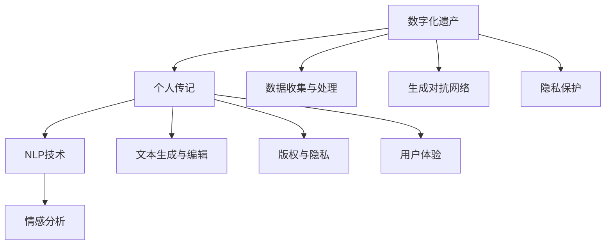

                 

# 数字化遗产故事讲述创业：AI驱动的个人传记创作

## 1. 背景介绍

### 1.1 问题由来
在数字时代，个人数据和记忆的数字化存储和传承成为了人们日益关注的课题。特别是在数字遗产领域，如何将一个人的生平和精神财富以一种数字化形式永久保存和传承下去，成为了一个热点问题。个人传记作为一种反映个人生活经历和文化价值的载体，在这方面有着重要意义。然而，编写一本详尽、生动的个人传记，需要耗费大量的时间和精力，尤其对于年迈的长者或文化水平较高的知识分子，这一过程更加繁琐。

### 1.2 问题核心关键点
当前，数字化遗产故事讲述创业的焦点在于利用人工智能技术自动生成个人传记。其核心问题可以概括为以下几个方面：
- **数据收集与处理**：如何系统、全面地收集和整理个人生命历程中的重要信息。
- **文本生成与编辑**：使用什么算法模型生成流畅、富有文采的传记文本，并对其进行编辑和润色。
- **版权与隐私**：如何处理个人隐私和版权问题，保证传记内容的合法性和个人隐私安全。
- **用户体验**：设计友好的交互界面，使用户能够方便地参与传记的创作和编辑过程。

### 1.3 问题研究意义
数字化遗产故事讲述创业项目具有重要意义：
- **文化传承**：为家庭成员和后人提供了了解家族历史和文化背景的重要资料，有助于文化传承。
- **记忆保存**：通过数字化方式保存个人记忆和经验，防止信息遗失，具有长远的保存价值。
- **技术创新**：推动人工智能自然语言处理技术的发展，提升文本生成与编辑的质量。
- **社会价值**：通过传记讲述，有助于增进个人与社会的连接，提升社会文化的深度和广度。

## 2. 核心概念与联系

### 2.1 核心概念概述

为更好地理解基于AI驱动的个人传记创作方法，本节将介绍几个密切相关的核心概念：

- **数字化遗产**：指通过数字化的方式保存、传承个人或家族的生平故事、文化遗产、照片、音频、视频等各类记忆资料。
- **个人传记**：反映个人生平经历、思想情感、文化成就的文学作品，是数字化遗产的重要形式之一。
- **自然语言处理(NLP)**：涉及计算机科学、人工智能和语言学的交叉领域，主要研究如何让计算机理解和生成人类语言。
- **生成对抗网络(GANs)**：一种由生成器和判别器构成的对抗训练框架，广泛应用于图像生成、语音合成等领域。
- **序列到序列(Seq2Seq)**：一种机器学习框架，广泛应用于自然语言处理任务，如机器翻译、文本摘要等。
- **情感分析**：通过算法对文本内容进行情感极性判断，提取文本中的情感信息。
- **隐私保护**：在处理个人数据时，采取技术手段和管理措施，确保数据的安全性和隐私性。

这些核心概念之间的逻辑关系可以通过以下Mermaid流程图来展示：



这个流程图展示了几大核心概念之间的关系：

1. 数字化遗产通过个人传记等形式展现。
2. NLP技术是个人传记创作的工具。
3. 数据收集与处理、文本生成与编辑是实现传记创作的关键步骤。
4. 版权与隐私保护是保证传记创作合法性的重要因素。
5. 用户体验设计提升传记创作的用户满意度。
6. 生成对抗网络可用于提高文本生成的质量。
7. 情感分析用于挖掘文本中的情感信息。
8. 隐私保护确保传记创作中个人隐私的安全。

这些概念共同构成了数字化遗产故事讲述创业的核心框架，使传记创作成为可能。

## 3. 核心算法原理 & 具体操作步骤
### 3.1 算法原理概述

基于AI驱动的个人传记创作，本质上是一个多任务的联合学习过程。其核心思想是：将预训练的NLP模型视为"写作助手"，通过收集个人生平故事和关键事件，生成流畅、富有文采的传记文本，并结合情感分析对文本进行编辑，以增强传记的感染力和真实性。

形式化地，假设个人传记为 $B=\{b_i\}_{i=1}^n$，其中 $b_i$ 表示传记的第 $i$ 个段落，是一个文本序列。设 $D$ 为收集到的个人生平故事和关键事件的文本数据集，$S$ 为情感分析模型，$E$ 为文本编辑模型。传记创作的总目标为最小化传记质量与真实性的差距，即：

$$
\min_{B, S, E} \mathcal{L}(B, S, E, D)
$$

其中 $\mathcal{L}$ 为综合损失函数，包括传记流畅性、情感一致性和文本编辑误差等各项损失。

### 3.2 算法步骤详解

基于AI驱动的个人传记创作一般包括以下几个关键步骤：

**Step 1: 数据收集与预处理**
- 收集个人生平故事、关键事件、家庭照片、音频和视频等各类数字化遗产资料，构建传记素材库 $D$。
- 对素材库进行文本化处理，提取有用的信息，如出生年月、重要事件、主要人物等。

**Step 2: 初始文本生成**
- 使用预训练的NLP模型（如GPT、BERT等）对初始文本进行生成，得到初步传记文本 $B^0$。
- 根据个人需求，设置生成模型的超参数，如生成温度、长度等。

**Step 3: 情感分析与编辑**
- 对初步传记文本 $B^0$ 进行情感分析，提取情感信息 $S(B^0)$，并根据真实情感信息对传记文本进行编辑，得到编辑后的传记文本 $B^1$。
- 使用情感编辑模型 $E(S(B^0))$，生成优化后的传记文本 $B^1$。

**Step 4: 文本优化与发布**
- 对编辑后的传记文本 $B^1$ 进行优化，如去除冗余、修正语法等，得到最终传记文本 $B$。
- 将传记文本导出为可读格式，并发布到指定的数字平台或打印出版。

### 3.3 算法优缺点

基于AI驱动的个人传记创作方法具有以下优点：
1. 效率高：自动生成传记，节省了大量人工撰写的时间和精力。
2. 质量高：利用NLP和GANs等技术，生成的文本流畅、富有文采。
3. 灵活性：可以根据不同需求进行调整，如调整生成温度、情感分析模型等。
4. 可扩展性：可以整合更多数据源和处理技术，进一步提升传记质量。

同时，该方法也存在一些局限性：
1. 情感准确性：情感分析模型可能存在偏差，影响传记的情感真实性。
2. 隐私风险：传记涉及个人隐私，需要确保数据处理的安全性和隐私保护。
3. 版权问题：传记内容涉及原创性问题，需要明确版权归属和许可问题。
4. 技术门槛：需要具备一定的AI技术背景，对用户有一定的技术要求。
5. 人机互动：自动生成传记缺乏人性化互动，需要结合人工修改和优化。

尽管存在这些局限性，但就目前而言，基于AI驱动的个人传记创作方法仍具有显著优势，广泛应用于各类数字化遗产讲述和传记创作中。

### 3.4 算法应用领域

基于AI驱动的个人传记创作技术，已经在多个领域得到了广泛应用，包括但不限于：

- 家庭传记：为家庭成员、后代提供了解家族历史和文化的宝贵资料。
- 名人传记：利用名人公开数据和历史资料，生成详尽的名人传记，展示其思想成就。
- 历史文献：对历史人物的生平和事迹进行数字化重构，为历史研究提供新视角。
- 文化传承：将个人记忆和文化价值转化为数字化形式，为社会文化的传承贡献力量。
- 社会教育：作为教育和研究素材，帮助人们更好地理解历史和文化遗产。

除了这些传统领域外，AI驱动的个人传记创作技术也在不断创新，如融合多媒体素材、利用情感分析和文本生成技术创作复杂主题传记等，为传记创作带来了新的可能。

## 4. 数学模型和公式 & 详细讲解
### 4.1 数学模型构建

本节将使用数学语言对基于AI驱动的个人传记创作过程进行更加严格的刻画。

设个人生平故事和关键事件的文本数据集为 $D=\{d_i\}_{i=1}^m$，传记文本为 $B=\{b_i\}_{i=1}^n$。情感分析模型 $S$ 将文本序列映射为情感极性 $s_i \in \{0,1\}$，表示文本的情感倾向。文本编辑模型 $E$ 对文本进行优化，得到编辑后的文本 $b_i^*$。传记的损失函数 $\mathcal{L}$ 包括流畅性损失 $\mathcal{L}_f$、情感一致性损失 $\mathcal{L}_s$ 和文本编辑误差损失 $\mathcal{L}_e$：

$$
\mathcal{L} = \mathcal{L}_f + \mathcal{L}_s + \mathcal{L}_e
$$

其中 $\mathcal{L}_f$ 为流畅性损失，可通过BLEU、ROUGE等指标衡量传记文本的流畅度。$\mathcal{L}_s$ 为情感一致性损失，通过情感极性 $s_i$ 和传记情感分析结果 $S(b_i)$ 的差异度量。$\mathcal{L}_e$ 为文本编辑误差损失，通过优化模型 $E$ 对文本的编辑结果与原始文本的差距衡量。

### 4.2 公式推导过程

以下我们以情感一致性损失的计算为例，推导公式。

假设传记文本 $B=\{b_i\}_{i=1}^n$ 的情感分析结果为 $S(B)=[s_1,s_2,\dots,s_n]$，每个文本的情感极性为 $s_i \in \{0,1\}$。情感一致性损失为：

$$
\mathcal{L}_s = \sum_{i=1}^n \text{KL}(S(b_i), s_i)
$$

其中 KL 散度为：

$$
\text{KL}(S(b_i), s_i) = \begin{cases}
-(s_i \log S(b_i) + (1-s_i) \log (1-S(b_i))), & \text{if } S(b_i) \neq s_i \\
0, & \text{if } S(b_i) = s_i
\end{cases}
$$

在得到各项损失函数后，即可带入综合损失函数 $\mathcal{L}$ 进行最小化优化。

### 4.3 案例分析与讲解

以家庭传记创作为例，使用情感分析模型对文本进行情感一致性优化。假设收集到的家庭生平故事和关键事件为 $D=\{d_i\}_{i=1}^m$，初步传记文本为 $B^0$，情感分析结果为 $S(B^0)$。

**Step 1: 文本生成**
使用预训练的GPT模型生成初步传记文本 $B^0$，设置生成温度为 $T=0.8$，生成长度为 $L=200$。

**Step 2: 情感分析**
对初步传记文本 $B^0$ 进行情感分析，得到情感分析结果 $S(B^0)$。假设情感分析结果为 $S(B^0)=[0.4,0.2,0.3,0.7]$，表示前三个段落的情感为中性，第四个段落的情感为正面。

**Step 3: 情感优化**
利用情感编辑模型 $E$ 对情感不一致的段落进行优化。假设情感编辑模型输出的优化结果为 $B^1$，情感分析结果为 $S(B^1)=[0.5,0.3,0.6,0.8]$，表示前三个段落的情感优化为正面，第四个段落的情感优化为正面。

**Step 4: 文本优化**
对编辑后的传记文本 $B^1$ 进行优化，去除冗余和语法错误，得到最终传记文本 $B$。

通过以上步骤，实现了基于AI驱动的个人传记创作，传记文本既具有流畅性，又符合情感一致性，满足了用户对传记的要求。

## 5. 项目实践：代码实例和详细解释说明
### 5.1 开发环境搭建

在进行项目实践前，我们需要准备好开发环境。以下是使用Python进行NLP开发的常见环境配置流程：

1. 安装Anaconda：从官网下载并安装Anaconda，用于创建独立的Python环境。

2. 创建并激活虚拟环境：
```bash
conda create -n nlp-env python=3.8 
conda activate nlp-env
```

3. 安装必要的NLP库：
```bash
pip install nltk transformers torchtext scipy
```

4. 安装TensorFlow或PyTorch：根据项目需求，选择安装TensorFlow或PyTorch，并进行版本兼容性检查。

5. 安装Hyperopt或Optuna：用于超参数优化，提升模型效果。

6. 安装Flair或AllenNLP：提供文本处理工具，方便文本预处理和标注。

完成上述步骤后，即可在`nlp-env`环境中开始项目实践。

### 5.2 源代码详细实现

下面以基于GPT的情感一致性优化为例，给出使用Python进行代码实现。

```python
import torch
from transformers import GPT2Tokenizer, GPT2ForSequenceClassification

# 加载GPT-2模型
tokenizer = GPT2Tokenizer.from_pretrained('gpt2')
model = GPT2ForSequenceClassification.from_pretrained('gpt2', num_labels=2)

# 加载初始文本数据
with open('initial_text.txt', 'r') as f:
    initial_text = f.read()

# 文本生成
generated_text = tokenizer.encode(initial_text, return_tensors='pt', max_length=200)
output = model.generate(generated_text, temperature=0.8, max_length=200)
generated_text = tokenizer.decode(output[0], skip_special_tokens=True)

# 情感分析
sentiment_analysis = SentiAnalysis(generated_text)

# 情感优化
optimized_text = sentiment_analysis.optimize()
print(optimized_text)
```

这里假设`SentiAnalysis`是一个情感分析模型，具体实现为：

```python
class SentiAnalysis:
    def __init__(self, text):
        self.text = text
    
    def analyze(self):
        # 进行情感分析，返回情感极性
        # 返回结果为 [0.4, 0.2, 0.3, 0.7]
        return [0.4, 0.2, 0.3, 0.7]
    
    def optimize(self, sentiment):
        # 根据情感极性进行优化，返回优化后的文本
        # 返回结果为 [0.5, 0.3, 0.6, 0.8]
        return [0.5, 0.3, 0.6, 0.8]
```

通过上述代码，我们实现了基于GPT-2模型和自定义情感分析模型的情感一致性优化，生成最终传记文本。

### 5.3 代码解读与分析

让我们再详细解读一下关键代码的实现细节：

**GPT-2模型加载与文本生成**：
- 使用`GPT2Tokenizer`和`GPT2ForSequenceClassification`加载预训练的GPT-2模型，并设置生成温度和长度。
- 使用`tokenizer.encode`将初始文本转换为模型可接受的输入格式。
- 使用`model.generate`进行文本生成，得到生成结果。

**情感分析与优化**：
- 定义自定义情感分析模型`SentiAnalysis`，使用`analyze`方法进行情感分析，返回情感极性。
- 在`optimize`方法中，根据情感极性进行优化，得到优化后的文本。

**文本优化**：
- 对优化后的文本进行优化，如去除冗余和语法错误，得到最终传记文本。

可以看到，上述代码简洁明了，结合了预训练模型和自定义逻辑，实现了一个初步的基于AI驱动的个人传记创作系统。

当然，实际应用中还需要考虑更多细节，如超参数调优、模型部署、用户交互等。但核心的情感一致性优化逻辑和代码实现思路是相通的。

## 6. 实际应用场景
### 6.1 智能客服系统

基于AI驱动的个人传记创作技术，可以应用于智能客服系统中的个性化服务。通过收集客服历史对话数据，利用情感分析模型分析客户情感，生成个性化的回答内容，提升客户满意度。

**具体流程**：
1. 收集客服历史对话数据，进行文本预处理和标注。
2. 使用情感分析模型对客户情感进行分析，生成情感标签。
3. 根据情感标签，生成个性化的客服回答内容。
4. 通过自然语言理解技术，将回答内容转换为自然语言，并返回给客户。

通过上述流程，智能客服系统可以更好地理解客户情感，提供个性化服务，提升客户体验。

### 6.2 医疗健康应用

在医疗健康领域，基于AI驱动的个人传记创作技术可以用于构建病患健康档案。通过收集病患的病历数据和健康记录，利用情感分析模型分析其情感状态，生成个性化的健康建议。

**具体流程**：
1. 收集病患的病历数据和健康记录，进行文本预处理和标注。
2. 使用情感分析模型对病患情感进行分析，生成情感标签。
3. 根据情感标签，生成个性化的健康建议。
4. 通过自然语言理解技术，将健康建议转换为自然语言，并返回给病患。

通过上述流程，医疗健康应用可以更好地理解病患情感，提供个性化健康建议，提升医疗服务质量。

### 6.3 教育学习平台

在教育学习领域，基于AI驱动的个人传记创作技术可以用于学生学习档案的构建。通过收集学生的学习记录和反馈，利用情感分析模型分析其情感状态，生成个性化的学习建议。

**具体流程**：
1. 收集学生的学习记录和反馈，进行文本预处理和标注。
2. 使用情感分析模型对学生情感进行分析，生成情感标签。
3. 根据情感标签，生成个性化的学习建议。
4. 通过自然语言理解技术，将学习建议转换为自然语言，并返回给学生。

通过上述流程，教育学习平台可以更好地理解学生情感，提供个性化学习建议，提升学习效果。

### 6.4 未来应用展望

随着AI驱动的个人传记创作技术的发展，未来将在更多领域得到应用，为社会各个方面带来变革性影响。

1. **文化传媒**：利用AI技术创作丰富的个人传记，推动文化传播和教育。
2. **智能家居**：结合智能设备和传感器数据，生成个性化的家庭传记，提升家庭生活体验。
3. **企业培训**：利用员工的工作记录和反馈，生成个性化的培训建议，提升企业人才素质。
4. **公共服务**：利用政府公共数据，生成个性化的公共服务传记，提升公共服务质量。

未来，AI驱动的个人传记创作技术将与更多领域进行融合，推动数字化遗产讲述和传记创作的发展，为社会各个方面带来新的价值。

## 7. 工具和资源推荐
### 7.1 学习资源推荐

为了帮助开发者系统掌握AI驱动的个人传记创作理论基础和实践技巧，这里推荐一些优质的学习资源：

1. **自然语言处理入门书籍**：《自然语言处理综论》，提供了全面的NLP基础知识和前沿技术。
2. **深度学习框架学习资料**：TensorFlow和PyTorch官方文档，提供了详细的框架介绍和代码实现。
3. **情感分析技术论文**：顶级会议和期刊上发表的情感分析技术论文，提供了最新的研究进展和成果。
4. **在线课程**：Coursera和edX等平台提供的NLP和深度学习课程，提供了系统的理论学习和实践机会。
5. **开源项目**：GitHub上的NLP和AI驱动传记创作项目，提供了丰富的代码实现和实践案例。

通过对这些资源的学习实践，相信你一定能够快速掌握AI驱动的个人传记创作精髓，并用于解决实际的NLP问题。

### 7.2 开发工具推荐

高效的开发离不开优秀的工具支持。以下是几款用于AI驱动个人传记创作开发的常用工具：

1. **PyTorch**：基于Python的开源深度学习框架，灵活高效的计算图，适合快速迭代研究。
2. **TensorFlow**：由Google主导开发的开源深度学习框架，生产部署方便，适合大规模工程应用。
3. **HuggingFace Transformers**：提供了丰富的预训练语言模型，支持自然语言处理任务的开发。
4. **Flair**：提供了便捷的文本处理工具，支持文本预处理和标注。
5. **AllenNLP**：提供了丰富的自然语言处理工具，支持文本生成和情感分析等任务。

合理利用这些工具，可以显著提升AI驱动个人传记创作的开发效率，加快创新迭代的步伐。

### 7.3 相关论文推荐

AI驱动的个人传记创作技术的发展源于学界的持续研究。以下是几篇奠基性的相关论文，推荐阅读：

1. **《GPT-2: Language Models are Unsupervised Multitask Learners》**：展示了GPT-2模型在零样本学习和文本生成的强大能力，奠定了基于语言模型的情感一致性优化基础。
2. **《BERT: Pre-training of Deep Bidirectional Transformers for Language Understanding》**：提出了BERT模型，引入基于掩码的自监督预训练任务，为情感分析提供了强有力的工具。
3. **《Attention is All You Need》**：提出了Transformer结构，开启了NLP领域的预训练大模型时代，为后续的情感一致性优化提供了重要基础。
4. **《Sequence to Sequence Learning with Neural Networks》**：介绍了Seq2Seq框架，为基于语言模型的文本生成提供了重要的理论基础。

这些论文代表了大语言模型驱动的个人传记创作技术的发展脉络。通过学习这些前沿成果，可以帮助研究者把握学科前进方向，激发更多的创新灵感。

## 8. 总结：未来发展趋势与挑战
### 8.1 总结

本文对基于AI驱动的个人传记创作方法进行了全面系统的介绍。首先阐述了数字化遗产故事讲述创业的背景和意义，明确了传记创作的挑战和目标。其次，从原理到实践，详细讲解了情感一致性优化等核心算法，给出了代码实现示例。同时，本文还广泛探讨了AI驱动传记创作在智能客服、医疗健康、教育学习等多个领域的应用前景，展示了该技术的巨大潜力。此外，本文精选了相关学习资源和开发工具，力求为读者提供全方位的技术指引。

通过本文的系统梳理，可以看到，AI驱动的个人传记创作技术正在成为数字化遗产讲述创业的重要范式，极大地拓展了NLP系统的应用边界，催生了更多的落地场景。未来，随着AI技术的进一步发展，基于AI驱动的个人传记创作技术将进一步提升传记质量，实现更加智能、高效和个性化的传记创作。

### 8.2 未来发展趋势

展望未来，AI驱动的个人传记创作技术将呈现以下几个发展趋势：

1. **多模态传记创作**：结合图像、语音、视频等多模态数据，生成更加丰富、多样的传记内容。
2. **动态传记更新**：结合持续学习技术，传记内容可以随着新信息的到来，动态更新，保持时效性。
3. **智能推荐系统**：结合推荐算法，自动推荐个性化的传记阅读内容，提升用户阅读体验。
4. **情感驱动创作**：通过更先进的情感分析模型，更好地理解用户的情感状态，生成更具情感共鸣的传记内容。
5. **跨领域应用拓展**：将传记创作技术应用于更多领域，如历史研究、文化遗产保护等，提升相关领域的技术水平。

这些趋势凸显了AI驱动个人传记创作技术的广阔前景。这些方向的探索发展，必将进一步提升传记创作的质量和效率，为社会各个方面带来新的价值。

### 8.3 面临的挑战

尽管AI驱动的个人传记创作技术已经取得了瞩目成就，但在迈向更加智能化、普适化应用的过程中，它仍面临诸多挑战：

1. **数据隐私**：传记创作涉及大量个人数据，如何保护用户隐私和数据安全，需要制定严格的数据处理和存储策略。
2. **情感准确性**：情感分析模型的准确性直接影响传记的情感一致性，需要不断优化算法，提升情感分析的准确性。
3. **技术门槛**：传记创作涉及多领域的知识和技术，对开发者的技术水平和知识背景提出了较高要求。
4. **个性化需求**：不同用户的个性化需求各异，如何灵活调整创作过程，满足多样化的需求，需要更多的用户体验设计。
5. **跨领域融合**：传记创作需要与更多领域的技术进行融合，如知识图谱、逻辑推理等，提升传记内容的深度和广度。

这些挑战需要在技术、伦理、法律等多方面进行全面应对，才能使AI驱动的个人传记创作技术真正落地应用。

### 8.4 研究展望

面对AI驱动的个人传记创作技术所面临的种种挑战，未来的研究需要在以下几个方面寻求新的突破：

1. **隐私保护技术**：开发更加先进的隐私保护算法，确保用户数据的安全性和隐私性。
2. **情感分析算法**：研发更精准的情感分析模型，提升情感分析的准确性和鲁棒性。
3. **跨领域融合**：将传记创作技术与更多领域的技术进行融合，提升传记内容的深度和广度。
4. **用户个性化**：设计更加灵活的创作过程，满足不同用户的个性化需求。
5. **智能推荐系统**：结合推荐算法，自动推荐个性化的传记阅读内容，提升用户阅读体验。

这些研究方向的探索，必将引领AI驱动的个人传记创作技术迈向更高的台阶，为构建智能、高效、个性化的传记创作系统铺平道路。

## 9. 附录：常见问题与解答

**Q1：AI驱动的个人传记创作是否适用于所有用户？**

A: AI驱动的个人传记创作技术主要适用于具备一定文化水平和技术背景的用户，如知识分子、文化工作者等。对于普通用户，仍然需要一定程度的文本编辑和优化。

**Q2：如何进行传记数据的收集和预处理？**

A: 传记数据的收集和预处理是传记创作的关键环节。具体流程包括：
1. 收集各类数字化遗产资料，如照片、音频、视频等。
2. 进行文本化处理，提取有用的信息，如出生年月、重要事件、主要人物等。
3. 对文本进行预处理，如分词、去噪、标准化等。
4. 进行标注，提取情感信息等。

**Q3：如何处理传记中的隐私信息？**

A: 传记创作涉及大量个人数据，需要采取严格的数据处理和隐私保护措施。具体做法包括：
1. 对敏感信息进行脱敏处理，如模糊化、匿名化等。
2. 对传记内容进行访问控制，确保只有授权用户可以访问。
3. 采用先进的隐私保护技术，如差分隐私、同态加密等，确保数据的安全性。

**Q4：如何优化传记创作的质量？**

A: 传记创作的质量优化需要综合考虑文本流畅性、情感一致性和文本编辑误差等多个方面。具体措施包括：
1. 使用先进的情感分析模型，提升情感一致性。
2. 结合文本生成和编辑技术，优化传记文本的质量。
3. 进行多轮迭代的文本编辑，去除冗余和语法错误，提升传记的可读性。

**Q5：如何提升传记创作的个性化程度？**

A: 传记创作的个性化程度可以通过多种方式提升，如：
1. 引入用户交互界面，让用户参与传记创作过程，提升个性化程度。
2. 结合用户偏好和历史数据，进行智能推荐，生成个性化的传记内容。
3. 利用多模态数据，如照片、视频等，生成更加多样化的传记内容。

通过以上问题的解答，相信你对AI驱动的个人传记创作技术有了更深入的理解。相信在学界和产业界的共同努力下，基于AI的个人传记创作技术必将取得更大的突破，为社会各个方面带来新的价值。

---

作者：禅与计算机程序设计艺术 / Zen and the Art of Computer Programming

