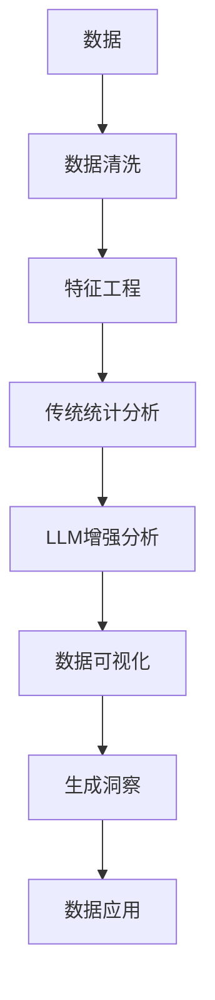

                 

# 数据分析师：LLM 增强的数据洞察力

> 关键词：大数据, 自然语言处理(NLP), 增强分析, 数据分析师, 长文本, 上下文理解, 语义分析, 机器学习, 人工智能(AI)

## 1. 背景介绍

在数据驱动的时代，数据分析师在企业决策过程中扮演着至关重要的角色。他们不仅需要具备熟练的数据操作技能，还需具有敏锐的数据洞察力和高效的数据分析能力。然而，面对海量数据，如何提升数据洞察力，降低数据处理难度，已成为数据科学家关注的焦点。传统的统计分析和数据挖掘方法虽然强大，但面对大规模数据时仍显得力不从心。近年来，自然语言处理(NLP)技术的兴起为数据分析师提供了新的解决方案。本文将探讨LLM（Large Language Model，大语言模型）如何增强数据分析师的洞察力，并介绍基于LLM的增强分析方法。

## 2. 核心概念与联系

### 2.1 核心概念概述

为更好地理解LLM在数据分析中的应用，本节将介绍几个核心概念：

- **LLM**：指以Transformer为代表的深度学习模型，通过大规模无监督学习训练，能够理解自然语言并生成连贯的文本。常见的LLM模型包括GPT、BERT、XLNet等。

- **增强分析**：指利用先进的算法和技术，对传统数据分析方法进行补充和优化，以提升数据分析的效率和精度。增强分析广泛应用于商业智能(BI)、财务分析、市场研究等多个领域。

- **自然语言处理(NLP)**：涉及计算机如何处理和理解人类语言的技术，包括文本分类、情感分析、实体识别、机器翻译等任务。

- **上下文理解**：指LLM在处理文本时，能够综合利用文本中的上下文信息，准确把握句子含义，理解段落语义。

- **语义分析**：指对文本进行语义层面的理解和分析，如抽取关键信息、挖掘文本含义等。

这些核心概念通过特定的技术手段和方法，相互结合，共同提升数据分析师的数据洞察力。

### 2.2 核心概念原理和架构的 Mermaid 流程图(Mermaid 流程节点中不要有括号、逗号等特殊字符)



这个流程图展示了数据分析师利用LLM进行增强分析的基本流程：

1. **数据清洗**：对原始数据进行清洗和预处理，去除噪声和错误数据。
2. **特征工程**：构建有意义的特征，提升模型训练效果。
3. **传统统计分析**：应用常见的统计和分析方法，如回归分析、聚类分析等。
4. **LLM增强分析**：利用LLM的上下文理解能力，进行更深入的语义分析。
5. **数据可视化**：使用可视化工具展示分析结果，便于理解。
6. **生成洞察**：通过分析结果，提炼出可操作的业务洞察。
7. **数据应用**：将分析结果应用于实际业务场景，提升决策支持。

接下来，我们将详细探讨LLM在各个环节中的具体应用。

## 3. 核心算法原理 & 具体操作步骤

### 3.1 算法原理概述

基于LLM的增强分析，本质上是一种结合了语言理解和数据分析的复合技术。其核心思想是：利用LLM在理解文本上下文、提取语义信息方面的强大能力，为数据分析提供更丰富、更精准的数据视角。

具体而言，LLM在处理文本时，能够识别文本中的关键信息、语义关系，并进行语义推断，从而在分析过程中发挥重要作用。这种能力使得LLM在数据处理、文本摘要、实体抽取、情感分析等任务中表现出色，成为数据分析师的有力助手。

### 3.2 算法步骤详解

基于LLM的增强分析流程包括如下几个关键步骤：

**Step 1: 数据预处理**
- 对原始数据进行清洗、归一化等预处理，保证数据质量。
- 将数据转换为LLM可处理的文本形式。

**Step 2: 构建语料库**
- 收集与分析主题相关的文本数据，构建语料库。
- 对语料库进行分词、去除停用词等处理。

**Step 3: 训练LLM模型**
- 选择预训练的LLM模型，如GPT、BERT等。
- 在构建的语料库上对模型进行微调，优化上下文理解能力。

**Step 4: 文本分析**
- 将分析任务中的文本输入LLM，利用其上下文理解能力提取关键信息。
- 使用预训练模型进行文本分类、情感分析、实体识别等。

**Step 5: 数据分析**
- 将提取的关键信息、语义关系与传统分析方法结合，提升数据分析效果。
- 使用数据可视化工具展示分析结果。

**Step 6: 生成洞察**
- 基于分析结果，提炼出可操作的业务洞察。
- 将洞察应用于实际业务决策。

### 3.3 算法优缺点

基于LLM的增强分析方法具有以下优点：

1. **提高数据洞察力**：LLM能够理解复杂的文本信息，提取关键语义，帮助数据分析师发现数据中隐藏的关联和模式。
2. **提升分析效率**：LLM可以自动化处理大量文本数据，显著降低数据分析师的工作量。
3. **增强数据解释力**：LLM能够将复杂的文本数据转化为易于理解的格式，提升数据解释力和透明度。
4. **灵活应用场景**：LLM在多种数据处理任务中表现优异，可以灵活应用于商业智能、市场研究、财务分析等多个领域。

然而，该方法也存在以下局限：

1. **对标注数据依赖**：微调模型的效果很大程度上依赖于标注数据的质量和数量，标注成本较高。
2. **模型计算量大**：LLM需要大量计算资源进行训练和推理，对硬件要求较高。
3. **结果可解释性差**：LLM作为黑盒模型，其决策过程难以解释，缺乏透明度。
4. **模型泛化能力不足**：在大规模数据集上进行微调时，模型可能出现过拟合，泛化能力不足。

尽管存在这些局限，但基于LLM的增强分析方法在数据分析中的应用前景依然广阔。未来研究将进一步优化模型训练方法，降低对标注数据的依赖，提升模型的可解释性和泛化能力，使LLM成为更加强大的数据分析助手。

### 3.4 算法应用领域

基于LLM的增强分析方法，已在多个领域取得了显著成果。以下是其主要应用场景：

- **商业智能(BI)**：利用LLM对企业内部数据进行深入分析，提取关键指标和趋势，辅助决策制定。
- **财务分析**：对财务报表、市场新闻等文本数据进行情感分析、实体识别，发现潜在风险和机会。
- **市场研究**：通过分析社交媒体、新闻评论等数据，了解消费者行为和市场趋势。
- **客户分析**：对客户反馈、评论等文本数据进行语义分析，提升客户满意度。
- **医疗分析**：利用病历记录、医疗新闻等文本数据，发现潜在的疾病风险和诊断方法。

## 4. 数学模型和公式 & 详细讲解 & 举例说明

### 4.1 数学模型构建

基于LLM的增强分析可以建模如下：

设原始数据集为 $D=\{(x_i, y_i)\}_{i=1}^N$，其中 $x_i$ 为文本样本，$y_i$ 为标签。

**模型定义**：使用预训练的LLM模型 $M_{\theta}$ 作为基础模型，其中 $\theta$ 为模型参数。

**损失函数**：定义损失函数 $\mathcal{L}(\theta)$ 衡量模型在数据集上的表现。

**优化目标**：最小化损失函数，即 $\theta^*=\mathop{\arg\min}_{\theta}\mathcal{L}(\theta)$。

### 4.2 公式推导过程

以情感分析为例，假设原始数据集为 $(X,Y)$，其中 $X$ 为文本样本，$Y$ 为情感标签。

**编码过程**：
- 将文本样本 $x$ 输入LLM模型，得到输出 $\hat{y}$。
- 使用预定义的情感分类器对 $\hat{y}$ 进行二分类。

**损失函数**：
$$
\mathcal{L}(\theta) = -\frac{1}{N}\sum_{i=1}^N [y_i \log \hat{y_i} + (1-y_i) \log (1-\hat{y_i})]
$$

**优化过程**：
- 使用梯度下降等优化算法，最小化损失函数 $\mathcal{L}(\theta)$。
- 更新模型参数 $\theta$。

### 4.3 案例分析与讲解

假设某公司希望通过社交媒体数据了解客户对其产品的情感倾向。他们使用BERT模型进行情感分析，具体步骤如下：

1. **数据准备**：收集社交媒体评论，将评论转换为BERT可处理的文本形式。
2. **模型微调**：在评论数据集上微调BERT模型，优化情感分类效果。
3. **情感分析**：将新的评论输入微调后的模型，获取情感分类结果。
4. **数据分析**：根据情感分析结果，分析客户对产品的总体情感倾向。
5. **洞察生成**：基于分析结果，生成可操作的业务洞察，如调整产品策略、优化客户体验等。

## 5. 项目实践：代码实例和详细解释说明

### 5.1 开发环境搭建

在进行LLM增强分析实践前，我们需要准备好开发环境。以下是使用Python进行PyTorch开发的环境配置流程：

1. 安装Anaconda：从官网下载并安装Anaconda，用于创建独立的Python环境。

2. 创建并激活虚拟环境：
```bash
conda create -n llm-env python=3.8 
conda activate llm-env
```

3. 安装PyTorch：根据CUDA版本，从官网获取对应的安装命令。例如：
```bash
conda install pytorch torchvision torchaudio cudatoolkit=11.1 -c pytorch -c conda-forge
```

4. 安装相关工具包：
```bash
pip install transformers scikit-learn pandas matplotlib tqdm jupyter notebook ipython
```

完成上述步骤后，即可在`llm-env`环境中开始LLM增强分析实践。

### 5.2 源代码详细实现

下面我们以BERT模型为例，给出使用Transformers库进行情感分析的PyTorch代码实现。

```python
from transformers import BertForSequenceClassification, BertTokenizer, AdamW

# 初始化模型和分词器
model = BertForSequenceClassification.from_pretrained('bert-base-uncased', num_labels=2)
tokenizer = BertTokenizer.from_pretrained('bert-base-uncased')

# 定义优化器和学习率
optimizer = AdamW(model.parameters(), lr=2e-5)

# 准备数据
train_data = ...
dev_data = ...
test_data = ...

# 定义训练和评估函数
def train_epoch(model, dataset, batch_size, optimizer):
    model.train()
    for batch in dataset:
        inputs = tokenizer(batch['text'], return_tensors='pt', padding=True, truncation=True, max_length=512)
        labels = batch['label']
        outputs = model(**inputs)
        loss = outputs.loss
        optimizer.zero_grad()
        loss.backward()
        optimizer.step()

def evaluate(model, dataset, batch_size):
    model.eval()
    preds, labels = [], []
    for batch in dataset:
        inputs = tokenizer(batch['text'], return_tensors='pt', padding=True, truncation=True, max_length=512)
        labels = batch['label']
        outputs = model(**inputs)
        preds.append(outputs.logits.argmax(dim=1).tolist())
        labels.append(labels.tolist())
    return preds, labels

# 训练和评估模型
epochs = 3
batch_size = 16

for epoch in range(epochs):
    train_epoch(model, train_data, batch_size, optimizer)
    preds, labels = evaluate(model, dev_data, batch_size)
    print(classification_report(labels, preds))

print("测试集评估结果：")
preds, labels = evaluate(model, test_data, batch_size)
print(classification_report(labels, preds))
```

以上就是使用PyTorch对BERT进行情感分析的完整代码实现。可以看到，通过使用Transformers库，我们可以快速搭建起基于BERT的情感分析模型，并进行微调。

### 5.3 代码解读与分析

让我们再详细解读一下关键代码的实现细节：

**BERT模型初始化**：
- 使用`BertForSequenceClassification`类初始化情感分析模型，指定标签数为2。
- 使用`BertTokenizer`类初始化分词器。

**模型微调**：
- 使用`AdamW`优化器进行模型训练，设置学习率。
- 在训练集上使用`train_epoch`函数进行微调，更新模型参数。

**数据处理**：
- 使用`tokenizer`将文本数据转换为BERT可处理的格式。
- 将文本数据和标签数据转换为模型所需的输入格式。

**评估过程**：
- 在验证集和测试集上使用`evaluate`函数评估模型性能。
- 使用`classification_report`函数打印分类报告。

**训练流程**：
- 循环训练多个epoch。
- 在每个epoch结束后，在验证集上评估模型性能。
- 在测试集上评估最终模型性能。

## 6. 实际应用场景

### 6.1 商业智能

在商业智能领域，LLM能够帮助企业深入挖掘数据，发现隐藏在数据中的商业机会。例如，某电子商务公司希望通过客户评论数据了解客户的购买行为和满意度。他们使用BERT模型对客户评论进行情感分析，分析客户对产品的情感倾向，从而优化产品设计和营销策略。

### 6.2 市场研究

市场研究中，数据通常以非结构化的形式存在，如新闻文章、社交媒体评论等。LLM能够对这些文本数据进行自动分析，提取出关键的业务洞察。例如，某广告公司希望通过社交媒体评论了解市场趋势。他们使用BERT模型对评论进行情感分析，分析市场对不同广告的反馈，调整广告投放策略。

### 6.3 客户分析

客户分析中，LLM能够从客户反馈中提取出有价值的信息，帮助企业提升客户满意度。例如，某银行希望通过客户投诉数据了解客户对服务的满意度。他们使用BERT模型对投诉内容进行情感分析，分析客户的不满意点，从而改进服务质量。

### 6.4 医疗分析

在医疗领域，LLM能够帮助医生从病历记录中提取出有价值的医疗信息。例如，某医院希望通过病历记录分析患者的疾病风险。他们使用BERT模型对病历记录进行情感分析，分析患者的情绪状态，从而制定个性化的治疗方案。

## 7. 工具和资源推荐

### 7.1 学习资源推荐

为了帮助开发者系统掌握LLM增强分析的理论基础和实践技巧，这里推荐一些优质的学习资源：

1. 《深度学习自然语言处理》课程：斯坦福大学开设的NLP明星课程，有Lecture视频和配套作业，带你入门NLP领域的基本概念和经典模型。

2. CS224N《自然语言处理与深度学习》课程：斯坦福大学开设的NLP经典课程，涵盖NLP的多个热门话题，适合深度学习领域的专业人士学习。

3. 《自然语言处理与深度学习》书籍：由多位NLP专家合著，全面介绍了NLP领域的理论和实践，适合深入学习和研究。

4. 《BERT中文NLP》书籍：由中文社区的NLP专家撰写，介绍了BERT在中文领域的应用，提供了详细的代码实现。

5. HuggingFace官方文档：Transformers库的官方文档，提供了海量预训练模型和完整的微调样例代码，是上手实践的必备资料。

通过对这些资源的学习实践，相信你一定能够快速掌握LLM增强分析的精髓，并用于解决实际的NLP问题。

### 7.2 开发工具推荐

高效的开发离不开优秀的工具支持。以下是几款用于LLM增强分析开发的常用工具：

1. PyTorch：基于Python的开源深度学习框架，灵活动态的计算图，适合快速迭代研究。

2. TensorFlow：由Google主导开发的开源深度学习框架，生产部署方便，适合大规模工程应用。

3. Transformers库：HuggingFace开发的NLP工具库，集成了众多SOTA语言模型，支持PyTorch和TensorFlow，是进行增强分析任务的利器。

4. Weights & Biases：模型训练的实验跟踪工具，可以记录和可视化模型训练过程中的各项指标，方便对比和调优。

5. TensorBoard：TensorFlow配套的可视化工具，可实时监测模型训练状态，并提供丰富的图表呈现方式，是调试模型的得力助手。

6. Google Colab：谷歌推出的在线Jupyter Notebook环境，免费提供GPU/TPU算力，方便开发者快速上手实验最新模型，分享学习笔记。

合理利用这些工具，可以显著提升LLM增强分析任务的开发效率，加快创新迭代的步伐。

### 7.3 相关论文推荐

LLM增强分析技术的发展源于学界的持续研究。以下是几篇奠基性的相关论文，推荐阅读：

1. Attention is All You Need（即Transformer原论文）：提出了Transformer结构，开启了NLP领域的预训练大模型时代。

2. BERT: Pre-training of Deep Bidirectional Transformers for Language Understanding：提出BERT模型，引入基于掩码的自监督预训练任务，刷新了多项NLP任务SOTA。

3. Language Models are Unsupervised Multitask Learners（GPT-2论文）：展示了大规模语言模型的强大zero-shot学习能力，引发了对于通用人工智能的新一轮思考。

4. Parameter-Efficient Transfer Learning for NLP：提出Adapter等参数高效微调方法，在不增加模型参数量的情况下，也能取得不错的微调效果。

5. Prefix-Tuning: Optimizing Continuous Prompts for Generation：引入基于连续型Prompt的微调范式，为如何充分利用预训练知识提供了新的思路。

6. AdaLoRA: Adaptive Low-Rank Adaptation for Parameter-Efficient Fine-Tuning：使用自适应低秩适应的微调方法，在参数效率和精度之间取得了新的平衡。

这些论文代表了大语言模型增强分析的发展脉络。通过学习这些前沿成果，可以帮助研究者把握学科前进方向，激发更多的创新灵感。

## 8. 总结：未来发展趋势与挑战

### 8.1 总结

本文对基于LLM的增强分析方法进行了全面系统的介绍。首先阐述了LLM在数据分析中的应用背景和意义，明确了LLM在提升数据分析师洞察力方面的独特价值。其次，从原理到实践，详细讲解了基于LLM的增强分析数学模型和关键步骤，给出了增强分析任务开发的完整代码实例。同时，本文还广泛探讨了LLM在商业智能、市场研究、客户分析等多个行业领域的应用前景，展示了LLM增强分析的广阔应用空间。此外，本文精选了增强分析技术的各类学习资源，力求为读者提供全方位的技术指引。

通过本文的系统梳理，可以看到，基于LLM的增强分析方法在数据驱动决策中发挥着重要作用，大幅提升了数据分析师的数据洞察力，推动了数据分析技术的发展。未来，伴随预训练语言模型和微调方法的持续演进，相信LLM增强分析将带来更加强大的数据处理能力和更广阔的应用场景，为构建智能化的数据驱动决策提供新的技术路径。

### 8.2 未来发展趋势

展望未来，基于LLM的增强分析技术将呈现以下几个发展趋势：

1. **智能化水平提升**：未来的LLM模型将具备更强的上下文理解能力和语义推断能力，能够更深入地理解文本数据，提供更有价值的洞察。
2. **多模态数据融合**：LLM在处理文本数据的同时，逐步扩展到图像、视频、语音等多模态数据的处理，提升数据融合和分析效果。
3. **数据增强技术应用**：利用数据增强技术，提升模型鲁棒性和泛化能力，进一步降低数据处理难度。
4. **自动化数据清洗**：引入自动化数据清洗技术，减少人工干预，提升数据处理效率。
5. **自适应学习**：开发自适应学习算法，使模型能够根据数据分布的变化进行动态调整，增强模型泛化能力。
6. **隐私保护**：采用差分隐私、联邦学习等技术，保护数据隐私，提升数据处理的安全性。

以上趋势凸显了基于LLM的增强分析技术的广阔前景。这些方向的探索发展，必将进一步提升数据分析的质量和效率，使数据分析师能够更高效地处理和分析海量数据。

### 8.3 面临的挑战

尽管基于LLM的增强分析技术已经取得了显著进展，但在迈向更加智能化、普适化应用的过程中，仍面临诸多挑战：

1. **对标注数据依赖**：微调模型的效果很大程度上依赖于标注数据的质量和数量，标注成本较高。如何进一步降低微调对标注数据的依赖，将是一大难题。
2. **模型计算量大**：LLM需要大量计算资源进行训练和推理，对硬件要求较高。
3. **结果可解释性差**：LLM作为黑盒模型，其决策过程难以解释，缺乏透明度。
4. **模型泛化能力不足**：在大规模数据集上进行微调时，模型可能出现过拟合，泛化能力不足。

尽管存在这些挑战，但基于LLM的增强分析方法在数据分析中的应用前景依然广阔。未来研究将进一步优化模型训练方法，降低对标注数据的依赖，提升模型的可解释性和泛化能力，使LLM成为更加强大的数据分析助手。

### 8.4 研究展望

面对基于LLM的增强分析所面临的种种挑战，未来的研究需要在以下几个方面寻求新的突破：

1. **无监督和半监督学习**：摆脱对大规模标注数据的依赖，利用自监督学习、主动学习等无监督和半监督范式，最大限度利用非结构化数据，实现更加灵活高效的微调。
2. **参数高效微调**：开发更加参数高效的微调方法，在固定大部分预训练参数的同时，只更新极少量的任务相关参数。
3. **因果分析和博弈论工具**：将因果分析方法引入微调模型，识别出模型决策的关键特征，增强输出解释的因果性和逻辑性。借助博弈论工具刻画人机交互过程，主动探索并规避模型的脆弱点，提高系统稳定性。
4. **多模态数据处理**：将符号化的先验知识，如知识图谱、逻辑规则等，与神经网络模型进行巧妙融合，引导微调过程学习更准确、合理的语言模型。同时加强不同模态数据的整合，实现视觉、语音等多模态信息与文本信息的协同建模。
5. **模型压缩与优化**：开发模型压缩和优化技术，如剪枝、量化、蒸馏等，减小模型规模，提升推理速度，优化资源占用。
6. **多任务学习**：利用多任务学习，在多个任务间共享特征表示，提升模型的泛化能力和迁移能力。
7. **跨领域模型迁移**：研究跨领域模型迁移技术，提升模型在特定领域的表现。

这些研究方向的探索，必将引领基于LLM的增强分析技术迈向更高的台阶，为构建智能化的数据驱动决策提供新的技术路径。面向未来，基于LLM的增强分析技术还需要与其他人工智能技术进行更深入的融合，如知识表示、因果推理、强化学习等，多路径协同发力，共同推动数据分析技术的进步。只有勇于创新、敢于突破，才能不断拓展LLM的边界，使智能技术更好地造福人类社会。

## 9. 附录：常见问题与解答

**Q1：LLM在数据分析中主要用于哪些任务？**

A: LLM在数据分析中主要应用于情感分析、文本分类、实体识别、关系抽取、语义分析等任务。通过理解文本的上下文信息，LLM能够提取关键信息，帮助数据分析师发现数据中的隐含模式和关联。

**Q2：LLM在数据预处理阶段需要做哪些工作？**

A: 数据预处理是LLM增强分析的重要环节，主要包括数据清洗、分词、去除停用词、标准化等。数据预处理的目标是保证数据质量，提升模型训练效果。

**Q3：LLM在训练过程中如何优化上下文理解能力？**

A: LLM在训练过程中，通常会在大规模语料库上微调模型，提升其上下文理解能力。微调时，可以使用自定义的损失函数、优化算法等技术，根据具体任务优化模型的表现。

**Q4：LLM在模型推理过程中需要注意哪些问题？**

A: 模型推理过程中，需要注意模型的推理速度、计算资源占用、推理准确性等问题。为了提升推理效率，可以采用模型压缩、量化加速等技术。

**Q5：LLM在实际应用中如何保护数据隐私？**

A: 在实际应用中，LLM可以通过差分隐私、联邦学习等技术，保护数据隐私。这些技术能够在模型训练和推理过程中，防止敏感数据泄露，提升数据处理的安全性。

综上所述，基于LLM的增强分析技术在数据驱动决策中发挥着重要作用，有助于提升数据分析师的数据洞察力和决策效率。通过系统学习和实践，相信广大数据分析师能够掌握LLM在数据处理和分析中的高效应用，提升自身的能力和水平。

---

作者：禅与计算机程序设计艺术 / Zen and the Art of Computer Programming

