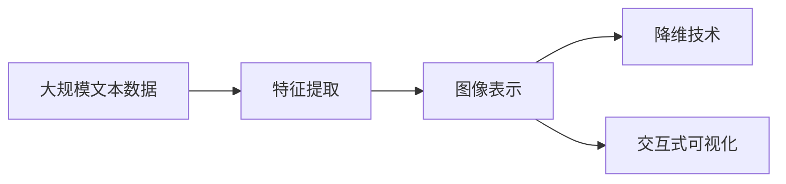

                 

# 文本可视化：大规模文本数据的直观呈现

> 关键词：文本可视化,大规模文本数据,自然语言处理,NLP,深度学习,神经网络,图像表示,降维技术,交互式可视化

## 1. 背景介绍

### 1.1 问题由来
随着互联网和社交媒体的爆炸性增长，大规模文本数据正以惊人的速度积累。这些数据来源广泛，包括新闻、评论、社交媒体帖子、电子书、学术论文等。如何有效管理和利用这些文本数据，是大规模文本处理中的一个重要挑战。

文本可视化的核心思想是将文本数据转换为图形或图像表示，从而让人们更容易理解和分析文本的复杂结构。这不仅有助于快速识别文本中的模式和趋势，还可以支持数据分析、文本挖掘、内容推荐等应用。

### 1.2 问题核心关键点
文本可视化依赖于数据科学、计算机视觉、自然语言处理(NLP)等多个领域的技术。其核心关键点包括：

1. **数据处理**：如何将大规模文本数据转换为可视化对象。
2. **特征提取**：从文本中提取哪些特征作为可视化输入。
3. **图像表示**：如何将文本特征映射到图形或图像表示。
4. **降维技术**：如何处理高维文本数据，使其能够在可视化中展现。
5. **交互性**：如何让可视化工具与用户进行互动，提供更丰富的交互体验。

本文将深入探讨文本可视化的核心概念、算法原理及操作步骤，并通过实际案例和代码实例进行详细讲解。

## 2. 核心概念与联系

### 2.1 核心概念概述

文本可视化主要涉及以下几个核心概念：

- **大规模文本数据**：指的是来自于互联网、社交媒体等来源的大量文本数据。
- **特征提取**：从文本中提取出用于可视化的特征，如单词频次、主题分布、情感倾向等。
- **图像表示**：将提取出的特征映射为图形或图像，以直观形式呈现。
- **降维技术**：将高维文本数据降维到低维空间，便于可视化展示。
- **交互式可视化**：通过交互式工具，使用户能够动态地探索和分析文本数据。

这些概念之间通过文本处理、特征提取、图像表示和降维技术相联系，最终实现文本数据的可视化。

### 2.2 核心概念原理和架构的 Mermaid 流程图



该流程图展示了文本可视化的基本流程：首先从大规模文本数据中提取特征，然后通过图像表示技术将特征转换为图形或图像，接着使用降维技术简化数据维度，最后通过交互式可视化工具进行呈现。

## 3. 核心算法原理 & 具体操作步骤

### 3.1 算法原理概述

文本可视化的核心算法主要分为数据预处理、特征提取、图像表示和降维技术等几个步骤。以下是各步骤的算法原理概述：

1. **数据预处理**：清洗、分词、去除停用词等。
2. **特征提取**：TF-IDF、词频统计、主题建模等。
3. **图像表示**：Word2Vec、GloVe、BERT等词向量模型。
4. **降维技术**：主成分分析(PCA)、t-SNE、UMAP等。

### 3.2 算法步骤详解

#### 3.2.1 数据预处理

数据预处理主要包括文本清洗、分词、去除停用词等步骤。具体步骤如下：

1. **文本清洗**：去除噪声、过滤掉不相关内容。
2. **分词**：将文本分割成词语或短语。
3. **去除停用词**：移除常用的但不含信息的词语，如“的”、“是”等。

#### 3.2.2 特征提取

特征提取是将文本数据转换为可用于可视化的特征表示。常用的特征提取方法包括：

1. **TF-IDF**：衡量一个词在文档中的重要性和普遍性。
2. **词频统计**：计算每个词在文本中出现的频率。
3. **主题建模**：如Latent Dirichlet Allocation (LDA)，发现文本中的主题。
4. **情感分析**：使用情感词典或机器学习方法，分析文本情感倾向。

#### 3.2.3 图像表示

图像表示是将文本特征转换为图形或图像表示。常用的图像表示方法包括：

1. **Word2Vec**：将词语映射到低维向量空间，通过相似性度量构建图像。
2. **GloVe**：与Word2Vec类似，但考虑全局词共现关系。
3. **BERT**：使用上下文编码的词向量，提供更丰富的语义信息。

#### 3.2.4 降维技术

降维技术是将高维数据转换为低维表示，便于可视化展示。常用的降维技术包括：

1. **PCA**：主成分分析，通过线性变换将数据降维。
2. **t-SNE**：t-Distributed Stochastic Neighbor Embedding，将数据映射到低维空间。
3. **UMAP**：Uniform Manifold Approximation and Projection，保持数据局部结构和全局结构。

### 3.3 算法优缺点

文本可视化具有以下优点：

1. **直观性**：图形和图像比文本更容易理解，特别是对于非技术人员。
2. **可视化复杂结构**：能够直观展示文本中的复杂结构和关系。
3. **发现模式和趋势**：通过可视化，可以发现文本中的模式和趋势。

同时，文本可视化也存在以下缺点：

1. **信息丢失**：高维数据在降维过程中可能会丢失信息。
2. **可视化质量依赖于数据**：不同文本数据可能需要不同的可视化方法。
3. **交互性局限**：交互式可视化的实现复杂，需要一定的技术储备。

### 3.4 算法应用领域

文本可视化技术广泛应用于多个领域，包括但不限于：

- **舆情分析**：通过可视化展示社交媒体上的情感和主题，分析舆情变化。
- **内容推荐**：分析用户兴趣，通过可视化推荐相关内容。
- **情感分析**：通过可视化展示文本情感分布，辅助情感分类。
- **文本分类**：通过可视化展示不同文本分类的分布，帮助分类器的开发和优化。
- **主题建模**：通过可视化展示主题分布，辅助主题模型训练。

## 4. 数学模型和公式 & 详细讲解 & 举例说明

### 4.1 数学模型构建

文本可视化的数学模型通常包括以下几个组成部分：

- **文本预处理**：包括文本清洗、分词、去除停用词等。
- **特征提取**：如TF-IDF、词频统计、主题建模等。
- **图像表示**：如Word2Vec、GloVe、BERT等词向量模型。
- **降维技术**：如PCA、t-SNE、UMAP等。

### 4.2 公式推导过程

#### 4.2.1 TF-IDF

TF-IDF是衡量文本中词语重要性的方法，其公式如下：

$$
\text{TF-IDF}(t, d, D) = \text{TF}(t, d) \times \text{IDF}(t, D)
$$

其中，$\text{TF}(t, d)$表示词语$t$在文档$d$中的词频，$\text{IDF}(t, D)$表示词语$t$在文档集合$D$中的逆文档频率。

#### 4.2.2 词向量模型

Word2Vec和GloVe是常用的词向量模型，其基本思想是将词语映射到低维向量空间，并使用相似性度量构建图像。公式如下：

$$
\text{Word2Vec}(w_i, w_j) = \cos(\theta) = \frac{\mathbf{w}_i \cdot \mathbf{w}_j}{\|\mathbf{w}_i\|\|\mathbf{w}_j\|}
$$

其中，$\mathbf{w}_i$和$\mathbf{w}_j$分别为词语$i$和词语$j$的词向量。

#### 4.2.3 降维技术

PCA和t-SNE是常用的降维技术，公式如下：

$$
\mathbf{X}_{PCA} = \mathbf{U} \mathbf{X}
$$

$$
\mathbf{Y}_{t-SNE} = \mathbf{A}^{\frac{1}{2}} \mathbf{X}
$$

其中，$\mathbf{X}$为原始数据，$\mathbf{U}$为PCA的特征值和特征向量矩阵，$\mathbf{A}$为t-SNE的Kullback-Leibler散度矩阵。

### 4.3 案例分析与讲解

#### 4.3.1 舆情分析

舆情分析是将社交媒体上的情感和主题可视化，以便快速了解舆情变化。通过可视化，可以直观展示不同时间段的情感分布和主题分布，帮助分析师识别关键事件和趋势。

具体实现步骤如下：

1. **数据收集**：从社交媒体平台获取文本数据。
2. **文本清洗**：去除噪声、过滤掉不相关内容。
3. **情感分析**：使用情感词典或机器学习方法，分析文本情感倾向。
4. **主题建模**：如LDA，发现文本中的主题。
5. **可视化展示**：使用可视化工具，如Tableau、Plotly，展示情感分布和主题分布。

#### 4.3.2 内容推荐

内容推荐是将用户兴趣可视化，以便推荐相关内容。通过可视化，可以直观展示用户兴趣的分布，帮助推荐系统优化推荐策略。

具体实现步骤如下：

1. **数据收集**：收集用户的历史行为数据，如点击、浏览、收藏等。
2. **特征提取**：提取用户行为特征，如点击次数、浏览时间等。
3. **降维技术**：使用PCA或t-SNE，将用户行为数据降维。
4. **可视化展示**：使用可视化工具，如D3.js、Highcharts，展示用户兴趣的分布。
5. **推荐系统**：基于用户兴趣的分布，推荐相关内容。

## 5. 项目实践：代码实例和详细解释说明

### 5.1 开发环境搭建

在进行文本可视化实践前，我们需要准备好开发环境。以下是使用Python进行可视化开发的环境配置流程：

1. 安装Anaconda：从官网下载并安装Anaconda，用于创建独立的Python环境。

2. 创建并激活虚拟环境：
```bash
conda create -n vis_env python=3.8 
conda activate vis_env
```

3. 安装Python库：
```bash
pip install matplotlib seaborn pandas numpy scikit-learn jupyter notebook
```

4. 安装可视化工具：
```bash
pip install plotly
```

5. 安装数据处理和分析库：
```bash
pip install nltk gensim
```

完成上述步骤后，即可在`vis_env`环境中开始可视化实践。

### 5.2 源代码详细实现

下面以Word2Vec词向量模型和t-SNE降维技术为例，给出使用Python和Plotly进行文本可视化的代码实现。

```python
import plotly.express as px
from gensim.models import Word2Vec
from sklearn.decomposition import TruncatedSVD

# 构建Word2Vec模型
text_data = ["This is the first sentence", "This is the second sentence"]
model = Word2Vec(text_data, min_count=1)

# 计算词向量
word_vectors = model.wv

# 使用t-SNE进行降维
svd = TruncatedSVD(n_components=2)
reduced = svd.fit_transform(word_vectors)

# 可视化结果
fig = px.scatter(reduced, color=range(len(word_vectors)), size=range(len(word_vectors)))
fig.show()
```

### 5.3 代码解读与分析

这段代码主要实现了使用Word2Vec词向量模型和t-SNE降维技术，将文本数据转换为可视化图形的过程。

1. **构建Word2Vec模型**：首先，我们使用`gensim`库中的`Word2Vec`模型，构建了一个包含两个句子的文本语料。
2. **计算词向量**：通过`wv`属性，获取每个词语的词向量。
3. **使用t-SNE进行降维**：使用`scikit-learn`库中的`TruncatedSVD`方法，将高维的词向量降维到二维空间。
4. **可视化结果**：使用`plotly.express`库中的`scatter`函数，将降维后的结果可视化展示。

## 6. 实际应用场景

### 6.1 舆情分析

舆情分析是大规模文本数据可视化的重要应用场景之一。通过可视化展示社交媒体上的情感和主题，舆情分析能够帮助企业快速了解舆情变化，预测市场趋势。

#### 6.1.1 数据收集

从社交媒体平台获取文本数据，如Twitter、Facebook等。可以使用API接口或爬虫技术自动抓取数据。

#### 6.1.2 情感分析

使用情感分析工具，如TextBlob、NLTK等，分析文本情感倾向。

#### 6.1.3 主题建模

使用主题建模算法，如LDA，发现文本中的主题。

#### 6.1.4 可视化展示

使用可视化工具，如Tableau、Plotly等，展示情感分布和主题分布。

### 6.2 内容推荐

内容推荐是大规模文本数据可视化的另一个重要应用场景。通过可视化展示用户兴趣的分布，推荐系统可以优化推荐策略，提高推荐效果。

#### 6.2.1 数据收集

收集用户的历史行为数据，如点击、浏览、收藏等。可以使用网站日志、应用记录等。

#### 6.2.2 特征提取

提取用户行为特征，如点击次数、浏览时间等。

#### 6.2.3 降维技术

使用降维技术，如PCA或t-SNE，将用户行为数据降维。

#### 6.2.4 可视化展示

使用可视化工具，如D3.js、Highcharts等，展示用户兴趣的分布。

## 7. 工具和资源推荐

### 7.1 学习资源推荐

为了帮助开发者系统掌握文本可视化的理论基础和实践技巧，这里推荐一些优质的学习资源：

1. 《Python数据可视化基础》：一本介绍Python数据可视化基础的书，涵盖了Matplotlib、Seaborn、Plotly等常用库的使用。
2. 《Text Mining with Python》：介绍文本挖掘和可视化技术的实战书，包含TF-IDF、LDA等算法。
3. 《Machine Learning for Text Mining》：介绍机器学习在文本挖掘中的应用，包括文本分类、情感分析等。
4. 《Python for Data Analysis》：介绍Python数据分析和可视化的经典书籍，包含Pandas、Matplotlib等库的使用。
5. Coursera的《Data Science and Machine Learning Bootcamp》：涵盖数据科学和机器学习的系统课程，包含可视化、特征提取等内容。

通过对这些资源的学习实践，相信你一定能够快速掌握文本可视化的精髓，并用于解决实际的文本分析问题。

### 7.2 开发工具推荐

高效的开发离不开优秀的工具支持。以下是几款用于文本可视化开发的常用工具：

1. Matplotlib：基于Python的开源绘图库，支持多种图形类型和样式。
2. Seaborn：基于Matplotlib的高级绘图库，提供了更美观的图表样式。
3. Plotly：基于Web的交互式图表库，支持动态生成和展示交互式图表。
4. D3.js：基于Web的JavaScript库，支持动态生成和交互式图表。
5. Tableau：商业化的数据可视化工具，支持多种数据源和图表类型。

合理利用这些工具，可以显著提升文本可视化的开发效率，加快创新迭代的步伐。

### 7.3 相关论文推荐

文本可视化技术的发展源于学界的持续研究。以下是几篇奠基性的相关论文，推荐阅读：

1. "Learning Word Vectors for Sentimental Analysis"：提出Word2Vec模型，用于情感分析。
2. "A Latent Variable Model for Document Topic Modeling"：介绍LDA主题建模算法。
3. "FastText for Sequence Labeling: Supervised Word Representations for Named Entity Recognition and Sentiment Analysis"：提出FastText模型，用于命名实体识别和情感分析。
4. "GloVe: Global Vectors for Word Representation"：提出GloVe模型，用于词向量表示。
5. "Scalable Text Mining: Parallel, Distributed, and Cloud-Based Techniques"：介绍大规模文本数据处理的最新技术。

这些论文代表了大规模文本数据可视化的发展脉络。通过学习这些前沿成果，可以帮助研究者把握学科前进方向，激发更多的创新灵感。

## 8. 总结：未来发展趋势与挑战

### 8.1 研究成果总结

文本可视化技术在大规模文本处理中已经取得了显著成果，尤其在舆情分析、内容推荐等领域发挥了重要作用。未来的发展趋势和挑战主要集中在以下几个方面：

1. **自动化和智能化**：通过机器学习技术，自动分析和可视化文本数据，减少人工干预。
2. **多模态融合**：将文本数据与其他数据源（如图像、视频）进行融合，提供更全面的信息展示。
3. **实时性**：提高文本可视化的实时性，以便实时监控和分析数据。
4. **交互性**：提供更丰富的交互体验，使用户能够动态探索和分析数据。
5. **跨领域应用**：将文本可视化技术应用于更多领域，如医疗、金融、教育等。

### 8.2 未来发展趋势

展望未来，文本可视化技术将呈现以下几个发展趋势：

1. **自动化和智能化**：自动化文本预处理和特征提取，减少人工干预，提高分析效率。
2. **多模态融合**：将文本数据与其他数据源（如图像、视频）进行融合，提供更全面的信息展示。
3. **实时性**：提高文本可视化的实时性，以便实时监控和分析数据。
4. **交互性**：提供更丰富的交互体验，使用户能够动态探索和分析数据。
5. **跨领域应用**：将文本可视化技术应用于更多领域，如医疗、金融、教育等。

### 8.3 面临的挑战

尽管文本可视化技术已经取得了显著成果，但在实际应用中仍面临一些挑战：

1. **数据质量和噪声**：大规模文本数据中存在大量噪声和不相关内容，影响可视化效果。
2. **算法复杂度**：一些复杂的算法（如LDA）计算量大，难以在大规模数据上实时运行。
3. **解释性不足**：可视化结果往往缺乏解释性，难以理解其背后的原理和逻辑。
4. **跨领域应用**：不同领域的文本数据结构和特征提取方法差异较大，难以通用。

### 8.4 研究展望

未来，文本可视化技术需要在以下几个方面进行深入研究：

1. **自动化和智能化**：开发自动化文本预处理和特征提取工具，减少人工干预。
2. **多模态融合**：研究如何将文本数据与其他数据源进行融合，提供更全面的信息展示。
3. **实时性**：开发实时文本可视化工具，提高分析效率。
4. **交互性**：提供更丰富的交互体验，使用户能够动态探索和分析数据。
5. **跨领域应用**：研究适用于不同领域的文本数据结构和特征提取方法。

## 9. 附录：常见问题与解答

### 9.1 Q1: 文本可视化有哪些常用的算法和技术？

A: 常用的算法和技术包括TF-IDF、Word2Vec、GloVe、LDA、PCA、t-SNE、UMAP等。

### 9.2 Q2: 文本可视化在实际应用中有哪些挑战？

A: 文本可视化在实际应用中面临数据质量、算法复杂度、解释性不足和跨领域应用等挑战。

### 9.3 Q3: 如何提高文本可视化的实时性？

A: 可以通过分布式计算、GPU加速等技术提高文本可视化的实时性。

### 9.4 Q4: 文本可视化如何提高交互性？

A: 可以通过交互式图表、动态展示、用户控制等技术提高文本可视化的交互性。

---

作者：禅与计算机程序设计艺术 / Zen and the Art of Computer Programming

