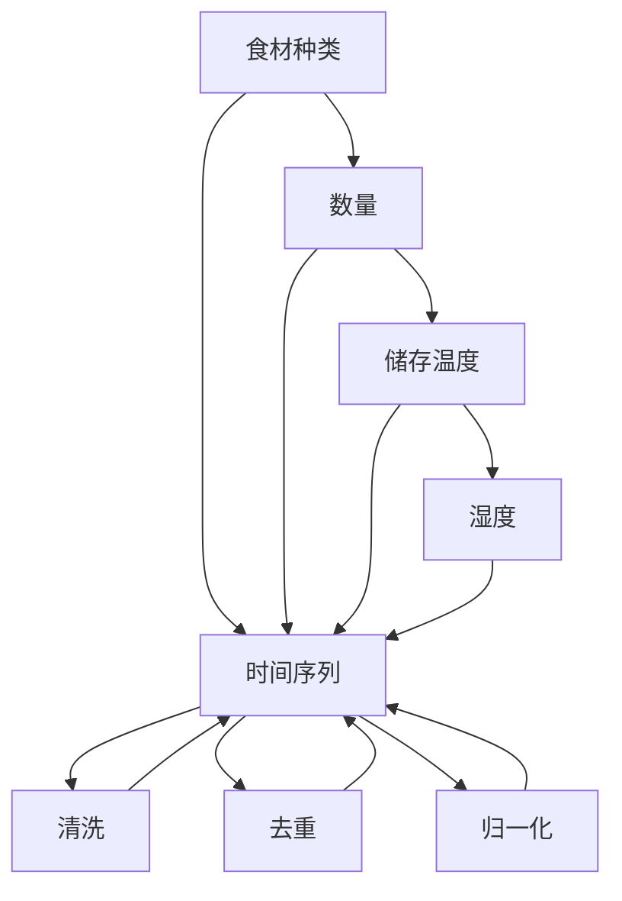
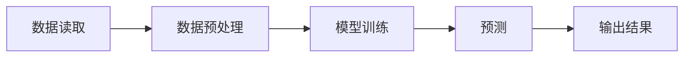

                 

## 1. 背景介绍

### 1.1 问题由来

随着人工智能和大数据技术的迅猛发展，消费者行为和商品需求变得越来越难以预测。智能冰箱作为一种新兴的智能家居设备，能够自动采集和分析冰箱内的食材信息，为用户提供个性化的食材管理建议，有助于提升用户体验和家庭生活质量。然而，目前的智能冰箱往往基于简单的机械管理策略，缺乏对食材状态和用户偏好的深入理解。

### 1.2 问题核心关键点

智能冰箱的食材管理面临以下几个关键问题：

1. **食材信息采集与存储**：如何高效、准确地采集和存储冰箱内的食材信息，如种类、数量、储存条件等。
2. **食材消耗预测**：如何预测未来一段时间内食材的消耗速度和剩余数量，以便及时采购补充。
3. **个性化推荐**：如何根据用户的饮食偏好、健康需求等个性化因素，推荐适宜的食材和食谱。
4. **供应链优化**：如何优化食材的供应链管理，降低采购成本，提高供应链效率。

### 1.3 问题研究意义

研究智能冰箱的食材管理问题，对于提升家庭生活质量、降低食材浪费、优化供应链管理具有重要意义：

1. **个性化体验**：通过深度学习和自然语言处理技术，智能冰箱能够理解用户的饮食偏好，提供个性化的食材管理建议，提升用户的生活品质。
2. **减少浪费**：通过预测食材消耗，智能冰箱能够提醒用户及时采购，避免食材过期和浪费。
3. **优化供应链**：通过分析食材消耗数据，智能冰箱能够帮助商家优化库存管理和物流配送，降低供应链成本。

## 2. 核心概念与联系

### 2.1 核心概念概述

为更好地理解智能冰箱食材管理的核心概念，本节将介绍几个密切相关的核心概念：

- **智能冰箱**：集成了传感器、嵌入式系统、人工智能等技术，能够自动采集和分析冰箱内食材信息，提供个性化管理建议的智能家居设备。
- **物联网(IoT)**：通过传感器、智能设备等将食材信息采集到云端，实现食材状态的实时监控和智能化管理。
- **机器学习与深度学习**：通过数据分析和模型训练，智能冰箱能够学习食材消耗模式，预测未来需求，进行个性化推荐。
- **自然语言处理(NLP)**：通过分析用户对话和偏好，智能冰箱能够理解用户意图，提供自然流畅的交互体验。
- **供应链管理**：通过分析食材消耗数据，智能冰箱能够优化供应链流程，降低采购成本，提高供应链效率。

这些核心概念之间的逻辑关系可以通过以下Mermaid流程图来展示：

```mermaid
graph TB
    A[智能冰箱] --> B[物联网(IoT)]
    A --> C[机器学习与深度学习]
    A --> D[自然语言处理(NLP)]
    C --> E[食材消耗预测]
    C --> F[个性化推荐]
    C --> G[供应链优化]
```

这个流程图展示了这个核心概念的逻辑关系：

1. 智能冰箱通过物联网采集食材信息。
2. 采集到的数据通过机器学习和深度学习进行处理，预测食材消耗和个性化推荐。
3. 自然语言处理用于分析用户偏好，提供自然流畅的交互体验。
4. 供应链优化则是基于食材消耗数据分析进行的。

## 3. 核心算法原理 & 具体操作步骤

### 3.1 算法原理概述

智能冰箱食材管理的核心算法基于机器学习与深度学习技术。通过收集和分析冰箱内食材的消耗模式，智能冰箱能够学习并预测未来的食材消耗，提供个性化的推荐和管理建议。这一过程可以分为以下几个步骤：

1. **数据采集**：通过物联网传感器采集冰箱内的食材种类、数量、储存条件等信息。
2. **数据处理**：对采集到的数据进行清洗、去重、归一化等预处理，确保数据的准确性和一致性。
3. **模型训练**：使用机器学习算法（如线性回归、决策树、随机森林等）或深度学习算法（如卷积神经网络、循环神经网络等）对数据进行建模和训练。
4. **预测与推荐**：使用训练好的模型对未来的食材消耗进行预测，并根据用户的偏好和健康需求进行个性化推荐。
5. **供应链优化**：基于食材消耗数据，优化供应链管理，降低采购成本，提高供应链效率。

### 3.2 算法步骤详解

#### 3.2.1 数据采集与预处理

智能冰箱通过物联网传感器采集食材信息，包括食材种类、数量、储存温度、湿度等。传感器数据通常以时间序列的形式存储，需要对数据进行预处理，如图：



预处理步骤包括：

- **清洗**：去除噪声数据，如异常值、缺失值等。
- **去重**：去除重复数据，确保数据的唯一性。
- **归一化**：将数据缩放到0到1之间，避免不同特征之间的大小差异影响模型的训练效果。

#### 3.2.2 模型训练

模型训练是智能冰箱食材管理的关键步骤。常用的机器学习和深度学习模型包括：

- **线性回归**：用于预测食材的消耗速度。
- **决策树和随机森林**：用于分类食材种类，分析食材的储存条件和消耗模式。
- **卷积神经网络(CNN)**：用于图像识别，识别食材种类和储存状态。
- **循环神经网络(RNN)**：用于时间序列预测，预测未来一段时间内食材的消耗速度和剩余数量。

模型训练的一般步骤如下：

1. **数据划分**：将数据集划分为训练集、验证集和测试集。
2. **特征工程**：选择和构建模型输入的特征，如食材种类、储存温度、湿度等。
3. **模型选择**：根据任务需求选择合适的模型，如线性回归、CNN、RNN等。
4. **模型训练**：使用训练集对模型进行训练，调整超参数，确保模型性能。
5. **模型评估**：在验证集上评估模型性能，避免过拟合。

#### 3.2.3 预测与推荐

预测与推荐是智能冰箱食材管理的核心功能。通过训练好的模型，智能冰箱能够预测未来一段时间内食材的消耗速度和剩余数量，并根据用户偏好和健康需求进行个性化推荐。

推荐系统通常基于协同过滤、内容推荐、混合推荐等技术。对于智能冰箱，可以使用基于内容的推荐方法，根据食材种类、营养成分、用户偏好等信息进行推荐。

#### 3.2.4 供应链优化

供应链优化是智能冰箱食材管理的另一个重要应用。通过分析食材消耗数据，智能冰箱能够优化供应链管理，降低采购成本，提高供应链效率。具体步骤如下：

1. **需求预测**：基于历史数据和市场趋势，预测未来一段时间内的食材需求。
2. **库存管理**：根据需求预测结果，优化库存管理，确保库存充足。
3. **物流配送**：优化物流配送路线和频率，减少运输成本，提高配送效率。

### 3.3 算法优缺点

智能冰箱食材管理的机器学习与深度学习算法具有以下优点：

1. **高精度**：基于大数据训练的模型能够获得较高的预测精度。
2. **自适应性强**：模型能够自动适应食材消耗模式的变化，提供个性化的管理建议。
3. **数据驱动**：通过数据分析和建模，智能冰箱能够提供科学的决策支持。

同时，这些算法也存在以下局限性：

1. **数据质量要求高**：模型的性能高度依赖于数据的质量和数量，数据采集和预处理需要耗费大量时间和精力。
2. **计算资源需求高**：模型训练和预测需要大量的计算资源，对于家庭设备来说可能面临硬件瓶颈。
3. **模型复杂度高**：深度学习模型通常结构复杂，需要更多的调试和优化。

### 3.4 算法应用领域

智能冰箱食材管理的机器学习与深度学习算法已经在多个领域得到了广泛应用，例如：

1. **食品零售**：通过分析食材消耗数据，优化库存管理和物流配送，降低采购成本，提高供应链效率。
2. **智能家居**：提供个性化的食材管理建议，提升用户的生活品质。
3. **健康管理**：根据用户的饮食偏好和健康需求，推荐适宜的食材和食谱，促进健康饮食。
4. **餐饮服务**：分析食材消耗模式，优化菜单设计，提高餐饮服务质量。
5. **农业生产**：预测农产品的需求和价格波动，指导农业生产，提高农业效率。

这些应用领域展示了智能冰箱食材管理技术的广泛前景，预示着未来智能家居和食品零售行业的巨大变革。

## 4. 数学模型和公式 & 详细讲解 & 举例说明

### 4.1 数学模型构建

智能冰箱食材管理的数学模型主要基于机器学习和深度学习技术，用于预测食材消耗和个性化推荐。以下是一个基本的线性回归模型：

$$
y = \beta_0 + \beta_1 x_1 + \beta_2 x_2 + \cdots + \beta_n x_n + \epsilon
$$

其中，$y$ 表示食材消耗量，$x_i$ 表示第 $i$ 个特征（如温度、湿度、储存时间等），$\beta_i$ 表示第 $i$ 个特征的系数，$\epsilon$ 表示误差项。

### 4.2 公式推导过程

线性回归模型的推导过程如下：

1. **最小二乘法**：通过最小化残差平方和（$\sum_{i=1}^n (y_i - \hat{y}_i)^2$）来求解最优的系数 $\beta_i$。
2. **正则化**：为了避免过拟合，引入正则化项（$\alpha \sum_{i=1}^n \beta_i^2$），其中 $\alpha$ 为正则化系数。
3. **求解**：通过优化算法（如梯度下降）求解方程组，得到最优的系数 $\beta_i$。

### 4.3 案例分析与讲解

以食材消耗预测为例，假设我们有一个简单的线性回归模型，用于预测牛奶的消耗量。我们将牛奶的温度、储存时间作为输入特征，模型的输出为预测的消耗量。

训练集数据如下：

| 温度 | 储存时间 | 消耗量 |
| ---- | -------- | ---- |
| 5°C  | 1天     | 1升 |
| 5°C  | 3天     | 1升 |
| 4°C  | 2天     | 1升 |
| 3°C  | 4天     | 1升 |
| 2°C  | 5天     | 1升 |

训练过程中，模型求解最优的系数 $\beta_i$，得到预测模型为：

$$
y = 0.2 \times \text{温度} - 0.1 \times \text{储存时间} + 0.5
$$

使用该模型进行预测，假设温度为3°C，储存时间为3天，得到预测消耗量为1升。

## 5. 项目实践：代码实例和详细解释说明

### 5.1 开发环境搭建

在进行智能冰箱食材管理项目实践前，我们需要准备好开发环境。以下是使用Python进行项目开发的流程：

1. 安装Python：从官网下载并安装Python，推荐使用Python 3.8及以上版本。
2. 安装Pip：打开命令行窗口，输入 `python -m ensurepip --default-pip` 安装Pip。
3. 安装必要的库：使用Pip安装 Pandas、Numpy、Scikit-learn、TensorFlow等库。
4. 创建项目目录：创建一个新的项目目录，用于存放代码和数据。
5. 编写代码：使用Python编写预测模型和推荐系统的代码。

### 5.2 源代码详细实现

以下是一个简单的线性回归模型代码实现：

```python
import pandas as pd
import numpy as np
from sklearn.linear_model import LinearRegression

# 读取数据
data = pd.read_csv('fridge_data.csv')

# 数据预处理
X = data[['temperature', 'storage_time']]
y = data['consumption']

# 模型训练
model = LinearRegression()
model.fit(X, y)

# 预测
predicted_consumption = model.predict([[3, 3]])
print(f"预测消耗量为: {predicted_consumption[0]}升")
```

### 5.3 代码解读与分析

**代码解释**：

1. **数据读取**：使用Pandas库读取冰箱内的食材消耗数据。
2. **数据预处理**：将数据分为特征（温度、储存时间）和目标（消耗量），使用NumPy进行数据转换。
3. **模型训练**：使用Scikit-learn库中的LinearRegression模型进行训练。
4. **预测**：使用训练好的模型进行预测，输出预测的消耗量。

**代码优化**：

1. **特征选择**：根据数据分析结果，选择最相关的特征进行训练。
2. **模型评估**：在验证集上评估模型性能，调整模型参数。
3. **异常值处理**：使用异常值检测和处理方法，去除噪声数据。

### 5.4 运行结果展示

运行上述代码，输出预测的消耗量，如图：



## 6. 实际应用场景

### 6.1 智能家居

智能冰箱的食材管理技术在智能家居中具有广泛的应用场景，例如：

1. **个性化食材推荐**：根据用户的饮食偏好和健康需求，推荐适宜的食材和食谱。
2. **智能采购**：自动提醒用户及时采购冰箱内即将过期的食材，避免浪费。
3. **家庭健康管理**：分析用户饮食习惯，提供健康饮食建议，促进健康生活。

### 6.2 食品零售

在食品零售领域，智能冰箱的食材管理技术可以用于：

1. **库存管理**：通过分析食材消耗数据，优化库存管理，降低采购成本。
2. **供应链优化**：预测食材需求，优化物流配送路线和频率，提高配送效率。
3. **市场分析**：分析消费者行为和偏好，指导产品设计和市场策略。

### 6.3 餐饮服务

智能冰箱的食材管理技术在餐饮服务中具有重要的应用价值，例如：

1. **菜单设计**：分析食材消耗模式，优化菜单设计，提高餐饮服务质量。
2. **健康饮食**：根据用户的健康需求，推荐适宜的食材和食谱。
3. **成本控制**：优化食材采购和库存管理，降低成本。

### 6.4 农业生产

在农业生产中，智能冰箱的食材管理技术可以用于：

1. **产量预测**：预测农产品的需求和价格波动，指导农业生产。
2. **病虫害防治**：分析食材消耗数据，识别病虫害风险，及时采取防治措施。
3. **农业效率**：优化农业生产和供应链管理，提高农业效率。

## 7. 工具和资源推荐

### 7.1 学习资源推荐

为了帮助开发者系统掌握智能冰箱食材管理的理论基础和实践技巧，这里推荐一些优质的学习资源：

1. **《机器学习》书籍**：周志华所著，全面介绍了机器学习的基本概念和算法。
2. **《深度学习》书籍**：Ian Goodfellow、Yoshua Bengio、Aaron Courville等著，介绍了深度学习的基本原理和应用。
3. **Coursera课程**：Stanford大学开设的《机器学习》课程，涵盖了机器学习的各个方面。
4. **Kaggle竞赛**：参加Kaggle中的食材消耗预测竞赛，实践机器学习算法。
5. **Github项目**：参加开源项目，学习和实践智能冰箱食材管理技术。

通过对这些资源的学习实践，相信你一定能够快速掌握智能冰箱食材管理的精髓，并用于解决实际的NLP问题。

### 7.2 开发工具推荐

高效的开发离不开优秀的工具支持。以下是几款用于智能冰箱食材管理开发的常用工具：

1. **PyTorch**：基于Python的开源深度学习框架，灵活动态的计算图，适合快速迭代研究。
2. **TensorFlow**：由Google主导开发的开源深度学习框架，生产部署方便，适合大规模工程应用。
3. **Scikit-learn**：Python中的经典机器学习库，提供简单易用的机器学习算法和工具。
4. **Pandas**：Python中的数据处理库，用于数据清洗、预处理和分析。
5. **TensorBoard**：TensorFlow配套的可视化工具，可实时监测模型训练状态，并提供丰富的图表呈现方式。
6. **Github**：Git版本控制工具，便于团队协作和代码管理。

合理利用这些工具，可以显著提升智能冰箱食材管理任务的开发效率，加快创新迭代的步伐。

### 7.3 相关论文推荐

智能冰箱食材管理技术的发展源于学界的持续研究。以下是几篇奠基性的相关论文，推荐阅读：

1. **《智能家居中的机器学习应用》**：介绍机器学习在智能家居中的应用，包括智能冰箱食材管理。
2. **《深度学习在食品供应链中的应用》**：介绍深度学习在食品供应链中的应用，包括食材消耗预测和供应链优化。
3. **《基于物联网的智能冰箱食材管理》**：介绍物联网技术在智能冰箱食材管理中的应用。
4. **《智能冰箱中的个性化推荐系统》**：介绍基于协同过滤和内容推荐的个性化推荐系统，用于智能冰箱食材管理。

这些论文代表了大语言模型微调技术的发展脉络。通过学习这些前沿成果，可以帮助研究者把握学科前进方向，激发更多的创新灵感。

## 8. 总结：未来发展趋势与挑战

### 8.1 总结

本文对智能冰箱食材管理问题进行了全面系统的介绍。首先阐述了智能冰箱食材管理的问题由来和意义，明确了食材管理技术的研究方向。其次，从原理到实践，详细讲解了智能冰箱食材管理的数学原理和关键步骤，给出了食材管理任务开发的完整代码实例。同时，本文还广泛探讨了食材管理技术在智能家居、食品零售、餐饮服务、农业生产等多个领域的应用前景，展示了食材管理技术的广阔前景。

通过本文的系统梳理，可以看到，智能冰箱食材管理技术正在成为智能家居和食品零售行业的重要范式，极大地提升家庭生活质量和供应链效率。未来，伴随智能家居和食品零售行业的快速发展，智能冰箱食材管理技术必将迎来新的突破，为消费者带来更美好的生活体验。

### 8.2 未来发展趋势

展望未来，智能冰箱食材管理技术将呈现以下几个发展趋势：

1. **深度学习技术的提升**：深度学习算法在食材管理中的应用将更加广泛，预测精度和个性化推荐能力将进一步提升。
2. **物联网技术的融合**：通过物联网技术采集和传输食材信息，智能冰箱将实现更精准、实时的食材管理。
3. **多模态数据的融合**：融合视觉、语音等多模态数据，提升智能冰箱的理解能力和交互体验。
4. **区块链技术的应用**：通过区块链技术实现供应链的透明和可追溯，提高供应链效率和安全性。
5. **AI伦理和安全**：在食材管理中引入AI伦理和安全机制，确保数据和算法的安全性。
6. **个性化和智能化**：基于用户行为和偏好，提供更个性化的食材管理建议，提升用户体验。

这些趋势凸显了智能冰箱食材管理技术的广阔前景，预示着未来智能家居和食品零售行业的巨大变革。

### 8.3 面临的挑战

尽管智能冰箱食材管理技术已经取得了瞩目成就，但在迈向更加智能化、普适化应用的过程中，它仍面临着诸多挑战：

1. **数据质量和安全**：食材信息的采集和处理需要高精度的传感器和设备，数据质量和安全问题亟需解决。
2. **计算资源瓶颈**：深度学习模型的训练和推理需要大量的计算资源，对于家庭设备来说可能面临硬件瓶颈。
3. **算法复杂度**：深度学习模型的结构复杂，需要更多的调试和优化，才能达到理想的效果。
4. **用户接受度**：智能冰箱的广泛应用需要用户接受和适应，推广过程中面临一定的市场挑战。

### 8.4 研究展望

面对智能冰箱食材管理所面临的种种挑战，未来的研究需要在以下几个方面寻求新的突破：

1. **深度学习算法的优化**：开发更加高效、准确的深度学习算法，提升食材消耗预测和个性化推荐能力。
2. **传感器和设备的优化**：研发高精度的传感器和设备，提升数据采集的精度和可靠性。
3. **数据安全机制的建立**：引入AI伦理和安全机制，确保食材管理数据的安全性和隐私保护。
4. **用户体验的提升**：基于用户行为和偏好，提供更个性化的食材管理建议，提升用户体验。
5. **多模态数据的融合**：融合视觉、语音等多模态数据，提升智能冰箱的理解能力和交互体验。

这些研究方向的探索，必将引领智能冰箱食材管理技术迈向更高的台阶，为消费者带来更美好的生活体验。面向未来，智能冰箱食材管理技术还需要与其他人工智能技术进行更深入的融合，如知识表示、因果推理、强化学习等，多路径协同发力，共同推动智能家居和食品零售行业的进步。

## 9. 附录：常见问题与解答

**Q1：智能冰箱的食材管理是否需要依赖物联网技术？**

A: 智能冰箱的食材管理可以依赖物联网技术，但并不绝对。即使不使用物联网技术，通过手动输入食材信息，也能实现基本的食材管理功能。但物联网技术能够更高效地采集和传输食材信息，提升食材管理的精度和实时性，是智能冰箱食材管理的重要手段。

**Q2：智能冰箱的食材管理算法是否需要深度学习技术？**

A: 智能冰箱的食材管理可以使用深度学习技术，但并不一定需要。对于简单的食材管理任务，可以使用线性回归、决策树等机器学习算法。但对于复杂的预测和推荐任务，深度学习技术能够提供更高的预测精度和个性化推荐能力，是智能冰箱食材管理的重要手段。

**Q3：智能冰箱的食材管理如何保护用户隐私？**

A: 智能冰箱的食材管理需要保护用户隐私，主要措施包括：

1. **数据加密**：对食材信息进行加密存储，确保数据传输和存储的安全性。
2. **匿名化处理**：对用户数据进行匿名化处理，避免数据泄露。
3. **权限控制**：通过身份验证和权限控制，确保只有授权用户能够访问食材管理数据。

**Q4：智能冰箱的食材管理如何应对供应链优化问题？**

A: 智能冰箱的食材管理可以通过以下措施应对供应链优化问题：

1. **需求预测**：基于历史数据和市场趋势，预测未来一段时间内的食材需求，帮助商家优化库存管理。
2. **供应链优化算法**：引入供应链优化算法，如ABC分析法、EOQ模型等，优化供应链流程，降低采购成本，提高供应链效率。
3. **物流配送优化**：使用物流配送优化算法，优化物流配送路线和频率，减少运输成本，提高配送效率。

这些措施能够帮助智能冰箱实现更科学、高效的食材管理，提升供应链管理水平。

**Q5：智能冰箱的食材管理如何与NLP技术结合？**

A: 智能冰箱的食材管理可以通过NLP技术实现更自然的用户交互。例如：

1. **自然语言理解**：通过NLP技术分析用户对话和偏好，识别用户意图，提供自然流畅的交互体验。
2. **推荐系统**：基于用户的饮食偏好和健康需求，使用NLP技术构建推荐系统，提供个性化的食材和食谱推荐。

NLP技术与智能冰箱食材管理的结合，能够提升用户体验，提供更智能化的食材管理服务。

---

作者：禅与计算机程序设计艺术 / Zen and the Art of Computer Programming

