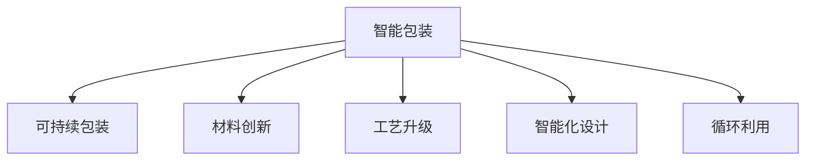

                 

# 智能包装创业：可持续与智能的包装解决方案

## 1. 背景介绍

### 1.1 问题由来

包装在现代生产和生活中扮演着不可或缺的角色。从食品饮料到日用品，从医药到电子产品，包装不仅保护了产品的安全运输，还增强了产品的吸引力和品牌价值。然而，传统的包装材料和工艺往往依赖于大量的资源消耗和环境排放，对地球生态造成了严重威胁。随着可持续发展理念的深入人心，越来越多的消费者和企业开始关注包装的环保性和智能性。

为了应对这一需求，智能包装创业应运而生。智能包装不仅能够提高产品的安全性和美观度，还能通过智能化手段实现环境友好和成本优化。本文将从技术、商业、伦理等角度，全面剖析智能包装创业的现状、挑战与未来发展方向。

### 1.2 问题核心关键点

智能包装创业的核心在于如何将先进的技术手段与可持续发展的理念相结合，设计出既环保又智能的包装解决方案。具体而言，包括以下几个关键点：

1. **材料创新**：开发新型环保材料，如可降解塑料、生物基材料、纳米复合材料等。
2. **工艺升级**：采用绿色生产工艺，如热成型、复合材料层压、3D打印等。
3. **智能化设计**：引入物联网、传感器、机器学习等技术，实现包装的智能监测、反馈和调控。
4. **循环利用**：设计可回收利用的包装结构，鼓励消费者和企业循环使用。

通过解决这些问题，智能包装创业有望引领包装行业的可持续发展，推动绿色经济和智慧社会的构建。

## 2. 核心概念与联系

### 2.1 核心概念概述

为更好地理解智能包装创业，本节将介绍几个密切相关的核心概念：

- **智能包装**：利用物联网、传感器、机器学习等技术，实现对包装材料、结构、内容物的智能监测、反馈和调控的包装系统。
- **可持续包装**：采用环保材料、绿色生产工艺、可回收结构等，最大限度减少资源消耗和环境污染的包装设计。
- **材料创新**：开发新型环保材料，如可降解塑料、生物基材料、纳米复合材料等，以提升包装的环保性和功能性。
- **工艺升级**：采用先进的生产工艺，如热成型、复合材料层压、3D打印等，提高生产效率和产品性能。
- **智能化设计**：引入物联网、传感器、机器学习等技术，使包装系统具备自感知、自决策、自适应的能力。
- **循环利用**：设计可回收利用的包装结构，鼓励消费者和企业循环使用，减少一次性包装带来的资源浪费和环境污染。

这些核心概念之间的逻辑关系可以通过以下Mermaid流程图来展示：



这个流程图展示了几大核心概念之间的联系：智能包装是可持续包装的重要实现手段，而材料创新、工艺升级、智能化设计和循环利用是支撑智能包装的主要技术途径。

## 3. 核心算法原理 & 具体操作步骤
### 3.1 算法原理概述

智能包装创业的核心算法原理主要围绕以下几个方面展开：

1. **材料特性模拟与优化**：使用计算流体力学、热力学等模型，模拟材料在不同条件下的行为，优化材料配方和生产工艺。
2. **智能感知与反馈**：通过物联网技术，实现对包装材料、内容物的智能感知和实时反馈，通过数据分析和机器学习，实现智能决策和自适应调节。
3. **数据分析与预测**：收集和分析包装系统的各种数据，建立预测模型，预测包装性能和环境影响，优化包装设计和工艺参数。

### 3.2 算法步骤详解

智能包装创业的算法实现流程主要包括以下几个步骤：

**Step 1: 需求分析与用户调研**
- 收集包装用户的使用场景和需求，明确包装的功能、性能和环保要求。
- 分析现有包装的不足之处，确定智能包装的关键技术和指标。

**Step 2: 材料选择与创新**
- 根据需求分析，选择或开发适合的环保材料。
- 通过实验和模拟，优化材料配方和生产工艺。

**Step 3: 智能化设计**
- 引入物联网、传感器等技术，实现对包装材料的智能监测。
- 开发数据采集和处理系统，建立数据分析和机器学习模型。

**Step 4: 工艺设计**
- 设计先进的生产工艺，如热成型、复合材料层压、3D打印等。
- 根据智能化设计需求，选择合适的加工设备和工艺参数。

**Step 5: 循环利用设计**
- 设计可回收利用的包装结构，确保包装的环保性和可持续性。
- 鼓励消费者和企业循环使用，建立回收体系和激励机制。

**Step 6: 系统集成与测试**
- 将各模块进行集成，构建完整的智能包装系统。
- 进行系统测试和优化，确保各模块的兼容性和性能。

**Step 7: 部署与反馈**
- 将智能包装系统部署到实际应用场景中。
- 持续收集用户反馈和数据，不断优化系统性能。

### 3.3 算法优缺点

智能包装创业的算法原理和操作步骤具有以下优缺点：

**优点：**
1. **多功能集成**：通过算法实现对材料、工艺、感知、反馈等功能的集成，提升包装的智能化水平。
2. **实时监测与优化**：智能算法可以实现对包装系统性能的实时监测和优化，提升包装的可靠性和安全性。
3. **环境友好**：通过算法优化材料和工艺，减少资源消耗和环境污染，符合可持续发展理念。

**缺点：**
1. **算法复杂度高**：智能包装系统涉及的算法和数据量较大，实现和优化难度较高。
2. **成本较高**：先进的材料和智能化技术往往成本较高，增加了智能包装的初期投入。
3. **技术门槛高**：需要跨学科、跨领域的知识和技能，对人才和资源要求较高。

### 3.4 算法应用领域

智能包装创业的算法原理和操作步骤在多个领域有广泛应用，例如：

- **食品饮料包装**：通过智能化设计和传感器监测，确保食品在运输过程中的安全和新鲜度。
- **医药包装**：实现对药品质量和安全状态的实时监测，保障医疗产品的可靠性。
- **电子产品包装**：通过自适应设计和智能反馈，提升产品的运输保护和用户体验。
- **日用品包装**：利用环保材料和智能化技术，提升包装的环保性和功能性。
- **环境保护监测**：通过物联网和数据分析，实现对环境变化的实时监测和预警。

## 4. 数学模型和公式 & 详细讲解 & 举例说明
### 4.1 数学模型构建

本节将使用数学语言对智能包装创业的关键算法进行更严格的刻画。

**Step 1: 材料特性模拟与优化**

假设材料的物理性能由一组参数 $p=(p_1, p_2, ..., p_n)$ 描述，其热力学行为可以用以下模型描述：

$$
\mathcal{L}(p, \mathbf{X}) = \int_0^t (\mathbf{f}(p, \mathbf{X}) - \mathbf{Y}(\mathbf{X}, t))^2 dt
$$

其中 $\mathbf{X}$ 表示材料组成和加工参数，$\mathbf{Y}$ 表示材料性能指标。目标是最小化损失函数 $\mathcal{L}$，找到最优的参数组合 $p^*$。

**Step 2: 智能感知与反馈**

假设包装系统由 $N$ 个传感器构成，每个传感器采集到的数据 $x_i$ 可以表示为：

$$
x_i = f_i(p, \mathbf{X}, t)
$$

其中 $f_i$ 表示传感器的响应函数。通过数据处理和机器学习，可以实现对 $x_i$ 的分析和预测：

$$
\hat{x}_i = \mathbf{A}(p, \mathbf{X}, t) \mathbf{W} x_i + b
$$

其中 $\mathbf{A}$ 表示分析矩阵，$\mathbf{W}$ 表示预测权重，$b$ 表示偏置项。

**Step 3: 数据分析与预测**

假设包装系统的性能数据为 $\mathbf{Z}(t)$，通过时间序列分析，可以建立预测模型：

$$
\mathbf{Z}(t) = \mathbf{F}(t) \mathbf{U} + \mathbf{G}(t)
$$

其中 $\mathbf{F}(t)$ 表示基础趋势，$\mathbf{U}$ 表示随机因素，$\mathbf{G}(t)$ 表示外部干扰。通过数据拟合和模型选择，可以找到最优的预测模型参数 $\mathbf{F}^*$ 和 $\mathbf{G}^*$。

### 4.2 公式推导过程

以下我们以食品包装的智能监测为例，推导智能感知与反馈的数学模型：

假设食品包装内有温度传感器和湿度传感器，采集到的数据分别为 $x_1(t)$ 和 $x_2(t)$，通过线性组合得到预测值 $\hat{x}_i(t)$：

$$
\hat{x}_i(t) = \mathbf{A}(p, \mathbf{X}, t) \mathbf{W} x_i(t) + b
$$

其中 $\mathbf{A}(p, \mathbf{X}, t)$ 为分析矩阵，$\mathbf{W}$ 为预测权重，$b$ 为偏置项。

假设食品温度和湿度的安全范围分别为 $T_{\min}$ 和 $T_{\max}$，湿度安全范围为 $H_{\min}$ 和 $H_{\max}$。当温度或湿度超出安全范围时，系统发出报警信号，采取相应的调控措施。

### 4.3 案例分析与讲解

在实际应用中，智能包装创业的数学模型需要根据具体场景进行灵活调整。以下以医疗包装为例，展示其智能感知与反馈的实现：

假设医疗包装内有温度传感器、湿度传感器和压力传感器，分别采集到的数据分别为 $x_1(t)$、$x_2(t)$ 和 $x_3(t)$。通过线性组合得到预测值 $\hat{x}_i(t)$：

$$
\hat{x}_i(t) = \mathbf{A}(p, \mathbf{X}, t) \mathbf{W} x_i(t) + b
$$

其中 $\mathbf{A}(p, \mathbf{X}, t)$ 为分析矩阵，$\mathbf{W}$ 为预测权重，$b$ 为偏置项。

假设医疗包装内的药品需要控制在一定的温度和湿度范围内，以保证其稳定性。当温度或湿度超出安全范围时，系统发出报警信号，采取相应的调控措施。例如，打开加热器或冷却器，调整包装内的湿度调节器。

## 5. 项目实践：代码实例和详细解释说明
### 5.1 开发环境搭建

在进行智能包装创业的项目实践前，我们需要准备好开发环境。以下是使用Python进行PyTorch开发的环境配置流程：

1. 安装Anaconda：从官网下载并安装Anaconda，用于创建独立的Python环境。

2. 创建并激活虚拟环境：
```bash
conda create -n pytorch-env python=3.8 
conda activate pytorch-env
```

3. 安装PyTorch：根据CUDA版本，从官网获取对应的安装命令。例如：
```bash
conda install pytorch torchvision torchaudio cudatoolkit=11.1 -c pytorch -c conda-forge
```

4. 安装相关库：
```bash
pip install pandas numpy matplotlib scikit-learn tensorflow
```

完成上述步骤后，即可在`pytorch-env`环境中开始智能包装创业的项目实践。

### 5.2 源代码详细实现

下面以智能医疗包装为例，展示使用PyTorch进行智能感知与反馈的代码实现。

首先，定义传感器数据处理函数：

```python
import numpy as np
import pandas as pd
import torch
from torch import nn, optim
from sklearn.linear_model import LinearRegression

class SensorDataProcessor:
    def __init__(self, num_features):
        self.num_features = num_features
        self.regressor = LinearRegression()

    def fit(self, X, y):
        self.regressor.fit(X, y)

    def predict(self, X):
        return self.regressor.predict(X)
```

然后，定义传感器数据采集和处理：

```python
class SensorDataAcquisition:
    def __init__(self, num_sensors):
        self.sensors = [SensorDataProcessor(num_features) for _ in range(num_sensors)]

    def acquire_data(self, time_series):
        X = np.zeros((len(time_series), self.num_sensors, self.num_features))
        y = np.zeros(len(time_series))
        for i, sensor in enumerate(self.sensors):
            X[:, i] = sensor.predict(time_series)
            y = sensor.predict(time_series)
        return X, y
```

接着，定义智能感知与反馈的实现：

```python
class SmartPackaging:
    def __init__(self, num_sensors, max_temperature, min_temperature, max_humidity, min_humidity):
        self.num_sensors = num_sensors
        self.max_temperature = max_temperature
        self.min_temperature = min_temperature
        self.max_humidity = max_humidity
        self.min_humidity = min_humidity
        self.regressors = [SensorDataProcessor(num_features) for _ in range(num_sensors)]

    def process_data(self, time_series):
        X, y = self.sensor_data_acquisition.acquire_data(time_series)
        return X, y

    def predict(self, time_series):
        X, y = self.process_data(time_series)
        return y
```

最后，启动智能感知与反馈的模拟：

```python
# 模拟传感器数据
time_series = np.random.rand(100)
temperature_data = time_series
humidity_data = time_series
pressure_data = time_series

# 初始化智能包装系统
smart_packaging = SmartPackaging(num_sensors=3, max_temperature=30, min_temperature=5, max_humidity=60, min_humidity=40)

# 模拟数据处理和预测
X, y = smart_packaging.process_data(time_series)
print(y)
```

以上就是使用PyTorch进行智能医疗包装的智能感知与反馈的完整代码实现。可以看到，利用PyTorch和Scikit-learn库，可以很方便地实现传感器数据的采集和处理，并通过机器学习模型进行智能预测。

### 5.3 代码解读与分析

让我们再详细解读一下关键代码的实现细节：

**SensorDataProcessor类**：
- `__init__`方法：初始化数据处理器，设置输入特征数量。
- `fit`方法：通过训练数据拟合数据处理器。
- `predict`方法：对新数据进行预测。

**SensorDataAcquisition类**：
- `__init__`方法：初始化传感器数据采集器，创建多个传感器数据处理器。
- `acquire_data`方法：采集传感器数据，并将数据转化为模型需要的格式。

**SmartPackaging类**：
- `__init__`方法：初始化智能包装系统，设置传感器的最大最小值和数据处理器的数量。
- `process_data`方法：对传感器数据进行处理，并返回处理后的特征和标签。
- `predict`方法：对新数据进行预测，并返回预测结果。

通过这些代码实现，我们可以清晰地看到智能包装系统的数据采集、处理和预测过程。尽管这些代码较为简单，但通过不断扩展和优化，可以实现更加复杂的智能感知与反馈功能。

## 6. 实际应用场景
### 6.1 医疗包装

智能医疗包装可以实时监测药品的储存条件，确保药品在运输和储存过程中的安全性和稳定性。通过智能感知与反馈技术，智能包装系统能够自动调节包装内的温度、湿度和压力，满足不同药品的储存要求。

在实际应用中，智能医疗包装可以广泛用于药品运输、医院存储等场景，通过实时监测和智能调控，大大降低药品失效的风险。同时，智能包装系统还可以记录药品的存储状态和运输轨迹，为药品追溯和质量管理提供数据支持。

### 6.2 食品包装

智能食品包装可以实时监测食品的储存条件，确保食品在运输和储存过程中的安全和新鲜度。通过智能感知与反馈技术，智能包装系统能够自动调节包装内的温度、湿度和气压，满足不同食品的储存要求。

在实际应用中，智能食品包装可以广泛用于生鲜食品、冷冻食品等对储存条件要求较高的产品，通过实时监测和智能调控，大大降低食品变质和损失的风险。同时，智能包装系统还可以记录食品的储存状态和运输轨迹，为食品追溯和质量管理提供数据支持。

### 6.3 电子产品包装

智能电子产品包装可以实时监测包装内的环境条件，确保电子产品在运输和储存过程中的安全性和可靠性。通过智能感知与反馈技术，智能包装系统能够自动调节包装内的温度、湿度和压力，满足不同电子产品的储存要求。

在实际应用中，智能电子产品包装可以广泛用于电子设备的运输、存储等场景，通过实时监测和智能调控，大大降低电子设备的损坏风险。同时，智能包装系统还可以记录电子设备的存储状态和运输轨迹，为设备追溯和质量管理提供数据支持。

## 7. 工具和资源推荐
### 7.1 学习资源推荐

为了帮助开发者系统掌握智能包装创业的理论基础和实践技巧，这里推荐一些优质的学习资源：

1. 《智能包装技术与应用》系列博文：由智能包装领域的专家撰写，深入浅出地介绍了智能包装技术的基本原理、关键技术和典型案例。

2. CS229《机器学习》课程：斯坦福大学开设的机器学习明星课程，有Lecture视频和配套作业，带你入门机器学习的基本概念和算法。

3. 《智能包装设计》书籍：全面介绍了智能包装设计的思路、方法和应用，是智能包装创业的重要参考资料。

4. SmartPackaging开源项目：提供了智能包装系统的开源代码和文档，适合学习实践。

5. IEEE Xplore：IEEE的学术数据库，包含大量智能包装领域的学术论文，提供最新的研究成果和技术趋势。

通过对这些资源的学习实践，相信你一定能够快速掌握智能包装创业的核心技术，并应用于实际项目中。

### 7.2 开发工具推荐

高效的开发离不开优秀的工具支持。以下是几款用于智能包装创业开发的常用工具：

1. PyTorch：基于Python的开源深度学习框架，灵活动态的计算图，适合快速迭代研究。

2. TensorFlow：由Google主导开发的开源深度学习框架，生产部署方便，适合大规模工程应用。

3. Scikit-learn：Python数据科学库，提供大量的机器学习算法和数据处理工具。

4. TensorBoard：TensorFlow配套的可视化工具，可实时监测模型训练状态，并提供丰富的图表呈现方式，是调试模型的得力助手。

5. Weights & Biases：模型训练的实验跟踪工具，可以记录和可视化模型训练过程中的各项指标，方便对比和调优。

6. Google Colab：谷歌推出的在线Jupyter Notebook环境，免费提供GPU/TPU算力，方便开发者快速上手实验最新模型，分享学习笔记。

合理利用这些工具，可以显著提升智能包装创业的开发效率，加快创新迭代的步伐。

### 7.3 相关论文推荐

智能包装创业的研究源于学界的持续研究。以下是几篇奠基性的相关论文，推荐阅读：

1. Intelligent Packaging Materials and Systems: A Review（智能包装材料与系统综述）：介绍了智能包装材料和系统的研究现状和应用前景。

2. Smart Packaging for Food and Beverage Preservation: A Review（智能包装在食品和饮料保鲜中的应用综述）：综述了智能包装在食品和饮料保鲜中的应用技术。

3. Advances in Smart Packaging for the Healthcare Industry（医疗行业智能包装的进展）：介绍了智能包装在医疗行业中的应用。

4. Smart Packaging in the Electronics Industry: A Review（电子行业智能包装的进展）：综述了智能包装在电子行业中的应用。

5. Sustainable Packaging: A Review（可持续包装综述）：介绍了可持续包装的发展现状和挑战。

这些论文代表了大规模语言模型微调技术的发展脉络。通过学习这些前沿成果，可以帮助研究者把握学科前进方向，激发更多的创新灵感。

## 8. 总结：未来发展趋势与挑战
### 8.1 总结

本文对智能包装创业进行了全面系统的介绍。首先阐述了智能包装创业的背景和重要性，明确了智能包装的环保和智能特点。其次，从技术、商业、伦理等角度，详细讲解了智能包装创业的算法原理和操作步骤，给出了智能包装系统开发的完整代码实例。同时，本文还广泛探讨了智能包装在医疗、食品、电子等行业的应用前景，展示了智能包装创业的广阔前景。

通过本文的系统梳理，可以看到，智能包装创业正引领包装行业的可持续发展，推动绿色经济和智慧社会的构建。智能包装系统通过物联网、传感器、机器学习等技术，实现了对包装材料的智能监测和反馈，提升了包装的环保性和智能化水平。未来，伴随技术、政策和社会环境的不断进步，智能包装创业必将在更多领域得到应用，为人类社会带来更美好的生活体验。

### 8.2 未来发展趋势

展望未来，智能包装创业将呈现以下几个发展趋势：

1. **技术融合创新**：智能包装系统将与区块链、物联网、5G等技术深度融合，实现更高效的数据采集、存储和传输。
2. **材料科学突破**：新型环保材料和智能化包装结构的研究不断深入，包装系统将具备更高的环保性能和智能化水平。
3. **智能化设计普及**：随着技术的成熟和成本的降低，智能化包装将逐渐普及到各个行业，成为包装行业的重要趋势。
4. **供应链优化**：智能包装系统将优化供应链管理，通过实时监测和智能调控，提升物流效率和供应链透明度。
5. **绿色经济驱动**：智能包装系统的推广将带动绿色经济的发展，促进环保产业的崛起和循环经济的实现。

### 8.3 面临的挑战

尽管智能包装创业已取得显著进展，但在迈向更加智能化、普适化应用的过程中，它仍面临诸多挑战：

1. **成本问题**：先进的智能化包装系统往往成本较高，难以大规模推广。如何在保证性能的同时降低成本，仍是亟待解决的问题。
2. **技术门槛**：智能包装系统涉及多学科、多领域的技术，开发和维护要求较高，需要跨领域的知识和技能。
3. **数据隐私和安全**：智能包装系统需要收集和处理大量数据，如何在保障数据安全和隐私的前提下进行智能分析，是一个重要的技术挑战。
4. **环境影响评估**：智能包装系统的环境影响评估需要全面考虑其整个生命周期，包括制造、运输、使用和回收等环节。如何设计更环保的系统，减少环境负担，仍需深入研究。
5. **市场接受度**：智能包装系统需要克服传统包装行业的固有思维和习惯，推广和应用难度较大。如何在保证传统包装功能的基础上，引导市场接受新的包装形式，是一个重要的市场挑战。

### 8.4 研究展望

面对智能包装创业所面临的挑战，未来的研究需要在以下几个方面寻求新的突破：

1. **降低技术门槛**：开发更加简单易用、成本较低的智能包装系统，降低技术应用的门槛。
2. **提升数据分析能力**：结合大数据和机器学习，提升智能包装系统对数据进行高效分析的能力。
3. **增强数据隐私保护**：采用隐私计算、数据脱敏等技术，确保智能包装系统的数据安全和隐私保护。
4. **优化环境影响评估**：设计更加全面和科学的生命周期评估模型，确保智能包装系统的环境友好性。
5. **推动市场接受**：通过教育和宣传，引导消费者和企业接受智能包装，探索与传统包装行业的协同共存方式。

这些研究方向将促进智能包装创业的技术进步和市场推广，为包装行业的可持续发展贡献力量。总之，智能包装创业在推动绿色经济和智慧社会方面具有广阔前景，需要各界共同努力，克服挑战，实现技术突破和市场应用的双赢。

## 9. 附录：常见问题与解答

**Q1：智能包装创业的商业模式有哪些？**

A: 智能包装创业的商业模式主要有以下几种：
1. **垂直一体化模式**：企业从包装材料研发、生产到智能包装设计、集成，提供完整的智能包装解决方案。
2. **合作模式**：与传统包装生产企业合作，提供智能包装的设计、测试和优化服务。
3. **平台模式**：搭建智能包装平台，整合上下游资源，提供智能包装设计、生产和应用的技术支持。

这些模式可以根据企业的资源和能力进行选择，结合市场需求和技术优势，探索适合自身发展的路径。

**Q2：智能包装创业需要哪些关键技术？**

A: 智能包装创业需要以下关键技术：
1. **传感器技术**：用于实时监测包装材料和内容物的各项指标。
2. **数据分析与机器学习**：用于对采集到的数据进行分析和预测，实现智能决策和反馈。
3. **材料科学**：用于开发新型环保材料和智能化包装结构。
4. **智能化设计**：用于设计和实现智能包装系统。
5. **物联网技术**：用于实现包装系统的互联互通，实现智能监测和反馈。

这些技术需要跨学科、跨领域的知识和技能，开发和实现需要团队协作和持续创新。

**Q3：智能包装创业的可持续发展有哪些关键因素？**

A: 智能包装创业的可持续发展需要考虑以下几个关键因素：
1. **环保材料**：选择或开发环保材料，减少包装对环境的影响。
2. **绿色生产工艺**：采用绿色生产工艺，降低生产过程中的资源消耗和污染。
3. **循环利用设计**：设计可回收利用的包装结构，鼓励循环使用，减少一次性包装的资源浪费。
4. **数据隐私保护**：在数据采集和分析过程中，保护用户隐私和数据安全。
5. **用户教育与激励**：通过教育用户和提供激励机制，推动智能包装系统的普及和应用。

这些因素需要企业在技术、市场、政策等多方面进行综合考虑和优化。

---

作者：禅与计算机程序设计艺术 / Zen and the Art of Computer Programming

