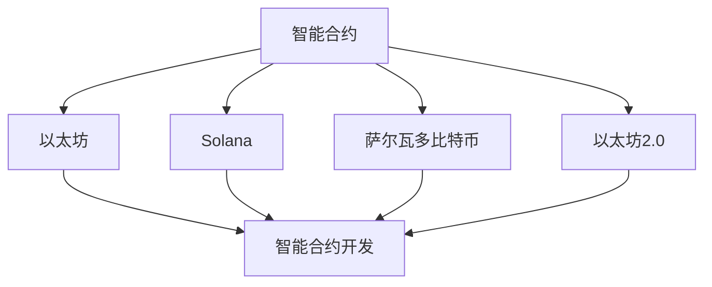

                 

# 智能合约开发：以太坊与其他平台比较

> 关键词：智能合约, 区块链, 以太坊, Solana, 萨尔瓦多比特币, 以太坊2.0

## 1. 背景介绍

智能合约作为区块链技术的核心应用，近年来得到了迅速发展，成为金融、供应链、医疗等多个领域的创新解决方案。相较于传统中心化系统，智能合约具有去中心化、透明、不可篡改等优势。其中，以太坊作为目前最受欢迎的智能合约平台之一，以其完备的开发工具和庞大的生态系统，成为了智能合约开发的首选平台。但与此同时，越来越多的平台开始涌现，如Solana、萨尔瓦多比特币等，都具备各自的独特优势和应用场景。本文将比较以太坊与这些平台的异同，帮助开发者选择最适合的智能合约开发平台。

## 2. 核心概念与联系

### 2.1 核心概念概述

#### 智能合约
智能合约是一段代码，部署在区块链上，能够自动执行并实现特定业务逻辑。不同于传统中心化系统的合约，智能合约的执行不受任何单一机构控制，所有交易和规则透明公开，确保了更高的安全性和可信度。

#### 以太坊
以太坊是一个开源区块链平台，支持智能合约的开发和部署，采用共识机制（WorkProof）保证网络安全，通过以太币（Ether）作为交易手续费和计算费。以太坊拥有强大的开发工具和丰富的应用生态，是智能合约开发的首选平台。

#### Solana
Solana是一个高吞吐量的区块链平台，采用新型的共识机制（PoSF），能够在秒级时间内完成交易。Solana强调速度和扩展性，支持智能合约的快速部署和执行。

#### 萨尔瓦多比特币
萨尔瓦多比特币（Bitcoin SV）是比特币的一个分支，采用更轻量级的区块链架构，强调速度和稳定性，支持智能合约的开发和部署。

#### 以太坊2.0
以太坊2.0是以太坊区块链的下一代版本，采用更加高效的新型共识机制（PoS），预计能够在更短的时间内完成交易，提供更高的扩展性和更低的费用。

这些概念之间的逻辑关系可以通过以下Mermaid流程图来展示：



## 3. 核心算法原理 & 具体操作步骤

### 3.1 算法原理概述

智能合约的开发和部署基于区块链平台，核心原理包括以下几个方面：

#### 区块链技术
区块链是一种去中心化的分布式账本技术，通过共识机制确保网络安全和数据的不可篡改。智能合约即一种通过代码实现规则和执行的交易，其部署和执行完全基于区块链技术。

#### 编程语言
智能合约通常使用Solidity语言进行开发，Solidity是一种专门为以太坊平台设计的Turing完备的编程语言。

#### 智能合约部署
智能合约部署在区块链上，需要经历编译、部署和执行等多个步骤。部署后智能合约即成为区块链上的一份合约，能够自动执行和维护。

#### 智能合约执行
智能合约的执行遵循预定的逻辑规则，通常使用事件驱动的方式来处理交易和操作。例如，当某个事件触发时，智能合约会自动执行相应的操作，完成业务逻辑的处理。

### 3.2 算法步骤详解

智能合约的开发和部署主要分为以下几个步骤：

#### 1. 规划合约设计
- 明确合约功能：根据业务需求，确定智能合约需要实现的功能。
- 设计合约结构：包括变量定义、函数声明、事件定义等。

#### 2. 编写合约代码
- 使用Solidity语言编写智能合约代码。
- 对合约进行单元测试，确保代码正确无误。

#### 3. 编译合约代码
- 使用Solidity编译器将合约代码编译为字节码。
- 将字节码上传到区块链平台。

#### 4. 部署合约
- 使用区块链平台提供的部署工具，将合约部署到区块链上。
- 获取合约地址，用于后续的交互和调用。

#### 5. 测试和调试
- 在测试网络中进行合约测试，确保功能正确。
- 在主网中发布合约，并持续监控其运行状态。

### 3.3 算法优缺点

#### 优点
1. 去中心化：智能合约的去中心化特性确保了更高的安全性和可信度。
2. 自动化：智能合约能够自动执行，减少人为错误和操作风险。
3. 透明性：智能合约的代码和执行过程透明公开，便于监管和审计。

#### 缺点
1. 限制性：智能合约的执行逻辑一旦部署，无法修改，可能存在操作不便的问题。
2. 扩展性：区块链平台扩展性受限，可能影响智能合约的性能。
3. 技术门槛：智能合约开发需要具备一定的编程和区块链知识，门槛较高。

### 3.4 算法应用领域

智能合约在金融、供应链、医疗、版权保护等多个领域都有广泛应用，以下是一些典型案例：

#### 金融领域
智能合约可以自动执行贷款合同、保险合同等金融交易，提高金融服务的效率和安全性。

#### 供应链管理
智能合约可以自动跟踪物流信息，确保货物安全和及时交付，提升供应链管理的透明度和可靠性。

#### 医疗领域
智能合约可以自动记录和验证医疗记录，确保患者隐私和数据安全，提高医疗服务的质量。

#### 版权保护
智能合约可以自动管理数字版权，确保版权的归属和分发，保护原创者的权益。

## 4. 数学模型和公式 & 详细讲解 & 举例说明

### 4.1 数学模型构建

智能合约的开发和部署基于区块链平台，涉及以下数学模型：

#### 1. 分布式共识算法
区块链平台采用共识算法确保网络安全和数据一致性。以太坊采用的共识算法是工作量证明（WorkProof），Solana采用的是权益证明（PoSF）。

#### 2. 交易费用模型
以太坊的交易费用由 gas 费用组成，每个操作都会消耗一定的 gas，总费用计算如下：

$$ \text{Total Fee} = \text{Base Fee} + \text{Gas Price} \times \text{Gas Used} $$

其中 Base Fee 是基础费用，Gas Price 是 gas 单价，Gas Used 是执行操作所消耗的 gas 数。

### 4.2 公式推导过程

#### 1. 共识算法推导
以太坊采用的工作量证明（WorkProof）算法如下：

1. 每个节点生成一个随机数。
2. 节点将随机数和前一个块的哈希值组合成新的区块头。
3. 计算区块头的哈希值，如果哈希值小于目标值，则该节点获胜。

推导过程如下：

$$ \text{Hash}(\text{Block Header}) < \text{Target Value} $$

其中，Block Header 包含随机数、前一个块的哈希值、交易列表等。

#### 2. 交易费用推导
以太坊的交易费用计算公式如下：

$$ \text{Total Fee} = \text{Base Fee} + \text{Gas Price} \times \text{Gas Used} $$

其中 Base Fee 是基础费用，Gas Price 是 gas 单价，Gas Used 是执行操作所消耗的 gas 数。

### 4.3 案例分析与讲解

#### 案例1：以太坊智能合约
以太坊平台上的智能合约示例如下：

```solidity
pragma solidity ^0.8.0;

contract Example {
    address public owner;

    constructor() {
        owner = msg.sender;
    }

    function transfer(address receiver, uint256 amount) public payable {
        require(msg.sender == owner, "Not the owner");
        receiver.transfer(amount);
    }
}
```

该合约实现了以太币的转账功能。

#### 案例2：Solana智能合约
Solana平台上的智能合约示例如下：

```rust
#[program]
pub mod example {
    pub struct Example {
        owner: pub Account<()>,
        counter: pub u64,
    }
    impl Example {
        pub fn new(acc: &mut Account<Example>) -> ProgramResult {
            acc.data counter = 0;
            Ok(())
        }
        pub fn increment(acc: &mut Account<Example>) -> ProgramResult {
            acc.data.counter += 1;
            Ok(())
        }
    }
}
```

该合约实现了简单的计数器功能。

## 5. 项目实践：代码实例和详细解释说明

### 5.1 开发环境搭建

#### 1. 安装Solidity编译器
- 下载并安装Solidity编译器，使用以下命令进行安装：

```
brew install solidity
```

#### 2. 搭建以太坊测试网
- 搭建以太坊测试网，使用以下命令：

```
geth --networkid 40001
```

#### 3. 编写和测试智能合约
- 编写智能合约代码，并进行测试。

### 5.2 源代码详细实现

#### 示例代码：以太坊智能合约

```solidity
pragma solidity ^0.8.0;

contract Example {
    address public owner;

    constructor() {
        owner = msg.sender;
    }

    function transfer(address receiver, uint256 amount) public payable {
        require(msg.sender == owner, "Not the owner");
        receiver.transfer(amount);
    }
}
```

#### 示例代码：Solana智能合约

```rust
#[program]
pub mod example {
    pub struct Example {
        owner: pub Account<()>,
        counter: pub u64,
    }
    impl Example {
        pub fn new(acc: &mut Account<Example>) -> ProgramResult {
            acc.data counter = 0;
            Ok(())
        }
        pub fn increment(acc: &mut Account<Example>) -> ProgramResult {
            acc.data.counter += 1;
            Ok(())
        }
    }
}
```

### 5.3 代码解读与分析

#### 以太坊智能合约

该合约实现了以太币的转账功能，包含以下关键组件：

- `owner`：合约所有者的地址。
- `transfer`：转账函数，接收转账接收人和金额，执行转账操作。

#### Solana智能合约

该合约实现了简单的计数器功能，包含以下关键组件：

- `Example`：合约结构体。
- `new`：创建合约函数，初始化计数器。
- `increment`：增加计数器值，每增加1返回成功。

### 5.4 运行结果展示

#### 以太坊智能合约

该合约部署后，可以通过调用 `transfer` 函数实现以太币的转账操作。

#### Solana智能合约

该合约部署后，可以通过调用 `increment` 函数实现计数器的增加。

## 6. 实际应用场景

### 6.1 金融领域

#### 贷款合同
智能合约可以自动执行贷款合同，确保贷款条件和条款的严格执行，减少人为干预。

#### 保险合同
智能合约可以自动验证保险索赔，确保理赔过程公正透明，减少欺诈和纠纷。

### 6.2 供应链管理

#### 物流跟踪
智能合约可以自动记录和更新物流信息，确保货物安全及时交付。

#### 合同自动执行
智能合约可以自动执行合同条款，确保供应链各环节的协同运作。

### 6.3 医疗领域

#### 患者记录
智能合约可以自动记录和验证患者医疗记录，确保数据安全和个人隐私。

#### 医疗费用结算
智能合约可以自动结算医疗费用，减少手工操作，提高医疗服务效率。

### 6.4 版权保护

#### 版权授权
智能合约可以自动管理版权授权，确保版权的合法分发和使用。

#### 版权追踪
智能合约可以自动追踪版权使用情况，保护原创者的权益。

## 7. 工具和资源推荐

### 7.1 学习资源推荐

#### 以太坊官方文档
以太坊官方文档提供了详细的智能合约开发指南和示例代码，适合初学者和进阶开发者。

#### Solidity官方文档
Solidity官方文档提供了Solidity语言的详细说明和最佳实践，帮助开发者高效编写智能合约。

#### Solana官方文档
Solana官方文档提供了Solana平台的开发指南和智能合约开发工具，适合开发者快速上手。

#### 萨尔瓦多比特币官方文档
萨尔瓦多比特币官方文档提供了区块链平台和智能合约开发的详细说明，适合开发者了解最新技术。

### 7.2 开发工具推荐

#### 以太坊IDE
以太坊IDE是一款智能合约开发工具，提供了代码编写、测试、调试等功能，适合开发者高效开发。

#### Solana IDE
Solana IDE是一款智能合约开发工具，提供了Solana平台的开发环境，适合开发者快速上手。

#### Rust IDE
Rust IDE是一款智能合约开发工具，提供了Rust语言的开发环境，适合开发者开发Solana智能合约。

### 7.3 相关论文推荐

#### 以太坊智能合约安全分析
该论文研究了以太坊智能合约的安全性问题，提出了多种防护措施，保障合约安全性。

#### Solana智能合约优化
该论文研究了Solana智能合约的优化方法，提出了多种性能提升策略，提高合约执行效率。

#### 萨尔瓦多比特币区块链研究
该论文研究了萨尔瓦多比特币区块链的架构和技术，提出了改进建议，提升区块链性能。

## 8. 总结：未来发展趋势与挑战

### 8.1 研究成果总结

本文系统介绍了智能合约的开发和部署，比较了以太坊、Solana、萨尔瓦多比特币等平台的特点和应用场景，帮助开发者选择最适合的智能合约开发平台。

### 8.2 未来发展趋势

智能合约技术将不断发展和创新，未来趋势如下：

#### 去中心化金融（DeFi）
智能合约将广泛应用到去中心化金融领域，实现各种金融创新，如去中心化交易所（DEX）、去中心化借贷等。

#### 智能合约平台
智能合约平台将不断涌现，提供更加多样化的开发环境和技术支持，满足不同领域的需求。

#### 跨链技术
智能合约将支持跨链技术，实现不同区块链平台之间的互操作和数据共享，提升合约的可扩展性和灵活性。

### 8.3 面临的挑战

智能合约技术在发展过程中也面临诸多挑战：

#### 安全性
智能合约的安全性是首要问题，需要防止攻击如重入攻击、溢出攻击等，保障合约的稳定性和可靠性。

#### 扩展性
智能合约的扩展性受限，需要优化合约设计，提高性能和可扩展性，满足大规模应用的需求。

#### 技术门槛
智能合约开发需要具备一定的编程和区块链知识，门槛较高，需要更多教育和培训资源支持。

### 8.4 研究展望

未来的智能合约研究需要重点关注以下几个方面：

#### 安全性提升
提升智能合约的安全性，防止攻击和漏洞，保障合约的可靠性和稳定性。

#### 扩展性优化
优化智能合约的扩展性，提升性能和可扩展性，满足大规模应用的需求。

#### 技术普及
普及智能合约技术，提高开发者的技术水平，推动智能合约的广泛应用。

## 9. 附录：常见问题与解答

**Q1：智能合约开发需要哪些技术？**

A: 智能合约开发需要具备以下技术：

- 区块链基础：了解区块链技术的基本原理和架构。
- 编程语言：熟练掌握Solidity、Rust等智能合约编程语言。
- 开发工具：熟悉智能合约开发工具和IDE，如以太坊IDE、Solana IDE等。
- 测试和调试：掌握单元测试和调试技巧，确保合约代码的正确性。

**Q2：智能合约开发与传统编程有何不同？**

A: 智能合约开发与传统编程有以下不同：

- 自动执行：智能合约自动执行，无需人为干预，确保执行过程的公正和透明。
- 透明性：智能合约代码和执行过程透明公开，便于监管和审计。
- 不可篡改：智能合约的执行结果和数据不可篡改，确保数据的安全性。

**Q3：智能合约的部署和执行过程是怎样的？**

A: 智能合约的部署和执行过程如下：

- 编写智能合约代码，并进行单元测试。
- 使用Solidity编译器将合约代码编译为字节码。
- 将字节码上传到区块链平台，部署智能合约。
- 智能合约部署后，可以使用API接口进行交互和调用，执行预定的逻辑规则。

**Q4：智能合约在开发过程中需要注意哪些问题？**

A: 智能合约在开发过程中需要注意以下问题：

- 安全性：确保合约代码无漏洞，防止攻击和篡改。
- 扩展性：优化合约设计，提升性能和可扩展性。
- 技术门槛：提高开发者的技术水平，推动智能合约的广泛应用。

**Q5：智能合约在应用过程中需要注意哪些问题？**

A: 智能合约在应用过程中需要注意以下问题：

- 安全性：确保合约代码无漏洞，防止攻击和篡改。
- 扩展性：优化合约设计，提升性能和可扩展性。
- 技术门槛：提高开发者的技术水平，推动智能合约的广泛应用。

本文系统介绍了智能合约的开发和部署，比较了以太坊、Solana、萨尔瓦多比特币等平台的特点和应用场景，帮助开发者选择最适合的智能合约开发平台。通过深入学习和实践，相信你一定能够掌握智能合约开发的核心技术和应用方法，为区块链技术的发展贡献自己的力量。

---

作者：禅与计算机程序设计艺术 / Zen and the Art of Computer Programming

