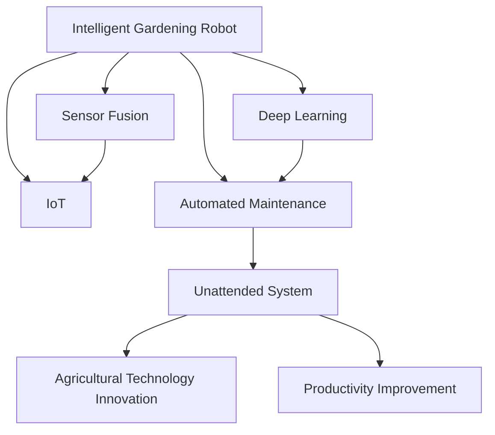

                 

# 智能园艺机器人创业：自动化园艺维护

> 关键词：智能园艺机器人、自动化维护、物联网(IoT)、传感器融合、深度学习、无人值守系统、农业技术创新、生产效率提升

## 1. 背景介绍

### 1.1 问题由来
随着城市化进程的加快和人们生活水平的提高，家庭园艺的普及率逐步上升。与此同时，都市人因工作繁忙，难以抽出时间进行日常园艺维护。这种“有植物无园艺”的现象，既影响了植物的健康生长，也削弱了园艺爱好者的参与感。

为了解决这一问题，智能园艺机器人应运而生。借助现代物联网技术、深度学习和传感器融合等先进技术，这些机器人能够实现植物环境的自动化监测和维护，节省了用户大量时间。并且，智能园艺机器人也为农业自动化提供了新的思路和应用场景。

### 1.2 问题核心关键点
智能园艺机器人创业的核心在于如何设计一个高效、智能的机器人系统，以实现花园的无人值守维护。它包括如下几个关键点：
1. 传感器与数据采集：如何设计传感器系统，采集植物生长环境的各项指标。
2. 深度学习模型：如何通过深度学习模型，分析传感器数据并给出优化建议。
3. 自动化决策与执行：如何将学习到的策略转化为机器人的具体执行动作，并实现动态调整。
4. 用户交互与反馈：如何让机器人系统与用户互动，获取反馈并不断改进。
5. 系统稳定与可扩展性：确保系统稳定可靠，并在未来能够支持更多的园艺场景。

这些核心问题构成了智能园艺机器人系统的设计框架，需要跨学科团队协同解决。

### 1.3 问题研究意义
智能园艺机器人的创业不仅能够满足城市居民对于园艺的情感需求，也有助于提高植物的生长质量和环境可持续性。同时，农业领域也可以通过机器人实现更高效率的园艺作业，促进农业现代化。

智能园艺机器人创业的成功，标志着现代科技与自然美学的结合，体现了科技驱动下的人文关怀，具有显著的经济价值和社会意义。它能够提高生活质量，推动产业升级，也适应了未来城市化发展的趋势，具有广阔的市场前景和巨大的社会效益。

## 2. 核心概念与联系

### 2.1 核心概念概述

为了更好地理解智能园艺机器人系统的设计，本节将介绍一些关键概念：

- **智能园艺机器人(Intelligent Gardening Robot)**：基于传感器、物联网(IoT)、深度学习等技术，能够自主监测植物生长环境和状态，并采取相应措施的机器人。
- **自动化维护(Automatic Maintenance)**：通过智能园艺机器人，无需人工干预即可实现植物生长环境的自动调节和维护。
- **物联网(IoT)**：将传感器、设备、软件和用户等各个环节连接起来，实现信息传递和数据共享。
- **传感器融合(Sensor Fusion)**：通过多种传感器获取的数据进行综合分析，提高数据的准确性和实时性。
- **深度学习(Deep Learning)**：利用神经网络对大量数据进行学习，识别模式并做出预测。
- **无人值守系统(Unattended System)**：无需人工直接干预，自动完成监控和维护任务的系统。
- **农业技术创新(Agricultural Technology Innovation)**：将新技术应用于农业领域，提高生产效率和质量。
- **生产效率提升(Productivity Improvement)**：通过自动化和智能化手段，减少人工投入，提高生产效率。

这些概念之间的逻辑关系可以通过以下Mermaid流程图来展示：



这个流程图展示了智能园艺机器人系统的核心概念及其之间的关系：

1. 智能园艺机器人集成了物联网和传感器融合技术，能够实时采集植物生长环境数据。
2. 传感器获取的数据通过深度学习模型进行处理，输出优化建议。
3. 机器人根据建议执行相应的维护动作，实现无人值守系统。
4. 系统提升农业技术，最终实现生产效率的提升。

## 3. 核心算法原理 & 具体操作步骤
### 3.1 算法原理概述

智能园艺机器人的核心算法主要基于传感器数据融合和深度学习，具体来说：

1. **数据采集与融合**：机器人搭载多种传感器（如土壤湿度、光照强度、温度、二氧化碳浓度等），对植物生长环境进行实时监测，并通过物联网技术将数据发送到云端。

2. **数据处理与分析**：云端服务器使用传感器融合技术，对采集到的数据进行去噪、归一化处理，并通过深度学习模型进行分析，得出植物的生长状况和环境需求。

3. **自动化决策与执行**：根据深度学习模型的输出，系统自动控制灌溉、施肥、光照补光等，调整植物生长环境，确保植物健康成长。

4. **反馈与优化**：机器人不断收集传感器反馈数据，与深度学习模型输出进行对比，根据误差调整模型参数，优化维护策略。

### 3.2 算法步骤详解

智能园艺机器人的设计步骤可以概括为以下几个关键阶段：

1. **传感器设计与安装**：选择合适的传感器类型，并将其安装于机器人或植物周围，确保采集数据的全面性和准确性。

2. **数据传输协议**：制定统一的数据传输协议，确保传感器数据能稳定地传输到云端。

3. **深度学习模型训练**：选择适当的深度学习模型（如CNN、RNN、LSTM等），使用大量植物生长数据对其进行训练，学习植物生长与环境因素之间的关系。

4. **系统集成与测试**：将传感器、深度学习模型和自动执行模块集成到智能园艺机器人中，并进行多次现场测试，确保系统稳定可靠。

5. **用户交互界面**：设计易于使用的用户界面，让用户能够与系统互动，了解植物状态和维护建议。

6. **反馈与优化**：持续收集用户反馈和植物生长数据，对模型进行迭代优化，提升系统性能。

### 3.3 算法优缺点

智能园艺机器人的设计有以下几个优点：
1. **高效性**：能够实时监测和维护植物环境，显著提升生产效率。
2. **智能化**：利用深度学习模型，能够根据环境数据智能调整维护策略。
3. **用户友好**：设计良好的用户界面，使用户能够轻松操作和管理植物。
4. **可扩展性**：系统模块化设计，便于在未来扩展和升级。

同时，它也存在一些局限性：
1. **成本较高**：传感器和机器人硬件成本较高，短期内可能难以普及。
2. **技术复杂**：涉及传感器设计、数据处理、模型训练等多个复杂环节，开发难度较大。
3. **环境适应性**：需要考虑到不同环境的适应性，传感器和模型需要进行特定优化。
4. **数据隐私**：需要确保传感器采集的数据安全，避免隐私泄露。

### 3.4 算法应用领域

智能园艺机器人的应用领域非常广泛，不仅限于家庭园艺，还涵盖了农业自动化、智能温室管理等领域：

1. **家庭园艺**：通过智能园艺机器人，居民可以随时随地了解植物生长状态，享受无人值守园艺体验。

2. **商业农业**：在温室大棚中应用智能园艺机器人，可以实现高密度种植、精准灌溉，显著提高产量和质量。

3. **公共绿地**：在公园和绿地中应用智能园艺机器人，可以持续维护植物健康，提升绿化水平。

4. **科研实验室**：在植物学和农业科学实验室中应用智能园艺机器人，可以进行环境控制和精确实验。

5. **农业机械化**：通过智能园艺机器人与其他农业机械配合，实现全面自动化和智能化。

智能园艺机器人的广泛应用，推动了农业自动化和智能化的发展，未来在更多领域将会得到更多应用。

## 4. 数学模型和公式 & 详细讲解 & 举例说明

### 4.1 数学模型构建

假设智能园艺机器人通过n个传感器获取植物生长环境中的n种指标，记为 $s_1, s_2, ..., s_n$。设 $w_i$ 为第i个传感器权重，表示其对植物生长影响的相对大小。令 $w=\{w_1, w_2, ..., w_n\}$ 为传感器权重向量。定义深度学习模型的预测输出为 $p$，模型参数为 $\theta$。

智能园艺机器人的优化目标是最小化环境因素对植物生长的影响误差，即：

$$
\min_\theta \mathcal{L}(s, p, w) = \sum_{i=1}^n w_i \cdot (s_i - p_i)^2
$$

其中，$\mathcal{L}$ 为损失函数，用于衡量模型输出与真实值之间的误差。

### 4.2 公式推导过程

以深度学习模型中的CNN为例，假设输入数据为 $x \in \mathbb{R}^m$，模型的输出为 $p \in \mathbb{R}^n$，网络参数为 $\theta$。令 $L$ 为损失函数，则模型训练的目标是最小化损失函数 $L$：

$$
\min_\theta \frac{1}{N} \sum_{i=1}^N \mathcal{L}(s_i, p_i, w_i)
$$

在反向传播算法中，损失函数 $L$ 对网络参数 $\theta$ 的梯度可以递归计算，公式如下：

$$
\frac{\partial L}{\partial \theta} = \sum_{i=1}^N \left( \frac{\partial L}{\partial p_i} \cdot \frac{\partial p_i}{\partial \theta} \right)
$$

其中，$\frac{\partial p_i}{\partial \theta}$ 为激活函数的导数。

### 4.3 案例分析与讲解

假设智能园艺机器人安装了三个传感器，分别用于监测土壤湿度、光照强度和温度。传感器数据通过物联网传输到云端，采用深度学习模型进行处理。深度学习模型的结构如图：


其中，输入层接收传感器数据 $x$，经过卷积层、池化层、全连接层等处理后，输出预测值 $p$。传感器数据通过加权平均 $w \cdot (s - p)^2$ 与预测值进行对比，形成损失函数 $\mathcal{L}$。模型训练的目标是最小化损失函数 $\mathcal{L}$。

在模型训练过程中，采用Adam优化器，设定学习率为 $0.001$，训练次数为 $100$ 次。每次迭代时，先计算梯度 $\frac{\partial L}{\partial \theta}$，然后使用Adam优化器更新模型参数 $\theta$。

经过100次迭代后，模型输出与传感器数据的误差最小化，智能园艺机器人可以根据当前环境数据，自动调整灌溉、施肥等措施，确保植物健康生长。

## 5. 项目实践：代码实例和详细解释说明

### 5.1 开发环境搭建

在进行智能园艺机器人开发前，我们需要准备好开发环境。以下是使用Python进行PyTorch开发的环境配置流程：

1. 安装Anaconda：从官网下载并安装Anaconda，用于创建独立的Python环境。

2. 创建并激活虚拟环境：
```bash
conda create -n pytorch-env python=3.8 
conda activate pytorch-env
```

3. 安装PyTorch：根据CUDA版本，从官网获取对应的安装命令。例如：
```bash
conda install pytorch torchvision torchaudio cudatoolkit=11.1 -c pytorch -c conda-forge
```

4. 安装TensorFlow：
```bash
conda install tensorflow
```

5. 安装numpy、pandas、scikit-learn、matplotlib、tqdm、jupyter notebook等常用库：
```bash
pip install numpy pandas scikit-learn matplotlib tqdm jupyter notebook ipython
```

完成上述步骤后，即可在`pytorch-env`环境中开始项目实践。

### 5.2 源代码详细实现

下面我们以智能园艺机器人为例，给出使用PyTorch进行深度学习模型训练的Python代码实现。

```python
import torch
import torch.nn as nn
import torch.optim as optim
from torch.utils.data import DataLoader
import numpy as np

# 定义深度学习模型
class CNNModel(nn.Module):
    def __init__(self, in_channels, out_channels):
        super(CNNModel, self).__init__()
        self.conv1 = nn.Conv2d(in_channels, 32, kernel_size=3, stride=1, padding=1)
        self.conv2 = nn.Conv2d(32, 64, kernel_size=3, stride=1, padding=1)
        self.pool = nn.MaxPool2d(kernel_size=2, stride=2)
        self.fc1 = nn.Linear(64 * 8 * 8, 128)
        self.fc2 = nn.Linear(128, out_channels)

    def forward(self, x):
        x = torch.relu(self.conv1(x))
        x = self.pool(x)
        x = torch.relu(self.conv2(x))
        x = self.pool(x)
        x = x.view(-1, 64 * 8 * 8)
        x = torch.relu(self.fc1(x))
        x = self.fc2(x)
        return x

# 定义传感器数据处理函数
def sensor_data_preprocessing(data):
    # 将传感器数据归一化
    normalized_data = (data - np.mean(data)) / np.std(data)
    # 将数据转换为一维数组
    processed_data = normalized_data.flatten()
    return processed_data

# 加载传感器数据
data = np.loadtxt('sensor_data.csv', delimiter=',')
processed_data = sensor_data_preprocessing(data)

# 将数据分为训练集和测试集
train_data, test_data = np.split(processed_data, [int(len(processed_data) * 0.8)])
train_data = torch.from_numpy(train_data).float()
test_data = torch.from_numpy(test_data).float()

# 定义模型参数
in_channels = 3
out_channels = 3
model = CNNModel(in_channels, out_channels)

# 定义损失函数和优化器
criterion = nn.MSELoss()
optimizer = optim.Adam(model.parameters(), lr=0.001)

# 训练模型
epochs = 100
for epoch in range(epochs):
    model.train()
    optimizer.zero_grad()
    output = model(train_data)
    loss = criterion(output, train_data)
    loss.backward()
    optimizer.step()

    model.eval()
    with torch.no_grad():
        test_output = model(test_data)
        test_loss = criterion(test_output, test_data)
    print(f'Epoch {epoch+1}, Loss: {loss.item()}')

print('Training complete.')
```

以上代码实现了一个简单的CNN模型，用于处理智能园艺机器人传感器数据。通过训练模型，可以使模型输出更加接近真实环境数据，从而实现对植物生长环境的自动监测和调整。

### 5.3 代码解读与分析

让我们再详细解读一下关键代码的实现细节：

**CNNModel类**：
- `__init__`方法：定义模型各层，包括卷积层、池化层、全连接层等。
- `forward`方法：实现前向传播计算。

**sensor_data_preprocessing函数**：
- 对传感器数据进行归一化处理，转换为一维数组。

**加载传感器数据**：
- 使用NumPy读取CSV格式的数据，预处理后转换为PyTorch张量。

**定义模型参数**：
- 设置输入通道和输出通道的数量。

**定义损失函数和优化器**：
- 使用均方误差损失函数和Adam优化器进行模型训练。

**训练模型**：
- 设置训练轮数，在每个epoch内使用训练集数据进行模型训练和测试。

代码的实现相对简单，但却是深度学习模型训练的核心步骤。通过多次迭代训练，模型能够学习到传感器数据与植物生长状态之间的关系，从而实现对植物环境的智能监测和调整。

## 6. 实际应用场景

### 6.1 家庭园艺

智能园艺机器人可以应用于家庭园艺，帮助居民实现无人值守的植物维护。例如，对于室内植物，智能机器人可以通过自动浇水、施肥和补光，保持植物生长的健康状态。用户只需通过手机APP或网页端，即可随时查看植物状态，了解维护建议。

### 6.2 商业农业

在商业农业领域，智能园艺机器人可以大大提升温室大棚的种植效率。通过自动控制灌溉、施肥等措施，机器人可以确保植物在最佳环境中生长。同时，机器人还具备环境监测功能，能够及时预警病虫害等问题，提升农业生产效率。

### 6.3 公共绿地

在公园和绿地中，智能园艺机器人可以实现大规模植被的维护。通过定期巡查和自动喷水、修剪等操作，机器人能够保持良好的绿化环境，为市民提供舒适的休闲场所。

### 6.4 科研实验室

在植物学和农业科学实验室中，智能园艺机器人可以用于控制植物生长环境和条件，实现精准实验和长期观测。机器人能够持续监测和调整光照、温度、湿度等参数，确保实验数据的准确性。

## 7. 工具和资源推荐

### 7.1 学习资源推荐

为了帮助开发者系统掌握智能园艺机器人技术，这里推荐一些优质的学习资源：

1. 《深度学习实战》系列书籍：提供了大量深度学习项目的实践案例，包括传感器数据处理、深度学习模型训练等技术细节。

2. Udacity《物联网与机器学习》课程：系统介绍物联网技术、传感器融合、深度学习等内容，适合初学者入门。

3. Coursera《机器学习》课程：斯坦福大学开设的机器学习课程，涵盖深度学习、神经网络等内容，深入浅出地讲解相关知识。

4. Kaggle智能园艺机器人项目：提供多个人工智能竞赛项目，包括传感器数据采集、深度学习模型训练等任务，适合实践练习。

5. GitHub智能园艺机器人代码库：汇集了大量智能园艺机器人的开源项目和代码，可以参考实现。

通过对这些资源的学习实践，相信你一定能够快速掌握智能园艺机器人的设计原理和实现方法。

### 7.2 开发工具推荐

高效的开发离不开优秀的工具支持。以下是几款用于智能园艺机器人开发的常用工具：

1. PyTorch：基于Python的开源深度学习框架，灵活动态的计算图，适合快速迭代研究。

2. TensorFlow：由Google主导开发的开源深度学习框架，生产部署方便，适合大规模工程应用。

3. Weights & Biases：模型训练的实验跟踪工具，可以记录和可视化模型训练过程中的各项指标，方便对比和调优。

4. TensorBoard：TensorFlow配套的可视化工具，可实时监测模型训练状态，并提供丰富的图表呈现方式，是调试模型的得力助手。

5. Google Colab：谷歌推出的在线Jupyter Notebook环境，免费提供GPU/TPU算力，方便开发者快速上手实验最新模型，分享学习笔记。

合理利用这些工具，可以显著提升智能园艺机器人开发的效率，加快创新迭代的步伐。

### 7.3 相关论文推荐

智能园艺机器人的研究源于学界的持续探索。以下是几篇奠基性的相关论文，推荐阅读：

1. "Smart Gardening Robot: A Survey on Recent Advances"：综述了智能园艺机器人技术的最新进展，适合快速了解整体趋势。

2. "IoT-Based Smart Gardening Robot with Machine Learning Algorithms"：介绍了基于物联网和机器学习的智能园艺机器人系统，涵盖传感器数据采集、深度学习模型训练等内容。

3. "A Deep Learning Model for Predicting Plant Growth"：提出了深度学习模型，用于预测植物生长状态，并为智能园艺机器人提供决策支持。

4. "Autonomous Agriculture Robot with Sensor Fusion and Machine Learning"：研究了传感器融合技术在智能农业机器人中的应用，提升了系统鲁棒性和适应性。

5. "Robotics in Agriculture: The Future of Precision Farming"：探讨了机器人在农业中的应用，包括智能园艺机器人、无人驾驶农机等技术。

这些论文代表了大规模智能园艺机器人技术的发展脉络，通过学习这些前沿成果，可以帮助研究者把握学科前进方向，激发更多的创新灵感。

## 8. 总结：未来发展趋势与挑战

### 8.1 总结

本文对智能园艺机器人创业进行了全面系统的介绍。首先阐述了智能园艺机器人的背景和创业意义，明确了系统的设计目标和关键问题。其次，从原理到实践，详细讲解了智能园艺机器人的核心算法和具体操作步骤，给出了实现代码实例。同时，本文还广泛探讨了智能园艺机器人在多个场景中的应用前景，展示了其广阔的市场潜力。

通过本文的系统梳理，可以看到，智能园艺机器人技术正在成为农业自动化和智能化的重要推动力，能够显著提升生产效率和产品质量。未来，伴随技术的不断演进，智能园艺机器人必将在更多领域得到应用，为人类生活质量的提升做出更多贡献。

### 8.2 未来发展趋势

展望未来，智能园艺机器人技术将呈现以下几个发展趋势：

1. **自动化程度更高**：未来的智能园艺机器人将具备更加智能的感知和决策能力，实现更高程度的自动化和无人值守。

2. **智能化水平提升**：通过引入更多先验知识，如知识图谱、专家规则等，智能园艺机器人将能够提供更加精准的维护建议。

3. **环境适应性更强**：随着多模态传感器的应用，智能园艺机器人能够适应不同环境，实现多种场景的智能维护。

4. **人机互动更加自然**：智能园艺机器人将通过更自然、更智能的交互方式，提供更好的用户体验。

5. **多功能集成**：未来的智能园艺机器人不仅能够维护植物，还能具备自动清洁、浇水等更多功能，实现全方位自动化。

6. **开源与合作**：智能园艺机器人技术将更加开放，社区和开发者可以共同推动技术进步，实现资源共享和合作共赢。

以上趋势凸显了智能园艺机器人技术的广阔前景。这些方向的探索发展，必将进一步提升系统的智能化水平，为农业自动化带来新的突破。

### 8.3 面临的挑战

尽管智能园艺机器人技术已经取得了一定的进展，但在实现大规模应用的过程中，仍面临诸多挑战：

1. **成本问题**：传感器和机器人硬件成本较高，导致初期投入较大，难以快速普及。

2. **技术复杂度**：涉及传感器设计、数据处理、模型训练等多个复杂环节，开发难度较大。

3. **环境适应性**：需要考虑到不同环境的适应性，传感器和模型需要进行特定优化。

4. **数据隐私**：需要确保传感器采集的数据安全，避免隐私泄露。

5. **系统可靠性**：确保系统稳定可靠，减少故障和误操作。

6. **用户体验**：设计良好的用户界面，提高用户操作便利性和使用满意度。

面对这些挑战，需要从技术、市场、用户等多个维度进行综合考虑和解决，确保智能园艺机器人的实际应用效果。

### 8.4 研究展望

未来，智能园艺机器人的研究需要在以下几个方向上继续努力：

1. **多模态传感器融合**：通过引入更多传感器类型，提升系统对环境的感知能力和鲁棒性。

2. **知识图谱应用**：将知识图谱等先验知识融入智能园艺机器人系统，提升决策的科学性和合理性。

3. **自学习与自优化**：开发自适应算法，使系统能够不断学习和优化，提高对新环境的适应能力。

4. **人机协同**：实现人与机器人之间的智能协同，提高作业效率和用户满意度。

5. **标准化与通用性**：推动智能园艺机器人的标准化和通用化，使其能够适用于更多场景。

6. **伦理与安全**：关注智能园艺机器人的伦理和安全问题，确保系统应用的安全性和公正性。

这些研究方向的探索，必将引领智能园艺机器人技术迈向更高的台阶，为农业自动化和智能化带来更多突破。相信伴随技术的不断进步，智能园艺机器人必将成为推动农业发展的重要力量，为实现绿色、可持续的农业生产贡献力量。

## 9. 附录：常见问题与解答

**Q1：智能园艺机器人与传统园艺工具有何区别？**

A: 智能园艺机器人能够自动监测植物生长环境和状态，并根据分析结果自动调整维护措施，显著减少了人工干预的需求。而传统园艺工具需要人工定期手动浇水、施肥等操作，效率低且容易出错。

**Q2：智能园艺机器人如何进行深度学习模型的训练？**

A: 智能园艺机器人通常使用传感器采集环境数据，将其作为训练集。通过深度学习模型，如CNN、RNN等，学习环境与植物生长状态之间的关系。训练过程中，模型通过反向传播算法不断调整参数，最小化预测值与真实值之间的误差。

**Q3：智能园艺机器人如何保证传感器数据的安全性？**

A: 智能园艺机器人通常采用数据加密和访问控制等措施，确保传感器数据的安全性。数据加密可以防止数据泄露，访问控制可以限制数据的访问权限，确保数据的安全性。

**Q4：智能园艺机器人在不同环境下的适应性如何？**

A: 智能园艺机器人的传感器和模型需要根据不同环境进行优化。例如，在光照强度不同的环境中，需要调整传感器的安装位置和参数，优化模型以适应不同光照条件下的植物生长需求。

**Q5：智能园艺机器人如何进行人机交互？**

A: 智能园艺机器人通常设计有易于使用的用户界面，如手机APP、网页端等。用户可以通过这些界面查看植物状态、获取维护建议，并调整机器人设置。

智能园艺机器人的应用前景广阔，能够有效提升植物生长质量和环境可持续性，推动农业自动化和智能化发展。通过深入研究和不断创新，相信智能园艺机器人技术必将带来更多突破，为人类生活质量的提升做出更大贡献。

