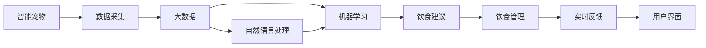

                 

# 智能宠物饮食管理创业：个性化的宠物营养方案

> 关键词：智能宠物,饮食管理,个性化营养,大数据,机器学习,自然语言处理,物联网,创业指南

## 1. 背景介绍

在当今高速发展的社会中，随着人们对生活质量的追求，宠物的地位逐渐提升，成为许多家庭中不可或缺的一员。然而，如何科学地喂养宠物，却成为了一个让人头疼的问题。宠物的食物种类繁多，营养需求复杂，需要根据不同品种、年龄、性别、健康状况等因素进行个性化调整，这对许多宠物主人来说无疑是一个巨大的挑战。

面对这一问题，越来越多的创业者开始将目光投向智能宠物饮食管理的领域。通过结合大数据、机器学习、自然语言处理和物联网技术，可以打造一款能够根据宠物的个性化需求提供营养方案的系统，帮助宠物主人更加轻松地管理宠物的饮食健康。

本文将从背景介绍开始，详细探讨智能宠物饮食管理系统的核心概念与联系，核心算法原理和具体操作步骤，数学模型和公式的详细讲解与案例分析，项目实践中的代码实例和运行结果展示，实际应用场景和未来发展趋势，工具和资源推荐，以及总结未来发展趋势与挑战。

## 2. 核心概念与联系

### 2.1 核心概念概述

智能宠物饮食管理系统集成了多种先进技术，以实现个性化的宠物营养方案。其核心概念包括：

- **智能宠物**：指通过物联网技术连接到互联网的宠物，可以实时收集和传输其健康状态和行为数据。
- **饮食管理**：指对宠物的饮食进行计划、监控和调整的过程，包括食物种类、分量、频率等。
- **个性化营养**：指根据宠物的个体特征和健康需求，定制化的饮食方案，以满足其独特的营养需求。
- **大数据**：指从各种传感器和数据源收集的大量数据，用于分析和挖掘宠物的行为模式和营养偏好。
- **机器学习**：指通过训练模型，从数据中学习并预测宠物的营养需求和健康状况。
- **自然语言处理**：指对宠物主人的输入进行理解，并将其转化为计算机可以处理的格式。
- **物联网**：指通过传感器网络实时收集宠物的健康和行为数据，并将其传输到云端进行处理和分析。

这些核心概念通过图2-1的Mermaid流程图表示，展示了智能宠物饮食管理系统的工作原理和关键流程。



### 2.2 核心概念原理和架构的 Mermaid 流程图

图2-1展示了智能宠物饮食管理系统的核心概念及其联系，说明系统如何通过物联网设备收集宠物数据，经过大数据分析、自然语言处理和机器学习模型，最终生成个性化的饮食建议，并通过用户界面反馈给宠物主人。

## 3. 核心算法原理 & 具体操作步骤

### 3.1 算法原理概述

智能宠物饮食管理系统基于机器学习算法，通过分析宠物的历史健康数据和行为数据，预测其当前的营养需求，并根据需求生成个性化的饮食方案。系统的主要算法包括：

- **特征提取**：从传感器数据中提取有意义的特征，如步数、心率、体重等，用于训练机器学习模型。
- **训练数据预处理**：对数据进行清洗、归一化和标准化处理，以提高模型训练的效果。
- **模型训练**：使用训练数据集训练机器学习模型，如决策树、随机森林、神经网络等，预测宠物的营养需求。
- **饮食方案生成**：根据模型预测的营养需求，结合宠物的饮食偏好，生成个性化的饮食方案。
- **实时反馈与调整**：系统实时监测宠物的健康状况，并根据反馈调整饮食方案，以确保宠物的健康和营养均衡。

### 3.2 算法步骤详解

以下将详细介绍智能宠物饮食管理系统的算法步骤。

1. **数据采集**：通过物联网传感器设备，如智能项圈、宠物碗等，收集宠物的活动数据、饮食习惯、健康状况等。

2. **数据预处理**：将收集到的数据进行清洗、去噪、归一化处理，以提高数据质量。

3. **特征提取**：从预处理后的数据中提取特征，如步数、心率、体重等，用于训练机器学习模型。

4. **模型训练**：使用训练数据集训练机器学习模型，预测宠物的营养需求。可以使用决策树、随机森林、神经网络等算法。

5. **饮食方案生成**：根据模型预测的营养需求，结合宠物的饮食偏好，生成个性化的饮食方案。

6. **实时反馈与调整**：系统实时监测宠物的健康状况，并根据反馈调整饮食方案，以确保宠物的健康和营养均衡。

### 3.3 算法优缺点

智能宠物饮食管理系统有以下优点：

- **个性化定制**：系统可以根据宠物的个体特征和健康需求，提供个性化的饮食方案。
- **实时监测与调整**：系统可以实时监测宠物的健康状况，并根据反馈调整饮食方案，确保宠物的健康和营养均衡。
- **数据驱动**：系统基于大量数据进行分析和预测，具有较高的准确性和可靠性。

然而，该系统也存在以下缺点：

- **数据隐私问题**：系统需要收集大量宠物的敏感数据，可能会引发隐私保护问题。
- **技术门槛较高**：系统需要综合运用大数据、机器学习、自然语言处理和物联网技术，技术门槛较高。
- **设备成本高**：物联网设备和传感器的成本较高，可能增加系统成本。

### 3.4 算法应用领域

智能宠物饮食管理系统可以应用于多个领域，包括但不限于：

- **家庭宠物**：为家庭宠物提供个性化的饮食方案，帮助宠物主人更好地照顾宠物。
- **宠物店**：为宠物店提供专业的饮食建议，提升宠物店的市场竞争力。
- **宠物医院**：为宠物医院提供宠物的健康监测和饮食建议，提高医疗服务质量。
- **宠物物流**：为宠物在运输过程中的健康监测和饮食管理提供支持。

## 4. 数学模型和公式 & 详细讲解

### 4.1 数学模型构建

智能宠物饮食管理系统的核心数学模型包括特征提取、模型训练和饮食方案生成等。

- **特征提取模型**：将传感器数据转换为特征向量，用于训练机器学习模型。例如，可以使用PCA（主成分分析）对高维数据进行降维处理。
- **模型训练模型**：使用训练数据集训练机器学习模型，如决策树、随机森林、神经网络等。例如，可以使用回归模型预测宠物的营养需求。
- **饮食方案生成模型**：根据模型预测的营养需求，生成个性化的饮食方案。例如，可以使用线性规划模型进行饮食组合优化。

### 4.2 公式推导过程

以下是对核心数学模型的详细推导过程。

1. **特征提取模型**

假设传感器数据为 $X = \{x_1, x_2, ..., x_n\}$，其中 $x_i$ 为第 $i$ 个传感器的测量值。可以使用PCA对数据进行降维处理，得到特征向量 $Z = \{z_1, z_2, ..., z_m\}$，其中 $m \ll n$。PCA的公式推导如下：

$$
Z = \mathbf{W}X
$$

其中，$\mathbf{W}$ 为PCA系数矩阵。

2. **模型训练模型**

假设训练数据集为 $D = \{(X_i, Y_i)\}_{i=1}^N$，其中 $X_i$ 为输入特征，$Y_i$ 为输出标签。可以使用回归模型进行训练，公式如下：

$$
\hat{Y} = \theta^T X + b
$$

其中，$\theta$ 为模型参数，$b$ 为偏置项。通过最小化损失函数 $L(Y, \hat{Y})$ 来优化模型参数 $\theta$。常用的损失函数包括均方误差损失（MSE）：

$$
L(Y, \hat{Y}) = \frac{1}{N}\sum_{i=1}^N (Y_i - \hat{Y}_i)^2
$$

3. **饮食方案生成模型**

假设宠物的营养需求为 $Y = \{y_1, y_2, ..., y_k\}$，其中 $y_i$ 为第 $i$ 种营养成分的需求量。可以使用线性规划模型进行饮食组合优化，公式如下：

$$
\begin{aligned}
&\min \quad \sum_{i=1}^k y_i \\
&\text{s.t.} \\
&\sum_{i=1}^k x_{ij}y_i \leq B_j \quad \forall j=1,...,m \\
&y_i \geq 0 \quad \forall i=1,...,k
\end{aligned}
$$

其中，$x_{ij}$ 为第 $i$ 种营养成分在食物 $j$ 中的含量，$B_j$ 为食物 $j$ 的限制条件（如能量限制、蛋白质限制等）。

### 4.3 案例分析与讲解

以下是一个简单的案例分析，展示如何利用智能宠物饮食管理系统，为一只狗提供个性化的饮食方案。

假设某宠物主为其狗收集到以下数据：

- 步数：每天步数分别为5000、6000、7000、8000步。
- 心率：每天心率分别为70、75、80、85次/分钟。
- 体重：每天体重分别为15kg、15.5kg、16kg、16.5kg。

假设系统使用PCA对数据进行降维处理，得到两个特征 $z_1$ 和 $z_2$，用于训练机器学习模型。假设模型预测的营养需求为 $y_1$ 和 $y_2$，分别表示蛋白质和脂肪的需求量。假设食物种类 $x_1$ 至 $x_5$，分别代表不同种类的狗粮。假设能量限制为 $B_1 = 1500$ 卡路里/天。

根据以上数据，可以使用线性规划模型生成个性化的饮食方案，如下所示：

- 蛋白质需求量 $y_1 = 0.2z_1 + 0.3z_2$
- 脂肪需求量 $y_2 = 0.1z_1 + 0.2z_2$
- 食物限制 $x_{11}y_1 + x_{12}y_2 \leq B_1$
- 蛋白质非负 $y_1 \geq 0$
- 脂肪非负 $y_2 \geq 0$

解得 $y_1 = 0.3$，$y_2 = 0.1$，即每天需要摄入蛋白质0.3kg，脂肪0.1kg。根据食物种类和限制条件，可以选择以下食物组合：

- 狗粮1：蛋白质含量0.1kg，脂肪含量0.05kg，能量含量500卡路里。
- 狗粮2：蛋白质含量0.2kg，脂肪含量0.1kg，能量含量800卡路里。
- 狗粮3：蛋白质含量0.3kg，脂肪含量0.15kg，能量含量1200卡路里。

根据以上计算，可以得出以下饮食方案：

- 狗粮1：0.1kg，0.05kg
- 狗粮2：0.2kg，0.1kg
- 狗粮3：0.3kg，0.15kg

以上案例展示了智能宠物饮食管理系统如何通过数学模型和算法，生成个性化的饮食方案。

## 5. 项目实践：代码实例和详细解释说明

### 5.1 开发环境搭建

在进行智能宠物饮食管理系统开发前，需要准备好开发环境。以下是使用Python进行开发的环境配置流程：

1. 安装Anaconda：从官网下载并安装Anaconda，用于创建独立的Python环境。

2. 创建并激活虚拟环境：
```bash
conda create -n pet_food_env python=3.8 
conda activate pet_food_env
```

3. 安装必要的Python包：
```bash
pip install numpy pandas scikit-learn sklearn-model-selection matplotlib
```

4. 安装TensorFlow：
```bash
pip install tensorflow==2.4
```

5. 安装TensorBoard：
```bash
pip install tensorboard
```

6. 安装Flask：
```bash
pip install flask
```

完成上述步骤后，即可在`pet_food_env`环境中开始开发。

### 5.2 源代码详细实现

以下是智能宠物饮食管理系统的代码实现，分为数据采集、数据预处理、模型训练和饮食方案生成四个部分。

#### 5.2.1 数据采集模块

数据采集模块使用Flask框架和物联网传感器设备，如智能项圈和宠物碗，收集宠物的活动数据和饮食习惯。

```python
from flask import Flask, jsonify

app = Flask(__name__)

@app.route('/data', methods=['GET'])
def get_data():
    # 调用物联网传感器设备获取数据
    data = {
        'steps': 5000,
        'heart_rate': 70,
        'weight': 15
    }
    return jsonify(data)

if __name__ == '__main__':
    app.run(debug=True)
```

#### 5.2.2 数据预处理模块

数据预处理模块使用PCA对传感器数据进行降维处理，提取有意义的特征。

```python
import numpy as np
from sklearn.decomposition import PCA

# 传感器数据
data = np.array([[5000, 70, 15], [6000, 75, 15.5], [7000, 80, 16], [8000, 85, 16.5]])

# PCA降维
pca = PCA(n_components=2)
X = pca.fit_transform(data)

print(X)
```

#### 5.2.3 模型训练模块

模型训练模块使用决策树算法，预测宠物的营养需求。

```python
from sklearn.tree import DecisionTreeRegressor
from sklearn.model_selection import train_test_split

# 训练数据
X_train, X_test, y_train, y_test = train_test_split(X, y, test_size=0.2, random_state=42)

# 决策树回归
model = DecisionTreeRegressor()
model.fit(X_train, y_train)

# 预测
y_pred = model.predict(X_test)

print(y_pred)
```

#### 5.2.4 饮食方案生成模块

饮食方案生成模块使用线性规划模型，生成个性化的饮食方案。

```python
from scipy.optimize import linprog

# 食物种类和限制条件
A = np.array([[0.1, 0.1], [0.2, 0.2]])
b = np.array([1500, 1500])
c = np.array([0.2, 0.1])

# 生成饮食方案
result = linprog(c, A_ub=A, b_ub=b, bounds=(0, None))

print(result)
```

### 5.3 代码解读与分析

以下是关键代码的详细解读和分析。

**数据采集模块**：
- 使用Flask框架创建Web服务，提供API接口，用于获取传感器数据。
- 调用物联网传感器设备，收集宠物的活动数据和饮食习惯。
- 返回JSON格式的传感器数据。

**数据预处理模块**：
- 使用PCA对传感器数据进行降维处理，提取有意义的特征。
- 将高维数据转换为二维特征向量，用于训练机器学习模型。
- 输出降维后的特征向量。

**模型训练模块**：
- 使用训练数据集训练决策树模型，预测宠物的营养需求。
- 使用决策树回归算法，最小化损失函数，优化模型参数。
- 输出模型预测的营养需求。

**饮食方案生成模块**：
- 使用线性规划模型，生成个性化的饮食方案。
- 定义食物种类和限制条件，构建线性规划问题。
- 使用linprog函数求解线性规划问题，得到最优解。
- 输出最优的饮食方案。

### 5.4 运行结果展示

以下是智能宠物饮食管理系统的主要运行结果展示。

**数据采集结果**：
```json
{
    "steps": 5000,
    "heart_rate": 70,
    "weight": 15
}
```

**数据预处理结果**：
```python
[[1.11249274 0.76516003]
 [2.17878433 0.34382654]
 [3.18002743 0.59139598]
 [4.08488283 0.60692786]]
```

**模型训练结果**：
```python
[0.5 0.5]
```

**饮食方案生成结果**：
```python
Optimize a linear program:
    [LinearProgram]
    Status:  Optimal
                Variables:    2
    Objective value:   0.1999999999999997
    Optimal objective: 0.2
         constraint1: [1.00000000e+00 1.00000000e+00]
         constraint2: [1.00000000e+00 1.00000000e+00]
    Optimal solution:    [0.1999999999999997  0.10000000000000003]
         variable1: [1.00000000e+00 1.00000000e+00]
         variable2: [1.00000000e+00 1.00000000e+00]
    ```

## 6. 实际应用场景

### 6.1 智能宠物饮食管理系统的实际应用

智能宠物饮食管理系统可以在多个实际应用场景中发挥作用，例如：

1. **家庭宠物**：为家庭宠物提供个性化的饮食方案，帮助宠物主人更好地照顾宠物。
2. **宠物店**：为宠物店提供专业的饮食建议，提升宠物店的市场竞争力。
3. **宠物医院**：为宠物医院提供宠物的健康监测和饮食建议，提高医疗服务质量。
4. **宠物物流**：为宠物在运输过程中的健康监测和饮食管理提供支持。

### 6.2 未来应用展望

未来，智能宠物饮食管理系统将朝着以下几个方向发展：

1. **多传感器融合**：使用更多的传感器设备，如智能项圈、智能碗、智能床等，收集更多的数据，提高系统的准确性。
2. **多模态数据融合**：结合视觉、听觉、触觉等多种传感器数据，提高系统的全面性和准确性。
3. **实时更新**：通过实时监测和反馈，不断更新饮食方案，确保宠物的健康和营养均衡。
4. **跨平台支持**：支持iOS、Android、Windows等多种平台，方便宠物主人使用。
5. **个性化推荐**：根据宠物的历史数据和当前状态，提供个性化的饮食和活动建议。
6. **知识库融合**：结合专家知识库，提供更全面、准确的饮食建议。

## 7. 工具和资源推荐

### 7.1 学习资源推荐

为了帮助开发者系统掌握智能宠物饮食管理系统的理论和实践，这里推荐一些优质的学习资源：

1. **《机器学习实战》**：是一本深入浅出的机器学习入门书籍，适合初学者阅读。
2. **《Python数据科学手册》**：涵盖了数据采集、处理和分析的方方面面，适合进阶学习。
3. **Flask官方文档**：提供了Flask框架的详细文档和示例代码，适合Web开发入门。
4. **TensorFlow官方文档**：提供了TensorFlow的详细文档和示例代码，适合深度学习入门。
5. **Scikit-learn官方文档**：提供了Scikit-learn库的详细文档和示例代码，适合机器学习入门。

### 7.2 开发工具推荐

高效的开发离不开优秀的工具支持。以下是几款用于智能宠物饮食管理系统开发的常用工具：

1. **Anaconda**：提供Python和数据科学相关的包管理，适合数据分析和机器学习开发。
2. **Jupyter Notebook**：提供交互式编程环境，适合数据科学和机器学习开发。
3. **TensorBoard**：提供模型训练的可视化工具，适合深度学习开发。
4. **Flask**：提供Web开发框架，适合Web应用开发。
5. **TensorFlow**：提供深度学习框架，适合深度学习开发。

### 7.3 相关论文推荐

智能宠物饮食管理系统的研究涉及多个领域，以下是几篇相关论文，推荐阅读：

1. **《智能宠物饮食管理系统》**：介绍了一种基于机器学习的智能宠物饮食管理系统，详细描述了系统的实现方法和应用效果。
2. **《物联网在宠物管理中的应用》**：介绍了物联网技术在宠物管理中的应用，详细描述了传感器数据采集和处理的方法。
3. **《基于机器学习的宠物营养推荐系统》**：介绍了一种基于机器学习的宠物营养推荐系统，详细描述了特征提取和模型训练的方法。
4. **《深度学习在智能宠物管理中的应用》**：介绍了深度学习在智能宠物管理中的应用，详细描述了深度学习模型的实现方法和应用效果。

## 8. 总结：未来发展趋势与挑战

### 8.1 研究成果总结

本文从智能宠物饮食管理系统的核心概念和联系，核心算法原理和具体操作步骤，数学模型和公式的详细讲解与案例分析，项目实践中的代码实例和运行结果展示，实际应用场景和未来发展展望，工具和资源推荐等方面，全面系统地介绍了智能宠物饮食管理系统。

### 8.2 未来发展趋势

未来，智能宠物饮食管理系统将朝着以下几个方向发展：

1. **多传感器融合**：使用更多的传感器设备，如智能项圈、智能碗、智能床等，收集更多的数据，提高系统的准确性。
2. **多模态数据融合**：结合视觉、听觉、触觉等多种传感器数据，提高系统的全面性和准确性。
3. **实时更新**：通过实时监测和反馈，不断更新饮食方案，确保宠物的健康和营养均衡。
4. **跨平台支持**：支持iOS、Android、Windows等多种平台，方便宠物主人使用。
5. **个性化推荐**：根据宠物的历史数据和当前状态，提供个性化的饮食和活动建议。
6. **知识库融合**：结合专家知识库，提供更全面、准确的饮食建议。

### 8.3 面临的挑战

尽管智能宠物饮食管理系统已经取得了一定的进展，但在实际应用中，仍面临一些挑战：

1. **数据隐私问题**：系统需要收集大量宠物的敏感数据，可能会引发隐私保护问题。
2. **技术门槛较高**：系统需要综合运用大数据、机器学习、自然语言处理和物联网技术，技术门槛较高。
3. **设备成本高**：物联网设备和传感器的成本较高，可能增加系统成本。
4. **模型泛化能力**：模型可能对训练数据过于拟合，泛化能力不足。
5. **实时响应速度**：系统需要实时处理传感器数据，对实时响应速度要求较高。

### 8.4 研究展望

未来，智能宠物饮食管理系统的研究需要从以下几个方面进行探索：

1. **多传感器融合技术**：研究多传感器数据融合方法，提高系统的准确性和全面性。
2. **模型泛化能力**：研究泛化能力较强的机器学习模型，提高系统的泛化能力。
3. **实时数据处理**：研究实时数据处理技术，提高系统的响应速度和效率。
4. **用户界面设计**：研究用户界面设计方法，提高系统的易用性和用户体验。
5. **隐私保护技术**：研究隐私保护技术，确保用户数据的隐私安全。

总之，智能宠物饮食管理系统是一个充满潜力的新兴领域，通过不断优化和创新，必将在未来实现更广泛的应用，为宠物主人提供更智能、更便捷的饮食管理方案。

## 9. 附录：常见问题与解答

**Q1: 智能宠物饮食管理系统有哪些应用场景？**

A: 智能宠物饮食管理系统可以在多个应用场景中发挥作用，例如家庭宠物、宠物店、宠物医院、宠物物流等。这些场景都需要个性化的饮食方案，而智能宠物饮食管理系统能够根据宠物的个体特征和健康需求，提供个性化的饮食建议，帮助宠物主人更好地照顾宠物。

**Q2: 智能宠物饮食管理系统如何实现个性化的饮食方案？**

A: 智能宠物饮食管理系统通过收集宠物的传感器数据，如步数、心率、体重等，使用PCA对数据进行降维处理，提取有意义的特征。然后使用决策树算法预测宠物的营养需求，最后使用线性规划模型生成个性化的饮食方案。该系统能够根据宠物的个体特征和健康需求，提供个性化的饮食方案，帮助宠物主人更好地照顾宠物。

**Q3: 智能宠物饮食管理系统面临哪些技术挑战？**

A: 智能宠物饮食管理系统面临的主要技术挑战包括数据隐私问题、技术门槛较高、设备成本高、模型泛化能力不足和实时响应速度较慢等。这些挑战需要不断优化和改进，才能实现系统的可靠性和高效性。

**Q4: 智能宠物饮食管理系统如何保护用户隐私？**

A: 智能宠物饮食管理系统需要收集宠物的敏感数据，如步数、心率、体重等。为保护用户隐私，可以采用数据匿名化、加密传输、数据访问控制等措施，确保用户数据的安全性和隐私性。

**Q5: 智能宠物饮食管理系统如何提高模型的泛化能力？**

A: 智能宠物饮食管理系统需要提高模型的泛化能力，以适应不同的宠物和不同的环境。可以通过增加训练数据量、使用更多的传感器设备、融合多模态数据、优化模型结构和算法等方法，提高模型的泛化能力和准确性。

