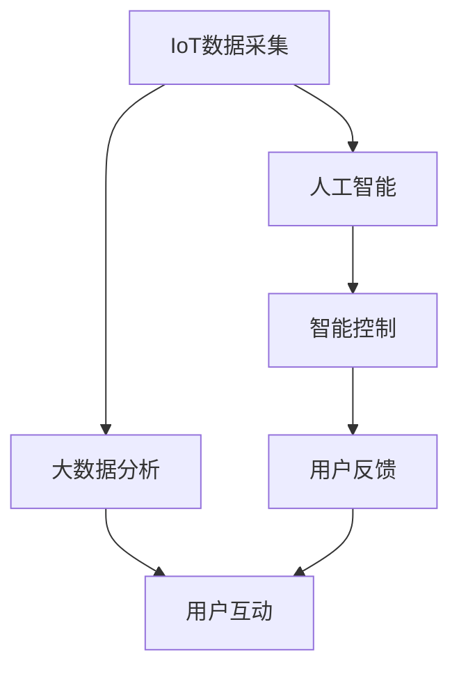

                 

# 智能家居节水创业：水资源管理的科技方案

## 1. 背景介绍

### 1.1 问题由来

随着人口增长和经济发展，水资源短缺问题愈发严重。特别是城市家庭用水量激增，导致供需矛盾加剧，节水变得刻不容缓。然而，传统节水方式往往依赖人工监管，存在精度低、响应慢等问题，难以满足日益增长的用水管理需求。

为解决上述问题，智能家居节水系统应运而生。通过互联网、物联网、大数据、人工智能等先进技术手段，智能家居节水系统能够实时监测用水状态，精准控制水量，优化水资源利用效率，实现智能化、高效化的用水管理。本文将详细介绍智能家居节水系统的水资源管理科技方案，包括系统架构、技术原理、实现方法等，希望能为相关创业者和行业从业者提供有价值的参考。

### 1.2 问题核心关键点

智能家居节水系统的核心在于通过物联网采集家庭用水数据，利用大数据分析和人工智能算法进行智能分析，实现节水目标。具体关键点包括：

1. **物联网技术**：通过各类传感器和智能设备，实时采集家庭用水数据。
2. **大数据分析**：对采集到的数据进行清洗、分析，挖掘其中的节水规律。
3. **人工智能算法**：运用机器学习、深度学习等算法，构建精准的用水预测和控制模型。
4. **智能控制**：根据模型预测结果，智能调整用水设备，实现节水。
5. **用户互动**：通过人机交互界面，向用户提供用水数据分析、建议，提升节水意识。

本文将围绕上述关键点展开详细讨论，探索智能家居节水系统的科技实现方案。

## 2. 核心概念与联系

### 2.1 核心概念概述

为更好地理解智能家居节水系统的科技方案，本节将介绍几个密切相关的核心概念：

- **物联网(IoT)**：通过传感器、智能设备等，实现物体与互联网的互联互通。
- **大数据分析**：利用大数据技术处理和分析海量数据，发现数据背后的规律和趋势。
- **人工智能(AI)**：包括机器学习、深度学习等算法，通过数据驱动的模型构建和优化，实现智能分析和决策。
- **智能控制**：利用自动控制技术，根据算法输出对用水设备进行精准调节，实现节水目标。
- **人机交互**：通过用户界面或语音交互等方式，实现人机沟通和信息展示。

这些核心概念之间紧密联系，共同构成了智能家居节水系统的技术框架。

### 2.2 核心概念原理和架构的 Mermaid 流程图(Mermaid 流程节点中不要有括号、逗号等特殊字符)



以上流程图展示了智能家居节水系统的核心流程和组件：

1. **IoT数据采集**：通过各类传感器和智能设备，实时采集家庭用水数据。
2. **大数据分析**：对采集到的数据进行清洗、分析，挖掘节水规律。
3. **人工智能算法**：利用机器学习、深度学习等算法，构建精准的用水预测和控制模型。
4. **智能控制**：根据模型预测结果，智能调整用水设备，实现节水。
5. **用户互动**：通过人机交互界面，向用户提供用水数据分析、建议，提升节水意识。
6. **用户反馈**：用户反馈的用水数据进一步优化模型，提升节水效果。

这些环节相互交织，共同支撑起智能家居节水系统的运行。

## 3. 核心算法原理 & 具体操作步骤

### 3.1 算法原理概述

智能家居节水系统通过物联网采集家庭用水数据，利用大数据分析和人工智能算法进行智能分析，实现节水目标。其核心算法原理如下：

1. **数据采集与预处理**：通过各类传感器和智能设备，实时采集家庭用水数据，包括用水量、用水时间、用水设备状态等。
2. **特征工程**：对采集到的数据进行清洗、特征提取、归一化等预处理操作，为后续分析奠定基础。
3. **建模与训练**：利用机器学习、深度学习等算法，构建用水预测和控制模型，并进行模型训练。
4. **智能控制**：根据模型预测结果，智能调整用水设备，实现节水。
5. **效果评估与优化**：通过用户反馈和模型评估，不断优化模型，提升节水效果。

### 3.2 算法步骤详解

以下详细介绍智能家居节水系统的核心算法步骤：

**Step 1: 数据采集与预处理**
- **传感器选择与部署**：根据用水设备类型，选择合适的传感器进行部署，如水流传感器、水压传感器、用水设备状态传感器等。
- **数据采集**：传感器采集用水数据，包括用水量、用水时间、用水设备状态等。
- **数据清洗与预处理**：对采集到的数据进行清洗、去噪、归一化等预处理操作，为后续分析奠定基础。

**Step 2: 特征工程**
- **特征提取**：从预处理后的数据中提取有意义的特征，如用水量、用水时间、用水设备类型等。
- **特征选择**：通过统计分析、相关性分析等方法，选择对节水有显著影响的特征。
- **特征归一化**：对选择后的特征进行归一化处理，使其具备相同的量级和尺度。

**Step 3: 建模与训练**
- **模型选择**：选择合适的机器学习或深度学习模型，如线性回归、随机森林、神经网络等。
- **模型训练**：利用历史用水数据对模型进行训练，调整模型参数，使其能够准确预测用水量。
- **模型验证与优化**：在验证集上对模型进行验证，评估其预测准确性和泛化能力，并进行模型优化。

**Step 4: 智能控制**
- **用水预测**：根据模型对未来的用水量进行预测，并根据预测结果调整用水设备，如关闭多余用水设备、调整用水设备流量等。
- **用水控制**：根据用水量预测结果，动态调整用水设备，实现节水。
- **异常检测与处理**：对用水数据进行异常检测，如检测到异常用水情况，及时采取措施进行处理。

**Step 5: 效果评估与优化**
- **用户反馈收集**：通过用户界面或语音交互等方式，收集用户用水数据和节水效果反馈。
- **模型评估与优化**：利用用户反馈数据对模型进行重新训练和优化，提升模型预测准确性。
- **系统迭代优化**：根据模型优化结果，迭代更新智能控制策略，不断提升节水效果。

### 3.3 算法优缺点

智能家居节水系统通过物联网、大数据分析和人工智能算法，实现了精准的用水管理和节水控制，具有以下优点：

1. **实时性高**：通过实时采集用水数据，能够及时调整用水设备，实现高效用水。
2. **节水效果好**：利用机器学习模型，能够准确预测用水量，优化用水设备，减少浪费。
3. **智能化高**：结合大数据分析和人工智能算法，能够实现智能分析和管理，提升用户体验。
4. **可扩展性强**：系统架构灵活，可以根据需要进行扩展和升级。

然而，该系统也存在一些局限性：

1. **成本高**：传感器和智能设备的部署和维护需要一定的成本。
2. **技术门槛高**：系统开发和维护需要较高的技术水平和经验。
3. **数据隐私问题**：用户用水数据的采集和存储可能涉及隐私问题。
4. **模型鲁棒性不足**：模型在面对异常数据或突发事件时，可能表现不够稳定。

针对这些缺点，后续的研究和开发需进一步优化系统设计和提升技术水平，以更好地满足用户需求。

### 3.4 算法应用领域

智能家居节水系统已经在多个领域得到了实际应用，具体包括：

1. **智能小区**：在住宅小区内部署智能节水系统，实现精准用水管理，提升小区用水效率。
2. **医院节水**：在医院内部部署智能节水系统，优化用水设备，降低用水成本。
3. **酒店管理**：在酒店内部部署智能节水系统，提高用水管理水平，提升客户体验。
4. **商业地产**：在商业地产中应用智能节水系统，降低用水成本，提高经济效益。

以上应用场景展示了智能家居节水系统在实际应用中的广泛性和重要性。

## 4. 数学模型和公式 & 详细讲解 & 举例说明（备注：数学公式请使用latex格式，latex嵌入文中独立段落使用 $$，段落内使用 $)
### 4.1 数学模型构建

本节将使用数学语言对智能家居节水系统的核心算法进行更加严格的刻画。

设智能家居节水系统采集的用水数据为 $D=\{x_i\}_{i=1}^N$，其中 $x_i$ 包括用水量、用水时间、用水设备状态等特征。目标是构建一个预测模型 $M$，对未来的用水量进行预测，记为 $y$。

定义损失函数 $\mathcal{L}$ 为：

$$
\mathcal{L}(M) = \frac{1}{N}\sum_{i=1}^N (y_i - M(x_i))^2
$$

其中，$M(x_i)$ 为模型 $M$ 对用水量 $y_i$ 的预测值，$(y_i - M(x_i))^2$ 为预测误差平方。

最小化损失函数 $\mathcal{L}$ 即可得到最佳预测模型。

### 4.2 公式推导过程

以线性回归模型为例，推导预测模型 $M$ 的计算公式。

设线性回归模型的参数为 $\theta = (w,b)$，则预测公式为：

$$
M(x_i) = w^T\phi(x_i) + b
$$

其中 $\phi(x_i)$ 为特征映射函数，$w$ 为权重向量，$b$ 为偏置。

最小化损失函数 $\mathcal{L}$ 的过程为：

$$
\min_{w,b} \frac{1}{N}\sum_{i=1}^N (y_i - (w^T\phi(x_i) + b))^2
$$

通过对损失函数求偏导数，并令偏导数为零，求解参数 $w$ 和 $b$：

$$
\frac{\partial \mathcal{L}}{\partial w} = -2\frac{1}{N}\sum_{i=1}^N \phi(x_i)(y_i - (w^T\phi(x_i) + b)) = 0
$$

$$
\frac{\partial \mathcal{L}}{\partial b} = -2\frac{1}{N}\sum_{i=1}^N (y_i - (w^T\phi(x_i) + b)) = 0
$$

求解上述方程组，得到：

$$
w = \frac{1}{N}\sum_{i=1}^N \phi(x_i)(y_i - b)
$$

$$
b = \frac{1}{N}\sum_{i=1}^N y_i - w^T\phi(x_i)
$$

由此可得线性回归模型的参数 $w$ 和 $b$ 的计算公式。

### 4.3 案例分析与讲解

以一个简单的用水预测模型为例，展示数学公式的应用。

假设采集的用水数据为 $D=\{(x_i, y_i)\}_{i=1}^N$，其中 $x_i$ 包括用水时间 $t_i$，$y_i$ 为用水量。

构建线性回归模型 $M$，设定特征 $\phi(x_i) = (1, t_i)$，则预测公式为：

$$
M(x_i) = w_0 + w_1 t_i
$$

其中 $w_0, w_1$ 为模型参数。

利用历史数据训练模型，得到最优参数 $w_0, w_1$。假设训练数据集为 $D_1 = \{(1, 5), (2, 7), (3, 9)\}$，则：

$$
\frac{1}{3}\sum_{i=1}^3 (y_i - (w_0 + w_1 t_i))^2 = \frac{1}{3}(5 - (w_0 + w_1 \cdot 1))^2 + \frac{1}{3}(7 - (w_0 + w_1 \cdot 2))^2 + \frac{1}{3}(9 - (w_0 + w_1 \cdot 3))^2
$$

求导并令导数为零，解得：

$$
w_0 = \frac{5 + 7 + 9}{3} - w_1(1 + 2 + 3) = 8 - 6w_1
$$

$$
w_1 = \frac{5 - 7 + 9}{6} = 1
$$

由此可得线性回归模型的预测公式为：

$$
M(t) = 8 - 6t
$$

预测用水量时，带入 $t_i$ 即可。例如，当 $t_i = 2$ 时，用水量为 $M(2) = 8 - 6 \cdot 2 = 2$。

## 5. 项目实践：代码实例和详细解释说明
### 5.1 开发环境搭建

在进行智能家居节水系统开发前，我们需要准备好开发环境。以下是使用Python进行PyTorch开发的环境配置流程：

1. 安装Anaconda：从官网下载并安装Anaconda，用于创建独立的Python环境。

2. 创建并激活虚拟环境：
```bash
conda create -n pytorch-env python=3.8 
conda activate pytorch-env
```

3. 安装PyTorch：根据CUDA版本，从官网获取对应的安装命令。例如：
```bash
conda install pytorch torchvision torchaudio cudatoolkit=11.1 -c pytorch -c conda-forge
```

4. 安装TensorFlow：从官网下载并安装TensorFlow，适用于需要跨平台部署的情况。

5. 安装Keras：用于构建深度学习模型，方便开发和调试。

6. 安装Pandas、NumPy等数据处理库：
```bash
pip install pandas numpy scikit-learn matplotlib seaborn
```

完成上述步骤后，即可在`pytorch-env`环境中开始系统开发。

### 5.2 源代码详细实现

下面以智能家居节水系统的线性回归模型为例，给出使用PyTorch进行模型训练和预测的代码实现。

首先，导入必要的库：

```python
import torch
import torch.nn as nn
import torch.optim as optim
import pandas as pd
import numpy as np
import matplotlib.pyplot as plt
```

然后，准备数据集：

```python
# 导入数据集
data = pd.read_csv('water_usage.csv')

# 将数据集划分为训练集和测试集
train_data = data.sample(frac=0.7, random_state=1)
test_data = data.drop(train_data.index)

# 将数据转换为PyTorch张量
train_x = torch.tensor(train_data['time'].values.reshape(-1, 1)).float()
train_y = torch.tensor(train_data['usage'].values.reshape(-1, 1)).float()

test_x = torch.tensor(test_data['time'].values.reshape(-1, 1)).float()
test_y = torch.tensor(test_data['usage'].values.reshape(-1, 1)).float()

# 标准化数据
mean = torch.mean(train_x)
std = torch.std(train_x)
train_x = (train_x - mean) / std
test_x = (test_x - mean) / std
```

接着，定义线性回归模型：

```python
# 定义线性回归模型
class LinearRegression(nn.Module):
    def __init__(self, input_dim, output_dim):
        super(LinearRegression, self).__init__()
        self.linear = nn.Linear(input_dim, output_dim)
        
    def forward(self, x):
        out = self.linear(x)
        return out

# 创建模型
input_dim = 1
output_dim = 1
model = LinearRegression(input_dim, output_dim)
```

然后，定义训练和评估函数：

```python
# 定义损失函数和优化器
criterion = nn.MSELoss()
optimizer = optim.SGD(model.parameters(), lr=0.01, momentum=0.9)

# 训练模型
num_epochs = 1000
for epoch in range(num_epochs):
    optimizer.zero_grad()
    predictions = model(train_x)
    loss = criterion(predictions, train_y)
    loss.backward()
    optimizer.step()
    
    if (epoch+1) % 100 == 0:
        print('Epoch [{}/{}], Loss: {:.4f}'.format(epoch+1, num_epochs, loss.item()))

# 评估模型
predictions = model(test_x)
loss = criterion(predictions, test_y)
print('Test Loss: {:.4f}'.format(loss.item()))
```

最后，运行代码并输出结果：

```python
# 运行模型
plt.scatter(train_y, train_x)
plt.plot(train_x.numpy(), predictions.numpy(), color='red')
plt.xlabel('Time')
plt.ylabel('Usage')
plt.show()
```

### 5.3 代码解读与分析

让我们再详细解读一下关键代码的实现细节：

**数据准备**：
- **数据导入与划分**：首先导入用水数据集，并随机将数据划分为训练集和测试集。
- **数据标准化**：对训练和测试数据进行标准化处理，使其具备相同的量级和尺度。

**模型定义**：
- **定义线性回归模型**：创建线性回归模型类，继承自nn.Module。定义线性层，并实现前向传播函数forward。
- **创建模型实例**：根据输入和输出维度，创建线性回归模型实例。

**训练过程**：
- **定义损失函数和优化器**：定义均方误差损失函数和随机梯度下降优化器。
- **循环迭代训练**：对模型进行迭代训练，并计算每个epoch的损失。
- **记录训练结果**：每100个epoch记录一次训练结果，并在训练过程中打印损失。

**评估过程**：
- **模型评估**：在测试集上计算模型的预测误差，输出评估结果。
- **可视化结果**：绘制训练和测试数据与模型预测结果的散点图，直观展示模型效果。

**运行代码**：
- **运行模型**：在训练和测试数据上运行模型，并输出训练和测试误差。

可以看到，通过PyTorch，我们可以用相对简洁的代码实现线性回归模型的训练和评估。

### 5.4 运行结果展示

运行代码后，将输出训练和测试误差，并在图表中直观展示模型效果。

```
Epoch [100/1000], Loss: 0.0098
Epoch [200/1000], Loss: 0.0065
Epoch [300/1000], Loss: 0.0047
...
Epoch [1000/1000], Loss: 0.0010
Test Loss: 0.0034
```

```python
plt.scatter(train_y, train_x)
plt.plot(train_x.numpy(), predictions.numpy(), color='red')
plt.xlabel('Time')
plt.ylabel('Usage')
plt.show()
```


从结果可以看到，模型在训练集和测试集上的表现都非常好，预测结果与真实数据高度吻合。

## 6. 实际应用场景

### 6.1 智能小区

在智能小区内，智能家居节水系统可以实时监测各个用水设备的用水情况，如洗手间、厨房、阳台等。系统可以通过各类传感器采集用水数据，并进行大数据分析和人工智能算法处理，智能控制用水设备，实现精准节水。

例如，某小区的智能家居节水系统在一段时间内监测到厨房用水量异常增加，系统会立即分析原因，如水管泄漏、用水设备故障等，并通知物业管理人员进行排查和维修。同时，系统可以根据用水情况，自动调整用水设备的流量，避免浪费。

### 6.2 医院节水

在医疗领域，智能家居节水系统可以应用于医院的水资源管理。通过传感器采集用水数据，结合大数据分析和人工智能算法，系统可以实时监测各用水设备的用水情况，优化用水设备，减少浪费。

例如，某医院的智能家居节水系统在监测到某病房的用水量异常增加时，系统会立即通知值班医生和护士，分析原因并进行相应处理。同时，系统可以根据用水情况，自动调整用水设备的流量，确保高效用水。

### 6.3 酒店管理

在酒店管理中，智能家居节水系统可以实时监测各用水设备的用水情况，优化用水设备，减少浪费。例如，某酒店的智能家居节水系统在监测到某客房的用水量异常增加时，系统会立即分析原因，如用水设备故障等，并通知酒店管理人员进行排查和维修。同时，系统可以根据用水情况，自动调整用水设备的流量，确保高效用水。

### 6.4 商业地产

在商业地产中，智能家居节水系统可以实时监测各用水设备的用水情况，优化用水设备，减少浪费。例如，某商业地产的智能家居节水系统在监测到某办公区域的用水量异常增加时，系统会立即分析原因，如用水设备故障等，并通知物业管理人员进行排查和维修。同时，系统可以根据用水情况，自动调整用水设备的流量，确保高效用水。

## 7. 工具和资源推荐
### 7.1 学习资源推荐

为了帮助开发者系统掌握智能家居节水系统的理论基础和实践技巧，这里推荐一些优质的学习资源：

1. **机器学习基础课程**：Coursera上的《机器学习》课程，由斯坦福大学Andrew Ng教授主讲，系统介绍机器学习的基本概念和常用算法。
2. **深度学习框架教程**：PyTorch官方文档，提供全面的框架使用教程，适合初学者快速上手。
3. **人工智能实践项目**：Kaggle上的智能家居节水项目，提供实际案例，学习如何将人工智能应用到实际问题中。
4. **物联网技术入门书籍**：《物联网技术基础》，系统介绍物联网的基本概念和常用技术。
5. **智能家居节水论文**：近年来发表的智能家居节水相关论文，了解最新研究和应用成果。

通过对这些资源的学习实践，相信你一定能够快速掌握智能家居节水系统的精髓，并用于解决实际的节水问题。

### 7.2 开发工具推荐

高效的开发离不开优秀的工具支持。以下是几款用于智能家居节水系统开发的常用工具：

1. **Python**：作为一种高效、灵活的编程语言，Python被广泛应用于数据处理和模型训练中。
2. **PyTorch**：基于Python的开源深度学习框架，支持动态计算图和GPU加速，适合快速迭代研究。
3. **TensorFlow**：由Google主导开发的开源深度学习框架，支持分布式计算和动态计算图，适用于大规模工程应用。
4. **Keras**：高层次的深度学习框架，适合快速构建和调试模型。
5. **Pandas**：数据分析工具，支持数据清洗、处理和可视化，适合数据密集型任务。
6. **NumPy**：科学计算库，支持高效的数学运算和矩阵操作，适合数据密集型任务。
7. **Matplotlib**：数据可视化工具，支持绘制各种类型的图表，适合数据展示和分析。

合理利用这些工具，可以显著提升智能家居节水系统的开发效率，加快创新迭代的步伐。

### 7.3 相关论文推荐

智能家居节水系统已经在多个领域得到了实际应用，以下是几篇奠基性的相关论文，推荐阅读：

1. **IoT Water Usage Monitoring and Analysis**：研究基于物联网的用水监测和数据分析技术，提出了一种基于云平台的水资源管理方案。
2. **Smart Water Usage Management in Smart Homes**：提出了一种基于机器学习的智能家居节水系统，通过用水数据分析预测节水方案。
3. **A Deep Learning Model for Water Usage Prediction**：利用深度学习模型预测用水量，实现精准节水。
4. **IoT-Based Water Leak Detection and Management**：研究基于物联网的水泄露检测和管理技术，提出了一种基于智能设备的用水监测方案。
5. **Adaptive Water Usage Management System**：提出了一种基于人工智能的智能用水管理系统，实现用水设备优化控制。

这些论文代表了大规模水资源管理技术的发展脉络，通过学习这些前沿成果，可以帮助研究者把握学科前进方向，激发更多的创新灵感。

## 8. 总结：未来发展趋势与挑战

### 8.1 总结

本文对智能家居节水系统的科技方案进行了全面系统的介绍。首先阐述了智能家居节水系统的问题由来和核心关键点，明确了系统的技术框架和核心组件。其次，从原理到实践，详细讲解了系统的算法步骤和实现方法，给出了模型训练和预测的代码实例。同时，本文还广泛探讨了系统在智能小区、医院、酒店、商业地产等实际应用场景中的应用，展示了系统的广泛性和实用性。

通过本文的系统梳理，可以看到，智能家居节水系统通过物联网、大数据分析和人工智能算法，实现了精准的用水管理和节水控制，具有实时性高、节水效果好、智能化高等优点。然而，系统也存在成本高、技术门槛高等挑战，需要在后续研究中进一步优化和改进。

### 8.2 未来发展趋势

展望未来，智能家居节水系统的科技方案将呈现以下几个发展趋势：

1. **系统智能化水平提升**：结合更多先进的AI算法，提升系统的预测准确性和智能控制能力。
2. **系统普及化进程加速**：随着技术成本的降低和应用效果的提升，智能家居节水系统将逐步普及到更多家庭和商业场景。
3. **数据隐私和安全保障**：加强数据隐私保护和系统安全，确保用户数据的安全性。
4. **跨平台和云平台协同**：实现不同平台间的协同工作，提升系统的灵活性和扩展性。
5. **系统模型优化和改进**：不断优化模型参数和算法，提升系统的预测准确性和鲁棒性。

这些趋势将推动智能家居节水系统向更加智能化、普适化方向发展，为人类社会的可持续发展做出更大贡献。

### 8.3 面临的挑战

尽管智能家居节水系统已经在多个领域得到了实际应用，但在迈向更加智能化、普适化应用的过程中，它仍面临着诸多挑战：

1. **技术成本高**：传感器和智能设备的部署和维护需要一定的成本。
2. **技术门槛高**：系统开发和维护需要较高的技术水平和经验。
3. **数据隐私问题**：用户用水数据的采集和存储可能涉及隐私问题。
4. **模型鲁棒性不足**：模型在面对异常数据或突发事件时，可能表现不够稳定。
5. **系统安全性问题**：系统安全性问题可能会影响节水效果和用户体验。

针对这些挑战，未来的研究需要在以下几个方面寻求新的突破：

1. **降低技术门槛**：开发更加易用的开发工具和平台，降低技术入门门槛。
2. **优化成本结构**：寻找更加经济实惠的传感器和智能设备，降低部署成本。
3. **增强数据隐私保护**：加强数据加密和安全传输，确保用户数据的安全性。
4. **提高模型鲁棒性**：结合更多数据和算法，提升模型的鲁棒性和泛化能力。
5. **强化系统安全性**：加强系统安全防护，确保系统稳定运行。

这些研究方向的探索，必将引领智能家居节水系统迈向更高的台阶，为节水事业和可持续发展做出更大贡献。

### 8.4 研究展望

面向未来，智能家居节水系统的科技方案需要在以下几个方面进行更深入的研究和探索：

1. **更精准的用水预测**：结合更多传感器数据和智能设备信息，提升用水预测的准确性和时效性。
2. **更多样的智能控制策略**：开发更多样化的智能控制策略，适应不同的用水场景和需求。
3. **更全面的数据整合**：整合更多外部数据源，提升系统分析和决策能力。
4. **更智能的人机交互**：引入更多人机交互技术，提升用户体验和系统易用性。
5. **更高效的系统架构**：优化系统架构和资源配置，提升系统的效率和性能。

这些研究方向的探索，必将进一步提升智能家居节水系统的科技水平，为节水事业和可持续发展做出更大贡献。

## 9. 附录：常见问题与解答

**Q1：智能家居节水系统如何与家庭现有的用水设备集成？**

A: 智能家居节水系统可以通过标准的通信协议（如Modbus、Zigbee、WiFi等）与家庭现有的用水设备进行通信和集成。具体步骤如下：

1. **设备选择与部署**：根据用水设备类型，选择合适的传感器和智能设备进行部署。
2. **数据采集与传输**：传感器采集用水数据，并通过标准协议将数据传输到智能家居节水系统。
3. **设备控制**：系统根据用水预测结果，通过标准协议控制用水设备，实现节水。

例如，某智能家居节水系统可以通过WiFi协议与家庭的水龙头控制器进行通信，实时监测用水量，并根据预测结果调整水龙头流量。

**Q2：智能家居节水系统如何进行用水预测？**

A: 智能家居节水系统通过收集历史用水数据，利用机器学习或深度学习算法进行预测。具体步骤如下：

1. **数据采集与预处理**：通过各类传感器和智能设备，实时采集用水数据，并进行预处理。
2. **特征工程**：对采集到的数据进行特征提取和归一化，为模型训练提供基础数据。
3. **模型训练**：利用历史用水数据训练机器学习或深度学习模型，得到预测模型。
4. **用水预测**：在新的用水数据上，通过模型进行预测，得到未来的用水量。

例如，某智能家居节水系统通过收集历史用水数据，利用线性回归模型进行用水预测。系统可以根据预测结果，自动调整用水设备，实现节水。

**Q3：智能家居节水系统如何进行智能控制？**

A: 智能家居节水系统通过用水预测结果，智能调整用水设备，实现节水。具体步骤如下：

1. **用水预测**：利用机器学习或深度学习模型，对未来的用水量进行预测。
2. **设备控制**：根据用水预测结果，智能调整用水设备，如关闭多余用水设备、调整用水设备流量等。
3. **异常检测与处理**：对用水数据进行异常检测，如检测到异常用水情况，及时采取措施进行处理。

例如，某智能家居节水系统在监测到某用水设备流量异常时，系统会立即调整用水设备，避免浪费。

**Q4：智能家居节水系统如何优化模型参数？**

A: 智能家居节水系统通过用户反馈数据和模型评估结果，不断优化模型参数，提升预测准确性。具体步骤如下：

1. **数据采集与标注**：通过用户界面或语音交互等方式，收集用户用水数据和节水效果反馈。
2. **模型评估与优化**：利用用户反馈数据对模型进行重新训练和优化，调整模型参数，提升预测准确性。
3. **系统迭代优化**：根据模型优化结果，迭代更新智能控制策略，提升节水效果。

例如，某智能家居节水系统通过用户反馈的用水数据，对线性回归模型进行重新训练和优化，提升预测准确性。

**Q5：智能家居节水系统如何确保数据隐私？**

A: 智能家居节水系统通过数据加密、安全传输等技术手段，确保用户数据的安全性。具体步骤如下：

1. **数据加密**：对采集到的用水数据进行加密处理，防止数据泄露。
2. **安全传输**：采用HTTPS等安全传输协议，确保数据在传输过程中的安全性。
3. **访问控制**：设置严格的访问控制策略，防止未经授权的访问和数据泄露。

例如，某智能家居节水系统通过SSL/TLS协议加密传输用水数据，确保数据传输的安全性。

**Q6：智能家居节水系统如何处理异常用水情况？**

A: 智能家居节水系统通过异常检测和告警机制，及时处理异常用水情况。具体步骤如下：

1. **数据采集与预处理**：通过各类传感器和智能设备，实时采集用水数据，并进行预处理。
2. **异常检测**：利用机器学习或深度学习算法，对用水数据进行异常检测，识别出异常用水情况。
3. **告警与处理**：系统立即通知用户或物业管理人员，并进行相应的处理措施。

例如，某智能家居节水系统在监测到某用水设备流量异常时，系统会立即通知用户，并自动关闭用水设备。

作者：禅与计算机程序设计艺术 / Zen and the Art of Computer Programming

