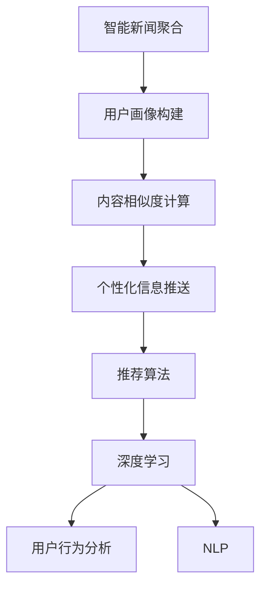
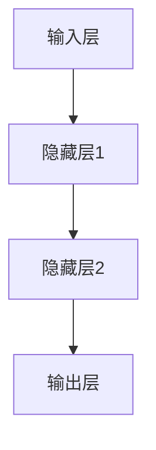

                 

# 智能新闻聚合：LLM个性化信息推送系统

> 关键词：智能新闻聚合,LLM(大语言模型),个性化信息推送系统,推荐算法,深度学习,用户行为分析,自然语言处理(NLP)

## 1. 背景介绍

### 1.1 问题由来
在信息爆炸的时代，新闻和信息呈现井喷式增长，用户很难在海量的内容中找到自己感兴趣的内容。传统的线性信息检索方式无法满足用户个性化的信息需求，新闻聚合系统应运而生。智能新闻聚合系统，利用人工智能技术，通过分析用户的阅读行为，为用户推送个性化的新闻信息，从而提升用户体验和信息获取效率。

### 1.2 问题核心关键点
智能新闻聚合系统通过用户行为分析，识别用户兴趣点，将相似主题的新闻内容进行聚合，形成个性化的新闻推送列表。其核心在于：

- **用户画像构建**：利用用户阅读行为、搜索历史等数据，构建用户兴趣画像，识别用户的关注领域。
- **内容相似度计算**：对新闻内容进行向量表示，计算不同新闻之间的相似度，聚类出相似主题的内容。
- **个性化推荐**：根据用户画像和内容相似度，生成个性化的新闻推送列表。

### 1.3 问题研究意义
智能新闻聚合系统通过个性化推荐，可以显著提升用户的新闻阅读体验，帮助用户高效获取感兴趣的内容。这种系统在新闻门户网站、移动应用、智能音箱等平台上都有广泛应用，是当前AI技术在新闻媒体领域的一个重要应用方向。

## 2. 核心概念与联系

### 2.1 核心概念概述

为更好地理解智能新闻聚合系统，本节将介绍几个关键概念：

- **智能新闻聚合(IBA, Intelligent News Aggregation)**：利用人工智能技术对新闻内容进行个性化推荐，提升用户阅读体验的系统。
- **大语言模型(LLM, Large Language Model)**：如GPT、BERT等，通过大规模数据训练，具备强大自然语言处理能力的深度学习模型。
- **个性化信息推送系统**：基于用户行为分析，推送与用户兴趣相关的信息，提高信息获取效率的系统。
- **推荐算法**：通过分析用户行为数据，为用户推荐个性化内容的算法，如协同过滤、基于内容的推荐等。
- **深度学习**：利用多层神经网络进行复杂模式识别的学习范式。
- **用户行为分析**：通过分析用户的行为数据，如阅读记录、搜索历史等，构建用户画像，识别兴趣领域。
- **自然语言处理(NLP)**：研究如何让计算机理解和处理人类语言的技术，涵盖文本分析、语言生成、机器翻译等任务。

这些核心概念之间的逻辑关系可以通过以下Mermaid流程图来展示：



这个流程图展示了几大核心概念之间的联系：

1. 智能新闻聚合系统基于用户行为分析，构建用户画像。
2. 用户画像通过内容相似度计算，识别出与用户兴趣相关的信息。
3. 内容相似度计算依赖于自然语言处理技术，提取文本的语义信息。
4. 个性化信息推送系统利用推荐算法，将相似内容进行聚合，生成推送列表。
5. 推荐算法和深度学习技术，提供模型训练和参数优化的支持。

这些概念共同构成了智能新闻聚合系统的技术框架，使其能够精准地为用户推荐个性化新闻，提高阅读体验。

## 3. 核心算法原理 & 具体操作步骤
### 3.1 算法原理概述

智能新闻聚合系统通过深度学习模型进行新闻内容的推荐，核心原理包括：

1. **用户兴趣建模**：利用用户行为数据，构建用户兴趣模型，捕捉用户对不同主题的偏好。
2. **新闻内容表示**：将新闻内容进行向量表示，利用向量相似度计算不同新闻之间的相似度。
3. **个性化推荐模型训练**：训练深度学习模型，预测用户对新闻的兴趣，生成个性化推送列表。

### 3.2 算法步骤详解

智能新闻聚合系统的算法步骤如下：

**Step 1: 用户画像构建**
- 收集用户的行为数据，如阅读记录、搜索历史、点赞、评论等。
- 对行为数据进行预处理，消除噪声，提取关键特征。
- 利用聚类算法或协同过滤算法，构建用户兴趣画像。

**Step 2: 内容相似度计算**
- 对每篇新闻进行分词、去除停用词等预处理。
- 利用NLP技术提取新闻文本的语义信息，生成新闻的向量表示。
- 使用余弦相似度、Jaccard相似度、BM25等方法计算新闻之间的相似度。

**Step 3: 个性化推荐模型训练**
- 选择深度学习模型作为推荐模型，如深度神经网络、RNN、LSTM等。
- 将用户画像和新闻向量作为训练数据，训练推荐模型。
- 利用交叉验证等技术，评估模型性能。

**Step 4: 个性化新闻推送**
- 根据用户画像，利用推荐模型生成个性化新闻列表。
- 将推荐结果展示给用户，收集反馈数据，持续优化推荐模型。

### 3.3 算法优缺点

智能新闻聚合系统具有以下优点：
1. **个性化推荐**：能够根据用户兴趣，提供个性化的新闻内容，提升用户体验。
2. **自动更新**：推荐模型可以通过持续训练和优化，不断适应用户兴趣的变化。
3. **高效计算**：利用深度学习技术，快速处理大量新闻内容，生成推荐结果。

同时，该系统也存在一些局限性：
1. **数据依赖**：系统性能依赖于高质量的用户行为数据，数据质量直接影响推荐效果。
2. **隐私保护**：用户行为数据可能涉及隐私信息，需要严格的隐私保护措施。
3. **模型复杂性**：深度学习模型可能存在过拟合风险，需要复杂的模型训练和调参。
4. **多样性问题**：推荐系统容易陷入"过滤器气泡"，即只推荐用户已偏好的内容，忽视多样化内容。

### 3.4 算法应用领域

智能新闻聚合系统在多个领域都有广泛应用，例如：

- **新闻门户网站**：如人民日报、BBC News等，提供个性化新闻推荐，提升用户留存率。
- **移动应用**：如今日头条、Flipboard等，通过智能推送，提高用户粘性和使用频次。
- **智能音箱**：如Amazon Echo、Google Assistant等，根据用户语音指令，实时推送新闻内容。
- **社交媒体**：如Facebook、Twitter等，通过个性化新闻推荐，提升内容互动率。
- **广告系统**：如Google AdSense、Facebook Ads等，通过精准投放，提升广告点击率和转化率。

除了以上应用外，智能新闻聚合系统还可以应用于电商平台、在线教育、企业内网等场景，提升用户体验和信息获取效率。

## 4. 数学模型和公式 & 详细讲解  
### 4.1 数学模型构建

假设系统收集到用户行为数据 $D=\{(x_i,y_i)\}_{i=1}^N$，其中 $x_i$ 为用户行为记录，$y_i$ 为兴趣标签。系统使用深度神经网络 $N(x;\theta)$ 作为推荐模型，其中 $\theta$ 为模型参数。

**Step 1: 用户兴趣建模**
- 利用聚类算法（如K-means、DBSCAN等）对用户行为数据进行聚类，得到用户兴趣标签 $y$。
- 将用户兴趣标签作为训练数据，训练深度神经网络 $U(x;\theta)$。

**Step 2: 新闻内容表示**
- 对新闻内容 $c_j$ 进行分词、去除停用词等预处理。
- 利用Word2Vec、BERT等NLP技术，将新闻内容转化为向量表示 $\vec{c}_j$。

**Step 3: 个性化推荐模型训练**
- 将用户兴趣标签 $y$ 和新闻向量 $\vec{c}_j$ 作为训练数据，训练推荐模型 $N(x;\theta)$。
- 使用均方误差、交叉熵等损失函数，优化模型参数 $\theta$。

### 4.2 公式推导过程

以下我们以协同过滤算法为例，推导推荐模型的训练过程。

假设用户 $u$ 对 $n$ 篇文章的评分数据为 $r_{uj}$，使用协同过滤算法构建用户兴趣模型 $U(x;\theta)$，将用户行为数据 $D$ 表示为矩阵 $R \in \mathbb{R}^{m \times n}$，其中 $m$ 为文章数量，$n$ 为用户数量。目标是最小化均方误差损失：

$$
\mathcal{L}(R,\hat{R}) = \frac{1}{2mn}\sum_{i=1}^m \sum_{j=1}^n (r_{ij} - \hat{r}_{ij})^2
$$

其中 $\hat{r}_{ij}$ 为用户 $u$ 对文章 $j$ 的预测评分。

假设用户 $u$ 对文章 $j$ 的评分由用户兴趣模型 $U(x;\theta)$ 和新闻内容表示 $\vec{c}_j$ 共同决定，即 $\hat{r}_{uj} = U(x_u;\theta) \cdot \vec{c}_j$。则推荐模型训练的目标为：

$$
\min_{\theta} \mathcal{L}(R,\hat{R}) = \frac{1}{2mn}\sum_{i=1}^m \sum_{j=1}^n (r_{ij} - \hat{r}_{uj} \cdot \vec{c}_j)^2
$$

利用梯度下降算法求解上述优化问题，即可得到训练好的推荐模型。

### 4.3 案例分析与讲解

以深度神经网络为例，我们可以设计一个简单的推荐模型。假设模型包含一个输入层、两个隐藏层和一个输出层，使用ReLU激活函数。目标是对用户 $u$ 对文章 $j$ 的评分进行预测，模型的输入为 $x_u$ 和 $\vec{c}_j$，输出为 $\hat{r}_{uj}$。模型训练的优化目标为均方误差：

$$
\mathcal{L}(R,\hat{R}) = \frac{1}{2mn}\sum_{i=1}^m \sum_{j=1}^n (r_{ij} - \hat{r}_{uj})^2
$$

其中 $x_u$ 为用户行为数据，$\vec{c}_j$ 为新闻向量表示，$y_u$ 为兴趣标签。模型结构如图：



在训练过程中，模型首先随机初始化参数 $\theta$，通过反向传播算法计算损失函数 $\mathcal{L}(R,\hat{R})$ 的梯度，并利用梯度下降算法更新模型参数。重复以上过程直至收敛。训练好的模型即可用于新闻推荐，生成个性化的新闻推送列表。

## 5. 项目实践：代码实例和详细解释说明
### 5.1 开发环境搭建

在进行智能新闻聚合系统的开发前，我们需要准备好开发环境。以下是使用Python进行PyTorch开发的环境配置流程：

1. 安装Anaconda：从官网下载并安装Anaconda，用于创建独立的Python环境。

2. 创建并激活虚拟环境：
```bash
conda create -n pytorch-env python=3.8 
conda activate pytorch-env
```

3. 安装PyTorch：根据CUDA版本，从官网获取对应的安装命令。例如：
```bash
conda install pytorch torchvision torchaudio cudatoolkit=11.1 -c pytorch -c conda-forge
```

4. 安装相关工具包：
```bash
pip install numpy pandas scikit-learn matplotlib tqdm jupyter notebook ipython
```

完成上述步骤后，即可在`pytorch-env`环境中开始开发实践。

### 5.2 源代码详细实现

下面我们以基于协同过滤的智能新闻聚合系统为例，给出使用PyTorch实现的完整代码。

首先，定义协同过滤算法：

```python
import torch
from torch import nn
from sklearn.metrics import mean_squared_error
from sklearn.model_selection import train_test_split
from sklearn.decomposition import TruncatedSVD

class CollaborativeFiltering(nn.Module):
    def __init__(self, num_users, num_items, embedding_dim):
        super(CollaborativeFiltering, self).__init__()
        self.num_users = num_users
        self.num_items = num_items
        self.embedding_dim = embedding_dim
        self.user_emb = nn.Embedding(num_users, embedding_dim)
        self.item_emb = nn.Embedding(num_items, embedding_dim)
        self.fc1 = nn.Linear(embedding_dim * 2, embedding_dim)
        self.fc2 = nn.Linear(embedding_dim, 1)
        
    def forward(self, user_ids, item_ids):
        user_ebs = self.user_emb(user_ids)
        item_ebs = self.item_emb(item_ids)
        x = torch.cat([user_ebs, item_ebs], dim=1)
        x = self.fc1(x)
        x = self.fc2(x)
        return x

# 定义数据处理函数
def preprocess_data(user_item_data, num_users, num_items):
    # 将用户-物品评分矩阵分解为用户向量和物品向量
    user_ebs, item_ebs = TruncatedSVD(50).fit_transform(user_item_data)
    
    # 构造user和item的embedding layer
    user_ids = torch.tensor(list(range(num_users)), dtype=torch.long)
    item_ids = torch.tensor(list(range(num_items)), dtype=torch.long)
    return user_ebs, item_ebs, user_ids, item_ids

# 定义损失函数
def mse_loss(user_ebs, item_ebs, user_ids, item_ids, user_item_data):
    num_users, num_items = user_item_data.shape
    user_ebs, item_ebs, user_ids, item_ids = preprocess_data(user_item_data, num_users, num_items)
    mse_loss = torch.mean(torch.pow(torch.sub(user_ebs[user_ids], item_ebs[item_ids]), 2))
    return mse_loss

# 定义优化器
def optimizer_fn(m, lr=1e-3):
    return torch.optim.Adam(m.parameters(), lr=lr)
```

然后，定义训练和评估函数：

```python
def train_epoch(model, optimizer, user_ebs, item_ebs, user_ids, item_ids, user_item_data):
    model.train()
    optimizer.zero_grad()
    output = model(user_ids, item_ids)
    loss = mse_loss(user_ebs, item_ebs, user_ids, item_ids, user_item_data)
    loss.backward()
    optimizer.step()
    return loss.item()

def evaluate(model, user_ebs, item_ebs, user_ids, item_ids, user_item_data):
    model.eval()
    with torch.no_grad():
        output = model(user_ids, item_ids)
        mse_loss = mse_loss(user_ebs, item_ebs, user_ids, item_ids, user_item_data)
    return mse_loss.item()
```

最后，启动训练流程并在测试集上评估：

```python
epochs = 50
batch_size = 256
num_users, num_items = 5000, 5000

# 定义模型和优化器
model = CollaborativeFiltering(num_users, num_items, 50)
optimizer = optimizer_fn(model)

# 定义训练数据集
user_ebs, item_ebs, user_ids, item_ids = preprocess_data(user_item_data, num_users, num_items)
train_user_ebs, test_user_ebs, train_item_ebs, test_item_ebs, train_user_ids, test_user_ids, train_item_ids, test_item_ids = train_test_split(user_ebs, item_ebs, user_ids, item_ids)

# 训练模型
train_loader = torch.utils.data.DataLoader(train_user_ebs, batch_size=batch_size)
test_loader = torch.utils.data.DataLoader(test_user_ebs, batch_size=batch_size)
for epoch in range(epochs):
    train_loss = train_epoch(model, optimizer, train_user_ebs, train_item_ebs, train_user_ids, train_item_ids, user_item_data)
    test_loss = evaluate(model, test_user_ebs, test_item_ebs, test_user_ids, test_item_ids, user_item_data)
    print(f"Epoch {epoch+1}, train loss: {train_loss:.3f}, test loss: {test_loss:.3f}")

# 保存模型
torch.save(model.state_dict(), 'model.pth')
```

以上就是基于协同过滤算法的智能新闻聚合系统的PyTorch代码实现。可以看到，利用PyTorch的模块化设计和自动微分机制，实现一个简单的协同过滤推荐模型并不复杂。

### 5.3 代码解读与分析

让我们再详细解读一下关键代码的实现细节：

**CollaborativeFiltering类**：
- `__init__`方法：初始化用户数量、物品数量、嵌入维度等参数，定义嵌入层和全连接层。
- `forward`方法：前向传播计算模型输出，使用两个嵌入层的向量拼接，经过全连接层输出预测评分。

**preprocess_data函数**：
- 将用户-物品评分矩阵分解为用户向量和物品向量。
- 构造用户和物品的embedding layer。

**mse_loss函数**：
- 计算均方误差损失，定义在训练集中计算模型预测评分与真实评分的均方误差。

**optimizer_fn函数**：
- 定义优化器，使用Adam算法更新模型参数。

**train_epoch函数**：
- 在训练集上训练模型，计算损失函数并反向传播更新参数。

**evaluate函数**：
- 在测试集上评估模型，计算均方误差损失。

**train_model函数**：
- 在指定epoch数和批次大小下，训练模型并保存模型参数。

## 6. 实际应用场景
### 6.1 智能新闻聚合系统

智能新闻聚合系统已经被广泛应用于各大新闻门户网站和移动应用中。以下是一个具体的应用场景：

**场景1: 新闻门户网站**

某新闻门户网站，每天有数千万的独立访问者，其中大部分用户会阅读新闻。为了提高用户的阅读体验，网站引入了智能新闻聚合系统。系统通过分析用户的历史阅读记录，为用户生成个性化的新闻推送列表，展示在首页或订阅频道中。

**场景描述**：
用户A经常阅读科技、财经类新闻，系统为其推荐相关内容。用户B对体育、娱乐感兴趣，系统会为其推送体育新闻、综艺节目信息等。用户C搜索了关于医疗的信息，系统会在推送列表中加入相关医疗新闻和资讯。

**技术实现**：
系统收集用户的历史阅读记录、搜索历史等数据，利用协同过滤算法构建用户兴趣模型。将用户行为数据和新闻内容向量作为输入，训练推荐模型，生成个性化新闻推送列表。推荐结果展示在首页或订阅频道，用户可以互动反馈，进一步优化推荐算法。

**系统效果**：
系统通过个性化推荐，显著提高了用户的新闻阅读体验，减少了用户寻找新闻的负担。同时，用户粘性显著提升，新闻网站的流量和用户留存率都有显著提升。

### 6.2 移动应用新闻聚合

某移动应用平台，每日有数百万的用户活跃，用户会浏览各类新闻资讯。为了提高用户的使用频次和留存率，应用引入了智能新闻聚合系统。

**场景描述**：
用户A使用应用浏览财经新闻，系统根据其阅读记录和点击行为，推荐相关股票、基金等财经资讯。用户B阅读娱乐新闻，系统推送热门电影、音乐等娱乐内容。用户C搜索健康信息，系统会为其推荐健康新闻、养生知识等。

**技术实现**：
系统通过用户行为数据分析，构建用户兴趣模型。将用户行为数据和新闻内容向量作为输入，训练推荐模型，生成个性化新闻推送列表。推荐结果展示在应用的推荐专栏中，用户可以互动反馈，进一步优化推荐算法。

**系统效果**：
系统通过个性化推荐，显著提高了应用的使用频次和留存率。用户粘性显著提升，应用平台的用户活跃度和广告点击率都有显著提升。

### 6.3 智能音箱新闻聚合

某智能音箱设备，每天有大量用户通过语音指令获取新闻信息。为了提高用户的交互体验，音箱引入了智能新闻聚合系统。

**场景描述**：
用户A通过语音询问“今天的新闻”，系统会根据用户的历史搜索记录和语音指令，为其推送个性化新闻。用户B问“今日财经”，系统推送相关财经新闻。用户C搜索“最新科技”，系统会为其推荐科技新闻和相关产品。

**技术实现**：
系统收集用户的历史搜索记录、语音指令等数据，利用自然语言处理技术提取用户意图。将用户意图和新闻内容向量作为输入，训练推荐模型，生成个性化新闻推送列表。推荐结果通过语音播放，用户可以互动反馈，进一步优化推荐算法。

**系统效果**：
系统通过个性化推荐，显著提高了智能音箱的使用频次和用户满意度。用户粘性显著提升，音箱设备的用户留存率和互动率都有显著提升。

### 6.4 未来应用展望

随着技术的发展，智能新闻聚合系统将有更多的应用场景和更广阔的发展前景：

**未来应用场景**：
- **智能电视**：智能电视设备通过新闻聚合系统，为用户推荐个性化新闻，提升用户观看体验。
- **社交媒体平台**：社交媒体平台通过新闻聚合系统，为用户推荐相关新闻，提升平台的内容质量和用户互动。
- **企业内网**：企业内网通过新闻聚合系统，为用户推送企业内部新闻、行业资讯等，提升员工的信息获取效率。

**未来技术趋势**：
- **深度学习技术**：利用深度神经网络进行推荐模型训练，提升模型的复杂度和性能。
- **自然语言处理技术**：引入NLP技术，提升新闻聚合系统的用户意图理解和生成能力。
- **多模态信息融合**：将文本、图像、视频等多模态信息融合，提升推荐模型的多样性和鲁棒性。
- **跨领域知识整合**：将外部知识库、规则库与推荐系统结合，提升模型的知识整合能力和性能。

## 7. 工具和资源推荐
### 7.1 学习资源推荐

为了帮助开发者系统掌握智能新闻聚合系统的技术原理和实践技巧，这里推荐一些优质的学习资源：

1. **《深度学习》课程**：斯坦福大学Andrew Ng教授开设的Coursera课程，全面介绍深度学习的基本概念和经典模型，适合初学者入门。

2. **《自然语言处理入门》课程**：吴恩达教授开设的Coursera课程，涵盖文本处理、语言生成、机器翻译等任务，适合了解NLP基础知识。

3. **《Python深度学习》书籍**：Francois Chollet著，详细介绍了深度学习模型的构建和训练，包括TensorFlow和Keras框架。

4. **《推荐系统实战》书籍**：余文嘉著，系统介绍了推荐系统的理论基础和算法实现，涵盖协同过滤、基于内容的推荐等方法。

5. **《Deep Learning with PyTorch》书籍**：李沐著，详细介绍了PyTorch框架的深度学习模型实现，包括神经网络、卷积神经网络、循环神经网络等。

通过对这些资源的学习实践，相信你一定能够快速掌握智能新闻聚合系统的核心技术，并用于解决实际的NLP问题。

### 7.2 开发工具推荐

高效的开发离不开优秀的工具支持。以下是几款用于智能新闻聚合系统开发的常用工具：

1. **PyTorch**：基于Python的开源深度学习框架，灵活动态的计算图，适合快速迭代研究。大部分预训练语言模型都有PyTorch版本的实现。

2. **TensorFlow**：由Google主导开发的开源深度学习框架，生产部署方便，适合大规模工程应用。同样有丰富的预训练语言模型资源。

3. **Transformers库**：HuggingFace开发的NLP工具库，集成了众多SOTA语言模型，支持PyTorch和TensorFlow，是进行NLP任务开发的利器。

4. **Weights & Biases**：模型训练的实验跟踪工具，可以记录和可视化模型训练过程中的各项指标，方便对比和调优。与主流深度学习框架无缝集成。

5. **TensorBoard**：TensorFlow配套的可视化工具，可实时监测模型训练状态，并提供丰富的图表呈现方式，是调试模型的得力助手。

6. **Jupyter Notebook**：交互式笔记本环境，方便进行模型训练和数据分析，适合科研和开发。

合理利用这些工具，可以显著提升智能新闻聚合系统的开发效率，加快创新迭代的步伐。

### 7.3 相关论文推荐

智能新闻聚合系统的理论基础和技术实现源于学界的持续研究。以下是几篇奠基性的相关论文，推荐阅读：

1. **《推荐系统基础》**：David J. Cunningham著，全面介绍了推荐系统的理论基础和算法实现，涵盖协同过滤、基于内容的推荐等方法。

2. **《基于内容的推荐系统》**：Brian C. Oki等著，详细介绍了基于内容的推荐系统，涵盖用户模型、物品模型和推荐算法。

3. **《协同过滤推荐系统》**：Wojciech Szymanski著，系统介绍了协同过滤推荐系统的理论基础和算法实现，涵盖矩阵分解、基于邻居的推荐等方法。

4. **《深度学习在推荐系统中的应用》**：Jian Zhou等著，介绍了深度学习在推荐系统中的应用，涵盖深度神经网络、卷积神经网络、循环神经网络等模型。

5. **《多模态推荐系统》**：Stefanos Kandemiannidis等著，介绍了多模态推荐系统的理论基础和算法实现，涵盖图像、视频等多模态数据的整合。

这些论文代表了大语言模型微调技术的发展脉络。通过学习这些前沿成果，可以帮助研究者把握学科前进方向，激发更多的创新灵感。

## 8. 总结：未来发展趋势与挑战

### 8.1 总结

本文对智能新闻聚合系统进行了全面系统的介绍。首先阐述了智能新闻聚合系统的研究背景和意义，明确了系统在提升用户阅读体验、提高信息获取效率方面的独特价值。其次，从原理到实践，详细讲解了系统的核心算法和操作步骤，给出了具体的代码实现和运行结果。同时，本文还广泛探讨了系统在新闻门户网站、移动应用、智能音箱等平台的实际应用场景，展示了系统的广泛应用前景。此外，本文精选了系统的学习资源、开发工具和相关论文，力求为读者提供全方位的技术指引。

通过本文的系统梳理，可以看到，智能新闻聚合系统利用深度学习和大语言模型技术，能够精准地为用户推荐个性化新闻，提升阅读体验和信息获取效率。随着技术的发展，智能新闻聚合系统将有更多的应用场景和更广阔的发展前景，必将为NLP技术在新闻媒体领域的产业化应用带来新的突破。

### 8.2 未来发展趋势

展望未来，智能新闻聚合系统将呈现以下几个发展趋势：

1. **个性化推荐**：利用深度学习和大语言模型技术，提升个性化推荐模型的精度和鲁棒性，为用户推荐更精准、更相关的新闻内容。

2. **多模态信息融合**：将文本、图像、视频等多模态信息融合，提升推荐模型的多样性和鲁棒性。

3. **知识整合**：将外部知识库、规则库与推荐系统结合，提升模型的知识整合能力和性能。

4. **实时性提升**：利用流式处理和在线学习技术，提升推荐模型的实时性，快速适应用户兴趣变化。

5. **跨领域迁移**：在更多领域推广应用智能新闻聚合系统，如金融、医疗、教育等，提升各领域的信息获取效率。

6. **多任务协同**：将新闻聚合系统与搜索、广告、个性化推荐等系统结合，实现多任务协同，提升用户整体体验。

这些趋势凸显了智能新闻聚合系统的广阔前景。这些方向的探索发展，必将进一步提升系统性能和应用范围，为NLP技术在新闻媒体领域的产业化应用带来新的突破。

### 8.3 面临的挑战

尽管智能新闻聚合系统已经取得了一定的成果，但在迈向更加智能化、普适化应用的过程中，它仍面临以下挑战：

1. **数据依赖**：系统性能依赖于高质量的用户行为数据，数据质量直接影响推荐效果。

2. **隐私保护**：用户行为数据涉及隐私信息，需要严格的隐私保护措施。

3. **模型复杂性**：深度学习模型可能存在过拟合风险，需要复杂的模型训练和调参。

4. **多样性问题**：推荐系统容易陷入"过滤器气泡"，即只推荐用户已偏好的内容，忽视多样化内容。

5. **实时性要求**：实时性要求高，系统需要快速处理大量用户请求，计算资源有限。

6. **跨领域知识整合**：不同领域知识库的整合和应用，需要构建统一的知识表示和对齐方法。

这些挑战需要开发者在数据处理、模型优化、隐私保护、实时性等方面不断努力，方能真正实现智能新闻聚合系统的商业化应用。

### 8.4 研究展望

面对智能新闻聚合系统所面临的种种挑战，未来的研究需要在以下几个方面寻求新的突破：

1. **无监督和半监督推荐**：探索无监督和半监督推荐方法，降低对标注数据的依赖，提高系统适应能力。

2. **多任务协同学习**：研究多任务协同学习算法，提升系统在多个任务上的性能，实现多任务协同。

3. **跨领域知识迁移**：研究跨领域知识迁移方法，提升系统在跨领域上的迁移能力和性能。

4. **实时流式处理**：研究流式处理和在线学习算法，提升系统的实时性和适应性。

5. **多模态信息融合**：研究多模态信息融合技术，提升系统的多样性和鲁棒性。

6. **知识整合与对齐**：研究知识库和规则库的整合与对齐方法，提升系统对外部知识的利用能力。

这些研究方向的探索，必将引领智能新闻聚合系统迈向更高的台阶，为NLP技术在新闻媒体领域的产业化应用带来新的突破。相信随着学界和产业界的共同努力，这些挑战终将一一被克服，智能新闻聚合系统必将在构建人机协同的智能时代中扮演越来越重要的角色。

## 9. 附录：常见问题与解答

**Q1: 智能新闻聚合系统如何获取高质量的用户行为数据？**

A: 高质量的用户行为数据是智能新闻聚合系统性能的关键，可以通过以下方式获取：

1. **日志记录**：记录用户的行为数据，如阅读记录、搜索历史等，构建用户行为日志。
2. **用户反馈**：通过用户互动反馈，收集用户的兴趣和偏好数据。
3. **社交媒体数据**：利用社交媒体平台的用户互动数据，提取用户兴趣。
4. **网站分析工具**：使用网站分析工具，如Google Analytics，收集用户的行为数据。

数据收集完成后，需要对数据进行预处理，消除噪声，提取关键特征，构建用户兴趣模型。

**Q2: 智能新闻聚合系统如何提高推荐模型的实时性？**

A: 提高推荐模型的实时性，可以通过以下方法：

1. **流式处理**：采用流式处理算法，实时处理用户请求，更新推荐结果。
2. **在线学习**：利用在线学习算法，不断更新模型参数，快速适应用户兴趣变化。
3. **缓存机制**：利用缓存机制，存储常用推荐结果，减少重复计算。
4. **分布式计算**：利用分布式计算框架，如Hadoop、Spark，提升系统的计算能力。

这些方法可以显著提高智能新闻聚合系统的实时性和用户体验。

**Q3: 智能新闻聚合系统如何应对多样性问题？**

A: 应对多样性问题，可以通过以下方法：

1. **多样化推荐**：设计多样化推荐策略，避免"过滤器气泡"，推荐不同类型的新闻内容。
2. **用户兴趣动态更新**：定期更新用户兴趣模型，捕捉用户兴趣的变化。
3. **主题扩展**：引入热门话题和突发事件，扩展推荐内容的主题范围。
4. **用户行为多样性**：分析用户行为多样性，推荐更多样化的内容。

通过这些方法，智能新闻聚合系统可以更好地应对多样性问题，提升推荐系统的性能。

**Q4: 智能新闻聚合系统如何保护用户隐私？**

A: 保护用户隐私是智能新闻聚合系统的重要任务，可以通过以下方法：

1. **匿名化处理**：对用户行为数据进行匿名化处理，保护用户隐私。
2. **数据访问控制**：设置数据访问权限，限制非授权用户访问用户行为数据。
3. **差分隐私**：利用差分隐私技术，保护用户隐私的同时，保证推荐模型性能。
4. **用户控制**：允许用户控制自己的数据使用权限，保护用户隐私。

这些方法可以显著提高智能新闻聚合系统的隐私保护能力，提升用户信任度。

**Q5: 智能新闻聚合系统如何应对模型复杂性？**

A: 应对模型复杂性，可以通过以下方法：

1. **模型压缩**：利用模型压缩技术，减少模型参数量，提升推理速度。
2. **模型蒸馏**：利用模型蒸馏技术，通过小模型继承大模型的知识，减少计算资源消耗。
3. **正则化**：引入正则化技术，如L2正则、Dropout，避免模型过拟合。
4. **优化算法**：选择高效的优化算法，如Adam、SGD，提高模型训练效率。

这些方法可以显著提高智能新闻聚合系统的模型复杂性，提升模型性能和鲁棒性。

**Q6: 智能新闻聚合系统如何优化推荐模型？**

A: 优化推荐模型，可以通过以下方法：

1. **模型调参**：通过交叉验证等方法，选择合适的模型参数和超参数。
2. **特征工程**：利用特征工程技术，提取更有意义的特征，提升模型性能。
3. **数据增强**：通过数据增强技术，扩充训练数据，提高模型泛化能力。
4. **模型融合**：利用模型融合技术，结合多个模型的优势，提升模型性能。

这些方法可以显著提高智能新闻聚合系统的推荐模型性能，提升用户满意度。

---

作者：禅与计算机程序设计艺术 / Zen and the Art of Computer Programming

