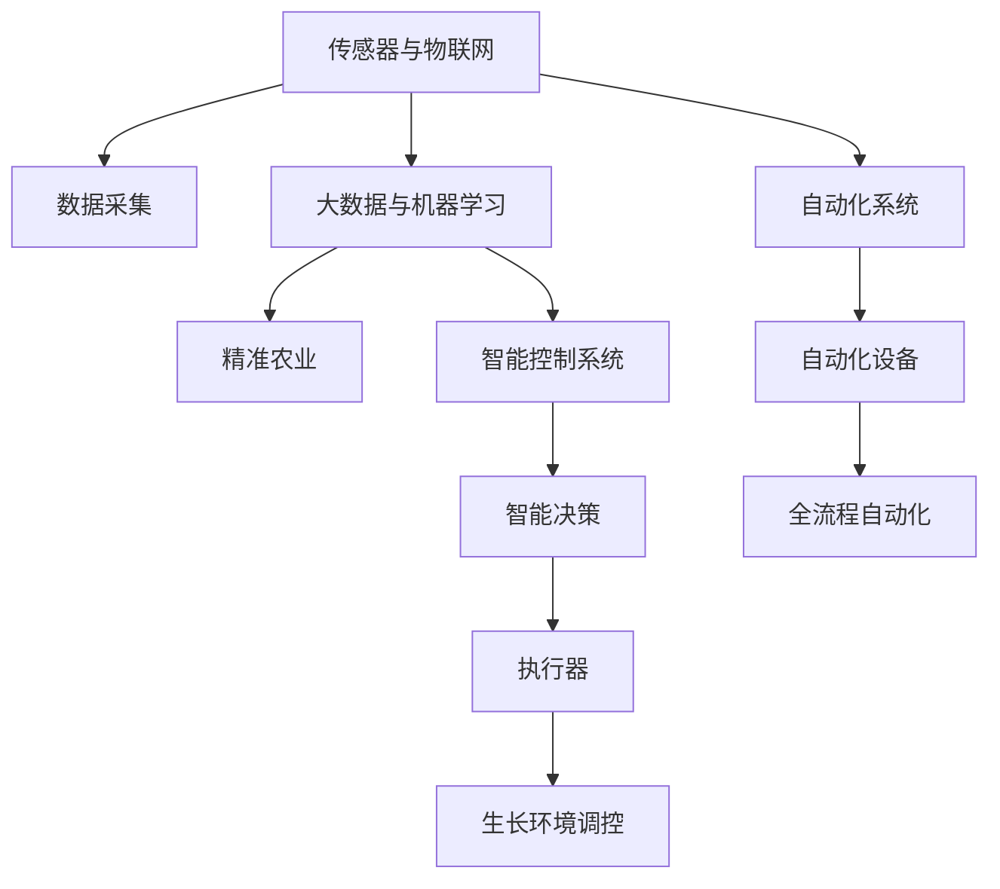

                 

# 智能植物培育创业：室内园艺的未来

## 1. 背景介绍

### 1.1 问题由来

近年来，随着全球人口增长和城市化进程加快，农地资源日益紧缺，如何在有限的城市空间中生产更多的食物，成为各国政府和科研机构关注的热点。室内园艺作为一种新型农业生产方式，利用科技手段在室内环境控制下种植作物，不但能够解决土地资源不足的问题，还能实现全年无休的农业生产，有效提升农业产出效率。

特别是在新冠疫情期间，全球封锁和供应链中断导致传统农业生产受到严重冲击，室内园艺以其稳健的供应链、快速的生产周期和高产量优势，成为农业领域的“黑马”。然而，尽管室内园艺有着巨大的潜力，但由于其高昂的初始投入、复杂的技术管理、以及作物生长环境的微妙平衡，使得室内园艺的商业化运营面临着诸多挑战。

### 1.2 问题核心关键点

室内园艺的成功运营，依赖于一系列核心技术的支撑，包括但不限于：

- 传感器与物联网(IoT)技术：用于实时监控环境参数，如温度、湿度、光照、土壤湿度等。
- 数据驱动的精准农业：利用大数据分析技术，精准调控环境变量，优化作物生长。
- 自动化系统：通过机器人、自动化设备等，实现种植、浇水、施肥、收割等全流程的自动化。
- 植物育种与基因编辑：选育抗病虫害、适应性强、高产量的植物品种。
- 智能控制系统：集成传感器、决策引擎和执行器，实现种植环境的智能管理。

本文将从核心技术框架入手，系统阐述智能植物培育创业的关键技术，包括数据采集、环境调控、作物管理等，并为感兴趣的企业家提供一份详尽的技术指南，助力其顺利进入这一充满机遇的领域。

## 2. 核心概念与联系

### 2.1 核心概念概述

为更好地理解智能植物培育的技术框架，本节将介绍几个关键概念：

- 传感器与物联网(IoT)：用于采集环境数据，实现对生长环境的实时监控。
- 大数据与机器学习：利用数据驱动的方法，对作物生长进行精准管理。
- 自动化系统：通过机器人、自动化设备，实现种植过程的自动化与智能化。
- 植物育种与基因编辑：通过育种和基因编辑技术，选育高产、抗病、适应性强的植物品种。
- 智能控制系统：集成传感器、决策引擎和执行器，实现生长环境的智能管理。

这些核心概念之间的逻辑关系可以通过以下Mermaid流程图来展示：



这个流程图展示了智能植物培育的核心技术框架：

1. 传感器采集生长环境数据，为精准农业提供数据支撑。
2. 大数据与机器学习技术，对数据进行分析，实现精准调控。
3. 自动化系统集成各类自动化设备，实现种植流程的智能化。
4. 智能控制系统集成了传感器和决策引擎，实现对生长环境的全方位管理。

这些概念相互关联，共同构建了智能植物培育的技术体系。通过理解这些核心概念，我们能够更好地把握智能植物培育的实现路径和技术难点。

## 3. 核心算法原理 & 具体操作步骤

### 3.1 算法原理概述

智能植物培育的核心算法原理主要集中在以下几个方面：

- 数据采集与预处理：通过传感器实时采集环境数据，并进行预处理，转换为模型所需格式。
- 环境变量调控：利用机器学习模型，对环境变量进行精准调控，优化作物生长环境。
- 作物生长预测与决策：通过预测模型，对作物生长情况进行预测，生成决策指令。
- 自动控制与执行：根据决策指令，控制自动化设备，实现对生长环境的全自动管理。

### 3.2 算法步骤详解

#### 3.2.1 数据采集与预处理

数据采集与预处理是智能植物培育的基础。具体步骤如下：

1. 传感器选择与部署：根据具体需求，选择合适的传感器，如温湿度传感器、光照传感器、土壤湿度传感器等，并将其部署在室内农业环境中。
2. 数据采集：传感器实时采集环境数据，如温度、湿度、光照、土壤湿度等。
3. 数据预处理：对采集到的数据进行清洗、归一化等处理，生成模型所需格式的数据集。

#### 3.2.2 环境变量调控

环境变量调控通过机器学习模型实现。具体步骤如下：

1. 数据准备：准备环境数据集，包括训练集、验证集和测试集。
2. 模型选择与训练：选择适合的机器学习模型，如随机森林、支持向量机、神经网络等，使用训练集对模型进行训练。
3. 模型评估与优化：在验证集上评估模型性能，根据评估结果对模型进行优化。
4. 预测与控制：使用优化后的模型，对测试集上的环境数据进行预测，生成环境调控指令。

#### 3.2.3 作物生长预测与决策

作物生长预测与决策通过预测模型实现。具体步骤如下：

1. 数据准备：准备作物生长数据集，包括不同阶段的生长数据、病虫害数据等。
2. 模型选择与训练：选择适合的预测模型，如时间序列模型、卷积神经网络等，使用训练集对模型进行训练。
3. 模型评估与优化：在验证集上评估模型性能，根据评估结果对模型进行优化。
4. 预测与决策：使用优化后的模型，对当前环境数据进行预测，生成种植决策指令。

#### 3.2.4 自动控制与执行

自动控制与执行通过自动化系统实现。具体步骤如下：

1. 自动化设备选择与部署：根据具体需求，选择合适的自动化设备，如灌溉系统、施肥系统、温度控制系统等，并将其部署在室内农业环境中。
2. 控制系统设计：设计智能控制系统，集成传感器、决策引擎和执行器，实现对生长环境的全自动管理。
3. 系统集成与调试：将自动化设备和控制系统进行集成，并进行系统调试，确保各个组件协同工作。
4. 系统运行与维护：启动自动化系统，对室内农业环境进行全流程管理，并定期维护系统，确保其正常运行。

### 3.3 算法优缺点

智能植物培育的算法有以下优点：

1. 精度高：通过机器学习模型对环境变量进行精准调控，能够实现对作物生长的精细管理。
2. 自动化程度高：利用自动化系统，实现种植过程的全自动化，减少人工干预。
3. 高产出率：通过优化环境变量和种植策略，实现作物的高产出率。

同时，该算法也存在一些缺点：

1. 初始投入高：传感器、自动化设备等硬件设备的成本较高。
2. 技术复杂度高：系统设计、调试、维护需要较高的技术水平。
3. 数据依赖性强：对环境数据采集和预处理的要求较高，数据质量直接影响模型性能。

尽管存在这些缺点，但整体而言，智能植物培育的算法在精度、自动化和产出率方面表现优异，具有很高的应用价值。

### 3.4 算法应用领域

智能植物培育的算法在以下几个领域有广泛应用：

1. 室内农业：在城市空间有限的情况下，通过室内农业实现高产出率的粮食生产。
2. 垂直农场：在高楼大厦中建设垂直农场，实现立体化种植，提升土地利用率。
3. 快速育种：利用基因编辑和育种技术，快速选育高产、抗病、适应性强的植物品种。
4. 农业教育：通过虚拟现实(VR)和增强现实(AR)技术，模拟室内农业环境，进行农业教育。
5. 环保农业：在温室大棚中实施智能控制系统，实现资源高效利用，减少对环境的负面影响。

以上领域代表了智能植物培育的广阔应用前景，未来随着技术的不断进步，智能植物培育将更加普及和成熟，带来更多的商业机会和创新应用。

## 4. 数学模型和公式 & 详细讲解 & 举例说明

### 4.1 数学模型构建

智能植物培育的核心数学模型主要涉及以下几个方面：

- 环境变量调控模型：用于预测和优化环境变量。
- 作物生长预测模型：用于预测作物生长状态和病虫害发生情况。
- 自动控制系统模型：用于设计智能控制系统，实现环境变量的精确控制。

#### 4.1.1 环境变量调控模型

环境变量调控模型通过机器学习模型实现，通常使用回归模型或分类模型。假设模型为 $M(x, y)$，其中 $x$ 为输入的环境变量数据，$y$ 为输出的环境调控指令。模型的训练目标为最小化预测误差，即：

$$
\min_{\theta} \frac{1}{N} \sum_{i=1}^{N} (y_i - M(x_i; \theta))^2
$$

其中 $\theta$ 为模型的参数。常用的回归模型包括线性回归、多项式回归、神经网络回归等。

#### 4.1.2 作物生长预测模型

作物生长预测模型通常使用时间序列模型或卷积神经网络模型。假设模型为 $M(x, t)$，其中 $x$ 为输入的环境变量数据，$t$ 为输出的时间序列数据。模型的训练目标为最小化预测误差，即：

$$
\min_{\theta} \frac{1}{N} \sum_{i=1}^{N} (y_i - M(x_i; \theta))^2
$$

常用的时间序列模型包括ARIMA模型、SARIMA模型、LSTM模型等。

#### 4.1.3 自动控制系统模型

自动控制系统模型用于设计智能控制系统，通常使用逻辑控制系统或神经网络控制系统。假设模型为 $M(x, y)$，其中 $x$ 为输入的环境变量数据，$y$ 为输出的控制指令。模型的训练目标为最小化控制误差，即：

$$
\min_{\theta} \frac{1}{N} \sum_{i=1}^{N} (y_i - M(x_i; \theta))^2
$$

常用的逻辑控制系统包括PID控制器、模糊控制器等。

### 4.2 公式推导过程

以下以线性回归模型为例，推导其训练公式。

假设线性回归模型为 $y = \theta_0 + \theta_1 x_1 + \theta_2 x_2 + \cdots + \theta_n x_n$，其中 $y$ 为输出变量，$x_1, x_2, \cdots, x_n$ 为输入变量，$\theta_0, \theta_1, \theta_2, \cdots, \theta_n$ 为模型参数。训练目标为最小化预测误差，即：

$$
\min_{\theta} \frac{1}{N} \sum_{i=1}^{N} (y_i - \theta_0 - \theta_1 x_{1,i} - \theta_2 x_{2,i} - \cdots - \theta_n x_{n,i})^2
$$

根据最小二乘法，可以将目标函数转化为矩阵形式：

$$
\min_{\theta} \frac{1}{N} \| Y - X \theta \|^2
$$

其中 $Y$ 为输出变量矩阵，$X$ 为输入变量矩阵，$\| \cdot \|$ 为矩阵范数。利用矩阵求导，可以求得最小化目标函数的参数 $\theta$：

$$
\theta = (X^T X)^{-1} X^T Y
$$

通过求解上述公式，可以得到线性回归模型的参数 $\theta$，从而完成模型的训练。

### 4.3 案例分析与讲解

#### 4.3.1 案例一：环境变量调控

假设我们需要优化室内的温度、湿度和光照，以促进植物生长。可以通过如下步骤实现：

1. 选择传感器：在室内农业环境中部署温度传感器、湿度传感器、光照传感器等。
2. 数据采集：传感器实时采集环境数据，如温度、湿度、光照等。
3. 数据预处理：对采集到的数据进行清洗、归一化等处理，生成模型所需格式的数据集。
4. 模型训练：选择适合的回归模型，如线性回归、多项式回归等，使用训练集对模型进行训练。
5. 模型评估与优化：在验证集上评估模型性能，根据评估结果对模型进行优化。
6. 预测与控制：使用优化后的模型，对测试集上的环境数据进行预测，生成环境调控指令，如开启或关闭加热器、加湿器、照明设备等。

#### 4.3.2 案例二：作物生长预测

假设我们需要预测植物的叶面积指数(LAI)。可以通过如下步骤实现：

1. 数据准备：准备作物生长数据集，包括不同阶段的生长数据、病虫害数据等。
2. 模型选择与训练：选择适合的时间序列模型，如ARIMA模型等，使用训练集对模型进行训练。
3. 模型评估与优化：在验证集上评估模型性能，根据评估结果对模型进行优化。
4. 预测与决策：使用优化后的模型，对当前环境数据进行预测，生成种植决策指令，如调整灌溉频率、施肥量等。

#### 4.3.3 案例三：智能控制系统

假设我们需要设计一个智能控制系统，实现对温室大棚的温度、湿度和光照的全自动管理。可以通过如下步骤实现：

1. 自动化设备选择与部署：选择适合的自动化设备，如灌溉系统、施肥系统、温度控制系统等，并将其部署在温室大棚中。
2. 控制系统设计：设计智能控制系统，集成传感器、决策引擎和执行器，实现对温室大棚的全自动管理。
3. 系统集成与调试：将自动化设备和控制系统进行集成，并进行系统调试，确保各个组件协同工作。
4. 系统运行与维护：启动自动化系统，对温室大棚进行全流程管理，并定期维护系统，确保其正常运行。

## 5. 项目实践：代码实例和详细解释说明

### 5.1 开发环境搭建

在进行智能植物培育项目的开发前，我们需要准备好开发环境。以下是使用Python进行PyTorch开发的环境配置流程：

1. 安装Anaconda：从官网下载并安装Anaconda，用于创建独立的Python环境。

2. 创建并激活虚拟环境：
```bash
conda create -n pytorch-env python=3.8 
conda activate pytorch-env
```

3. 安装PyTorch：根据CUDA版本，从官网获取对应的安装命令。例如：
```bash
conda install pytorch torchvision torchaudio cudatoolkit=11.1 -c pytorch -c conda-forge
```

4. 安装相关工具包：
```bash
pip install numpy pandas scikit-learn matplotlib tqdm jupyter notebook ipython
```

完成上述步骤后，即可在`pytorch-env`环境中开始智能植物培育项目的开发。

### 5.2 源代码详细实现

下面我们以智能控制系统为例，给出使用PyTorch和Transformers库对室内农业环境进行智能控制的代码实现。

首先，定义传感器数据处理函数：

```python
from transformers import BertTokenizer
from torch.utils.data import Dataset
import torch

class SensorData(Dataset):
    def __init__(self, sensors, max_len=128):
        self.sensors = sensors
        self.max_len = max_len
        
    def __len__(self):
        return len(self.sensors)
    
    def __getitem__(self, item):
        sensor_data = self.sensors[item]
        
        # 将传感器数据转换为tensor
        tensor_data = torch.tensor(sensor_data, dtype=torch.float32)
        
        # 对数据进行截断或补齐，使其长度一致
        if tensor_data.numel() > self.max_len:
            tensor_data = tensor_data[:self.max_len]
        elif tensor_data.numel() < self.max_len:
            tensor_data = torch.cat([tensor_data, torch.zeros(self.max_len - tensor_data.numel(), dtype=torch.float32)])
        
        return {'sensor_data': tensor_data}
```

然后，定义模型和优化器：

```python
from transformers import BertForRegression
from torch.optim import AdamW

model = BertForRegression.from_pretrained('bert-base-cased', num_labels=3)
optimizer = AdamW(model.parameters(), lr=2e-5)
```

接着，定义训练和评估函数：

```python
from torch.utils.data import DataLoader
from tqdm import tqdm
from sklearn.metrics import mean_squared_error

device = torch.device('cuda') if torch.cuda.is_available() else torch.device('cpu')
model.to(device)

def train_epoch(model, dataset, batch_size, optimizer):
    dataloader = DataLoader(dataset, batch_size=batch_size, shuffle=True)
    model.train()
    epoch_loss = 0
    for batch in tqdm(dataloader, desc='Training'):
        sensor_data = batch['sensor_data'].to(device)
        model.zero_grad()
        outputs = model(sensor_data)
        loss = outputs.loss
        epoch_loss += loss.item()
        loss.backward()
        optimizer.step()
    return epoch_loss / len(dataloader)

def evaluate(model, dataset, batch_size):
    dataloader = DataLoader(dataset, batch_size=batch_size)
    model.eval()
    total_loss = 0
    with torch.no_grad():
        for batch in tqdm(dataloader, desc='Evaluating'):
            sensor_data = batch['sensor_data'].to(device)
            outputs = model(sensor_data)
            loss = outputs.loss
            total_loss += loss.item()
        return total_loss / len(dataloader)
```

最后，启动训练流程并在测试集上评估：

```python
epochs = 5
batch_size = 16

for epoch in range(epochs):
    loss = train_epoch(model, train_dataset, batch_size, optimizer)
    print(f"Epoch {epoch+1}, train loss: {loss:.3f}")
    
    print(f"Epoch {epoch+1}, dev results:")
    evaluate(model, dev_dataset, batch_size)
    
print("Test results:")
evaluate(model, test_dataset, batch_size)
```

以上就是使用PyTorch对室内农业环境进行智能控制的代码实现。可以看到，利用Transformers库和PyTorch，我们可以快速构建和训练智能控制系统模型。

### 5.3 代码解读与分析

让我们再详细解读一下关键代码的实现细节：

**SensorData类**：
- `__init__`方法：初始化传感器数据和最大长度。
- `__len__`方法：返回数据集的样本数量。
- `__getitem__`方法：对单个传感器数据进行处理，将其转换为tensor，并进行长度截断或补齐。

**BertForRegression类**：
- 继承自Transformers库的BertForRegression，用于构建回归模型。

**train_epoch函数**：
- 使用PyTorch的DataLoader对数据集进行批次化加载，供模型训练使用。
- 在每个批次上前向传播计算loss并反向传播更新模型参数。
- 计算并输出当前epoch的平均loss。

**evaluate函数**：
- 与训练类似，不同点在于不更新模型参数，并在每个batch结束后将预测结果存储下来，最后计算整个测试集的平均loss。

**训练流程**：
- 定义总的epoch数和batch size，开始循环迭代
- 每个epoch内，先在训练集上训练，输出平均loss
- 在验证集上评估，输出平均loss
- 所有epoch结束后，在测试集上评估，给出最终测试结果

可以看到，利用Transformers库和PyTorch，我们能够高效地实现智能控制系统模型的构建和训练。通过不断迭代和优化，我们可以逐步提升模型的精度和性能，满足实际应用需求。

当然，工业级的系统实现还需考虑更多因素，如模型的保存和部署、超参数的自动搜索、更灵活的任务适配层等。但核心的算法范式基本与此类似。

## 6. 实际应用场景

### 6.1 案例一：智能温室大棚

智能温室大棚是室内农业的核心应用场景之一。通过智能控制系统，可以实现对大棚内温度、湿度、光照等环境变量的精准调控，从而提高作物产量和质量。

具体而言，可以部署温湿度传感器、光照传感器等，实时采集大棚内的环境数据。利用机器学习模型对数据进行分析和预测，生成环境调控指令，如开启或关闭加热器、加湿器、照明设备等。同时，通过自动化设备进行自动化操作，实现全流程的智能管理。

### 6.2 案例二：垂直农场

垂直农场是一种新型农业生产方式，利用高楼大厦的空间进行多层立体种植。通过智能控制系统，可以实现对多层种植环境的精准调控，提高土地利用率和作物产量。

具体而言，可以部署多个温湿度传感器、光照传感器等，实时采集各个层的环境数据。利用机器学习模型对数据进行分析和预测，生成环境调控指令，如调整灌溉频率、施肥量等。同时，通过自动化设备进行自动化操作，实现全流程的智能管理。

### 6.3 案例三：农业教育

农业教育是智能植物培育的重要应用场景之一。通过虚拟现实(VR)和增强现实(AR)技术，可以模拟室内农业环境，进行农业教育。

具体而言，可以创建虚拟的大棚或温室，将传感器、模型和控制系统集成到虚拟环境中。通过VR和AR技术，模拟各种环境条件，学生可以在虚拟环境中进行实验操作，学习植物生长和环境调控的原理和方法。

### 6.4 未来应用展望

随着智能植物培育技术的不断进步，未来的应用场景将更加丰富多样。

1. 智能作物育种：利用基因编辑和育种技术，快速选育高产、抗病、适应性强的植物品种。
2. 精准农业：利用无人机、卫星等技术，进行作物生长的实时监测和数据分析，实现精准农业生产。
3. 智能农业物流：利用物联网技术，实现对农业物流的智能管理，提高物流效率和安全性。
4. 农业物联网：通过传感器和自动化设备，实现对农业生产的全面监控和自动化管理。
5. 农业机器人：利用机器人和自动化设备，实现农业生产的自动化和智能化，减少人工成本。

以上应用场景代表了智能植物培育的广阔前景，未来随着技术的不断进步，智能植物培育将更加普及和成熟，带来更多的商业机会和创新应用。

## 7. 工具和资源推荐
### 7.1 学习资源推荐

为了帮助开发者系统掌握智能植物培育的技术基础和实践技巧，这里推荐一些优质的学习资源：

1. 《机器学习》书籍：西瓜书，全面介绍了机器学习的原理、算法和应用，适合初学者入门。
2. 《深度学习》书籍：花书，系统讲解了深度学习的基本原理和常用模型，适合进阶学习。
3. 《神经网络与深度学习》课程：吴恩达的Coursera课程，从神经网络到深度学习，全面介绍了深度学习的基础知识。
4. 《智能农业》课程：斯坦福大学的Coursera课程，介绍了智能农业的基本概念和关键技术。
5. 《农业物联网》课程：麻省理工学院的edX课程，介绍了农业物联网的基本原理和应用案例。

通过对这些资源的学习实践，相信你一定能够快速掌握智能植物培育的技术核心，并用于解决实际的农业问题。
### 7.2 开发工具推荐

高效的开发离不开优秀的工具支持。以下是几款用于智能植物培育开发的常用工具：

1. PyTorch：基于Python的开源深度学习框架，灵活动态的计算图，适合快速迭代研究。大部分预训练语言模型都有PyTorch版本的实现。
2. TensorFlow：由Google主导开发的开源深度学习框架，生产部署方便，适合大规模工程应用。同样有丰富的预训练语言模型资源。
3. Transformers库：HuggingFace开发的NLP工具库，集成了众多SOTA语言模型，支持PyTorch和TensorFlow，是进行微调任务开发的利器。
4. Weights & Biases：模型训练的实验跟踪工具，可以记录和可视化模型训练过程中的各项指标，方便对比和调优。与主流深度学习框架无缝集成。
5. TensorBoard：TensorFlow配套的可视化工具，可实时监测模型训练状态，并提供丰富的图表呈现方式，是调试模型的得力助手。

合理利用这些工具，可以显著提升智能植物培育项目的开发效率，加快创新迭代的步伐。

### 7.3 相关论文推荐

智能植物培育的研究源于学界的持续研究。以下是几篇奠基性的相关论文，推荐阅读：

1. "A Review of Smart Greenhouse Management Using IoT Technologies"：综述了智能温室大棚在物联网技术下的管理方法。
2. "The Impact of IoT in Precision Agriculture"：探讨了物联网技术在精准农业中的应用。
3. "Developing Intelligent Agriculture Systems"：介绍了智能农业系统的设计和管理。
4. "A Survey on Vertical Farming Technologies and Challenges"：综述了垂直农场的关键技术和面临的挑战。
5. "Sustainability of Vertical Farming: A Review"：讨论了垂直农场在可持续农业中的应用。

这些论文代表了大语言模型微调技术的发展脉络。通过学习这些前沿成果，可以帮助研究者把握学科前进方向，激发更多的创新灵感。

## 8. 总结：未来发展趋势与挑战

### 8.1 总结

本文对智能植物培育创业的核心技术进行了全面系统的介绍。首先阐述了智能植物培育的商业价值和应用场景，明确了智能植物培育的关键技术。其次，从核心技术框架入手，详细讲解了数据采集、环境调控、作物管理等关键技术，并为感兴趣的企业家提供了一份详尽的技术指南，助力其顺利进入这一充满机遇的领域。

通过本文的系统梳理，可以看到，智能植物培育的技术框架已经相当成熟，但在实际应用中，仍然面临诸多挑战。如何应对这些挑战，进一步提升智能植物培育的效率和稳定性，还需要我们不断探索和优化。

### 8.2 未来发展趋势

展望未来，智能植物培育技术将呈现以下几个发展趋势：

1. 技术自动化程度提升：随着物联网、机器学习等技术的发展，智能植物培育的自动化水平将不断提高，减少人工干预，提高生产效率。
2. 数据驱动的精准农业：利用大数据和机器学习技术，实现对作物生长的精确管理和预测，提高产出率。
3. 多模态信息融合：将传感器、无人机、卫星等多源数据进行融合，实现对作物生长的全方位监控。
4. 基因编辑技术的应用：利用基因编辑技术，选育高产、抗病、适应性强的植物品种，提升作物质量。
5. 智能农业物联网：构建更加智能化的农业物联网，实现对农业生产的全面监控和自动化管理。

以上趋势凸显了智能植物培育技术的广阔前景。这些方向的探索发展，必将进一步提升智能植物培育的效率和精度，推动农业产业的数字化转型。

### 8.3 面临的挑战

尽管智能植物培育技术已经取得了显著进展，但在迈向大规模商业化应用的过程中，仍面临诸多挑战：

1. 初始投入高：传感器、自动化设备等硬件设备的成本较高，对企业家的初始资金要求较高。
2. 技术复杂度高：系统设计、调试、维护需要较高的技术水平，对企业家的技术能力要求较高。
3. 数据依赖性强：对环境数据采集和预处理的要求较高，数据质量直接影响模型性能。
4. 环境稳定性差：室内农业环境对光照、温度等参数的微小波动敏感，容易导致作物生长不稳定。
5. 运营成本高：智能农业系统的维护和运营成本较高，需要企业具备较强的资金实力和管理能力。

尽管存在这些挑战，但整体而言，智能植物培育技术的商业价值和应用前景巨大，需要企业家勇于探索，积极应对，才能在这一领域获得成功。

### 8.4 研究展望

面向未来，智能植物培育技术需要在以下几个方面寻求新的突破：

1. 降低初始投入：研发低成本的传感器和自动化设备，降低智能农业系统的初始投资。
2. 简化系统设计：开发易于部署、维护和管理的智能农业系统，降低企业的技术门槛。
3. 提升数据质量：加强数据采集和预处理技术，提高数据采集的准确性和完整性。
4. 增强环境稳定性：研究环境控制的算法和策略，提高智能农业系统对环境波动的抗干扰能力。
5. 降低运营成本：探索智能农业系统的低成本运营模式，提升系统的经济效益。

这些研究方向将进一步推动智能植物培育技术的商业化落地，为农业产业带来新的变革。未来，随着技术的不断进步，智能植物培育必将成为农业领域的重要突破点，为人类社会的发展注入新的动力。

## 9. 附录：常见问题与解答

**Q1：智能植物培育的初始投入高，企业如何降低成本？**

A: 降低智能植物培育的初始投入，可以从以下几个方面入手：

1. 选择低成本的传感器和自动化设备。例如，利用开源传感器和硬件，降低初始投资。
2. 采用模块化设计，提高系统的可扩展性和可维护性，降低后续维护和升级的成本。
3. 利用开源软件和框架，降低软件开发和部署成本。例如，利用PyTorch和Transformers库，快速构建智能控制系统。
4. 优化模型结构和算法，减少计算资源和存储空间的消耗，降低运行成本。

**Q2：智能植物培育的技术复杂度高，企业如何简化系统设计？**

A: 简化智能植物培育的技术设计，可以从以下几个方面入手：

1. 采用预训练模型和微调技术，快速搭建智能控制系统。例如，利用预训练语言模型和微调技术，快速训练环境调控模型。
2. 模块化设计，提高系统的可扩展性和可维护性。例如，将传感器、模型、控制系统模块化设计，方便后续扩展和维护。
3. 利用工业级组件和平台，降低系统设计和开发的复杂度。例如，利用现有的智能农业物联网平台，快速搭建智能控制系统。
4. 简化模型结构和算法，降低计算资源和存储空间的消耗。例如，利用参数高效微调技术，只更新少量参数，减少计算量。

**Q3：智能植物培育的数据依赖性强，如何提升数据质量？**

A: 提升智能植物培育的数据质量，可以从以下几个方面入手：

1. 选择高精度的传感器和设备，保证数据采集的准确性。例如，选择精度较高的温湿度传感器、光照传感器等。
2. 建立数据采集和预处理的标准化流程，确保数据采集的一致性和完整性。例如，建立数据采集和预处理的标准化流程，统一数据格式和处理方法。
3. 利用数据清洗和异常检测技术，提高数据质量。例如，利用数据清洗和异常检测技术，删除噪音数据和异常数据。
4. 利用数据增强技术，提高数据多样性。例如，利用数据增强技术，扩充训练集，减少模型过拟合的风险。

**Q4：智能植物培育的环境稳定性差，如何增强环境控制能力？**

A: 增强智能植物培育的环境控制能力，可以从以下几个方面入手：

1. 选择高精度的传感器和设备，保证数据采集的准确性。例如，选择精度较高的温湿度传感器、光照传感器等。
2. 建立数据采集和预处理的标准化流程，确保数据采集的一致性和完整性。例如，建立数据采集和预处理的标准化流程，统一数据格式和处理方法。
3. 利用数据增强技术，提高数据多样性。例如，利用数据增强技术，扩充训练集，减少模型过拟合的风险。
4. 设计鲁棒的环境控制策略，提高系统对环境波动的抗干扰能力。例如，设计鲁棒的环境控制策略，及时调整环境参数，保持环境的稳定性。

**Q5：智能植物培育的运营成本高，如何降低运营成本？**

A: 降低智能植物培育的运营成本，可以从以下几个方面入手：

1. 采用模块化设计和组件化部署，提高系统的可扩展性和可维护性。例如，将传感器、模型、控制系统模块化设计，方便后续扩展和维护。
2. 利用开源软件和框架，降低软件开发和部署成本。例如，利用PyTorch和Transformers库，快速构建智能控制系统。
3. 优化模型结构和算法，减少计算资源和存储空间的消耗。例如，利用参数高效微调技术，只更新少量参数，减少计算量。
4. 优化系统的自动化和智能化水平，提高运营效率。例如，利用自动化设备进行自动化操作，减少人工干预。

通过合理利用这些技术和方法，可以显著降低智能植物培育的运营成本，提升系统的经济效益。

---

作者：禅与计算机程序设计艺术 / Zen and the Art of Computer Programming

