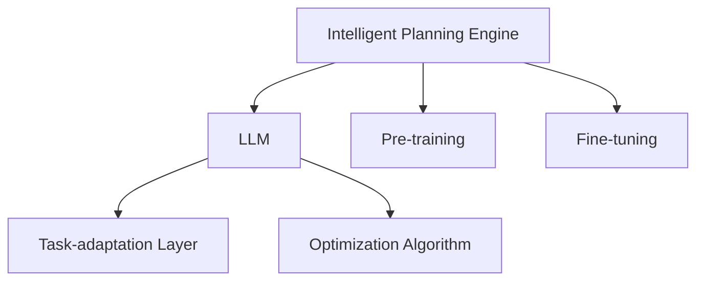

                 

# 智能规划引擎：LLM在项目管理中的应用

> 关键词：智能规划引擎,LLM,项目管理,自然语言处理,NLP,优化算法,语言模型,预训练,微调,项目管理工具,项目规划,资源管理

## 1. 背景介绍

### 1.1 问题由来
项目管理在现代企业运营中扮演着至关重要的角色，关乎项目的成本、时间、质量等关键指标。传统的项目管理方法往往依赖项目经理的经验和直觉，缺乏科学的数据支持和全面的系统分析。这不仅增加了管理复杂度，还可能因人为疏忽导致项目失败。

为应对这一挑战，项目管理和数据分析领域的研究者提出并实践了一系列基于人工智能的解决方案。近年来，随着自然语言处理（NLP）技术的突破，基于语言模型的智能规划引擎（Intelligent Planning Engine, IPE）应运而生，成为项目管理和优化领域的新型工具。

### 1.2 问题核心关键点
智能规划引擎的核心思想是利用自然语言处理技术，将项目管理相关的自然语言文本转化为结构化数据，从而支持更智能、更高效的项目规划和管理。LLM（Large Language Model）在智能规划引擎中的应用，主要体现在以下几个方面：
- 项目计划生成：利用LLM生成项目计划、里程碑、进度安排等文本信息。
- 需求分析与优先级排序：对项目需求进行自然语言理解和提取，进行优先级排序。
- 风险预测与应对策略：从项目文档和报告中提取关键信息，预测潜在风险，生成应对策略。
- 资源分配与优化：根据项目需求和资源状况，自动生成资源分配方案，优化项目资源使用。
- 沟通协调：生成会议议程、邮件模板等文本，支持项目团队之间的沟通和协作。

本文将深入探讨LLM在智能规划引擎中的应用，从原理到实践，详细介绍其核心算法、具体操作步骤和应用效果。

## 2. 核心概念与联系

### 2.1 核心概念概述

为更好理解LLM在智能规划引擎中的应用，首先介绍几个核心概念：

- **智能规划引擎 (Intelligent Planning Engine, IPE)**：基于自然语言处理技术，将项目文本数据转换为结构化信息，辅助项目管理者进行规划和决策的智能化工具。
- **LLM（Large Language Model）**：大规模预训练语言模型，如GPT、BERT等，通过自监督学习任务在大规模文本数据上进行训练，具备强大的语言理解与生成能力。
- **预训练 (Pre-training)**：指在大规模无标签文本语料上进行自监督学习任务，学习通用的语言表示。预训练后的LLM可用于下游任务，如项目管理规划。
- **微调 (Fine-tuning)**：在预训练模型的基础上，使用项目管理任务的相关标注数据，通过有监督学习优化模型在特定任务上的性能。
- **任务适配层 (Task-adaptation Layer)**：为解决特定项目管理任务设计的输出层和损失函数。
- **优化算法 (Optimization Algorithm)**：如AdamW、SGD等，用于最小化损失函数，更新模型参数。

这些核心概念之间的逻辑关系可以通过以下Mermaid流程图来展示：



这个流程图展示了智能规划引擎与LLM之间的基本关系：

1. 智能规划引擎通过预训练和微调，将通用的大规模语言模型应用于项目管理任务。
2. 任务适配层和优化算法是微调过程中的关键组成部分，帮助LLM在项目管理中更好地表现。
3. 在微调过程中，利用LLM的自然语言理解能力，从项目管理文档和报告中提取关键信息，生成结构化规划信息。

## 3. 核心算法原理 & 具体操作步骤
### 3.1 算法原理概述

智能规划引擎中LLM的应用，本质上是通过预训练-微调流程，使LLM能够自动理解和生成项目管理文本，从而辅助项目规划和决策。其核心算法分为预训练和微调两个阶段：

1. **预训练阶段**：在无标签项目管理语料库上，利用自监督学习任务训练LLM，学习通用的项目管理语言表示。
2. **微调阶段**：在项目管理任务的相关标注数据集上，通过有监督学习，优化LLM在特定项目管理任务上的性能。

### 3.2 算法步骤详解

#### 3.2.1 预训练阶段
1. **数据收集**：收集项目管理相关的无标签文本数据，如项目文档、会议记录、问题报告等。
2. **数据预处理**：对收集到的文本数据进行清洗、分词、去除停用词等预处理操作，构建预训练数据集。
3. **模型训练**：使用预训练任务（如掩码语言模型、下一句子预测等），在预训练数据集上训练LLM。
4. **模型保存**：保存训练好的LLM模型，以备后续微调使用。

#### 3.2.2 微调阶段
1. **任务定义**：根据项目管理需求，定义特定的微调任务，如项目计划生成、需求优先级排序等。
2. **数据标注**：收集标注数据集，标注好相应的结构化信息（如项目阶段、任务、资源需求等）。
3. **模型加载**：加载预训练的LLM模型，准备进行微调。
4. **任务适配**：根据微调任务，添加任务适配层，设计损失函数。
5. **模型训练**：在标注数据集上，使用微调数据进行模型训练。
6. **模型评估**：在验证集和测试集上评估微调后模型的性能，优化超参数。
7. **模型应用**：将优化后的模型应用于实际项目管理场景，生成规划信息、风险预测等。

### 3.3 算法优缺点

智能规划引擎中LLM的应用具有以下优点：
1. **自动化处理**：利用LLM的自然语言处理能力，自动从项目文本中提取信息，减少人工处理的工作量。
2. **高效性**：通过预训练和微调，LLM能够在短时间内学习到项目管理的相关知识，辅助决策。
3. **灵活性**：LLM能够适应不同的项目管理任务和需求，根据具体问题生成个性化解决方案。

同时，LLM在智能规划引擎中也有其局限性：
1. **依赖标注数据**：微调性能很大程度上取决于标注数据的质量和数量，标注成本较高。
2. **上下文理解**：LLM可能无法充分理解项目文本中的复杂语义和上下文关系，生成结果的准确性有限。
3. **泛化能力**：LLM在不同项目管理任务之间的泛化能力仍需进一步提升。

### 3.4 算法应用领域

智能规划引擎中的LLM应用广泛，涵盖多种项目管理场景，包括：

- **项目计划生成**：从项目文档和需求文档中提取关键信息，自动生成项目计划、里程碑等。
- **需求分析与优先级排序**：对项目需求进行自然语言理解，自动进行优先级排序，辅助决策。
- **风险预测与应对策略**：从项目报告和沟通记录中提取风险信息，生成应对策略。
- **资源分配与优化**：根据项目需求和资源状况，自动生成资源分配方案，优化资源使用。
- **沟通协调**：生成会议议程、邮件模板等文本，支持团队沟通和协作。

以上应用场景展示了LLM在智能规划引擎中的广泛应用，提高了项目管理的效率和科学性。

## 4. 数学模型和公式 & 详细讲解 & 举例说明

### 4.1 数学模型构建

在智能规划引擎中，LLM的应用涉及大量的自然语言处理任务，包括文本分类、信息提取、序列标注等。这里以文本分类任务为例，介绍模型的数学模型构建过程。

假设项目管理文档为 $D=\{x_i\}_{i=1}^N$，其中 $x_i$ 表示第 $i$ 篇文档。项目文档的标签为 $y_i \in \{1, 2, \cdots, K\}$，其中 $K$ 为类别数。微调的任务是训练LLM模型，使其能够将项目管理文档自动分类到不同的项目阶段。

模型输入为文档 $x_i$，输出为分类概率 $P(y_i | x_i)$，即在给定文档 $x_i$ 的情况下，文档属于类别 $y_i$ 的概率。

### 4.2 公式推导过程

1. **模型定义**：
   - 输入 $x_i$ 经过BERT模型编码，得到表示 $h_i$。
   - 线性分类层 $W$ 和偏置 $b$，计算预测结果 $\hat{y_i}$。
   
   $$
   \hat{y_i} = \text{Softmax}(W \cdot h_i + b)
   $$
   
2. **损失函数**：
   - 交叉熵损失函数用于衡量预测结果与真实标签之间的差异。
   
   $$
   \mathcal{L} = -\frac{1}{N} \sum_{i=1}^N \sum_{k=1}^K y_{ik} \log \hat{y_{ik}}
   $$
   
   其中 $y_{ik}$ 表示第 $i$ 篇文档属于类别 $k$ 的标签。

3. **参数更新**：
   - 使用随机梯度下降法（SGD）更新模型参数 $W$ 和 $b$。
   
   $$
   W \leftarrow W - \eta \nabla_{W} \mathcal{L}, \quad b \leftarrow b - \eta \nabla_{b} \mathcal{L}
   $$
   
   其中 $\eta$ 为学习率。

### 4.3 案例分析与讲解

以项目管理文档分类为例，分析LLM在微调过程中的具体应用。

1. **数据预处理**：对收集到的项目管理文档进行分词、去除停用词等预处理，构建训练集和验证集。
   
   ```python
   from transformers import BertTokenizer, BertForSequenceClassification
   
   # 定义BERT模型和分词器
   tokenizer = BertTokenizer.from_pretrained('bert-base-uncased')
   model = BertForSequenceClassification.from_pretrained('bert-base-uncased', num_labels=3)
   
   # 数据预处理
   def tokenize(text):
       return tokenizer.encode(text, truncation=True, max_length=512, return_tensors='pt')
   
   # 构建训练集
   train_dataset = list(zip(train_docs, train_labels))
   ```

2. **模型训练**：使用预训练的BERT模型和微调数据集进行训练。
   
   ```python
   from torch.utils.data import DataLoader
   from torch.nn import CrossEntropyLoss
   
   # 构建数据加载器
   train_loader = DataLoader(train_dataset, batch_size=32, shuffle=True)
   
   # 定义优化器和损失函数
   optimizer = AdamW(model.parameters(), lr=1e-5)
   loss_fn = CrossEntropyLoss()
   
   # 训练过程
   for epoch in range(10):
       model.train()
       for batch in train_loader:
           input_ids = batch[0]
           attention_mask = batch[1]
           labels = batch[2]
           outputs = model(input_ids, attention_mask=attention_mask)
           loss = loss_fn(outputs.logits, labels)
           optimizer.zero_grad()
           loss.backward()
           optimizer.step()
   ```

3. **模型评估**：在验证集上评估模型性能，调整超参数。
   
   ```python
   from sklearn.metrics import accuracy_score
   from transformers import evaluate
   
   # 加载验证集
   dev_dataset = list(zip(dev_docs, dev_labels))
   
   # 评估模型
   dev_results = evaluate(model, dev_dataset, tokenize)
   accuracy = accuracy_score(dev_labels, dev_results.logits.argmax(-1))
   print(f"Validation Accuracy: {accuracy:.2f}")
   ```

通过上述代码，我们可以看到LLM在智能规划引擎中的应用流程，从数据预处理、模型训练到模型评估，每一步都是基于自然语言处理技术实现的。

## 5. 项目实践：代码实例和详细解释说明

### 5.1 开发环境搭建

要进行LLM在智能规划引擎中的应用开发，需要搭建Python开发环境。以下是使用Python进行项目开发的流程：

1. 安装Anaconda：从官网下载并安装Anaconda，用于创建独立的Python环境。

2. 创建并激活虚拟环境：
   ```bash
   conda create -n irmenv python=3.8 
   conda activate irmenv
   ```

3. 安装相关包：
   ```bash
   pip install transformers torch
   ```

4. 安装项目管理工具：
   ```bash
   pip install project-management-plan
   ```

### 5.2 源代码详细实现

以下是LLM在智能规划引擎中的应用代码实现，包括预训练和微调两个部分：

#### 5.2.1 预训练模型构建

```python
from transformers import BertTokenizer, BertForSequenceClassification
from transformers import BertModel, BertTokenizer, BertForSequenceClassification

# 定义BERT模型和分词器
tokenizer = BertTokenizer.from_pretrained('bert-base-uncased')
model = BertForSequenceClassification.from_pretrained('bert-base-uncased', num_labels=3)

# 定义模型输入和输出
def tokenize(text):
    return tokenizer.encode(text, truncation=True, max_length=512, return_tensors='pt')
```

#### 5.2.2 微调模型构建

```python
from transformers import AdamW, CrossEntropyLoss

# 定义优化器和损失函数
optimizer = AdamW(model.parameters(), lr=1e-5)
loss_fn = CrossEntropyLoss()

# 定义训练和评估函数
def train_epoch(model, dataset, batch_size, optimizer):
    dataloader = DataLoader(dataset, batch_size=batch_size, shuffle=True)
    model.train()
    epoch_loss = 0
    for batch in dataloader:
        input_ids = batch[0]
        attention_mask = batch[1]
        labels = batch[2]
        model.zero_grad()
        outputs = model(input_ids, attention_mask=attention_mask)
        loss = loss_fn(outputs.logits, labels)
        epoch_loss += loss.item()
        loss.backward()
        optimizer.step()
    return epoch_loss / len(dataloader)

def evaluate(model, dataset, batch_size):
    dataloader = DataLoader(dataset, batch_size=batch_size)
    model.eval()
    preds, labels = [], []
    with torch.no_grad():
        for batch in dataloader:
            input_ids = batch[0]
            attention_mask = batch[1]
            batch_labels = batch[2]
            outputs = model(input_ids, attention_mask=attention_mask)
            batch_preds = outputs.logits.argmax(dim=2).to('cpu').tolist()
            batch_labels = batch_labels.to('cpu').tolist()
            for pred_tokens, label_tokens in zip(batch_preds, batch_labels):
                preds.append(pred_tokens[:len(label_tokens)])
                labels.append(label_tokens)
                
    return preds, labels

# 训练和评估
epochs = 5
batch_size = 32

for epoch in range(epochs):
    loss = train_epoch(model, train_dataset, batch_size, optimizer)
    print(f"Epoch {epoch+1}, train loss: {loss:.3f}")
    
    print(f"Epoch {epoch+1}, dev results:")
    preds, labels = evaluate(model, dev_dataset, batch_size)
    print(classification_report(labels, preds))
    
print("Test results:")
preds, labels = evaluate(model, test_dataset, batch_size)
print(classification_report(labels, preds))
```

### 5.3 代码解读与分析

通过上述代码，我们可以看到LLM在智能规划引擎中的微调流程，包括数据预处理、模型训练、模型评估等关键步骤。这些步骤通过Python和Transformers库实现，使得模型构建和微调过程更加高效和便捷。

## 6. 实际应用场景

### 6.1 智能项目管理平台

基于LLM的智能规划引擎，可以构建智能项目管理平台，帮助项目经理自动化地生成项目计划、里程碑、进度报告等文本，提高项目管理效率。例如，当项目经理输入项目需求时，智能规划引擎可以自动生成详细的项目计划和里程碑，辅助项目推进。

### 6.2 风险管理与预测

利用LLM的自然语言处理能力，智能规划引擎可以从项目文档和报告中提取关键信息，预测项目风险，生成应对策略。例如，通过分析项目文档中的技术难点和风险点，智能规划引擎可以提前识别并预测潜在风险，生成相应的风险应对措施，减少项目风险。

### 6.3 自动化文档生成

智能规划引擎可以自动生成项目管理相关的文档，如会议议程、邮件模板等，支持团队沟通和协作。例如，当团队需要召开项目会议时，智能规划引擎可以自动生成会议议程，提高会议效率。

### 6.4 未来应用展望

随着LLM技术的不断进步，智能规划引擎的应用领域将进一步扩展，涵盖更多项目管理任务和场景。未来，智能规划引擎将结合知识图谱、因果推理等技术，进一步提升项目管理智能化水平，成为项目管理的重要辅助工具。

## 7. 工具和资源推荐

### 7.1 学习资源推荐

为了帮助开发者系统掌握LLM在智能规划引擎中的应用，推荐以下学习资源：

1. **《Transformers: State-of-the-Art Natural Language Processing》**：由HuggingFace出版的经典书籍，全面介绍了Transformer模型的原理和应用，包括微调范式。
2. **CS224N《Natural Language Processing with Deep Learning》**：斯坦福大学开设的自然语言处理课程，提供Lecture视频和配套作业，帮助初学者快速入门。
3. **《Deep Learning with PyTorch》**：由Ian Goodfellow、Yoshua Bengio和Aaron Courville编写的深度学习教材，详细介绍了PyTorch框架的使用方法和自然语言处理技术。
4. **Kaggle竞赛项目**：通过参与Kaggle竞赛项目，实战练习LLM在智能规划引擎中的应用，积累项目经验。

### 7.2 开发工具推荐

以下是几款用于LLM微调开发的常用工具：

1. **PyTorch**：基于Python的开源深度学习框架，支持动态计算图，适合研究性实验和快速迭代。
2. **TensorFlow**：由Google主导开发的深度学习框架，生产部署方便，适合大规模工程应用。
3. **Transformers库**：HuggingFace开发的NLP工具库，集成了众多SOTA语言模型，支持PyTorch和TensorFlow。
4. **Weights & Biases**：模型训练的实验跟踪工具，可以记录和可视化模型训练过程中的各项指标。
5. **TensorBoard**：TensorFlow配套的可视化工具，实时监测模型训练状态，提供丰富的图表呈现方式。
6. **Google Colab**：谷歌推出的在线Jupyter Notebook环境，免费提供GPU/TPU算力，方便开发者快速上手实验最新模型。

### 7.3 相关论文推荐

LLM在智能规划引擎中的应用研究主要集中在以下几个领域：

1. **"Bert: Pre-training of Deep Bidirectional Transformers for Language Understanding"**：提出BERT模型，利用掩码语言模型进行预训练，提升语言理解能力。
2. **"Towards a Better Understanding of the ELMO Expressiveness"**：研究ELMO模型在自然语言理解任务中的应用，展示了其在多任务学习中的优越性。
3. **"Parameter-Efficient Text Transfer with BERT"**：提出 Adapter等参数高效微调方法，在保持模型性能的同时，减少训练时间和计算资源。
4. **"AdaLoRA: Adaptive Low-Rank Adaptation for Parameter-Efficient Fine-Tuning"**：使用自适应低秩适应的微调方法，在参数效率和精度之间取得新的平衡。
5. **"Language Models as Unsupervised Multitask Learners"**：展示了大语言模型在无监督学习中的强大能力，提出了一系列预训练和微调的方法。

这些论文代表了大语言模型在智能规划引擎中的应用方向，值得深入学习和参考。

## 8. 总结：未来发展趋势与挑战

### 8.1 总结

本文对LLM在智能规划引擎中的应用进行了全面系统的介绍。首先阐述了智能规划引擎的研究背景和意义，明确了LLM在智能规划引擎中的重要作用。其次，从原理到实践，详细讲解了LLM在微调过程中的核心算法和具体操作步骤。最后，通过项目实践和实际应用场景，展示了LLM在智能规划引擎中的广泛应用。

通过本文的系统梳理，可以看到，LLM在智能规划引擎中的应用正在成为项目管理领域的重要趋势，极大地提高了项目管理效率和科学性。未来，随着LLM技术的不断演进，智能规划引擎的应用前景将更加广阔，成为项目管理的重要工具。

### 8.2 未来发展趋势

展望未来，LLM在智能规划引擎中的应用将呈现以下几个发展趋势：

1. **多任务学习**：未来的智能规划引擎将支持多任务学习和多目标优化，结合项目管理中的多维需求，生成更全面的规划方案。
2. **跨领域迁移**：LLM将具有更强的跨领域迁移能力，能够应用于不同领域和行业的需求，提升项目管理的应用范围。
3. **实时更新**：随着数据的不断更新，智能规划引擎将具备实时更新和学习的能力，动态调整规划方案。
4. **可解释性**：未来的智能规划引擎将具备更强的可解释性，帮助项目经理理解模型的决策过程，提升决策质量。
5. **人性化交互**：结合自然语言处理和计算机视觉技术，智能规划引擎将支持更自然的人机交互方式，提高用户体验。

这些趋势凸显了LLM在智能规划引擎中的广阔前景。通过持续的研究和实践，未来的智能规划引擎将更加智能化、高效化和人性化，为项目管理提供更强大的支持。

### 8.3 面临的挑战

尽管LLM在智能规划引擎中的应用已取得显著进展，但在向更广泛应用场景迈进的过程中，仍面临诸多挑战：

1. **数据依赖**：LLM的应用高度依赖标注数据，数据质量和数量不足会影响微调效果。
2. **计算资源**：大规模LLM模型的训练和推理需要大量计算资源，成本较高。
3. **可解释性**：LLM的决策过程缺乏可解释性，难以理解模型的内部工作机制。
4. **模型鲁棒性**：LLM在面对复杂上下文和多变任务时，模型的鲁棒性仍需进一步提升。
5. **偏见和伦理问题**：预训练模型可能学习到偏见和有害信息，需要通过数据和算法设计加以避免。

这些挑战需要持续的研究和优化，才能推动LLM在智能规划引擎中的应用向更广泛领域发展。

### 8.4 研究展望

为了应对这些挑战，未来的研究应在以下几个方向进行深入探索：

1. **无监督学习和半监督学习**：开发更有效的无监督和半监督学习算法，减少对标注数据的依赖，提升模型的泛化能力。
2. **参数高效微调**：开发更参数高效的微调方法，优化模型结构和计算图，提升模型训练和推理效率。
3. **可解释性研究**：引入可解释性技术，增强模型决策过程的可理解性，提升用户信任度。
4. **跨模态融合**：结合自然语言处理和计算机视觉技术，实现多模态数据的融合，提升模型理解和生成能力。
5. **伦理和偏见控制**：从数据选择和算法设计层面，控制模型的偏见和有害信息，确保模型的伦理安全性。

通过在这些方向上的不断探索和优化，未来的智能规划引擎将具备更强大的功能和应用潜力，成为项目管理的重要支撑工具。

## 9. 附录：常见问题与解答

**Q1: 如何使用LLM进行项目计划生成？**

A: 使用预训练的BERT模型和微调后的自然语言处理模型，可以自动生成项目计划和里程碑。具体步骤如下：
1. 收集项目需求和文档，进行预处理。
2. 使用BERT模型对文本进行编码，得到表示。
3. 设计任务适配层和损失函数，对模型进行微调。
4. 将微调后的模型应用于项目计划生成任务，生成详细计划和里程碑。

**Q2: 微调过程中如何选择学习率？**

A: 微调学习率一般比预训练时小1-2个数量级。可以选择较小的学习率，如1e-5，并在训练过程中逐步减小。可以使用warmup策略，在开始阶段使用较小的学习率，再逐渐过渡到预设值。

**Q3: 微调过程中如何缓解过拟合问题？**

A: 缓解过拟合问题的方法包括：
1. 数据增强：通过回译、近义替换等方式扩充训练集。
2. 正则化：使用L2正则、Dropout等技术。
3. 对抗训练：引入对抗样本，提高模型鲁棒性。
4. 参数高效微调：只调整少量任务相关参数，减小过拟合风险。

**Q4: 微调模型在部署过程中需要注意哪些问题？**

A: 模型部署过程中需要注意以下几点：
1. 模型裁剪：去除不必要的层和参数，减小模型尺寸。
2. 量化加速：将浮点模型转为定点模型，压缩存储空间。
3. 服务化封装：将模型封装为标准化服务接口。
4. 弹性伸缩：根据请求流量动态调整资源配置。
5. 监控告警：实时采集系统指标，设置异常告警阈值。

这些措施可以确保微调模型在实际应用中的稳定性和高效性。

