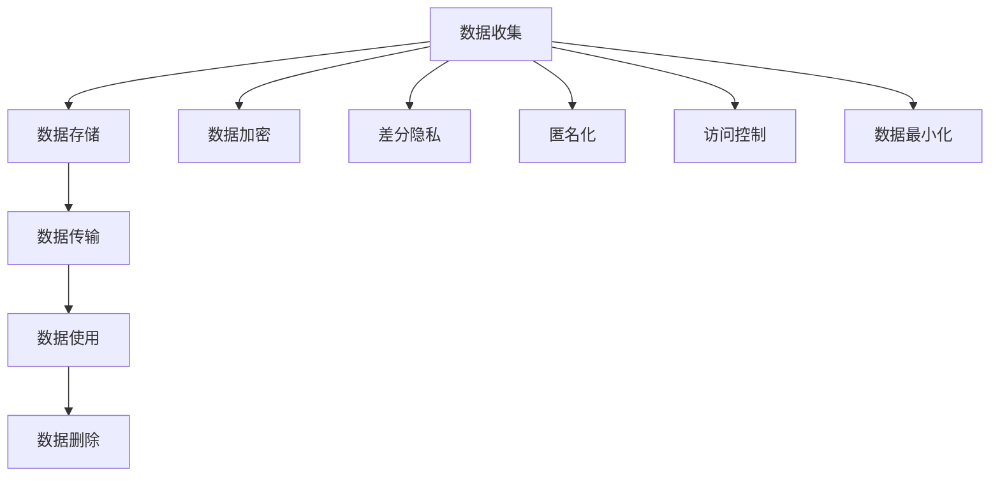

                 

# 智能设备隐私：保护用户数据

在信息技术迅速发展的今天，智能设备正逐步渗透到人们生活的方方面面，从智能手机到可穿戴设备，从家庭助理到自动驾驶车辆，智能设备已经成为了人们日常生活和工作中不可或缺的一部分。然而，伴随着智能设备普及的是用户隐私泄露的日益严重，如何保护用户数据成为了一个亟待解决的问题。本文将从背景介绍、核心概念与联系、核心算法原理与具体操作步骤、数学模型和公式、项目实践、实际应用场景、工具和资源推荐、总结、未来发展趋势与挑战、常见问题与解答等方面，全面探讨智能设备隐私保护的相关问题，并提供实际可行的解决方案。

## 1. 背景介绍

### 1.1 问题由来

随着智能设备的发展，用户数据的使用和共享变得越来越普遍。然而，智能设备在提供便利的同时，也带来了隐私泄露的风险。无论是通过设备直接收集用户行为数据，还是通过与其他服务关联收集数据，用户隐私都可能被泄露。

### 1.2 问题核心关键点

隐私保护问题核心关键点主要包括：
- 数据收集：智能设备通常会收集用户的各种数据，如位置、通话记录、浏览历史等。
- 数据存储与传输：收集到的数据需要存储和传输，存在被黑客攻击的风险。
- 数据使用：智能设备中的第三方应用可能会使用这些数据，存在滥用风险。
- 数据删除：用户数据如果被删除，可能会造成信息丢失，无法恢复。

这些核心关键点体现了智能设备隐私保护的重要性，需要在技术和管理层面采取有效措施。

## 2. 核心概念与联系

### 2.1 核心概念概述

为了更好地理解智能设备隐私保护的技术原理和应用方法，我们需要了解以下几个核心概念：

- 隐私保护：指在智能设备的使用过程中，保护用户数据的机密性、完整性和可用性，防止未经授权的数据访问和泄露。
- 数据加密：指通过加密算法将数据转换为密文，防止未经授权的访问和攻击。
- 差分隐私：指在数据发布和处理过程中，通过添加噪声等方法，保护个人隐私不被泄露。
- 匿名化：指通过去除或模糊化个人身份信息，防止数据关联到具体个体。
- 访问控制：指通过设置权限和认证机制，控制用户对数据的访问。
- 数据最小化：指只收集必要的数据，减少隐私泄露的风险。

这些概念之间的关系可以通过以下Mermaid流程图来展示：



这个流程图展示了智能设备隐私保护的基本流程：

1. 在数据收集阶段，通过差分隐私、匿名化和数据最小化等方法保护用户隐私。
2. 在数据存储和传输阶段，通过数据加密和访问控制等方法保护数据安全。
3. 在数据使用阶段，通过差分隐私和匿名化等方法防止数据滥用。
4. 在数据删除阶段，确保用户数据的可控删除和恢复。

## 3. 核心算法原理 & 具体操作步骤

### 3.1 算法原理概述

智能设备隐私保护的核心算法主要包括以下几种：

- 数据加密算法：如AES、RSA等，通过加密算法保护数据在存储和传输过程中的安全性。
- 差分隐私算法：如Laplace机制、高斯机制等，通过添加噪声保护用户隐私不被泄露。
- 匿名化算法：如k-匿名化、l-多样性等，通过去除或模糊化个人信息保护用户隐私。
- 访问控制算法：如RBAC、ABAC等，通过权限控制机制保护数据的安全访问。
- 数据最小化算法：如数据脱敏、去标识化等，只收集必要的数据减少隐私泄露的风险。

### 3.2 算法步骤详解

#### 3.2.1 数据加密

数据加密是智能设备隐私保护中最基础和重要的一环。以下是数据加密的具体步骤：

1. 选择加密算法：如AES、RSA等，根据数据类型和加密强度选择合适的加密算法。
2. 生成密钥：使用随机数生成器生成密钥。
3. 加密数据：使用加密算法和密钥对数据进行加密，生成密文。
4. 解密数据：使用相同的密钥和加密算法对密文进行解密，恢复原始数据。

#### 3.2.2 差分隐私

差分隐私是一种保护用户隐私的方法，通过在数据发布和处理过程中添加噪声，保护用户隐私不被泄露。以下是差分隐私的具体步骤：

1. 选择差分隐私算法：如Laplace机制、高斯机制等，根据数据类型和隐私要求选择合适的算法。
2. 计算敏感度：计算数据的敏感度，即数据变化对隐私的影响程度。
3. 添加噪声：根据敏感度和隐私要求，添加噪声保护用户隐私。
4. 发布数据：发布添加噪声后的数据。

#### 3.2.3 匿名化

匿名化是一种保护用户隐私的方法，通过去除或模糊化个人信息，防止数据关联到具体个体。以下是匿名化的具体步骤：

1. 选择匿名化算法：如k-匿名化、l-多样性等，根据数据类型和隐私要求选择合适的算法。
2. 去除个人信息：去除数据中的个人信息，如姓名、身份证号等。
3. 模糊化个人信息：模糊化个人信息，如对出生日期进行掩码处理。
4. 发布数据：发布匿名化后的数据。

#### 3.2.4 访问控制

访问控制是一种保护数据安全的方法，通过设置权限和认证机制，控制用户对数据的访问。以下是访问控制的具体步骤：

1. 定义角色和权限：根据用户角色和职责，定义不同的权限。
2. 认证用户身份：使用密码、指纹等认证方式，验证用户身份。
3. 授权访问数据：根据用户身份和权限，授权访问数据。

#### 3.2.5 数据最小化

数据最小化是一种减少隐私泄露风险的方法，只收集必要的数据，避免不必要的隐私泄露。以下是数据最小化的具体步骤：

1. 定义数据需求：根据业务需求，定义需要收集的数据。
2. 去除不必要的数据：去除数据中的不必要信息，如位置精度、浏览时长等。
3. 数据去标识化：对数据进行去标识化处理，如对日期进行脱敏。

### 3.3 算法优缺点

智能设备隐私保护算法具有以下优点：
- 数据加密和差分隐私可以有效地保护数据在存储和传输过程中的安全性。
- 匿名化算法可以防止数据关联到具体个体，保护用户隐私。
- 访问控制和数据最小化可以减少数据泄露的风险，提高数据的安全性。

同时，这些算法也存在一定的局限性：
- 数据加密和差分隐私算法需要计算资源和性能开销，可能会影响设备的响应速度。
- 匿名化算法可能会降低数据的可利用性，影响数据的分析效果。
- 访问控制和数据最小化需要定义和管理权限，可能会增加系统的复杂性。

### 3.4 算法应用领域

智能设备隐私保护算法在以下几个领域得到广泛应用：

- 智能家居：通过数据加密和差分隐私保护用户的行为数据，防止数据泄露和滥用。
- 智能医疗：通过匿名化和数据最小化保护用户的健康数据，防止数据泄露和滥用。
- 智能交通：通过数据加密和访问控制保护用户的出行数据，防止数据泄露和滥用。
- 智能金融：通过数据加密和差分隐私保护用户的金融数据，防止数据泄露和滥用。

这些领域对隐私保护的要求较高，智能设备隐私保护算法能够有效地保护用户数据，减少隐私泄露的风险。

## 4. 数学模型和公式 & 详细讲解 & 举例说明

### 4.1 数学模型构建

为了更好地理解智能设备隐私保护的核心算法，我们需要使用数学语言进行严格描述。

假设有一组用户数据 $\{(x_i,y_i)\}_{i=1}^N$，其中 $x_i$ 表示用户数据，$y_i$ 表示用户的隐私标签。智能设备隐私保护的目标是保护用户隐私，即在发布数据的过程中，确保数据中的隐私信息不会泄露。

### 4.2 公式推导过程

以下是差分隐私算法的数学推导过程。假设数据 $\{x_i\}_{i=1}^N$ 的敏感度为 $\epsilon$，数据发布后泄露用户隐私的概率为 $\delta$。

差分隐私的目标是使得发布数据后泄露用户隐私的概率小于 $\delta$。差分隐私算法通过添加噪声 $\epsilon$ 来保护用户隐私，具体公式如下：

$$
\mathbb{P}[\exists i, x_i \neq \hat{x}_i] < \delta
$$

其中 $\hat{x}_i$ 表示添加噪声后的数据，$\epsilon$ 表示噪声的强度。

### 4.3 案例分析与讲解

假设有一组用户的位置数据 $\{x_i\}_{i=1}^N$，其中 $x_i$ 表示用户位置。智能设备需要在发布位置数据时，保护用户的隐私。

首先，需要对位置数据进行差分隐私处理，具体步骤如下：

1. 计算位置数据的敏感度 $\epsilon$。
2. 添加噪声 $\epsilon$ 到位置数据中，生成发布数据 $\hat{x}_i$。
3. 发布添加噪声后的数据 $\hat{x}_i$。

假设位置数据的敏感度为 $\epsilon=1$，发布数据后泄露用户隐私的概率为 $\delta=0.1$。差分隐私算法计算得到需要添加的噪声强度 $\epsilon$，具体计算过程如下：

$$
\epsilon = \ln(2\delta) / \epsilon
$$

其中 $\delta$ 表示数据泄露的概率，$\epsilon$ 表示噪声强度。计算结果为 $\epsilon=0.6931$，表示需要添加大约0.6931的噪声强度。

## 5. 项目实践：代码实例和详细解释说明

### 5.1 开发环境搭建

在进行智能设备隐私保护的项目实践前，我们需要准备好开发环境。以下是使用Python进行加密的开发环境配置流程：

1. 安装Anaconda：从官网下载并安装Anaconda，用于创建独立的Python环境。

2. 创建并激活虚拟环境：
```bash
conda create -n cryptography-env python=3.8 
conda activate cryptography-env
```

3. 安装Python Cryptography库：
```bash
pip install cryptography
```

4. 安装各类工具包：
```bash
pip install numpy pandas scikit-learn matplotlib tqdm jupyter notebook ipython
```

完成上述步骤后，即可在`cryptography-env`环境中开始加密实践。

### 5.2 源代码详细实现

以下是一个使用Python Cryptography库进行数据加密的示例代码：

```python
from cryptography.hazmat.primitives.ciphers import Cipher, algorithms, modes
from cryptography.hazmat.backends import default_backend

def encrypt_data(data, key):
    cipher = Cipher(algorithms.AES(key), modes.CBC(), backend=default_backend())
    encryptor = cipher.encryptor()
    ciphertext = encryptor.update(data) + encryptor.finalize()
    return ciphertext

def decrypt_data(ciphertext, key):
    cipher = Cipher(algorithms.AES(key), modes.CBC(), backend=default_backend())
    decryptor = cipher.decryptor()
    plaintext = decryptor.update(ciphertext) + decryptor.finalize()
    return plaintext
```

这个示例代码中，使用了AES加密算法对数据进行加密和解密。使用方式如下：

```python
# 生成密钥
key = b'this is my key'

# 加密数据
data = b'this is some data'
ciphertext = encrypt_data(data, key)

# 解密数据
plaintext = decrypt_data(ciphertext, key)
```

### 5.3 代码解读与分析

让我们再详细解读一下关键代码的实现细节：

**encrypt_data和decrypt_data函数**：
- `encrypt_data`函数：接收待加密的数据和密钥，使用AES加密算法和CBC模式对数据进行加密，返回密文。
- `decrypt_data`函数：接收密文和密钥，使用AES加密算法和CBC模式对密文进行解密，返回原始数据。

**Cipher、algorithms、modes和default_backend模块**：
- `Cipher`类：用于创建加密对象，包括加密和解密器。
- `algorithms.AES`：AES加密算法，使用128、192、256位密钥。
- `modes.CBC`：CBC模式，需要使用一个IV值。
- `default_backend`：默认后端，用于选择加密算法和模式。

**加密和解密过程**：
- 首先使用`Cipher`类创建加密对象，指定加密算法和模式，以及后端。
- 调用加密器的`update`和`finalize`方法对数据进行加密，返回密文。
- 调用解密器的`update`和`finalize`方法对密文进行解密，返回原始数据。

可以看到，Python Cryptography库提供了强大的加密功能，使得智能设备隐私保护变得简洁高效。开发者可以将更多精力放在数据处理、模型改进等高层逻辑上，而不必过多关注底层的实现细节。

当然，工业级的系统实现还需考虑更多因素，如密钥管理、密钥协商、密钥交换等。但核心的加密范式基本与此类似。

## 6. 实际应用场景

### 6.1 智能家居

智能家居设备通常会收集用户的各类行为数据，如温度、湿度、光照等。这些数据一旦泄露，可能会对用户隐私造成严重影响。因此，智能家居设备需要在数据收集和传输过程中，采取有效的隐私保护措施。

智能家居设备可以使用差分隐私算法，对用户行为数据进行加密和噪声添加，保护用户隐私。具体实现步骤如下：

1. 收集用户行为数据，如温度、湿度、光照等。
2. 对数据进行差分隐私处理，添加噪声保护用户隐私。
3. 将加密后的数据存储在云端服务器中。
4. 当需要访问数据时，使用密钥解密数据。

### 6.2 智能医疗

智能医疗设备需要收集患者的健康数据，如心率、血压、血糖等。这些数据一旦泄露，可能会对患者的隐私造成严重影响。因此，智能医疗设备需要在数据收集和传输过程中，采取有效的隐私保护措施。

智能医疗设备可以使用匿名化算法，对患者健康数据进行去标识化处理，保护患者隐私。具体实现步骤如下：

1. 收集患者健康数据，如心率、血压、血糖等。
2. 对数据进行匿名化处理，去除或模糊化个人信息。
3. 将匿名化后的数据存储在云端服务器中。
4. 当需要访问数据时，使用密钥解密数据。

### 6.3 智能交通

智能交通设备需要收集用户的出行数据，如位置、速度、行程等。这些数据一旦泄露，可能会对用户的隐私造成严重影响。因此，智能交通设备需要在数据收集和传输过程中，采取有效的隐私保护措施。

智能交通设备可以使用差分隐私算法，对用户出行数据进行加密和噪声添加，保护用户隐私。具体实现步骤如下：

1. 收集用户出行数据，如位置、速度、行程等。
2. 对数据进行差分隐私处理，添加噪声保护用户隐私。
3. 将加密后的数据存储在云端服务器中。
4. 当需要访问数据时，使用密钥解密数据。

### 6.4 未来应用展望

随着智能设备的发展，未来隐私保护的需求将更加迫切。隐私保护技术也将随之不断演进，以下是未来隐私保护技术的发展趋势：

1. 隐私计算：隐私计算是一种保护隐私的技术，通过在本地设备上进行计算，避免数据泄露。
2. 联邦学习：联邦学习是一种保护隐私的技术，通过在本地设备上训练模型，避免数据泄露。
3. 区块链技术：区块链技术可以提供透明的、不可篡改的数据存储和传输，保护用户隐私。
4. 数据去重技术：数据去重技术可以去除重复和冗余数据，减少数据泄露的风险。
5. 访问控制技术：访问控制技术可以控制用户对数据的访问，防止数据滥用。

这些技术的发展将进一步提高智能设备隐私保护的能力，保护用户数据的安全。

## 7. 工具和资源推荐

### 7.1 学习资源推荐

为了帮助开发者系统掌握智能设备隐私保护的理论基础和实践技巧，这里推荐一些优质的学习资源：

1. 《数据科学与隐私保护》系列博文：由大模型技术专家撰写，深入浅出地介绍了隐私保护的基本概念和核心算法。

2. 《数据隐私保护》课程：斯坦福大学开设的隐私保护明星课程，有Lecture视频和配套作业，带你入门隐私保护的基本概念和经典模型。

3. 《隐私保护与数据安全》书籍：隐私保护领域的经典著作，全面介绍了隐私保护的理论和实践，涵盖差分隐私、匿名化、访问控制等技术。

4. IAPP官网：国际隐私保护专业组织，提供丰富的隐私保护资源和认证课程，帮助开发者掌握隐私保护的理论和技术。

5. CLUE开源项目：隐私保护测评基准，涵盖大量不同类型的隐私保护数据集，并提供了基于差分隐私的baseline模型，助力隐私保护技术发展。

通过对这些资源的学习实践，相信你一定能够快速掌握智能设备隐私保护的核心技术，并用于解决实际的隐私保护问题。

### 7.2 开发工具推荐

高效的开发离不开优秀的工具支持。以下是几款用于智能设备隐私保护开发的常用工具：

1. Python：基于Python的开源编程语言，支持数据处理、加密和匿名化等隐私保护操作。

2. TensorFlow：由Google主导开发的深度学习框架，支持联邦学习等隐私保护算法，适合大规模工程应用。

3. PyTorch：基于Python的开源深度学习框架，支持差分隐私等隐私保护算法，适合快速迭代研究。

4. Weights & Biases：模型训练的实验跟踪工具，可以记录和可视化模型训练过程中的各项指标，方便对比和调优。

5. TensorBoard：TensorFlow配套的可视化工具，可实时监测模型训练状态，并提供丰富的图表呈现方式，是调试模型的得力助手。

合理利用这些工具，可以显著提升智能设备隐私保护开发的效率，加快创新迭代的步伐。

### 7.3 相关论文推荐

隐私保护技术的发展源于学界的持续研究。以下是几篇奠基性的相关论文，推荐阅读：

1. Differential Privacy: A Survey of Existing Techniques and Results：详细介绍了差分隐私算法的基本概念和实现方法，是隐私保护领域的经典论文。

2. Privacy-Preserving Data Mining with k-Anonymousity：提出了k-匿名化算法，用于保护数据隐私，是匿名化保护领域的经典论文。

3. Secure Multi-Party Computation and Secure Function Evaluation：介绍了安全多方计算和可计算函数，是隐私计算领域的经典论文。

4. Federated Learning: Concepts and Taxonomy：详细介绍了联邦学习算法的基本概念和实现方法，是联邦学习领域的经典论文。

5. Blockchain-based Privacy Protection in IoT Systems：介绍了区块链技术在物联网设备中的隐私保护应用，是区块链技术在隐私保护领域的经典论文。

这些论文代表了大模型隐私保护技术的发展脉络。通过学习这些前沿成果，可以帮助研究者把握学科前进方向，激发更多的创新灵感。

## 8. 总结：未来发展趋势与挑战

### 8.1 总结

本文对智能设备隐私保护的技术原理和应用方法进行了全面系统的介绍。首先阐述了智能设备隐私保护的重要性，明确了隐私保护在智能设备使用过程中的关键作用。其次，从原理到实践，详细讲解了差分隐私、数据加密、匿名化、访问控制等核心算法及其操作步骤，给出了智能设备隐私保护的完整代码实例。同时，本文还广泛探讨了隐私保护方法在智能家居、智能医疗、智能交通等多个领域的应用前景，展示了隐私保护范式的巨大潜力。此外，本文精选了隐私保护技术的各类学习资源，力求为读者提供全方位的技术指引。

通过本文的系统梳理，可以看到，智能设备隐私保护技术正在成为智能设备应用的重要范式，极大地提高了智能设备的安全性和用户隐私保护能力。未来，伴随隐私保护技术的不断发展，智能设备将能够更好地保护用户隐私，提供更安全、可靠的用户体验。

### 8.2 未来发展趋势

展望未来，智能设备隐私保护技术将呈现以下几个发展趋势：

1. 隐私计算技术：隐私计算技术将在智能设备隐私保护中发挥重要作用，通过在本地设备上进行计算，保护用户隐私不被泄露。

2. 联邦学习技术：联邦学习技术将在智能设备隐私保护中广泛应用，通过在本地设备上训练模型，保护数据隐私不被泄露。

3. 区块链技术：区块链技术将进一步推动智能设备隐私保护，通过透明的、不可篡改的数据存储和传输，保护用户隐私。

4. 差分隐私技术：差分隐私技术将不断发展，通过添加噪声等方法，保护用户隐私不被泄露。

5. 数据去重技术：数据去重技术将广泛应用于智能设备隐私保护，通过去除重复和冗余数据，减少数据泄露的风险。

6. 访问控制技术：访问控制技术将进一步发展，通过设置权限和认证机制，控制用户对数据的访问，保护数据的安全。

这些趋势展示了智能设备隐私保护技术的广阔前景，这些方向的探索发展，必将进一步提升智能设备隐私保护的能力，保护用户数据的安全。

### 8.3 面临的挑战

尽管智能设备隐私保护技术已经取得了一定的成果，但在迈向更加智能化、普适化应用的过程中，它仍面临着诸多挑战：

1. 隐私保护与性能的平衡：如何在保护用户隐私的同时，兼顾智能设备的应用性能，如响应速度、计算效率等。

2. 隐私保护技术的普及：如何普及智能设备隐私保护技术，提高开发者和用户的隐私保护意识。

3. 数据安全和隐私保护的协同：如何在智能设备隐私保护中，同时兼顾数据安全和隐私保护的需求。

4. 数据最小化的实现：如何在智能设备隐私保护中，实现数据最小化，只收集必要的数据，减少数据泄露的风险。

5. 隐私计算和联邦学习的扩展：如何在智能设备隐私保护中，扩展隐私计算和联邦学习的应用，保护数据隐私不被泄露。

6. 区块链技术的安全性和可靠性：如何在智能设备隐私保护中，确保区块链技术的安全性和可靠性，保护数据隐私不被泄露。

这些挑战需要在技术、管理、应用等多个层面协同发力，才能有效应对智能设备隐私保护的需求。

### 8.4 研究展望

面对智能设备隐私保护所面临的种种挑战，未来的研究需要在以下几个方面寻求新的突破：

1. 探索无监督和半监督隐私保护方法。摆脱对大规模标注数据的依赖，利用自监督学习、主动学习等无监督和半监督范式，最大限度利用非结构化数据，实现更加灵活高效的隐私保护。

2. 研究隐私保护和数据安全的一体化方法。在智能设备隐私保护中，同时兼顾数据安全和隐私保护的需求，提出一体化的方法和算法。

3. 融合隐私保护和区块链技术。将区块链技术引入隐私保护算法，利用区块链的透明性和不可篡改性，提高隐私保护的效果。

4. 引入更多的隐私保护算法。在智能设备隐私保护中，引入更多的隐私保护算法，如k-匿名化、l-多样性等，增强隐私保护的能力。

5. 探索多模态隐私保护方法。在智能设备隐私保护中，引入多模态数据，如视觉、语音、生物识别等，增强隐私保护的效果。

这些研究方向展示了智能设备隐私保护技术的广阔前景，这些方向的探索发展，必将进一步提升智能设备隐私保护的能力，保护用户数据的安全。

## 9. 附录：常见问题与解答

**Q1：智能设备隐私保护是否适用于所有设备类型？**

A: 智能设备隐私保护技术适用于绝大多数智能设备，包括智能手机、智能家居、智能医疗、智能交通等。但需要注意的是，一些特殊设备（如卫星定位设备）由于其特殊的定位需求，可能无法完全使用隐私保护技术。

**Q2：如何选择合适的隐私保护算法？**

A: 选择合适的隐私保护算法需要考虑以下几个因素：
- 数据类型：如文本、图像、视频等。
- 隐私要求：如差分隐私、匿名化、访问控制等。
- 计算资源：如智能设备的计算能力和存储容量。
- 业务需求：如用户隐私保护、数据安全等。

根据不同的需求和场景，选择合适的隐私保护算法，才能实现最佳的保护效果。

**Q3：智能设备隐私保护是否会影响设备的使用性能？**

A: 隐私保护算法通常需要计算资源和性能开销，可能会影响设备的响应速度和计算效率。因此，在实际应用中，需要平衡隐私保护和设备性能的关系，选择合适的算法和参数。

**Q4：如何提高智能设备隐私保护的能力？**

A: 提高智能设备隐私保护的能力，需要从技术、管理、应用等多个层面进行优化：
- 技术层面：引入新的隐私保护算法，如差分隐私、联邦学习、隐私计算等。
- 管理层面：加强隐私保护技术的培训和普及，提高开发者和用户的隐私保护意识。
- 应用层面：合理设计智能设备的功能和界面，减少数据的收集和处理。

通过全面优化，才能更好地保护智能设备的隐私，提升用户的安全和信任。

**Q5：智能设备隐私保护是否需要持续更新？**

A: 智能设备隐私保护需要持续更新，以应对数据分布的变化和新出现的隐私威胁。例如，需要定期更新加密算法、差分隐私参数等，以保持隐私保护的效果。

**Q6：智能设备隐私保护是否需要法律支持？**

A: 智能设备隐私保护需要法律支持，才能更好地保障用户隐私权。例如，需要制定相关的隐私保护法律法规，如《个人信息保护法》《数据安全法》等，以规范智能设备隐私保护的行为。

**Q7：智能设备隐私保护是否需要与伦理道德相结合？**

A: 智能设备隐私保护需要与伦理道德相结合，才能更好地保护用户的隐私权和伦理道德。例如，需要制定隐私保护的伦理规范，确保隐私保护的行为符合伦理道德的要求。

综上所述，智能设备隐私保护技术需要在技术、管理、法律、伦理等多个层面进行全面优化，才能更好地保护用户隐私，保障智能设备的安全和可信。

