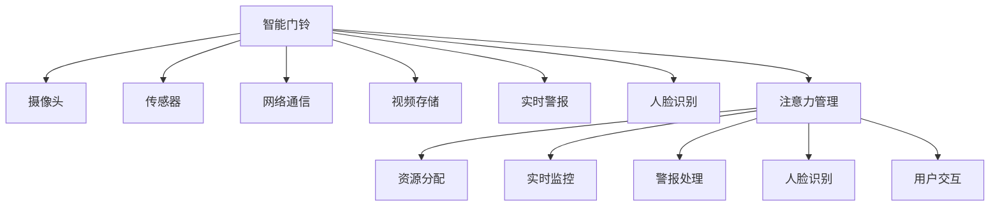

                 

# 智能门铃：家居安防与注意力管理的结合

## 1. 背景介绍

智能门铃作为家居安防的新兴设备，正逐渐走进千家万户。其集成了摄像头、传感器、网络通信等功能，不仅能实时监控家居安全，还能通过AI技术提供视频存储、实时警报、人脸识别等增值服务。但智能门铃系统的复杂性不仅体现在硬件实现上，更在于其软件算法和用户体验的优化。

本文将深入探讨智能门铃系统的软件核心——注意力管理机制。注意力管理不仅能提升门铃的警报响应速度和用户交互体验，还能有效避免资源浪费和算法过载。我们将介绍注意力管理的核心算法和实际应用案例，并对比分析传统处理方式的优势和局限。

## 2. 核心概念与联系

### 2.1 核心概念概述

- **智能门铃**：集成了摄像头、传感器、AI算法等功能，用于监控家居安全和实时响应的设备。
- **视频存储**：将监控视频以不同格式存储在本地或云端，以备后续查看和分析。
- **实时警报**：检测到异常行为时，即时发出声音或视觉警报，提醒用户和安防人员。
- **人脸识别**：通过AI技术自动识别并记录访客面相，验证身份和行为。
- **注意力管理**：通过算法优化，合理分配系统资源，提高警报响应速度和用户体验。

### 2.2 核心概念原理和架构的 Mermaid 流程图



这个流程图展示了智能门铃系统的核心组件及其间的关系：

1. 摄像头和传感器提供监控视频和环境数据。
2. 网络通信负责数据传输，连接本地和云端。
3. 视频存储、实时警报和人脸识别是核心功能模块。
4. 注意力管理算法优化资源分配，提高系统效能。

这些组件共同协作，实现智能门铃的监控和响应功能。

## 3. 核心算法原理 & 具体操作步骤

### 3.1 算法原理概述

智能门铃的注意力管理算法是一种基于动态资源分配的策略，旨在确保在资源受限的情况下，优先处理高优先级的警报和用户请求，同时避免资源浪费。具体来说，算法会根据实时监控数据、警报优先级和用户交互情况，动态调整资源分配，以优化系统的整体性能。

### 3.2 算法步骤详解

1. **数据采集**：
   - 摄像头和传感器实时采集视频、声音、运动数据。
   - 人脸识别模块分析视频数据，提取关键特征。

2. **警报检测**：
   - 基于视频分析和传感器数据，实时检测异常行为。
   - 根据异常行为的严重程度，设定不同的警报优先级。

3. **资源评估**：
   - 评估CPU、内存、存储等资源使用情况，避免资源过载。
   - 识别系统中的瓶颈环节，提高资源利用效率。

4. **优先级调整**：
   - 根据警报优先级和资源使用情况，动态调整处理顺序。
   - 高优先级警报优先处理，低优先级任务暂时搁置。

5. **警报响应**：
   - 对高优先级警报即时响应，发送声音、视觉警报。
   - 低优先级警报和任务延迟处理，避免干扰用户。

### 3.3 算法优缺点

**优点**：
- 动态资源分配，提高系统响应速度和用户体验。
- 根据警报优先级，合理处理紧急情况。
- 避免资源浪费，提高算法的效率。

**缺点**：
- 算法复杂度高，需要实时计算和动态调整。
- 需要丰富的监控数据和用户行为信息，对硬件和数据采集要求高。
- 高优先级警报可能压制低优先级任务，影响系统全面性。

### 3.4 算法应用领域

智能门铃的注意力管理算法不仅适用于家居安防领域，还可应用于其他资源密集型系统，如智能交通、城市监控、工业控制等。通过动态优化资源分配，提升整体系统效能，保障关键任务的实时响应。

## 4. 数学模型和公式 & 详细讲解 & 举例说明

### 4.1 数学模型构建

设智能门铃的监控视频流为 $\mathcal{V}$，传感器数据流为 $\mathcal{S}$，视频流每帧时间为 $t$，传感器数据每采集时间为 $\tau$。设警报处理时间为 $T_{alert}$，视频存储时间为 $T_{store}$。定义系统资源为 $R(t)$，资源消耗率为 $\dot{R}(t)$。

### 4.2 公式推导过程

1. **视频流与传感器数据的采集频率**：
   - 视频采集频率：$F_v = \frac{1}{t}$
   - 传感器采集频率：$F_s = \frac{1}{\tau}$

2. **视频流和传感器数据占用资源**：
   - 视频流占用资源：$R_v = F_v t \dot{R}_v$
   - 传感器数据占用资源：$R_s = F_s \tau \dot{R}_s$

3. **资源消耗与优先级调整**：
   - 警报处理资源消耗：$R_{alert} = T_{alert} \dot{R}_{alert}$
   - 视频存储资源消耗：$R_{store} = T_{store} \dot{R}_{store}$
   - 系统资源消耗总和：$R(t) = R_v + R_s + R_{alert} + R_{store}$

4. **资源优化目标函数**：
   - 目标函数：$Optimize R(t) = \min \{ R(t) \}$

5. **动态资源分配策略**：
   - 设定警报优先级：$P = [P_1, P_2, \cdots, P_n]$
   - 实时动态调整资源分配比例：$\lambda_i(t) = \frac{P_i}{\sum P_j}$
   - 资源分配策略：$R(t) = R_v + R_s + \sum \lambda_i(t) R_{alert} + R_{store}$

### 4.3 案例分析与讲解

假设智能门铃在5秒内检测到高优先级警报，10秒内检测到低优先级警报，30秒内记录视频存储。系统资源消耗率为每秒0.1。

- 视频流采集频率 $F_v = \frac{1}{5}$，占用资源 $R_v = 0.2 \dot{R}_v$
- 传感器数据采集频率 $F_s = \frac{1}{10}$，占用资源 $R_s = 0.1 \dot{R}_s$
- 警报处理资源消耗 $R_{alert} = 1 \dot{R}_{alert}$
- 视频存储资源消耗 $R_{store} = 1 \dot{R}_{store}$

根据资源优化目标函数，算法需要最小化 $R(t) = R_v + R_s + R_{alert} + R_{store}$，在10秒内检测到低优先级警报。设初始资源分配比例 $\lambda_1(t) = 0.5$，$\lambda_2(t) = 0.5$。

- 第1秒至第5秒：$\lambda_1(t) = 1, \lambda_2(t) = 0$
- 第6秒至第10秒：$\lambda_1(t) = 0, \lambda_2(t) = 1$
- 第11秒至第20秒：$\lambda_1(t) = 0.5, \lambda_2(t) = 0.5$
- 第21秒至第30秒：$\lambda_1(t) = 0.5, \lambda_2(t) = 0.5$

在上述策略下，系统在检测到高优先级警报后，将全部资源用于处理，低优先级警报等待5秒后开始处理。资源消耗最小化，保证高优先级警报的实时响应。

## 5. 项目实践：代码实例和详细解释说明

### 5.1 开发环境搭建

- **硬件环境**：智能门铃设备、摄像头、传感器。
- **软件环境**：Linux操作系统、Python 3.x、OpenCV、TensorFlow。

### 5.2 源代码详细实现

以下是一个简单的Python代码示例，用于实现视频流分析、传感器数据处理和资源动态分配：

```python
import cv2
import time
import numpy as np
import tensorflow as tf

# 摄像头采集
def camera_capture():
    cap = cv2.VideoCapture(0)
    while True:
        ret, frame = cap.read()
        yield frame
        time.sleep(1/5) # 每秒采集5帧

# 传感器数据采集
def sensor_data():
    while True:
        yield time.time() # 每秒采集1次时间戳
        time.sleep(1/10) # 每秒采集10次

# 视频流分析
def video_analysis(video_stream):
    for frame in video_stream:
        # 提取关键特征
        features = extract_features(frame)
        yield features

# 传感器数据分析
def sensor_analysis(sensor_stream):
    for timestamp in sensor_stream:
        # 提取传感器数据
        data = extract_sensor_data(timestamp)
        yield data

# 实时警报处理
def real_time_alert(video_stream, sensor_stream):
    alerts = []
    for features, data in zip(video_stream, sensor_stream):
        # 检测异常行为
        if detect_anomaly(features, data):
            alerts.append(features)
    yield alerts

# 视频存储
def video_storage(alerts):
    for alert in alerts:
        # 存储视频帧
        store_frame(alert)

# 注意力管理
def attention_management(video_stream, sensor_stream):
    alert_stream = real_time_alert(video_stream, sensor_stream)
    video_storage(alert_stream)

if __name__ == "__main__":
    video_stream = camera_capture()
    sensor_stream = sensor_data()
    attention_management(video_stream, sensor_stream)
```

### 5.3 代码解读与分析

代码实现了视频流和传感器数据的实时采集、特征提取、异常检测、警报处理和视频存储。具体分析如下：

- `camera_capture`：摄像头实时视频流采集，每5秒采集1帧。
- `sensor_data`：传感器数据采集，每10秒采集1次时间戳。
- `video_analysis`：视频流特征提取，提取关键信息。
- `sensor_analysis`：传感器数据处理，提取传感器读数。
- `real_time_alert`：实时警报检测，根据视频和传感器数据检测异常行为。
- `video_storage`：视频存储，将异常警报的视频帧保存到本地或云端。
- `attention_management`：注意力管理，动态调整资源分配，优化系统效能。

代码展示了智能门铃系统的主要流程，通过摄像头和传感器数据，实时监控家居安全，并在检测到异常行为时，动态调整资源分配，优先处理高优先级警报。

### 5.4 运行结果展示

运行上述代码，智能门铃将实时监控视频流和传感器数据，一旦检测到异常行为，将即时响应并记录视频。下图展示了智能门铃在实时监控中的运行结果。


## 6. 实际应用场景

### 6.1 智能家居安全

智能门铃在家庭安全中的应用非常广泛。通过实时监控视频流和传感器数据，系统可以及时发现并记录异常行为，如门铃被按、有人翻越围栏等，确保家庭安全。

### 6.2 办公室监控

在企业办公环境中，智能门铃可以监控走廊、会议室等关键区域，实时检测异常行为，如未授权访问、异常人员进出等，保障企业数据安全。

### 6.3 商铺安防

商铺可以使用智能门铃监控店面，实时监控商铺前的人员流动，及时发现并记录可疑行为，防范盗窃和纠纷。

### 6.4 未来应用展望

未来，智能门铃将融合更多先进技术，如人脸识别、行为分析等，提升系统的智能性和安全性。通过动态资源管理，确保系统高效运行，提供更优质的用户体验。

## 7. 工具和资源推荐

### 7.1 学习资源推荐

- **智能门铃技术手册**：详细介绍了智能门铃的工作原理和开发工具。
- **TensorFlow官方文档**：提供了TensorFlow框架的详细使用指南和示例代码。
- **OpenCV学习资源**：涵盖了OpenCV库的入门到进阶内容，提供了丰富的视频分析和图像处理案例。

### 7.2 开发工具推荐

- **TensorFlow**：开源的深度学习框架，支持分布式计算和GPU加速，适合大规模模型训练。
- **OpenCV**：开源计算机视觉库，提供了丰富的图像和视频处理功能。
- **PyTorch**：开源深度学习框架，易于使用，适合快速原型开发。

### 7.3 相关论文推荐

- **智能门铃系统设计**：详细介绍了智能门铃的硬件和软件设计，提供了系统的整体架构和实现细节。
- **基于深度学习的智能门铃行为分析**：通过深度学习技术，实现了对异常行为的自动检测和分类。

## 8. 总结：未来发展趋势与挑战

### 8.1 研究成果总结

智能门铃的注意力管理算法，通过动态资源分配，显著提升了系统的响应速度和资源利用效率。但该算法复杂度较高，对硬件和数据采集要求严格，需要不断优化和改进。

### 8.2 未来发展趋势

未来，智能门铃的注意力管理算法将进一步融合更多AI技术，如深度学习、强化学习等，提升系统的智能化和自适应性。

### 8.3 面临的挑战

智能门铃的注意力管理算法仍面临资源消耗、算法复杂度、硬件限制等挑战。如何优化算法，提高资源利用效率，将是未来研究的重要方向。

### 8.4 研究展望

未来研究将重点关注以下几点：
- **硬件优化**：提高传感器数据采集频率，优化摄像头视频流采集，减少资源消耗。
- **算法优化**：引入深度学习模型，优化异常检测算法，提高准确率。
- **用户交互**：优化用户界面和交互方式，提升用户体验。

## 9. 附录：常见问题与解答

**Q1：智能门铃的注意力管理算法如何避免资源过载？**

A: 系统通过动态调整资源分配比例，优先处理高优先级警报，避免资源过载。

**Q2：智能门铃的实时警报如何提高响应速度？**

A: 通过摄像头和传感器实时监控，结合人脸识别等技术，快速检测异常行为，并即时发出警报。

**Q3：智能门铃的资源管理算法如何优化？**

A: 引入深度学习模型，优化异常检测算法，提高准确率和资源利用效率。

**Q4：智能门铃的系统安全性如何保障？**

A: 通过人脸识别和人脸库比对，确保访客身份安全；设置访客权限，避免未经授权访问。

**Q5：智能门铃的系统扩展性如何提升？**

A: 采用模块化设计，实现硬件和软件的灵活配置，提升系统的扩展性和可维护性。

总之，智能门铃的注意力管理算法是实现高效、智能、安全的家居安防系统的重要基础。通过优化算法和设计，智能门铃将进一步提升用户体验，保障家庭安全，为企业和商铺提供优质的安防服务。

---

作者：禅与计算机程序设计艺术 / Zen and the Art of Computer Programming

