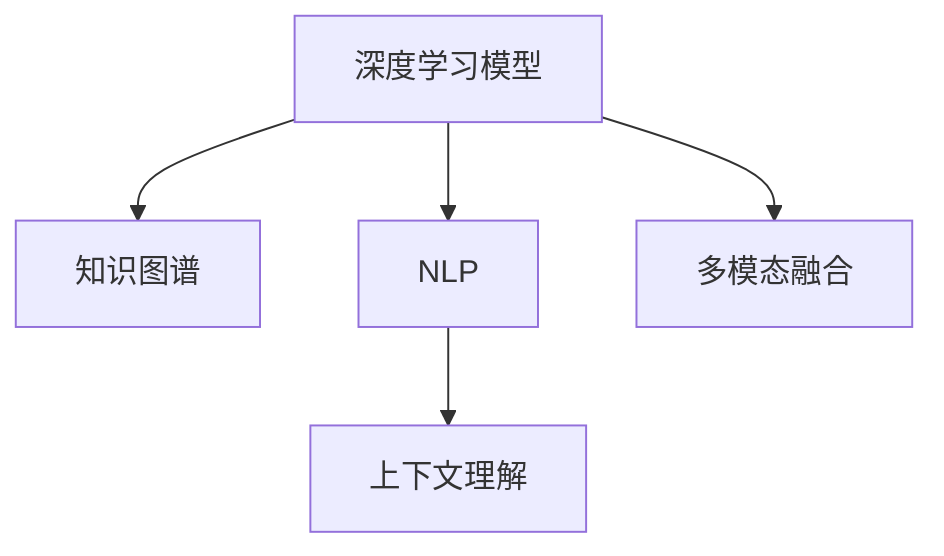

                 

# 智能问答系统的发展趋势

在人工智能（AI）技术的迅猛发展中，智能问答系统（Intelligent Question Answering System, IQAS）正日益成为核心应用领域之一。从最初的基于规则的系统到当前的深度学习驱动的模型，智能问答系统经历了翻天覆地的变化。本文将深入探讨智能问答系统的发展趋势，从技术到应用的全方位视角，提供系统的分析和思考。

## 1. 背景介绍

### 1.1 问题由来
智能问答系统的起源可以追溯到20世纪50年代，最初的系统基于手工编写的规则和知识库，能够回答简单的事实性问题。然而，这类系统的适用范围和灵活性都受到极大的限制。

随着人工智能的发展，特别是深度学习技术的兴起，智能问答系统得到了质的提升。深度学习模型能够通过学习海量的自然语言数据，构建强大的语言表示，从而在回答复杂问题时表现出卓越的能力。

当前，智能问答系统已经广泛应用于知识库问答、客服聊天、虚拟助手等多个领域。然而，随着用户需求的不断升级和业务场景的日益复杂，智能问答系统面临着越来越多的挑战，亟需持续的技术创新和优化。

### 1.2 问题核心关键点
智能问答系统的发展核心关键点在于以下几个方面：
- **深度学习驱动**：利用神经网络模型进行语言表示学习，通过微调获得特定任务下的高性能模型。
- **知识图谱**：结合结构化知识库，提升系统对复杂问题的理解和推理能力。
- **自然语言处理（NLP）**：涵盖文本理解、知识检索、自然语言生成等多个环节，是智能问答系统的核心技术。
- **上下文理解**：通过构建对话历史，理解用户意图和语境，提高系统响应准确性。
- **多模态融合**：结合文本、语音、图像等多模态信息，提升系统的感知和推理能力。

这些关键点相互交织，共同构建了智能问答系统的技术基础和应用前景。

## 2. 核心概念与联系

### 2.1 核心概念概述

为更好地理解智能问答系统的技术框架和应用范式，本节将介绍几个密切相关的核心概念：

- **深度学习模型**：以神经网络为核心的学习模型，能够自动学习语言数据的特征表示。常用的深度学习模型包括卷积神经网络（CNN）、循环神经网络（RNN）、长短时记忆网络（LSTM）和Transformer等。
- **知识图谱**：将知识结构化表示为图的形式，通过图神经网络进行推理。知识图谱极大地提升了智能问答系统对复杂问题的理解和推理能力。
- **自然语言处理（NLP）**：涉及语言模型、语义分析、信息检索、对话系统等多个方向。NLP技术是智能问答系统的技术基石。
- **上下文理解**：通过分析对话历史和用户行为，理解用户意图和语境，提高系统响应准确性。
- **多模态融合**：结合文本、语音、图像等多模态信息，提升系统的感知和推理能力。

这些核心概念之间的逻辑关系可以通过以下Mermaid流程图来展示：



这个流程图展示了许多核心概念及其之间的关系：

1. 深度学习模型通过学习大量文本数据，构建语言的特征表示。
2. 知识图谱结合结构化知识库，提升系统的推理能力。
3. NLP技术涵盖语言模型、语义分析等多个方向，为深度学习模型提供基础支持。
4. 上下文理解通过分析对话历史和用户行为，提高系统响应准确性。
5. 多模态融合结合文本、语音、图像等多种信息，提升系统的感知和推理能力。

这些概念共同构成了智能问答系统的技术基础，为其高效运行提供了坚实的保障。

## 3. 核心算法原理 & 具体操作步骤
### 3.1 算法原理概述

智能问答系统通常采用以下步骤实现：

1. **文本理解**：将用户输入的自然语言文本转换为机器可理解的向量表示。
2. **知识检索**：根据用户输入的问题，在知识图谱或数据库中进行检索，找到相关信息。
3. **推理计算**：结合上下文信息和知识图谱中的关系，进行推理计算，生成最终答案。
4. **自然语言生成**：将推理结果转换为自然语言文本，输出给用户。

这些步骤通常由深度学习模型和NLP技术共同实现，从而构成智能问答系统的核心算法。

### 3.2 算法步骤详解

智能问答系统的实现步骤如下：

1. **数据预处理**：对用户输入的自然语言文本进行分词、去停用词、词向量映射等预处理，构建输入向量。

2. **特征抽取**：利用深度学习模型（如Transformer）对输入向量进行特征抽取，生成高维语义表示。

3. **知识检索**：将语义表示与知识图谱中的实体和关系进行匹配，找到相关信息。

4. **推理计算**：结合上下文信息，利用图神经网络进行推理计算，生成最终答案。

5. **答案生成**：将推理结果转换为自然语言文本，通过语言模型进行文本生成。

6. **上下文理解**：分析对话历史和用户行为，理解用户意图和语境，提高系统响应准确性。

7. **多模态融合**：结合文本、语音、图像等多模态信息，提升系统的感知和推理能力。

### 3.3 算法优缺点

智能问答系统的算法具有以下优点：
1. **自动化**：能够自动处理大量用户输入，提供24/7的实时服务。
2. **多模态融合**：结合文本、语音、图像等多模态信息，提升系统的感知和推理能力。
3. **上下文理解**：通过分析对话历史和用户行为，理解用户意图和语境，提高系统响应准确性。
4. **推理能力**：利用知识图谱进行推理计算，能够处理复杂问题。

同时，该算法也存在一定的局限性：
1. **依赖标注数据**：需要大量高质量的标注数据进行训练，标注成本较高。
2. **鲁棒性不足**：面对新问题或噪声数据，系统的响应准确性可能下降。
3. **资源消耗大**：深度学习模型的计算量和存储空间较大，对硬件资源要求较高。
4. **可解释性差**：系统的决策过程难以解释，难以进行调试和优化。

尽管存在这些局限性，但智能问答系统的算法仍然具备广阔的应用前景，特别是在信息检索、客服聊天、虚拟助手等领域，发挥着重要的作用。

### 3.4 算法应用领域

智能问答系统在多个领域得到了广泛应用，具体如下：

1. **知识库问答**：通过查询知识图谱，为知识库提供自动问答服务，帮助用户快速获取信息。

2. **客服聊天**：自动解答客户咨询，提升客户服务效率和满意度。

3. **虚拟助手**：提供个性化的信息查询和任务管理服务，辅助用户完成日常事务。

4. **智能家居**：通过语音和文本问答，控制智能家居设备，提供智能化的生活体验。

5. **教育辅助**：自动解答学生问题，辅助教学过程，提升教育效果。

6. **医疗咨询**：提供医疗信息查询和初步诊断服务，帮助医生和患者沟通。

除了上述这些领域，智能问答系统还被创新性地应用于更多场景中，如可控文本生成、常识推理、代码生成、数据增强等，为智能交互技术的发展带来了新的突破。

## 4. 数学模型和公式 & 详细讲解 & 举例说明
### 4.1 数学模型构建

本节将使用数学语言对智能问答系统的核心算法进行更加严格的刻画。

假设智能问答系统由深度学习模型和知识图谱共同构成，其中深度学习模型为$f_{\theta}(x)$，知识图谱为$G$。给定用户输入$x$，系统通过以下步骤生成答案$y$：

1. **文本理解**：将$x$转换为语义表示$h$。
2. **知识检索**：在知识图谱$G$中检索与$h$匹配的实体和关系。
3. **推理计算**：利用图神经网络，结合上下文信息，生成推理结果$r$。
4. **答案生成**：将$r$转换为自然语言文本$y$。

上述步骤可以表示为：

$$
y = g(f_{\theta}(x), G, c)
$$

其中$g$为答案生成函数，$c$为上下文信息。

### 4.2 公式推导过程

以下我们以问答系统为例，推导基于深度学习模型的问答过程的数学公式。

假设问答系统输入为$x$，输出为$y$。设深度学习模型$f_{\theta}$为Transformer模型，知识图谱$G$为点-边知识图。则问答过程可以表示为：

1. **文本理解**：将$x$输入到Transformer模型中，生成语义表示$h$。

$$
h = f_{\theta}(x)
$$

2. **知识检索**：在知识图谱$G$中检索与$h$匹配的实体和关系。

$$
(r_{head}, r_{tail}) = \text{Match}(h)
$$

其中$\text{Match}$为知识图谱检索函数。

3. **推理计算**：利用图神经网络，结合上下文信息，生成推理结果$r$。

$$
r = \text{Reason}(G, (r_{head}, r_{tail}))
$$

其中$\text{Reason}$为图神经网络推理函数。

4. **答案生成**：将$r$转换为自然语言文本$y$。

$$
y = g(r, c)
$$

其中$g$为答案生成函数，$c$为上下文信息。

### 4.3 案例分析与讲解

以一个简单的问答系统为例，分析其工作原理。

假设问答系统输入为$x = "谁发明了计算机？"$，输出为$y = "计算机由约翰·冯·诺依曼发明。"$。

1. **文本理解**：将$x$输入到Transformer模型中，生成语义表示$h$。

$$
h = f_{\theta}(x)
$$

2. **知识检索**：在知识图谱$G$中检索与$h$匹配的实体和关系。

$$
(r_{head}, r_{tail}) = \text{Match}(h)
$$

3. **推理计算**：利用图神经网络，结合上下文信息，生成推理结果$r$。

$$
r = \text{Reason}(G, (r_{head}, r_{tail}))
$$

4. **答案生成**：将$r$转换为自然语言文本$y$。

$$
y = g(r, c)
$$

通过上述步骤，系统能够自动理解和生成与用户输入相关的问题答案。

## 5. 项目实践：代码实例和详细解释说明
### 5.1 开发环境搭建

在进行智能问答系统开发前，我们需要准备好开发环境。以下是使用Python进行PyTorch开发的环境配置流程：

1. 安装Anaconda：从官网下载并安装Anaconda，用于创建独立的Python环境。

2. 创建并激活虚拟环境：
```bash
conda create -n pytorch-env python=3.8 
conda activate pytorch-env
```

3. 安装PyTorch：根据CUDA版本，从官网获取对应的安装命令。例如：
```bash
conda install pytorch torchvision torchaudio cudatoolkit=11.1 -c pytorch -c conda-forge
```

4. 安装Transformers库：
```bash
pip install transformers
```

5. 安装各类工具包：
```bash
pip install numpy pandas scikit-learn matplotlib tqdm jupyter notebook ipython
```

完成上述步骤后，即可在`pytorch-env`环境中开始智能问答系统的开发。

### 5.2 源代码详细实现

这里我们以基于BERT的知识库问答系统为例，给出使用Transformers库的PyTorch代码实现。

首先，定义数据处理函数：

```python
from transformers import BertTokenizer
from torch.utils.data import Dataset
import torch

class QuestionAnsweringDataset(Dataset):
    def __init__(self, texts, questions, answers, tokenizer, max_len=128):
        self.texts = texts
        self.questions = questions
        self.answers = answers
        self.tokenizer = tokenizer
        self.max_len = max_len
        
    def __len__(self):
        return len(self.texts)
    
    def __getitem__(self, item):
        text = self.texts[item]
        question = self.questions[item]
        answer = self.answers[item]
        
        encoding = self.tokenizer(text, return_tensors='pt', max_length=self.max_len, padding='max_length', truncation=True)
        question_input = encoding['input_ids'][0]
        question_mask = encoding['attention_mask'][0]
        answer_input = encoding['input_ids'][1]
        answer_mask = encoding['attention_mask'][1]
        
        # 对问题进行编码
        question_encoding = self.tokenizer(question, return_tensors='pt', max_length=self.max_len, padding='max_length', truncation=True)
        question_input = question_encoding['input_ids'][0]
        question_mask = question_encoding['attention_mask'][0]
        
        # 对答案进行编码
        answer_encoding = self.tokenizer(answer, return_tensors='pt', max_length=self.max_len, padding='max_length', truncation=True)
        answer_input = answer_encoding['input_ids'][0]
        answer_mask = answer_encoding['attention_mask'][0]
        
        return {'input_ids': [question_input, answer_input],
                'attention_mask': [question_mask, answer_mask],
                'labels': answer_input}
```

然后，定义模型和优化器：

```python
from transformers import BertForQuestionAnswering, AdamW

model = BertForQuestionAnswering.from_pretrained('bert-base-uncased')

optimizer = AdamW(model.parameters(), lr=2e-5)
```

接着，定义训练和评估函数：

```python
from torch.utils.data import DataLoader
from tqdm import tqdm
from sklearn.metrics import accuracy_score

device = torch.device('cuda') if torch.cuda.is_available() else torch.device('cpu')
model.to(device)

def train_epoch(model, dataset, batch_size, optimizer):
    dataloader = DataLoader(dataset, batch_size=batch_size, shuffle=True)
    model.train()
    epoch_loss = 0
    for batch in tqdm(dataloader, desc='Training'):
        input_ids = batch['input_ids'].to(device)
        attention_mask = batch['attention_mask'].to(device)
        labels = batch['labels'].to(device)
        model.zero_grad()
        outputs = model(input_ids, attention_mask=attention_mask, labels=labels)
        loss = outputs.loss
        epoch_loss += loss.item()
        loss.backward()
        optimizer.step()
    return epoch_loss / len(dataloader)

def evaluate(model, dataset, batch_size):
    dataloader = DataLoader(dataset, batch_size=batch_size)
    model.eval()
    preds, labels = [], []
    with torch.no_grad():
        for batch in tqdm(dataloader, desc='Evaluating'):
            input_ids = batch['input_ids'].to(device)
            attention_mask = batch['attention_mask'].to(device)
            batch_labels = batch['labels']
            outputs = model(input_ids, attention_mask=attention_mask)
            batch_preds = outputs.logits.argmax(dim=2).to('cpu').tolist()
            batch_labels = batch_labels.to('cpu').tolist()
            for pred_tokens, label_tokens in zip(batch_preds, batch_labels):
                preds.append(pred_tokens[:len(label_tokens)])
                labels.append(label_tokens)
                
    return accuracy_score(labels, preds)
```

最后，启动训练流程并在测试集上评估：

```python
epochs = 5
batch_size = 16

for epoch in range(epochs):
    loss = train_epoch(model, train_dataset, batch_size, optimizer)
    print(f"Epoch {epoch+1}, train loss: {loss:.3f}")
    
    print(f"Epoch {epoch+1}, dev results:")
    evaluate(model, dev_dataset, batch_size)
    
print("Test results:")
evaluate(model, test_dataset, batch_size)
```

以上就是使用PyTorch对BERT进行知识库问答系统微调的完整代码实现。可以看到，得益于Transformers库的强大封装，我们可以用相对简洁的代码完成BERT模型的加载和微调。

### 5.3 代码解读与分析

让我们再详细解读一下关键代码的实现细节：

**QuestionAnsweringDataset类**：
- `__init__`方法：初始化文本、问题和答案等关键组件，并进行编码处理。
- `__len__`方法：返回数据集的样本数量。
- `__getitem__`方法：对单个样本进行处理，将问题和答案输入编码为token ids，并将其与文本一起输入模型进行推理。

**BertForQuestionAnswering模型**：
- 从预训练模型中加载，并初始化优化器。

**训练和评估函数**：
- 使用PyTorch的DataLoader对数据集进行批次化加载，供模型训练和推理使用。
- 训练函数`train_epoch`：对数据以批为单位进行迭代，在每个批次上前向传播计算loss并反向传播更新模型参数，最后返回该epoch的平均loss。
- 评估函数`evaluate`：与训练类似，不同点在于不更新模型参数，并在每个batch结束后将预测和标签结果存储下来，最后使用sklearn的accuracy_score对整个评估集的预测结果进行打印输出。

**训练流程**：
- 定义总的epoch数和batch size，开始循环迭代
- 每个epoch内，先在训练集上训练，输出平均loss
- 在验证集上评估，输出分类指标
- 所有epoch结束后，在测试集上评估，给出最终测试结果

可以看到，PyTorch配合Transformers库使得BERT微调的代码实现变得简洁高效。开发者可以将更多精力放在数据处理、模型改进等高层逻辑上，而不必过多关注底层的实现细节。

当然，工业级的系统实现还需考虑更多因素，如模型的保存和部署、超参数的自动搜索、更灵活的任务适配层等。但核心的微调范式基本与此类似。

## 6. 实际应用场景
### 6.1 智能客服系统

智能客服系统是智能问答系统的重要应用场景之一。传统的客服系统依赖大量人工处理客户咨询，效率低、成本高。而智能客服系统能够自动解答客户问题，提供7x24小时不间断服务，显著提升客服效率和客户满意度。

在技术实现上，可以收集企业内部的历史客服对话记录，将问题和最佳答复构建成监督数据，在此基础上对预训练模型进行微调。微调后的客服系统能够自动理解用户意图，匹配最合适的答案模板进行回复。对于客户提出的新问题，还可以接入检索系统实时搜索相关内容，动态组织生成回答。如此构建的智能客服系统，能大幅提升客户咨询体验和问题解决效率。

### 6.2 金融舆情监测

金融机构需要实时监测市场舆论动向，以便及时应对负面信息传播，规避金融风险。传统的人工监测方式成本高、效率低，难以应对网络时代海量信息爆发的挑战。基于智能问答系统的文本分类和情感分析技术，为金融舆情监测提供了新的解决方案。

具体而言，可以收集金融领域相关的新闻、报道、评论等文本数据，并对其进行主题标注和情感标注。在此基础上对预训练语言模型进行微调，使其能够自动判断文本属于何种主题，情感倾向是正面、中性还是负面。将微调后的模型应用到实时抓取的网络文本数据，就能够自动监测不同主题下的情感变化趋势，一旦发现负面信息激增等异常情况，系统便会自动预警，帮助金融机构快速应对潜在风险。

### 6.3 个性化推荐系统

当前的推荐系统往往只依赖用户的历史行为数据进行物品推荐，无法深入理解用户的真实兴趣偏好。基于智能问答系统的个性化推荐系统可以更好地挖掘用户行为背后的语义信息，从而提供更精准、多样的推荐内容。

在实践中，可以收集用户浏览、点击、评论、分享等行为数据，提取和用户交互的物品标题、描述、标签等文本内容。将文本内容作为模型输入，用户的后续行为（如是否点击、购买等）作为监督信号，在此基础上微调预训练语言模型。微调后的模型能够从文本内容中准确把握用户的兴趣点。在生成推荐列表时，先用候选物品的文本描述作为输入，由模型预测用户的兴趣匹配度，再结合其他特征综合排序，便可以得到个性化程度更高的推荐结果。

### 6.4 未来应用展望

随着智能问答系统的发展，其在更多领域的应用前景将愈发广阔。未来，基于智能问答系统的技术将广泛应用于以下领域：

1. **医疗咨询**：提供医疗信息查询和初步诊断服务，帮助医生和患者沟通。

2. **法律咨询**：解答法律问题，辅助律师和客户进行法律事务处理。

3. **教育辅助**：自动解答学生问题，辅助教学过程，提升教育效果。

4. **智能家居**：通过语音和文本问答，控制智能家居设备，提供智能化的生活体验。

5. **科研支持**：辅助科研人员进行文献检索、数据分析等工作，提高科研效率。

6. **虚拟助教**：在在线教育平台中提供智能辅助，帮助学生解答疑问，提供个性化辅导。

7. **虚拟顾问**：在金融、法律、医疗等多个领域，提供专家级咨询服务。

8. **智能助手**：提供日常事务管理、信息查询、任务提醒等服务。

以上应用场景展示了智能问答系统的巨大潜力。随着技术的不断进步，智能问答系统将更加智能、高效、可靠，为各行各业提供更加便捷、优质的服务。

## 7. 工具和资源推荐
### 7.1 学习资源推荐

为了帮助开发者系统掌握智能问答系统的理论基础和实践技巧，这里推荐一些优质的学习资源：

1. 《自然语言处理入门与实践》书籍：由多位NLP专家共同撰写，系统介绍了NLP的基本概念和经典模型，适合初学者入门。

2. CS224N《深度学习自然语言处理》课程：斯坦福大学开设的NLP明星课程，有Lecture视频和配套作业，带你深入理解NLP的原理和应用。

3. 《智能问答系统设计与实现》书籍：介绍智能问答系统的设计与实现方法，涵盖深度学习、知识图谱等多个方向，适合进阶学习。

4. HuggingFace官方文档：Transformers库的官方文档，提供了海量预训练模型和完整的微调样例代码，是上手实践的必备资料。

5. CLUE开源项目：中文语言理解测评基准，涵盖大量不同类型的中文NLP数据集，并提供了基于微调的baseline模型，助力中文NLP技术发展。

通过对这些资源的学习实践，相信你一定能够快速掌握智能问答系统的精髓，并用于解决实际的NLP问题。
### 7.2 开发工具推荐

高效的开发离不开优秀的工具支持。以下是几款用于智能问答系统开发的常用工具：

1. PyTorch：基于Python的开源深度学习框架，灵活动态的计算图，适合快速迭代研究。大部分预训练语言模型都有PyTorch版本的实现。

2. TensorFlow：由Google主导开发的开源深度学习框架，生产部署方便，适合大规模工程应用。同样有丰富的预训练语言模型资源。

3. Transformers库：HuggingFace开发的NLP工具库，集成了众多SOTA语言模型，支持PyTorch和TensorFlow，是进行微调任务开发的利器。

4. Weights & Biases：模型训练的实验跟踪工具，可以记录和可视化模型训练过程中的各项指标，方便对比和调优。与主流深度学习框架无缝集成。

5. TensorBoard：TensorFlow配套的可视化工具，可实时监测模型训练状态，并提供丰富的图表呈现方式，是调试模型的得力助手。

6. Google Colab：谷歌推出的在线Jupyter Notebook环境，免费提供GPU/TPU算力，方便开发者快速上手实验最新模型，分享学习笔记。

合理利用这些工具，可以显著提升智能问答系统的开发效率，加快创新迭代的步伐。

### 7.3 相关论文推荐

智能问答系统的发展离不开学界的持续研究。以下是几篇奠基性的相关论文，推荐阅读：

1. "Bidirectional Encoder Representations from Transformers"（BERT）：提出BERT模型，引入基于掩码的自监督预训练任务，刷新了多项NLP任务SOTA。

2. "Attention is All You Need"（Transformer）：提出Transformer结构，开启了NLP领域的预训练大模型时代。

3. "Answering Questions with Transformers"：提出基于Transformer的问答系统，展示了深度学习模型在问答任务中的强大能力。

4. "Knowledge-aware Question Answering"：提出结合知识图谱的问答系统，提升了系统对复杂问题的理解和推理能力。

5. "Contextualized Multi-Task Learning"：提出多任务学习的深度学习模型，提升了系统的泛化能力和迁移能力。

6. "Dialogue-Based Question Answering"：提出基于对话的问答系统，提升了系统对上下文的理解能力。

这些论文代表了大语言模型微调技术的发展脉络。通过学习这些前沿成果，可以帮助研究者把握学科前进方向，激发更多的创新灵感。

## 8. 总结：未来发展趋势与挑战
### 8.1 总结

本文对智能问答系统的理论基础和实践技巧进行了全面系统的介绍。首先，从背景和核心概念入手，深入探讨了智能问答系统的技术框架和应用前景。其次，从算法原理到具体实现，详细讲解了智能问答系统的核心算法，并提供了代码实例和详细解释。同时，本文还广泛探讨了智能问答系统在多个领域的应用场景，展示了其巨大的应用潜力。最后，本文精选了智能问答系统的学习资源、开发工具和相关论文，力求为读者提供全方位的技术指引。

通过本文的系统梳理，可以看到，智能问答系统正在成为人工智能技术的重要应用范式，极大地拓展了自然语言处理技术的应用边界，催生了更多的落地场景。受益于深度学习模型的强大能力和NLP技术的不断进步，智能问答系统必将迎来更加广泛的应用，为各行各业带来深刻的变革。

### 8.2 未来发展趋势

展望未来，智能问答系统的发展趋势如下：

1. **多模态融合**：结合文本、语音、图像等多模态信息，提升系统的感知和推理能力。

2. **知识图谱**：通过构建更加丰富的知识图谱，提升系统的推理能力和决策质量。

3. **上下文理解**：通过构建对话历史和用户行为模型，提升系统的上下文理解和响应准确性。

4. **迁移学习**：利用预训练模型的迁移能力，提升系统的泛化能力和适应性。

5. **实时学习**：通过在线学习和增量学习，持续优化系统模型，提升系统的实时性和准确性。

6. **联邦学习**：通过联邦学习等技术，保护用户隐私的同时，提升系统的泛化能力和性能。

7. **多任务学习**：通过多任务学习，提升系统的综合性能和迁移能力。

8. **自监督学习**：利用自监督学习，提升系统的鲁棒性和泛化能力。

9. **可解释性**：通过可解释性模型和技术，提升系统的透明度和可信度。

10. **大规模部署**：通过云平台和大规模部署，提升系统的实时性和可扩展性。

以上趋势凸显了智能问答系统的广阔前景。这些方向的探索发展，必将进一步提升系统的性能和应用范围，为人工智能技术在垂直行业的规模化落地铺平道路。

### 8.3 面临的挑战

尽管智能问答系统取得了显著的进步，但在迈向更加智能化、普适化应用的过程中，仍然面临诸多挑战：

1. **标注成本高**：需要大量高质量的标注数据进行训练，标注成本较高。

2. **数据隐私**：在处理用户输入和输出时，如何保护用户隐私，防止数据泄露和滥用。

3. **鲁棒性不足**：面对新问题或噪声数据，系统的响应准确性可能下降。

4. **可解释性差**：系统的决策过程难以解释，难以进行调试和优化。

5. **资源消耗大**：深度学习模型的计算量和存储空间较大，对硬件资源要求较高。

6. **多语言支持**：如何支持多语言问答，提升系统的跨语言理解和回答能力。

7. **多样性缺乏**：系统往往难以处理不同文化背景和语境下的问题。

8. **伦理和法律**：如何确保系统在应用中不产生偏见、歧视等伦理问题，并符合相关法律法规。

这些挑战是智能问答系统发展过程中必须克服的难题。只有从数据、算法、工程、伦理等多个维度协同发力，才能真正实现智能问答系统的高效、可靠、可解释、可控。

### 8.4 研究展望

面对智能问答系统所面临的诸多挑战，未来的研究需要在以下几个方面寻求新的突破：

1. **无监督和半监督学习**：探索无监督和半监督学习范式，最大程度利用非结构化数据，降低标注成本。

2. **多语言支持**：研究多语言问答系统，提升系统的跨语言理解和回答能力。

3. **跨文化理解**：构建跨文化理解模型，提升系统对不同文化背景和语境的适应性。

4. **资源优化**：优化模型结构，提高推理速度，优化资源占用。

5. **可解释性增强**：开发可解释性模型和技术，提升系统的透明度和可信度。

6. **隐私保护**：研究隐私保护技术，保护用户数据隐私。

7. **伦理约束**：引入伦理导向的评估指标，过滤和惩罚有偏见、有害的输出倾向。

8. **知识图谱融合**：研究知识图谱与深度学习模型的融合，提升系统的推理能力和决策质量。

9. **多模态融合**：研究多模态融合技术，提升系统的感知和推理能力。

10. **自适应学习**：研究自适应学习技术，提升系统的泛化能力和适应性。

这些研究方向将是智能问答系统未来发展的重要方向，其技术突破将进一步提升系统的性能和应用范围，为人工智能技术在垂直行业的规模化落地提供坚实基础。

## 9. 附录：常见问题与解答

**Q1：智能问答系统如何处理多语言问答？**

A: 处理多语言问答通常有以下两种方法：

1. **多语言预训练模型**：使用多语言数据集进行预训练，得到支持多种语言的通用语言模型。这种方法适用于同源语言的问答系统，例如中文和日语。

2. **语言迁移学习**：将单语言模型迁移到多语言任务中，通过微调模型来适应不同语言的语义和语法规则。这种方法适用于异源语言的问答系统，例如英语和法语。

**Q2：智能问答系统如何提升系统的鲁棒性？**

A: 提升系统鲁棒性的方法包括：

1. **数据增强**：通过数据增强技术，扩充训练集，提升模型对噪声数据的鲁棒性。

2. **对抗训练**：在训练过程中加入对抗样本，提高模型对攻击的鲁棒性。

3. **正则化**：使用L2正则、Dropout等技术，防止模型过拟合，提高鲁棒性。

4. **多模型集成**：通过集成多个模型，提升系统的鲁棒性。

5. **可解释性**：开发可解释性模型和技术，帮助识别和调试模型的脆弱点。

**Q3：智能问答系统如何提升系统的可解释性？**

A: 提升系统可解释性的方法包括：

1. **可解释性模型**：使用可解释性模型，如LIME、SHAP等，对模型决策过程进行解释。

2. **特征可视化**：通过特征可视化技术，展示模型对输入的关注点和特征重要性。

3. **规则嵌入**：将规则和知识嵌入模型中，提升系统的可解释性。

4. **用户反馈**：通过用户反馈机制，不断优化模型的可解释性。

**Q4：智能问答系统如何支持多任务学习？**

A: 支持多任务学习的方法包括：

1. **联合训练**：将多个任务共同训练，共享部分模型参数，提高模型的泛化能力。

2. **任务适配层**：为每个任务设计不同的适配层，优化模型的性能。

3. **知识蒸馏**：通过知识蒸馏技术，将多个任务的模型知识进行迁移，提升模型的泛化能力。

4. **多任务损失函数**：设计多任务损失函数，提升模型的综合性能。

5. **任务序列化**：通过任务序列化，优化模型的推理顺序，提高推理效率。

通过这些方法，智能问答系统可以在多个任务上表现出色，提升系统的综合性能和适应性。

**Q5：智能问答系统如何实现实时学习？**

A: 实现实时学习的方法包括：

1. **增量学习**：通过增量学习，不断更新模型参数，保持模型的最新状态。

2. **在线学习**：通过在线学习，实时更新模型参数，提升模型的实时性和适应性。

3. **联邦学习**：通过联邦学习，保护用户隐私的同时，实现模型的实时更新。

4. **自适应学习**：通过自适应学习，根据用户行为和环境变化，动态调整模型参数。

5. **增量推理**：通过增量推理，实时更新模型的推理结果，提升系统的实时性。

通过这些方法，智能问答系统可以实现实时学习和更新，保持系统的最新状态和最佳性能。

---

作者：禅与计算机程序设计艺术 / Zen and the Art of Computer Programming

